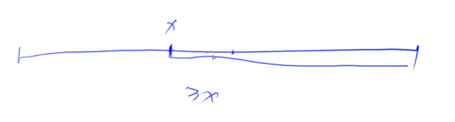
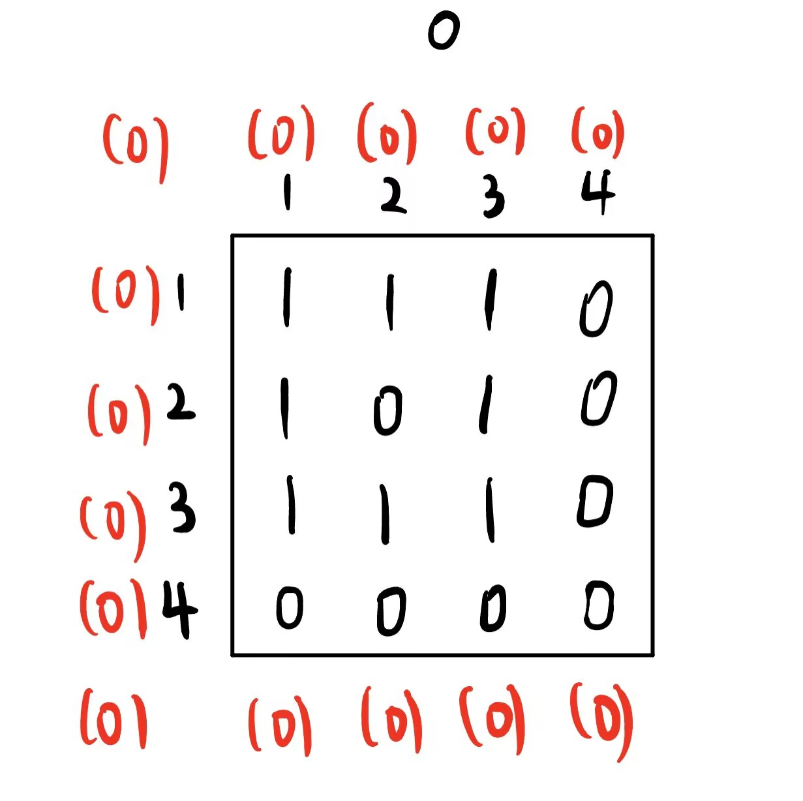
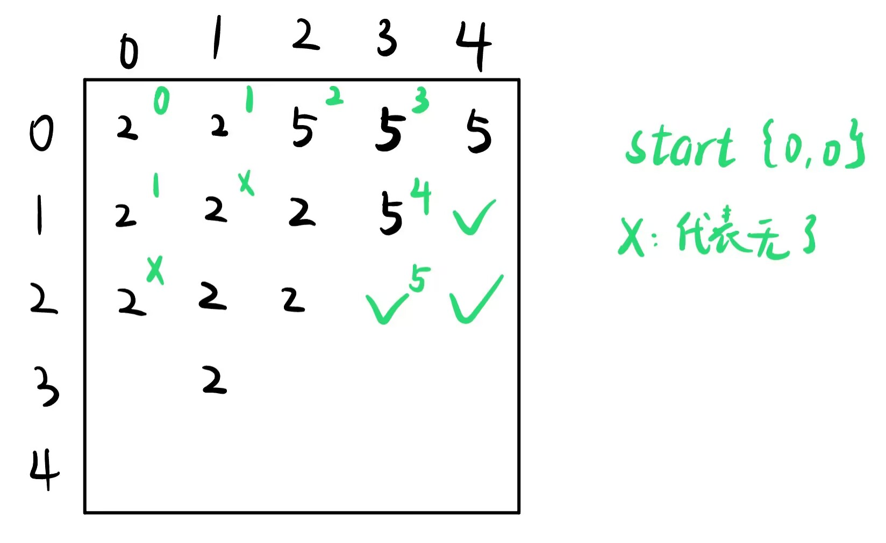

# AcWing 语法基础

## 1.1  变量、input/output、表达式和顺序语句

```c++
#include <iostream>
#include <cstdio>		//包含两个重要函数：printf和scanf
using namespace std;	//使用了std这个命名空间
int main()
{
    cout << "hello world" << endl;
    system("Pause");
    return 0;
}
```

- bool类型 1byte
- char类型  1byte
- int类型     4byte
- float类型  4byte
- double类型  8byte
- long long类型  8byte

## 1.2  判断结构

- 固定宽度

```C++
int main()
{
    int a=1;
    int b=23;
    int c=456;
    printf("%5d!\n",a);
    printf("%5d!\n",b);
    printf("%5d!\n",c);
    system("Pause");
    return 0;
}
```


```C++
int main()
{
    int a=1;
    int b=23;
    int c=456;
    printf("%-5d!\n",a);
    printf("%-5d!\n",b);
    printf("%-5d!\n",c);
    system("Pause");
    return 0;
}
```


```c++
int main()
{
    int a=1;
    int b=23;
    int c=456;
    printf("%05d!\n",a);
    printf("%05d!\n",b);
    printf("%05d!\n",c);
    system("Pause");
    return 0;
}
```


​	float也类似。

## 1.3  循环结构

- while循环

  可以看成循环版的if语句，if语句是判断一次，如果成立就执行后面的语句，while是每次判断，如果成立，则执行循环体的语句，否则停止。

  ```c++
  #include <iostream>
  using namespace std;
  int main()
  {
      int i = 0;
      while(i<10)
      {
          cout << i << end;
          i++;
  	}
      return 0;
  }
  ```


## 1.4  数组

### 1.4.1  一维数组

#### a.  数组的定义

```cpp
int a[100],b;
float c[11];
double d[12];
char e[13];
string g[15];
```

#### b.  数组的初始化

```c++
int a[3]={0,1,2};
int b[]={0,1,2};
//a,b都是定义了一个长度为3的数组
int c[5]={0,1,2};	//定义了这样一个数组：{0,1,1,0,0}
char d[]={'a','b','c'};	//定义了一个长度为3的数组	
int f[100]={0};		//将数组全部初始化为0的写法
```

#### c.  数组的应用

```c++
//斐波那契数列
int main(){
    int f[100];
    f[0]=0;f[1]=1;
    int n;
    cin>>n;
    for(int i=2;i<n;i++){
		f[i]=f[i-1]+f[i-2];
    }
    cout<<f[n]<<endl;
    system("Pause");
    return 0;
}
//输入n，再输出n个整数，将n个整数逆序输出
int main(){	
	int f[100];
	int n;
    cin>>n;
    for(int i=0;i<n;i++){
        cin>>a[i];
    }
    for(int i=n-1;i>=0;i--){
		cout<<a[i]<<' ';
    }
    cout<<endl;
    system("Pause");
    return 0;
}
//输入一个n，在输入n个数，将这个数组顺时针旋转k(k<=n)次。最后将结果输出
//1 2 3 4 5变为
//5 1 2 3 4称为一次旋转
int main(){
	int a[100];
    int n,k;
    cin >> n >> k;
    for(int i=0;i<n;i++){
		cin>>a[i];
    }
    while(k--){
		int t=a[n-1];
        for(int i=n-2;i>=0;i--){
			a[i+1]=a[i];
        }
        a[0]=t;
    }
    for(int i=0;i<n;i++){
		cout<<a[i]<<' ';
    }
    cout<<endl;
    system("Pause");
    return 0;
}
//上例简单做法
//1 2 3 4 5首先变为
//5 4 3 2 1然后翻转前k个，变为
//4 5 3 2 1最后翻转后几个，变为
//4 5 1 2 3
int main(){
    int a[100];
    int n,k;
    cin>>n>>k;
    for(int i=0;i<n;i++){
		cin>>a[i];
    }
    reverse(a,a+n);
    reverse(a,a+k);
    reverse(a+k,a+n);
    for(int i=0;i<n;i++){
	cout<<a[i]<<' ';
    }
    cout<<endl;
    system("Pause");
    return 0
}
```


```c++
//高精度运算2^N
const int N = 3010;
int main(){
    int a[N]={1};
    int n;
    cin>>n;
    int m=1;         //当前位数
    for(int i=0;i<n;i++){
        int t=0;        //进位
        for(int j=0;j<m;j++){
            t+=a[j]*2;
            a[j]=t%10;
            t/=10;
        }
        if(t) a[m++]=1;
    }
    for(int i=m-1;i>=0;i--){
        cout<<a[i]<<' ';
    }
    cout<<endl;
    system("Pause");
    return 0;
}
```

### 1.4.2  二维数组

```C++
int main(){
	int a[3][4];
 	for(int i=0;i<3;i++){
        for(int j=0;j<4;j++){
			a[i][j]=i+j;
        }
    }
    for(int i=0;i<3;i++){
        for(int j=0;j<4;j++){
			cout<<a[i][j]<<' ';
        }
        cout<<endl;
    }
    system("Pause");
    return 0;
}
```


## 1.8  STL、位运算、常用库函数

### 1.8.1  vector

vector是变长数组，支持随机访问，不支持在任意位置```O(1)```插入。为了保证效率，元素的增删一般应该放在末尾进行。

```C++
#include<iostream>
#include<vector>
using namespace std;
int main(){
	vector<int> a({1,2,3});		//相当于动态长度变化的int数组
	vector<int> b[23];	//相当于第一维长23，第二维长度动态变化的int数组
    struct Rec{
        int x,y;
    };
    vector<Rec> c;
    a.size();	//告诉我们数组的实际长度
    a.empty();	//返回一个bool类型，表明vector是否为空
    //以上两个操作的时间复杂度都是O(1)
    a.clear();	//把当前全部元素清空
    迭代器就像一个指针，也类似于数组下标
    vector<int>::iterator it = a.begin();
    //it其实访问的就是a[0]
    //it + 2 访问的就是a[2]
    a.end();	//返回第n个元素再往后的边界
    *a.begin() 与 a[0]的效果是相同的
	//遍历vector,法1
    for(int i = 0;i<a.size();i++){
        cout<<a[i]<<" ";
    }
    cout << endl;
    //遍历vector，法2
    for(vector<int>::iterator i = a.begin();i != a.end();i++){
        cout<<*i<<" ";
    }
    cout<<endl;
    //遍历vector，法3
    for(int x:a){
        cout<< x <<" ";
    }
    //front函数
    a.front();	//返回vector的第一个元素，等价于*a.begin()和a[0]
    //back函数
    a.back();	//返回vector最后一个元素，等价于*==a.end()和a[a.size()-1];
	a.push_back(4);	//数组最后添加一个元素，时间复杂度O(1)
    a.pop_back();	//删除一个元素
    return 0;
}
```

**vector如何实现动态增长空间？**

倍增！

vector常见用途：

- 储存数据
  - 作为数组使用
- 用邻接表存储图

### 1.8.2  队列queue

头文件<queue>主要包括循环队列```queue```和优先队列```priority_queue```这两个容器

- queue(先进先出)

  - ```c++
    #include<iostream>
    #include<queue>
    int main(){
        queue<int> q;
        queue<double> a;
        struct Rec{
            int a,x,y;
        };
        queue<Rec> b;
        q.push(1);	//在队尾插入元素
        q.pop();	//弹出队头元素
        q.front();	//返回队头
        q.back();	//返回队尾
        q = queue<int>();
        return 0;
    }
    ```

  - 常见用途：
    - 需要实现BFS时，可以不用自己动手实现一个队列，而是用queue作为代替

- priority_queue(优先队列)

  - 底层用堆实现

  - 进入的顺序无所谓，弹出只弹最大值

  - ```c++
    #include<iostream>
    #include<queue>
    int main(){
        priority_queue<int> a;  //默认大根堆
        priority_queue<int,vector<int>,greater<int>> b; //小根堆
        struct Rec
        {
            int a,b;
            //以下是重载<符号
            bool operator < (const Rec & t) const{
                return a<t.a;
            }
        };
        priority_queue<Rec> d;  //当用自定义类型时
        //queque、priority_queue没有clear()函数，那么如何清空呢？
        a = priority_queue<int>();
    }
    ```

### 1.8.3  栈stack

```c++
#include<stack>
#include<iostream>
using namespace std;
int main(){
    stack<int> stk;
    stk.push(1);
    stk.top();
    stk.pop();
	return 0;
}
```

### 1.8.4  双端队列deque

两头都可以输入、弹出，时间复杂度是```O(1)```。而vector在开头是```O(n)```，


### 1.8.5  集合set

集合set是一个内部自动有序且不含重复元素的容器

```c++
#include<set>
using namespace std;
int main(){
    set<int> st;	//单独定义一个set
    set<char> name;
    set<node> name;	//node是结构体类型
    set<typename> Arrayname[arraysize];	//set数组
    //Arrayname[0]~Arrayname[arraysize-1]中的每一个都是一个set容器
    
    //set只能通过迭代器访问
    st.insert(3);	//insert函数，时间复杂度O(logN)
    st.insert(5);
    st.insert(3);
    st.insert(4);
    st.clear();
    for(int i=6;i<=10;i++){
        st.insert(i);
    }
    for(set<int>::iterator it = st.begin();it != st.end();it++){
		printf("%d",*it);
    }
    //输出3 4 5(未执行clear以及插入6,7,8,9,10)
    //set内的元素自动递增排序，且自动去除了重复元素
    set<int>::iterator it = st.find(3);
    
    //erase()
    //两种用法：删除单个元素、删除一个区间内的所有元素
    st.erase(st.find(6));
    st.erase(st.find(7));
    //经历clear()以及插入6-10；
    //输出得到8 9 10
    st.erase(8);
    //删除值为8的元素，输出得到9 10
    //clear()后再次插入6-10
    set<int>::iterator it = st.find(8);
    st.erase(it,st.end());
    //输出6 7
	return 0;
}
```

set中元素是唯一的。如果要处理不唯一的情况，则需要使用multiset。另外C++11增加了`unordered_set`，以散列代替set内部的RB树实现，使其可以用来处理只去重但不排序的要求，速度比set要快得多

### 1.8.6  映射map  

map可以将任何基本类型映射到任何基本类型


# AcWing  算法基础

## 第 一 章  基础算法

### 1.  排序

#### 1.1  快速排序

主要思想：分治


对这一串数据进行排序：

- a. 确定分界点

  - 直接取左边界```q[l]```
  - 直接取中间点```q[(l+r)/2]```
  - 直接取右边界```q[r]```
  - 或者随意取一个点

- b. 调整区间。把整个区间，根据分界点```x```的值划分为两部分，使第一个区间的数都小于等于```x```。第二个区间所有的数都大于等于x。

  

- c. 递归处理左右两端。

重难点是第二部调整区间！！！

```c++
开两个额外的数组a[]、b[]
扫描q[l~r]，如果q[i]≤x,就把x放到a[];如果q[i]>x，就把x放到b[]里面
再把a[]、b[]放到q[]
```

比价优美而简洁的做法：==双指针法==(不需要额外开辟一段空间)！


两个指针同时往中间走，```i```指针指向的数小于x的话，最终应该在左半边，接着```i```就往后移动一位，一直移动，直到```i```指向的某个数大于等于x，这个数就应该放到右半边，此时```i```就停下，```j```指针移动！```j```指针同样，```j```指针指向的数大于x就放在右半边，直到```j```指向的数第一次小于等于x，这个数就应该放到左半边


此时把这两个数交换一下，```swap```一下。之后```i```和```j```继续往中间走，直到两者相遇为止

合理性分析：

- 任意时刻，```i```左边所有的数一定是≤x的，同理，```j```右边所有的数一定≥x

实例：


一开始3不满足<3这个条件。左指针停下，右指针满足>3，右指针往前走，3不小于3，左右两个指针所指向的数进行交换


交换完之后，左右指针都向前一个单位


1是满足左指针条件的，所以左指针继续移动，一直移动到3，左指针不满足条件，左指针停下


继续看右指针(绿色的)，不满足右指针条件，停下来。左右两指针已经穿过了，不能交换两指针。

```C++
//快排模板
void quick_sort(int q[],int l,int r){
    if(l>=r) return;
    int x=q[l],i=l-1,j=r+1;
    while(i<j){
        do i++;while(q[i]<x);
        do j--;while(q[j]>x);
        if(i<j) swap(q[i],q[j]);
    }
    quick_sort(q,l,j);
    quick_sort(q,j+1,r);
}
```

#### 1.2  归并排序

思想也是分治。


以数组的最中心为分界点

- 递归排序left、right
- 归并，合二为一(难点)

双指针算法


有2个有序的序列，用两个指针指向两个序列开头的位置。

新建一个数组来存放最终排序的结果。

上面指针的指向的，是上面序列的最小值，下面指针也是同理。

比较两个最小值，将两者最小的值放入新数组中。假设第一次比较上面序列的最小值更小，将其放入新数组中，上序列的指针向后移动一个单位


两个指针继续比较，将更小者放入新数组，以此类推，直到指针到终点


此时，循环可以退出。下方序列剩余元素直接补到新数组中。

```c++
//归并排序模板
void merge_sort(int q[],int l,int r){
    if(l>=r) return;
    int mid=l+r>>1;
    merge_sort(q,l,mid),merge_sort(q,mid+1,r);
    int k=0;    //表示当前temp已经有多少数
    int i=l,j=mid+1;
    while(i<=mid && j<=r){
        if(q[i]<=q[j]) tmp[k++]=q[i++];
        else tmp[k++]=q[j++];
    }
    while(i<=mid) tmp[k++]=q[i++];
    while(j<=r) tmp[k++]=q[j++];
    for(i=l,j=0;i<=r;i++,j++)q[i]=tmp[j];
}
```

### 2.  二分

#### 2.1  整数二分

2022/06/18补充lc模板

```c++
高级版本：
用于查找需要访问数组中当前索引及其直接右邻居索引的元素或条件
class BinarySearch{
    int binarySearch(vector<int>& nums, int target){
        if(nums.size()==0){
            return -1;
        }

        int left = 0, right = nums.size();
        while(left < right){
        // Prevent (left + right) overflow
        int mid = left + (right - left) / 2;
        if(nums[mid] == target){ return mid; }
        else if(nums[mid] < target) { left = mid + 1; }
        else { right = mid; }
        }

        if(left != nums.size() && nums[left]==target) return left;
        return -1;
    }
};
```

二分本质：


在区间上定义某种性质，使得这种性质在右半边是满足的，在左半边是不满足的。找到这个性质利用二分法把分界点给找出来。


二分红绿两个区间的分界点。

```c++
bool check(int x){/**********/}	//检查x是否满足某种性质

//区间[l,r]被划分为[l,mid]和[mid+1,r]时使用
int bsearch_1(int l,int r){
	while(l<r){
		int mid=l+r>>1;
        if(check(mid))
            r=mid;
        else
            l=mid+1;
    }
    return 1;
}
//区间[l,r]被划分为[l,mid-1]和[mid,r]时使用
int bsearch_h(int l,int r){
	while(l<r){
        int mid=l+r+r1>>1;
        if(check(mid))
            l=mid;
        else
            r=mid-1;
    }
    return 1;
}

为什么第一种mid=l+r+1>>1?  ，当l=r-1时，mid=l，防止发生死循环
```

两种模板应该如何选择？以下实例

```c++
给定一个按照升序排列的长度为 n 的整数数组，以及 q 个查询。

对于每个查询，返回一个元素 k 的起始位置和终止位置（位置从 0 开始计数）。

如果数组中不存在该元素，则返回 -1 -1。

    
输入格式：
第一行包含整数 n 和 q，表示数组长度和询问个数。

第二行包含 n 个整数（均在 1∼10000 范围内），表示完整数组。

接下来 q 行，每行包含一个整数 k，表示一个询问元素。

输出格式：
共 q 行，每行包含两个整数，表示所求元素的起始位置和终止位置。

如果数组中不存在该元素，则返回 -1 -1。
```

```c++
输入样例：
6 3
1 2 2 3 3 4
3
4
5
输出样例：
3 4
5 5
-1 -1
```

```c++
#include<iostream>
#include<cstdio>
#include<cmath>
using namespace std;
const int N = 100010;
int n,m;
int q[N];
int main(){
	scanf("%d%d",&n,&m);
    for(int i=0;i<n;i++){
		scanf("%d",&q[i]);
    }
    while(m--){
        int x;
        scanf("%d",&x);
        int l=0,r=n-1;
        while(l<r){
			int mid = l+r >> 1;
            if(q[mid]>=x) r=mid;
            else l=mid+1;
        }
        if(q[l]!=x) cout<<"-1 -1"<<endl;
        else
        {
            cout<<l<<' ';
            int l=0,r=n-1;
            while(l<r){
				int mid = l+r+1 >> 1;
                if(q[mid]<=x) l=mid;
                else r=mid-1;
            }
            cout<<l<<endl;
        }
    }
    system("Pause");
	return 0;
}
```

分析：



找到x的起始位置，性质可以定成≥x，所以从x往右所有的数都满足这个性质，如果去```q[mid]```≥x，那么mid就在右半边，边界就在左半边，更新成```[l,mid]```

另一种情况同理


总结：二分的思想就是在一个区间的内部二分一下边界

#### 2.2  浮点数二分

```c++
bool check(double x){/*...*/}
double bsearch_3(double l,double r){
	const double eps = 1e-6;
    while(r-1>eps){
		double mid=(l+r)/2;
        if(check(mid)) r=mid;
        else l=mid;
    }
    return 0;
}
```

### 3.  高精度

#### 3.1  高精度加法

```c++
//C=A+B,A>=0,B>=0
vector<int> add(vector<int> &A,vector<int> &B){
    if(A.size()<B.size()) return add(B,A);
    int t = 0;
    vector<int> C;
    for(int i=0;i<A.size() || i<B.size();i++){
        if(i<A.size()) t+=A[i];
        if(i<B.size()) t+=B[i];
        C.push_back(t%10);
        t /= 10;
    }
    if(t) C.push_back(1);
    return C;
}
```

#### 3.2  高精度减法

#### 3.3  高精度乘法

```c++
vector<int> mul(vector<int> &A,int b){
    vector<int> C;
    int t=0;    //进位
    for(int i=0;i<A.size() || t;i++){
        if(i<A.size()) t += A[i]*b;
        C.push_back(t%10);
        t /= 10;
    }
}
```

#### 3.4  高精度除法

### 4.前缀和差分

#### 4.1  前缀

有一个数组长度为$n$：$a_1$、$a_2 $、$a_3$、... $a_n$

前缀和数组定义为$S_i$：$S_i=a_1+a_2+a_3+...+a_i$

前缀和下标要从1开始

##### 4.1.1  一维前缀和


### 5.  回溯算法

回溯法也叫做回溯搜索法，是搜索的一种方法。

回溯是递归的副产品，只要有递归就会有回溯。

#### 5.1  回溯法理论基础

##### 5.1.1  回溯法的效率

回溯的本质是穷举，穷举所有可能，然后选出想要的答案。效率比较低。

效率低为什么还要用？因为有一些问题能暴力搜索出就很不错了，最多在进行剪枝以下，以下是只能暴力搜索的问题

##### 5.1.2  回溯法解决的问题

- 组合问题：N个数里面按一定规则找出k个数的集合
- 切割问题：一个字符串按一定规则有几种切割方式
- 子集问题：一个N个数的集合里有多少符合条件的子集
- 排列问题：N个数按一定规则全排列，有几种排列方式
- 棋盘问题：N皇后，解数独等等        

##### 5.1.3  如何理解回溯法

回溯法解决的问题都可以抽象为树形结构，所有回溯法的问题都可以抽象为树形结构。

回溯法解决的都是在集合中递归查找子集，集合的大小就构成了树的宽度，递归的深度。

递归就要有终止条件，所以必然是一棵高度有限的数(N叉树)。

##### 5.1.4  回溯法模板

```c++
伪代码：
void backtracking(参数){
    if(终止条件){
        存放结果;
        return;
    }
    
    for(选择：本层结合中元素(树中节点孩子的数量就是集合的大小)){
        处理节点;
        backtracking(路径，选择列表);	//递归
        回溯，撤销处理结果
    }
}
```

5.2  组合问题

## 第 二 章  数据结构

### 1.  链表与邻接表：树与图的存储

#### 1.1  单链表

用的最多的是邻接表，其主要应用是存储图和树

用数组来模拟链表需要模拟定义一些东西

```e[N]```：某个节点的值是多少

```ne[N]```：下个点next指针是多少

```e```和```ne```是通过下标关联起来的


```c++
在头结点插入一个数：
```


第一步：

将红颜色的指针指向下一个节点的位置

第二步：
将蓝颜色的指针删掉，指向红颜色的指针


```c++
#include<iostream>
#include<string>
#include<algorithm>
#include<cstdio>
using namespace std;
const int N = 100010;
//head表示头结点的下标
//e[i]表示节点i的值
//ne[i]表示节点i的next指针是多少
//idx存储当前已经用到了哪个点
int head,e[N],ne[N],idx;
void init(){
    //初始化
    head = -1;
    idx = 0;
}
void add_to_head(int x){
    //将x插到头结点
    e[idx] = x;
    ne[idx] = head;
    head = idx;
    idx++;
}
void add(int k,int x){
    //将x查到下标为k的节点后面
    e[idx]=x;
    ne[idx]=ne[k];
    ne[k]=idx;
    idx++;
}
void remove(int k){
    //将下标为k的点的后面点删除
    ne[k] = ne[ne[k]];
}
int main(int argc,char *argv[]){
    int m;
    cin>>m;
    init();
    while(m--){
        int k,x;
        char op;
        cin >> op;
        if(op == 'H'){
            cin >> x;
            add_to_head(x);
        }
        else if(op == 'D'){
            cin >> k;
            if(!k) head = ne[head];
            remove(k-1);
        }
        else{
            cin >> k >> x;
            add(k-1,x); 
        }
    }
    for(int i = head;i != -1;i=ne[i])cout<<e[i]<<' ';
    cout<<endl;
    system("Pause");
    return 0;
}
```

- 链表的一些补充

  - ```c++
    struct node{
    	typename data;	//数据域
        node* next;		//指针域
    };
    ```

  - 数据域一般存放结点要存储的数据，指针域指向下一个结点的位置。

  - 头结点一般称为`head`，且其数据域不存放任何内容。最后一个结点的`next`指针指向`NULL`，即空地址，表示一条链表的结尾

  - 链表的创建

    ```c++
    struct node{
      int data;
      node* next;
    };
    node* create(int Array[]){
      node *p,*pre,*head; //pre保存当前结点的前驱结点，head为头结点
      head = new node;    //创建头结点
      head->next = NULL;  //头结点不需要数据域，指针域初始为NULL
      pre = head;         //记录pre为head
      for(int i=0;i<5;i++){
        p = new node;     //新建结点
        p->data = Array[i];
        p->next = NULL;
        pre->next = p;    //前驱结点的指针域设为当前新建结点的地址
        pre =  p;
      }
      return head;        //返回头结点指针
    }
    
    //查找元素
    int search(node* head,int x){
      int count = 0;
      node* p = head->next;
      while(p != NULL){
        if(p->data == x){
          count++;
        }
        p = p->next;
      }
      return count;
    }
    
    //将x插入以head为头结点的链表的第pos个地址上
    void insert(node* head,int pos,int x){
      node* p = head;
      for(int i=0;i<pos-1;i++){
        //pos-1是为了到插入位置的前一个结点
        p = p->next;
      }
      node* q = new node;   //新建结点
      q->data = x;
      q->next = p->next;    //新结点的下一个结点指向原先插入位置的结点
      p->next = q;          //前一个位置的结点指向新结点
    }
    
    //删除以head为头结点的链表中所有数据域为x的点
    void del(node* head,int x){
      node* p = head->next;   //p从第一个结点开始枚举
      node* pre = head;       //pre始终保存p的前驱结点的的指针
      while(p != NULL){
        if(p->data == x){
          pre->next = p->next;
          delete(p);
          p = pre->next;
        }
        else{
          //如果不数据域不是x，pre和p都要向后移一位
          pre = p;
          p = p->next;
        }
      }
    }
    int main(){
      int Array[5] = {5,3,6,1,2};
      node* L = create(Array);  //新建链表，返回的头指针head赋给L
      search(L,3);				//返回1
      insert(L,3,4);			//输出5,3,4,6,1,2
      del(L,1);					//输出5,3,4,6,2
      L = L->next;              //从第一个结点开始有数据域
      while(L != NULL){
        cout << L->data <<" ";
        L = L->next;
      }
      cout << endl;
      system("Pause");
      return 0;
    }
    ```

  - 移除元素LC203
  
    - ```C++
      class Solution {
      public:
          ListNode* removeElements(ListNode* head, int val) {
              ListNode* dummyHead = new ListNode(0); // 设置一个虚拟头结点
              dummyHead->next = head; // 将虚拟头结点指向head，这样方面后面做删除操作
              ListNode* cur = dummyHead;
              while (cur->next != NULL) {
                  if(cur->next->val == val) {
                      ListNode* tmp = cur->next;
                      cur->next = cur->next->next;
                      delete tmp;
                  } else {
                      cur = cur->next;
                  }
              }
              head = dummyHead->next;
              delete dummyHead;
              return head;
          }
      };
      ```
  
  - 典中典之反转链表
  
    - ```c++
      class Solution {
      public:
          ListNode* reverseList(ListNode* head) {
              //双指针
              ListNode* temp;     //保存cur的下一个结点
              ListNode* cur = head;
              ListNode* pre = NULL;
              while(cur != NULL){
                  temp = cur->next;     时   //保存cur的下一个结点，因为接下来要改变cur->next
                  cur->next = pre;        //翻转操作
                  //更新pre和cur指针
                  pre = cur;
                  cur = temp;
              } 
              return pre;
          }
      };
      ```
  
      ```c++
      ----------------------------以上是核心代码模式------------------------------------------------------------以下是ACM模式--------------------------------
      ```
      
      ```c++
      #include <iostream>
      using namespace std;
      struct ListNode                            //链表节点的结构体
      {
        int val;
        ListNode* next;
        ListNode() :val(0), next(nullptr) {}
        ListNode(int _val) :val(_val), next(nullptr) {}
        ListNode(int _val, ListNode* _next) :val(_val), next(_next) {}
      };
      ListNode* create(int n)                    //自动建立链表函数
      {
        ListNode* dummy = new ListNode(0), * p = dummy;
        while (n--)
        {
            int tmp;
            cin >> tmp;
            p = p->next = new ListNode(tmp);
        }
        return dummy->next;
      }
      ListNode* reverseList(ListNode* head)      //反转链表函数
      {
      	ListNode* temp; // 保存cur的下一个节点
          ListNode* cur = head;
          ListNode* pre = NULL;
          while(cur) {
              temp = cur->next;  // 保存一下 cur的下一个节点，因为接下来要改变cur->next
              cur->next = pre; // 翻转操作
              // 更新pre 和 cur指针
          	pre = cur;
              cur = temp;
          }
          return pre;
      }
      int main()
      {
        int n;
        cin >> n;
        ListNode *head = create(n);
        auto reverse_head = reverseList(head);
        auto p = reverse_head;
        while (p)                                //循环打印反转后的链表
        {
            cout << p->val << " ";
            p = p->next;
        }
        system("Pause");
        return 0;
      }
      ```
      
      

#### 1.2  双链表


```C++
// e[]表示节点的值，l[]表示节点的左指针，r[]表示节点的右指针，idx表示当前用到了哪个节点
int e[N], l[N], r[N], idx;

// 初始化
void init()
{
    //0是左端点，1是右端点
    r[0] = 1, l[1] = 0;
    idx = 2;
}

// 在节点a的右边插入一个数x
void insert(int a, int x)
{
    e[idx] = x;
    l[idx] = a, r[idx] = r[a];
    l[r[a]] = idx, r[a] = idx ++ ;
}

// 删除节点a
void remove(int a)
{
    l[r[a]] = l[a];
    r[l[a]] = r[a];
}
```

### 2.  栈与队列：单调队列、单调栈


栈：后进先出

队列：先进先出

#### 2.1  单调栈

```c++
//tt表示栈顶
int stk[N],tt = 0;
//向栈顶插入一个数
stk[++ tt] = x;
//从栈顶弹出一个数
tt --;
//栈顶的值
stk[tt];
//判断栈是否为空
if(tt > 0){

}
```


```c++
#include<iostream>
#include<string>
#include<algorithm>
#include<cstdio>
using namespace std;
const int N = 100010;
int n;
int stk[N],tt;
int main(int argc,char *argv[]){
    cin >> n;
    for(int i = 0;i<n;i++){
        int x;
        cin >> x;
        while(tt && stk[tt]>=x){
            //如果栈不为空，从栈顶开始遍历，将比x大的数出栈
            //出栈的数比x大，且在x左边
            //满足(),那么栈顶元素永远都不会被用到
            tt--;
        }
        if(tt) cout<<stk[tt]<<' ';
        //栈为不为空，则栈顶元素是在x左边且第一个比x小的数
        else cout<<-1<<' ';
        //栈为空说明栈的元素都比

        stk[++ tt] = x;
    }
    system("Pause");
    return 0;
}
```


#### 2.2  单调队列


窗口可以用单调队列来维护：

+ 首先在队尾插入1，再插入-3，再插入-1
+ 然后将-3从队尾插入，把1从队头弹出

暴力解法：

把队列元素都遍历一遍。时间复杂度是```O(k)```——滑动窗口有k个元素。总共有n个元素，总时间复杂度是O(nk)。

```c++
-------------------如何优化-------------------
```

与单调栈类似，找出没有用的元素将其踢出

```c++
#include<iostream>
using namespace std;
const int N = 1e6 + 10;
int n, k, q[N], a[N];//q[N]存的是数组下标
int main()
{
    int tt = -1, hh=0;//hh队列头 tt队列尾
    cin.tie(0);
    ios::sync_with_stdio(false);
    cin>>n>>k;
    for(int i = 0; i <n; i ++) cin>>a[i];
    for(int i = 0; i < n; i ++)
    {
        //维持滑动窗口的大小
        //当队列不为空(hh <= tt) 且 当当前滑动窗口的大小(i - q[hh] + 1)>我们设定的
        //滑动窗口的大小(k),队列弹出队列头元素以维持滑动窗口的大小
        if(hh <= tt && k < i - q[hh] + 1) hh ++;
        //构造单调递增队列
        //当队列不为空(hh <= tt) 且 当队列队尾元素>=当前元素(a[i])时,那么队尾元素
        //就一定不是当前窗口最小值,删去队尾元素,加入当前元素(q[ ++ tt] = i)
        while(hh <= tt && a[q[tt]] >= a[i]) tt --;
        q[ ++ tt] = i;
        if(i + 1 >= k) printf("%d ", a[q[hh]]);
    }
    puts("");
    hh = 0,tt = -1;
    for(int i = 0; i < n; i ++)
    {
        if(hh <= tt && k < i - q[hh] + 1) hh ++;
        while(hh <= tt && a[q[tt]] <= a[i]) tt --;
        q[ ++ tt] = i;
        if(i + 1 >= k ) printf("%d ", a[q[hh]]);
    }
    return 0;
}
```

c++实现一个循环队列！！！！！！！！！！！！！

### 3.  KMP

#### 3.1  KMP应用

主要应用在字符串匹配上。

当出现字符串不匹配时，可以知道一部分之前已经匹配的文本内容，可以利用这些信息避免从头再去做匹配类名


#### 3.2  暴力解法

两层for循环，第一层遍历文本串，第二层遍历模式串，之后挨个匹配

```c++
aa   aa  bb  aa  aa bf！
到bf就不匹配了
```


匹配不上就要继续移动，直到移动到


这种暴力做法的时间复杂度明显是```O(m*n)```。

#### 3.3  KMP算法

在bf不匹配之后，会跳到之前匹配过的内容


至于为什么跳到```b```，要利用前缀表的知识。

#### 3.4  前缀与后缀

==前缀==就是包含首字母，不包含尾字母的所有子串。在模式串```aabaaf```中，前缀就是

```c++
a
aa
aab
aaba
aabaa
```

以上五个都是前缀。

==后缀==就是包含尾字母，不包含首字母的所有子串。在模式串```aabaaf```中，后缀就是

```c++
f
af
aaf
baaf
abaaf
```

这五个都是后缀，```aabaaf```就不是后缀，因为它包含首字母。

#### 3.5  最长相等前后缀

```c++
a		0
aa		1
aab		0
aaba	1
aabaa	2
aabaaf	0
```

以上即前缀表：0 1 0 1 2 0

#### 3.6  使用前缀表的匹配过程


到f时发生不匹配，不匹配之后要找它的前面的子串，找子串的最长相等前后缀是多少。前缀表中最大是2，这个2意味着此处有一个后缀aa，前面也有一个与其相等的前缀aa，在后缀aa的后面不匹配了，那么就要找与其相等的前缀的后面继续开始匹配，前缀的后面的下标是2(b)


#### 3.7  next数组

在遇见冲突的地方后，next数组告诉我们要回退到哪里。

#### 3.8  代码实现

步骤：

- 初始化 
- 前后缀不同？
- 前后缀相同
- 更新next数组

```c++
void getNext(int *next,const string& s){
	int j = 0;
    //定义两个指针i和j，j指向前缀末尾位置，i指向后缀末尾位置
    next[0] = 0;
    //初始化至此完成
    //i的初始化是进入到循环遍历的过程了
    for(int i = 1;i<s.size();i++){
        //j是前缀的末尾，要比较前缀和后缀所对应的字符是否相等，i就应该从1开始
		while(j>0 && s[i] != s[j]){
            //j要保证大于0，因为下面有取j-1作为下标数组的操作
            j = next[j-1];
            //要找前一位的对应的回退位置
        }
        if(s[i] == s[j]){
            j++;
        }
        next[i] = j;
	}
}
int strStr(string haystack,string needle){
    if(needle.size() == 0){
        return 0;
    }
    int next[needle.size()];
    getNext(next,needle);
    int j = 0;
    for(int i=0;i<haystack.size();i++){
        while(j>0 && haystack[i] != needle[j]){
            j = next[j-1];
        }
        if(haystack[i]==needle[j]){
            j++;
        }
        if(j == needle.size()){
            return (i-needle.size()+1);
            j = ne[j];
        }
    }
    return -1;
}
int main(){
    string s;
    string t;
    cin >> s >> t;
    printf("%d",strStr(s,t));
    system("Pause");
	return 0;
}

```

以上是返回第一个下标的实现，下面是多个下标的实现

```c++
#include<iostream>
#include<vector>
 
using namespace std;
 
vector<int> getNext(string pattern){
    int k = -1; //匹配的前缀长度，-1代表长度为0
    vector<int> next(pattern.length(), -1);
    for(int i = 1; i < pattern.length(); i++){
        while(k > -1 && pattern[k + 1] != pattern[i]){
            k = next[k];
        }
        if(pattern[k + 1] == pattern[i]){
            k = k + 1;
        }
        next[i] = k;
    }
    return next;
}
 
vector<int> KMP(string str, string pattern){
    vector<int> next = getNext(pattern);
    int k = -1;
    vector<int> res;
    for(int i = 0; i < str.length(); i++){
        while(k > -1 && pattern[k + 1] != str[i]){
            k = next[k];
        }
        if(pattern[k + 1] == str[i]){
            k = k + 1;
        }
        if(k == pattern.length() - 1){
            res.push_back(i - pattern.length() + 1);
            k = -1;
        }
    }
    return res;
}
 
int main(){
    string str, pattern;
    cin >> str >> pattern;
    vector<int> res = KMP(str, pattern);
    if(res.empty()){
        cout << -1 << endl;
    }else{
        for(int i = 0; i < res.size(); i++){
            cout << res[i] << " ";
        }
    }
    return 0;
}
```

### 4.  Tire树

用来快速存储和查找字符串集合的数据结构

```
abcdef
abdef
aced
bcdf
bcff
cdaa
bcdc
```


记得在每个字符串结尾的地方做一个标记以示结束。

表示以当前点结尾的是有一个单词的

以上即Tire树的存储

以下是Tire树的查找过程：

假设查找aced，从根节点开始走，```a->c->e->d->```

查找一个不存在的？abcf不存在

再一个例子，abcd，在这个字符串中d处没有结束的标志，也认为不存在。

代码实现：


```c++
#include <iostream>
#include <string>
#include <cmath>
#include <cstdio>
#include <vector>
#include <deque>
using namespace std;
const int N = 10010;
char str[N];
int son[N][26]; //存储Tire树中每个点的所有儿子
int cnt[N];     //存储以当前这个点结尾的单词有多少个
int idx;        //存储当前所用到的下标。下标为0的点既是根节点又是空节点
void insert(char str[]){
    //存储操作
    int p = 0;
    for(int i = 0;str[i];i++){
        //c++中字符串结尾是\0，以此用来判断是否走到结尾
        //每一次把当前这个字母对应的子节点编号计算出来
        int u = str[i]-'a';
        if(!son[p][u]) son[p][u] = ++idx;
        p = son[p][u];
    }
    cnt[p]++;
}
int query(char str[]){
    //返回字符串返回多少次
    int p = 0;
    for(int i = 0;str[i];i++){
        int u = str[i]-'a';
        if(!son[p][u]) return 0;
        p = son[p][u];
    }
    return cnt[p];
}
int main(){
    int n;
    scanf("%d",&n);
    while (n--)
    {
        char op[2];
        scanf("%s%s",op,str);
        if(op[0] == 'I')insert(str);
        else printf("%d\n",query(str));
    }
    
    system("Pause");
	return 0;
}
```

### 5.  并查集

**快速处理：**

- 将两个集合合并
- 询问良两个元素是否在一个集合当中

**基本原理：**

用树的形式维护一个集合。树根的编号就是整个集合的编号。每个节点存储它的父节点。p[x]表示x的父节点。

**如何判断树根p[x]：**```if(p[x] == x)```

**如何求x的编号：**```while(p[x] != x) x=p[x];```

**如何合并两个集合？**p[x]是x的集合编号，p[y]是y的集合编号。p[x] = y。

**优化方面：**路径压缩！


优化后时间复杂度接近```O(1)```

代码实现：


```C++
#include<iostream>

using namespace std;

const int N=100010;
int p[N];//定义多个集合

int find(int x)
{
    if(p[x]!=x) p[x]=find(p[x]);
    /*
    经上述可以发现,每个集合中只有祖宗节点的p[x]值等于他自己,即:
    p[x]=x;
    */
    return p[x];
    //找到了便返回祖宗节点的值
}

int main()
{
    int n,m;
    scanf("%d%d",&n,&m);
    for(int i=1;i<=n;i++) p[i]=i;
    while(m--)
    {
        char op[2];
        int a,b;
        scanf("%s%d%d",op,&a,&b);
        if(*op=='M') p[find(a)]=find(b);//集合合并操作
        else
        if(find(a)==find(b))
        //如果祖宗节点一样,就输出yes
        printf("Yes\n");
        else
        printf("No\n");
    }
    return 0;
}
```

### 6.  堆(手写)

堆是用来维护数据集合的。

包含以下操作;

- 插入一个数
- 求集合中的最小值
- 删除最小值
- 删除任意一个元素(stl无法直接实现)
- 修改任意一个元素(stl无法直接实现)

堆是一棵完全二叉树(最后一层从左到右依次排列)。


介绍小根堆(每个节点都<=左右儿子)，所以根节点就是整棵树的最小值。

 存储方式：


堆的基本操作：

- down(x) 

  - 

    将头结点的值改为6

    改为6之后，6肯定要往下移动。如何移动？找到6 3 4 三个点中找到最小值，6和3进行交换。为什么不能和4交换，因为交换完之后不满足堆的定义了。

    

    继续进行交换

    

    直到不能继续操作为止

  - down()的操作就是说，如果把某一个值变大了就要把它往下移动。

- up(x)
  - 与down操作相反，只需跟父节点进行比较。

如何利用down()与up()实现5种操作？

用size()表示当前堆的大小，heap表示堆

- 插入一个数
  - ```heap[ ++ size] = x;up(size);```
- 求集合中的最小值
  - ```heap[1]```
- 删除最小值
  - 用堆的最后一个元素覆盖掉堆顶节点，然后把堆顶元素down下来
  - ```heap[1] = heap[size];size--;down(1);```
- 删除任意一个元素
  - ```heap[k] = heap[size];size--;down(k);up(k);```

- 修改任意一个元素
  - ```heap[k] = x;down(k);up(k);```

代码实现：


```c++
#include <iostream>

using namespace std;

int const N = 100010;

//h[i] 表示第i个结点存储的值，i从1开始，2*i是左子节点，2*i + 1是右子节点
//size 既表示堆里存储的元素个数，又表示最后一个结点的下标
int h[N], siz; //堆有两个变量h[N]，size; 怎么这里的size和文件里有冲突，只能改成siz了

void down(int u)
{
    int t = u;//t存储三个结点中存在的最小的结点的下标，初始化为当前结点u
    if (u * 2 <= siz && h[u * 2] < h[t]) t = u * 2; // 左子节点存在并且小于当前结点，更新t的下标
    if (u * 2 + 1 <= siz && h[u * 2 + 1] < h[t]) t = u * 2 + 1;//右子节点存在并且小于当前结点，更新t的下标
    if (t != u)//如果t==u意味着不用变动，u就是三个结点中拥有最小值的结点下标，否则交换数值
    {
        swap(h[t], h[u]);
        down(t); //交换数值后，t这个结点存储原本u的值，u存储存储t的值（三个数中的最小值）。u不用调整了，但t情况不明，可能需要调整。直到它比左右子节点都小
    }
}
void up(int u){
	while(u / 2 && h[u / 2]>h[u]){
        swap(h[u/2],h[u]);
        u /= 2;
    }
}
int main()
{
    int n, m;
    cin >> n >> m;
    for (int i = 1; i <= n; i ++ ) scanf("%d", &h[i]); 
    siz = n; //初始化size,表示堆里有n 个元素

    for (int i = n / 2; i; i --) down(i); //把堆初始化成小根堆，从二叉树的倒数第二行开始，把数字大的下沉

    while (m -- )
    {
        printf("%d ", h[1]);
        h[1] = h[siz];
        siz --;
        down(1);
    }

    return 0;
}
```


### 7.  树

#### 7.1  二叉树的存储结构与基本操作

a.  链式存储

```c++
struct TreeNode{
    int val;	//数据域
    TreeNode* left;		//指向左子树根节点的指针
    TreeNode* right;	//指向右子树根节点的指针	
    TreeNode(int x):val(x),left(NULL),right(NULL){}
};
```

b.  基本操作

- 新建节点

  - ```c++
    struct node{
        int val;
        node* left;
        node* right;
    };
    node* newNode(int val){
        node* Node = new node;  //申请一个node型变量的地址空间
        Node->val = val;        //结点权值为val
        Node->left = Node->right = NULL;    //初识状态下没有左右孩子
        return Node;    //返回新建结点的地址
    }
    ```

- 二叉树结点的查找、修改

  - 在给定数据域的条件下，在二叉树中找到所有数据域为给定数据域的结点，并将它们的数据域修改为指定的数据域。

  - ```c++
    void search(node* root,int x,int newdata){
        if(root == NULL){
            return;
        }
        if(root->val == x) root->val == newdata;    //找到数据域为x的结点，把它修改为newdata
        search(root->left,x,newdata);   //往左子树搜索x
        search(root->right,x,newdata);  //往右子树搜索x
    }
    ```

- 二叉树结点的插入

  - ```c++
    void insert(node* &root,int x){
        if(root == NULL){
            root = newNode(x);
            return;
        }
        if(由二叉树的性质，x应该插在左子树){
            insert(root->left,x);
        }
        else{
            insert(root->right,x);
        }
    }
    ```

- 二叉树的创建

  - 创建即结点的插入过程。把需要插入的数据存储在数组中，将它们使用insert函数插入二叉树中，并返回根节点的指针root

  - ```c++
    node* create(int data[],int n){
        node* root = NULL;  //新建空根节点root
        for(int i = 0;i<n;i++){
            insert(root,data[i]);
        }
        return root;
    }
    ```

#### 7.2  二叉树的递归遍历

首先二叉树有两种遍历方式

- 深度优先遍历
  - 前序遍历(递归法，迭代法)
  - 中序遍历(递归法，迭代法)
  - 后序遍历(递归法，迭代法)
  - 前中后其实指的是中间节点的遍历顺序
  - 以上三种无论是哪一种，左子树一定先于右子树遍历
- 广度优先遍历
  - 层次遍历(迭代法)

##### 7.2.1  前序遍历

先是递归遍历。递归遍历要确定三要素：==递归函数的参数和返回值==、==终止条件==、==单层递归的逻辑==

二叉树的递归定义中的递归边界是二叉树为一棵空树

```c++
void preorder(node* root){
    if(root == NULL){
        return;     //到达空树，递归边界
    }
    printf("%d\n",root->val);
    preorder(root->left);
    preorder(root->right);
}
```


```A->B->D->E->C->F```

对于一棵二叉树的前序遍历，序列的第一个一定是根结点。

##### 7.2.2  中序遍历

左子树->根节点->右子树

```c++
void inorder(node* root){
    if(root == NULL){
        return;     //到达空树，递归边界
    }
    inorder(root->left);
    printf("%d\n",root->val);
    inorder(root->right);
}
```


```D->B->E->A->C->F```

##### 7.2.3  后序遍历

左子树->右子树->根结点

```c++
void postorder(node* root){
    if(root == NULL){
        return;
    }
    postorder(root->left);
    postorder(root->right);
    printf("%d\n",root->val);
}
```


```D->E->B->F->C->A```

```c++
三种递归遍历一起实现
//核心代码模式
class Solution {
public:
    vector<int> r1,r2,r3;
    void preOrder(TreeNode* root,vector<int> &vec){
        if(root == NULL){
            return;
        }
        vec.push_back(root->val);
        preOrder(root->left,vec);
        preOrder(root->right,vec);
    }
    void inOrder(TreeNode* root,vector<int> &vec){
        if(root == NULL){
            return;
        }
        inOrder(root->left,vec);
        vec.push_back(root->val);
        inOrder(root->right,vec);
    }
    void postOrder(TreeNode* root,vector<int> &vec){
        if(root == NULL){
            return;
        }
        postOrder(root->left,vec);
        postOrder(root->right,vec);
        vec.push_back(root->val);
    }
    vector<vector<int> > threeOrders(TreeNode* root) {
        preOrder(root, r1);
        inOrder(root, r2);
        postOrder(root, r3);
        vector<vector<int>> res;
        res = {r1,r2,r3};
        return res;
    }
};
//ACM模式
#include <iostream>
#include <vector>
using namespace std;
struct TreeNode{
    int val;
    TreeNode* left;
    TreeNode* right;
    TreeNode(int value):val(value),left(nullptr),right(nullptr){}
};
//建树
void CreateTree(TreeNode* root, int x){
    if(!x) return;
    int p,l,r;
    cin >> p >> l >> r;
    if(l != 0){
        TreeNode* left = new TreeNode(l);
        root->left = left;
        CreateTree(left,x-1);
    }
    if(r != 0){
        TreeNode* right = new TreeNode(r);
        root->right = right;
        CreateTree(right,x-1);
    }
}
void preOrder(TreeNode* root,vector<int> &vec){
        if(root == NULL){
            return;
        }
        vec.push_back(root->val);
        preOrder(root->left,vec);
        preOrder(root->right,vec);
    }
void inOrder(TreeNode* root,vector<int> &vec){
        if(root == NULL){
            return;
        }
        inOrder(root->left,vec);
        vec.push_back(root->val);
        inOrder(root->right,vec);
    }
void postOrder(TreeNode* root,vector<int> &vec){
        if(root == NULL){
            return;
        }
        postOrder(root->left,vec);
        postOrder(root->right,vec);
        vec.push_back(root->val);
    }
int main(){
    int N,first;    //N表示二叉树的总结点个数，first表示二叉树的根结点
    cin >> N >> first;
    TreeNode* root = new TreeNode(first);
    CreateTree(root,N);
    vector<int> res;
    preOrder(root, res);
    for(int i = 0;i<res.size();i++){
        cout<<res[i]<<" ";
    }
    cout << endl;
    res.clear();
    inOrder(root,res);
    for(int i = 0;i<res.size();i++){
        cout<<res[i]<<" ";
    }
    cout << endl;
    res.clear();
    postOrder(root,res);
    for(int i = 0;i<res.size();i++){
        cout << res[i] << " ";
    }
    cout << endl;
    system("Pause");
    return 0;
}
```

##### 7.2.4  层序遍历


- 将根结点`root`加入队列q
- 取出队首结点，访问它
- 如果该结点有左孩子，将左孩子入队
- 如果该结点有右孩子，将右孩子入队
- 返回第二步，直至队列为空

```c++
struct node{
    int data;
    node* lchild;
    node* rchild;
};
void LayerOrder(node* root){
    queue<node*> q;
    q.push(root);
    while(!q.empty()){
        node* now = q.front();
        q.pop();
        cout << now->data;
        if(now->lchild != NULL) q.push(now->lchild);
        if(now->rchild != NULL) q.push(now->rchild);
    }
}
```


#### 7.3 二叉树的迭代遍历

##### 7.3.1  前序遍历(迭代法)

```c++
class Solution{
public:
    vector<int> preorderTraversal(TreeNode* root){
        stack<TreeNode*> st; 
        vector<int> result;
        if(root == NULL) return result;
        st.push(root);
        while(!st.empty()){
            TreeNode* now = st.top();
            st.pop();
            result.push_back(now->val);
            if(now->left != nullptr) st.push(now->left);
            if(now->right != nullptr) st.push(now->right);
        }
        return result;
    }
};
```

##### 7.3.2  中序遍历(迭代法)


#### 7.4  二叉搜索树(Binary Search Tree,BST)

##### 7.4.1  二叉搜索树的定义

二叉搜索树的递归定义：

- 要么二叉搜索树是一棵空树
- 要么二叉搜索树由根结点、左子树、右子树组成，其中左子树、右子树都是二叉搜索树，且左子树上所有结点的数据域均<=根结点的数据域，右子树上所有结点的数据域均>=根结点的数据域。

综上，二叉搜索树实际上是一棵数据有序的二叉树，即对于树上的每个结点，都满足其左子树所有结点的数据域均```≤```根结点的数据域，右子树上所有结点的数据域均```≥```根结点的数据域


##### 7.4.2  二叉树搜索树的基本操作

###### a.  查找

基本思路：

- 如果当前根结点root为空，说明查找失败，返回
- 如果需要查找的值x等于当前根结点的数据域root->data，说明查找成功，访问之
- 如果需要查找的值x小于当前根结点的数据集root->data，说明应该往左子树查找，因此向root->left递归
- 如果需要查找的值x大于当前根结点的数据集root->data，说明应该往右子树查找，因此向root->right递归

```c++
void search(TreeNode* root,int x){
    //查找二叉搜索树中数据域为x的结点
    if(root == NULL){
        cout<<"Search failed"<<endl;
        return;
    }
    if(x == root->val){
        cout<<" "<<root->val;
    }
    else if(x < root->val){
        search(root->left,x);
    }
    else{
        search(root->right,x);
    }
}
```

###### b.  插入操作

```c++
TreeNode* newNode(int v){
    TreeNode* Node = new TreeNode;
    Node->data = v;
    Node->left = Node->right = NULL;
    return Node;
}
void insert(TreeNode* &root,int x){
    //将在二叉树中插入一个数据域为x的新节点
    if(root == NULL){
        //空树，说明查找失败，也即插入位置
        root = newNode(x);
        return;
    }
    if(x == root->val) return;	//查找成功，说明结点已存在，直接返回
    else if(x< root->data){
        //如果x比根结点的数据域小，说明x需要插在左子树
        insert(root->left,x);
    }
    else{
        insert(root->right,x);
    }
}
```

###### c.  二叉搜索树的建立

建立一棵二叉搜索树，就是先后插入n个结点的过程。

```c++
TreeNode* Create(int data[],int n){
    TreeNode* root = NULL;  //新建根结点root
    for(int i=0;i<n;i++){
        insert(root,data[i]);
    }
    return root;    //返回根结点
}
```

###### d.  二叉搜索树的删除


#### 7.5  平衡二叉树(AVL数)

##### 7.5.1  平衡二叉树的定义

使用序列{1,2,3,4,5}构建二叉搜索树会出现以下情况


一旦需要对$10^5$级别个递增元素的序列构建二叉搜索树，也将会得到一棵长长链条式的数，对这棵树进行查找的复杂度将达到O(n)，起不到使用二叉搜索树来进行数据查询优化的目的。

这就需要对树的结构进行调整，使树的高度在每次插入元素后仍能保持O(logn)的级别，这样能让查询操作仍然是O(logn)的时间复杂度，于是产生了==平衡二叉树==。

AVL树仍然是一棵二叉搜索树，只是在其基础上增加了“平衡”的要求。平衡指的是：对AVL树的任意结点来说，其左子树与右子树的高度只差的绝对值不超过1，其中左子树与右子树的高度之差称为该结点的平衡因子。

```c++
struct TreeNode{
	int val;		//结点权值
    int height;		//当前子树高度
    TreeNode* left;	//左孩子结点地址
    TreeNode* right;	//右孩子结点地址
};
TreeNode* newNode(int x){
    //生成一个新结点，x为初始值
    TreeNode* Node = new TreeNode;   //申请一个TreeNode型变量的地址空间
    Node->val = x;      //结点初值为x
    Node->height = 1;   //结点高度为1
    Node->left = Node->right = NULL;  //初始状态下没有左右孩子
    return Node;        //返回新建结点的地址
}
int getHeight(TreeNode* root){
    //获取以root为根结点的子树的当前height
    if(root == NULL) return 0;
    return root->height;
}
int getBalanceFactor(TreeNode* root){
    //计算结点root的平衡因子
    return getHeight(root->left)-getHeight(root->right);
}
void updateHeight(TreeNode* root){
    //更新结点root的height
    root->height = max(getHeight(root->left),getHeight(root->right))+1;
}
```

##### 7.5.2  平衡二叉树的基本操作

###### a.  查找操作

AVL树的高度为O(logn)级别，因此AVL树的查找操作的时间复杂度为O(logn)。

```c++
void search(TreeNode* root,int x){
    //查找AVL树中数据域为x的结点
    if(root == NULL){
        printf("search failed\n");
        return;
    }
    if(x == root->val){
        cout<<root->val<<endl;
    }
    else if(x < root->val){
        search(root->left,x);
    }
    else{
        search(root->right,x);
    }
}
```

###### b.  插入操作


假设指针root指向结点A，指针temp指向结点B，于是调整过程可以分为三个步骤：


- 让B的左子树$\blacklozenge$成为A的右子树
- 让A成为B的左子树
- 将根结点设定为结点B

```c++
void L(TreeNode* root){
    TreeNode* temp = root->right;   //root指向结点A，temp指向结点B
    root->right = temp->left;       //步骤1
    temp->left = root;              //步骤2
    updateHeight(root);             //更新结点A的高度
    updateHeight(temp);             //更新结点B的高度
    root = temp;                    //步骤3
}
```

右旋的实现步骤和左旋基本相同，也是先移动$\blacklozenge$，再改变AB的父子关系


- 让A的右子树$\blacklozenge$成为B的左子树
- 让B成为A的左子树
- 将根结点设定为结点A

```c++
void R(TreeNode* root){
    TreeNode* temp = root->left;    //root指向结点B，temp指向结点A
    root->left = temp->right;       //步骤1
    temp->right = root;             //步骤2
    updateHeight(root);             //更新结点B的高度
    updateHeight(temp);             //更新结点A的高度
    root = temp;                    //步骤3
}
```

现在讨论平衡二叉树，假设往其中插入一个结点时，一定会有结点的平衡因子发生变化，此时结点的平衡因子的绝对值可能会大于1，这样以该结点为根结点的子树就是失衡的，需要进行调整。

显然只有在从根结点到该插入节点的路径上才可能发生平衡因子变化，因此只需要对这条路径上失衡的点进行调整。

**只要把最靠近插入结点的失衡结点调整到正常，路径上的所有结点就都会平衡。**

#### 7.6  高级树结构

##### 7.6.1  2-3树

将一棵标准的二叉查找树中的结点称为2-结点(含有一个结点两条链接)，现在引入3-结点，它含有两个键和三条链接。

一棵2-3查找树或为一棵空树，或由以下结点组成：

- 2-结点：含有一个键(及其对应的值)和两条链接，左链接指向的2-3树中的键都小于该结点，右链接指向的2-3树中的键都大于该结点。
- 3-结点：含有两个键(及其对应的值)和三条链接，左链接指向的2-3树中的键都小于该结点，中链接指向的2-3树中的键都位于该结点的两个键之间，右链接指向的2-3树的键都大于该结点


一棵完美平衡的2-3查找树中的所有空链接到根结点的距离都应该是相同的。

###### 7.6.1.1  查找

将二叉查找树的查找算法一般化就能够直接得到2-3树的查找算法


#### 7.7  LC相关题目

自定义:

```C++
struct TreeNode{
    int val;
    TreeNode* left;
    TreeNode* right;
    TreeNode(int x):val(x),left(NULL),right(NULL){}
};
```

- 翻转二叉树——LC226

  - ```
    
    ```

    

### 8.  哈希表

概述：散列技术是在记录的存储位置和它的关键字之间建立一个确定的对应关系``f``，使得每个关键字``key``对应一个存储位置``f(key)``。查找时，根据这个确定的对应关系找到给定值``key``的映射``f(key)``，若查找集合中存在这个记录，则必定在``f(key)``的位置上。将这种对应关系``f``称为==散列函数==，又称为==哈希函数==。采用散列技术将记录存储在一块连续的存储空间中，这块连续存储空间称为==散列表或哈希表==(Hash table)。


## 第 三 章  搜索与图论

### 1.图的定义与相关术语

图由顶点```Vertex```和边```Edge```组成。每条边的两端都必须是图的两个顶点(可以是相同的顶点)。记号```G(V,E)```表示图G的顶点集为V、边集为E。

顶点的度是指和该顶点相连的边的条数。特别对于有向图来说，顶点的出边条数称为顶点的出度，顶点的入边条数称为该顶点的入度。


上例无向图中，$V_1$的度2，$V_5$的度为4；有向图中，$V_2$的出度为1，入度为2,。

顶点和边都可以有一定属性，而量化的属性称为权值，顶点的权值和边的权值分别称为点权和边权。

### 2.  图的存储

图的存储有两种方式：==邻接矩阵==和==邻接表==

#### 2.1  邻接矩阵

设G(V,E)的顶点标号为0,1,2，...，N-1，那么可以二维数组```G[N][N]```的二维分别表示图的顶点标号，如果```G[i][j]```为1，则说明顶点i和顶点j之间有边；如果```G[i][j]```为0，说明顶点i和顶点j之间不存在边，这个二维数组```G[][]```称为**邻接矩阵**。


邻接矩阵只适用于顶点数目不太大的情况

#### 2.2  邻接表

设图```G(V,E)```的顶点编号为```0,1,2,...,N-1```，每个顶点都可能有若干条边，如果把顶点的所有出边放在一个列表中，那么N个顶点就会有N个列表(没有出边，则对应空表)。这N列表被称为图G的**邻接表**，记为```Adj[N]```,```Adj[i]```存放顶点i的所有出边组成的列表，```Adj[0],Adj[1],...,Adj[N-1]```就分别都是一个列表。

由于列表可以用链表实现，由上图就可以下图：


 ```Adj[0]```用链表连接了两个结点，每个结点存放一条边的信息(括号外的数字是边的终点编号，括号内的数字是边权)。所以0号顶点有两条出边：一条是终点为1号顶点(边权为2)；另一条是终点为4号顶点的边。

接下来用```vector```来实现邻接表。

如果邻接表只存放每条边的终点编号，而不存放边权，则``vector``中的元素可以定义为int:

```c++
vector<int> Adj[N];		//N为顶点个数
Adj[1].push_back(3);	//添加一条从1号顶点到3号顶点的有向边
如果是无向边就再添加一条从3号顶点到1号顶点的有向边
```

如果需要同时存放边的终点编号和边权，那么可以建立结构体Node：

```c++
const int N = 10; 
struct  Node
{
    int num;    //终点编号
    int power;  //边权
};
int main(){
    vector<Node> Adj[N];
    Node temp;
    //添加一条从头1号到3号顶点的有向边，边权为4
    temp.num = 3;
    temp.power = 4;
    Adj[1].push_back(temp);
}
```

更快的做法是定义结构体Node的构造函数

```c++
struct  Node
{
    int num;    //终点编号
    int power;  //边权
    Node(int _num,int _power):v(_num),w(_power){}
};

Adj[1].push_back(Node(3,4));
```

### 3.  图的遍历

图的遍历是指对图的所有顶点按一定顺序进行访问，遍历方法一般有两种：==深度优先搜索(DFS)==和==广度优先搜索(BFS)==

#### 3.1  采用DFS法遍历图

##### 3.1.1  用DFS遍历图

DFS以***深度***作为第一关键词，每次都是沿着路径到不能再前进时才退回到最近的岔路口。


从$V_0$开始遍历，白色表示结点以访问，黑色表示结点未访问，虚线边表示当前遍历路径。

- 访问$V_0$，发现从$V_0$出发可以到达两个未访问的顶点：$V_1$和$V_2$，如下图：

  

- 从$V_0$出发访问$V_1$，发现从$V_1$出发可以到达两个未访问顶点：$V_3$和$V_4$，因此准备访问这两个点。如下图;

  

- 从$V_1$出发访问$V_3$，但是从$V_3$出发不能到达任何未访问顶点，因此返回到距离$V_3$最近的仍有未访问分支顶点的岔路口$V_1$

  

- 从$V_1$出发访问$V_4$，发现$V_4$出发可以到达一个未访问顶点$V_5$，因此准备前往访问$V_5$

  

- 从$V_4$出发访问$V_5$，发现从$V_5$出发不能到达任何未访问顶点，因此退回到当前路径上举例$V_5$最近的仍有未访问分支顶点的岔路口$V_0$

  

- 从$V_0$出发访问$V_2$，发现从$V_2$出发不能到达任何未访问顶点，因此退回到当前路径上距离$V_5$最近的仍有未访问分支顶点的岔路口。但是此时所有路径上所有顶点的分支顶点都已被访问，因此DFS算法结束。

##### 3.1.2  DFS的具体实现

首先介绍2个概念：

- ==连通分量==。无向图中，如果两个顶点之间可以相互到达(可以是通过一定路径间接到达)，那么就称这两个顶点连通。如果图G(V,E)的任意两个顶点都连通，则称图G为连通图；否则就称图G为非连通图，且称其中的极大连通子图为连通分量。
- ==强连通分量==。有向图中，如果两个顶点可以各自通过一条有向路径到达另一个顶点，就称这两个顶点强连通。如果图G(V,E)的任意两个顶点都强连通，则称图G为强连通图，否则就称非强连通图，且称其中的极大强连通图为强连通分量。

将连通分量和强连通分量均称为连通块。

DFS遍历图的基本思想就是将经过的顶点设置为已访问，在下次递归碰到这个顶点时就不再去处理，直到整个图的顶点都被标记为已访问。		

```c++
const int MAXV = 1000;  //最大顶点数
const int INF = 1e+6;   

vector<int> Adj[MAXV];  //图G的邻接表
int n;                  //n为顶点数，MAXV为最大顶点数
bool vis[MAXV] = {false};   //如果顶点i被访问，则vis[i]==true

void DFS(int u,int depth){
    //u为当前访问的顶点标号，depth为深度
    vis[u] = true;      //设置u已被访问
    for(int i = 0;i<Adj[u].size();i++){
        //对从u出发可以到达的所有顶点v
        int v = Adj[u][i];
        if(vis[v] == false){
            //如果v未被访问
            DFS(v,depth+1); //访问v,深度加1
        }
    }
}
void DFSTrave(){
    //遍历图G
    for(int u = 0;u<n;u++){
        //对每个顶点u
        if(vis[u] == false){
            DFS(u,1);   //访问u和u所在的连通块，1表示初识为第一层
        }
    }
}
//以上是邻接表进行遍历
```

#### 3.2  采用BFS法遍历图

##### 3.2.1  用BFS遍历图

广度优先搜索以“广度”作为关键词，每次以扩散的方式向外访问顶点。使用BFS遍历图需要使用一个队列通过反复取出队首顶点，将该顶点可到达的未曾加入过队列的顶点全部入队，直到队列为空时遍历结束。

- 当前队列内元素为{$V_0$}，取出队首元素$V_0$进行访问。之后将从$V_0$出发到达的两个未曾加入过队列的顶点$V_1$、$V_2$加入队列。

  

- 当前队列内元素{$V_1$、$V_2$}，取出队首元素$V_1$进行访问。之后将从$V_1$出发到达的两个未曾加入过队列的顶点$V_3$、$V_4$加入队列

  

- 当前队列元素{$V_2$,$V_3$,$V_4$}，取出队首元素$V_2$进行访问，由于从$V_2$出发无法找到未曾加入过队列的顶点，因此不做处理

- 当前队列元素{$V_3$,$V_4$}，同上，$V_3$不做处理

- 当前队列元素{$V_4$}，取出元素进行访问。之后将从$V_4$出发能够到达的一个未曾加入过队列的顶点$V_5$加入队列

- 当前队列元素{$V_5$}，取出元素进行访问，由于从$V_5$出发无法找到未曾加入过队列的顶点，因此不予处理

- 队列为空，BFS遍历结束

  

##### 3.2.2  BFS的具体实现

基本思想：建立一个队列，并把初识顶点加入队列，此后每次都取出队首顶点进行访问，并把从该顶点出发可以到达的==未曾加入过队列==的顶点加入队列，直到队列为空

```c++
const int MAXV = 1000;  //最大顶点数
const int INF = 1e+6;   

vector<int> Adj[MAXV];  //图G，Adj[u]存放从顶点u出发可以到达的所有顶点
int n;                  //n为顶点数，MAXV为最大顶点数
bool inq[MAXV] = {false};  //若顶点i曾入过队列，则inq[i] == true，初始值为false

void BFS(int u){
    //遍历单个连通块
    queue<int> q;  
    q.push(u);
    inq[u] = true;  //设置u已被加入过队列
    while(!q.empty()){
        //只要队列非空
        int u = q.front();  //取出队首元素
        q.pop();            //将队首元素出队
        for(int i=0;i<Adj[u].size();i++){
            //枚举从u出发能到达的所有顶点
            int v = Adj[u][i];
            if(inq[v] == false){
                q.push(v);  //将v入队
                inq[v] = true;
            }
        }        
    }
}
void BFSTrave(){
    for(int u = 0;u<n;u++){
        if(inq[u] == false){
            BFS(u);
        }
    }
}
```

在给定BFS初始点的情况下，可能需要输出该连通块内所有其他顶点的层号。

```c++
const int N = 10;
const int MAXV = 1e+6;
bool inq[MAXV] = {false};
struct Node{
    int v;      //顶点编号
    int layer;  //顶点层号 
};
vector<Node> Adj[N];
void BFS(int s){
    //s为起始顶点编号
    queue<Node> q;      //BFS队列
    Node start;         //起始顶点
    start.v = s;        //起始顶点编号
    start.layer = 0;    //起始顶点层号为0
    q.push(start);      //将起始顶点压入队列
    inq[start.v]=true;
    while(!q.empty()){
        Node topNode = q.front();
        q.pop();
        int u = topNode.v;  //队首顶点的编号
        for(int i = 0;i<Adj[u].size();i++){
            Node next = Adj[u][i];  //从u出发能到达的顶点next
            next.layer = topNode.layer+1;
            if(inq[next.v] == false){
                q.push(next);
                inq[next.v] = true;
            }
        }
    }
}
```


### 4.  最短路径

给定图G(V,E)，求一条从起点到终点的路径，使得这条路径上经过的所有边的边权之和最小。

#### 4.1  Dijkstra算法

Dijkstra算法用来解决单源最短路问题，即给定图G和起点S，通过算法得到S到达其他每个顶点的最短距离。

基本思想：对图G(V,E)设置集合S，存放已被访问的点，然后每次从集合V-S中选择与起点s的最短距离最小的一个顶点(记为u)，访问并加入集合S。之后令顶点u为中介点，优化起点s与所有从u能到达的顶点v之间的最短距离。这样的操作执行n次(n为顶点个数)，直到集合S已包含所有顶点。


策略：

设置集合S存放已被访问的顶点(即已被攻占的城市)，然后执行n次下面的两个步骤(n为顶点个数)：

- 每次从集合V-S(未被攻占的城市)中选择与起点s的最短距离最小的一个顶点(记为u)，访问并加入集合S(令其已被攻占)
- 之后，令顶点u为中介点，优化起点s与u能到达的顶点v之间的最短距离

具体实现：

- 集合S可以用一个``bool``型数组``vis[]``来实现，即当``vis[i] == true``时表示顶点$V_i$已被访问
- 令``int``型数组``d[]``表示起点s到达顶点$V_i$的最短距离，初始时除了起点是s的``d[s]``赋为0，其余顶点赋为一个很大的数inf，即不可表达

```c++
const int MAXV = 1000;  //最大顶点数
const int INF = 1e+6;   //设INF为一个很大的数
struct Node{
    int v;              //v为边的目标顶点
    int dis;            //dis为边权 
};
vector<Node> Adj[MAXV]; //图G，Adj[u]存放从顶点u出发可以到达的所有顶点
int n;                  //n为顶点数，图G用邻接表实现，MAXV为最大顶点数
int dis[];              //起点到达各顶点的最短路径长度
bool vis[MAXV] = {false};   //标记数组，vis[i]==true表示以访问。初值均为false

void Dijkstra(int s){
    //s为起点
    fill(dis,dis+MAXV,INF); //fill函数将整个dis数组赋为INF(慎用memset)
    dis[s] = 0;
    for(int i = 0;i < n;i++){
        int u = -1;         //u使dis[-1]最小
        int MIN = INF;      //MIN存放该最小的dis[u]
        for (int j = 0; j < n;j++){\
            if(vis[j] == false && dis[j] < MIN){
                u = j;
                MIN = dis[j];
            }
        }
        //找不到小于INF的dis[u]，说明剩下的顶点与起点s不连通
        if(u == -1) return; 
        vis[u] = true;      //标记u为已访问
        for(int j = 0; j < Adj[u].size(); j++){
            int v = Adj[u][j].v;    //通过邻接表能直接获得u能到达的顶点v
            if(vis[v] == false && dis[u]+Adj[u][j].dis<dis[v]){
                //如果v未访问&&以u为中介点可以使dis[v]更优
                dis[v] = dis[u]+Adj[u][j].dis;
            }
        }
    }
}
```

```c++
----------------------------------以上是邻接表版本---------------------------------
```

```c++
---------------------------------以下是邻接矩阵版本--------------------------------
```

```c++
int n,G[MAXV][MAXV];        //n为顶点数，MAXV为最大顶点数
int dis[MAXV];              //起点到达各顶点的最短路径长度
int pre[MAXV];				//pre[v]表示从起点到顶点v的最短路径上v的前一个顶点
bool vis[MAXV] = {false};   //标记数组，vis[i]==true表示以访问。初值均为false

void Dijkstra(int s){
    //s为起点
    fill(dis,dis+MAXV,INF); //fill函数将整个dis数组赋为INF(慎用memset)
    for(int i = 0;i<n;i++) pre[i] = i;	//初始状态设每个点的前驱为自身
    dis[s] = 0;
    for(int i = 0;i < n;i++){
        int u = -1;         //u使dis[-1]最小
        int MIN = INF;      //MIN存放该最小的dis[u]
        for (int j = 0; j < n;j++){\
            if(vis[j] == false && dis[j] < MIN){
                u = j;
                MIN = dis[j];
            }
        }
        //找不到小于INF的dis[u]，说明剩下的顶点与起点s不连通
        if(u == -1) return; 
        vis[u] = true;      //标记u为已访问
        for(int v = 0;v < n;v++){
            //如果v未被访问&&u能到达v&&以u为中介点可以使dis[v]更优
            if(vis[v] == false && G[u][v] == !INF && dis[u]+G[u][v]<dis[v]){
                dis[v] = dis[u] + G[u][v];
                pre[v] = u;	//记录v的前驱顶点是u
            }
        }
    }
}
```

复杂度分析(``version``——邻接矩阵)：
外层循环O(V)(V就是顶点个数n)与内层循环(寻找最小的d[u]需要O(V)、枚举v需要O(V))产生的，总复杂度就是O(V*(V+V))=O($V^2$)

复杂度分析(``version``——邻接表)：

外层循环O(V)与内层循环(寻找最小的d[u]需要O(V)、枚举v需要O(Adj[u].size))产生的。对整个程序来说，枚举v的次数总共O($\sum_{u=0}^{n-1} adj[u].size = O(E)$)，因此总复杂度为O($V^2+E$)


综上所述，两种做法的复杂度都是平方级别的。由于必须把每个顶点都标记为已访问，O(V)时间是无法避免的，但是寻找寻找最小dis[u]的过程却可以使用堆优化``priority_queue``来降低到$O(VLOGV+E)$。


实际算法题目中，情况肯定不会这么简单直白，通常会有第二标尺(第一标尺是距离)的要求，通常有以下额外要求：

- 给每条边再增加一个边权，要求在最短路径有多条时要求路径上的花费之和最小

  ```c++
  //cost[u][v]表示u到v的花费，并增加一个数组c[]，令从起点s到达顶点u的最少花费为c[u]，初始化时只有c[s]为0、其余c[u]均为INF
  for(int v = 0;v < n;v++){
              //如果v未被访问&&u能到达v
  	if(vis[v] == false && G[u][v] == !INF){
      	if(dis[u]+G[u][v]<dis[v])
          	dis[v] = dis[u] + G[u][v];
             	c[v] = c[v] + cost[u][v];
        	}
        	else if(dis[u]+G[u][v] == dis[v] && c[u] + cost[u][v] < c[v]){
          	c[v] = c[u] + cost[u][v];   //最短距离相同时看能否使c[v]更优
         	}
  }
  ```

- 给每个点增加一个点权(每个城市能收集到的物资)，然后在最短路径有多条时要求路径上的点权之和最大

  ```c++
  //weight[u]表示城市u中物资数目，并增加一个数组w[],令从起点s到达顶点u可以收集到的最大物资为w[u]
  for(int v = 0;v < n;v++){
      	//如果v未被访问&&u能到达v
       	if(vis[v] == false && G[u][v] == !INF){
      		if(dis[u]+G[u][v]<dis[v])
             	dis[v] = dis[u] + G[u][v];
             	w[v] = w[u] + weight[v];
       	}
       	else if(dis[u]+G[u][v] == dis[v] && w[u] + weight[v] > w[v]){
          	w[v] = w[u] + weight[v];   //最短距离相同时看能否使c[v]更优
         	}
  }
  ```

- 直接问多少条最短路径

  ```c++
  //增加一个数组num[]令从起点s到达顶点u的最短路径条数为num[u]，初始化时num[s]为1，其余num[u]为0
  for(int v = 0;v < n;v++){
      	//如果v未被访问&&u能到达v
       	if(vis[v] == false && G[u][v] == !INF){
      		if(dis[u]+G[u][v]<dis[v])
             	dis[v] = dis[u] + G[u][v];
             	num[v] = num[u];
       	}
       	else if(dis[u]+G[u][v] == dis[v]){
          	num[v] += num[u];   //最短距离相同时累加num
         	}
  }
  ```

以上都只需要增加一个数组来存放新增的边权或者点权或最短路径条数，然后在Dijkstra算法中修改优化dis[v]即可。

==但是！！！这种方法在一些逻辑更为复杂的计算边权或点权的方式时，是很难计算出正确结果的，因为不一定满足最优子结构！！！==

更为通用又模板化的方式是：**<u>Dijkstra+DFS</u>**

先略过...

#### 4.2  Bellman-Ford算法和SPFA算法


#### 4.3  Floyd算法

Floyd算法用来解决全源最短路问题，即对给定的图`G(V,E)`，求任意两点`u,v`之间的最短路径长度。


### 5.  BFS题单

#### 5.1  走迷宫


```c++
#include <iostream>
#include <queue>        //使用队列的需要用的头文件
#include <cstring>      //使用memset()需要用到的头文件
using namespace std;

typedef pair<int, int> PII; //定义坐标的数据结构

const int N = 110;

int n, m;
int g[N][N];    //记录地图信息
int d[N][N];    //记录每个顶点到源点的距离

int bfs() {
    queue<PII> q;   //定义一个坐标队列
    q.push({0,0});  //源点进队

    memset(d, -1, sizeof d);    //初始化各个点到源点的距离为-1
    d[0][0] = 0;                //源点到自己的距离为0

    int dx[4] = {0,1,0,-1}, dy[4] = {1,0,-1,0};     //向四个方向扩展的坐标数组(个人按照[上右下左]的顺序)

    while(!q.empty()) {
        auto t = q.front();     //取队头元素
        q.pop();                //队头元素出队

        for(int i = 0; i < 4; i++) {    //分别向四个方向扩展
            int x = t.first + dx[i], y = t.second + dy[i];  //扩展后的坐标
            //首先(x,y)不能越界, 然后g[x][y] == 0说明可以走(g[x][y] == 1说明是障碍物)
            //最后是只更新未被访问的点到源点的距离 (要求d[x][y] == -1)
            if(x >= 0 && x < n && y >= 0 && y < m && g[x][y] == 0 && d[x][y] == -1) {
                d[x][y] = d[t.first][t.second] + 1; //更新未被访问的点到源点的距离
                q.push({x,y});                      //(x,y)进队
            }
        }
    }
    return d[n-1][m-1];     //返回右下角元素到源点的距离
}
int main() {
    cin >> n >> m;
    for(int i = 0; i < n; i++)
        for(int j = 0; j < m; j++)
            cin >> g[i][j];     //读入地图信息
    cout << bfs() << endl;
    return 0;
}
```

#### 5.2  离开中山路


```c++
#include <iostream>
#include <algorithm>
#include <queue>
#include <cstring>
#include <cstdio>

using namespace std;
typedef pair<int,int> PII;  //定义坐标的数据结构
const int N = 1010;

int n,m;
char g[N][N];    //记录地图信息        
int d[N][N];    //记录每个顶点到源点的距离
int dx[] = {-1,0,1,0},dy[] = {0,1,0,-1};
int x1,y1,x2,y2;

int bfs(int x1,int y1){
    queue<PII> que;
    memset(d,-1,sizeof d);
    que.push({x1,y1});
    d[x1][y1]=0;

    while(!que.empty()){
        auto t = que.front();
        que.pop();

        for(int i = 0;i < 4;i++){
            int a = t.first+dx[i],b = t.second+dy[i];
            if(a < 1 || a > n || b < 1 || b > n) continue;
            if(g[a][b] != '0') continue;
            if(d[a][b] >= 0) continue;

            que.push({a,b});
            d[a][b] = d[t.first][t.second] + 1;
            if(d[x2][y2] > 0){
                return d[x2][y2];
            }
        }
    }
    return -1;
}

int main() {
    scanf("%d",&n);
    for(int i = 1;i <= n;i++){
        scanf("%s",g[i]+1);
    }
    scanf("%d %d %d %d",&x1,&y1,&x2,&y2);
    int res = bfs(x1,y1);
    cout << res << endl;
    return 0;
}
```

#### 5.3  马的遍历


```c++
#include <iostream>
#include <algorithm>
#include <queue>
#include <cstring>
#include <cstdio>

using namespace std;
typedef pair<int,int> PII;  //定义坐标的数据结构

const int N = 410;
int n,m;
int d[N][N];    //记录每个顶点到源点的距离
int dx[] = {2,2,1,1,-1,-1,-2,-2},dy[] = {1,-1,2,-2,2,-2,1,-1};
queue<PII> que;

void bfs(int x1,int y1){
    que.push({x1,y1});
    memset(d,-1,sizeof d);
    d[x1][y1] =  0;

    while(!que.empty()){
        auto t = que.front();
        que.pop();

        for(int i = 0;i < 8;i++){
            int a = t.first + dx[i],b = t.second + dy[i];
            if(a < 1 || b < 1 || a > n || b > m) continue;
            if(d[a][b] >= 0) continue;

            que.push({a,b});
            d[a][b] = d[t.first][t.second] + 1;
        }
    }
}

int main() {
    int x1,y1;  //起点
    scanf("%d %d %d %d",&n,&m,&x1,&y1);
    bfs(x1,y1);

    for(int i = 1;i <= n;i++){
        for(int j = 1;j <= m;j++){
            printf("%-5d",d[i][j]);
        }
        printf("\n");
    }
    return 0;
}
```

#### 5.4血色先锋队(多源BFS)

题目背景

巫妖王的天灾军团终于卷土重来，血色十字军组织了一支先锋军前往诺森德大陆对抗天灾军团，以及一切沾有亡灵气息的生物。孤立于联盟和部落的血色先锋军很快就遭到了天灾军团的重重包围，现在他们将主力只好聚集了起来，以抵抗天灾军团的围剿。可怕的是，他们之中有人感染上了亡灵瘟疫，如果不设法阻止瘟疫的扩散，很快就会遭到灭顶之灾。大领主阿比迪斯已经开始调查瘟疫的源头。原来是血色先锋军的内部出现了叛徒，这个叛徒已经投靠了天灾军团，想要将整个血色先锋军全部转化为天灾军团！无需惊讶，你就是那个叛徒。在你的行踪败露之前，要尽快完成巫妖王交给你的任务。

题目描述

军团是一个 $n$ 行 $m$ 列的矩阵，每个单元是一个血色先锋军的成员。感染瘟疫的人，每过一个小时，就会向四周扩散瘟疫，直到所有人全部感染上瘟疫。你已经掌握了感染源的位置，任务是算出血色先锋军的领主们感染瘟疫的时间，并且将它报告给巫妖王，以便对血色先锋军进行一轮有针对性的围剿。

输入格式

第 $1$ 行：四个整数 $n$，$m$，$a$，$b$，表示军团矩阵有 $n$ 行 $m$ 列。有 $a$ 个感染源，$b$ 为血色敢死队中领主的数量。

接下来 $a$ 行：每行有两个整数 $x$，$y$，表示感染源在第 $x$ 行第 $y$ 列。

接下来 $b$ 行：每行有两个整数 $x$，$y$，表示领主的位置在第 $x$ 行第 $y$ 列。

输出格式

第 $1$ 至 $b$ 行：每行一个整数，表示这个领主感染瘟疫的时间，输出顺序与输入顺序一致。如果某个人的位置在感染源，那么他感染瘟疫的时间为 $0$。

样例 #1

样例输入 #1

```
5 4 2 3
1 1
5 4
3 3
5 3
2 4
```

样例输出 #1

```
3
1
3
```

提示

输入输出样例 1 解释

如下图，标记出了所有人感染瘟疫的时间以及感染源和领主的位置。


数据规模与约定

对于 $100\%$ 的数据，保证 $1\le n,m\le500$，$1\le a,b\le10^5$。

```c++
#include <iostream>
#include <algorithm>
#include <queue>
#include <cstring>
#include <cstdio>

using namespace std;
typedef pair<int,int> PII;  //定义坐标的数据结构
const int N = 510;

int n,m,a,b;   
int d[N][N];    //记录每个顶点到源点的距离
int dx[] = {-1,0,1,0},dy[] = {0,1,0,-1};
queue<PII> que;

void bfs(){
    while(!que.empty()){
        auto t = que.front();
        que.pop();

        for(int i = 0;i < 4;i++){
            int a = t.first + dx[i],b = t.second + dy[i];

            if(a < 1 || b < 1 || a > n || b > m) continue;
            if(d[a][b] >= 0) continue;

            d[a][b] = d[t.first][t.second] + 1;
            que.push({a,b});
        }
    }
}

int main() {
    scanf("%d %d %d %d",&n,&m,&a,&b);
    memset(d,-1,sizeof d);
    while(a--){
        int x,y;
        scanf("%d %d",&x,&y);
        que.push({x,y});
        d[x][y] = 0;
    }
    bfs();
    //bfs扫完输入领主的位置，直接输出答案(第几轮被感染)
    while(b--){
        int x,y;
        scanf("%d %d",&x,&y);
        printf("%d\n",d[x][y]);
    }
    return 0;
}
```

#### 5.5  填涂颜色

题目描述

由数字 $0$ 组成的方阵中，有一任意形状闭合圈，闭合圈由数字 $1$ 构成，围圈时只走上下左右 $4$ 个方向。现要求把闭合圈内的所有空间都填写成 $2$。例如：$6\times 6$ 的方阵（$n=6$），涂色前和涂色后的方阵如下：

```plain
0 0 0 0 0 0
0 0 1 1 1 1
0 1 1 0 0 1
1 1 0 0 0 1
1 0 0 0 0 1
1 1 1 1 1 1
```
```plain
0 0 0 0 0 0
0 0 1 1 1 1
0 1 1 2 2 1
1 1 2 2 2 1
1 2 2 2 2 1
1 1 1 1 1 1
```

输入格式

每组测试数据第一行一个整数 $n(1 \le n \le 30)$。

接下来 $n$ 行，由 $0$ 和 $1$ 组成的 $n \times n$ 的方阵。

方阵内只有一个闭合圈，圈内至少有一个 $0$。

输出格式

已经填好数字 $2$ 的完整方阵。

样例 #1

样例输入 #1

```
6
0 0 0 0 0 0
0 0 1 1 1 1
0 1 1 0 0 1
1 1 0 0 0 1
1 0 0 0 0 1
1 1 1 1 1 1
```

样例输出 #1

```
0 0 0 0 0 0
0 0 1 1 1 1
0 1 1 2 2 1
1 1 2 2 2 1
1 2 2 2 2 1
1 1 1 1 1 1
```

提示

对于 $100\%$ 的数据，$1 \le n \le 30$。

```c++
#include <iostream>
#include <algorithm>
#include <queue>
#include <cstring>
#include <cstdio>

using namespace std;
typedef pair<int,int> PII;  //定义坐标的数据结构
const int N = 31;

int n;   
int g[N][N];    
bool st[N][N];
int dx[] = {-1,0,1,0},dy[] = {0,1,0,-1};
queue<PII> que;

void bfs(int x,int y){
    que.push({x,y});
    st[x][y] = true;

    while(!que.empty()){
        auto t = que.front();
        que.pop();
        
        for(int i = 0; i < 4;i++){
            int a = t.first + dx[i],b = t.second + dy[i];

            if(a < 0 || b < 0 || a > n + 1 || b > n + 1) continue;
            if(g[a][b] == 1) continue;
            if(st[a][b] == true) continue;

            st[a][b] = true;
            que.push({a,b});
        }
    }
    return ;
}

int main() {
    scanf("%d",&n);
    for(int i = 1;i <= n;i++){
        for(int j = 1;j <= n;j++){
            scanf("%d",&g[i][j]);
        }
    }
    bfs(0,0);
    //为什么要从(0,0)开始，见下图
    for(int i = 1;i <= n;i++){
        for(int j = 1;j <= n;j++){
            if(g[i][j] == 0 && !st[i][j]){
                g[i][j] = 2;
            }
        }
    }
    for(int i = 1;i <= n;i++){
        for(int j = 1;j <= n;j++){
            printf("%d ",g[i][j]);
        }
        printf("\n");
    }
    return 0;
}
```



#### 5.6  Meteor Shower S

题目描述

贝茜听说一场特别的流星雨即将到来：这些流星会撞向地球，并摧毁它们所撞击的任何东西。她为自己的安全感到焦虑，发誓要找到一个安全的地方（一个永远不会被流星摧毁的地方）。

如果将牧场放入一个直角坐标系中，贝茜现在的位置是原点，并且，贝茜不能踏上一块被流星砸过的土地。

根据预报，一共有 $M$ 颗流星 $(1\leq M\leq 50,000)$ 会坠落在农场上，其中第 $i$ 颗流星会在时刻 $T_i$ 砸在坐标为 $(X_i,Y_i)(0\leq X_i\leq 300$，$0\leq Y_i\leq 300)$ 的格子里。流星的力量会将它所在的格子，以及周围 $4$ 个相邻的格子都化为焦土，当然贝茜也无法再在这些格子上行走。

贝茜在时刻 $0$ 开始行动，它只能在第一象限中，平行于坐标轴行动，每 $1$ 个时刻中，她能移动到相邻的（一般是 $4$ 个）格子中的任意一个，当然目标格子要没有被烧焦才行。如果一个格子在时刻 $t$ 被流星撞击或烧焦，那么贝茜只能在 $t$ 之前的时刻在这个格子里出现。 贝西一开始在 $(0,0)$。

请你计算一下，贝茜最少需要多少时间才能到达一个安全的格子。如果不可能到达输出 $−1$。

输入格式

共 $M+1$ 行，第 $1$ 行输入一个整数 $M$，接下来的 $M$ 行每行输入三个整数分别为 $X_i, Y_i, T_i$。

输出格式

贝西到达安全地点所需的最短时间，如果不可能，则为 $-1$。

样例 #1

样例输入 #1

```
4
0 0 2
2 1 2
1 1 2
0 3 5
```

样例输出 #1

```
5
```



#### 5.7  汽车拉力比赛

题目描述

博艾市将要举行一场汽车拉力比赛。

赛场凹凸不平，所以被描述为M\*N的网格来表示海拔高度(1≤ M,N ≤500)，每个单元格的海拔范围在0到10^9之间。

其中一些单元格被定义为路标。组织者希望给整个路线指定一个难度系数D，这样参赛选手从任一路标到达别的路标所经过的路径上相邻单元格的海拔高度差不会大于D。也就是说这个难度系数D指的是保证所有路标相互可达的最小值。任一单元格和其东西南北四个方向上的单元格都是相邻的。

输入格式

第一行两个整数M和N。第2行到第M+1行，每行N个整数描述海拔高度。第2+M行到第1+2M

行，每行N个整数，每个数非0即1，1表示该单元格是一个路标。

输出格式

一个整数，即赛道的难度系数D。

样例 #1

样例输入 #1

```
3 5 
20 21 18 99 5  
19 22 20 16 26
18 17 40 60 80
1 0 0 0 1
0 0 0 0 0
0 0 0 0 1
```

样例输出 #1

```
21
```

### 6.  DFS题单

#### 6.1  烤鸡

题目背景

猪猪 Hanke 得到了一只鸡。

题目描述

猪猪 Hanke 特别喜欢吃烤鸡（本是同畜牲，相煎何太急！）Hanke 吃鸡很特别，为什么特别呢？因为他有 $10$ 种配料（芥末、孜然等），每种配料可以放 $1$ 到 $3$ 克，任意烤鸡的美味程度为所有配料质量之和。

现在， Hanke 想要知道，如果给你一个美味程度 $n$ ，请输出这 $10$ 种配料的所有搭配方案。

输入格式

一个正整数 $n$，表示美味程度。

输出格式

第一行，方案总数。

第二行至结束，$10$ 个数，表示每种配料所放的质量，按字典序排列。

如果没有符合要求的方法，就只要在第一行输出一个 $0$。

样例 #1

样例输入 #1

```
11
```

样例输出 #1

```
10
1 1 1 1 1 1 1 1 1 2 
1 1 1 1 1 1 1 1 2 1 
1 1 1 1 1 1 1 2 1 1 
1 1 1 1 1 1 2 1 1 1 
1 1 1 1 1 2 1 1 1 1 
1 1 1 1 2 1 1 1 1 1 
1 1 1 2 1 1 1 1 1 1 
1 1 2 1 1 1 1 1 1 1 
1 2 1 1 1 1 1 1 1 1 
2 1 1 1 1 1 1 1 1 1
```

提示

对于 $100\%$ 的数据，$n \leq 5000$。

#### 6.2  火星人

题目描述

人类终于登上了火星的土地并且见到了神秘的火星人。人类和火星人都无法理解对方的语言，但是我们的科学家发明了一种用数字交流的方法。这种交流方法是这样的，首先，火星人把一个非常大的数字告诉人类科学家，科学家破解这个数字的含义后，再把一个很小的数字加到这个大数上面，把结果告诉火星人，作为人类的回答。

火星人用一种非常简单的方式来表示数字――掰手指。火星人只有一只手，但这只手上有成千上万的手指，这些手指排成一列，分别编号为 $1,2,3,\cdots$。火星人的任意两根手指都能随意交换位置，他们就是通过这方法计数的。

一个火星人用一个人类的手演示了如何用手指计数。如果把五根手指――拇指、食指、中指、无名指和小指分别编号为 $1,2,3,4$ 和 $5$，当它们按正常顺序排列时，形成了 $5$ 位数 $12345$，当你交换无名指和小指的位置时，会形成 $5$ 位数 $12354$，当你把五个手指的顺序完全颠倒时，会形成 $54321$，在所有能够形成的 $120$ 个 $5$ 位数中，$12345$ 最小，它表示 $1$；$12354$ 第二小，它表示 $2$；$54321$ 最大，它表示 $120$。下表展示了只有 $3$ 根手指时能够形成的 $6$ 个 $3$ 位数和它们代表的数字：


| 三进制数 | 代表的数字 |
| :------: | :--------: |
|  $123$   |    $1$     |
|  $132$   |    $2$     |
|  $213$   |    $3$     |
|  $231$   |    $4$     |
|  $312$   |    $5$     |
|  $321$   |    $6$     |

现在你有幸成为了第一个和火星人交流的地球人。一个火星人会让你看他的手指，科学家会告诉你要加上去的很小的数。你的任务是，把火星人用手指表示的数与科学家告诉你的数相加，并根据相加的结果改变火星人手指的排列顺序。输入数据保证这个结果不会超出火星人手指能表示的范围。

输入格式

共三行。  
第一行一个正整数 $N$，表示火星人手指的数目（$1 \le N \le 10000$）。  
第二行是一个正整数 $M$，表示要加上去的小整数（$1  \le  M  \le  100$）。  
下一行是 $1$ 到 $N$ 这 $N$ 个整数的一个排列，用空格隔开，表示火星人手指的排列顺序。

输出格式

$N$ 个整数，表示改变后的火星人手指的排列顺序。每两个相邻的数中间用一个空格分开，不能有多余的空格。

样例 #1

样例输入 #1

```
5
3
1 2 3 4 5
```

样例输出 #1

```
1 2 4 5 3
```

提示

对于 $30\%$ 的数据，$N \le 15$。

对于 $60\%$ 的数据，$N \le 50$。

对于 $100\%$ 的数据，$N \le 10000$。

#### 6.3  火柴棒等式

题目描述

给你 $n$ 根火柴棍，你可以拼出多少个形如 $A+B=C$ 的等式？等式中的 $A$、$B$、$C$ 是用火柴棍拼出的整数（若该数非零，则最高位不能是 $0$）。用火柴棍拼数字 $0\sim9$ 的拼法如图所示：

  

注意：

1. 加号与等号各自需要两根火柴棍；

2. 如果 $A\neq B$，则 $A+B=C$ 与 $B+A=C$ 视为不同的等式（$A,B,C\geq0$）；

3. $n$ 根火柴棍必须全部用上。

输入格式

一个整数 $n(1 \leq n\leq 24)$。

输出格式

一个整数，能拼成的不同等式的数目。

样例 #1

样例输入 #1

```
14
```

样例输出 #1

```
2
```

样例 #2

样例输入 #2

```
18
```

样例输出 #2

```
9
```

提示

【输入输出样例 1 解释】

$2$ 个等式为 $0+1=1$ 和 $1+0=1$。

【输入输出样例 2 解释】

$9$ 个等式为

$0+4=4$、$0+11=11$、$1+10=11$、$2+2=4$、$2+7=9$、$4+0=4$、$7+2=9$、$10+1=11$、$11+0=11$。

#### 6.4  PERKET

题目描述

Perket 是一种流行的美食。为了做好 Perket，厨师必须谨慎选择食材，以在保持传统风味的同时尽可能获得最全面的味道。你有 $n$ 种可支配的配料。对于每一种配料，我们知道它们各自的酸度 $s$ 和苦度 $b$。当我们添加配料时，总的酸度为每一种配料的酸度总乘积；总的苦度为每一种配料的苦度的总和。

众所周知，美食应该做到口感适中，所以我们希望选取配料，以使得酸度和苦度的绝对差最小。

另外，我们必须添加至少一种配料，因为没有任何食物以水为配料的。

输入格式

第一行一个整数 $n$，表示可供选用的食材种类数。

接下来 $n$ 行，每行 $2$ 个整数 $s_i$ 和 $b_i$，表示第 $i$ 种食材的酸度和苦度。

输出格式

一行一个整数，表示可能的总酸度和总苦度的最小绝对差。

样例 #1

样例输入 #1

```
1
3 10
```

样例输出 #1

```
7
```

样例 #2

样例输入 #2

```
2
3 8
5 8
```

样例输出 #2

```
1
```

样例 #3

样例输入 #3

```
4
1 7
2 6
3 8
4 9
```

样例输出 #3

```
1
```

#### 6.5  奇怪的电梯

题目描述

呵呵，有一天我做了一个梦，梦见了一种很奇怪的电梯。大楼的每一层楼都可以停电梯，而且第 $i$ 层楼（$1 \le i \le N$）上有一个数字 $K_i$（$0 \le K_i \le N$）。电梯只有四个按钮：开，关，上，下。上下的层数等于当前楼层上的那个数字。当然，如果不能满足要求，相应的按钮就会失灵。例如： $3, 3, 1, 2, 5$ 代表了 $K_i$（$K_1=3$，$K_2=3$，……），从 $1$ 楼开始。在 $1$ 楼，按“上”可以到 $4$ 楼，按“下”是不起作用的，因为没有 $-2$ 楼。那么，从 $A$ 楼到 $B$ 楼至少要按几次按钮呢？

输入格式

共二行。  

第一行为三个用空格隔开的正整数，表示 $N, A, B$（$1 \le N \le 200$，$1 \le A, B \le N$）。

第二行为 $N$ 个用空格隔开的非负整数，表示 $K_i$。

输出格式

一行，即最少按键次数，若无法到达，则输出 `-1`。

样例 #1

样例输入 #1

```
5 1 5
3 3 1 2 5
```

样例输出 #1

```
3
```

提示

对于 $100 \%$ 的数据，$1 \le N \le 200$，$1 \le A, B \le N$，$0 \le K_i \le N$。

## 第 四 章  动态规划

### 1.  动态规划的递归写法和递推写法

#### 1.1  什么是动态规划

Dynamic Programming(DP)是一种用来解决一类==最优化问题==的算法思想。

DP将一个复杂的问题分解成若干个子问题，通过综合子问题的最优解来得到原问题的最优解。DP会将每个求解过的子问题的解记录下来，这样当下次碰到同样的子问题时，就可以直接使用之前记录的结果，而不是重复计算。

这种做法不是DP的核心，只是采用这种方式提供计算效率。

一般使用递归或递推的写法来实现DP，此处递归写法又称作记忆化搜索。

#### 1.2  动态规划的递归写法

理解DP是如何记录子问题的解，来避免下次遇到相同的子问题时的重复计算。

以Fibonacci数列为例

```c++
int F(int n){
    if(n == 0 || n == 1) return 1;
    else return F(n-1)+F(n-2);
}
```

事实上，这个递归会涉及很多重复的计算。当``n==5``时，``F(5)=F(4)+F(3)``，接下来计算F(4)时又会有``F(4)=F(3)+F(2)``，如果不采取措施，F(3)会被计算两次。n很大的情况下，实际复杂度可能会高达O($2^n$)

为了避免重复计算，可以开一个一维数组DP，用以保存已经计算过的结果，其中``dp[n]``记录F(n)的结果，并用``dp[n]=-1``表示F(n)当前还没有被计算过。

然后在递归中判断dp[n]是否是-1，如果不是-1说明已经计算过F(n)，直接返回dp[n]

```c++
int dp[MAXN];
int F(int n){
	if(n == 0 || n == 1) return 1;	//递归边界
    if(dp[n] != -1) return dp[n];	//已经计算过，直接返回边界，不再重复计算
    else{
        dp[n] = F(n-1) + F(n-2);	//计算F(n)，并保存至dp[n]
        return dp[n];				//返回F(n)
    }
}
```


如图所示，复杂度从O($2^n$)降到了O(n)

上述例子引申出一个概念：如果一个问题可以被分解为若干个子问题，且这些子问题会重复出现，那么就称这个问题拥有重叠子问题。

#### 1.3  动态规划的递推写法

以数塔问题为例：


第n层有n个数字。现要从第一层走到第n层，每次只能走向下一层连接的两个数字中的一个，问：最后将路径上所有数字相加后得到的和最大是多少？

如果开一个二维数组f，``f[i][j]``存放第i层的第j个数字...

此时如果穷举所有路径，那么由于每层中的每个数字都会有两条分支路径，因此可以得到时间复杂度O($2^n$)，为什么会产生这么大的复杂度？

一开始，从第一层的5开始，按5$\rightarrow$8$\rightarrow$7的路线来到7，并枚举从7出发的到达最底层的所有路径。但是当5$\rightarrow$3$\rightarrow$7的路线再次来到7时，又会去枚举从7出发的到达最底层的所有路径。这就导致了重复访问，做出许多多余计算。

由此，不妨令``dp[i][j]``表示从第i行第j个数字出发的到达最底层的所有路径中能得到的最大和。``dp[3][2]``就是图中7到最底层的路径最大和。定义好数组后，``dp[1][1]``就是最终答案。

要想求``dp[1][1]``，那么就一定要先求出它的两个子问题

- 从位置(2,1)到达最底层的最大和``dp[2][1]``
- 从位置(2,2)到达最底层的最大和``dp[2][2]``

也就是说进行一次决策：走数字5的左下还是右下，即：

```c++
dp[1][1] = max(dp[2][1],dp[2][2]) + f[1][1];
```

经过归纳可得到：

要想求出``dp[i][j]``那么一定要求出它的两个子问题：

- 从位置(i+1,j)到达最底层的最大和``dp[i+1][j]``
- 从位置(i+1,j+1)到达最底层的最大和``dp[i+1][j+1]``

进行一次决策：走位置(i,j)的左下还是右下。于是：

```c++
dp[i][j] = max(dp[i+1][j],dp[i+1][j+1]) + f[i][j]
```

``dp[i][j]``称为问题的状态，上式称为==状态转移方程==。

如何确定边界？

最后一层：数塔的最后一层的dp值总等于元素本身``dp[i][j] = f[i][j]``，这种可以直接确定其结果的部分称为边界，而动态规划的递推写法总是从这些边界出发，通过状态转移方程扩散到整个dp数组。

```c++
#include<iostream>
#include<vector>
#include<queue>
#include<algorithm>
#include<cstdio>
using namespace std;
const int MAXN = 1000;
int f[MAXN][MAXN],dp[MAXN][MAXN];

int main(){
    int n;
    scanf("%d",&n);
    for(int i = 1;i <= n;i++){
        for(int j = 1; j <= i;j++){
            scanf("%d",&f[i][j]);   //输入数塔
        }
    }

    //边界
    for(int j=1;j<=n;j++){
        dp[n][j] = f[n][j];
    }
    
    //从第n-1层
    for(int i = n-1;i>=1;i--){
        for(int j = 1;j<=i;j++){
            dp[i][j] = max(dp[i+1][j],dp[i+1][j+1])+f[i][j];
        }
    }
    printf("%d",dp[1][1]);
    system("Pause");
    return 0;
}
```


递推写法是**自底向上**，从边界开始，不断向上解决问题，直到解决了目标问题。

递归写法是**自顶向下**，从目标问题开始，将它分解为子问题的组合直到分解至边界为止。

### 2.  最大连续子序列和

问题如下：


- step1：

  令状态`dp[i]`表示以`A[i]`为末尾的连续序列的最大和

  序列：-2 11 -4 13 -5 -2，下标分别为：0 1 2 3 4 5

  ```c++
  dp[0] = -2;
  dp[1] = 11;
  dp[2] = 7(11-4=7);
  dp[3] = 20;
  dp[4] = 15;
  dp[5] = 13;
  ```

  通过设置一个dp数组，要求的最大和就是dp[0],dp[1],...,dp[n-1]中的最大值

- step2

  dp[i]是必须要以A[i]为结尾的连续序列，那么只有两种情况;

  - 这个最大和的连续序列只有一个元素，即以A[i]开始，以A[i]结尾

  - 这个最大和的连续序列有多干元素，以从前面某处A[p]开始(p<i)，一直到A[i]结尾

  - 因为只有上述两种情况，得到状态转移方程：

    ```c++
    dp[i] = max{A[i],dp[i-1]+A[i]}
    ```

    上式只和i与i之前的元素有关，且边界`dp[0] = A[0]`由此从小到大枚举i，即可得到整个dp数组，输出dp数组中的最大值即为最大连续子序列的和。

```c++
#include<iostream>
#include<vector>
#include<queue>
#include<algorithm>
#include<cstdio>
using namespace std;
const int MAXN = 10010;
int A[MAXN],dp[MAXN];
int max(int a, int b) {
     return a>b ? a : b; 
}
int main(){
    int n;
    scanf("%d",&n);
    for(int i=0;i<n;i++){
        cin >> A[i];  //输入序列
    }

    //边界
    dp[0] = A[0];
    for(int i=1;i<n;i++){
        //状态转移方程
        dp[i] = max(A[i],dp[i-1]+A[i]);
    }
    //dp[i]存放以A[i]结尾的连续序列的最大和，需要遍历i得到最大的结果
    int k=0;
    for(int i=1;i<n;i++){
        if(dp[i]>dp[k]){
            k = i;
        }
    }
    printf("%d\n",dp[k]);
    system("Pause");
    return 0;
}
```

无后效性的概念：

状态的无后效性是指：当前状态记录了历史信息，一旦当前状态确定，就不会再改变，且未来的决策只能在已有的一个或若干个状态的基础上进行，历史信息只能通过已有的状态去影响未来的决策。

### 3.  最长不下降子序列(LIS)

在一个数字序列中，找到一个最长的子序列(可以不连续)，使得这个子序列是不下降(非递减)的

比如A={1,2,3,-1,-2,7,9}，下标从1开始，它的最长不下降子序列是{1,2,3,7,9}，长度为5

原始办法是枚举每种情况，对于每个元素有取和不取两种情况，然后判断序列是否为不下降序列。如果是就更新最大长度，直到枚举完所有情况并得到最大长度，但是这种方法时间复杂度将高达O($2^n$)

这种方法包含了大量了重复操作......

DP解法：

令`dp[i]`表示以`A[i]`结尾的最长不下降子序列长度，这对于`A[i]`来说有两种情况：

- 如果存在`A[i]`之前的元素`A(j)(j<i)`，使得`A[j]≤A[i]`且`dp[j]+1>dp[i]`(即把A[i]跟在以A[j]结尾的LIS后面时能比当前以A[i]结尾的LIS长度更长)，那么就把A[i]跟在以A[j]结尾的LIS后面，形成一条更长的LIS
- 如果A[i]之前的元素都比A[i]大，那么A[i]就只好自己形成一条LIS，长度为1

```c++
dp[i] = max{1,dp[j]+1}
(j=1,2,...,i-1&&A[j]<A[i])
```

上述方程隐藏了边界：dp[i] = 1(1≤i≤n)。显然dp[i]只与小于i的j有关

```c++
#include<iostream>
#include<vector>
#include<queue>
#include<algorithm>
#include<cstdio>
using namespace std;
const int MAXN = 10010;
int A[MAXN],dp[MAXN];

int main(){
    int n;
    scanf("%d",&n);
    for(int i=1;i<=n;i++){
        cin >> A[i];  //输入序列
    }

    int ans = -1;   //纪录最大的dp[i]
    for(int i = 1;i<=n;i++){
        dp[i] = 1;  //边界初始条件(假设每个元素自成一个子序列)
        for(int j=1;j<i;j++){
            if(A[i] >= A[j] && (dp[j]+1 > dp[i])){
                dp[i] = dp[j] + 1;
            }
        }
        ans = max(ans,dp[i]);
    }
    cout<<ans<<endl;;
    system("Pause");
    return 0;
}
//核心代码模式
class Solution {
public:
    int lengthOfLIS(vector<int>& nums) {
        if (nums.size() <= 1) return nums.size();
        vector<int> dp(nums.size(), 1);
        int result = 0;
        for (int i = 1; i < nums.size(); i++) {
            for (int j = 0; j < i; j++) {
                if (nums[i] > nums[j]) dp[i] = max(dp[i], dp[j] + 1);
            }
            if (dp[i] > result) result = dp[i]; // 取长的子序列
        }
        return result;
    }
};
```

### 4.  最长公共子序列(LCS)

给定两个字符串(或数字序列)A和B，求一个字符串，使得这个字符串是A和B的最长公共部分(子序列可以不连续)


上例的LCS就`adsory`

```c++
这里要区别公共子串：
```


如上图公共子串，只能是`A B C`或者`A B`或者`E`，长度无所谓，必须是连续的

- 暴力做法

  - 设字符串A和B的长度分别为n和m，那么对两个字符串中的每个字符，分别有选与不选两个决策，而得到两个子序列后，比较两个子序列是否相同又需要O(max(m,n))，这样总复杂度就高达O($2^{m+n}\times max(m,n)$)

- DP做法

  令`dp[i][j]`表示字符串A的i号位和字符串B的j号位之前的LCS长度(下标从1开始)，`dp[4][5]`表示`sads`和`admin`的LCS长度。根据A[i]和B[j]的情况分为两种决策：

  + 若`A[i] == B[j]`，则字符串A和字符串B的LCS增加了一位，即

    ```c++
    dp[i][j]=dp[i-1][j-1]+1;
    ```

  + 若`A[i] != B[j]`，则字符串A的i号位和字符串B的j号位之前的LCS无法延长，因为`dp[i][j]`会继承`dp[i-1][j]`和`dp[i][j-1]`中的较大值

    ```c++
    dp[i][j] = max(dp[i-1][j],dp[i][j-1]);
    ```

  边界：`dp[0][j] = dp[i][0] = 0`

  时间复杂度：O(nm)

  ```c++
  #include<iostream>
  #include<vector>
  #include<queue>
  #include<algorithm>
  #include<cstdio>
  #include<cstring>
  #include<set>
  using namespace std;
  const int maxv = 10010;
  char A[maxv],B[maxv];
  int dp[maxv][maxv];
  int main(){
    int n;
    gets(A+1);  //从下标为1开始读入
    gets(B+1);
    int lenA = strlen(A+1);   //因为读入时下标从1开始，因此读取长度也从1开始
    int lenB = strlen(B+1);
  
    //边界
    for(int i=0;i<=lenA;i++){
      dp[i][0] = 0;
    }
    for(int j=0;j<=lenB;j++){
      dp[0][j] = 0;
    }
  
    //状态转移方程
    for(int i=1;i<=lenA;i++){
      for(int j=1;j<=lenB;j++){
        if(A[i] == B[j]){
          dp[i][j] = dp[i-1][j-1] + 1;
        }
        else{
          dp[i][j] = max(dp[i-1][j],dp[i][j-1]);
        }
      }
    }
    cout<<dp[lenA][lenB]<<endl;
    system("Pause");
    return 0;
  }
  ```

  

  ```c++
  //核心代码模式
  class Solution {
  public:
      int longestCommonSubsequence(string text1, string text2) {
          
          int lenA = text1.size();
          int lenB = text2.size();
          vector<vector<int>> dp(lenA + 1, vector<int>(lenB + 1, 0));
    
          for(int i=1;i<=lenA;i++){
              for(int j=1;j<=lenB;j++){
                  if(text1[i-1] == text2[j-1]){
                      dp[i][j] = dp[i-1][j-1] + 1;
                  }
                  else{
                      dp[i][j] = max(dp[i-1][j],dp[i][j-1]);
                  }
              }
          }
          return dp[lenA][lenB];
      }
  };
  ```


### 5.  最长回文子串

- 暴力解法
  - 枚举子串的两个端点i和j，判断在`[i,j]`区间内的子串是否回文，枚举端点需要O($n^2$)，判断回文需要$O(n)$，因此总复杂度为$O(n^3)$

- DP解法

  - 令`dp[i][j]`表示`S[i]-S[j]`所表示的子串是否为回文子串。是则为1，不是为0。这样可以根据`S[i]`是否等于`S[j]`，可以把转移情况分为两类：

    - 若`S[i] == S[j]`，那么只要`S[i+1]至S[j-1]`是回文子串，那么`S[i]至S[j]`就是回文子串

    - 若`S[i] ！= S[j]`，那么`S[i]至S[j]`一定不是回文子串。

    - $$
      dp[i][j] = \left\{
      \begin{matrix}
       dp[i+1][j-1],S[i] == S[j] \\
       0,S[i] != S[j]
      \end{matrix}
      \right.
      $$

  - 边界：`dp[i][j] = 1`，`dp[i][j+1]=(S[i]==S[i+1])!1:0`

  - 枚举方式：


### 6.  DAG最长路


### 7.背包问题

#### 7.1  多阶段动态规划问题

可以描述成若干个有序的问题，且每个阶段的状态只和上个阶段的状态有关，这类问题一般称之为多阶段动态规划问题

#### 7.2  01背包问题

有n件物品，每件物品的重量为w[i]，价值为m[i]。现有一个容量为V的背包，问如何选取物品放入背包，使得背包内物品的总价值最大。每种物品都只有1件。

- 暴力解法
  - 枚举每一件物品是否放进背包，有两种选择，因此n件物品就有$2^n$种情况
  
- DP解法
  - 令`dp[i][v]`表示前`i`件物品($1≤i≤n,0≤v≤V$)**恰好**装入容量为`v`的背包中所能获得的最大值。如何求解`dp[i][v]`？
  
  - 对于第i件物品有两种选择策略
    - 不放第`i`件物品，那么问题转换为前`i-1`件物品恰好装入容量为`v`的背包中所能获得的最大价值即`dp[i-1][v]`
    
    - 放入第`i`件物品，问题转化为前`i-1`件物品恰好装入容量为`v-w[i]`的背包中所能获得的最大价值，`dp[i-1][v-w[i]]+m[i]`
    
    - ```c++
      dp[i][v] = max{dp[i-1][v,dp[i-1][v-w[i]]+c[i]}
      (1≤i≤n,w[i]≤v≤V)
      即状态转移方程
      ```
    
    - 显然`dp[i][v]`的只与之前的状态`dp[i-1][]`有关，所以可以枚举i从1到n，v从0到V，通过边界`dp[0][v] = 0`就可以把整个dp数组递推出来
    
    - ```c++
      const int maxn = 100;       //物品最大件数
      const int maxv = 1000;      //V的上限
      int w[maxn],c[maxn],dp[maxn][maxv];
      int main(){
          int n,V;
          cin >> n >> V;
          for(int i=0;i<n;i++){
              cin >> w[i];
          }
          for(int i=0;i<n;i++){
              cin >> c[i];
          } 
      
          //边界
          for(int v=0;v<=V;v++){
              dp[0][v] = 0;
          }
          for(int i=1;i<=n;i++){
              for(int v = w[i];v<=V;v++){
                  //状态转移方程
                  dp[i][v] = max(dp[i-1][v],dp[i-1][v-w[i]]+c[i]);
              }
          }  
          //寻找dp[][]中最大值即为答案
          int max=0;
          for(int i=1;i<=n;i++){
              for(int v=0;v<=V;v++){
                  if(dp[i][v]>max){
                      max = dp[i][v];
                  }
              }
          }
          cout << max << endl;
          system("Pause");
          return 0;
      }
      ```
    
    - 以上时间空间复杂度均为`O(nV)`，时间复杂度是无法改变了，但可以改变空间复杂度为`O(V)`
    
      
    
      v的枚举顺序变为从右向左，`dp[i][v]`右边的部分为刚计算过的需要给下一行使用的数据，`dp[i][v]`左上角的阴影部分....先略过
    
      ```c++
      for(int i = 1;i <= n;i++){
          for(int v = V;v >= w[i];v--){
              dp[v] max(dp[v],dp[v-w[i]]+c[i]);
          }
      }
      ```

#### 7.3  完全背包问题

`n`种物品，每种物品的单间重量为`w[i]`，价值为`c[i]`。现有一个容量为V的背包，问如何选取物品进入背包，使得背包内物品的总价值最大。

`dp[i][v]`同样表示前`i`物品恰好放入容量为v的背包中能获得的最大价值。

策略：

- 不放第`i`件物品，那么`dp[i][v] = dp[i-1][v]`

- 放第`i`物品。完全背包如果选择第i件物品不是转移到`dp[i-1][v-w[i]]`这个状态，而是转移到`dp[i][v-w[i]]`，因为每种物品可以不止放一件，放了第`i`件还可以放第`i`件，直到第二维`v-w[i]`无法保持大于等于0为止

- ```c++
  dp[i][v] = max(dp[i-1][v],dp[i][v-w[i]]+c[i])
  (1≤i≤n,w[i]≤v≤V)
  ```

- 边界：`dp[0][v] = 0`

优化略


### 8.总结

### 9  动态规划相关题单

#### 9.1  打家劫舍初级版(ACM模式)

输入格式

输入的第一行是一个整数$T$，表示一共有$T$组数据。

接下来的每组数据，第一行是一个整数$N$，表示一共有$N$家店铺。

第二行是$N$个被空格分卡的正整数，表示每一家店铺中的现金数。

输出格式

对于每组数据，输出一行。

该行包含一个整数，表示在不惊动警察的情况下可以得到的现金

数据范围

$1≤T≤50$

$1≤N≤10^5$


#### 9.2  数字三角形 Number Triangles

题目描述

观察下面的数字金字塔。


写一个程序来查找从最高点到底部任意处结束的路径，使路径经过数字的和最大。每一步可以走到左下方的点也可以到达右下方的点。

```cpp
        7 
      3   8 
    8   1   0 
  2   7   4   4 
4   5   2   6   5 
```
在上面的样例中,从 $7 \to 3 \to 8 \to 7 \to 5$ 的路径产生了最大

输入格式

第一个行一个正整数 $r$ ,表示行的数目。

后面每行为这个数字金字塔特定行包含的整数。

输出格式

单独的一行,包含那个可能得到的最大的和。

样例 #1

样例输入 #1

```
5
7
3 8
8 1 0
2 7 4 4
4 5 2 6 5
```

样例输出 #1

```
30
```

提示

【数据范围】  
对于 $100\%$ 的数据，$1\le r \le 1000$，所有输入在 $[0,100]$ 范围内。

```c++
#include <cstdio>
#include <iostream>
#include <algorithm>
#include <cstring>

using namespace std;

const int N = 1010;
int input[N][N];
int f[N][N];

int main(){
    int n;
    scanf("%d",&n);
    for(int i = 1; i <= n;i++){
        for(int j = 1; j <= i;j++){
            scanf("%d",&input[i][j]);
        }
    }

    for(int i = n;i >= 1;i--){
        for(int j = 1; j <= n;j++){
            f[i][j] = max(f[i+1][j],f[i+1][j+1])+input[i][j];
        }
    }
    
    //以下是从上往下
    for(int i = 1;i <= n;i++){
        for(int j = 1;j <= i;j++){
            f[i][j] = max(f[i-1][j],f[i-1][j-1])+input[i][j];
        }
    }
    int ans = 0;
    for(int i = 1;i <= n;i++){
		ans = max(f[n][i],0);
    }
    printf("%d\n",ans);
    //以上是从上往下
    
    printf("%d",f[1][1]);
    return 0;
}
```

#### 9.3  01背包问题

有$N$件物品和一个容量是$V$的背包。每件物品只能使用一次。

第$i$件物品的体积是$v_i$，价值是$w_i$。

求解将哪些物品装入背包，可使这些物品的总体积不超过背包容量，且总价值最大。
输出最大价值。

输入格式

第一行两个整数，$N, V$，用空格隔开，分别表示物品数量和背包容积。

接下来有$N$行，每行两个整数$v_i, w_i$，用空格隔开，分别表示第$i$件物品的体积和价值。

输出格式

输出一个整数，表示最大价值。

数据范围

0<$N,V$≤1000
0<$v_i, w_i$≤1000

输入样例

```
4 5
1 2
2 4
3 4
4 5
```

输出样例：

```
8
```


## 第 五 章  贪心算法

### 5.1  简单贪心

贪心法是求解一类最优化问题的方法，它总是考虑在当前状态下局部最优(较优)的策略，来使全局的结果达到最优(或者较优)。

一般来说，如果在想到某个似乎可行的策略，并无法举出反例，就去实现它。

举个例子：有一堆钞票，可以拿走十张，如果想要达到最大的金额，肯定是每次拿最大的，最终结果就是拿走最大金额的钱。在这个过程中，每次拿最大就是局部最优，最后拿走最大数额的钱就是推出全局最优。

另一个就是背包问题，不可能每次放最大的物品，这就有别于贪心。

一般解题步骤：

- 将问题分解为若干个子问题
- 找出合适的贪心策略
- 求解每一个子问题的最优解
- 将局部最优解堆叠成全局最优解

LC455  分发饼干

为了满足更多的小孩就不要造成饼干的浪费。

大饼干既可以满足胃口大的孩子和胃口小的孩子，就应该优先满足胃口大的。

局部最优解就是大饼干分给胃口大的，全局最优解就是喂饱尽可能多的小孩


