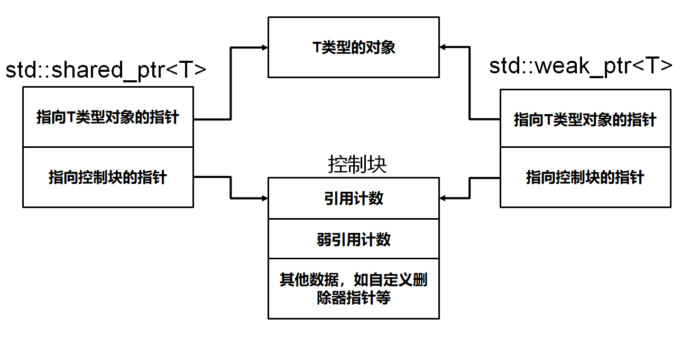

# C++ Interview

## 一、C++语法基础

### 1.  简单介绍一下指针？

#### 1.1  概念

指针是一个特殊的变量，它里面存储的数值可以被解释成内存里的一个地址。

#### 1.2  野指针和悬空指针

两者都是指向无效内存区域的指针，访问行为将会导致未定义行为

##### 1.2.1  野指针

就是没有被初始化的指针，既不指向合法的内存空间，也没有使用```NULL/nullptr```初始化指针，总之就是指向位置是不确定的

```c++
int main(){
	int *p;	//野指针
    std::cout<<*p<<std::endl;
    return 0;
}
```

为了防止出错，对于指针初始化时都是赋值为```nullptr```，这样在使用时编译器就会直接报错，产生非法访问。

##### 1.2.2  悬空指针

是指针最初指向的内存已经被释放了的一种指针。delete一个指针后，指针值就变为无效了。指针虽然已经无效，但在很多机器上指针仍然保存着(已经释放了的)动态内存的地址，delete之后指针就变成了悬空指针。

```c++
int main(){
	int *p = nullptr;
    int *p2 = new int;
    p = p2;
    delete p2;
}
```

p和p2就是悬空指针，指向的内存已经被释放。如果继续使用这俩指针，行为不可预料。需要将这两个指针设置为```p=p2=nullptr```这时在使用两个指针，编译器就会直接报错。

#### 1.3  函数指针与指针函数

##### 1.3.1  函数指针

一个特殊的指针，用于指向函数被加载到的内存首地址，可用于函数调用。

#### 1.4  指针数组和数组指针

##### 1.4.1  数组指针

```c++
int (*p)[10];
//p是一个指针，指向一个int[10]的数组
```

指向数组的指针。这个指针具有指向整个数组的能力，保存这个数组的真实地址。只有一个变量，数组大小为10

##### 1.4.2  指针数组

```c++
char *arr[4] = {"hello","world","hello","C++"};
//arr[4]是一个定义的数组，把它对于到内存中，arr是一个在栈区，有4个元素的数组，每一个元素又是一个指针，变量arr的大小为16字节
```

### 2.  各种关键字？

#### 2.1  define宏定义和const

- define
  - 宏定义实际上是在==预处理阶段==进行处理，把所有的宏名用宏体来替换，简单来说就是字符串替换，不做类型检查和计算，也不求解，容易产生错误。
  - 其次，它做的仅仅是遇到宏定义进行字符串展开，遇到多少次就展开多少次。在这种展开过程中，很容易出现边界效应，在内存中产生多份相同的备份。
  - 最后

对friend关键字的认识

final关键字作用，volatile关键字是干嘛的

谈谈virtual关键字？

override的作用？

### 3.  struct和class的区别

C++中的`struct`和`class`基本是通用的。唯有几个细节不同：

- 使用`class`时，类中的成员默认是`private`属性的，而使用`struct`时，结构体中的成员默认是`public`属性的。
- `clas`继承默认是`private`继承，`struct`继承默认是`public`继承
- `class`还可用于定义模板参数，像`typename`，但是关键字`struct`不能用于定义模板参数


## 二、C++11

### 1.智能指针

#### 1.1  RAII

`RAII(Resource Acquisition Is Initialization)`是一种利用对象生命周期来控制程序资源(内存、文件句柄、网络连接、互斥量等等)

一般做法是这样的：在对象构造时获取资源，接着控制对资源的访问使之在对象的生命周期内始终有效，最后在对象析构的时候释放资源。实际上把管理一份资源的责任托管给了一个对象，主要应用于智能指针。

智能指针就是利用了这种叫做RAII(资源获取即初始化)的技术对普通指针进行封装，这就使得智能指针实质上是一个类，行为表现的却像一个指针，用来存储指向动态分配对象的指针，负责自动释放动态分配的对象，防止堆内存泄漏。

#### 1.2  unique_ptr

`unique_ptr`：只允许基础指针的一个所有者，某个时刻只能有一个`unique_ptr`指向一个给定对象。当`unique_ptr`被销毁时，它所指向的对象也被销毁。可以移动到新所有者，但不会复制或共享(无法得到指向同一个对象的两个`unique_ptr`)。

作用;

- 为动态申请的内存提供异常安全
- 将动态申请内存的所有权传递给某个函数
- 从某个函数返回动态申请内存的所有权
- 在容器中保存指针

#### 1.3  shared_ptr

采用引用计数的方法，允许多个智能指针指向同一个对象，每当多一个指针指向该对象时，指向该对象的所有智能指针内部的引用计数就会+1，当计数为0时会自动释放动态分配的资源。

#### 1.4  weak_ptr

弱引用。 引用计数有一个问题就是互相引用形成环（环形引用），这样两个指针指向的内存 都无法释放。需要使用weak_ptr打破环形引用。weak_ptr是一个弱引用，它是为了配合shared_ptr而引入 的一种智能指针，它指向一个由shared_ptr管理的对象而不影响所指对象的生命周期，也就是说，它只引用，不计数。如果一块内存被shared_ptr和weak_ptr同时引用，当所有shared_ptr析构了之后，不管还有没 有weak_ptr引用该内存，内存也会被释放。所以weak_ptr不保证它指向的内存一定是有效的，在使用之前使用函数lock()检查weak_ptr是否为空指针。


#### 1.5  auto_ptr

主要是为了解决**有异常时发生内存泄漏**的问题，因为发生异常而无法正常释放内存。


#### 1.6  引用计数怎么实现，哪些成员函数会影响到引用计数

```c++
class Object{
public:
	int a,b;
};
class Counter{
friend class SmartPointPro;
public:
	Counter(){
		ptr = NULL;
		cnt = 0;
	}
	Counter(Object *p){
		ptr = p;
		cnt = 1;
	}
	~Counter(){delete ptr;}
private:
	Object *ptr;
	int cnt;
};
class SmartPointPro{
public:
	SmartPointPro(Object* p){
		ptr_counter = new Counter(p);
	}
	SmartPointPro(const SmartPointPro &sp){
		ptr_counter = sp.ptr_counter;
		++ptr_counter->cnt;
	}
	SmartPointPro& operator=(const SmartPointPro &sp){
		++sp.ptr_counter->cnt;
		--ptr_counter->cnt;
		if(ptr_counter->cnt == 0){
			delete ptr_counter;
		}
		ptr_counter = sp.ptr_counter;
	}
	~SmartPointPro(){
		--ptr_counter->cnt;
		if(ptr_counter->cnt == 0){
			delete ptr_counter;
		}
	}
private:
	Counter* ptr_counter;
};
//以上可以动态维护引用计数，引用计数改变发生在以下时刻：
调用构造函数：SmartPointPro p(new Object());
复制构造函数：SmartPointPro p(const SmartPointPro %p);
复制时：	 SmartPointPro p1(new Object());
			SmartPointPro p2 = p1;
```

#### 1.7  weak_ptr和shared_ptr使用时有什么区别，各自什么时候用?

区别;

- Ans1：
  - 首先`weak_ptr`是用于辅助`shared_ptr`的，只能指向由`shared_ptr`管理的对象；不能使用`weak_ptr`直接访问对象，必须调用`lock`,原因是对象可能不存在；它的构造和析构不会引起引用计数的增加或者减少

- Ans2：

  - `weak_ptr`指针通常不单独使用，只能和 `shared_ptr `类型指针搭配使用。将一个`weak_ptr`绑定到一个`shared_ptr`不会改变`shared_ptr`的引用计数。一旦最后一个指向对象的`shared_ptr`被销毁，对象就会被释放。即使有`weak_ptr`指向对象，对象也还是会被释放。

  - `weak_ptr`并没有重载`operator->`和`operator *`操作符，因此不可直接通过`weak_ptr`使用对象，典型的用法是调用其`lock`函数来获得`shared_ptr`示例，进而访问原始对象。

使用：

- `shared_ptr`

  - 通常使用在共享权不明的场景。有可能多个对象同时管理同一块内存
  - 对象的延迟销毁。当一个对象的析构非常耗时，甚至影响到了关键线程的速度。可以使用`BlockingQueue<std::shared_ptr<void>>`将对象转移到另一个线程释放，从而解法关键线程

- `weak_ptr`

  - 打破`shared_ptr`的循环引用无法析构的的问题

  - 使用`weak_ptr`保存二叉树的`parent`结点，也是用于打破循环引用带来的资源泄露

  - 带缓存的工厂函数？？？

    - 在一些代价高昂的场景，例如操作了文件或者数据库`I/O`，并且ID会被频繁地重复使用，加上缓存可以优化函数，但是

  - 探查内存空间是否有效

    ```c++
    #include <iostream>
    #include <memory>
    
    int main()
    {
        // OLD, problem with dangling pointer
        // PROBLEM: ref will point to undefined data!
        
        int* ptr = new int(10);
        int* ref = ptr;
        delete ptr;
    
        // NEW
        // SOLUTION: check expired() or lock() to determine if pointer is valid
    
        // empty definition
        std::shared_ptr<int> sptr;
    
        // takes ownership of pointer
        sptr.reset(new int);
        *sptr = 10;
    
        // get pointer to data without taking ownership
        std::weak_ptr<int> weak1 = sptr;
    
        // deletes managed object, acquires new pointer
        sptr.reset(new int);
        *sptr = 5;
    
        // get pointer to new data without taking ownership
        std::weak_ptr<int> weak2 = sptr;
    
        // weak1 is expired!
        if (weak1.expired())
        {
            std::cout << "weak1 is expired\n";
        }
        else
        {
            auto temp = weak1.lock();
            std::cout << "value (weak1 point to): "<< *temp << '\n';
        }
            
        // weak2 points to new data (5)
        if (weak2.expired())
        {
            std::cout << "weak2 is expired\n";
        }
        else
        {
            auto temp = weak2.lock();
            std::cout << "value (weak2 point to): "<< *temp << '\n';
        }
    }
    代码中weak1先是和sqrt指向相同的内存空间，后面wqrt释放了那段内存空间然后指向新的内存空间，此时通过weak1的expired()方法就可以知道本来指向的那段内存已经被释放。因为不增加引用计数，所以不会影响内存的释放。
    ```

    

#### 1.8  循环引用？如何解决？


#### 1.9  auto_ptr指针被摒弃的原因

## 三、面向对象

### 1.  简单介绍下多态？如何实现多态？

首先多态的基本定义就是：同一种操作作用于不同的对象，会产生不同的解释效果

在基类的函数前加上virtual关键字，在派生类中重写该函数，运行时将会根据所指对象的实际类型来调制相应的函数。对象类型是派生类就调用派生类的函数，对象类型是基类就调用基类的函数。


- 实现原理

  - 多态的关键就是通过基类的指针或引用调用一个虚函数时，编译时不能确定到底调用的是基类还是派生类的函数，运行时才能确定。

  - 用`sizeof`来运算有虚函数的类和没有虚函数的类的大小

  - ```c++
    class A{
    public:
        int i;
        virtual void Print();
        //virtual void write(){}
    };
    class B{
    	int n;
        void Print();
        //void write() {}
    };
    int main(){
        cout << sizeof(a) << "  " << sizeof(B) << endl;
        system("Pause");
        return 0;
    }
    ```

    输出：16和4(即便把 // 去掉也是输出16和4，**在64位系统中指针的大小为8字节**)

  - 每一个有虚函数的类都有一个**虚函数表**，该类的任何对象都放着虚函数表的指针。虚函数表中列出了该类的虚函数地址。多出来的8个字节就是用来存放**虚函数表**的地址。

    ```c++
    class Base{
    public:
        int i;
        virtual void print(){}
    };
    class Derived:public Base{
    	int n;
        virtual void print(){}
    };
    上述两个类都有虚函数，它的虚函数表的形式可以理解成下面的形式：
    ```

    

- 多态的实现过程
  - 编译器在发现基类有虚函数时，会自动为每个含有虚函数的类生成一份虚表，该表是一个一维数组，保存着虚函数的入口地址
  - 编译器会在每个对象的前四个字节保存一个虚表指针，即`vptr`，指向对象所属类的虚表。在构造时，根据对象的类型去初始化虚表指针`vptr`，从而让vptr指向正确的虚表，从而在调用虚函数时，能找到正确的函数
  - 在派生类定义对象时，程序会自动调用构造函数，在构造函数中创建虚表并对虚表初始化。在构造子类对象时，会先调用父类的构造函数。此时编译器只看到了父类，并为父类对象初始化虚表指针，令它指向父类的虚表；当调用子类的构造函数时，为子类对象初始化虚表，令它指向子类的虚表
  - 当派生类对基类的虚函数没有重写时，派生类的虚表指针指向的是基类的虚表；有重写时，派生类的虚表指针指向的是自身的虚表；派生类中有自己的虚函数时，在自己的虚表中将虚函数地址添加在后面
  - 这样指向派生类的基类指针在运行时，就可以根据派生类对虚函数的重写情况动态的进行调用，从而实现多态。

### 2.  基类的虚函数表内存分区

```c++
#include<iostream>
#include<string>
#include<map>
#include<vector>
#include<cstdio>
#include<algorithm>
#include<cmath>
using namespace std;

class Base {
public:
	virtual void a() { cout << "Base a()" << endl; }
	virtual void b() { cout << "Base b()" << endl; }
	virtual void c() { cout << "Base c()" << endl; }
};

class Derive : public Base {
public:
	virtual void b() { cout << "Derive b()" << endl; }
};

int main()
{
	cout << "-----------Base------------" << endl;
	Base* q = new Base;
	long* tmp1 = (long*)q;
	long* vptr1 = (long*)(*tmp1);
	for (int i = 0; i < 3; i++) {
		printf("vptr[%d] : %p\n", i, vptr1[i]);
	}

	Derive* p = new Derive;
	long* tmp = (long*)p;
	long* vptr = (long*)(*tmp);
	cout << "---------Derive------------" << endl;
	for (int i = 0; i < 3; i++) {
		printf("vptr[%d] : %p\n", i, vptr[i]);
	}
    system("Pause");
	return 0;
}
```


## 四、STL

变量类型及变量的存储位置以及生命周期

局部变量存储的位置（栈）

C++中命名空间的使用场景有哪些，什么情况下用有名，什么情况下用匿名

什么是常量类型的函数

C++中怎么去掉常量属性

引用存不存在空悬引用？引用底层是怎么实现的？既然引用底层是指针，那么引用中的指针会不会存在空悬的情况(编译器如何保证引用的指针不空悬？)空悬指针是在编译阶段还是运行阶段出现的?（运行过程中执行delete函数的话是在运行中出现的）

左值引用和右值引用的区别，详细介绍一下两者？

左值引用是左值还是右值？右值引用呢？

什么是左值，右值，举个例子

如何快速判断一个值是左值还是右值？

什么时候用到右值

函数的返回值是左值还是右值？

c++几大编程范式

联合体和结构体的区别？

括号初始化和赋值初始化的区别

C结构体和C++类的区别(c结构体不能定义函数)，有什么方法能在c结构体中定义函数(函数指针)，具体讲一下？具体说一下指针函数

float是怎么存储小数的？

怎么实现在 main()函数之前运行函数

main函数执行前后，会有哪些工作要做

C++独有特性，与C的区别，有什么共同之处，为什么嵌入式用C多

c++ 中变量重名怎么解决

C++浮点数的存储格式

全局变量有什么危害？一定就要使用全局变量，怎么降低程序的BUG？

全局变量、静态变量和全局变量的存储位置？

静态变量和全局变量的区别，什么时候被初始化，什么时候被析构

在函数中基础类型都是存在栈吗，如int a = 1;

auto与deltype区别？

auto是在什么阶段进行推导

#define和const int定义宏的区别

volatile了解吗，可以保证去内存取数据是原子操作吗？

细讲static，包括static成员变量与函数？static作用？都可以修饰什么，分别起到什么作用？function实现里面有一个局部变量定义static可以吗？局部静态变量如何实现保存上一次的值

如何在其他文件访问一个static修饰的变量

在一个.h文件中声明一个static的函数，在.c文件中实现，在别的文件中能调用吗？

声明函数的时候，后面加上default或者delete是什么意思

函数指针和指向指针的指针是什么，有什么用

野指针和空指针的区别，空指针有自己的地址吗？野指针怎么来的

讲讲inline

- 当程序执行函数调用指令时，CPU将存储该函数调用后指令的内存地址，将函数的参数复制到堆栈上，最后将控制权转移到指定的函数。然后，CPU执行函数代码，将函数返回值存储在预定义的内存位置/寄存器中，并将控制权返回给调用函数。如果函数的执行时间少于从调用者函数到被调用函数（被调用者）的切换时间，则这可能会成为开销。对于大型函数和/或执行复杂任务的函数，与函数运行所花费的时间相比，函数调用的开销通常微不足道。但是，对于小型的常用功能，进行函数调用所需的时间通常比实际执行函数代码所需的时间多得多。对于小功能，由于小功能的执行时间少于切换时间，因此会产生开销。

  C++提供了inline函数，以减少函数调用的开销。内联函数是在调用时在行中扩展的函数。调用内联函数时，将在内联函数调用时插入或替换内联函数的整个代码。替换由C++编译器在编译时执行。如果内联函数很小，则可以提高效率。

  调用inline函数省去了参数压栈、生成汇编语言的 CALL调用、返回参数、执行return等过程所花费的额外开销。inline函数对于函数体积很小，却又频繁调用这样的函数来说，可能比函数调用产生的代码更少，但是效率却不可同日而语。有一点需要注意的是：**inline只是对编译器提出一个申请，并不是强制命令。编译器可以忽略内联请求。** 

- 

- 

inline能不能是虚函数

宏定义与inline*2

重载、重写与隐藏作用范围分别是什么？

重载底层是如何实现的？(命名倾轧(name mangling)技术，命名倾轧是在编译阶段完成的)

运算符重载和函数重载

函数返回值不同也可以实现重载吗？

两个一模一样的函数，一个使用const修饰，一个不使用const，两个函数可以重载吗？

const修饰函数起到了什么作用？哪些变量不能修改？

const除了修饰函数还能修饰什么？

顶层const和底层const的区别

constexpr说一下

讲一下四种强制类型转换

`dynamic_cast`转换的时候运用了什么技术进行类型检查？指针转换报错时返回什么？引用呢？存在什么样的缺陷？static_cast一般在什么场景使用？

dynamic_cast讲一讲，如果指针类型是基类，转换为子类后，指针地址改变吗

使用dynamic_cast进行指针类型转换的类中需定义什么？

vector相较于数组的优劣有哪些？

C++类内数据成员的初始化有哪些方式

成员初始化顺序与类内声明顺序有关还是和构造函数初始化列表中的初始化顺序有关？


C++类型转换用什么转换符

C++异常处理，断言、 try catch throw

strcpy和memcpy的区别

C++的类对象可以用memset进行初始化吗？如果只有正常的成员变量和方法可以吗？

memcpy和memmove的区别？在C++什么标准中已经解决两个函数的问题

面向对象编程的三大特性，谈谈理解

指针可以作为成员变量吗？引用呢？

使用普通指针需要注意什么(判断有效性，内存泄漏，重复释放)重复释放会发生什么(空指针没问题，非空指针会崩溃)？

引用和指针的区别，引用初始化后是可变的吗

对同一个变量的指针和引用进行sizeof操作，会有什么区别吗？ 指针为什么会是4字节，一定是4字节吗？对指针做sizeof的结果与什么有关？

引用是否占用内存空间，如何证明？

常量指针与指针常量的区别？

指针与数组开辟内存空间放在哪？

在函数返回的时候对代码规范来讲是指针好还是引用好

`string="1234"`，实现这个语句编译器做了什么工作

全局变量和main里面的变量哪个被先初始化？

从指令集角度讲一下模板的实例化

什么是模板

普通模板函数定义在哪里，为什么

- 普通模板函数通常被定义在头文件中。这是因为模板函数的实现需要在编译时期进行，而编译器需要在编译期访问函数模板的定义，以便生成对应类型的实例化代码。如果将模板函数的定义放在源文件中，则在链接期间将找不到对应的实例化代码，导致链接错误。

普通模板函数定义在头文件里为什么链接器不报符号重定义
如果源文件a和b中都使用了模板函数，为什么不报重定义的错误

模板类可以用来写一些东西，你对模板类了解多少? 假如说在定义模板的时候，引用和右值引用，你要怎么处理他们？ 比如说你传了一个template T，你的下面写了一个FunctionA里面传了一个p，传p的时候可能传的是它的引用，也有可能传的是它的右值引用，这在你的使用方面会有影响，你要怎么解决？

类至少包含哪些元素？

### &#10004;哪些函数不能是虚函数

- 构造函数：构造函数用于初始化对象的状态，在对象创建时自动调用。在构造函数中，虚函数的多态性将不起作用，因为子类对象的部分成员可能尚未初始化。此外，构造函数负责设置虚函数表指针（vptr），这需要在构造函数之前完成。因此，构造函数不能声明为虚函数。
- 内联函数：内联函数是在编译时内联到调用它的代码中的函数。编译器会将内联函数的代码直接替换到调用它的地方，以减少函数调用的开销。然而，虚函数是在运行时通过虚函数表进行动态绑定的。由于内联函数和虚函数的绑定方式不同，虚函数不能声明为内联函数。
- 静态成员函数：静态成员函数属于类而不属于对象。它们没有隐式的`this`指针，因此不能访问类的非静态成员。另一方面，虚函数是通过`this`指针和虚函数表进行动态绑定的。由于静态成员函数与虚函数的行为不兼容，静态成员函数不能声明为虚函数。
- 友元函数：友元函数是在类的外部定义的，但可以访问类的私有和保护成员。友元函数不是类的成员函数，因此没有`this`指针。由于虚函数依赖于`this`指针进行动态绑定，友元函数不能声明为虚函数。

### &#10004;虚函数表是属于谁的

- 虚函数表属于类，而不是类的对象。每个包含虚函数的类都会有一个虚函数表，该表包含指向类虚函数实现的指针。

  虽然虚函数表属于类，但类的每个对象都有一个指向该类虚函数表的指针（称为虚函数表指针，或vptr）。在运行时，当需要调用一个对象的虚函数时，程序会使用该对象的vptr来查找对应的虚函数表，然后调用相应的虚函数实现。这实现了多态性。

### &#10004;对象怎么知道调用了什么函数

- 当一个对象调用其成员函数时，编译器会将当前对象的地址作为隐式参数传递给成员函数。这个隐式参数就是`this`指针。


哪些地方会用到this指针

### &#10004;一个类有几个虚函数表？

- 每个包含虚函数的类都有一个虚表，虚表是属于类的，而不是属于某个具体的对象，一个类只需要一个虚表即可。所以一个类只有一个虚函数表。

### &#10004;类的this指针起到什么作用？this指针的值从哪里来的？为什么在不同的对象里面指针的值不一样呢？这个值不一样的话是谁给改了告诉我们的呢？

- `this`指针在C++类的成员函数中起到了以下作用：
  1. **访问对象的数据成员**：`this`指针指向当前对象的内存，可以通过它访问对象的数据成员。当有名称冲突（如成员函数的参数名与数据成员的名称相同）时，可以使用`this`指针区分它们。
  2. **调用对象的成员函数**：`this`指针可以用于在成员函数中调用其他成员函数。
  3. **实现链式操作**：当成员函数返回`*this`时，可以实现链式操作，即多个成员函数调用可以在一行代码中串联。
- this`指针的值是在调用成员函数时自动传递的。当你调用一个对象的成员函数时，编译器会将对象的地址作为`this`指针的值传递给成员函数。因此，`this`指针的值取决于你正在操作的对象。
- 由于`this`指针指向当前操作的对象，所以在不同的对象中，`this`指针的值是不同的。这是因为每个对象在内存中有自己的存储空间，因此它们的地址是不同的。当你在不同的对象上调用成员函数时，编译器会根据调用的对象自动传递不同的`this`指针值。

模板实例化之后，底层汇编是怎么做的？

基类的析构函数定义为虚函数的目的？

继承关系的类，构造函数与析构函数的调用顺序？为什么先调用父类的构造函数？

拷贝构造为什么传递一个const引用，如果不使用引用传递呢？

详细介绍下继承，多态，重载

C++的多重继承的好处和坏处？什么是类的构造和析构？虚构造？虚析构？

虚函数的应用场合？

继承后析构函数为什么加virtual

### &#10004;有的析构函数为什么设置成虚函数，不设置行不行？

- 析构函数有时需要被声明为虚函数，以便在处理多态行为和继承时正确释放派生类的资源。当你有一个基类指针（或引用）指向派生类对象时，如果基类的析构函数不是虚函数，那么在删除该指针时，只有基类的析构函数会被调用，而不是派生类的析构函数。这可能导致资源泄漏或其他错误。

  声明析构函数为虚函数可以确保在删除基类指针时，正确地调用派生类的析构函数，然后再调用基类的析构函数。这样，派生类和基类的资源都能被正确释放。

- ```c++
  class Base {
  public:
      virtual ~Base() { // 声明虚析构函数
          std::cout << "Base destructor" << std::endl;
      }
  };
  
  class Derived : public Base {
  public:
      ~Derived() {
          std::cout << "Derived destructor" << std::endl;
      }
  };
  
  int main() {
      Base *ptr = new Derived();
      delete ptr; // 如果Base的析构函数不是虚函数，这里只会调用Base的析构函数
  }
  ```

析构函数是protect权限下，怎么调用？

### &#10004;构造函数的种类，为什么要设计构造函数？

- **默认构造函数**：如果没有为类显式定义任何构造函数，编译器会自动为其生成一个默认构造函数。默认构造函数不接受任何参数，它为类的数据成员分配内存并执行默认初始化。

- **带参数的构造函数**：带参数的构造函数用于根据传入的参数初始化对象的数据成员。它可以为一个或多个参数提供默认值，从而允许用户在创建对象时提供部分或全部参数。

- **拷贝构造函数**：拷贝构造函数用于初始化一个新对象，以便它具有与另一个对象相同的状态。拷贝构造函数接受一个同类型对象的引用作为参数。

  - ```c++
    class MyClass {
    public:
        MyClass(const MyClass& other) : x_(other.x_), y_(other.y_) {}
    private:
        int x_;
        int y_;
    };
    ```

- **移动构造函数**（C++11 及之后）：移动构造函数用于从一个临时对象（右值）中“窃取”资源，以避免在创建新对象时进行资源的昂贵拷贝。移动构造函数接受一个同类型对象的右值引用作为参数。

  - ```c++
    class MyClass {
    public:
        MyClass(MyClass&& other) : x_(other.x_), y_(other.y_) {
            other.x_ = 0;
            other.y_ = 0;
        }
    private:
        int x_;
        int y_;
    };
    ```

- 设计构造函数的意义？

  - **初始化对象**：构造函数负责初始化对象的数据成员，确保对象在创建时处于一种合法且可预测的状态。
  - **代码重用**：通过在构造函数中编写初始化代码，可以避免在多个地方重复相同的初始化逻辑。
  - **灵活性**：通过提供带参数的构造函数，可以让用户根据需要创建具有不同初始状态的对象。同时，还可以通过构造函数重载提供多种初始化选项。
  - **资源管理**：构造函数可以用于分配和初始化对象所需的资源，如内存、文件句柄、网络连接等。在析构函数中释放这些资源，从而确保资源得到正确管理。

### &#10004;类内数据成员在构造函数初始化列表中赋值和在构造函数体内赋值的区别

- 成员初始化列表和构造函数的函数体都可以为我们的类数据成员指定一些初值，但是两者在给成员指定初值的方式上是不同的。成员初始化列表使用初始化的方式来为数据成员指定初值，而构造函数的函数体是通过赋值的方式来给数据成员指定初值。也就是说，成员初始化列表是在数据成员定义的同时赋初值，但是构造函的函数体是采用先定义后赋值的方式来做。这样的区别就造成了，在有些场景下，是必须要使用成员初始化列表。
- 使用初始化列表通常更为推荐，因为它可以确保数据成员在构造函数体执行之前完成初始化、提高代码效率、支持`const`和引用成员的初始化以及确保正确调用基类构造函数。(**const成员和引用成员**：对于`const`数据成员和引用数据成员，必须在初始化列表中进行初始化，因为它们无法在构造函数体内被赋值。)

### &#10004;构造函数产生异常该如何处理，在构造函数中分配内存会出现异常吗，如何处理（try...catch，new分配失败会抛出bad_alloc）

- **捕获异常**：在创建对象时，使用`try`-`catch`块捕获可能发生的异常。这样，在构造函数抛出异常时，可以立即捕获并处理，防止程序意外终止。

- **`std::bad_alloc`**：在使用`new`操作符分配内存时，如果分配失败（例如，因为内存不足），会抛出`std::bad_alloc`异常。`std::bad_alloc`是`std::exception`类的子类，可以用`std::exception`捕获该异常。

  - ```c++
    try {
        MyClass *obj = new MyClass();
    } catch (const std::bad_alloc &e) {
        std::cout << "Exception caught: " << e.what() << std::endl;
    }
    ```

- **`std::bad_array_new_length`**（C++11及之后）：当尝试使用`new[]`操作符创建一个具有非法长度（负数或超过`std::size_t`的最大值）的数组时，会抛出`std::bad_array_new_length`异常。

  - ```c++
    std::bad_array_new_length（C++11及之后）当尝试使用new[]操作符创建一个具有非法长度（负数或超过std::size_t的最大值）的数组时，会抛出std::bad_array_new_length异常。
    ```

构造函数中进行文件操作，有没有风险？打开文件这种（打开文件占用文件描述符，忘了关文件在当前进程会一直被打开，文件描述符会被占满）


### &#10004;讲讲拷贝构造函数？深拷贝和浅拷贝的区别？

- **拷贝构造函数**是一种特殊的构造函数，用于创建一个新对象，同时将现有对象的数据复制到新对象中。拷贝构造函数通常用以下形式声明：

  ```c++
  class MyClass {
  public:
      MyClass(const MyClass& other); // 拷贝构造函数
      // ...
  };
  ```

  拷贝构造函数的参数是对同一类对象的常量引用。这样做可以防止修改传递给拷贝构造函数的原始对象，同时避免无限递归调用（如果参数不是引用，则会导致拷贝构造函数的递归调用，直到内存耗尽）。

- **浅拷贝**：

  - 浅拷贝仅复制对象的成员变量值，而不复制它们所指向的内存。如果对象有指针成员，浅拷贝将复制指针的地址而不是它所指向的内存。这可能导致原始对象和拷贝对象共享相同的资源，从而引发潜在的问题，如内存泄漏或双重释放。

- **深拷贝**：

  - 深拷贝不仅复制对象的成员变量值，还复制它们所指向的内存。这意味着，如果对象有指针成员，深拷贝会为拷贝对象分配新的内存，并将原始对象所指向的数据复制到新内存中。这样，原始对象和拷贝对象就拥有各自独立的资源，避免了潜在的问题。


### &#10004;什么时候深拷贝？

- 如果一个类拥有指针类型的成员变量，那么绝大部分情况下就需要深拷贝，因为只有这样，才能将指针指向的内容再复制出一份来，让原有对象和新生对象相互独立，彼此之间不受影响。

### &#10004;浅拷贝是怎么处理变成深拷贝

- 要将浅拷贝转换为深拷贝，您需要自定义拷贝构造函数和拷贝赋值运算符，以确保在拷贝过程中正确地分配新内存并复制数据。以下是一个简单的示例，说明如何将浅拷贝转换为深拷贝：

  - ```c++
    #include <iostream>
    #include <cstring>
    class MyClass {
    public:
        MyClass(const char* str) {
            buffer = new char[strlen(str) + 1];
            strcpy(buffer, str);
        }
        // 自定义拷贝构造函数，实现深拷贝
        MyClass(const MyClass& other) {
            buffer = new char[strlen(other.buffer) + 1];
            strcpy(buffer, other.buffer);
        }
        // 自定义拷贝赋值运算符，实现深拷贝
        MyClass& operator=(const MyClass& other) {
            if (this == &other) {
                return *this;
            }
            delete[] buffer;
            buffer = new char[strlen(other.buffer) + 1];
            strcpy(buffer, other.buffer);
            return *this;
        }
        ~MyClass() {
            delete[] buffer;
        }
        void print() const {
            std::cout << buffer << std::endl;
        }
    private:
        char* buffer;
    };
    int main() {
        MyClass obj1("Hello");
        MyClass obj2(obj1); // 使用拷贝构造函数进行深拷贝
        MyClass obj3("World");
        obj3 = obj1; // 使用拷贝赋值运算符进行深拷贝
    
        obj1.print();
        obj2.print();
        obj3.print();
    
        return 0;
    }
    ```

    


### &#10004;拷贝构造函数应用在什么场景？举一个应用拷贝构造函数的例子

- 当一个对象以值传递的方式作为函数参数时。
- 当一个对象以值传递的方式从函数返回时。
- 当用一个已存在的对象初始化另一个对象时

### &#10004;在父类的析构函数调用虚函数会如何？

- ```c++
  #include <iostream>
  #include <cstring>
  using namespace std;
  class base{
  public:
      virtual void show(){
          cout << "this is base\n" << endl;
      }
      ~base(){
          show();
      }
  };
  
  class derived: public base{
  public:
      virtual void show(){
          cout << "this is derived\n" << endl;
      }
      ~derived(){
          show();
      }
  };
  int main(){
  	cout << "基类指针指向派生类对象的析构输出结果\n" << endl;
      base* test_base = new derived;
      delete test_base;
      cout << "派生类指针指向派生类对象的析构输出结果\n" << endl;
      derived* test_drived = new derived;
      delete test_drived;
      return 0;
  }
  ```

- 

- 从结果上看的话, 编译通过且输出了结果, 基类指针指向一个派生类对象, 在析构的时候其仍然是处于一个基类的状态, 因此会调用基类的`show()`函数, 而派生类指针指向派生类对象, 其是一个派生类因此会先调用派生类的析构函数,然后再调用基类的析构函数.

&#10004;有继承关系的父类析构函数定义成virtual 为什么？

- 由于类的多态性，基类指针可以指向派生类的对象，如果删除该基类的指针，就会调用该指针指向的派生类析构函数，而派生类的析构函数又自动调用基类的析构函数，这样整个派生类的对象完全被释放。

  如果析构函数不被声明成虚函数，则编译器实施静态绑定，在删除基类指针时，只会调用基类的析构函数而不调用派生类析构函数，这样就会造成派生类对象析构不完全，造成内存泄漏。

  ```c++
  #include <iostream>
  #include <cstring>
  class Base {
  public:
      virtual ~Base() {
          std::cout << "Base destructor" << std::endl;
      }
  };
  class Derived : public Base {
  public:
      ~Derived() {
          std::cout << "Derived destructor" << std::endl;
      }
  };
  int main() {
      Base* ptr = new Derived;
      delete ptr; // 正确地调用派生类的析构函数，然后调用基类的析构函数
  
      return 0;
  }
  ```

  

### &#10004;子类继承父类会把虚函数表都继承过来吗？

- 当父类定义了虚函数时，在子类进行继承的时候会将父类的虚函数表也给继承下来所以那一些虚函数在子类中也是virtual类型的，如果要对父类中的虚函数进行重写时或添加虚函数，顺序是：
  ①先将父类的虚函数列表复制过来
  ②重写虚函数时是把从父类继承过来的虚函数表中对应的虚函数进行相应的替换。
  ③如果子类自己要添加自己的虚函数，则是把添加的虚函数加到从父类继承过来虚函数表的尾部。
- Tips;
  - 严格说是同一的类的不同对象都有自己的虚函数表，只是指向相同的虚函数，共用的~
  - 子类和父类中的虚函数表中没重写的虚函数也是共用的
- 

### &#10004;构造函数能不能调用成员函数

- 在构造函数中可以调用成员函数，但需要确保已经对所有相关的成员变量进行了初始化，避免调用虚函数和导致循环调用。

### &#10004;构造函数可以声明成虚函数吗？为什么？

- 因为在创建对象时会调用构造函数，构造函数在这时初始化对象的虚表指针。如果构造函数是虚函数，那么意味着对象必须要通过虚表指针去调用构造函数，但是在调用构造函数之前，虚表指针还没被赋值，这就出现了矛盾。

### &#10004;构造函数和析构函数里面可以调用虚函数吗？为什么？

> ​	可以，但不推荐

- 构造函数中调用虚函数：在构造函数中调用虚函数时，多态性是不适用的。因为在基类的构造函数中调用虚函数时，派生类的成员尚未初始化，所以只会调用基类的虚函数实现，而不是在运行时动态决定调用派生类的实现。这可能导致不符合预期的行为

  - ```c++
    	class Base {
    public:
        Base() {
            func(); // 调用虚函数
        }
        virtual void func() {
            std::cout << "Base::func()" << std::endl;
        }
    };
    
    class Derived : public Base {
    public:
        Derived() : Base() {}
        void func() override {
            std::cout << "Derived::func()" << std::endl;
        }
    };
    
    int main() {
        Derived d; // 输出 "Base::func()"，而不是 "Derived::func()"
    }
    ```

- 析构函数中调用虚函数：在析构函数中调用虚函数时，也会忽略多态性。当一个派生类对象通过基类指针被删除时，析构函数的调用顺序是从派生类到基类。在基类的析构函数中调用虚函数时，派生类的部分已经被销毁，所以只会调用基类的虚函数实现。这可能导致资源泄漏或其他不符合预期的行为。

  - ```c++
    class Base {
    public:
        virtual ~Base() {
            func(); // 调用虚函数
        }
        virtual void func() {
            std::cout << "Base::func()" << std::endl;
        }
    };
    
    class Derived : public Base {
    public:
        ~Derived() {}
        void func() override {
            std::cout << "Derived::func()" << std::endl;
        }
    };
    
    int main() {
        Base *ptr = new Derived();
        delete ptr; // 输出 "Derived::func()" 和 "Base::func()"，而不是 "Base::func()" 两次
    }
    ```

    

### &#10004;派生类的构造函数可以调用虚函数吗？

- 在派生类构造函数执行期间，虚函数的多态性将不起作用。当在派生类构造函数中调用虚函数时，将调用的是当前类（派生类）中的虚函数实现，而不是运行时动态决定的实现。

### &#10004;不考虑使用场景，除了构造函数给所有函数声明为virtual，可以这样做吗？或者说推荐这么做吗，有什么负面影响？

- 可以，但不推荐
- 性能损失：将所有成员函数声明为虚函数会导致性能损失。每个包含虚函数的类都需要一个虚函数表，而每个该类的对象都需要一个虚函数表指针。这会增加每个对象的内存占用。另外，在调用虚函数时，需要通过虚函数表进行动态分发，这会导致额外的时间开销。

### &#10004;移动构造使用对象需要什么条件

- 右值引用：移动构造函数的参数应为右值引用（使用`&&`修饰符），这允许将将要被移动的对象绑定到临时对象或者可以被移动的对象上。
- 传递资源：在移动构造函数中，需要将源对象的资源传递给新创建的对象。通常，这意味着将源对象的指针成员或其他资源管理对象（如`std::unique_ptr`）移动到新对象，并将源对象置于可析构但不再拥有资源的状态。
- 如果类中定义了移动构造函数，通常还应定义移动赋值运算符以确保对象的移动赋值行为与移动构造行为一致。

### &#10004;一个父类指针指向子类对象，虚函数代码会发生什么？

- ```c++
  class Base {
  public:
      virtual void foo() {
          std::cout << "Base::foo()" << std::endl;
      }
  };
  
  class Derived : public Base {
  public:
      void foo() override {
          std::cout << "Derived::foo()" << std::endl;
      }
  };
  
  int main() {
      Derived d;
      Base* b_ptr = &d; // 父类指针指向子类对象
      b_ptr->foo();     // 输出：Derived::foo()
      return 0;
  }
  ```

- 在这个例子中，`Base`类有一个虚函数`foo()`，`Derived`类覆盖了该函数。`main()`函数中创建了一个`Derived`类的对象`d`，然后将一个`Base`类指针`b_ptr`指向该对象。调用`b_ptr->foo()`时，虽然`b_ptr`是一个`Base`类指针，但是它实际上指向的是`Derived`类的对象。因此，根据对象的实际类型（`Derived`类），调用的是`Derived::foo()`而不是`Base::foo()`。这就是多态的体现。

  这种多态行为是通过虚函数表来实现的。虚函数表是一个存储类中虚函数地址的数组。每个具有虚函数的类都有一个与之关联的虚函数表，每个这种类的对象都有一个指向虚函数表的指针（通常称为vptr）。当调用虚函数时，程序会根据对象的vptr找到相应的虚函数表，然后在虚函数表中查找并调用相应的函数。这样，即使是通过父类指针调用虚函数，程序也能够根据对象的实际类型找到并调用子类的实现。

### &#10004;多态的实现的底层原理(虚函数表)*2

- 多态是面向对象编程中的一个重要特性，它允许使用基类指针或引用来访问派生类对象。在C++中，多态主要通过虚函数（virtual functions）来实现。多态的底层原理涉及到虚函数表（vtable）和虚函数表指针（vptr）。

  - 虚函数表（vtable）：虚函数表是一个存储类中虚函数地址的数组。对于包含虚函数的类，编译器会为其生成一个虚函数表。虚函数表中的每个条目都指向一个虚函数的实现。当派生类覆盖基类的虚函数时，派生类的虚函数表中的相应条目将指向派生类的虚函数实现。
  - 虚函数表指针（vptr）：对于包含虚函数的类的对象，每个对象中都包含一个指向虚函数表的指针，即虚函数表指针（vptr）。这个指针是在对象构造时自动设置的，使得它指向类的虚函数表。当派生类对象被创建时，其虚函数表指针将指向派生类的虚函数表。

- **（1）**编译器在发现基类中有虚函数时，会自动为每个含有虚函数的类生成一份虚表，该表是一个一维数组，虚表里保存了虚函数的入口地址

  **（2）\**编译器会在每个对象的前四个字节中保存一个虚表指针，即\**vptr**，指向对象所属类的虚表。在构造时，根据对象的类型去初始化虚指针vptr，从而让vptr指向正确的虚表，从而在调用虚函数时，能找到正确的函数

  **（3）**所谓的合适时机，在派生类定义对象时，程序运行会自动调用构造函数，在构造函数中创建虚表并对虚表初始化。在构造子类对象时，会先调用父类的构造函数，此时，编译器只“看到了”父类，并为父类对象初始化虚表指针，令它指向父类的虚表；当调用子类的构造函数时，为子类对象初始化虚表指针，令它指向子类的虚表

  **（4）**当派生类对基类的虚函数没有重写时，派生类的虚表指针指向的是基类的虚表；当派生类对基类的虚函数重写时，派生类的虚表指针指向的是自身的虚表；当派生类中有自己的虚函数时，在自己的虚表中将此虚函数地址添加在后面

  这样指向派生类的基类指针在运行时，就可以根据派生类对虚函数重写情况动态的进行调用，从而实现多态性。

多态的使用场景，有几种表现形式(重载和重写)，什么时候用多态？

不用指针如何实现多态？直接创建对象能实现多态吗?

介绍一下多态，详细解释一下动态绑定，怎么绑定的，绑定的是什么

重写的实现机制？

C++虚函数的多态是编译时还是运行时？怎么实现运行时多态的

多重继承下子类重写虚函数与没有重写虚函数的情况下虚函数表的结构

### &#10004;虚函数表指针是几维指针，虚函数表指针存放在哪里？

- 虚函数表指针（vptr）通常是一个一维指针，它指向包含虚函数地址的虚函数表。
- 虚函数表指针（vptr）是一个类的成员，它存放在该类的对象内存布局中。通常，vptr位于对象内存布局的开头位置，这样可以更快地访问虚函数表，但具体位置可能依赖于编译器的实现。

### &#10004;虚函数表存在内存分区中的哪个区？

- 存放在(.rodata)。`.rodata`区通常位于程序的全局数据区虚函数表指针在对象里，对象在哪虚函数指针就在哪，虚函数表在编译期生成。

Tencent连环问

- 虚函数表的内容是什么，编译器将其放在哪？
  - 虚函数表（vtable）是一个包含虚函数地址的数组，虚函数表存储的每一项是一个虚函数的地址。编译器将虚函数表放在只读数据段
- 具体的虚函数放在哪？（代码段）事实上有的编译器会把虚函数表放在代码段，你能思考一下这是为什么吗？
  - 具体的虚函数放在代码段
  - （不懂，只是解释了一下为什么觉得放在只读数据段更合理）	
- 虚函数表指针是什么？每个实例化的对象都有自己的虚函数表指针吗？这个虚表指针只有一个吗？（多继承情况下可能会有多个）放在什么位置？（看实例化的对象创建在什么地方，如果对象在栈上，这个虚表指针就在栈上，如果对象创建在堆上，虚表指针就在堆上）
  - 虚函数表指针（vtable pointer）是一个指针，它指向一个类的虚函数表（vtable）。
  - 每个实例化的包含虚函数的类的对象都有自己的虚函数表指针。这个虚函数表指针存储在对象的内存布局中。对于每个对象来说，虚函数表指针只有一个。
- 那虚表指针具体在对象中的什么位置呢？（放在具体对象内存中的头部或者尾部，具体要看编译器是如何实现的）	————
- 为什么要放在具体对象内存中的头部或者尾部，而不放在中间呢？（从查找效率的角度去答，但面试官说不是根本原因）
- 考虑一下将一个子类指针转换为父类指针的场景？（父类指针指向子类指针，实际上无法访问子类中多出的内容，类似于数据截断，如果放在其他位置的话，会导致虚表指针丢失，按着自己的理解说的。。。）————
- 先来个简单的，什么情况下需要将父类的析构函数声明为虚函数？为什么？（balabala）父类的析构函数在什么时候调用？（子类的析构函数结束后自动调用）————
- 如果在动态多态下，父类(int a)和子类(int a, int b)都没有在堆上申请内存，就是父类和子类都没有在堆上分配的成员变量，此时不将父类的析构函数声明为虚函数会造成内存泄漏吗？（没啥想法，先问了下面试官是在堆上创建的对象还是在栈上创建，如果在栈上肯定是没问题的）那在堆上呢？（想了几分钟都没啥想法，蒙了个不会）————那我告诉你答案是不会，你能思考一下为什么吗？（没想法）面试官提示考虑delete的过程？（delete首先会调用指针本身对象的析构函数，在这里就是父类的析构函数了，结束后会通过operator delete释放内存，默认的operator delete就是free了，实际上在堆上分配内存时，内存会多出一部分记录分配内存的大小，也就是说free的时候是可以知道子类对象的大小的，所以可以正确按照子类对象去释放内存）

虚函数表创建的过程

虚函数表是什么时候初始化的？

介绍一下虚函数表中的内容以及虚指针

子类怎么通过虚函数表指针查找到所调用的函数(函数名还是函数地址)？

类与类之间的虚函数表是独立的吗？

父类与子类的虚函数表有什么区别？

子类对父类的非虚函数重写，通过基类指针调用的函数版本是哪版？为什么？


虚基类定义了子类和派生类，虚函数表是不是同一个

虚函数表内部原理实现，加入虚函数后是否会影响对象大小，影响的话增加了多少大小？

怎么查找虚函数表中的函数，虚函数指针存放的位置在哪里

派生类有两个基类，每个基类都有虚函数，派生类对象内存中有几个虚表指针

抽象类与纯虚函数，作用，有函数体是否编译？

抽象类与普通虚函数类的区别？什么时候用纯虚函数，什么时候用普通函数？

静态多态是怎么做到的？为什么函数名相同却可以调到不同的实现呢？

动态多态如何实现

运行时多态和编译时多态的区别？

多继承内存布局情况？虚继承内存布局情况？

C++可以多继承吗？多继承会存在哪些问题？同名函数会怎么样

虚继承了解吗，解决什么问题的(具体说一下类结构之间的关系)

菱形继承问题，怎么解决？

菱形继承时派生类访问基类定义的成员时会出现什么问题，如何解决？(虚继承)虚继承的原理？

### &#10004;假如父类的构造函数中调用了一个虚函数，调用该构造函数时调用的是父类的还是子类的？

- 如果在父类的构造函数中调用一个虚函数，此时调用的是父类的虚函数，而不是子类的虚函数。这是因为在父类的构造函数执行期间，子类的部分尚未被初始化，因此子类的虚函数表可能还没有设置好。

  这种行为是为了确保对象在构造过程中保持一致的状态。在构造函数中调用虚函数可能导致未定义行为或不稳定的状态，因为子类的成员可能尚未初始化。为了避免这种问题，最好不要在构造函数中调用虚函数

- ```c++
  #include <iostream>
  
  class Base {
  public:
      Base() {
          std::cout << "Base constructor" << std::endl;
          func(); // 调用虚函数
      }
  
      virtual void func() {
          std::cout << "Base::func()" << std::endl;
      }
  };
  class Derived : public Base {
  public:
      Derived() {
          std::cout << "Derived constructor" << std::endl;
      }
  
      void func() override {
          std::cout << "Derived::func()" << std::endl;
      }
  };
  int main() {
      Derived d;
      return 0;
  }
  ```

  

### &#10004;父类指针指向子类对象，如何对子类虚函数进行寻址

- 当通过父类指针调用子类对象的虚函数时，编译器会根据vptr找到对应的虚函数表，然后根据虚函数在表中的偏移量找到虚函数的实际地址，并执行该虚函数。这个过程在运行时进行，因此实现了多态。

  ```c++
  #include <iostream>
  
  class Base {
  public:
      virtual void func() {
          std::cout << "Base::func()" << std::endl;
      }
  };
  
  class Derived : public Base {
  public:
      void func() override {
          std::cout << "Derived::func()" << std::endl;
      }
  };
  
  int main() {
      Derived d;
      Base* b_ptr = &d; // 父类指针指向子类对象
      b_ptr->func();    // 调用子类的虚函数，输出：Derived::func()
  
      return 0;
  }
  ```


### &#10004;子类对象的基类子对象内存布局在前还是后

- 基类子对象在前，子类自己的成员变量在后。这种内存布局有助于保持基类和子类成员的相对顺序，同时支持多态特性。当子类对象被分配内存时，首先分配基类子对象的内存，然后分配子类的成员变量内存。

### &#10004;一个函数的形参是父类类型，向它传入子类的对象，调用的是谁的虚函数

- 当一个函数的形参是父类类型，向它传入子类的对象时，会发生对象的切割（slicing），即只保留父类部分。然而，如果形参是父类的引用或指针类型，那么就不会发生切割，而是遵循多态的行为

- ```c++
  #include <iostream>
  
  class Base {
  public:
      virtual void func() {
          std::cout << "Base::func()" << std::endl;
      }
  };
  class Derived : public Base {
  public:
      void func() override {
          std::cout << "Derived::func()" << std::endl;
      }
  };
  void call_func_by_value(Base obj) {
      obj.func();
  }
  void call_func_by_reference(Base& obj) {
      obj.func();
  }
  void call_func_by_pointer(Base* obj) {
      obj->func();
  }
  int main() {
      Derived d;
      call_func_by_value(d); // 输出：Base::func()
      call_func_by_reference(d); // 输出：Derived::func()
      call_func_by_pointer(&d); // 输出：Derived::func()
      return 0;   
  }
  ```

  

派生类与基类中具有名称相同的成员定义时会不会有问题？

### &#10004;一个类的成员变量初始化顺序是由什么决定的

- 类的成员变量的初始化顺序由它们在类定义中的声明顺序决定。当创建类的对象时，构造函数的初始化列表将按照成员变量在类定义中的声明顺序进行初始化，而不是按照构造函数初始化列表中的顺序。这是为了确保成员变量的初始化顺序与它们在类定义中的声明顺序一致，避免因初始化顺序不同而产生的不确定行为。(如果没有使用初始化列表，在进入构造函数时，成员变量已经默认初始化了。构造函数里对成员变量的操作属于赋值，而不是初始化。)

### &#10004;哪些东西是不能在初始化列表里初始化的？

- 静态成员变量：静态成员变量属于类本身，而不是类的某个对象。它们在程序的整个生命周期中只有一份。因此，静态成员变量的初始化与特定对象的构造无关，不能在构造函数的初始化列表中进行。

STL是什么？有什么作用？详细介绍一下各个组件原理

### &#10004;STL迭代器能+2吗

- 可以（`std::vector`，`std::deque`等随机访问迭代器）

### &#10004;stl中sort的具体实现

- 通常，`std::sort()`使用内省排序（introsort）算法作为主要实现，它是一种混合排序算法，结合了快速排序、插入排序和堆排序的优点。以下是内省排序的基本步骤：
  1. 如果序列元素数量小于某个阈值，例如16个元素，使用插入排序对序列进行排序。插入排序在小规模数据集上性能较好。
  2. 如果递归深度超过某个阈值（例如2 * log(n)，其中n是序列中的元素数量），使用堆排序。这可以避免快速排序在最坏情况下的O(n²)时间复杂度。
  3. 在其他情况下，使用快速排序对序列进行排序。快速排序是一种分治策略，通过以下步骤工作： a. 选择一个基准值（pivot）。通常使用启发式方法，例如三点取样法（median-of-three），以获得较好的基准值。 b. 将序列划分为两个子序列：一个包含小于等于基准值的元素，另一个包含大于基准值的元素。 c. 递归地对这两个子序列进行排序。
  4. 当所有递归调用完成后，序列将被完全排序。

&#10004;顺序容器和关联式容器的区别

- **顺序容器**是一种线性数据结构，元素按照它们插入的顺序存储。顺序容器的主要特点是元素的存储顺序与它们的相对位置相同。顺序容器包括以下几种类型：
  - 
- 

手写实现一个hashmap

### &#10004;vector和list的区别？

- vector
  - 底层数据结构：`std::vector`使用连续内存空间存储元素，类似于动态数组。
  - 内存分配：`std::vector`通常在需要时自动调整其大小。当向`vector`添加元素且已分配的内存不足以容纳新元素时，它会重新分配更大的内存空间。因此，`vector`可能需要在内存中移动和复制元素。(配置新空间、数据移动、释放旧空间)
  - 性能特点：
    - 快速随机访问：由于`vector`使用连续内存空间，它提供了O(1)的随机访问性能。
    - 在尾部插入和删除元素较快：`vector`提供了O(1)的尾部插入和删除性能。
    - 在中间和头部插入和删除元素较慢：由于需要移动后续元素，`vector`在中间和头部插入和删除元素的性能较差，时间复杂度为O(n)。
- list
  - 底层数据结构：`std::list`使用双向链表存储元素。
  - 内存分配：`std::list`为每个元素单独分配内存，并通过指针连接每个元素。元素在内存中不是连续存储的
  - 性能特点：
    - 随机访问较慢：由于链表结构的特点，`list`无法提供快速随机访问，需要从头部或尾部遍历链表。因此，随机访问的时间复杂度为O(n)。
    - 在任意位置插入和删除元素较快：`list`在任意位置插入和删除元素的时间复杂度为O(1)，前提是已经获取了要插入或删除位置的迭代器。
- **使用场景比较：**
  - 如果需要频繁进行随机访问，优先选择`std::vector`，因为它提供了O(1)的随机访问性能。
  - 如果需要在序列的中间或头部频繁插入和删除元素，而对随机访问性能要求不高，选择`std::list`会更合适。
  - 如果对内存使用和空间复杂度有严格要求，`std::vector`可能是更好的选择，因为它通常比`std::list`更加空间有效，特别是对于小型元素。而`std::list`的每个元素都需要额外的指针来维


vector底层是如何实现的*3

如何使用vector才能使性能达到最佳(扩容原理)

vector中的resize和reserve([(4条消息) vector中的resize与reserve_tianmo2010的博客-CSDN博客_vector的resize和reserve](https://blog.csdn.net/tianmohust/article/details/78556464?spm=1001.2101.3001.6661.1&utm_medium=distribute.pc_relevant_t0.none-task-blog-2~default~CTRLIST~Rate-1-78556464-blog-86568290.t5_refersearch_landing&depth_1-utm_source=distribute.pc_relevant_t0.none-task-blog-2~default~CTRLIST~Rate-1-78556464-blog-86568290.t5_refersearch_landing&utm_relevant_index=1))

vector内部是如何存储的？超出了vector分配的空间如何处理？

vector是怎么实现动态增长的？实现原理里面的复制是深拷贝还是浅拷贝？

vector的扩容原理？扩容因子为什么是1.5-2？为什么不同的操作系统选择不同的扩容因子

vector动态扩容如何解决它扩容反复拷贝

vector size和capacity的区别

有什么方法可以避免vector的动态扩容过程呢？

使用vector有什么需要注意的地方

vector尾部添加元素需要连续的内存空间吗

vector插入时间复杂度*2

vector与queue两者在数据的内存分布上的差异

VECTOR插入10000个数字，怎么做保证性能较高？

vector中的10000个数字，删除偶数位置的数，怎么做性能比较高

map插入 时间复杂度

map是线程安全的吗

- stl库里的都不是。STL容器默认情况下都是线程不安全的。这意味着如果在多个线程中同时访问同一个容器对象，可能会导致竞态条件（race condition）和数据不一致的问题。

在不允许加锁的情况下，如何让vector支持同时读写数据？

- 

priority_queue底层机制，为什么用heap而不是红黑树？

从内存管理和操作系统的角度分析malloc函数的工作原理

new和malloc的区别 -> 深入到operator new的三种情况与malloc中brk与mmap的实现 *3，有了malloc为什么还要有new

new和malloc的联系？

malloc能否用delete

delete删除用malloc分配的会有什么影响

new失败会发生什么？`bad_alloc`之后会发生什么？

如何处理new失败的情况？

new的原理

new一个对象，可以用memcpy复制指向这个对象的指针吗？

Memcpy函数用的时候有什么需要注意的

9.	我在栈上定义了一个数组，用内存拷贝可能有什么不安全的地方，比如源数组的大小大于目标数组

delete析构是谁做的，如果不调用delete会怎样？

举个例子说明在什么情况下内存会彻底丢掉无法找回

delete[]、delete()的区别

delete 和delete[]的区别

为什么系统调用比较消耗CPU

malloc 2000k和malloc 1k的底层实现有什么不同？两种实现的方式有什么样的优缺点

如何禁止动态分配内存

如何在栈上动态分配内存

栈的内存需要手动释放吗？

涉及到某个STL容器的一个写多个读操作，是否有线程安全问题

vector底层实现 -> 深入到STL源码，重点说了扩容和emplace_back

vector的尾插法emplace_back和push_back区别

emplace_back的参数是什么（可变参数列表），可变参数列表的实现原理

vector后面push_back一个元素会对迭代器有什么影响

在程序的栈空间上，emplace_back对栈空间上的变量使用`std::move`，这样的操作合法吗？

`std::move`会改变原本数据的存放位置吗？

list用途，底层是单向的还是双向的？

- 是双向链表实现的，内存空间是不连续的。

map底层实现*2

说说对map、set、vector的理解

map和set的区别

map和multimap的区别

map容器里面使用[]查找和find函数查找有什么区别？什么时候用map？什么时候使用list？

map和set的预分配

map和unordered_map的区别，什么时候用unordered_map效率高，添加一个数据这两者的时间复杂度是多少

map和unordered_map内部是如何存储的？

unordered_map的底层结构

vector、map迭代器失效问题

map如何实现有序？

stl中的list采用的双向链表在插入新元素时需要重新申请内存吗？Linux内核中链表是如何设计的？如何设计一个不需要重新申请内存的链表？

智能指针循环引用是如何解决的？

- 多线程环境下使用智能指针需要注意哪些问题？
- 智能指针在哪些字段需要加锁？引用计数需要加锁吗？
- 你觉得动态语言和静态语言间差别在哪里，动态语言的GC机制是怎么实现的？


### &#10004;auto_ptr指针被摒弃的原因

- `std::auto_ptr` 实现了独占所有权语义，即同一时间只能有一个 `auto_ptr` 指向某个对象。当你将一个 `auto_ptr` 赋值给另一个 `auto_ptr` 时，原 `auto_ptr` 会失去对对象的所有权，并变为空指针。这种转移语义是通过拷贝构造函数和赋值操作符实现的，这可能会导致误解，因为在拷贝和赋值操作中，通常不会期望发生所有权转移。
- `std::unique_ptr` 提供了更加明确的独占所有权语义，通过移动构造函数和移动赋值操作符实现所有权转移，避免了拷贝构造函数和赋值操作符引起的误解。

### &#10004;讲一讲shared_ptr的具体实现，有什么作用，存储方式，是否线程安全

- 具体实现
  - 采用引用计数器的方法，允许多个智能指针指向同一个对象，每当多一个指针指向该对象时，指向该对象的所有智能指针内部的引用计数加1，每当减少一个智能指针指向对象时，引用计数会减1，当计数为0的时候会自动的释放动态分配的资源。
- 作用
  - `shared_ptr` 主要用于实现共享所有权语义，即允许多个指针共享对同一个对象的所有权。这种共享所有权特性有助于简化资源管理，减少内存泄漏的风险，并提高代码可维护性
- 存储方式
- 线程安全
  - `std::shared_ptr` 的引用计数操作是线程安全的，因为它使用原子操作来实现计数的增加和减少。这意味着，在多线程环境中，不同线程可以同时创建、拷贝和销毁 `shared_ptr` 实例而不会引发数据竞争。`shared_ptr` 的线程安全性仅限于引用计数操作。对于所管理的对象的访问和修改，你仍然需要确保线程安全。

### &#10004;什么情况下shared_ptr会造成内存泄漏？

- 循环引用：循环引用是使用 `shared_ptr` 时最常见的内存泄漏问题。当两个或多个对象之间存在循环引用时，即使它们已经不再被使用，它们的引用计数也不会降为0，从而导致内存泄漏。

### &#10004;两个`shared_ptr`指向对方，count()为几

- 各为2

- ```c++
  #include <iostream>
  #include <memory>
  struct A;
  struct B;
  struct A {
      std::shared_ptr<B> b_ptr;
  };
  struct B {
      std::shared_ptr<A> a_ptr;
  };
  int main() {
      {
          std::shared_ptr<A> a = std::make_shared<A>();
          std::shared_ptr<B> b = std::make_shared<B>();
  
          a->b_ptr = b;
          b->a_ptr = a;
  
          std::cout << "A's reference count: " << a.use_count() << std::endl; // 输出 2
          std::cout << "B's reference count: " << b.use_count() << std::endl; // 输出 2
      }
      // 在这里，a 和 b 离开作用域，但由于循环引用，A 和 B 的实例不会被删除，导致内存泄漏
      return 0;
  }
  ```

- 

### &#10004;`shared_ptr`共享的内存在堆还是栈？

- `std::shared_ptr` 管理的内存通常是在堆上分配的。当我们使用 `std::make_shared` 或者为 `std::shared_ptr` 分配一个新的对象时，这个对象会在堆上创建。这是因为堆上分配的内存具有动态生命周期，使得多个 `shared_ptr` 可以在不同的作用域和生命周期中共享同一个对象。当最后一个 `shared_ptr` 持有该对象的引用离开作用域或被销毁时，对象的内存会被自动释放。

  - ```c++
    #include <iostream>
    #include <memory>
    #include <cstdint>
    
    uintptr_t stack_base = 0;
    // 一个简单的递归函数，用于获取栈底地址
    void find_stack_base(int dummy) {
        int next_dummy;
        stack_base = std::min(stack_base, reinterpret_cast<uintptr_t>(&next_dummy));
        if (dummy > 0) {
            find_stack_base(dummy - 1);
        }
    }
    int main() {
        // 计算栈底地址
        int dummy;
        stack_base = reinterpret_cast<uintptr_t>(&dummy);
        find_stack_base(1000);
    
        std::shared_ptr<int> p = std::make_shared<int>(42);
        uintptr_t obj_addr = reinterpret_cast<uintptr_t>(p.get());
    
        std::cout << "Stack base address: " << stack_base << std::endl;
        std::cout << "Managed object address: " << obj_addr << std::endl;
    
        if (obj_addr < stack_base) {
            std::cout << "Managed object is on the heap." << std::endl;
        } else {
            std::cout << "Managed object is on the stack." << std::endl;
        }
    
        return 0;
    }
    ```

    

### &#10004;`shared_ptr`在什么情况下计数减一？

- 当 `shared_ptr` 实例离开作用域时：当一个 `shared_ptr` 实例离开其作用域时，其析构函数会自动调用，这会导致引用计数减一。

- 当 `shared_ptr` 实例被显式重置时：如果我们调用 `reset()` 方法或使用赋值运算符将 `shared_ptr` 重新分配给另一个对象，引用计数将减一。

  - ```c++
    #include <iostream>
    #include <memory>
    
    int main() {
        std::shared_ptr<int> p1 = std::make_shared<int>(42);
        std::shared_ptr<int> p2 = p1; // 引用计数加一（现在为2）
    
        std::cout << "Before reset: " << std::endl;
        std::cout << "p1 reference count: " << p1.use_count() << std::endl; // 输出 2
        std::cout << "p2 reference count: " << p2.use_count() << std::endl; // 输出 2
    
        p2.reset(); // 引用计数减一（现在为1）
    
        std::cout << "After reset: " << std::endl;
        std::cout << "p1 reference count: " << p1.use_count() << std::endl; // 输出 1
        std::cout << "p2 reference count: " << p2.use_count() << std::endl; // 输出 0，因为 p2 已经被重置，不再管理对象
    
        return 0;
    }
    ```

    

- 当 `shared_ptr` 实例被赋值为 `nullptr` 时：将一个 `shared_ptr` 实例设置为 `nullptr` 时，引用计数会减一。

  - ```c++
    #include <iostream>
    #include <memory>
    
    int main() {
        std::shared_ptr<int> p1 = std::make_shared<int>(42);
        std::shared_ptr<int> p2 = p1; // 引用计数加一（现在为2）
    
        std::cout << "Before assigning nullptr: " << std::endl;
        std::cout << "p1 reference count: " << p1.use_count() << std::endl; // 输出 2
        std::cout << "p2 reference count: " << p2.use_count() << std::endl; // 输出 2
    
        p2 = nullptr; // 引用计数减一（现在为1）
    
        std::cout << "After assigning nullptr: " << std::endl;
        std::cout << "p1 reference count: " << p1.use_count() << std::endl; // 输出 1
        std::cout << "p2 reference count: " << p2.use_count() << std::endl; // 输出 0，因为 p2 已经被赋值为 nullptr，不再管理对象
    
        return 0;
    }
    ```

    

### &#10004;shared_ptr计数器、值的拷贝是线程安全的吗？

- 修改计数器是线程安全的。对于共享对象（即 `shared_ptr` 所指向的对象）本身的访问和修改，`std::shared_ptr` 不提供任何线程安全保证。

### &#10004;shared_ptr存在的问题以及怎么解决

- 当两个或多个 `shared_ptr` 实例相互引用，形成一个引用循环时，会导致内存泄漏。因为它们之间的引用计数永远不会减到 0，所以对象永远不会被自动释放。

  解决方案：使用 `std::weak_ptr`。`weak_ptr` 是一种非拥有（非共享）的智能指针，它对对象的引用不会增加引用计数。你可以将其中一个相互引用的 `shared_ptr` 替换为 `weak_ptr`，从而打破循环引用。

- 对象本身的线程安全：虽然 `shared_ptr` 的引用计数操作是线程安全的，但它不保证共享对象本身的访问和修改是线程安全的。在多线程环境中，如果多个线程同时访问或修改共享对象，可能会导致未定义行为。

  解决方案：在访问或修改共享对象时使用同步原语，如互斥锁（`std::mutex`）或读写锁（`std::shared_mutex`）等，确保对象在同一时刻只被一个线程访问或修改。

怎么避免`shared_ptr`死锁

### &#10004;裸指针初始化shared_ptr有什么问题？为什么？

- 如果使用同一个裸指针初始化了多个独立的 `shared_ptr`，那么它们之间不会共享引用计数。当它们离开作用域时，相同的内存将被释放多次，导致双重释放。这种情况可能导致程序崩溃或未定义行为。

假如给你一个class，让你去用class去实现一个智能指针，你会怎么做？用一些比较基础的 c++ 语法，来实现引用计数？

智能指针的三种实现，底层原理，怎么实现，用在什么场景，对象复制很多份怎么知道什么时候释放？谈谈智能指针的思想

- 
- 

weak_ptr怎么实现访问对象

weak_ptr的作用，如何与shared结合使用

weak_ptr解决了什么问题？lock返回的对象可以直接使用吗？

unique_ptr转移对象所有权用什么方式？怎么实现独占所有权

智能指针为了解决什么问题（内存泄漏），智能指针的引用计数和自动释放是怎么实现的，有没有看过源码，源码是如何实现上述功能的，野指针和内存泄漏的区别

智能指针中共享指针是如何实现共享的？独占指针是如何保证独占的？(拷贝构造函数和赋值运算符声明为private，定义移动构造函数和移动赋值运算符)

什么时候用RAII，什么场景？

`shared_ptr`什么时候销毁，函数里的`shared_ptr`如何传递出去(值传递与地址传递的区别)

简单介绍一下用过的智能指针(回答了shared和weak，简单介绍一下协作过程，提到了make_shared()函数和weak_ptr的lock()接口)make_shared()函数里面干了哪些事情？什么时候不能用make_shared()函数，只能用shared_ptr构造函数?shared_ptr和unique_ptr如何自定义删除函数？

智能指针是怎么知道自己的生命周期结束的？

- **对于shared_ptr来说**，它是一种共享式的智能指针:多个shared_ptr可以共享同一个对象的所有权。在shared_ptr的内部有一个辅助类，辅助类采用引用计数的方式来持有资源（这也就是为何shared_ptr所占用的内存更多的原因）。每次指针指向某一个资源时，内部的引用计数会加1，当每次指针不再指向对象时，内部的引用计数会减1。当内部的引用计数减到0的时候，就会释放指向对象的堆内存空间。
- **对于Unique_ptr**，它对于资源是独占的，对于同一块内存只能有一个持有者，也就是不能放在等号的右边。Unique_ptr会在栈上分配，当离开作用域后，删除里面持有的资源对象，从而达到自动管理内存的的功能。

atomic是怎么实现的，它的非原子情况

虚函数实现的目的，底层原理是什么，纯虚函数有什么好处

虚函数的开销？（CPU流水线分支预测失败时的额外开销）

虚函数为什么不能是模板函数？	

- 

介绍虚函数和纯虚函数

编译原理，动态链接和静态链接有什么区别，什么情况下用动态链接，什么时候用静态链接*2

c++程序内存布局是怎样的，堆和栈的区别，什么是栈溢出&&如何避免，各自有什么优缺点，栈空间大小

栈溢出发生在哪些场景，伪递归和递归的区别，伪递归会发生栈溢出吗？

c++内存分配方式（首先介绍c++内存分为几个段，再介绍每个段中分配内存的情况，如局部变量会存储在栈区，new和malloc的堆区分配内存，static、全局变量const变量在数据段分配内存....）

stl什么时候迭代器失效

迭代器遍历的时候修改元素有什么问题？

怎么设计一个迭代器？需要考虑哪些东西？（重载`+,-`运算符,自定义指针移动规则，定义起始与结束标志位，定义迭代器失效的规则）

遍历迭代器的情况下，删除迭代器后怎么遍历下去？

区间迭代用过哪些？迭代器与数组有哪些不同和相同？怎么判断是否迭代到最后

说说右值引用，右值和左值，`std::move`的实现原理*2，左值和右值有什么区别，右值传递给左值的方式(加个右值引用或者左值引用前面加const)？

`std::move()`和forward的实现原理以及功能

`std::move`在什么场景下会失效？

const左值引用可以绑定到字面值上吗？

引用折叠了解吗？什么情况下会推导为右值引用？

lambda表达式捕获变量有哪些形式？lambda表达式原理说一下

说说完美转发

说说移动构造([C++移动构造（学习笔记：第6章 21） - 知乎 (zhihu.com)](https://zhuanlan.zhihu.com/p/103352248))

说说移动构造函数的语法和输入参数，底层是如何实现的

c++的容器的储存空间在栈上还是在堆上，底层的分配空间与直接malloc的有什么区别

C++智能指针是不是线程安全，只考虑一个智能指针对象不考虑它指向的内存，C++智能指针的引用计数变量在栈上还是在堆上

c++提供什么机制减少内存泄漏的关注

说说对类对象模型的理解

内存管理中如何处理OOM错误

内存对齐，一个struct占多少空间，CPU读某个值读几次

什么是内存对齐(所谓内存对齐，是为了让内存存取更有效率而采用的一种编译阶段优化内存存取的手段。)

运行一个c++程序时，怎么知道在现在运行哪个函数

c++代码如何变成可执行文件，动态链接静态链接的优缺点？

链接主要作用，链接时没错误运行时错了是哪种链接

动态链接相对于静态链接解决的问题是什么

两个二进制都运行同一个库文件怎么做

C++对main函数编译后形成二进制文件，格式是什么，怎么让操作系统把文件变成进程

代码跑起来比较慢，问优化思路

如何限制对象只能在堆上创建

如何只在栈上创建对象？重载new运算符并设为私有权限

在使用new运算符的情况下，也只在栈上创建对象？不会

静态库和动态库的区别，怎么制作静态库和动态库

字节对齐的原则

结构体对齐的方式

比较两个结构体，可以直接比较两个结构体每个字节的内容吗

类的大小有多大(关键要说到字节对齐和虚函数)

类作为数组元素必须包含哪些函数

C++泛型的原理？ 题目：用泛型实现一个 链表 ，并实现插入add(int index, T item)和删除del(int index)

自定义的 数据 机构如何在map中使用？重载 < 和 == 运算符
除了重载，还有其他方法实现吗？类外写比较器或者写仿函数

编译器会优化c++程序哪些地方？

引用坍缩的概念有了解吗？（指的就是forward解决的问题，右值引用变成左值的情况）

在一个函数内部定义一个static变量，不对其进行加锁，有线程安全的保证吗？ c++ 11以前没有， c++ 11以后有了，通过 c++ 11语言标准进行保证的。

C++单例模式，都有哪些实现？都可以修饰什么？预加载和延迟加载各自有什么问题？都存在安全问题吗？预先加载有什么缺点？有两个使用预先加载的单例类，一个类A一个类B，类B的初始化依赖于类A的初始化完成，使用预先加载的方式可以保证能够完成吗？类A类B在两个不同的文件里面（ c++ 对不同文件（编译单元）里面定义的static变量初始化的顺序有保证吗？）不能够做到的话，这种情况知道怎么解决吗？

什么是内存泄漏，内存泄漏如何避免？不用delete是不是一定会出现问题，访问越界访问到什么数据

C++如何调用C函数的

C++和C的区别，如何使用C实现面向对象程序设计

C++的友元函数和内联函数是什么？好处和坏处是什么？

内联函数用来解决什么问题

内联函数和宏定义的区别

友元函数能不能是虚函数，为什么？什么时候会失效(内联函数将代码直接嵌入到使用位置，节省调用函数的开销（参数压栈，参数返回），相对于宏定义多了类型检查，更安全。__不可以，时期不同，内联在编译器，虚函数在运行期。————虚函数内联，带有循环或递归，通过函数指针调用内联函数 内联失效)

什么是函数对象？怎么设计回调？

类的成员函数能不能作为线程的回调函数

extern C底层是怎么实现的，不加的话为什么会有编译问题

如何确定代码中的类循环引用

参数调用，传结构体和指针的区别？

如果一个for循环一直申请空间，会出现什么问题（栈溢出）

sizeof和strlen的区别

静态区域的值能够通过反编译获得吗？

函数中传递二维数组的方式

怎么避免数组的越界访问？

怎么防止C++头文件被重复包含

std::function如何实现回调函数？

c++函数中的函数参数入栈顺序

如何利用c++中的异常

当一个函数调用另一个函数时栈是如何变化的

内存什么时候回收？显式delete才会回收吗？什么时候对象生命周期到达？栈里面的对象会自动回收吗？常量会自动回收吗？——了解内存泄漏吗？堆内存泄漏和栈内存泄漏？——内存溢出和栈溢出你在什么情况会遇到？变量值存在栈里面吗？

type_traits了解吗

C++可变参数如何实现，模板可以使用可变参数吗？

- 在函数中能返回局部变量的地址吗？返回后在`main`函数中是否能根据此地址取到该局部变量的值？(不能，因为局部变量在函数返回后就销毁了，再到它的地址去取值是没有意义的；追问：为什么局部变量在函数返回后会销毁？答：我想是因为局部变量是存储在栈上的，栈空间由系统来分配，当局部变量离开作用域，其内存空间就会自动被释放，只有用`new`或者`malloc`分配在堆上的空间才是不会被自动释放的。)

了解可变参数容器吗？

实现线程循环处理，调用

```c++
struct test{
    int a;
  	char ch;
}
test a,b;
memcpy(&a,&b);能不能比较？
结构体大小是多少
为什么是8而不是5？
为什么要补全这3个字节
3个字节补的内容是什么？
    
代码改错;
//1
char * get_buffer(const int size){
    char a[size];
    return a;
}
//数组是临时数组，不能直接返回
//2
char * get_buffer(){
    static int char a[10];
    return a;
}
//static类型的变量在内存中只有一份，多处对数组进行写操作导致相互覆盖
```

```c++
//手撸shared_ptr
template<class T>
class smart_pointer {
private:
    T* _ptr; 
    int* _count;

public:
    smart_pointer (T* ptr = nullptr) : _ptr(ptr) {
        if(_ptr) _count = new int(1);
        else _count = new int(0);
    }

    smart_pointer(const smart_pointer* ptr) { 
        if(this != &ptr) {
            this->_ptr = ptr._ptr;
            this->_count = ptr._count;
            (*this->_count)++;
        }
    }

    smart_pointer& operator=(const smart_pointer& ptr) {
        if(this->ptr == ptr._ptr) return *this;

        if(this->_ptr) {
            (*this->_count)--;
            if(*this->count == 0) {
                delete this->_ptr;
                delete this->_count;
            }
        }

        this->_ptr = ptr._ptr;
        this->_count = ptr._count;
        (*this->_count)++;
        return *this;
    }

    T& operator*() { return *(this->_ptr); } 
    T* operator->() { return this->_ptr; }

    ~smart_pointer() {
        (*this->_count)--;
        if(*this->_count == 0) {
            delete this->_ptr;
            delete this->_count;
        }
    }

    int use_count() { return *this->_count; }
}
```


为什么要有设计模式，5个设置原则？

设计一个线程安全的容器，你会怎么做？

实现一下单例模式(注意getInstance()返回值类型是指针类型)——饿汉模式、懒汉式

单例模式是如何解决线程安全问题的

工厂模式：定义一个创建对象的接口，让接口的实现类创建哪种对象，让类的实例化推迟到子类中进行。

观察者模式解决了什么问题，介绍一下																													

# Data Structure And Algtorithm Interview

list在C++11前后的区别

冒泡排序有什么特点？

动态规划问题的解决思路一般是怎么样的

排序算法了解哪些？有哪些是稳定的？

快速排序最坏时间复杂度，有什么改进的方法

如果归并排序由1/2改为1/4和3/4，复杂度会怎么变化如果归并排序由1/2改为1/4和3/4，复杂度会怎么变化

交换两个数的多种方法，中间变量，加减，位运算..

基于二分的排序算法和冒泡有什么区别？

实现一个无锁队列，用到CAS

TopK问题

lc394

实现一个string类，能构造和增加数组append函数，要求：增加字符串在原来字符串后面，容量不够需要将长度扩容两倍，并且空间不能移动要在原有地址的基础上进行扩容

ipv4地址转化为对应的二进制

memcpy函数实现（有重叠和无重叠）

数组和链表的区别*2优缺点

数据经常删除插入用什么数据结构，加一个经常访问呢？

string的特性？

string是如何存储[数据](https://www.nowcoder.com/jump/super-jump/word?word=数据)的，具体过程？为什么会扩容2倍或1.5倍？

- 

ctrl+z撤回用什么数据结构来实现比较合适

计算一个二维数组的某个元素的地址

海量数据无法一次性读到内存怎么实现？(归并)

说一下红黑树和平衡二叉树的区别

满二叉树和完全二叉树的区别？

分治思想体现在哪里

常用的排序算法，包括算法思想、时间复杂度、稳定性

讲讲快排和冒泡的原理，时空复杂度以及联系

树的遍历方式，图的遍历方式

图的两点间最短路算法

栈和队列的区别

用栈实现队列

优先队列底层实现，为什么不用其他树状结构而是用堆

实现栈

写个单例模式

实现双向链表

大顶堆/小顶堆删除元素需要做哪些事？

红黑树概念，插入节点？

红黑树如何实现自平衡

红黑树的原理是什么？

红黑树的五条性质？

红黑树的特性(AVL，时间复杂度，节点描述)

对于任意节点，该节点到叶子结点经过相同数量的黑色节点，红黑树是如何保证这个特性的？

数组、链表、二叉树、B+树谁的遍历效率高

哈希的实现原理？


1.	C++的deque的底层实现

为什么要这么设计，好处是什么

可以改用双向链表实现吗？


哈希表的散列冲突是怎么回事？常见解决方法是什么？c++哈希表的扩容是如何扩容的？

哈希表出现哈希冲突的解决办法，OS会怎么做？STL会怎么做？

哈希表的开放地址法和拉链法有什么区别？优劣各是什么？

哈希法解决碰撞冲突的方式？负载因子为什么是7？

哈希算法说一下，比如MDK5

拉链法可能会被退化成O(n)的查找效率，如何优化？

hashmap是用什么数据结构实现的？

说一下优先级队列的底层实现，在大根堆中插入和删除一个元素的过程？

实现一个大根堆(实现建堆、弹堆操作)

一个N叉树和其中一个子节点，输出该子节点的所有父节点，口述逻辑？（后序遍历）

N叉树的数据结构怎么定义

实现大小端转换

给你一个二叉树，如何保存到磁盘，方便下次读取(如何序列化二叉树)

手写一个web服务，如何减少中间层消耗的内存资源

设计一个缓存管理模块，基于LRU的淘汰策略，还要考虑多线程的数据安全，简单介绍下如何实现，使用了哪些数据结构

- lc146
- 多线程数据安全方面直接加锁，互斥锁+信号量协同

假设c/c++，一个树形结构现在不用了，如何去释放所占用内存（后序遍历至叶子结点，依次释放）

N*N数组绕着中心点顺时针旋转90°

数据结构有哪些数据结构支持查找？

快速在字符串里面找到子字符串用什么方法？多模匹配的时候用什么算法

10万个号码，都是6位数，查找某个号码不在集合中？时间复杂度O(1）


反转链表

- ```c++
  #include <iostream>
  using namespace std;
  struct ListNode                            //链表节点的结构体
  {
    int val;
    ListNode* next;
    ListNode() :val(0), next(nullptr) {}
    ListNode(int _val) :val(_val), next(nullptr) {}
    ListNode(int _val, ListNode* _next) :val(_val), next(_next) {}
  };
  ListNode* create(int n)                    //自动建立链表函数
  {
    ListNode* dummy = new ListNode(0), * p = dummy;
    while (n--)
    {
        int tmp;
        cin >> tmp;
        p = p->next = new ListNode(tmp);
    }
    return dummy->next;
  }
  ListNode* reverseList(ListNode* head)      //反转链表函数
  {
    if (head == nullptr) return nullptr;
    auto pre = head, cur = head->next;
    while (cur)
    {
        auto ne = cur->next;
        cur->next = pre;
        pre = cur, cur = ne;
    }
    head->next = nullptr;
    return pre;
  }
  int main()
  {
    int n;
    cin >> n;
    ListNode *head = create(n);
    auto reverse_head = reverseList(head);
    auto p = reverse_head;
    while (p)                                //循环打印反转后的链表
    {
        cout << p->val << " ";
        p = p->next;
    }
    return 0;
  }
  ```

手撕约瑟夫环问题(有N个小朋友排成一圈，轮流数k个数，数到k的那个小朋友出局，问最后剩下的是哪一个小朋友？想想用什么方法实现？)			

- ```c++
  #include <iostream>
  using namespace std;
  struct ListNode                //链表节点结构体
  {
    int val;
    ListNode* next;
    ListNode() :val(0), next(nullptr) {}
    ListNode(int _val) :val(_val), next(nullptr) {}
    ListNode(int _val, ListNode* _next) :val(_val), next(_next) {}
  };
  ListNode* create(int n)        //自动建立链表的函数
  {
    ListNode* dummy = new ListNode(0), * p = dummy;
    while (n--)
    {
        int tmp;
        cin >> tmp;
        p = p->next = new ListNode(tmp);
    }
    p->next = dummy->next;    //尾节点接着头结点，构造循环链表
    return dummy->next;
  }
  void remove(ListNode* head, int k, int &n)    //删除第k个节点的函数
  {
    while (k -- )
    {
        head = head->next;
    }
    auto tmp = head->next;
    head->next = head->next->next;             //跳过下一节点
    delete tmp;                                //防止内存泄漏
    --n;                                       //每次删除，总元素个数减1
  }
  int main()
  {
    int n, k;
    cin >> n >> k;
    ListNode *head = create(n), *p = head;
    while (n != 1)                            //直到剩下一个元素为止
    {
        remove(p, k, n);
    }
    cout << p->val << endl;                   //输出这最后一个元素
    return 0;
  }
  ```

  

内存管理LRU思路

- 主要实现插入和查找操作，[哈希表]()大小就是内存大小，双[链表]()最前面的元素就是最新的元素，最后的元素就是最久未使用过应该要淘汰的元素。如果插入时[哈希表]()满了就把双[链表]()尾部元素删除，新元素插入到双[链表]()头，同时更新[哈希表]()，如果插入时[哈希表]()没满，直接将新元素插入双[链表]()头部再更新[哈希表]()即可。查询操作就把查询到的元素移动到双[链表]()头部即可。


设计一个数据结构存储贴吧的帖子？设计一个算法筛选出前10的热词(出现次数最多)

海量的数据需要处理有什么思路？如果不用分布式系统只用一台机器应该如何处理

10e个数怎么找前10大的数，说下思路？

存储海量qq号登录状态的数据结构，估算一下40亿个qq号的空间内存大小

如何找到对应qq号的登录状态，上个问题我选择用位图的方法，所以这里涉及到取余和位运算的一些操作

开辟位图大数组就直接存放在main函数里面吗

给一篇论文找出出现次数最多的10个单词，说出尽可能多的方法？（哈希+小根堆）

大文件排序应该怎么办

实现计算器用什么数据结构

一个大文件没有办法一次性读取文件内容，文件内容都是int类型，怎么排序？

8G内存，50G文件，如何去重

一个大文件中存了很多`URL`，如何找出相同的`URL`（应该是问找出重复出现过的`URL`）？

- 一般来说遍历文件对每个`URL`建[哈希表]()，就可以得出重复出现过的`URL`。但是对于大文件，有可能几十甚至几百个G，不可能对其建[哈希表]()，因为内存放不下，像这种大文件[数据]()处理首先是要想到分而治之，将其拆分成若干个小文件，具体拆分成多少个，取决于文件大小以及所给内存大小。比如我要拆分成1000个小文件，先遍历整个大文件，对其中每个`URL`做哈希计算，或者其他单向散列[算法]()，计算出一个数值，将这个值对1000取模，最后得到的值作为小文件编号，该`URL`存入此编号的小文件，因为是单向散列[算法]()，所有的`URL`都会较均匀的分布到这1000个小文件中。又因为相同的`URL`计算出来的散列值相同，所以相同的`URL`必定会分到同一个小文件内，这时只要逐个遍历小文件建立[哈希表]()就可以得到相同的`URL`了，因为小文件的话内存是能够装下的。


# Distributed System

讲一下分布式CAP理论，有哪些一致性，最终一致性的实现方法，举个场景

讲一下map-reduce计算框架，map和reduce的结果存储在本地还是远端？有什么区别

讲一下raft共识 算法 ，raft实现了什么一致性？客户端总能读到最新的吗？

raft算法选举过程讲一下，为什么选举超时时间是随机的？如果所有结点的选举超时时长都是固定的有什么问题？

raft命令提交流程说一下？

Raft分区，小分区和大分区状况描述

小分区大任期和大分区小任期合并导致的选主期间服务不可用问题，如何优化？

如何热更替raft节点？

raft的日志复制怎么实现的？

raft系统中是否会有脑裂现象》系统会怎么处理？

了解分布式缓存，mq之类吗?                                                                                                                  

对集群，分布式熟悉吗？详细介绍一下集群和分布式吧？

一致性hash算法以及应用场景

基于raft的kv存储如何实现线性一致性？

怎么实现一个分布式锁？raft在这里起什么作用？分布式锁怎么设计api？多个请求者，加锁解锁怎么维护状态？


# Project

Webserver:

对于服务端的性能优化你是怎么理解的？

定时器的实现细节，定时器使用的位置，时机

异步日志的实现细节

异步日志系统的阻塞队列是什么原理，阻塞队列用了什么实现，用了什么数据结构

http报文解析的具体内容

项目代码与网络协议栈的对应关系

为什么加入缓存机制，常用的缓存算法有哪些，LFU的缺点以及如何优化(LFU-aging)

为什么要加入内存池，项目中所有内存申请都走内存池吗？相比于new的性能提升在哪？(避免系统调用的开销)new的系统调用开销有多少？（纳秒级）可以忽略吗（不能，在高并发场景下，越往后的连接延迟越明显）new的主要开销在哪？（系统调用和构造函数）new一定会陷入内核态吗？（不一定，new的底层是malloc，malloc根据分配内存的大小有两种分配方式，小于128k使用brk()，并且malloc调用brk()时是预先申请一大段内存，不需要每次都陷入内核态申请）那内存池对于小内存的申请相比new优势还明显吗？(对于缓存的对象还是有必要走内存池的)

如何定时检测不活跃的连接并将其释放

为什么在项目中不用异步io？（linux本身提供的asio目前只支持文件fd，不支持网络fd，但是可以用一个线程去模拟异步io的操作）

存储引擎的定时写入是怎么实现的？每次都将内存中的所有数据写入文件，没有改变的数据是否会重复写入？（会，可以通过在文件写入实际操作来避免）那实际操作在系统中会出现相互抵消的情况，如何优化？（开一个后台线程，定时合并实际操作，并将实际操作应用到文件中）

现在有一个web服务器要做一个反爬虫程序，要求同一个IP5分钟之内不能访问超过100次怎么做(timer 加count 每timer过5分钟 count请一次)，说完回答以后继续提问 你这样做会有问题 那就是你在整个程序过程中其中任意一个区间可能会超过100次怎么办，继续提需求 要求满足任意5分钟之内count不能超过100(没答上来) 面试官说你可以建立一个最长100长度的链表 每次来跟头部时间进行比较 如果超出5分钟则禁止(问题继续升级) 100次升级到10000次 并且限制内存使用该怎么设计(更不会了) 面试官回答令牌桶 为每一个对象建立一个count 每次对象来一次count减一次 并且比较两次时间根据两次时间的差来增加count数量(例限5分钟300次，则时间每差1s count+1)

怎么判断这是一个http报文的？

对状态码有了解吗？重定向是哪个状态码？如果是重定向，服务器如何告诉客户端重定向到哪个页面？


cmu15-445

B+树并发索引的实现，还知道什么存储数据结构？

Buffer Pool缓存池的实现？讲解可扩展哈希，lru-k算法

lru-k比lru好在哪？k怎么进行选择？

为什么要自己做缓存池，操作系统不是有pagecache吗？

faync出现卡顿怎么办？

B+树比B树好在哪里？哪个层数更多?

B+树乐观锁怎么实现？

B+树并发管理怎么做？这么做的好处是？

火山模型优缺点？虚函数开销有多大？多多了几次内存访问？

优化器如何避免不必要的路径(裁剪)

规则优化如何避免overhead(优化本身比执行开销大)？

隔离级别是怎么实现的，锁是怎么实现的？


RPC:

RPC的实现流程

怎么在同一个端口，发布多个服务、

怎么实现的超时(socket设置，recv超时)

重试机制该怎么实现

如果同时发出多个rpc请求，这个qps上不去怎么办


# Golang

- 讲讲Go语言中的协程goroutine
- Go语言如何对并发goroutine进行处理
- Go的channel了解吗，可以存储什么类型的数据
- Channel的作用是什么
- Channel的底层实现以及工作原理
- channel是如何做到协程安全的
- channel底层为什么采用环形队列而不是普通队列
- channel是如何阻塞和唤醒goroutine的？
- Go的协程调度模型创建一个goroutine时会给它分配什么数据
- Go的channel支持多协程访问吗，底层是怎么实现的
- 除了channel还有什么方法进行并发
- Channel和锁的应用场景有什么区别
