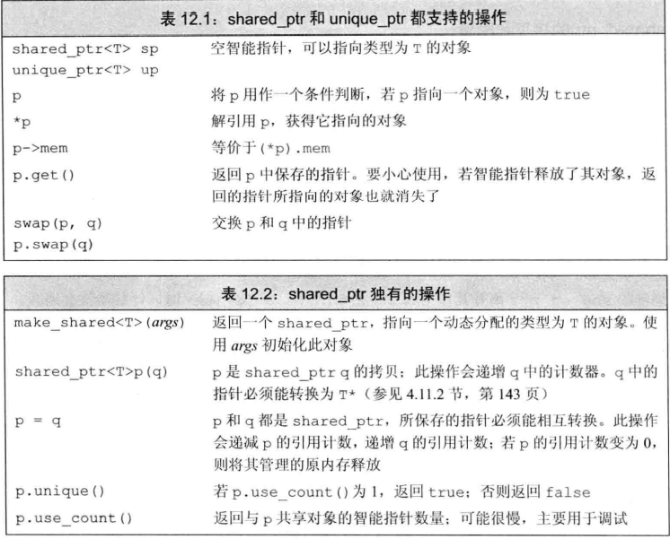

# 第 Ⅱ 部分  C++标准库

## 第 8 章  IO库

### 8.1  IO类

为了支持使用宽字符的语言，标准库定义了一组类型和对象来操纵wchar_t类型的数据。宽字符版本的类型和函数的名字以一个w开始。

- IO类型间的关系

  概念上，设备类型和字符大小都不会影响要执行的IO操作。例如，可以用>>来读取数据，而不用管是从一个控制台窗口还是一个磁盘文件，还是一个string读取。类似的，也不用管读取的字符能存入一个char对象内，还是需要一个wchar_t对象来存储。

  标准库是我们忽略这些不同类类型的流之间的差异，是通过==继承机制==实现的。利用模板可以使用具有继承关系的类，而不必了解继承机制如何实现工作的细节

  继承机制

## 第 12 章  动态内存

静态内存用来保存==局部```static```对象==、==类```static```数据成员==以及==定义在任何函数之外的变量==。

- 局部static对象：有时候令局部变量的生命周期贯穿函数调用及之后的时间。

  ```c++
  size_t count_calls(){
  	static size_t ctr = 0;
      return ++ctr;
  }
  int main(){
  	for(size_t i=0;i!=10;++i)
          cout<<count_calls()<<endl;
      return 0;
  }
  ```

  

- 类static数据成员：

  ```c++
  class Account{
  public:
      void calculate(){
          amount += amount * interestRate;
      }
      static double rate(){
          return interestRate;
      }
      static void rate(double);
  
  private:
      string owner;
      double amount;
      static double interestRate;
      static double initRate();
  };
  类的静态成员存在于任何对象之外，对象中不包含任何与静态数据成员有关的数据。因此每个Account对象将包含两个数据成员：owner和amount
  ```

栈内存用来保存定义在函数内的非```static```对象。

除了静态内存和栈内存之外，每个程序还有一个内存池，这部分内存称为自由空间或==堆(heap)==。程序用堆来存储动态分配的对象，就是那些在程序运行时分配的对象。

### 12.1  动态内存与智能指针

c++中，动态内存的管理是通过一对运算符来实现：```new  delete```。

- new：在动态内存中为对象分配空间并返回一个指向该对象的指针
- delete：接受一个动态对象的指针，销毁该对象，并释放与之关联的内存

为了更好地使用动态内存，现提供两种==智能指针==类型来管理动态对象。

- ==shared_ptr==：允许多个指针指向同一个对象
- ==unique_ptr==：独占所指向的对象
- weak_ptr：伴随类，弱引用，指向```shared_ptr```所管理的对象

#### 12.1.1  shared _ptr类

智能指针也是一种模板，所以创建一个智能指针时要提供额外的信息——指针可以指向的类型。

```c++
shared_ptr<string> p1;		//shared_ptr,可以指向string
shared_ptr<list<int>> p2;	//shared_ptr,可以指向int的list
```

默认初始化的智能指针保存着一个空指针。


智能指针的使用方式与普通指针类似。解引用一个智能指针返回它指向的对象。如果在一个条件判断中使用智能指针，效果就是检测它是否为空

```c++
if(p1  &&  p1->empty())
    *p1="hi";
```



##### a. make_shared 函数

最安全的分配和使用动态内存的方法是调用一个名为==make_shared==的标准库函数。函数在动态内存中分配一个对象并初始化它返回指向此对象的shared_ptr。

```c++
shared_ptr<int> p3 = make_shared<int>(42);
//指向一个值为42的int的shared_ptr
shared_ptr<string> p4 = make_shared<string>(10,'9');
//p4指向一个值为"9999999999"的string
shared_ptr<int> p5 = make_shared<int>();
//p5指向一个值初始化的int。
cout<<*p3<<endl;
cout<<*p4<<endl;
cout<<*p5<<endl;
```


通常用auto来定义一个对象来保存make_shared的结果

```c++
auto p6 = make_shared<vector<string>>();
```

##### b. shared_ptr的拷贝与赋值

当进行拷贝或赋值操作时，每个shared_ptr都会记录有多少个其他shared_ptr指向相同的对象

```c++
auto p = make_shared<int>(42);
auto q(p);			//p和q指向相同对象，此对象有两个引用者
```

可以认为每个```shared_ptr```都有一个关联的计数器，通常称其为引用计数器。无论何时拷贝一个```shared_ptr```，计数器都会递增。当我们给```shared_ptr```赋予一个新值或是```shared_ptr```被替换，计数器就会递减。

一旦一个```shared_ptr```的计数器变为0，它就会自动释放自己所管理的对象。

```c++
auto r = make_shared<int>(42);		//r指向的int只有一个引用者
r = q;								//给r赋值，令它指向另一个地址
递增q指向的对象的引用计数
递减r指向的对象的引用计数
r原来指向的对象已没有引用者，会自动释放										
```

##### c. shared_ptr自动销毁所管理的对象

当指向一个对象的最后一个```shared_ptr```被销毁时，```shared_ptr```类会自动销毁此对象，它是通过另一个特殊的成员函数——析构函数完成销毁工作的

##### d. shared_ptr还会自动释放相关联的内存

当动态对象不再被使用时，```shared_ptr```类会自动释放动态对象，这一特性使得动态内存的使用变得非常容易

```c++
shared_ptr<Foo> factory(T arg){
	return make_shared<Foo>(arg);
}
函数返回一个shared_ptr,指向Foo类型的动态分配的对象，对象是通过一个类型为T的参数进行初始化的
由于factory返回一个shard_ptr，所以可以确保它分配的对象会在恰当的时刻被释放
void use_factory(T arg){
	shared_ptr<Foo> p = factory(arg);
}
p是use_factory的局部变量，在use_factory结束时它将被销毁。
```

##### e.  使用了动态生存期的资源的类

- 程序不知道自己需要使用多少对象
- 程序不知道所需对象的准确类型
- 程序需要在多个对象间共享数据

容器类是出于第一种原因而使用动态内存的典型例子。截止目前使用过的类中，分配的资源都与对应对象生存期一致。例如每个vector拥有其自己的元素。当我们拷贝一个vector时，原vector和副vector中的元素是相互分离的：

```c++
vector<string> v1;	//空vector
{
    vector<string> v2 = {"a","an","the"};
    v1 = v2;
}
v2被销毁，其中的元素也被销毁
v1有3个元素，是v2的拷贝
```

但某些类分配的资源具有与原对象相独立的生存期。定义一个名为Blob的类，保存一组元素，希望Blob对象的不同拷贝之间共享相同的元素。也就是说：当拷贝一个Blob时，原Blob对象及其拷贝应该引用相同的底层元素。

一般而言，如果两个对象共享底层的数据，当某个对象被销毁时，不能单方面地销毁底层数据。

```C++
Blob<string> b1;	//空Blob
{
    Blob<string> b2 = {"a","an","the"};
    b1 = b2;
}
//b2被销毁了，但b2中的元素不能销毁
```

#### 12.1.2  直接管理内存

##### a. 使用new动态分配和初始化对象

在自由空间分配的内存是无名的，因此new无法为其分配的对象命名，而是返回一个指向该对象的指针。

```c++
int *pi = new int;		//pi指向一个动态分配的、未初始化的无名对象
```

new表达式在自由空间构造了一个int对象，并返回指向该对象的指针。

默认情况下，动态分配的对象是默认初始化的，这意味着内置类型或组合类型的对象的值是未定义的，类类型的对象将使用默认构造函数进行初始化

```c++
string *ps = new string;	//初始化为空string
int *pi = new int;			//pi指向一个未初始化的int
```

可以使用直接初始化方式初始化一个动态分配的对象。

```c++
int *pi = new int(1024);	//pi指向的对象的值为1024
string *ps = new string(10,'9');		//*ps为"9999999999"
vector<int> *pv = new vector<int>{0,1,2,3,4,5,6,7,8,9};
```

也可以对动态分配的对象进行值初始化，只需在类型名之后跟一对空括号就即可：

```c++
string *ps1 = new string;	//默认初始化为空string
string *ps = new string();	//值初始化为空string
int *pi1 = new int;			//默认初始化：*pi1的值未定义
int *pi1 = new int();		//值初始化为0；*pi2为0
```

可以使用auto从初始化器来推断我们想分配的对象的类型。只有当括号中仅有单一初始化器才可以使用auto。

```c++
auto p1 = new auto(obj);	//p指向有一个与obj类型相同的对象
auto p2 = new auto(a,b,c);	//错误
```

##### b. 动态分配的const对象

```c++
const int *pci = new const int(1024);		//分配并初始化一个const int
const string *pcs = new const string;		//分配并默认初始化一个const的空string
```

一个动态分配的const对象必须初始化。对于一个定义了默认构造函数的类类型，其const动态对象可以隐式初始化，而其他类型的对象就必须显式初始化。由于分配的对象是const的，new返回的指针是一个指向const的指针。

##### c. 内存耗尽

默认情况下，如果new不能分配所要求的内存空间，它就抛出一个```bad_alloc```的异常。可以改变使用new的方式来**<u>阻止它抛出异常</u>**。

```C++
int *p1 = new int;	//如果分配失败，new抛出std::bad_alloc
int *p2 = new (nothrow) int;//如果分配失败，new返回一个空指针
```

称这种形式的new为==定位new==，定位new表达式允许我们向new传递额外的参数。

##### d. 释放动态内存

```c++
delete p;	//p必须指向一个动态分配的对象或是一个空指针
```

销毁给定的指针指向的对象；释放对应的内存

##### e. 指针值和delete

传递给delete的指针必须指向动态分配的内存或是一个空指针。释放一块非new分配的内存，或是将相同的指针释放多次，其行为是未定义的:

```C++
int i, *pil = &i:
int *pi2 = nullptr;
double *pd = new double(33),*pd2 = pd;
delete i;	//错误，i是一个指针
delete pil;	//未定义：pil指向一个局部变量
delete pd;	//正确
delete pd2;	//未定义：pd2指向的内存已经被释放了
delete pi2;	//正确：释放一个空指针总是没有错误的
```

通常情况下，编译器不能分辨一个指针指向的是静态还是动态分配的对象。类似的，编译器也不能分辨一个指针所指向的内存是否已经被释放了。

虽然一个const对象的值不能被改变，但它本身可以被销毁的。

```c++
const int *pci = new const int(1024);
delete pci;
```

##### f. 动态对象的生存期直到被释放时为止

由```shared_ptr```管理的内存在最后一个```shared_ptr```销毁时会被自动释放。但对于通过内置指针来管理的内存就不是这样了。对于一个由内置指针管理的动态对象，直到被显式释放之前它都是存在的。

返回指向动态内存的指针(非智能指针)的函数给其调用者增加了一个负担——调用者必须释放内存

##### g. delete之后重置指针值

delete一个指针后，指针值就变为无效了。虽然指针已经无效，但在很多机器上指针仍然保存着(已经释放了的)动态内存的地址。delete之后，指针就变成了空悬指针——==指向一块曾经保存数据但现在已经无效的内存的指针。==

未初始化指针的所有缺点空悬指针也都有。

在指针即将离开其作用域之前释放掉它所关联的内存，这样可以避免空悬指针。指针关联的内存被释放掉之后，就没有机会继续使用指针了

如果需要保留指针，可以在delete之后将nullptr赋予指针，这样就清楚地指出指针不指向任何对象。

##### h. 这只是提供了有限保护


