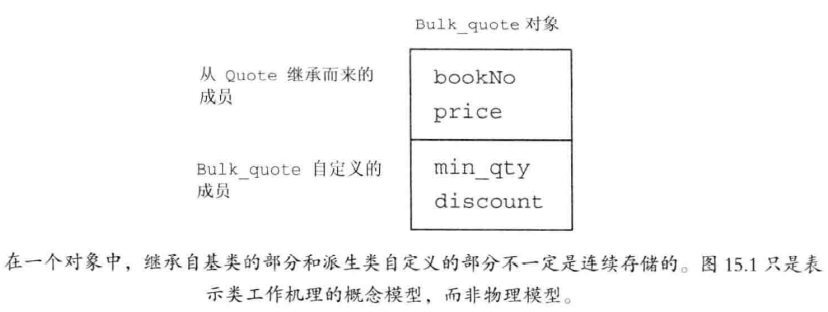

# 第 Ⅲ 部分  类设计者的工具

## 第 13 章 拷贝控制

当我们定义一个类时，我们显式地或隐式地指定在此类型的对象拷贝、移动、赋值和销毁时做什么。一个类通过定义五种特殊的成员函数来控制这些操作，包括：==拷贝构造函数==、==拷贝赋值运算符==、==析构函数==和==移动赋值运算符==、==移动构造函数==。拷贝和移动构造函数定义了当用同类型的另一个对象初始化本对象时做什么。拷贝和移动赋值运算符定义了将一个对象赋予同类型的另一个对象时做什么。析构函数定义了当此类型对象销毁时做什么。将这些操作称为<u>拷贝控制操作</u>。

### 13.1  拷贝、赋值与销毁

#### 13.1.1  拷贝构造函数

如果一个构造函数的第一个参数是自身类类型的引用，且任何额外参数都有默认值，则此构造函数是拷贝构造函数。

```C++
class Foo
{
    public:
    	Foo();				//默认构造函数
    	Foo(const Foo&);	 //拷贝构造函数
};
```

拷贝构造函数第一个参数必须是引用类型。拷贝构造函数在几种情况下几乎都是隐式使用，因此拷贝构造函数通常不应该是explicit(抑制构造函数定义的隐式转换)的。

- 合成构造函数

  如果我们没有为类定义一个拷贝构造函数，编译器也会为我们定义一个。与合成构造函数不同，即便我们定义了其他构造函数，编译器也会为我们合成一个拷贝构造函数。

  对某些类来说，合成拷贝构造函数用来阻止我们拷贝该类类型的对象。而一般情况，合成拷贝构造函数会将其参数的成员逐个拷贝到正在创建的对象中。编译器从给定对象中依次将每个非static成员拷贝到正在创建的对象中。

  ```C++
  class Sales_data
  {
      public:
      	//与合成的拷贝构造函数等价的拷贝构造函数声明
      Sales_data(const Sales_data&);
      private:
      	std::string bookNo;
      	int units_sold = 0;
      	double revenue = 0.0;
  };
  //与Sales_data的合成的拷贝构造函数等价
  Sales_data::Sales_data(const Sales_data &orig):
  	bookNo(orig.bookNo),			//使用string的拷贝构造函数
  	units_sold(orig.units_sold),	 //拷贝orig.units_sold
  	revenue(orig.revenue)			 //拷贝orig.revenue
      { }
  ```

- 拷贝初始化

  ```C++
  string dots(10,'.');				      //直接初始化
  string s(dots);							 //直接初始化
  string s2 = dots;						  //拷贝初始化	
  string null_book = "9-999-9999-9999-9";		//拷贝初始化	
  string nines = string(100,'9');				//拷贝初始化
  ```
  
  直接初始化时，实际上是要求编译器使用普通的函数匹配来选择与我们提供的参数最匹配的构造函数。当我们使用拷贝初始化时，我们要求编译器将右侧运算对象拷贝到正在创建的对象中，如果需要还要进行类型转换。																			
  
  拷贝初始化不仅在使用 = 定义变量时会发生，在下列情况时也会发生：
  
  - 将一个对象作为实参传递给一个非引用类型的形参
  - 从一个返回类型为非引用类型的函数返回一个对象
  - 用花括号初始化一个数组中的元素或一个聚合类中的成员
  
- 参数和返回值

  在函数返回调用时，具有非引用类型的参数要进行拷贝初始化。类似的，当一个函数具有非引用的返回类型时，返回值会被用来初始化调用方的结构。拷贝构造函数被用来初始化非引用类类型参数，这一特性解释了为什么拷贝构造函数自己的参数必须是引用类型。如果参数不是引用类型，则调用永远不会成功。

- 拷贝初始化的限制

  如果使用的初始化值要求通过一个explicit的构造函数来进行类型转换，使用拷贝初始化还是直接初始化无关紧要。

- 编译器可以绕过拷贝构造函数

  拷贝初始化过程中，编译器可以(不是必须)跳过拷贝/移动构造函数，直接创建对象。

  ```C++
  string null_book = "9-99-999-99999-9";	//拷贝初始化
  string null_book("9-99-999-99999-9");	//编译器略过了
  ```

  但是此例要求拷贝/移动构造函数必须说存在且可访问的

#### 13.1.1 练习

- 13.1  拷贝构造函数是什么？ 什么时候使用？

  ​		

#### 13.1.2  拷贝赋值运算符

与类控制其对象如何初始化一样，类也可以控制其对象如何赋值的

## 第 15 章  面向对象程序设计

### 15.1  OOP：概述

核心思想：==数据抽象、继承、动态绑定==

- 继承
  - 通过继承联系在一起的类构成一种层次结构。
  - 对于某些函数，基类希望它的派生类各自定义适合自身的版本，此时基类就将这些函数声明成虚函数。
  - 派生类必须在其内部对所有重新定义的虚函数进行声明
- 动态绑定
  - 通过动态绑定能用同一段代码分别处理Quote和Bulk_quote的对象

### 15.2  定义基类和派生类

#### 15.2.1  定义基类

```c++
class Quote{
public:
    Quote() = default;
    Quote(const string &book,double sales_price):bookNo(book),price(sales_price){}
    string isbn() const {return bookNo;}
    virtual double net_price(size_t n) const {return n*price;}
    virtual ~Quote() = default;     //对析构函数进行动态绑定
private:
    string bookNo;
protected:
    double price = 0.0;     //普通状态下不打折的价格
};
```

##### a. 成员函数与继承

派生类可以继承其基类的成员，然而遇到如```net_price```这样与类型相关的操作时，派生类必须对其重新定义。也就是说，派生类必须对这些操作提供自己的新定义以**<u>覆盖(override)</u>**从基类继承来到旧定义。

基类必须将它的两种成员函数区分开来：

- 基类希望其派生类进行覆盖的函数（基类通常将其定义为virtual）
- 基类希望派生类直接继承而不要改变的函数

使用指针或引用调用该虚函数时，该调用将被动态绑定。根据引用或指针所绑定的对象类型不同，该调用可能执行基类的版本，有可能执行派生类的版本。

任何构造函数之外的非静态函数都可以是虚函数。virtual关键字只能出现在类内部的声明语句之前！

成员函数没有被声明为虚函数，则其解析过程发生在编译时而非运行时

##### b.  访问控制与继承

派生类的成员函数不一定有权访问从基类继承而来的成员。

基类希望它的派生类有权访问该成员，同时禁止其他用户访问，我们用**<u>受保护的(protected)</u>**访问运算符说明这样的成员。

##### c.  Exercises

- E1:什么是虚成员？
  - 在类中被声明为virtua的成员，基类希望这种成员在派生类中重定义，除了构造函数外，任意非static成员都可以为虚成员
- E2:protected访问说明符与private有何区别？
  - protected为受保护的访问标号，protected成员可以被本类的成员、友元和派生类成员访问，而不可以被该类型的普通用户访问。而private成员只能被基类的成员和友元访问，派生类不能访问

#### 15.2.2  定义派生类

派生类必须通过使用类派生列表明确指出它是从哪个基类继承而来。

派生类必须将其继承而来的成员函数需要覆盖的那些重新声明

```c++
class Quote{
public:
    Quote() = default;
    Quote(const string &book,double sales_price):bookNo(book),price(sales_price){}
    string isbn() const {return bookNo;}
    virtual double net_price(size_t n) const {return n*price;}
    virtual ~Quote() = default;     //对析构函数进行动态绑定
private:
    string bookNo;
protected:
    double price = 0.0;     //普通状态下不打折的价格
};
class Bulk_quot:public Quote{
public:
    Bulk_quot() = default;
    Bulk_quot(const string&,double,size_t,double);
    double net_price(size_t) const override;
private:
    size_t min_qty = 0;
    double discount = 0.0;
};
```

Bulk_quote类从基类Quote那里继承了isbn函数和bookNo、price等数据成员。

如果一个派生是公有的，则基类的公有成员也是派生类接口的组成部分

##### a. 派生类中的虚函数

派生类经常覆盖它继承的虚函数。如果派生类没有覆盖基类中的某个虚函数，则该虚函数的行为类似于其他的普通成员，派生类会继承其在基类中的版本

##### b. 派生类对象及派生类向基类的类型转换

一个派生类对象包含多个组成部分：一个含有派生类自己定义的成员的子对象，以及一个与该派生类继承的基类对应的子对象。

一个Bulk_quote对象将包含4个数据元素：```min_qty``` ```discount``` ```bookNo``` ```price```

Bulk_quote包含：



因为在派生类对象中含有与其基类对应的组成部分，所以能把派生类的对象当成基类对象来使用，而且也能将基类的指针或引用绑定到派生类对象中的基类部分上

```c++
Quote item;					//基类对象
Bulk_quote bulk;			//派生类对象
Quote *p = &item;			//p指向Quote对象
p = & builk;				//p指向bulk的Quote部分
Quote &r = bulk;			//r绑定到bulk的Quote部分
```

##### c. 派生类构造函数

尽管在派生类对象中含有从基类继承而来的成员，但是派生类并不能直接初始化这些成员。派生类也必须使用基类的构造函数来初始化它的基类部分。

<u>！！！！！！！！！每个类控制它自己的成员初始化过程！！！！！！！！！</u>

派生类对象的基类部分与派生类对象自己的数据成员都是在构造函数的初始化阶段执行初始化操作的。

类似初始化成员的过程，派生类构造函数同样是通过构造函数初始化列表将实参传递给基类构造函数的

```c++
Bulk_quot(const string &book,double p,size_t qty,double disc):Quote(book,p),min_qty(qty),discount(disc){}
```

该函数将它的前两个参数(分别表示ISBN和价格)传递给Quote的构造函数，由Quote的构造函数负责初始化Bulk_quote的基类部分。接下来初始化派生类直接定义的min_qty成员和discount成员、最后运行Bulk_quote构造函数的函数体。

<u>！！！！首先初始化基类的部分，然后按照声明的顺序依次初始化派生类的成员！！！</u>

##### d. 派生类使用基类的成员

派生类可以访问基类的公有成员和受保护成员

派生类的作用域嵌套在基类的作用域之内。对于派生类的 一个成员来说，它使用派生类成员的方式与使用基类成员的方式没什么不同

##### e. 继承与静态成员

如果基类定义了一个静态成员，则整个继承体系中只存在该成员的唯一定义。不论从基类中派生出多少个派生类，对于每个静态成员来说都只存在唯一实例。

静态成员遵循通用的访问控制规则，如果基类中的成员是private的，则派生类无权访问它，假设某静态成员是可访问的，则我们通过基类使用它，也可使用派生类使用它

##### f. 派生类的声明

派生类的声明中包含类名但是不包含它的派生列表

```c++
class Bulk_quote:public Quote;	//错误！！！派生列表不能出现在这里
class Bulk_quote;				//正确！！
```

##### g. 被用作基类的类

如果想将某个类用作基类，则该类必须已经定义而非仅仅声明。

原因很简单：

- 派生类中包含并且可以使用它从基类继承而来的成员，为了使用这些成员，派生类必须要知道它们是什么
- 一个类不能派生它本身！！！
- 一个类是基类，同时它也可以是一个派生类

```c++
class Base {/*****************/};
class D1:public Base;{/*******/};
class D2:public D1;{/*********/};
```

Base是D1的直接基类，同时也是D2的间接基类。

##### h. 防止继承的发生

C++提供一种防止继承发生的方法，即在类后跟一个关键字```final```。

#### 15.2.3  类型转化与继承

通常情况下，如果我我们想把引用或指针绑定到一个对象上，则引用或指针的类型应与对象的类型一致。或者对象的类型含有一个可接受的const类型转换规则

存在继承关系的类是一个重要的例外：可以将基类的指针或引用绑定到派生类对象上。

- 这有一层更深的含义：当使用基类的引用或指针时，实际上我们并不清楚该引用或者指针所绑定对象的真实类型，可能是基类的对象，可能是派生类的对象

##### a. 静态类型与动态类型

使用存在继承关系的类型时，必须将一个变量或其他表达式的静态类型与该表达式表示对象动态类型区分开来。

表达式的静态类型在编译时总是已知的，它是变量声明时的类型或表达式生成的类型。动态类型则是变量或表达式表示的内存的对象的类型，直到运行时才可知。 

##### b. 不存在从基类向派生类的隐式类型转换

之所以存在派生类向基类的类型转换是因为每个派生类对象都包含一个基类部分，而基类的引用或指针可以绑定到该基类部分上。

一个基类的对象既可以以独立的形式存在，也可以作为派生类对象的一部分存在。如果基类对象不是派生类对象的一部分，则它只含有基类定义的一部分，而不含有派生类定义的成员。

##### c. 在对象之间不存在类型转换

派生类向基类的自动类型转换只对指针或引用类型有效，在派生类类型和基类类型之间不存在这样的转换。

当我们初始化或赋值一个类类型的对象时，实际上是在调用某个函数。当执行初始化时，我们调用构造函数，执行赋值操作时，我们调用赋值运算符。这些成员通常都包含一个参数，该参数的类型时类类型的const版本的引用。

这些成员接受引用作为参数，所以派生类向基类的转换运行我们给基类的拷贝/移动操作传递一个派生类的对象。

### 15.3  虚函数

！！！！！！！必须为每一个虚函数都提供定义，无论是否被用到！！！！！！！！

#### a. 对虚函数的调用可能在运行时才被解析

当某个虚函数通过指针或者引用调用时，编译器产生的代码直到运行时才能确定应该调用哪个版本的函数。

被调用的函数是与绑定到指针或引用上的对象的动态类型相匹配的哪一个。

动态绑定只有当我们通过指针或引用调用虚函数才会发生

```c++
Important:
---------------------------------多态性！----------------------------------
含义就就是多种形式。把具有继承关系的多个类型称为多态类型。
引用或指针的静态类型与动态类型不同这一事实正是C++语言支持多态性的根本所在。
    当我们使用基类的引用或指针调用基类中定义的一个函数，我们并不知道函数真正作用的对象是什么类型，可能是基类的对象也可能是派生类的对象。如果该函数是虚函数，则直到运行时才会决定执行哪个版本，判断的依据是引用或指针所绑定的对象的真实类型。
```

#### b. 派生类中的虚函数

一旦某个函数被声明为虚函数，所有的派生类中它都是虚函数。

一个派生类的函数如果覆盖了某个继承而来的虚函数，则它的形参类型必须与被它覆盖的基类函数完全一致。

同样虚函数的返回类型也必须与基类函数匹配。**<u>这个规则有一个例外</u>**，当类的虚函数返回类型是类本身的指针或引用时，上述规则无效。

假如D由B派生得到 ，则基类的虚函数可以得到```B*```而派生类的对应函数可以返回```D*```，只是这样的返回类型要求从D到B的类型转换是可转换的。

#### c. final和override说明符

派生类如果定义了一个函数与基类中的虚函数的名字相同但是形参列表不同，这仍是合法的行为。派生类的函数并没有覆盖掉基类中的版本，这种声明往往意味着发生了错误，因为可能原本希望派生类能覆盖基类中的虚函数。

c++11中可以使用```override```关键字来说明派生类中的虚函数。如果使用override标记了某个函数，但该函数并没有覆盖已存在的虚函数，此时编译器将报错。

```c++
struct B{
	virtual void f1(int) const;
    virtual void f2();
    void f3();
};
struct D:B{
	void f1(int) const override;		//正确
    void f2(int) override;				//错误，基类中没有f2(int)这样的函数
    void f3() override;					//错误。f3()不是虚函数
};
```

同时还能把某个函数指定为```final```，之后任何尝试覆盖该函数的操作都将引发错误。

```c++
struct B{
	virtual void f1(int) const;
    virtual void f2();
    void f3();
};
struct D2:B{
    //从B继承f2()和f3(),覆盖f1(int)
    void f1(int) const final;	//不允许后续的其他类覆盖f1(int)
};
struct D3:D2{
    void f2();					//正确：覆盖从间接基类继承而来的f2
    void f1(int) const;			//错误
};
```

#### d. 虚函数与默认实参

虚函数也可以拥有默认实参，如果某次函数调用使用了默认实参，则该实参值由本次调用的静态类型决定。

也就是说，如果我们通过基类的引用或指针调用函数，则使用基类中定义的默认实参。

#### e. 回避虚函数的机制

某些情况下，希望对虚函数的调用不要进行动态绑定，而是强迫其执行虚函数的特定版本。使用作用域运算符可以实现这一目的。

通常是当一个派生类的虚函数调用它覆盖的基类的虚函数版本时，需要回避虚函数的机制。

### 15.4  抽象基类

#### a. 纯虚函数

纯虚函数无需定义，通过在函数体的位置书写=0就可以将一个虚函数说明为纯虚函数，=0只能出现在类内部的虚函数声明语句处。                                                                                 

```c++
class Quote{
public:
    Quote() = default;
    Quote(const string &book,double sales_price):bookNo(book),price(sales_price){}
    string isbn() const {return bookNo;}
    virtual double net_price(size_t n) const {return n*price;}
    virtual ~Quote() = default;     //对析构函数进行动态绑定
private:
    string bookNo;
protected:
    double price = 0.0;     //普通状态下不打折的价格
};
class Disc_quote:public Quote{
//用于保存折扣值和购买量的类，派生类可以使用这些数据可以实现不同的价格策略
public:
    Disc_quote() = default;
    Disc_quote(const string &book,double price,size_t qty,double disc):Quote(book,price),quantity(qty),discount(disc){}
    double net_price(size_t) const =0;
private:
    size_t quantity = 0;
    double discount = 0.0;
};
```

不能直接定义这个类的对象，但是Disc_quote的派生类构造函数将会使用Disc_quote的构造函数会使用Disc_quote的构造函数来构建各个派生类对象的Disc_quote部分。

可以为纯虚函数提供定义，不过函数体必须定义在类的外部。

#### b. 含有纯虚函数的类是抽象基类

抽象基类负责定义接口，后续的其他类可以覆盖这个接口。不能直接创建一个抽象基类的对象。因为Disc_quote将net_price定义成了纯虚函数。可以定义Disc_quote的派生类的对象，前提是这些类覆盖了net_price函数。

Disc_quote的派生类必须给出自己的net_price定义，否组它仍然是抽象基类，

#### c. 派生类构造函数只初始化它的直接基类

```c++
class Quote{
public:
    Quote() = default;
    Quote(const string &book,double sales_price):bookNo(book),price(sales_price){}
    string isbn() const {return bookNo;}
    virtual double net_price(size_t n) const {return n*price;}
    virtual ~Quote() = default;     //对析构函数进行动态绑定
private:
    string bookNo;
protected:
    double price = 0.0;     //普通状态下不打折的价格
};
class Disc_quote:public Quote{
//用于保存折扣值和购买量的类，派生类可以使用这些数据可以实现不同的价格策略
public:
    Disc_quote() = default;
    Disc_quote(const string &book,double price,size_t qty,double disc):Quote(book,price),quantity(qty),discount(disc){}
    double net_price(size_t) const =0;
private:
    size_t quantity = 0;
    double discount = 0.0;
};
class Bulk_quote:public Disc_quote{
public:
    Bulk_quote() = default;
    Bulk_quote(const string& book,double price,size_t qty,double disc):
    Disc_quote(book,price,qty,disc){}
    double net_price(size_t) const override;
    //覆盖基类中的函数版本以实现新的折扣策略
};
```

Bulk_quote的直接基类是Disc_quote，间接基类是Quote。每个Bulk_quote对象包含三个子对象，一个是空的Bulk_quote部分，一个是Disc_quote子对象和一个Quote子对象。

每个类各自控制其对象的初始化过程。因此即使Bulk_quote没有自己的数据成员，它也仍然需要像以前一样提供一个接受四个参数的构造函数。

### 15.5  访问控制与继承

每个类分别控制自己的成员的初始过程，与之相似，每个类还分别控制着其成员对派生类 来说是否可访问。

#### a. 受保护的成员

一个类使用```protected```关键字来声明那些：它希望与派生类分享但是不想比被其他公共访问使用的成员

- 和私有成员类似，受保护的成员对于类的用户来说是不可访问的
- 和公有成员类似，受保护的成员对于派生类的成员和友元来说是可以访问的

```c++
--------------------------Important-----------------------------
派生类的成员或友元只能通过派生类对象来访问基类的受保护成员。派生类对于一个基类对象中受保成员没有任何访问特权
class Base{
protected:
    int prot_mem;
};
class Sneaky:public Base{
    friend void clobber(Sneaky&);   //能访问Sneaky::prot_mem
    friend void clobber(Base&);     //不能访问Base::prot_mem
    int j;  //j默认是private
};
void clobber(Sneaky &s){
    //正确：clobber可以访问Sneaky对象的private和protected成员
    s.j = s.prot_mem = 0;
}
void clobber(Base &b){
    //错误：clobber不能访问Base的protected成员
    b.prot_mem=0;
}
```

#### b. 公有、私有和受保护的继承

某个类对于继承而来的成员的访问权限受到两个因素影响

- 在基类中该成员的访问说明符
- 在派生类的列表中的访问说明符

```c++
class Base{
public:
    void pub_mem();
protected:
    int prot_mem;
private:
    char priv_mem;
};
struct Pub_Derv:public Base
{
    int f(){
        //正确：派生类能访问protected成员
        return prot_mem;
    }
    char g(){
        //错误，private成员对于派生类来说是不可访问的
        return priv_mem;
    }
};
struct Priv_Derv:private Base
{
    int f1() const{
        //private不影响派生类的访问权限
        return prot_mem;
    }
};
```

派生类访问说明符对于派生类的成员(及友元)能否访问其直接基类的成员没有影响。

对基类成员的访问权限只与基类中的访问说明符有关。Pub_Derv和Priv_Derv都能访问受保护的成员prot_mem，同时它们都不能访问私有成员priv_mem


派生类访问说明符的目的是==控制派生类用户(包括派生类的派生类)对于基类成员的访问权限:==

```c++
Pub_Derv d1;    //继承自Base的成员是public的
Priv_Derv d2;   //继承自Base的成员是private的
d1.pub_mem();   //正确，pub_mem()在派生类是public的
d2.pub_mem();   //错误，pub_mem()在派生类是private的
```

派生访问说明符还可以控制继承自派生类的新类的访问权限

```c++
class Base{
public:
    void pub_mem();
protected:
    int prot_mem;
private:
    char priv_mem;
};
struct Pub_Derv:public Base
{
    int f(){
        //正确：派生类能访问protected成员
        return prot_mem;
    }
    char g(){
        //错误，private成员对于派生类来说是不可访问的
        return priv_mem;
    }
};
struct Priv_Derv:private Base
{
    int f1() const{
        //private不影响派生类的访问权限
        return prot_mem;
    }
};
struct Derived_from_Public : public Pub_Derv
{
    int use_base() {
        //正确：Base::prot_mem在Pub_Derv中仍是protected的
        return prot_mem;
    }
};
struct Derived_from_Private:public Priv_Derv{
    int use_base(){
        //错误：Base::prot_mem在Priv_Derv中是private的
        return prot_mem;
    }
};
```

#### c. 派生类向基类转换的可访问性

派生类向基类的转换是否可访问由使用该转换的代码决定，同时派生类的派生访问说明符也会有影响。假定D继承自B。

- 只有当D公有地继承B时，用户代码才能使用派生类向基类的转换
- 不论D以什么方式继承B，D的成员函数和友元都能使用派生类向基类的转换；派生类向其直接基类的类型转换对于派生类的成员和友元来说永远都是可访问的
- 如果D继承B的方式是公有的或保护的，则D的派生类的成员和友元可以使用D向B的类型转换；反之，如果D继承B的方式是私有的，则不能使用

#### d. 友元与继承

友元关系不能继承。基类的友元在访问派生类成员时不具有特殊性。类似的，派生类的友元也不能随意访问基类的成员。

当一个类将另一个类声明为友元时，这种友元关系只能对作出声明的类的有效，对于原来的那个类来说，其友元的基类或派生类不具有特殊的访问能力。

#### e. 改变个别成员的可访问性

改变派生类继承的某个名字的访问级别，通过使用using声明

```c++
class Base{
public:
    size_t size() const {
        return n;
    }
protected:
    size_t n;
};
class Derived:private Base{
public:
    using Base::size;
protected:
    using Base::n;
};
```

Derived使用了私有继承，所以继承来的size和n是Derived的私有成员。然而使用using声明语句改变了这些成员的可访问性。改变之后，Derived的用于可以使用size成员，而Derived的派生类将能使用n

通过在类的内部使用using声明语句，可以将该类的直接或间接基类中的任何可访问成员标记出来。using声明语句中名字的访问权限由该using声明语句之间的访问说明符来决定。

即：如果一条using声明语句出现在类的private部分，则该名字只能被类的成员和友元访问；如果using声明语句位于public部分，则类的所有用户都能访问它；如果位于protected部分，则该名字对于成员、友元和派生类是可访问的。

### 15.6  继承中的类作用域

### 15.7  构造函数与拷贝控制

#### 15.7.1  虚析构函数

继承关系对于基类拷贝控制最直接的影响是基类通常应该一个虚析构函数，这样我们就能动态分配继承体系中的对象了。

delete一个动态分配的对象的指针时将执行析构函数。如果该指针指向继承体系中的某个类型，则有可能出现指针的静态类型与被删除对象的动态类型不符的情况

## 第 16 章  模板和泛型编程

### 16.1  定义模板

编写一个函数来比较两个值，可能要为每一种类型编写一个函数

#### 16.1.1  函数模板

```c++
template <typename T>
int compare(const T &v1,const T &v2){
    if(v1<v2) return -1;
    if(v1>v2) return 1;
    return 0;
}
```

##### a. 实例化函数模板

调用一个函数模板时，编译器通过会用函数实参来推断模板实参。

```c++
template <typename T>
int compare(const T &v1,const T &v2){
    if(v1<v2) return -1;
    if(v1>v2) return 1;
    return 0;
}
cout<<compare(1,0)<<endl;
```

编译器用推断出的模板参数来为我们实例化一个特定版本的函数。当编译器实例化一个模板时，它使用实际的模板实参代替对应模板参数创建出一个新实例

```c++
cout<<compare(1,0)<<endl;
//实例化出：
int compare(const int&,const int&)
vector<int> vec1{1,2,3},vec2{4,5,6};
cout<<compare(vec1,vec2)<<endl;
//实例化出：
int compare(const vector<int>&,const vector<int>&)
```

##### b. 模板类型参数

compare函数有一个模板类型参数。可以将类型参数看作类型说明符

```c++
template <typename T> 
T foo(T* p){
    T tmp = *p;//tmp的类型将是指针p指向的类型
    //...
    return tmp;
}
类型参数前必须使用关键字class或typename
template <typename T,U>
T calc(const T&,const U&);
//错误：U之前必须加上class或者typename
```

##### c. 非类型模板参数

一个非类型参数表示一个值而非一个类型。通过一个特定的类型名而非关键字class或者typename来指定非类型参数。

当一个模板被实例化，非类型参数被一个用户提供的或编译器推断出的值所代替。

##### d. inline和constexpr函数

正确版本：

```c++
templatem <typename T> inline 
T min(const T&,const T&);
```

##### e. 编写类型无关的代码

编写泛型代码的两个重要原则：

- 模板中的函数参数是const的引用(保证了函数可以用于不能拷贝的类型)
- 函数体中的条件判断仅使用```<```比较运算

##### f. 模板编译

当编译器遇到一个模板定义时，它并不生成代码。只有当我们实例化出模板的一个特定版本时，编译器才会生成代码。只有当我们使用模板时，编译器才会生成代码。

##### g. 大多数编译错误在实例化期间报告

编译器会在3个阶段报告错误：

- 编译模板本身。检查语法错误(忘记分号or变量名错误)
- 编译器遇到模板使用时。对于函数模板检查实参数目是否正确，检查参数类型是否匹配。对于类模板，检查用户是否提供了正确数目的模板实参。
- 模板实例化时

#### 16.1.2  类模板

类模板时用来生成类的蓝图的，与函数模板不同，编译器不能为类模板推断模板参数类型。为了使用类模板，必须在模板名后面的尖括号中提供额外信息——用来代替模板参数的模板实参列表。

##### a. 定义类模板

```c++
template <typename T>
class Blob{
public:
    typedef T value_type;
    typedef  typename vector<T>::size_type size_type;
    //构造函数
    Blob();
    Blob(initializer_list<T> il);
    //Blob中的元素数组
    size_type size() const {return data->size();}
    bool empty() const {return data->empty();}
    //删除和添加元素
    void push_back(const T &t){data->push_back(t);}
    //移动版本
    void push_back(T &&t){data->push_back(move(t));}
    void pop_back();
    //元素访问
    T& back();
    T& operator[] (size_type i);
private:
    shared_ptr<vector<T>> data;
    void check(size_type i,const string &msg) const;

};
```

```c++
template<class T>
class Pair{
publci:
    Pair();
    Pair(T firstValue,T secondValue);
    void setElement(int position,T value);
    T getElement(int position) const;
private:
    T first;
    T second;
};
```

##### b. 实例化类模板

定义好类模板后就可以声明该类的对象，声明必须指定要为T填充什么类型。

```c++
Pair<int> score;
Pair<char> seats;
```

例如以下语句将第一个球队的score设置为3，将第二个球队的score设置为0

```c++
score.setElement(1,3);
score.setElement(2,0);
```

##### c. 在模板作用域中引用模板类型  ？？？

类模板的名字不是一个类型名。类模板用来实例化类型，而一个实例化的类型总是包含模板参数的。

一个类模板的代码如果使用了另一个模板，通常不将一个实际类型的名字作为用作实例化类型。与之相反，通常将模板自己的参数当做被使用模板的实参。

##### d. 类模板的成员函数

既可以在类模板内部也可以在类模板外部为其定义成员函数，且定义在类模板内部的成员函数被隐式声明为内联函数。

类模板的成员函数本身是一个普通函数。但是，类模板的每个实例都有其自己版本的成员函数。因此，类模板的成员函数具有与模板相同的模板参数。因此，定义在类模板之外的成员函数就必须以关键字template开始，后接类模板参数列表。

```c++
template<class T>
class Pair{
publci:
    Pair();
    Pair(T firstValue,T secondValue);
    void setElement(int position,T value);
    T getElement(int position) const;
private:
    T first;
    T second;
};
template<class T>
void  Pair<T>::setElement(int position,T value){
    if(position == 1) first = value;
    else if(position == 2) second = value;
    else {
        cout<<"Error:Illegal pair position.\n";
        exit(1);
    }
}
template<class T>
Pair<T>::Pair(T firstValue,T secondValue):first(firstValue),second(secondValue){}
```


