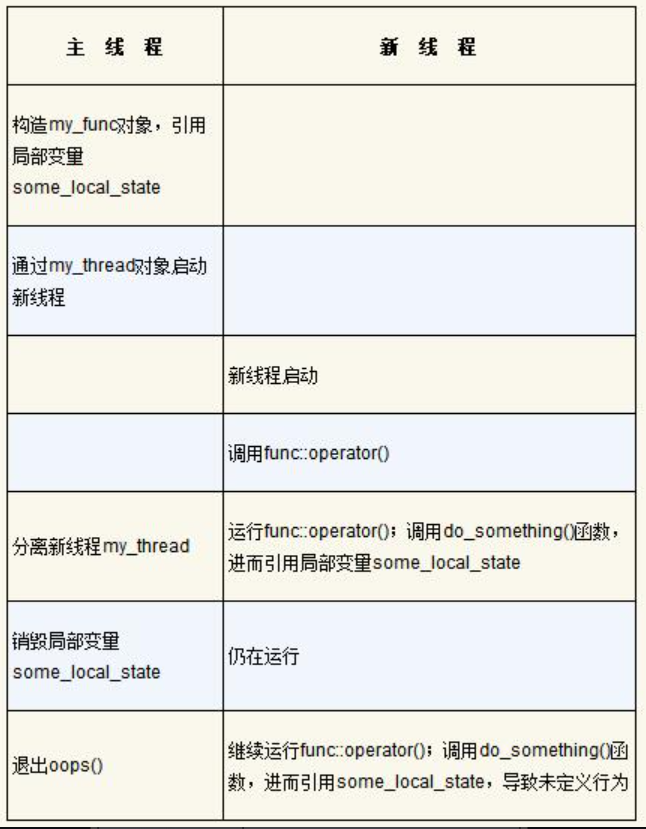

# 第2章  线程管控

This chapter covers:

- 发起线程，等待它结束，或者让它在后台运行
- 如何在启动时向线程函数传递参数，以及如何把线程的归属权从某个`std::thread`对象传递给另一个
- 探讨怎样选择合适数量的线程以及怎么识别特定的线程。

运用C++标准库就能使线程管控的大部分工作变得相对简单：如果给定一个线程，只要令`std::thread`对象与之关联，就能管控该线程的几乎每个细节。

## 2.1  线程的基本管控

### 2.1.1  发起线程

```c++
void do_some_work();
std::thread my_threadO(do_some_work());
```

任何可调用类型都适用于`std::thread`。

```c++
class background_task{
public:
    void operator()() const{
        do_something();
        do_something_else();
    }
};
background_task f;
std::thread my_thread(f);
```

上面的代码在构造std::thread实例时，提供了函数对象f作为参数，它被复制到属于新线程的存储空间中，并在那里被调用，由新线程执行。故此，副本的行为必须与原本的函数对象等效，否则运行结果可能有违预期。

假设，传入的是临时变量，而不是具名变量，那么调用构造函数的语法有可能与函数声明相同。遇到这种情况，编译器就会将其解释成函数声明，而不是定义对象。

语句`std::thread my_thread(background_task());`的本意是发起新线程，却被解释成函数声明：函数名是my_thread，只接收一个参数，返回std::thread对象，接收的参数是函数指针，所指向的函数没有参数传入，返回background_task对象；该指针是对background_task()的不当解释，其原意是生成临时的匿名函数对象。为临时函数对象命名即可解决问题，做法是多用一对圆括号，或采用新式的统一初始化语法（uniform initialization syntax，又名列表初始化）

```c++
std::thread my_thread((background_task()));
std::thread my_thread{background_task()};
```

还可以用lambda表达式解决这种问题，先略过...

```c++
std::thread my_thread([]{
    do_something();
    do_something_else();
});
```

一旦启动了线程。就需要明确是要等待它结束，还是任由它独自运行。假如等到`std::thread`对象销毁之际还没决定好，那`std::thread`的析构函数将调用`std::terminate()`终止整个程序。

假定程序不等待线程结束，那么在线程运行结束前，我们需保证它所访问的外部数据始终正确、有效。这并非新问题，在单线程代码中，试图访问已销毁的对象同样是未定义的行为。不过，因为使用多线程，所以我们可能会经常面临这种生存期问题。以下情形会诱发该问题：新线程上的函数持有指针或引用，指向主线程的局部变量；但主线程所运行的函数退出后，新线程却还没结束。

```c++
/*代码2.1*/
struct func{
    int& i;
    func(int& i_):i(i_){}
    void operator()(){
        for(unsigned j=0;j<1000000;++j){
            do_something(i);    ⇽---  ①隐患：可能访问悬空引用
        }
    }
};
void oops(){
    int some_local_state=0;
    func my_func(some_local_state);
    std::thread my_thread(my_func);
    my_thread.detach();    ⇽---  ②不等待新线程结束
}    ⇽---  ③新线程可能仍在运行，而主线程的函数却已结束
```

在本例中调用detach()，明确设定不等待。于是在oops()退出后，与my_thread对象关联的新线程很可能仍继续运行。如果新线程继续运行，表2.1所示的情形就会出现：do_something()的下一次调用会访问已经被销毁的局部变量。和普通的单线程代码一样，在函数退出后，程序依然准许指针或引用持续指向其局部变量，这绝不是好的构思，然而多线程代码更容易导致这种错误，因为即使出现了以上情形，错误也不一定立刻发生。



上述情形的处理方法通常是：令线程函数完全自含（self-contained），将数据复制到新线程内部，而不是共享数据。若由可调用对象完成线程函数的功能，那它就会完整地将数据复制到新线程内部，因此原对象即使立刻被销毁也无碍。然而，如果可调用对象含有指针或引用（类似代码清单2.1的代码），那我们仍需谨慎行事。具体而言，以下做法极不可取：意图在函数中创建线程，并让线程访问函数的局部变量。除非线程肯定会在该函数退出前结束，否则切勿这么做。

### 2.1.2  等待线程完成

若需等待线程完成，只要把`my_thread.detach()`替换为`my_thread.join()`

只要调用了join()，隶属于该线程的任何存储空间即会因此清除，std::thread对象遂不再关联到已结束的线程。事实上，它与任何线程均无关联。其中的意义是，对于某个给定的线程，join()仅能调用一次；只要std::thread对象曾经调用过join()，线程就不再可汇合（joinable），成员函数joinable()将返回false。

### 2.1.3  在出现异常的情况下等待

假使打算等待线程结束，则需小心地选择执行代码的位置来调用join()。原因是，如果线程启动以后有异常抛出，而join()尚未执行，则该join()调用会被略过。

```c++
/*代码2.2*/
struct func{
    int& i;
    func(int& i_):i(i_){}
    void operator()(){
        for(unsigned j=0;j<1000000;++j){
            do_something(i);    ⇽---  ①隐患：可能访问悬空引用
        }
    }
};
void f()
{
    int some_local_state=0;
    func my_func(some_local_state);
    std::thread t(my_func);
    try
    {
        do_something_in_current_thread();
    }
    catch(...)
    {
        t.join();
        throw;
    }
    t.join();
}
```

新线程依然访问f()内的局部变量some_local_state，而try/catch块的使用则保证了新线程在函数f()退出前终结（无论f()是正常退出还是因为异常而退出）。try/catch块稍显冗余，还容易引发作用域的轻微错乱，故它并非理想方案。假如代码必须确保新线程先行结束，之后当前线程的函数才退出（无论是因为新线程持有引用，指向函数内的局部变量，还是其他缘故），那么关键就在于，全部可能的退出路径都必须保证这种先后次序，无论是正常退出，还是抛出异常。

为达成前面的目标，可以设计一个类，运用标准的RAII手法，在其析构函数中调用join()

```c++
/*代码2.3利用RAII过程等待线程完结*/
class thread_guard
{
    std::thread& t;
public:
    explicit thread_guard(std::thread& t_):
        t(t_)
    {}
    ~thread_guard()
    {
        if(t.joinable())    ⇽---  ①
        {
            t.join();    ⇽---  ②
        }
    }
    thread_guard(thread_guard const&)=delete;    ⇽---  ③
    thread_guard& operator=(thread_guard const&)=delete;
};    ⇽---  ④
struct func;    ⇽---  定义见代码清单2.1
void f()
{
    int some_local_state=0;
    func my_func(some_local_state);
    std::thread t(my_func);
    thread_guard g(t);
    do_something_in_current_thread();
}
```

当主线程执行到f()末尾时，按构建的逆序，全体局部对象都会被销毁。因此类型thread_guard的对象g首先被销毁，在其析构函数中，新线程汇合②。即便do_something_in_current_thread()抛出异常，函数f()退出，以上行为仍然会发生。在

代码清单2.3中，thread_guard的析构函数先调用joinable()①，判别std::thread对象能否汇合，接着才调用join()②。该检查必不可少，因为在任何执行线程（thread of execution）上，join()只能被调用一次，假若线程已经汇合过，那么再次调用join()则是错误行为。

复制构造函数和复制赋值操作符都以“=delete”标记③，限令编译器不得自动生成相关代码。复制这类对象或向其赋值均有可能带来问题，因为所产生的新对象的生存期也许更长，甚至超过了与之关联的线程。在销毁原对象和新对象时，分别发生两次析构，将重复调用join()。只要把它们声明为删除函数，试图复制thread_guard对象就会产生编译错误。关于删除函数请参考附录A.2节。

### 2.1.4  在后台运行线程


## 2.2　向线程函数传递参数

若需向新线程上的函数或可调用对象传递参数，方法相当简单，直接向std::thread的构造函数增添更多参数即可。

线程具有内部存储空间，参数会按照默认方式先复制到该处，新创建的执行线程才能直接访问它们。然后，这些副本被当成临时变量，以右值形式传给新线程上的函数或可调用对象。即便函数的相关参数按设想应该是引用，上述过程依然会发生。

```c++
void f(int i,std::string const& s);
std::thread t(f,3,"hello");
```

这两行代码借由构造对象t新创建一个执行线程，它们互相关联，并在新线程上调用f(3, "hello")。请注意，尽管函数f()的第二个参数属于std::string类型，但字符串的字面内容仍以指针char const*的形式传入，进入新线程的上下文环境以后，才转换为std::string类型。如果参数是指针，并且指向自动变量（automatic variable）[5]，那么这一过程会产生非常重大的影响。

```c++
void f(int i,std::string const& s);
void oops(int some_param)
{
    char buffer[1024];                  //    ⇽---  ①
    sprintf(buffer, "%i",some_param);
    std::thread t(f,3,buffer);          //    ⇽---  ②
    t.detach();
}
```

向新线程②传递的是指针buffer，指向一个局部数组变量①。我们原本设想，buffer会在新线程内转换成std::string对象，但在此完成之前，oops()函数极有可能已经退出，导致局部数组被销毁而引发未定义行为。

这一问题的根源在于：我们本来希望将指针buffer隐式转换成std::string对象，再将其用作函数参数，可惜转换未能及时发生，原因是std::thread的构造函数原样复制所提供的值，并未令其转换为预期的参数类型。解决方法是，在buffer传入std::thread的构造函数之前，就把它转化成std::string对象。

```c++
void f(int i,std::string const& s);
void not_oops(int some_param)
{
    char buffer[1024];
    sprintf(buffer,"%i",some_param);
    std::thread t(f,3,std::string(buffer));     ⇽---  使用std::string避免悬空指针
    t.detach();
}
```

C++11还引入了另一种传递参数的方式：参数只能移动但不能复制，即数据从某个对象转移到另一个对象内部，而原对象则被“搬空”。这种型别的其中一个例子是std::unique_ptr，它为动态分配的对象提供自动化的内存管理。在任何时刻，对于给定的对象，只可能存在唯一一个std::unique_ptr实例指向它；若该实例被销毁，所指对象亦随之被删除。通过移动构造（move constructor）函数和移动赋值操作符（move assignment operator），对象的归属权就得以在多个std::unique_ptr实例间转移。

移动行为令std::unique_ptr的源对象（source object）的值变成NULL指针。函数可以接收这种类型的对象作为参数，也能将它作为返回值，充分发挥其可移动特性，以提升性能。若源对象是临时变量，移动就会自动发生。若源对象是具名变量，则必须通过调用std::move()直接请求转移。

```c++
void process_big_object(std::unique_ptr<big_object>);
std::unique_ptr<big_object> p(new big_object);
p->prepare_data(42);
std::thread t(process_big_object,std::move(p));
```

在调用std::thread的构造函数时，依据std::move(p)所指定的操作，big_object对象的归属权会发生转移，先进入新创建的线程的内部存储空间，再转移给process_big_object()函数。

在C++标准库中，有几个类的归属权语义与`std::unique_ptr`一样，`std::thread`类就是其中之一。虽然`std::thread`类的实例并不拥有动态对象（这与std::unique_ptr不同），但它们拥有另一种资源：每份实例都负责管控一个执行线程。因为`std::thread`类的实例能够移动（movable）却不能复制（not copyable），故此线程的归属权可以在其实例之间转移。这就保证了，对于任一特定的执行线程，任何时候都只有唯一的`std::thread`对象与之关联，还准许程序员在其对象之间转移线程归属权。

## 2.3  移交线程归属权

对于一个具体的执行线程，其归属权可以在几个std::thread实例间转移，如下面的代码所示。此例创建2个执行线程和3个std::thread实例t1、t2、t3，并将线程归属权在实例之间多次转移。

```c++
void some_function();
void some_other_function();
std::thread t1(some_function);    ⇽---  ①
std::thread t2=std::move(t1);    ⇽---  ②
t1=std::thread(some_other_function);    ⇽---  ③
std::thread t3;    ⇽---  ④
t3=std::move(t2);    ⇽---  ⑤
t1=std::move(t3);    ⇽---  ⑥该赋值操作会终止整个程序
```

