# 第4章  类与对象

```C++
class Clock{
public:
    void setTime(int newH,int newM,int newS);
    void showTime();
private:
    int hour, minute,second;
};
```

### 4.2.4  类的成员函数

#### a.  成员函数的实现

函数的原型要写在类体中，原型说明了函数的参数表和返回值类型。但函数的具体事项是写在类定义之外。

```c++
void Clock::setTime(int newH,int newM,int newS){
    hour=newH;
    minute=newM;
    second=newS;
}
void Clock::showTime(){
    cout << hour << ":" << minute << ":" << second << endl;
}
```

#### b.  成员函数调用中的目的对象

调用一个成员函数需要" . "操作符指出调用所针对的对象

```C++
Clock myClock;	//创建对象
myClock.showTime();	//myClock调用showTime()函数，myClock就是这一调用过程的目的对象
```

在成员函数中可以不适用" . "操作符而直接引用目的对象的数据成员。比如showTime()中所引用的hour，minute，second都是目的对象的数据成员，以myClock.showTime()调用该函数时，被输出的是myClock对象的hour，minute，second属性。在成员函数中调用当前类的成员函数时，如果不使用" . "，那么这一次调用所针对的仍然是目的对象。

类的成员函数中，既可以访问目的对象的私有成员，又可以访问当前类其他对象的私有成员。

#### c.  带默认形参的成员函数

类成员函数的默认值一般写在类定义中，不能写在类定义之外的函数实现中。比如时钟类的setTime()函数，就可以使用默认值实现：

```C++
class Clock{
    public:
    void setTime(int newH=0,int newM=0,int newS=0);
    ...
};
```

#### d.  内联成员函数

函数的调用要消耗一些内存资源和运行时间来传递参数和返回值，要记录调用时的状态，以便保证调用完成后能够返回并继续执行。==内联函数==：函数成员需要被频繁调用，并且代码比较简单。

内联函数的声明：隐式和显式

- 隐式：直接写在类内

  ```C++
  class Clock{
      public:
      void setTime(int newH,int newM,int newS);
      void showTime()
      {
          cout << hour << ":" << minute << ":" << second << endl;
      }
      private:
      int  hour,minute,second;
  };
  ```

- 显式：函数体实现，关键字inline

  ```C++
  inline void Clock::showTime(){
      cout << hour << ":" << minute << ":" << second << endl;
  }
  ```

## 4.3  构造函数和析构函数

类与对象之间的关系就像是基本数据类型与其变量的关系，即一般和特殊。不同对象之间有所区别的地方在于两个，第一个就是对象的名称，另一个就是对象自身的属性值，也就是数据成员的值 。定义对象时也可以同时对它的数据成员赋初值，这称之***对象的初始化***

### 4.3.1  构造函数

首先要理解对象的建立过程。为此先看基本数据类型变量(int型)的初始化过程：每一个变量在程序运行时都要占据一定的内存空间，在声明一个变量时对变量进行初始化，就意味着在为这个变量分配内存单元的同时，在其中写入了变量的初始值。

对象的建立过程也是类似：在程序的执行过程中，当遇到对象声明语句时，程序会向OS申请一定的内存空间用于存放新建的对象。不幸的是，我们不能像对待普通变量一样，在分配内存空间的同时将数据成员的初始值写入。编译系统严格规定了初始化程序的接口形式，并有一套自动的调用机制，即构造函数

==构造函数的作用就是在对象被创建时利用特定的值构造对象，将对象初始化为一个特定的状态。==

只要类中有了构造函数，编译器就会在建立新对象的地方自动插入对构造函数调用的代码。==构造函数在对象被创建的时候将被自动调用。==

调用时无需提供参数的构造函数称为默认构造函数。类中没有写构造函数，编译器会自动生成一个隐含的默认构造函数，其参数列表和函数体皆为空。如果我们自己声明了构造函数，无论我们自己声明的构造函数是否有参数，编译器都不会再生成隐含的构造函数。

```C++
class Clock{
public:
    Clock(int newH,int newM,int newS);
    void setTime(int newH,int newM,int newS);
    void showTime();
private:
    int hour, minute,second;
};
Clock::Clock(int newH,int newM,int newS){
    hour = newH;
    minute = newM;
    second = newS;
}
void Clock::setTime(int newH,int newM,int newS){
    hour=newH;
    minute=newM;
    second=newS;
}
void Clock::showTime(){
    cout << hour << ":" << minute << ":" << second << endl;
}
int main()
{   
    Clock c(0,0,0);
    c.showTime();
    c.setTime(0,0,0);
    Clock c1(8,30,30);
    c1.showTime();
    c1.setTime(8,30,30);
    system("Pause");
    return 0;
}
```

### 4.3.2  拷贝构造函数

拷贝构造函数是一种特殊的构造函数，具有一般构造函数的所有特性，其形参是==本类的对象的引用==。**其作用是使用一个已经存在的对象(由拷贝构造函数的参数指定)，去初始化同类的一个新对象。**

程序员可以根据实际需要定义特定的拷贝构造函数，以实现同类对象之间数据成员的传递。如果没有定义类的拷贝构造函数，系统就会自动生成一个隐含的拷贝构造函数，其功能是：把初始值对象的每个数据成员的值复制到子新建立的对象中。

```C++
class Point{
public:
    Point(int xx=0,int yy=0)    /*内联构造函数*/
    {
        x=xx;
        y=yy;
    }
    Point(Point &p);            /*拷贝构造函数*/
    int getX() {return x;}
    int getY() {return y;}
private:
    int x;
    int y;
};
Point::Point(Point &p)          /*拷贝构造函数的实现*/
{
    x=p.x;
    y=p.y;
    cout<<"Calling the copy constructor"<<endl;
}
void f(Point p){
    cout << p.getX() << endl;
}
Point g(){			/*表面上函数g将a返回给主函数，但a是g()的局部对象*/
  	Point a(1,2);	/*离开建立它的函数g后就消亡了，不可能在主函数继续生存*/
    return a;		/*解决方法：在主函数中创建一个临时对象，其生存期只在b=g()中*/
    				/*执行return a;后实际上调用拷贝构造函数将a的值复制到临时对象中*/
    				/*函数g运行结束时a对象a页消失，但临时对象会存在于表达式b=g()中*/
    				/*计算完b=g()后，临时对象使命完成，然后消失*/
}
int main()
{   
    Point a(1,2);
    Ponit b(a);
    Point c=a;	//对b和c的初始化都能够调用复制构造函数
    f(a);		/*只有把对象用值传递时，才会调用拷贝构造函数，如果是传递引用，则不会调用*/
    Point d;
    d=g();
    system("Pause");
    return 0;
}
```

### 4.3.3  析构函数

构造对象时，在构造函数中分配了资源(动态申请了一些内存单元)，对象消失时就要释放这些内存单元。析构函数就是用来==完成对象被删除前的一些清理动作，它是在对象的生存期即将结束的时刻被自动调用的。==

```c++
class Clock{
public:
    Clock();	//构造函数
    void setTime(int newH,int newM,int newS);
    void showtime();
    ~Clock() {}
private:
    int hour,minute,second;
};
```

### 4.3.4  程序实例

一圆形泳池，现需要在其周围建一圆形过道，并在其四周围上栅栏，栅栏价格35元/米，过道价格20元/平方米，过道宽度为3米，游泳池半径有键盘输入。编程计算并输出过道和栅栏的造价

```c++
#include <iostream>
using namespace std;
const float PI=3.141593;
const float FENCE_PRICE=35;
const float CONCRETE_PRICE=20;
class Circle{
public:
    Circle(float r);
    float circumference();  //计算周长
    float area();           //计算面积
private:
    float radius;
};
Circle::Circle(float r){
    radius=r;
}
//构造函数也可以改写成
Circle::Circle(float r):radius(r){}
float Circle::circumference(){
    return 2*PI*radius;
}
float Circle::area(){
    return PI*radius*radius;
}
int main()
{   
    float radius;
    cout<<"Enter the radius of the pool: "<<endl;
    cin >> radius;
    Circle pool(radius);
    Circle poolRim(radius+3);

    float fenceCost=poolRim.circumference()*FENCE_PRICE;
    cout << "Fencing Cost is $ " << fenceCost << endl;

    float ConcreteCost = (poolRim.area()-pool.area())*CONCRETE_PRICE;
    cout << "Concrete Cost is $ " << ConcreteCost << endl;
    system("Pause");
    return 0;
}
```

## 4.4  类的组合

### 4.4.1  组合

类的组合描述的是一个类内嵌其他类的对象作为成员的情况，它们之间是一种包含与被包含的关系。当创建类的对象时，如果这个类具有内嵌对象成员，那么各个内前对象首先被自动创建。在创建对象时既要对本类的基本类型数据成员进行初始化，又要对内嵌对线成员进行初始化。

```C++
类名::类名(形参表):内嵌对象1(形参表),内嵌对象2(形参表),...
{类的初始化}
```

内嵌对象1(形参表),内嵌对象2(形参表)...称为初始化列表，作用是**对内嵌对象进行初始化。**


在创建一个组合类的对象时，不仅是它自身的构造函数被执行，而且还将调用其内嵌对象的构造函数，构造函数的顺序如下：

- 调用内嵌对象的构造函数，调用顺序按照内嵌对象在组合类的定义中出现的次序。要注意的是，内嵌对象在构造函数的初始化列表中出现的顺序内嵌对象构造函数的调用顺序无关
- 执行本类构造函数的函数体。

```c++
class Point{
public:
    Point(int xx=0,int yy=0){   /*构造函数*/
        x=xx;
        y=yy;
    }
    Point(Point &p);
    int getx(){return x;}
    int gety(){return y;}
private:
    int x,y;
};
Point::Point(Point &p){
    x=p.x;
    y=p.y;
    cout << "Calling the copy constructot of Point" << endl;
}
class Line{
public:
    Line(Point xp1,Point xp2);
    Line(Line &l);
    double getLen() {return len;}
private:
    Point p1,p2;
    double len;
};
Line::Line(Point xp1,Point xp2):p1(xp1),p2(xp2){
    cout<<"Calling constructor of Line"<<endl;
    double x=static_cast<double>(p1.getx()-p2.getx());
    double y=static_cast<double>(p1.gety()-p2.gety());
    len=sqrt(x*x+y*y);
}
Line::Line(Line &l):p1(l.p1),p2(l.p2){
    cout<<"Calling the copy constructor of Line"<<endl;
    len=l.len;
}
int main()
{   
    Point myp1(1,1),myp2(4,5);
    Line line(myp1,myp2);
    Line line2(line);
    cout<<"The length of the line is: ";
    cout<<line.getLen()<<endl;
    cout<<"The length of the line2 is: ";
    cout<<line.getLen()<<endl;
    system("Pause");
    return 0;
}
```

程序分析：

主程序执行时，首先生成两个Point类对象，然后构造Line的对象line，接着通过拷贝构造函数建立Line的第二个对象line2，最后输出两点距离。

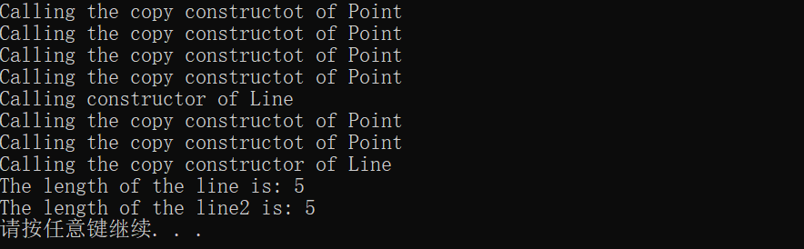

难点是这四个Point的拷贝构造函数是怎么输出的！

```
Point myp1(1,1),myp2(4,5); 只是调用Point的构造函数,建立好了两个点
Line line(myp1,myp2);现在建立线段对象
先进入到Point的拷贝构造函数实现，因为进行Line类的构造函数首先要把参数传进去，xp1、xp2参数传进去之后才来到线段类的构造函数，xp1初始化p1同样需要进入到Point类的拷贝构造函数中去，xp2同样，之后计算长度。
之后的两次是因为：
l.p1初始化p1，l.p2初始化p2，而Line &1是引用，并不需要调用拷贝构造函数。
```

### 4.4.2  前向引用声明

## 4.5    UML图形标识

### 4.5.1  UML简介

### 4.5.2  UML类图

## 4.6  结构体和联合体

### 4.6.1  结构体

一种特殊的类，和类的区别就是具有不同的默认访问权限。类中对于未指定访问控制权限的成员，其访问控制属性是private；结构体中，对于未指定任何访问控制属性的属性，其访问控制属性为public。

C++引入结构体的目的是保持和C程序的兼容性

### 4.6.2  联合体

联合体的全部数据成员共享同一组内存单元

```C++
union Mark{
	char grade;
    bool pass;
    int percent;
};
```


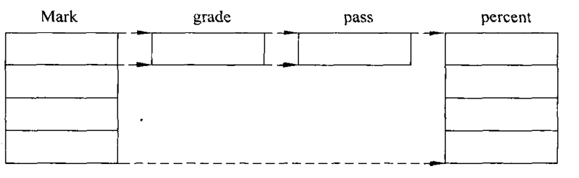

正是由于联合体的成员共用相同的内存单元，联合体变量中的成员同时至多只有一个是有意义的。除此以外，不同数据成员共用相同内存单元的特性，联合体有下面限制：

- 联合体的各个对象成员，不能有自定义的构造函数、自定义的析构函数和重载的拷贝复制运算符。
- 联合体不能继承、不支持包含多态

```C++
#include <iostream>
#include <string>
using namespace std;
class ExamInfo{
public:
    ExamInfo(string name,char grade):name(name),mode(GRADE),grade(grade){}
    ExamInfo(string name,bool pass):name(name),mode(PASS),pass(pass){}
    ExamInfo(string name,int percent):name(name),mode(PERCENTAGE),percent(percent){}
    void show();
private:
    string name;
    enum{
        GRADE,
        PASS,
        PERCENTAGE,
    }mode;
    union {
        char grade;
        bool pass;
        int percent;
    };
};
void ExamInfo::show(){
    cout << name << ": ";
    switch (mode){
        case GRADE:cout<<grade;
        break;
        case PASS:cout<<(pass?"PASS":"FALL");
        break;
        case PERCENTAGE:cout<<percent;
    }
    cout<<endl;
}
int main()
{   
    ExamInfo course1("English",'B');
    ExamInfo course2("Calculus",true);
    ExamInfo course3("C++",85);
    course1.show();
    course2.show();
    course3.show();
    system("Pause");
    return 0;
}
```


## 4.7  综合实例——个人银行账户管理程序

```C++
class Savingsaccount{
private:
    int id;
    double balance;     //余额
    double rate;        //存款的年利率
    int lastDate;       //上次变更余额的日期
    double accumulation;//余额按日累加之和
    /*记一笔账，date为日期，amount为余额，desc为说明*/
    void record(int date,double amount);
    //获得指定日期为止的存款金额按日累计值
    double accumulate(int date) const {
        return accumulation+balance*(date-lastDate);
    }
public:
    Savingsaccount(int date,int id,double rate);
    int getId(){return id;}
    double getBalance(){return balance;}
    double getRate(){return rate;}
    void deposit(int date,double amount);   //存入现金
    void withdraw(int date,double amount);  //取出现金
    //结算利息，每年1月1日调用一次该函数
    void settle(int date);
    //显示账户信息
    void show();
};
Savingsaccount::Savingsaccount(int date,int id,double rate)
    :id(id),balance(0),rate(rate),lastDate(date),accumulation(0){
    cout<<date<<"\t#"<<id<<" is created"<<endl;
}
void Savingsaccount::record(int date,double amount){
    accumulation=accumulate(date);
    lastDate=date;
    amount=floor(amount*100+0.5)/100;
    balance+=amount;
    cout<<date<<"\t#"<<id<<"\t"<<amount<<"\t"<<balance<<endl;
}
void Savingsaccount::deposit(int date,double amount){
    record(date,amount);
}
void Savingsaccount::withdraw(int date,double amount){
    if(amount>getBalance())
    cout<<"Error:not enough money"<<endl;
    else
    record(date,-amount);
}
void Savingsaccount::settle(int date){
    double interest=accumulate(date)*rate/365;
    if(interest!=0)
        record(date,interest);
    accumulation=0;
}
void Savingsaccount::show(){
    cout<<"#"<<id<<"\tBalance:"<<balance<<endl;;
}
int main()
{   
    Savingsaccount sa0(1,21325302,0.015);
    Savingsaccount sa1(1,58320212,0.015);
    sa0.deposit(5,5000);
    sa1.deposit(25,10000);
    sa0.deposit(45,5500);
    sa1.withdraw(60,4000);
    //开户后第90天到了银行的计息日，结算所有账户的年息
    sa0.settle(90);
    sa1.settle(90);
    sa0.show();
    sa1.show();
    system("Pause");
    return 0;
}
```

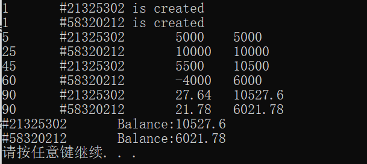

## 4.8  深度探索

### 4.8.1  位域

允许将类中的多个数据成员打包，从而使不同成员可以共享相同的字节的机制。类定义中，位域的定义方式为：

```
数据类型说明符 成员名:位数;		//位数来指定一个位域所占用的二进制位数
```

note：

- 不同编译器，包含位域的类所占用的空间也会有所不同
- 只有bool、int、char、enum的成员才能定义为位域
- 位域虽节省空间，但会增加时间

### 4.8.2  用构造函数定义类型转换           

### 4/.8.3 0 对象作为函数参数和返回值的传递方式

# 第 5 章  数据的保护与共享

## 5.1  标识符的作用域

### 5.1.1  作用域

一个标识符在程序正文中有效的区域

#### a.  函数原始作用域

在函数原型声明时形式参数的作用范围是函数原型作用域

```C++
double area(double radius);
//标识符radius的作用范围就在函数area形参列表的左右括号之间
//程序的其他地方都不能引用这个标识符
```

#### b.  局部作用域

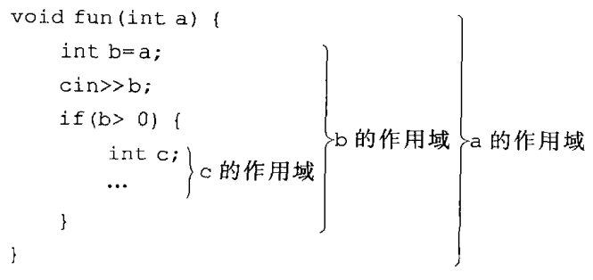

具有局部作用域的变量也称为局部变量

#### c.  类作用域

类可以看成是一组有名成员的集合，类X的成员m具有类作用域，对m的访问方式有以下三种

- 如果X的成员函数中没有声明同名的局部作用域标识符，那么在该函数内可以直接访问成员m
- 通过x.m或者X::m
- 通过```ptr->m```

#### d. 命名空间作用域

上海和武汉都有南京，直接说南京路会有歧义，所以命名空间类似”上海的南京路“和”武汉的南京路“的作用

### 5.1.2  可见性

作用域关系图：

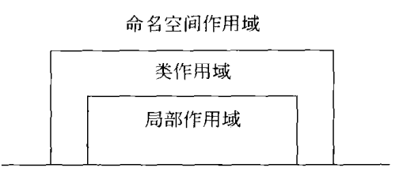


作用域一般规则：

- 标识符要声明在前，引用在后
- 同一作用域，不能声明同名的标识符
- 在没有互相包含关系的不同的作用域中声明的同名标识符，互不影响
- 如果在两个或多个具有包含关系的作用域中声明了同名标识符，则外层标识符在内层不可见

## 5.2  对象的生存期

对象从诞生到结束的这段时间就是它的生存期，分为静态生存期和动态生存期

### 5.2.1  静态生存期

如果对象的生存期与程序的运行期相同，则称之为静态生存期。在函数内部的局部作用域声明具有静态生存期的对象，要使用关键字static

```static int i;``` 其特点是，i并不会随着每次调用而产生一个副本，也不会随着函数返回而失效。即：当一个函数返回后，下一次再调用时，该变量还是会保持上一回的值。

### 5.2.2  动态生存期

局部作用域中声明的具有动态生存期的对象，习惯上也称为局部生存期对象。局部生存期对象诞生于声明点，结束于声明所在的块执行完毕之时。

```C++
int i=1;
void other(){
    static int a=2;
    static int b;
    //a,b是静态局部变量，具有全局寿命，局部可见
    //a,b只有第一次进入函数时被初始化
    int c=10;   //c为局部变量，具有动态生存期，每次进入函数时被初始化
    a+=2;
    i+=32;
    c+=5;
    cout << "---OTHER---" << endl;
    cout << "i: " <<i<<"a: "<<a<<"b: "<<b<<"c: "<<c<<endl;
    b=a;
}
int main()
{   
    static int a;
    int b=-10;
    int c=0;
    cout<<"```MAIN```"<<endl;
    cout<<"i: "<<i<<"a: "<<a<<"b: "<<b<<"c: "<<c<<endl;
    c+=8;
    other();
    cout<<"```MAIN```"<<endl;
    cout<<"i: "<<i<<"a: "<<a<<"b: "<<b<<"c: "<<c<<endl;
    i+=10;
    other();
    system("Pause");
    return 0;
}
```

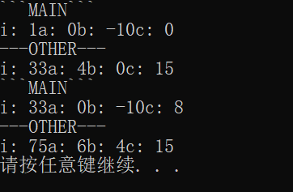

```c++
class Clock{
public:
    Clock();
    void setTime(int newH,int newM,int newS);
    void showTime();
private:
    int hour,minute,second;
};
Clock::Clock():hour(0),minute(0),second(0){}
void Clock::setTime(int newH,int newM,int newS){
    hour=newH;
    minute=newM;
    second=newS;
}
void Clock::showTime(){
    cout<<hour<<":"<<minute<<":"<<second<<endl;
}
Clock globClock;
int main()
{   
    cout<<"First time output: "<<endl;
    globClock.showTime();
    globClock.setTime(8,30,30);
    Clock myglob(globClock);
    cout<<"Second time output: "<<endl;
    myglob.showTime();
    system("Pause");
    return 0;
}
```

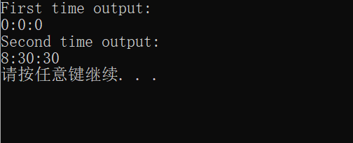

## 5.3  类的静态成员

静态成员时解决同一个类的不同对象之间数据和函数共享问题的。例如抽象出某公司全体雇员的共性，设计以下类：

```C++
class Employee{
private:
    int empNo;
    int id;
    string name;
    ...
};
```

如何统计雇员总数？这个数据应该放在何处，如果用类外的变量来存储总数，就不能实现数据的隐藏。若要在类中增加一个数据成员用于存放总数，必然在每个对象中都会存储一个副本，理想方案就是类的所有对象共同拥有一个用于存放总数的数据成员，这就是静态数据成员

### 5.3.1  静态数据成员

一个类的所有对象具有相同的属性，是指属性的个数、名称、数据类型相同，各个对象的属性值可以不同。

如果某个属性为整个类所共有，不属于任何一个具体对象，则采用static关键字来声明为静态成员。静态成员在每个类只有一个副本，由该类的所有对象共同维护和使用，从而实现了的同一类的不同对象之间的数据共享。

类属性是描述该类的所有对象共同特征的一个数据项，对于任何数据实例，它的属性值是相同的。举个例子，类是一个工厂，对象是工厂生产出的产品，那么静态成员就是存放于工厂中，属于工厂，但不属于每个产品。

静态数据成员具有静态生存期。可以用"类名::标识符"来访问

在类的定义中仅仅对静态数据成员进行引用型声明，必须在命名空间作用域的某个地方使用类名限定定义性声明，这时也可以进行初始化。==之所以类的静态数据成员需要在类定义之外再加以定义，是因为需要以这种方式专门为它们分配空间==。**非静态数据成员**无须用这种方式定义是因为，**它们的空间是与它们所属对象的空间同时分配的**。

```c++
class Point{
public:
    Point(int x,int y):x(x),y(y){
        count++;
    }
    Point(Point &p){
        x=p.x;
        y=p.y;
        count++;
    }
    ~Point(){count--;}
    int getX() const {return x;}
    int getY() const {return y;}
    void showCount(){
        cout<<" Object count="<<count<<endl;
    }
private:
    int x,y;
    static int count;
};
int Point::count=0;         //静态数据成员定义和初始化，使用类名限定
int main()
{    
    Point a(4,5);
    cout<<"Point A: "<<a.getX()<<", "<<a.getY();
    a.showCount();
    Point b(a);
    cout<<"Point B: "<<b.getX()<<", "<<b.getY();
    b.showCount();
    system("Pause");
    return 0;
}
```

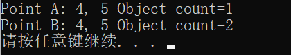

### 5.3.2  静态函数成员

上例代码中，```showCount```是专门用于输出静态数据成员```count```的。要输出```count```只能通过```Point```类的某个对象来调用函数```showCount```。在所有对象声明之前```count```的值是初始值0。想要输出这个初始值，只能通过**静态成员函数**。静态成员函数也属于整个类，由同一个类的所有对象共同拥有，为这些对象所共享。

静态成员函数可以通过类名或者对象名来调用，而非静态成员函数只能通过对象名来调用

==静态成员函数可以直接访问该类的静态数据和函数成员。而访问非静态成员，必须通过对象名。==

```c++
//静态成员函数访问非静态成员
class A{
public:
    static void f(A a);
private:
    int x;
};
void A::f(A a){
	cout<<x;	//错误的
    cout<<a.x;	//正确的
}
```

可以发现，这种访问是很麻烦的，一般情况下，静态成员函数主要用来访问同一个类中的静态数据成员，维护对象之间共享的数据。

之所以静态函数成员访问非静态数据成员要指明对象，是因为对静态成员函数的调用是没有目的对象的

```C++
class Point{
public:
    Point(int x,int y):x(x),y(y){
        count++;
    }
    Point(Point &p){
        x=p.x;
        y=p.y;
        count++;
    }
    ~Point(){count--;}
    int getX() const {return x;}
    int getY() const {return y;}
    static void showCount(){
        cout<<"Object count="<<count<<endl;
    }
private:
    int x,y;
    static int count;
};
int Point::count=0;         //静态数据成员定义和初始化，使用类名限定
int main()
{    
    Point::showCount();
    Point a(4,5);
    cout<<"Point A: "<<a.getX()<<", "<<a.getY();
    Point::showCount();
    Point b(a);
    cout<<"Point B: "<<b.getX()<<", "<<b.getY();
    Point::showCount();
    system("Pause");
    return 0;
}
```

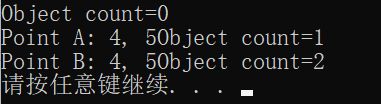

## 5.5  共享数据的保护

### 5.5.1  常对象

常对象：它的数据成员在对象的整个生存期间内不能被改变。也就是说==常对象必须先初始化，而且不能被更新。==

```c++
const 类型说明符 对象名;
class A{
public:
    A(int i,int j):x(i),y(j);{}
private:
    int x,y;
};
const A a(3,4);
```

在定义一个变量或常量时为它指定初值叫做初始化，而在定义一个变量或常量以后使用赋值运算符修改它的值叫做赋值。


# 第6章  数组、指针与字符串

## 6.1  数组

用于存储和处理大量同类型数据的数据结构。数组是具有一定顺序关系的若干对象的集合体，组成数组的对象称为该数组的元素。

### 6.1.1  数组的声明与使用

#### a.  数组的声明

```C++
数据类型  标识符[常量表达式1][常量表达式2]...
```

#### b.  数组的使用

只能分别对数组的各个元素进行操作

```c++
int main()
{   
    int a[10],b[10];
    for(int i=0;i<10;i++){
        a[i]=i*2-1;
        b[10-i-1]=a[i];
    }
    for(int i=0;i<10;i++){
        cout<<"a["<<i<<"]= "<<a[i]<<" ";
        cout<<"b["<<i<<"]= "<<b[i]<<endl;
    }
    system("Pause");
    return 0;
}
```

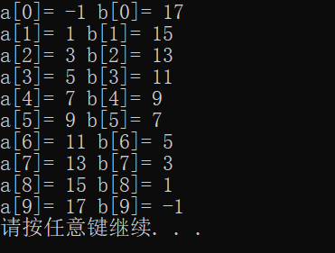

### 6.1.2  数组的存储与初始化

#### a.  数组的存储

数组元素在内存中顺序、连续存储的。

二维数组被当做一维数组的数组。例如，```int m[2][3]```所定义的m，可以看作是这样一个数组，它的大小是2，每个元素是一个大小为3、int类型的数组。

#### b.  数组的初始化

数组的初始化就是时在声明数组时给部分或全部元素赋初值。

- 基本类型数组，初始化过程就是给数组元素赋值
- 对象元素，每个元素都是某个类的一个对象，初始化就是调用该对象的构造函数

### 6.1.3  数组作为函数参数

- 数组元素和数组名都可以作为函数的参数以实现数据间数据的传递和共享

- 使用数组名作为函数的参数，则实参和形参都应该是数组名称，且类型要相同

- 使用数组名传递数据时，传递的是地址

  ```c++
  void rowSum(int a[][4],int nRow){
      for(int i=0;i<nRow;i++){
          for(int j=1;j<4;j++)
          a[i][0]+=a[i][j];
      }
  }
  int main()
  {   
      int table[3][4]={{1,2,3,4},{2,3,4,5},{3,4,5,6}};
      for(int i=0;i<3;i++){
          for(int j=1;j<4;j++)
              {cout<<table[i][j]<<" ";}
          cout<<endl;
      }
      rowSum(table,3);
      for(int i=0;i<3;i++)
      cout<<"Sum of row"<<i<<" is "<<table[i][0]<<endl;
      system("Pause");
      return 0;
  }
  ```

  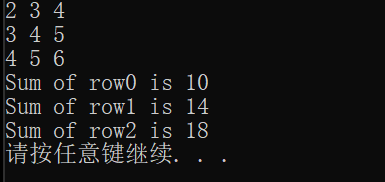

- 把数组作为参数时，一般不指定数组第一维的大小，即使制定，也会被忽略

### 6.1.4  对象数组

数组元素不仅可以是基本数据类型，也可以是自定义类型。对象数组的元素是对象，不仅是数据成员，而且还有函数成员。

```C++
//声明一个一维对象的语句形式
类名 数组名[常量表达式]
//访问对象数组的对象
数组名[下标表达式].成员名
```

对象数组的初始化过程，实际上是调用构造函数对每一个元素对象进行初始化的过程。如果在声明数组时给每一个数组元素指定初始值，在数组初始化过程中就会调用与形参类型相匹配的构造函数

## 6.2  指针

### 6.2.1  内存空间的访问方式

计算机的内存储器被划分为一个个内存单元，内存单元按一定的规则编号，编号就是存储单元的地址。

地址编码的基本单位是字节，每个字节由8个二进制组成。

如何利用内存单元存取数据？

- 通过变量名
- 通过地址

具有静态生存期的变量在程序开始运行之前就被分配了内存单元。具有动态生存期的变量，是在程序运行时遇到变量声明语句时被分配内存空间的。

在变量获得内存空间的同时，变量名也就成了相应内存空间的名称，在变量的整个生存期内都可以用这个名字访问该内存空间，表现在程序语句中就是通过变量名存取变量内容。

### 6.2.2  指针变量的声明

指针也是一种数据类型，具有指针类型的变量称之为指针变量。指针变量是用于存放内存单元地址。

```C++
数据类型 *标识符
//数据类型指的是指针所指向的对象
int * ptr;
//定义了一个指向int类型的指针变量，指针名称为ptr，专门用来存放int型数据的地址
```

### 6.2.3  与地址有关的运算 * 和 &

*称为指针运算符，也称解析，表示获取指针所指向的变量的值。

&称为取地址运算符，用来得到一个对象的地址。

### 6.2.4  指针的赋值

定义了一个指针，只是得到了一个用于存储地址的指针变量，但是变量中并没有确定的值，其中的地址值是一个不确定的数，不能确定这时候的指针变量中存放的是哪个内存单元的地址。

**定义指针必须先赋值，再引用**

指针的类型：

- 可以声明指向常量的指针，此时不能通过指针来改变所指对象的值，但指针本身可以改变，可以指向另外的对象。

  ```c++
  int a;
  const int * p1 = &a;	//p1是指向常量的指针
  int b;
  p1 = &b;		//正确，p1本身的值可以改变
  *p1 = 1；		//错误，不能通过p1来改变所指的对象
  ```

  使用指向常量的指针，可以确保指针所指向的常量可以不被意外更改。

- 可以声明指针类型的常量，这可确保指针不被改变

  ```c++
  int * const p2 = &a;
  p2 = &b;	//错误，p2是指针常量，不能更改
  ```

- 一般情况下，指针的值只能赋给相同类型的指针。有一种特殊的==void类型指针==，可以存储任何类型的对象地址。

### 6.2.5  指针运算

指针是一种数据类型。

```* (p1+n1)```表示p1当前所指位置后方第n1个数的内容，也可写作```p1[n1]```

0专用于表示空指针，也就是一个不指向任何有效地址的指针

赋给指针变量的值必须是地址常量或地址变量，不能是非0的整数

### 6.2.6  用指针处理数组元素

指针加减运算的特点使得指针特别适合于处理存储在一段连续内存空间中的同类数据(比如数组)

```c++
//三种方法输出数组10个元素
int main()
{   
    int a[10];
    for(int i=0;i<10;i++)
    a[i]=i;
    //数组名+下标
    for(int i=0;i<10;i++)
    cout<<a[i]<<" ";
    //使用数组名和指针
    for(int i=0;i<10;i++)
    cout<<* (a+i)<<" ";
    //使用指针变量
    for(int * p=a;p<(a+10);p++)
    cout<<*p<<" ";
    cout<<endl;
    system("Pause");
    return 0;
}
```

### 6.2.7  指针数组

一个数组的元素全部都是指针变量，称数组为指针数组。指针数组的每个元素必须都是同一类型的指针

```int * pa[3]```声明了一个int类型的执行数组pa，里面有3个元素，每个元素都是指向int类型数据的指针。

==指针数组的每个元素都是一个指针，必须先赋值再引用。==	

```c++
int main()
{    
    //利用指针数组输出单位矩阵
    //单位矩阵是主对角元素无1，其余元素都为0的矩阵
    int line1[3]={1,0,0};
    int line2[3]={0,1,0};
    int line3[3]={0,0,1};

    int *pLine[3]={line1,line2,line3};
    cout<<"Matrix test: "<<endl;
    for(int i=0;i<3;i++){
        for(int j=0;j<3;j++)
            cout<<pLine[i][j]<<" ";
        cout<<endl;
    }
    system("Pause");
    return 0;
}
```

### 6.2.8  用指针作为函数参数

以指针作为形参，在调用时实参将值传递给形参，也就是形参与实参指针变量指向同一内存地址，这样在子函数运行过程中，通过形参指针对数据值的改变页同样影响着实参指针所指向的数据值。

### 6.2.9  指针型函数

当一个函数返回值是指针类型时，这个函数就是指针型函数。使用指针类型函数的最主要目的是在函数结束时把大量的数据从被调函数返回到主调函数中。

```c++
数据类型 * 函数名(参数列表){
	函数体
}
```

### 6.2.10  指向函数的指针

每一个函数都有函数名，实际上这个函数名就表示函数的代码在内存中的起始地址。由此看来，调用函数的通常形式"函数名(参数表)"的实质就是"函数代码首地址(参数表)"。

函数指针就是专门用来存放函数代码首地址的变量。函数指针一旦指向了某个函数，它与函数名便具有同样的作用，函数名在表示函数代码起始地址的同时，也包括函数的返回值类型和参数个数、类型、排列次序等信息。

```C++
数据类型 (* 函数指针名)(形参表)
//数据类型表示函数指针所指函数的返回值类型
//第一个括号的内容指明一个函数指针的名称
//形参表列出该指针所指函数的形参类型和个数
```

通常使用typedef来定义函数指针

```c++
typedef int (* DoubleIntFunction)(double)
//声明了DoubleIntFunction为“有一个double形参、返回值类型为int的函数的指针”
DoubleIntFunction funcPtr;
```

函数指针在使用前也要进行赋值：```函数指针名=函数名```

```C++
void printStuff(float){
    cout<<"This is the print stuff function."<<endl;
}
void printMessage(float data){
    cout<<"The data to be listed is "<<data<<endl;
}
void printFloat(float data){
    cout<<"The data to be printed is "<<data<<endl;
}
const float PI=3.14159f;
const float TWO_PI=PI*2.0f;
int main()
{    
    void (* functionPointer)(float);    //函数指针
    printStuff(PI);     
    functionPointer=printStuff;         //函数指针指向printStuff
    functionPointer(PI);
    functionPointer=printMessage;
    functionPointer(TWO_PI);
    functionPointer(13.0);
    functionPointer=printFloat;
    functionPointer(PI);
    printFloat(PI);
    system("Pause");
    return 0;
}
```

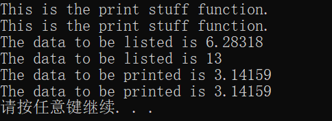

### 6.2.11  对象指针

#### a.  对象指针的一般概念

与基本类型的变量一样，每一个对象在初始化之后都会在内存占据一定的空间。既然可以通过对象名，也可以通过对象地址来访问一个对象。虽然，对象同时包含了数据和函数两种成员，但是==对象所占据的内存空间只是用于存放数据成员的，函数成员不在每一个对象中存储副本==。

对象指针就是用于存放对象地址的变量。

```c++
类名 * 对象指针名;
Point * pointPtr;
Point p1;
pointPtr = &p1;
使用对象指针一样可以方便地访问对象的成员：
对象指针名->成员名
```

```c++
class Point{
public:
    Point(int x,int y):x(x),y(y){}
    int getX() const {return x;}
    int getY() const {return y;}
private:
    int x,y;
};
int main()
{    
    Point a(4,5);
    Point * p1= &a;
    cout<<p1->getX()<<endl;
    cout<<a.getX()<<endl;
    system("Pause");
    return 0;
}
```

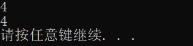

对象指针在使用之前，一定要先进性初始化，让它指向一个已经声明过的对象，然后再使用。

#### b.  this指针

this指针是一个隐含于每一个类的非静态成员函数中的特殊指针(包括构造函数和析构函数)，它用于指向正在被成员函数操作的对象。

this指针实际上是类成员函数的一个隐含参数。在调用类的成员函数时，目的对象的地址会自动作为该参数的值，传递给被调用的函数，这样被调用函数就能够通过this指针来访问目的对象的数据成员。

this是一个指针常量，对于常成员函数，this又是一个指向常量的指针。在成员函数中，可以使用*this来表示正在调用该函数的对象。

#### c.  指向类的非静态成员的指针

类的成员函数自身也是变量、函数或者对象等等，因此可以直接将它们的地址存放到一个指针变量中，这样就可以使指针直接指向对象的成员，进而可以通过指针访问对象的成员。指向对象成员的指针也要先声明再赋值，然后引用。因此首先要声明指向该对象所在类的成员的指针。

```c++
类型说明符 类名:: * 指针名;			  //声明指向数据成员的指针
类型说明符 (类名:: * 指针名)(参数表);	//声明指向函数成员的指针
```

对数据成员指针赋值的一般语法：

```c++
指针名 = &类名::数据成员名;
//对类成员取地址时也要遵守访问权限的约定，即：在一个类的作用域之外不能够对它的私有成员取地址
```

与普通变量不同，类的定义只确定了各个数据成员的类型、所占内存大小以及它们的相对位置，在定义时并不为数据成员分配具体的地址。因此经过赋值之后，只是说明了被赋值的指针是专门用于指向哪个数据成员的，同时在指针中存放该数据成员在类中的数据成员(即相对于起始地址的地址偏移量)，此时这样的指针并不能访问什么。

由于类是通过对象来进行实例化的，在声明类的对象时才会为具体的对象分配具体内存空间，这时只要将对象在内存中的起始地址与成员指针中存放的相对偏移结合起来就可以访问到对象的数据成员了。如何结合？

```c++
对象名.* 类成员指针名
    或
对象指针名->*类成员指针名
```

而成员函数指针的声明如下：

```c++
指针名 = & 类名::成员函数名
```

调用成员函数？

```C++
(对象名.* 类成员指针名)(参数表)
或
(对象指针名-> * 类成员指针名)(参数表)
```

```c++
class Point{
public:
    Point(int x,int y):x(x),y(y){
        count++;
    }
    Point(Point &p){
        x=p.x;
        y=p.y;
        count++;
    }
    ~Point(){count--;}
    int getX() const {return x;}
    int getY() const {return y;}
    static void showCount(){
        cout<<"Object count="<<count<<endl;
    }
private:
    int x,y;
    static int count;
};
int Point::count=0;         //静态数据成员定义和初始化，使用类名限定
int main()
{    
    Point a(4,5);
    Point *p1 = &a;
    int (Point::* funcPtr)() const=&Point::getX;
    //定义了一个成员函数指针并初始化
    cout<<(a.*funcPtr)()<<endl;
    cout<<(p1->*funcPtr)()<<endl;
    cout<<a.getX()<<endl;
    cout<<p1->getX()<<endl;
    system("Pause");
    return 0;
}
```

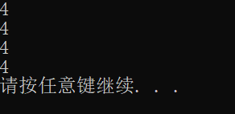

#### d.  指向类的静态成员的指针

对类的静态对象的访问是不依赖于对象的，因此可以用普通的指针来指向和访问静态成员

```c++
class Point{
public:
    Point(int x,int y):x(x),y(y){
        count++;
    }
    Point(const Point &p){
        x=p.x;
        y=p.y;
        count++;
    }
    ~Point(){count--;}
    int getX() const {return x;}
    int getY() const {return y;}
    static void showCount(){
        cout<<"Object count="<<count<<endl;
    }
    static int count;
private:
    int x,y;
};
int Point::count=0;         //静态数据成员定义和初始化，使用类名限定
int main()
{  
    //定义一个int型指针，指向类的静态数据成员
    int* ptr= &Point::count;
    Point a(4,5);
    cout<<"Point A: "<<a.getX()<<", "<<endl;
    cout<<"Object count="<<*ptr<<endl;

    Point b(a);
    cout<<"Point B: "<<b.getX()<<", "<<endl;
    cout<<"Object count="<<*ptr<<endl;
    system("Pause");
    return 0;
}
```

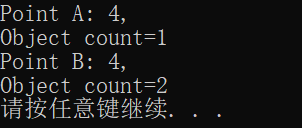

```c++
class Point{
public:
    Point(int x,int y):x(x),y(y){
        count++;
    }
    Point(const Point &p){
        x=p.x;
        y=p.y;
        count++;
    }
    ~Point(){count--;}
    int getX() const {return x;}
    int getY() const {return y;}
    static void showCount(){
        cout<<"Object count="<<count<<endl;
    }
    
private:
    int x,y;
    static int count;
};
int Point::count=0;         //静态数据成员定义和初始化，使用类名限定
int main()
{  
    void (* funcPtr)()=Point::showCount;
    Point a(4,5);
    cout<<"Point A: "<<a.getX()<<", "<<a.getY()<<endl;
    funcPtr();
    Point b(a);
    cout<<"Point B: "<<b.getX()<<", "<<b.getY()<<endl;
    funcPtr();
    system("Pause");
    return 0;
}
```

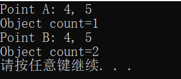

## 6.3  动态内存分配

在程序运行过程中申请和释放的存储单元称为堆对象

建立和删除堆对象使用两个运算符：==new和delete==

- 运算符new

  - 功能：动态分配内存，动态创建堆对象

    ```C++
    new 数据类型 (初始化参数列表)
    ```

  - 内存申请成功，new运算会返回一个指向新分配内存首地址的类型的指针，通过这个指针对堆对象进行访问，内存申请失败，会抛出异常

    ```c++
    int * point;
    point = new int(2);
    //动态分配了用于存放int类型数据的内存空间，并将初值2存入该空间，然后将首地址赋给指针point
    //对于基本数据类型，如果不希望在分配内存后设定初值，可以把括号省去
    int * point=new int;
    //如果保留空括号，就表示用0对该对象初始化。
    int * point=new int();
    ```
  
    - 如果新建的对象是一个类的实例对象，就需要根据初始化参数列表的参数类型和个数调用该类的构造函数。new一个新对象时，如果该类存在自己定义的默认构造函数，那么```new T```和```new T( )```这两种写法的效果是相同的，都会调用默认构造函数。如果该类没有定义默认构造函数，使用```new T```创建对象时，会调用系统生成的默认构造函数，使用```new T()```创建对象时，系统除了会执行默认构造函数会执行的那些操作之外，还会为基本数据类型和指针类型的成员用0赋值，这一过程是递归的。
    - 如果该对象的某个成员对象也没有用户定义的默认构造函数，那么对该成员对象的基本数据类型和指针类型的成员。同样会被以0赋初值
  
  - 运算符delete
  
    - 功能：删除由new建立的对象，释放指针所指向的内存空间
  
      ```C++
      delete 指针名;
      ```
  
    - 如果删除的是对象，该对象的析构函数将对调用。对于用new建立的对象，只能通过```delete```进行==一次==删除操作。

```c++
class Point{
public:
   Point():x(0),y(0){
       cout<<"Default Constructor called."<<endl;
   }
   Point(int x,int y):x(x),y(y){
       cout<<"Constructor called."<<endl;
   }
   ~Point(){
       cout<<"Destructor called."<<endl;
   }
   int getX() const {return x;}
   int getY() const {return y;}
   void move(int newX,int newY){
       x=newX;
       y=newY;
   }
private:
    int x,y;
};
int main()
{  
    cout<<"Step one: "<<endl;
    Point * ptr1 = new Point;    //动态创建对象，没有给出参数列表，因此调用默认构造函数
    delete ptr1;
    cout<<"Step two: "<<endl;
    ptr1=new Point(1,2);        //动态创建对象，并给出参数列表，因此调用有形参的构造函数
    delete ptr1;
    system("Pause");
    return 0;
}
```

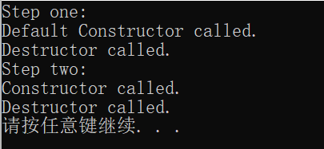

new运算符同样可以数组类型的对象：

```c++
new 类型名 [数组长度];
//[]后面可加( ),只是小括号内不能带任何参数
int * p = new int[10]();
//为动态创建的数组用0值初始化
delete[] 指针名;
```

```c++
class Point{
public:
   Point():x(0),y(0){
       cout<<"Default Constructor called."<<endl;
   }
   Point(int x,int y):x(x),y(y){
       cout<<"Constructor called."<<endl;
   }
   ~Point(){
       cout<<"Destructor called."<<endl;
   }
   int getX() const {return x;}
   int getY() const {return y;}
   void move(int newX,int newY){
       x=newX;
       y=newY;
   }
private:
    int x,y;
};
int main()
{  
    Point * ptr = new Point[2];
    ptr[0].move(5,10);
    ptr[1].move(15,20);
    cout<<"Deleting..."<<endl;
    delete[] ptr;
    system("Pause");
    return 0;
}
```

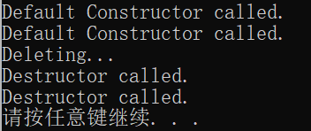

可以看出来，建立和删除数组的过程略显繁琐，更好的方法是将数组的建立和删除过程封装成一个类，形成动态数组类。

在动态数组类中，通过类的成员函数访问数组元素，可以在每次访问前检查一下下标是否越界，c++通过==assert==来进行。其头文件：cassert。用来判断一个条件表达式的值是否为true，如果不为true，程序终止且报出错误。assert只在debug模式下生效。

```c++
class Point{
public:
   Point():x(0),y(0){
       cout<<"Default Constructor called."<<endl;
   }
   Point(int x,int y):x(x),y(y){
       cout<<"Constructor called."<<endl;
   }
   ~Point(){
       cout<<"Destructor called."<<endl;
   }
   int getX() const {return x;}
   int getY() const {return y;}
   void move(int newX,int newY){
       x=newX;
       y=newY;
   }
private:
    int x,y;
};
//动态数组类
class Array0Points{
public:
    Array0Points(int size):size(size){
        points=new Point[size];
    }
    ~Array0Points(){
        cout<<"Deleting..."<<endl;
        delete[] points;
    }
    //获得下标为index的数组元素
    Point &element(int index){
        assert(index>=0 && index<size);
        return points[index];
    }
private:
    Point *points;
    int size;
};
int main()
{  
    int count;
    cout<<"Please enter the count of points: ";
    cin>>count;
    Array0Points points(count);
    points.element(0).move(5,0);
    points.element(1).move(15,20);
    system("Pause");
    return 0;
}
//main( )函数中对数组元素的访问形式略微繁琐，可以通过操作符重载，像普通数组一样通过[]来访问数组元素
```

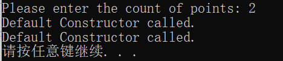

new运算符也可以创建多维数组

```c++
new 类型名T[数组第一维长度][数组第二维长度]...;
//数组第一维长度可以是任何结果为正整数的表达式，而其他各维数组长度必须是结果为正整数的常量表达式
//内存申请成功，new返回一个指向新分配内存的首地址的指针，但不是T类型指针，而是一个指向T类型数组的指针，数组是个数是除最左边一维外各维下标表达式的成绩
float * fp;
fp=new float[10][25][10];	//这会产生错误，因为这里操作产生的是指向25*10的二维float类型数组的指针，而fp是一个float类型数据的指针
//正确如下：
float (* fp)[25][10];
fp = new float[10][25][10];
```

```c++
using namespace std;
int main()
{  
    float (* cp)[9][8]=new float[8][9][8];
    for(int i=0;i<8;i++){
        for(int j=0;j<9;j++){
            for(int k=0;k<8;k++){
                *(*(*(cp+i)+j)+k)=static_cast<float>(i*100+j*10+k);
            }

        }
    }
    for(int i=0;i<8;i++){
        for(int j=0;j<9;j++){
            for(int k=0;k<8;k++){
                cout<<cp[i][j][k]<<" ";
                
            }
            cout<<endl;
        }
        cout<<endl;
    }
    delete[] cp;
    system("Pause");
    return 0;
}
```

## 6.4  用vector创建数组对象

```c++
vector<元素类型>数组对象名(数组长度);
int x=10;
vector<int>arr(x);
```

与普通数组不同的是，用```vector```定义的数组对象的所有元素都会被初始化。

如果数组的元素类型都是基本数据类型，则所有元素都被以0初始化。

如果数组元素为类类型，则会调用类的默认构造函数初始化。

初值也可以也可以自己制定，但只能为所有元素指定相同初值

```c++
vector<元素类型>数组对象名(数组长度,元素初值);
```

对vector数对象元素的访问，与普通数组具有相同的形式：

```c++
数组对象名[下标表达式]
```

vector数组对象的名字表示的就是一个数组对象，而非数组的首地址，因为数组对象不是数组，而是封装了数组的对象。

```c++
double average(const vector<double>&arr){
    double sum=0;
    for(unsigned i=0;i<arr.size();i++){
        sum+=arr[i];
    }
    return sum/arr.size();
}
int main(){
    unsigned n;
    cout<<"n= ";
    cin>>n;
    vector<double>arr(n);
    cout<<"Please input "<<n<<" real numbers:"<<endl;
    for(unsigned i=0;i<n;i++){
        cin>>arr[i];
    }
    cout<<"Average="<<average(arr)<<endl;
    system("Pause");
    return 0;
}
```

## 6.5   深复制和浅复制

# 第 7 章 继承与派生

## 7.1  类的继承与派生

### 7.1.1  继承关系举例

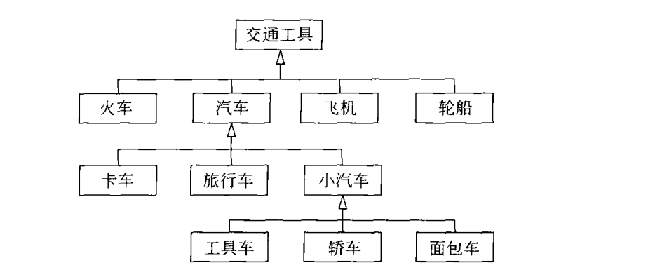

类的继承，是新的类从已有类那里得到已有的特性。

原有的类称==基类或父类==，新的类称为==派生类或子类==。

### 7.1.2  派生类的定义

假设Base1和Base2是以应对类，派生类Derived的派生类

```C++
class Derived:public Base1,private Base2{
public:
    Derived();
    ~Derived();
};
```

一个派生类，可以同时有多个基类，这种情况称之为多继承。

一个派生类只有一个直接基类的情况，称为单继承。

### 7.1.3  派生类生成过程

#### a.  吸收基类成员

派生类包含基类中除构造和析构函数之外的所有成员，派生过程中构造函数和析构函数都不被继承。

#### b.  改造基类成员

改造包含两方面：

- 基类成员的访问控制问题，这部分靠派生类定义时的继承方式来控制
- 对基类数据或函数成员的覆盖或隐藏。隐藏是在派生类中声明一个和基类数据或函数同名的成员。如果派生类声明了一个和某基类成员同名的新成员，派生类的新成员就隐藏了外层同名成员。**如果声明了一个同名的成员函数，则参数表也要相同，参数相同的情况属于重载。**在派生类中或者通过派生类的对象，直接使用成员名就只能访问到派生类中声明的同名函数，这称为==同名隐藏==。

#### c.  添加新的成员

## 7.2  访问控制

基类的自身成员可以对基类中任何一个其他成员进行访问，但对于类的对象，就只能访问该类的公有成员。

## 7.3  类型兼容原则

类型兼容规则是指在需要基类对象的任何地方，都可以使用公有派生类的对象来替代。包括以下情况：

- 派生类的对象可以隐含转换为基类对象
- 派生类的对象可以初始化基类的引用
- 派生类的指针可以隐含转换为基类指针

==替换之后，派生类对象就可以作为基类的对象使用，但只能使用从基类继承的成员。==

```c++
如果B类为基类，D为B类的公有派生类，则D类中包含了B类中除构造、析构函数之外的所有成员。在基类B的对象可以出现的任何地方，都可以用派生类D的对象来替代
class B{...}
class D:public B{...}
B b1,*pb1;
D d1;
/***********************************************************************/
这时：
    (1)派生类对象可以隐含转换为基类对象
    	b1 = d1;
	(2)派生类的对象也可以初始化基类对象的引用
        B &rb = d1;
	(3)派生类对象的地址也可以隐含转换为指向基类的指针
        pb1 = &d1;
```

对于基类及其公有派生类的对象，可以使用相同的函数统一进行处理。因为当函数的形参为基类的对象(引用、指针)时，实参可以是派生类的对象(或指针)，而没有必要为每一个类设计单独的模块

```c++
class Base1{
public:
    void display() const {
        cout<<"Base1::display()"<<endl;
    }
};
class Base2:public Base1{
public:
    void display() const {
        cout<<"Base2::display()"<<endl;
    }
};
class Derived:public Base2{
public:
    void display() const {
        cout<<"Derived::display()"<<endl;
    }
};
void fun(Base1 *ptr){
    ptr->display();
}
int main()
{  
    Base1 base1;
    Base2 base2;
    Derived derived;

    fun(&base1);
    fun(&base2);
    fun(&derived);
    system("Pause");
    return 0;
}
//基类Base1以公有方式派生出Base2类，Base2类作为基类以公有方式派生出Derived类
//基类Base1中定义了成员函数display(),派生类中对这个成员函数进行了隐藏
```

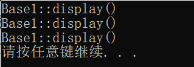

## 7.4  派生类的构造和析构函数

继承就是为了发展，派生类继承了基类的成员，实现了原有代码的重用，这只是一部分，而代码的扩充才是重要的。

### 7.4.1  构造函数

定义了派生类之后要想使用派生类就需要声明该类的对象，对象使用之前必须初始化。派生类的成员对象是由所有基类的成员对象和派生类新增的成员对象共同组成。因此构造派生类的对象时，就要对基类的成员对象和新增成员对象进行初始化。基类的构造函数和析构函数并没有继承下来，要完成这些初始化工作，必须给派生类添加新的构造函数 。

派生类对于基类的很多成员对象是不能直接访问的，因此要完成对基类成员对象的初始化工作，需要调用基类的构造函数。

派生类的构造函数需要以合适的初值作为参数，其中一些参数要传递给基类的构造函数，用于初始化相应的成员，另一些参数用于对派生类新增成员对象的初始化。

在构造派生类的对象时，会**首先调用基类的构造函数来初始化它们的数据成员**，然后按照构造函数初始化列表中指定的方式初始化派生类新增的成员对象，最后才执行派生类构造函数的函数体。

```c++
派生类名::派生类名(参数表):基类名1(基类1初始化参数表),...,基类名n(基类n初始化参数表)，成员对象名1(成员对象1初始化参数表),...,成员对象名m(成员对象m初始化参数表)
{
    派生类构造函数的其他初始化操作;
}

class Base1{
public:
    Base1(int i){
        cout<<"Constructing Base1 "<<i<<endl;
    }
};
class Base2{
public:
    Base2(int j){
        cout<<"Constructing Base2 "<<j<<endl;
    }
};
class Base3{
public:
    Base3(){
        cout<<"Constructing Base3 *"<<endl;
    }
};
class Derived:public Base2,public Base1,public Base3{
public:
    Derived(int a,int b,int c,int d):Base1(a),member2(d),member1(c),Base2(b){}
private:
    Base1 member1;
    Base2 member2;
    Base3 member3;
};
int main()
{  
    Derived obj(1,2,3,4);
    system("Pause");
    return 0;
}
如代码所示，基类及其内嵌对象成员都具有非默认形式的构造函数，所以派生类中需要显式声明一个构造函数，这个派生类构造函数的主要功能就是初始化基类及内嵌对象
Derived(int a,int b,int c,int d):Base1(a),member2(d),member1(c),Base2(b){}
构造函数的参数列表中给出了基类及内嵌对象所需的全部参数。在冒号之后，分别列出了各个基类及内嵌对象名和各自的参数。有两个问题值得注意：
    首先，并没有列出全部基类和成员对象，Base3类只有默认构造函数，不需要给它传递参数
    其次，基类名和成员对象名的顺序是随意的。
派生类构造函数的函数体为空，可见其只起到了传递参数、调用基类及内嵌对象构造函数的作用。
```

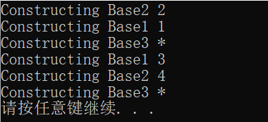

```c++
分析结果：
   	主函数中只声明了一个派生类Derived的对象obj，生成对象obj时调用了派生类的构造函数。现将构造函数调用情况进行探讨。
    首先先调用基类的构造函数，然后调用内嵌对象的构造函数。
    基类构造函数的调用顺序是按照派生类定义时的顺序2,1,3。
    内嵌对象的构造函数调用顺序应该按照成员在类中声明的顺序1，2，3
```

### 7.4.2  拷贝构造函数

对于一个类，如果程序员没有编写拷贝构造函数，那么编译系统会在必要时自动生成一个隐含的拷贝构造函数，它会自动调用基类的拷贝构造函数，然后对派生类新增的成员对象一一进行复制

```c++
//假设Derived类是Base类的派生类，Derived类的拷贝构造函数形式如下：
Derived::Derived(const Derived &v):Base(v){}
Base类的拷贝构造函数参数类型为什么是Derived类对象的引用，而不是Base类对象的引用？
    因为类型兼容规则起到了作用：可以用派生类的对象去初始化基类的引用。
    因此当函数的形参是基类的引用时，实参可以是派生类的对象。
```

### 7.4.3  析构函数

派生过程中，积累的析构函数不能被继承，派生类需要析构的话，就得在派生类中声明新的析构函数。

执行次序：

- 首先执行析构函数的函数体
- 然后对派生类新增的类类型的成员对象进行处理
- 最后对所有从基类继承来的成员进行处理

```c++
class Base1{
public:
    Base1(int i){
        cout<<"Constructing Base1 "<<i<<endl;
    }
    ~Base1(){
        cout<<"Destructing Base1 "<<endl;
    }
};
class Base2{
public:
    Base2(int j){
        cout<<"Constructing Base2 "<<j<<endl;
    }
    ~Base2(){
        cout<<"Destructing Base2 "<<endl; 
    }
};
class Base3{
public:
    Base3(){
        cout<<"Constructing Base3 *"<<endl;
    }
    ~Base3(){
        cout<<"Destructing Base3 "<<endl;
    }
};
class Derived:public Base2,public Base1,public Base3{
public:
    Derived(int a,int b,int c,int d):Base1(a),member2(d),member1(c),Base2(b){}
private:
    Base1 member1;
    Base2 member2;
    Base3 member3;
};
int main()
{  
    Derived obj(1,2,3,4);
    system("Pause");
    return 0;
}
```

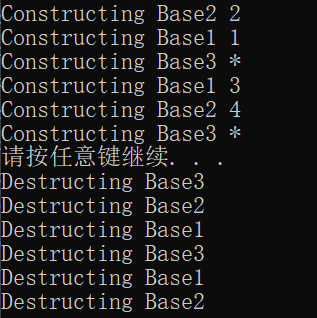

## 7.5  派生类成员的标识与访问

派生类中，成员按照访问属性划分为4种：

- 不可访问的成员：从基类私有成员继承下来的，派生类或是建立派生类对象的模块都无法访问到它们。
- 私有成员：包括从基类继承过来的成员以及新增的成员，在派生类的内部派生类内部可以访问，但是建立派生类对象的模块中无法访问。
- 保护成员：可能是新增也可能是从基类继承过来的，派生类内部可以访问，建立派生类对象的模块无法访问。
- 公有成员：派生类和建立派生类的模板都可以访问

### 7.5.1  作用域标识符

作用域标识符```::```，用来限定要访问的成员所在类的名称

```c++
类名::成员名;		//数据成员
类名::成员名(参数表)  //函数成员
```

作用域标识符是如何在类族层次结果中唯一识别成员的？

对于在不同作用域声明的标识符，可见性原则是：如果存在两个或多个具有包含关系的作用域，外层声明了标识符，而内层没有再次声明同名标识符，那么外层标识符在内层仍然可见；如果内层再次声明了同名标识符，那么外层标识符在内层不可见，这时称内层标识符隐藏了外层同名标识符，这种现象称之为==隐藏规则==。

在类的派生层次结构中，基类的成员和派生类新增的成员都具有类作用域。二者的作用范围不同，是相互包含的两个类，派生类在内层。这时如果派生类声明了一个和基类成员同名的新成员，派生类的新成员就隐藏了外层同名成员，直接使用成员名只能访问到派生类的成员。

==如果派生类声明了与基类成员函数同名的新函数，即使函数的参数表不同，从基类继承的同名函数的所有重载形式也都会被隐藏==。

对于多继承的情况，首先考虑各个基类之间没有任何继承关系，同时也没有共同基类的情况。最典型的情况就是所有基类都没有上级基类。==如果某派生类的多个基类拥有同名的成员，同时，派生类有新增这样的同名成员，在这种情况下，派生类将隐藏所有基类的同名成员。==这时使用```对象名.成员名```或```对象指针->成员名```方式可以唯一标识和访问派生类新增成员，基类的同名成员可以使用类似方法访问。

如果派生类没有声明同名成员，```对象名.成员名```或```对象指针->成员名```这种方法就无法唯一标识成员。

```c++
class Base1{
public:
    int var;
    void fun(){
        cout<<"Member of Base1"<<endl;
    }
};
class Base2{
public:
   int var;
   void fun(){
       cout<<"Member of Base2"<<endl;
   }
};
class Derived:public Base1,public Base2{
public:
    int var;
    void fun(){
        cout<<"Member of Derived"<<endl;
    }
};
int main()
{  
    Derived d;
    Derived * p = &d;
    d.var=1;
    d.fun();

    d.Base1::var=2;
    d.Base1::fun();

    p->Base2::var=3;
    p->Base2::fun();
    system("Pause");
    return 0;
}
主函数中创建了一个派生类的对象d，根据隐藏规则，如果通过成员名称来访问该类的成员，就只能访问到派生类新增的两个成员，基类继承过来的成员由于处于作用域外而被隐藏。
```

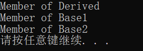

```c++
派生类改成如下形式：
class Derived:public Base1,public Base2{};
d.var=1;
d.fun();	//错误，对象名.成员名标识具有二义性
如果不希望类似情况产生二义性，可以使用using关键字加以澄清
class Derived:public Base1,public Base2{
public:
    using Base1::var;
    using Base1:fun();
}
using的一般功能就是将一个作用域的名字引入到另一个作用域中，另一个用法是：将using用于基类中的函数名，这样派生类中如果定义同名但参数不同的函数，基类的函数不会被隐藏。
class Derived:public Base1{
public:
    using Base1::fun;
    void fun(int i){}
};
这样使用Derived2的对象，既可以直接调用无参数的fun函数，又可以调用带int类型的fun函数
```

上面讨论的都是基于所有基类之间没有继承关系，如果不满这个条件呢？

如果派生类的部分或者全部直接基类都是从另一个共同的基类派生而来，在这些直接基类中，从上一级基类继承来的成员就拥有相同的名称，因此派生类中也就会产生的同名现象，对这种类型的同名成员也要使用作用域分辨符来唯一标识，而且必须使用直接基类来进行限定。

```c++
class Base0{
public:
    int var0;
    void fun0(){
        cout<<"Member of Base0"<<endl;
    }
};
class Base1:public Base0{
public:
    int var1;
};
class Base2:public Base0{
public:
    int var2;
};
class Derived:public Base1,public Base2{
public:
    int var;
    void fun(){
        cout<<"Member of Derived"<<endl;
    }
};
int main()
{  
    Derived d;
    d.Base1::var0=2;
    d.Base1::fun0();
    d.Base2::var0=3;
    d.Base2::fun0();
    system("Pause");
    return 0;
}
main()中，创建了一个派生类对象d，如果只通过成员名称来访问该类的成员var0，fun()，系统就无法唯一确定要引用的成员，这时必须要用作用域分辨符，通过直接基类名来确定要访问的从基类中继承来的成员。
这种情况下，派生类对象在内存中就同时拥有成员var0的两份同名副本，对于数据成员来说。虽然两个var0可以分别通过Base1和Base2调用Base0的构造函数进行初始化来存放不同的值，也可使用作用域分辨符来分别进行访问，但很多情况下我们只需要一个数据副本。
C++中使用虚基类来解决主要问题
```


上例代码中，Base0类的成员函数```fun0( )```的代码始终只有一个副本，之所以调用```fun0( )```函数仍使用Base1、Base2来加以限定，是因为调用非静态成员函数总是针对特定的对象，执行函数调用时需要将指向该类的一个对象的指针作为隐含的参数传递给被调用函数来初始化```this```指针。

### 7.5.2  虚基类

当某类的部分或者全部直接基类是从另一个共同基类派生而来，在这些直接基类中从上一级共同基类继承而来的成员就拥有相同的名称。派生类的对象中，这些同名数据成员在内存中同时拥有多个副本，同一个函数名会有多个映射。==既可以使用作用域分辨符来唯一标识并访问它们，又可以将共同基类设置为**虚基类**==，这时从不同的路径继承过来的同名数据成员在内存中就只有一个副本，同一个函数名也只有一个映射。

```c++
class 派生类名:virtual 继承方式 基类名
//上述语句声明基类为派生类的虚基类
多继承情况下，虚基类关键字的作用范围和继承方法关键字相同，只对紧跟其后的基类其作用。
声明了虚基类后，虚基类的成员在进一步派生过程中和派生类一起维护同一个内存数据副本。
```

```c++
基类Bas0，声明了数据成员var0和函数fun0()，有Base0公有派生出了Base1和Base2，声明Base0为虚基类。Derived类中，通过Base1和Base2两条派生路径继承来的基类Base0中的成员var0和fun0()只有一份副本
class Base0{
public:
    int var0;
    void fun0(){
        cout<<"Member of Base0"<<endl;
    }
};
class Base1:virtual public Base0{
public:
    int var1;
};
class Base2:virtual public Base0{
public:
    int var2;
};
class Derived:public Base1,public Base2{
public:
    int var;
    void fun(){
        cout<<"Member of Derived"<<endl;
    }
};
int main()
{  
    Derived d;
    d.var0=2;
    d.fun0();
    system("Pause");
    return 0;
}
```

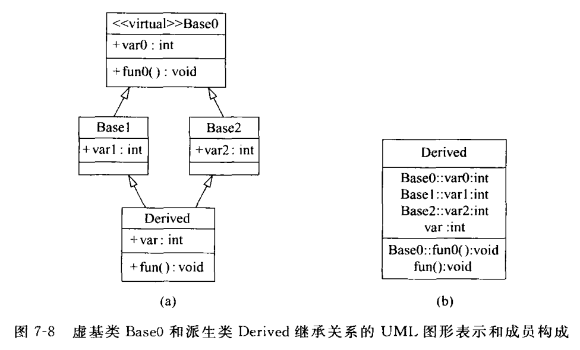


### 7.5.3  虚基类及其派生类构造函数

上例代码中虚基类的使用十分方便、简单。但这是由于该程序所有类使用的都是编译器自动生成的默认构造函数。如果虚基类声明有非默认形式(带形参)的构造函数，并且没有声明默认形式的构造函数，这就会很麻烦。

这时，在整个继承关系中，直接或间接继承虚基类的所有派生类，都必须在构造函数的初始化列表中列出虚基类的初始化。

```c++
class Base0{
public:
    Base0(int var):var0(var){}
    int var0;
    void fun0(){
        cout<<"Member of Base0"<<endl;
    }
};
class Base1:virtual public Base0{
public:
    Base1(int var):Base0(var){}
    int var1;
};
class Base2:virtual public Base0{
public:
    Base2(int var):Base0(var){}
    int var2;
};
class Derived:public Base1,public Base2{
public:
    Derived(int var):Base0(var),Base1(var),Base2(var){}
    int var;
    void fun(){
        cout<<"Member of Derived"<<endl;
    }
};
int main()
{  
    Derived d(1);
    d.var=2;
    d.fun();
    system("Pause");
    return 0;
}
程序建立Derived类的对象d时。通过Derived类的构造函数的初始化列表，不仅直接调用了虚基类构造函数Base0，对从Base0继承的成员var0进行初始化，而且还调用了直接基类Base1和Base2的构造函数Base1()和Base2()，而Base1()和Base2()的初始化列表中也都有对基类Base0的初始化。这样的话，对从虚基类继承来的成员var0岂不是初始化三次？结论肯定不是这样的。
    
c++是这样解决的。为了叙述方便，将建立对象时所指定的类称为最远派生类。Derived类就是最远派生类。建立对象时，如果这个对象中含有从虚基类继承来的成员，则虚基类的成员是由最远派生类的构造函数通过调用虚基类的构造函数进行初始化的，而且只有最远派生类的构造函数会调用虚基类的构造函数，该派生类的它 基类对虚基类构造函数的调用都自动被忽略。
```

构造一个类的对象的一般顺序是：

- 如果该类有直接或间接的虚基类，则先执行虚基类的构造函数
- 如果该类有其他基类，则按照它们在继承声明列表中出现的次序，分别执行它们的构造函数，但在构造过程中，不再执行它们的虚基类的构造函数
- 按照在类定义中出现的顺序，对派生类中新增加的成员进行初始化。对于类类型的成员对象，如果出现在构造函数初始化列表中，则以其中指定的参数执行构造函数，如未出现就执行默认构造函数
- 执行构造函数的函数体

## 7.6  深度探索

### 7.6.1  组合与继承

类的组合，即一个类内嵌其他类的对象，与继承"类似"，它们都是通过已有类来构造新类的两种基本方式，都使得已有对象成为新对象的一部分，从而达到代码复用的目的。如何在两者之间做出选择？

继承和组合反映了两种不同的对象关系。组合反映的是一种

### 7.6.2  派生类对象的内存布局

### 7.6.3  基类向派生类的转换及其安全性问题

# 第 8 章 多态性

C++的类类型分为两类——多态类型与非多态类型。多态类型就是指有虚函数的类类型，非多态类型是指所有的其他类型。

## 8.1  多态性概述

多态是指同样的消息被不同类型的对象接受时导致不同的行为。所谓消息是指对类的成员函数的调用，不同的行为是指不同的类实现，也就是调用了不同的函数。最简单的例子就是对“+”的使用，可以是不同数据类型之间进行运算。

### 8.1.1  多态的类型

重载多态、强制多态，包含多态和参数多态。前两种多态称之为**专用多态**，后两者称之为**通用多态**。

### 8.1.2  多态的实现

多态从实现的角度来看可以划分为两类：==编译时的多态==和==运行时的多态==。前者是在编译的过程中确定了同名操作的具体操作对象，后者是在程序运行过程中才动态地确定操作所针对的对象。这种确定操作的具体对象的过程就是==绑定(binding)==。**绑定是指计算机程序自身彼此关联的过程**，也就是把一个标识符和一个存储地址联系在一起的过程。用OOP的术语讲，就是**把一条消息和一个对象的方法相结合的过程**。按照绑定进行的阶段不同，可以分为两种不同的绑定方法：**静态绑定和动态绑定**。

<u>绑定工作在编译连接阶段完成的情况称之为静态绑定</u>。绑定过程是在程序开始执行之前进行的，在编译、连接过程中，系统就可以根据类型匹配等特征确定程序中操作调用与该操作代码的关系，即确定了某一个同名标识符到底要调用哪一段程序代码。

<u>绑定工作在程序运行阶段完成的情况称之为动态绑定。</u>

## 8.2  运算符重载

```c++
class Complex{
public:
    Complex(double r=0.0,double i=0.0):real(r),imag(r){}
    void display() const;
private:
    double real;
    double imag;
};
int main(){
    Complex a(10,20),b(5,8);
    system("Pause");
    return 0;
}
```

上述代码类```Complex```声明了两个对象```a```，```b```。如果要对a和b进行加法运算，我们很希望能够直接用```+```运算符直接实现，但这样的话编译时就会报错。这时就需要对运算符进行重载！

==运算符重载是对已有的运算符赋予多重含义，使同一个土石方作用于不同类型数据时导致不同的行为。==

运算符重载本质也就是函数重载。**实<u>现过程中首先把指定的运算符表达式转化为对运算符函数的调用，将运算对象转化为运算符函数的实参，然后根据实参的类型来确定需要调用的函数，</u>**这个过程是在编译过程中完成的。

### 8.2.1  运算符重载的规则

- C++中的运算符除了少数几个之外，全部可以重载，而且只能重载C++中已有的运算符
- 重载过后运算符的优先级和结合性都不会改变
- 运算符重载是针对新类型数据的实际需要，对原有操作符进行适当的改造。

类属关系运算符" ```.``` "、成员指针运算符" ```*``` "、作用域分辨符" ```::``` "、三目运算符"```?:```"不能重载。前两个运算符保证了C++中访问成员功能的含义不能改变。作用域分辨符的操作数是类型，而不是普通的表达式，不具备重载的特征。

运算符的重载形式有两种：==重载为类的非静态成员函数==和==重载为非成员函数==。

```c++
返回类型 operator 运算符 (形参表)
{
    函数体
}
返回类型指定了重载运算符的返回值类型，即运算结果类型
operator是定义运算符重载的关键字
形参表中给出重载运算符所需要的参数和类型
```

非成员函数形式重载运算符时，有时需要访问运算符参数所涉及的私有成员，这时可以把函数声明为类的友元函数。

当运算符重载为类的成员函数时，函数的参数个数比原来的操作个数要少一个

当重载为非成员函数时，参数个数与原操作个数相同

### 8.2.2  运算符重载为成员函数

运算符重载实质上就是函数重载，重载为成员函数，它可以自由地访问本类的数据成员。

实际使用时，总是通过该类的某个对象来访问重载的运算符。如果是双目运算符，左操作数是对象本身的数据，由this指针指出，右操作数则需要通过运算符重载函数的参数表来传递；如果是单目运算符，操作数由this指针给出，就不再需要任何参数。

- 双目运算符B
  - 如果要重载为类的成员函数，使之能够实现表达式 ```oprd1 B oprd2```，其中```oprd1```为A类的对象，则应该把B重载为A类的成员函数，该函数只有一个形参，形参的类型时```oprd2```所属的类型。经过重载后，表达式```oprd1 B oprd2```就相当于```oprd1.operator B(oprd2)```。
- 前置单目运算符U
  - 如" - "号如果要重载为类的成员函数，用来实现```U oprd```，其中oprd为A类的对象，则U应当重载A类的成员函数，函数没有形参。经过重载之后，```U oprd```相当于```oprd.operator U()```
- 后置运算符" ++  -- "
  - 运算符应该重载为A类的成员函数，这时函数要带有一个整型形参

```c++
class Complex{
public:
    Complex(double r=0.0,double i=0.0):real(r),imag(i){}
    Complex operator+ (const Complex &c2) const;
    Complex operator- (const Complex &c2) const;
    void display() const;
private:
    double real;
    double imag;
};
Complex Complex::operator+(const Complex &c2) const{
    return Complex(real+c2.real, imag+c2.imag);
}
Complex Complex::operator-(const Complex &c2) const{
    return Complex(real-c2.real,imag-c2.imag);
}
void Complex::display() const{
    cout<<"("<<real<<","<<imag<<")"<<endl;
}
int main(){
    Complex c1(5,4),c2(2,10),c3;
    cout<<"c1=";
    c1.display();
    cout<<"c2=";
    c2.display();
    c3=c1-c2;
    cout<<"c3=c1-c2=";
    c3.display();
    c3=c1+c2;
    cout<<"c3=c1+c2=";
    c3.display();
    system("Pause");
    return 0;
}
```

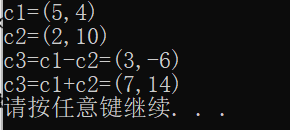

```c++
class Clock{
public:
    Clock(int hour=0,int minute=0,int second=0);
    void showTime() const;
    Clock& operator++ ();
    Clock operator++ (int);
private:
    int hour,minute,second;
};
Clock::Clock(int hour,int minute,int second){
    if(0<=hour && hour<24 && 0<=minute && minute<60 && 0<=second && second<60){
        this->hour=hour;
        this->minute=minute;
        this->second=second;
    }
    else
    cout<<"Time error!"<<endl;
}
void Clock::showTime() const {
    cout<<hour<<":"<<minute<<":"<<second<<endl;
}
Clock & Clock::operator++ (){
    //前置弹幕运算符重载函数
    second++;
    if(second>=60){
        second-=60;
        minute++;
        if(minute>=60){
            minute-=60;
            hour=(hour+1)%24;
        }
    }
    return * this;
}
Clock Clock::operator++ (int){
    Clock old=*this;
    ++(*this);
    return old;
}
int main(){
    Clock myClock(23,59,59);
    cout<<"First time output: ";
    myClock.showTime();
    cout<<"Show myClock++:    ";
    (myClock++).showTime();
    cout<<"Show++ myClock:    ";
    (++myClock).showTime();
    system("Pause");
    return 0;
}
```

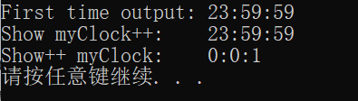

### 8.2.3  运算符重载为非成员函数

运算所需要的操作数都需要通过函数的形参表来传递，在形参表中形参中从左到右的顺序就是运算符操作数的顺序。如果需要访问运算符参数对象的私有成员，可以将函数声明为类的友元函数

## 8.3  虚函数

虚函数是动态绑定的基础。虚函数必须是非静态的成员函数。虚函数经过派生之后，在类族中就可以实现运行过程中的多态。

### 8.3.1  一般虚函数成员

```c++
虚函数声明语法
virtual 函数类型 函数名(形参表);
```

虚函数**==只能出现在类定义中的函数原型声明中==**，不能出现在成员函数实现的时候。

运行中的多态需要满足三个条件：

- 类之间满足赋值兼容原则
- 要声明虚函数
- 要由成员函数来调用或者是通过指针、引用来访问虚函数。

```C++
class Base1{
public:
    virtual void display() const;   //虚函数
};
void Base1::display() const {
    cout<<"Base1::display()"<<endl;
}
class Base2:public Base1{
public:
    void display() const;
};
void Base2::display() const{
    cout<<"Base2::display()"<<endl;
}
class Derived:public Base2{
public:
    void display() const;
};
void Derived::display() const{
    cout<<"Derived::display()"<<endl;
}

void fun(Base1 * ptr){
    ptr->display();
}

int main(){
    Base1 base1;
    Base2 base2;
    Derived derived;
    fun(&base1);
    fun(&base2);
    fun(&derived);  
    system("Pause");
    return 0;
}
```

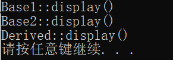


上述代码中类```Base1```，```Base2```和```Derived```属于同一个类族，而且是通过公有派生而来，因此满足赋值兼容原则。基类函数成员```display()```声明为虚函数，程序中使用对象指针来访问成员函数，这样绑定过程中就是在运行时完成的，实现了运行中的多态。

派生类中的函数成员通过以下情况来判断是否是虚函数

- 该函数是否与基类的虚函数有相同的名称
- 该函数是否与基类的虚函数有相同的参数个数以及相同的对应参数类型、相同的返回值或者满足赋值兼容规则的指针、引用型的返回值

用指向派生类对象的指针仍然可以调用基类中被派生类覆盖的成员函数，通过" ```::``` "来实现。上述代码中将```fun()```改为：

```c++
void fun(Base1 * ptr){
    ptr->Base1::display();
}
```

那么输出都是```Base1::display()```。


当基类构造函数调用虚函数时，不会调用派生类的虚函数。

```c++
基类Base、派生类Derived，都有虚函数virt()
在执行派生类Derived的构造函数时，会首先调用Base类的构造函数。如果Base::Base()调用了virt(),那也是调用了Base::virt(),这是因为，当基类被构造时，对象还不是一个派生类的对象
```

只有虚函数是动态绑定的，如果派生类需要修改基类的行为，就应该在基类中将相应的函数声明为虚函数。

一般不要重写继承而来的非虚函数，因为这会导致通过基类指针和派生类的指针或对象调用同名函数时，会发生不同的结果。

Caution：重写继承来的虚函数时，如果函数有默认形参，不要重新定义不同的值。因为虚函数是动态绑定的，但默认形参值是静态绑定的。通过一个指向派生类对象的基类指针，可以访问到派生类的虚函数，但默认形参值只能来自基类的定义。


基类的指针可以指向派生类的对象，基类的引用也可以作为派生类对象的别名，但基类的对象不能表示派生类的对象！

```c++
Derived d;	//派生类的对象
Base *ptr=&d;
Base &ref=d;
Base b=d;	//调用Base的拷贝构造函数用d构造b，b的类型是Base而不是Derived
用Derived类型的对象d为Base类的对象b初始化，初始化时使用的是Base的拷贝构造函数。由于拷贝构造函数接收的是Base类型的常引用，Derived类的d符合类型兼容规则，可以作为参数传给它，但是执行的的Base的拷贝构造函数，只有Base类的成员才会被复制。所以生成的对象是基类Base的对象。
    这种用派生类对象拷贝构造基类对象的行为称作对象切片。这时yongb调用Base类的虚函数，调用的目的对象是对象切片后得到的Base对象，与Derived对象全无关系。
```

### 8.3.2  虚析构函数

==**c++不能声明虚构造函数！！！**==，但是可以声明虚析构函数。

```c++
virtual ~类名 ();
```

如果一个类的析构函数是虚函数，那么由它派生出来的所有子类的析构函数也是虚函数。析构函数设置为虚函数后，使用指针引用时可以动态绑定，实现运行时的多态，保证使用基类类型的指针能够适调用当的析构函数针对不同的对象进行清理工作。

```C++
class Base{
public:
    virtual ~Base();
};
Base::~Base(){
    cout<<"Base desturctor"<<endl;
}
class Derived:public Base{
public:
    Derived();
    ~Derived();
private:
    int *p;
};
Derived::Derived(){
    p=new int(0);
}
Derived::~Derived(){
    cout<<"Derived desturctor"<<endl;
    delete p;
}
void fun(Base *b){
    delete b;
}
int main(){
    Base *b=new Derived();
    fun(b);
    system("Pause");
    return 0;
}
```

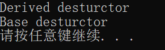

如果基类的析构函数没有声明为虚函数，那么输出为：```Base desturctor```

这是因为基类指针删除派生类对象时调用的是基类的析构函数，派生类的析构函数没有被执行，因此派生类对象中动态分配的内存空间没有被释放，造成了内存泄漏。也就是说派生类成员p所指向的内存空间，在对象消失后既得不到继续使用也没有被释放。

### 8.3.3  虚函数动态绑定的实现原理

通过指针、引用来调用一个虚函数，实际被调用的函数到运行时才能确定。

动态绑定的关键是，在运行时决定被调用的函数，很容易想到函数指针。一个函数指针可以被赋予不同函数的入口地址，如果通过函数指针去调用函数，实际被调用的函数一般到了运行时才能确定，因此通过函数指针去调用函数，也是一种动态绑定，是一种由源程序进行显式控制的动态绑定。


在各个类的构造函数中，为每个函数指针初始化，使得基类对象中的函数指针指向基类定义的函数，派生类对象的函数指针指向派生类覆盖后的函数。在通过指针或引用进行函数调用时，先读取相应的函数指针，再通过函数指针调用相应的函数。

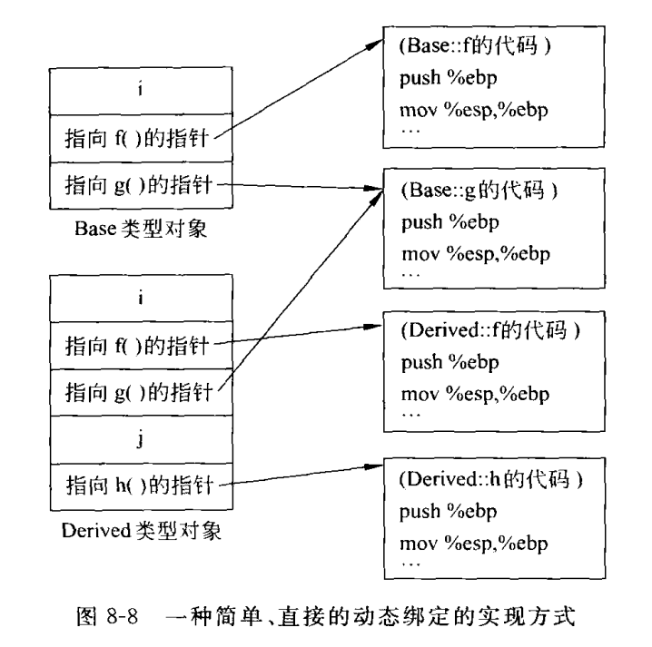

```Derived```类覆盖了Base类的f函数。因此Base对象和Derived对象中为f函数设置的指针，指向不同的函数代码；```Derived```类未覆盖的Base类的g函数，所以两个类的对象中为g函数设置的指针，指向相同的函数代码。

这种方式存在的致命问题就是——==占用的额外空间太大==！每个Base对象要占用两个指针的额外空间，每个Derived对象要占用3个指针的额外空间。这种方法难以广泛采用。

正如上图所示每个Derived类型的对象所保存3个指针都是一样的。因此，这些指针都可以只保存一份，它们构成一个表，称为==虚函数表==，每个对象中不在保存一个个函数指针，而是只保存一个指向这个虚函数表首地址的指针——==虚表指针(vptr)==。

这样的话，每个多态类型的对象只需要占用一个指针的额外空间！！！虽然虚表本身还要占用空间，但是每个多态只有一个虚表，这一部分空间不会因为新对象的创建而增加。布局如下：

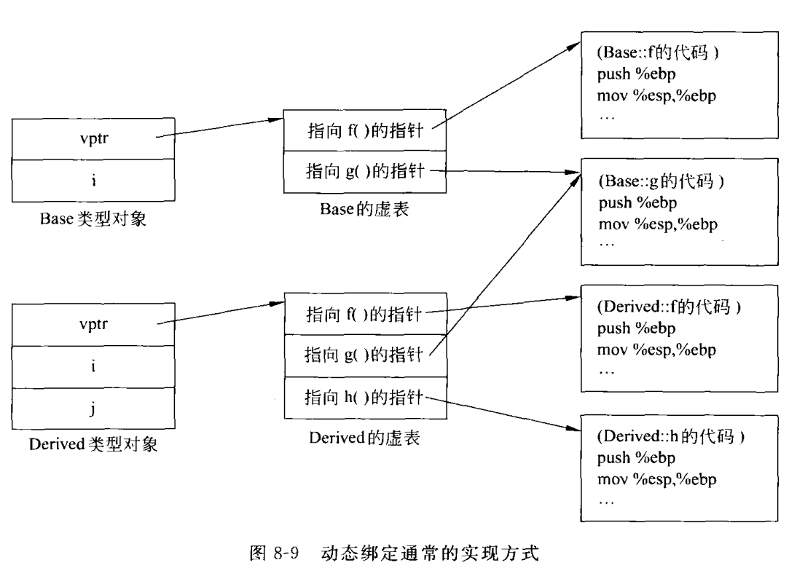


每个类都有一个虚函数表，虚表的内容是由编译器。派生类的虚表中，基类声明的虚函数对应的指针放在前面，派生类新增的虚函数的对应指针放在后面，这样一个虚函数的指针在基类虚表和派生类虚表中具有相同的位置。

每个多态类型的对象中都有一个指向当前类型的虚表的指针，该指针在构造函数中赋值。当通过基类的指针或引用调用一个虚函数时，就可以通过虚表指针找到该对象的虚表，进而找到存放该虚函数的指针的虚表条目。将该条目存放的指针读出后，就可以获得应当被调用的函数的入口地址，然后调用该虚函数，==虚函数的动态绑定==就是这样完成的。

基类构造函数调用虚函数时不会调用派生类的虚函数的原因：

- 执行一个类的构造函数时，首先被执行的是基类的构造函数，因此构造一个派生类的对象时，该对象的虚表指针首先会被指向基类的虚表。只有当基类构造函数执行完后，虚表指针才会被指向派生类的虚表。

## 8.4  纯虚函数与抽象类

### 8.4.1  纯虚函数

纯虚函数是一个在基类中声明的虚函数，它在该基类中没有定义具体的操作内容，要求各派生类根据实际需要给出各自的定义。

```c++
virtual 函数类型 函数名(参数表)=0;
```

声明为纯虚函数之后，基类中就可以不再给出函数的实现部分。纯虚函数的函数体由派生类给出。

基类中仍然可以允许对纯虚函数成员给出实现，但即使给出，也必须由派生类覆盖，否则无法实例化。在基类中对纯虚函数定义的函数体的调用，必须通过"```基类名::函数名(参数表)```"的形式。如果将析构函数声明为纯虚函数，必须给出它的实现。因为派生类的析构函数体执行完后需要调用基类的纯虚函数。


编译器实现虚函数的动态绑定细节没有在C++中规定，因此会因编译器而异。

```C++
class Base{
public:
    virtual void f();
    virtual void g();
private:
    int i;
};
class Derived:public Base{
public:
    virtual void f();
    virtual void g();
private:
    int j;
};
```

一种直接处理的方式是，在每个对象中，除了存储数据成员以外，还为每个虚函数设置一个函数指针，分别存放这些虚函数对应的代码的入口地址。由于派生类也要继承这些虚函数的接口因此也保留这些指针，并且把派生类引入的新的数据成员好函数指针置于从基类继承下来的数据成员和函数指针之后

### 8.4.2  抽象类

带有纯虚函数的类是抽象类。作用是通过抽象类建立一个公共的接口，是它们能够更有效地发挥多态特性。抽象类声明了一个类族派生类的共同接口，而接口的完整实现，即纯虚函数的函数体，要有派生类自己定义。

抽象类派生出新的类之后，如果派生类给出所有纯虚函数的函数实现，这个派生类就可以定义自己的对象，因而不再是抽象类。

抽象类不能实例化，不能定义一个抽象类的对象，但可以定义一个抽象类的指针和引用。

```c++
class Base1{
public:
    virtual void display() const = 0;
};
class Base2:public Base1{
public:
    void display() const;
};
void Base2::display() const{
    cout<<"Base2::display()"<<endl;
}
class Derived:public Base2{
public:
    void display() const;
};
void Derived::display() const{
    cout<<"Derived::display()"<<endl;
}
void fun(Base1 *ptr){
    ptr->display();
}
int main(){
    Base2 base2;
    Derived derived;
    fun(&base2);
    fun(&derived);
    system("Pause");
    return 0;
}
代码中。Base1和Base2和Derived属于同一个类族，抽象类Base1通过纯虚函数为整个类族提供了通用的外部接口语义。
```

# 第 9 章  群体类和群体数据的组织

## 9.1  函数模板与类模板

C++为了实现代码重用，代码必须具有通用性。通用代码应不受数据类型的影响，并且可以自动适应数据类型的变化，这种程序设计类型称之为参数化程序设计，C++用模板来实现，通过模板来实现参数化多态性。==参数化多态性就是将程序所处理的对象的类型参数化，使得一段程序可以用于处理多种不同类型的对象。==

### 9.1.1  函数模板

```c++
int abs(int x){
    return x<0?-x:x;
}

double abs(double x){
    return x<0?-x:x;
}
```

这两个函数的功能都是一样的，只有与参数类型不同。通过编写函数模板，然后基于调用函数时提供的参数类型，C++编译器将自动产生对应的函数来正确地处理该类型的数据。

```c++
template<模板参数表>
类型名 函数名(参数表){
    函数体的定义
}
```

模板参数表由用逗号分割的模板参数构成，可以包括以下内容：

- ```class```或```typename```标识符，指明可以接受一个类型参数
- “类型说明符”标识符，指明可以接受一个由“类型说明符”所规定类型的常量作为参数。
- ```template<参数表>class```标识符，指明可以接受一个类模板名作为参数

```c++
#include<iostream>
using namespace std;
template<typename T>
T abs(T X){
    return x>0?-x:x;
}
int main(){
    int n=-5;
    double d=-5.5;
    cout<<abs(n)<<endl;
    cout<<abs(d)<<endl;
	system("Pause");
	return 0
}
```

上述函数调用abs()时，编译器从实参的类型推导出函数模板的类类型参数。

当类型参数的含义确定后，编译器将以函数模板为样板，生成一个函数，这一过程称为函数模板的实例化，该函数称为函数模板abs的一个实例。

```c++
template<class T>
void outputArray(const T * array,int count){
    for(int i=0;i<count;i++){
        cout<<array[i]<<" ";
    }
    cout<<endl;
}
int main(){
    const int A_COUNT=8,B_COUNT=8,C_COUNT=20;
    int a[A_COUNT]={1,2,3,4,5,6,7,8};
    double b[B_COUNT]={1.1,2.2,3.3,4.4,5.5,6.6,7.7,8.8};
    char c[C_COUNT]="Welcome to see you!";
    cout<<"a array contains:"<<endl;
    outputArray(a,A_COUNT);
    cout<<"b array contains:"<<endl;
    outputArray(b,B_COUNT);
    cout<<"c array contains:"<<endl;
    outputArray(c,C_COUNT);
	system("Pause");
	return 0;
}
```

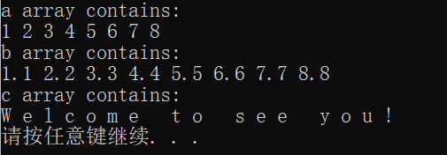

函数模板的形式与函数类似，但二者有本质区别：

- 函数模板在编译时不会发生任何目标代码，只有由模板生成的实例会生成目标代码
- 被多个源文件引用的函数模板，应当联通函数体一同放在头文件，而不能像普通函数那样只将声明放在头文件中。
- 函数指针也只能指向模板的实例，而不能指向模板本身。

### 9.1.2  类模板

使用类模板是用户可以为类定义一种模式，使得类中的某些数据成员、某些成员函数的参数、返回值或局部变量能取任意类型

```c++
template<模板参数表>
class 类名{
    类成员声明
}
```

一个类模板声明自身并不是一个类，他说明了类的一个家族。只有被其他代码引用时，模板才根据引用的需要生成具体的类。

使用一个模板类来建立对象时：

```c++
模板名<模板参数表>对象名1，...，对象名n;
```

```c++
struct Student{
    int id;         //学号
    float gpa;      //平均分
};
template<class T>
class Store{
private:
    T item;
    bool haveValue;
public:
    Store();
    T &getElem();
    void putElem(const T &x);
};
//以下实现各成员函数
template<class T>
Store<T>::Store():haveValue(false){}

template<class T>
T &Store<T>::getElem(){
    if(!haveValue){
        cout<<"No item present!"<<endl;
        exit(1);
    }
    return item;
}
template<class T>
void Store<T>::putElem(const T &x){
    haveValue=true;
    item=x;
}

int main(){
    Store<int>s1,s2;//定义两个Store<int>类对象，数据成员item为int类型
    s1.putElem(3);  //向对向s1中存入数据，初始化对象s1
    s2.putElem(-7);
    cout<<s1.getElem()<<" "<<s2.getElem()<<endl;    
	Student g={1000,23};
    Store<Student>s3;
    s3.putElem(g);
    cout<<"Student id is "<<s3.getElem().id<<endl;
    Store<double>d;
    cout<<"Retrieving object d...";
    cout<<d.getElem()<<endl;
    system("Pause");
    getchar();
	return 0;
}
```

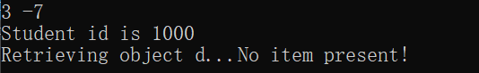

## 9.2  线性群体

### 9.2.1  线性群体的概念

线性群体中的元素次序与其位置关系是对应的。在线性群体中，又可根据访问元素的不同方法分为<u>直接访问，顺序方法、索引访问</u>。

对可直接访问的线性群体，可以直接访问群体中的任何一个元素，而不必访问之前的元素。

对于顺序访问的线性群体，只能按元素的排列顺序从头开始依次访问各个元素。

### 9.2.2  直接访问群体——数组类

动态数组类模板Array，由任意多个位置连续的、类型相同的元素组成，其元素个数可在运行时发生改变。

# 第 10 章 泛型编程设计与C++标准模板库

## 10.1  泛型程序设计及STL的结构

### 10.1.1  泛型程序设计的基本概念

泛型程序设计的主要思想是将算法从特定的数据结构中抽象出来，使算法成为通用的、可以作用于各种不同的数据结构。这样就不必为每种容器都编写一套同样的算法。

### 10.1.2  STL简介

- 容器
  - 容器是容纳、包含一组元素的对象。容器类库中包括7种基本容器：==向量(vector)==、==双端队列(deque)==、==列表(list)==、==集合(set)==、==多重集合(multiset)==、==映射(map)==、==多重映射(multimap)==。
  - 七种容器可以分为两种基本类型：顺序容器(sequence container)和关联容器(associative container)
    - 顺序容器：将一组具有相同类型的元素以严格的线性形式组织起来，向量、双端序列和列表容器就属于这一种。
    - 关联容器：具有根据一组索引来快速提取元素的能力，集合和映射容器就属于这一种。
- 迭代器
  - 提供了顺序访问容器中每个元素的方法。对迭代器可以使用```++```运算符来获得指向下一个元素的迭代器，可以使用```*```运算符访问一个迭代器所指向的元素。如果元素类型是类或结构体，还可以使用```->```运算符直接访问该元素的一个成员，有些迭代器还支持```--```运算符获得指向上一个元素的迭代器。
  - 指针也具有同样的特性，因此指针本身就是一种迭代器，迭代器是泛化的指针
  - 例如```s.begin()```，指向的是向量容器```s```的第一个元素
- 函数对象
  - 行为类似函数的对象，对它可以像调用函数一样调用。任何普通的函数和任何重载了```()```运算符的类的对象都可以作为函数对象使用，函数对象是泛化的函数。
- 算法


