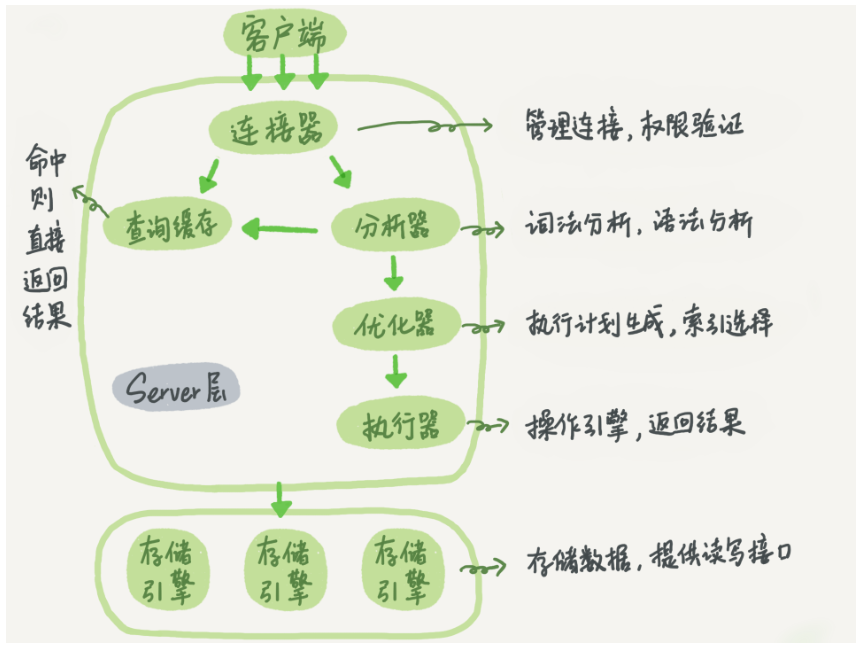
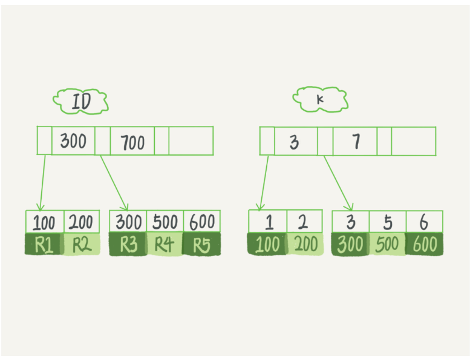

# Database Systems Interview

## Mysql

nosql数据库和关系型数据库的区别？

mysql与sql server有什么区别？

UNION ALL和UNION的区别

### &#10004;有哪些JOIN语句，有哪些删除语句

- JOIN

  - INNER JOIN（内连接）：返回两个表中满足指定条件的匹配记录。只有当两个表的记录在连接条件下相匹配时，才会出现在结果集中。
  - LEFT JOIN（左连接）：返回左表的所有记录，以及右表中满足指定条件的匹配记录。如果右表中没有匹配的记录，左表的对应记录会与NULL值组合。
  - RIGHT JOIN（右连接）：返回右表的所有记录，以及左表中满足指定条件的匹配记录。如果左表中没有匹配的记录，右表的对应记录会与NULL值组合。
  - FULL JOIN（全连接）：返回两个表中满足指定条件的匹配记录，以及左表和右表中没有匹配的记录。对于没有匹配的记录，左表或右表的记录会与NULL值组合。需要注意的是，MySQL不直接支持FULL JOIN，但可以通过LEFT JOIN和RIGHT JOIN的组合来实现。

- Delete

  - DELETE：用于删除表中的记录。可以指定删除条件，仅删除满足条件的记录。例如：

  - ```sql
    DELETE FROM employees WHERE department_id = 5;
    ```

  - TRUNCATE：用于删除表中的所有记录。相较于使用DELETE删除所有记录，TRUNCATE操作更快且释放空间给操作系统。需要注意的是，TRUNCATE操作通常不可逆。例如：

  - ```sql
    TRUNCATE TABLE employees;
    ```

### &#10004;MySQL架构，为什么这么设计

- 
- MySQL的架构设计注重易用性、通用性、高性能、可扩展性、灵活性、可定制性、数据可靠性和持久性。这些特点使得MySQL能够适应不同的应用场景，满足广泛的数据存储和管理需求。

InnoDB引擎和MyISAM引擎的区别

Innodb的隔离级别

### &#10004;MySQL是长连接还是短连接，什么时候使用短连接

- 数据库里面，长连接是指连接成功后，如果客户端持续有请求，则一直使用同一个连接，这样可以减少频繁建立和断开连接带来的额外开销。短连接则是指每次执行完很少的几次查询就断开连接，下次查询再重新建立一个，这样可以避免服务器维持过多无效连接。
- 在以下情况下，可以考虑使用短连接：
  1. 数据库访问请求不频繁，连接时间间隔较长，如每小时、每天等周期性访问。
  2. 系统并发量较低，长连接可能导致资源浪费。
  3. 系统对性能要求不高，可以接受频繁建立和断开连接带来的开销。
  4. 系统设计考虑到不同数据库实例间的故障转移或负载均衡，需要保持灵活的连接方式。

innodb为什么使用B+树

数据库需要查找5000-10000的索引，建库时应该用b+树还是哈希

讲一下三大范式， 如果不满足第三大范式会出现什么情况

左连接和右链接的区别

创建一个用户并设定权限用哪个sql语句

讲一下MySQL都有哪些锁呢？锁的粒度划分(表锁，行锁，间隙锁，邻间锁)

mysql什么时候加行锁，什么时候加表锁？判断依据是什么？

什么是意向锁？意向锁的作用是什么？
意向锁和哪些锁有互斥关系？
什么是间隙锁？意向锁和间隙锁会互斥吗？

访问B+树如何加锁？（从根结点一直加锁）粒度为整个索引，如何优化(蟹性协议，非必要立刻释放锁，lock转换为latch)

MySQL，一张千万级 数据 的表如何快速查询 数据 ？

* [x] 常用的数据库连接查询方式

- 内连接
- 外连接
  - 左连接
  - 右连接
  - 自连接

&#10004;聚合查询的关键字

- COUNT：计算某列（或表达式）中非NULL值的数量。可以用于计算总行数或满足特定条件的行数。

  例如：SELECT COUNT(*) FROM employees; （查询employees表中的总行数）

- SUM：计算某列（或表达式）中所有非NULL值的总和。通常用于计算某列的总值。

  例如：SELECT SUM(salary) FROM employees; （计算employees表中所有员工的薪资总和）

- AVG：计算某列（或表达式）中所有非NULL值的平均值。通常用于计算某列的平均值。

  例如：SELECT AVG(salary) FROM employees; （计算employees表中所有员工的平均薪资）

- MIN：返回某列（或表达式）中的最小值。常用于查询某列的最小值。

  例如：SELECT MIN(salary) FROM employees; （查询employees表中的最低薪资）

- MAX：返回某列（或表达式）中的最大值。常用于查询某列的最大值。

  例如：SELECT MAX(salary) FROM employees; （查询employees表中的最高薪资）

&#10004;Mysql B+树找数据的具体过程，到某一个叶子结点之后怎么找？

- 从根节点开始：首先，将查找过程定位到B+树的根节点。根节点包含一些关键字和指向子节点的指针。
- 搜索内部节点：从根节点开始，沿着B+树向下搜索。在每个内部节点中，查找关键字所在的范围。如果查找关键字小于当前节点的第一个关键字，选择第一个指针；如果查找关键字大于当前节点的最后一个关键字，选择最后一个指针；否则，在关键字之间找到查找关键字所属的范围，并选择相应的指针。然后，沿着所选指针进入下一层节点。重复此过程，直到到达叶子节点。
- 定位叶子节点：当到达叶子节点时，逐个比较关键字，找到与查找关键字相匹配的关键字。由于叶子节点中的关键字是有序存储的，你可以使用二分查找法在叶子节点中更快地定位目标关键字。
- 返回数据记录：在找到与查找关键字匹配的叶子节点后，通过该关键字对应的指针（或者数据记录在叶子节点中的实际存储位置），可以获取到相应的数据记录。在聚簇索引中，叶子节点直接存储数据记录；在辅助索引中，叶子节点存储指向聚簇索引的指针。

&#10004;为什么B+树非叶子节点不存数据

- 因为在数据库中页的大小是固定的，InnoDB 中页的默认大小是 16KB。

  如果不存储数据，那么就会存储更多的键值，相应的树的阶数（节点的子节点树）就会更大，树就会更矮更胖，如此一来我们查找数据进行磁盘的 IO 次数又会再次减少，数据查询的效率也会更快。

  另外，B+ 树的阶数是等于键值的数量的，如果我们的 B+ 树一个节点可以存储 1000 个键值，那么 3 层 B+ 树可以存储 1000×1000×1000=10 亿个数据。

- B+ 树中各个页之间是通过双向链表连接的，叶子节点中的数据是通过单向链表连接的。

  因为 B+ 树索引的所有数据均存储在叶子节点，而且数据是按照顺序排列的。

  那么 B+ 树使得范围查找，排序查找，分组查找以及去重查找变得异常简单。而 B 树因为数据分散在各个节点，要实现这一点是很不容易的。 

&#10004;千万级数据的B+树通常多高：2-5层。

Mysql的索引结构，底层结构？怎么实现的？一次IO的时间在什么量级？(索引底层是用`B+`树实现的，`B+`树非叶子节点存储的都是索引，只有叶子节点才存储真正的数据，并且叶子节点用链表连接起来，主要是方便范围查找。)

&#10004;B+树影响磁盘IO次数的因素是什么？有什么因素会影响层数？B+树每一层越宽越好吗？

- 树的高度：B+树的高度直接影响了查询、插入或删除操作所需的磁盘IO次数。通常情况下，操作需要在每一层进行一次磁盘IO。树的高度越低，磁盘IO次数越少，性能越高。
- 节点大小：B+树的每个节点中的关键字和指针数量决定了树的宽度。节点大小（即每个节点能容纳的关键字数量）越大，树的宽度越大，树的高度越低，磁盘IO次数越少。然而，节点大小的增加会导致单个节点占用的存储空间变大，从而可能导致磁盘IO性能的降低。
- 数据分布：如果数据在B+树中的分布不均匀，可能导致某些节点的利用率较低，从而影响整体的查询性能。在实际应用中，通过选择合适的键值，如自增ID或哈希值，可以尽量保持数据在B+树中的均匀分布。

- 关于B+树每一层越宽越好的问题，需要在性能和空间利用之间进行权衡：
  - 性能方面：每一层越宽，树的高度越低，从而降低磁盘IO次数，提高查询性能。在这个意义上，每一层越宽越好。
  - 空间利用方面：每一层越宽，节点大小越大，导致单个节点占用的存储空间变大。如果节点中的关键字和指针数量过大，可能导致部分存储空间的浪费，从而降低空间利用率。

Mysql索引是什么，索引是怎么加快查询的？


字符串如何遍历索引

索引有哪些种类

如何查看sql命令是否用到索引

mysql联合索引中，索引击中以及索引失效说一下？

联合索引用过吗？为什么要遵循最左前缀原则？

- 

建了abc的联合索引，再单独用了a=什么，b=什么，c=什么，它会走索引吗？a=什么 and b=什么 会走索引吗——%后面是匹配的，为什么会失效呢——where 会走索引吗

* [x] Mysql使用索引有什么缺点

- 每建立一个索引都要为它建立一棵`B+`树，每一棵`B+`树的每一个节点都是一个数据页，一个页默认会占用`16KB`的存储空间，一棵很大的`B+`树由许多数据页组成。
- 每次对表中的数据进行增、删、改操作时，都需要去修改各个`B+`树索引。而且我们讲过，`B+`树每层节点都是按照索引列的值从小到大的顺序排序而组成了双向链表。不论是叶子节点中的记录，还是内节点中的记录（也就是不论是用户记录还是目录项记录）都是按照索引列的值从小到大的顺序而形成了一个单向链表。而增、删、改操作可能会对节点和记录的排序造成破坏，所以存储引擎需要额外的时间进行一些记录移位，页面分裂、页面回收什么的操作来维护好节点和记录的排序。如果我们建了许多索引，每个索引对应的`B+`树都要进行相关的维护操作，这会大大降低性能。

* [x] 什么时候会发生索引失效？怎么知道索引失效了？

- **对索引使用左或者左右模糊匹配**

  当我们使用左或者左右模糊匹配的时候，也就是 `like %xx` 或者 `like %xx%` 这两种方式都会造成索引失效。

- **对索引使用函数**

  因为索引保存的是索引字段的原始值，而不是经过函数计算后的值，自然就没办法走索引了。

- **对索引进行表达式计算**

  因为索引保存的是索引字段的原始值，而不是 id + 1 表达式计算后的值，所以无法走索引，只能通过把索引字段的取值都取出来，然后依次进行表达式的计算来进行条件判断，因此采用的就是全表扫描的方式。

- **对索引隐式类型转换**

  MySQL 在遇到字符串和数字比较的时候，会自动把字符串转为数字，然后再进行比较。如果字符串是索引列，而条件语句中的输入参数是数字的话，那么索引列会发生隐式类型转换，由于隐式类型转换是通过 CAST 函数实现的，等同于对索引列使用了函数，所以就会导致索引失效。

- **联合索引非最左匹配**

  对主键字段建立的索引叫做聚簇索引，对普通字段建立的索引叫做二级索引。

  那么**多个普通字段组合在一起创建的索引就叫做联合索引**，也叫组合索引。联合索引 (a, b, c) 和 (c, b, a) 在使用的时候会存在差别。联合索引要能正确使用需要遵循**最左匹配原则**，也就是按照最左优先的方式进行索引的匹配。

  在联合索引的情况下，数据是按照索引第一列排序，第一列数据相同时才会按照第二列排序。

- **WHERE 子句中的 OR**

  在 WHERE 子句中，如果在 OR 前的条件列是索引列，而在 OR 后的条件列不是索引列，那么索引会失效。

  ```sql
  select * from t_user where id = 1 or age = 18;
  ```

  这是因为 OR 的含义就是两个只要满足一个即可，因此只有一个条件列是索引列是没有意义的，只要有条件列不是索引列，就会进行全表扫描。

- 如何判断失效？

  - 在查询语句前加上explain


* [x] 什么场景下索引会降低效率，不应该建立索引(没答上来) 

- 原答——应该是索引字段需要被大量修改的时候不能建立索引，会导致索引树动态维护而加锁，致使索引查找效率低下

- 以下情况不应该建立索引
  - 频繁更新**的字段不适合建立索引**
  - where条件中用不到**的字段不适合建立索引**
  - **可以确定**表数据比较少**不需要建立索引**
  - 数据重复**且**发布比较均匀**的字段不适合建索引（如性别，真假值）**
  - **参与**列计算**的列不适合建索引

* [x] mysql索引分类，最左前缀原则`like+%`一定会失效吗

- 根据底层数据结构划分

  - hash索引
  - B+树索引

- 根据索引字段个数划分

  - 索引既可以仅包含一个字段，也可以同时包含多个字段。单个字段组成的索引可以称为单值索引，否则称之为复合索引，也称为组合索引或多值索引。

- 根据是否在主键上建立的索引进行划分

  - 主键索引		
    - MySQL中是根据主键来组织数据的，所以每张表都必须有主键索引，主键索引只能有一个，不能为null同时必须保证唯一性。建表时如果没有指定主键索引，则会自动生成一个隐藏的字段作为主键索引。
  - 辅助索引
    - 如果不是主键索引，则就可以称之为非主键索引，又可以称之为辅助索引或者二级索引。主键索引的叶子节点存储了完整的数据行，而非主键索引的叶子节点存储的则是主键索引值，通过非主键索引查询数据时，会先查找到主键索引，然后再到主键索引上去查找对应的数据。

- 根据数据域索引的存储关联性划分

  聚簇索引也叫簇类索引，是一种对磁盘上实际数据重新组织以按指定的一个或多个列的值排序。整个简洁的说法，这俩的**区别就是索引的存储顺序和数据的存储顺序是否是关系的，有关就是聚簇索引，无关就是非聚簇索引**。

  - 聚簇索引
    - Innodb的主键索引，非叶子节点存储的是索引指针，叶子节点存储的是既有索引也有数据，是典型的聚簇索引（这里可以发现，索引和数据的存储顺序是强相关的）。
  - 非聚簇索引
    - MyISAM中索引和数据文件分开存储，B+Tree的叶子节点存储的是数据存放的地址，而不是具体的数据，是典型的非聚簇索引；换言之，数据可以在磁盘上随便找地方存，索引也可以在磁盘上随便找地方存，只要叶子节点记录对了数据存放地址就行。因此，索引存储顺序和数据存储关系毫无关联，是典型的非聚簇索引，另外Inndob里的辅助索引也是非聚簇索引。

------

最左前缀不一定失效

* [x] Mysql事务的特性，怎么实现

- **原子性**（`Atomicity`） ： 事务是最小的执行单位，不允许分割。事务的原子性确保动作要么全部完成，要么完全不起作用；

  **一致性**（`Consistency`）： 执行事务前后，数据保持一致，例如转账业务中，无论事务是否成功，转账者和收款人的总额应该是不变的；

  **隔离性**（`Isolation`）： 并发访问数据库时，一个用户的事务不被其他事务所干扰，各并发事务之间数据库是独立的；

  **持久性**（`Durability`）： 一个事务被提交之后。它对数据库中数据的改变是持久的，即使数据库发生故障也不应该对其有任何影响。

  ------

- 如何实现**原子性**（`Atomicity`） ？

  - 就是通过**回滚**操作。 所谓回滚操作就是当发生错误异常或者显式的执行rollback语句时需要把数据还原到原先的模样，所以这时候就需要用到undo log来进行回滚。

- 如何实现**持久性**（`Durability`）？

  - 事务一旦提交，其所作做的修改会永久保存到数据库中，此时即使系统崩溃修改的数据也不会丢失。

  - MySQL的表数据是存放在磁盘上的，因此想要存取的时候都要经历磁盘IO,然而即使是使用SSD磁盘IO也是非常消耗性能的。为了提升性能，InnoDB提供了缓冲池(Buffer Pool)，Buffer Pool中包含了磁盘数据页的映射，可以当做缓存来使用： 

    - **读数据**：会首先从缓冲池中读取，如果缓冲池中没有，则从磁盘读取在放入缓冲池； 
    - **写数据**：会首先写入缓冲池，缓冲池中的数据会定期同步到磁盘中；

    上面这种缓冲池的措施虽然在性能方面带来了质的飞跃，但是它也带来了新的问题，当MySQL系统宕机，断电的时候可能会丢数据！！！

    因为我们的数据已经提交了，但此时是在缓冲池里头，还没来得及在磁盘持久化，所以我们急需一种机制需要存一下已提交事务的数据，为恢复数据使用。

    于是 redo log就派上用场了。

- 如何实现隔离性（`Isolation`）？

  - 原子性和持久性是为了要实现数据的可性保障靠，比如要做到宕机后的恢复，以及错误后的回滚。**隔离性是要管理多个并发读写请求的访问顺序。** 这种顺序包括**串行**或者是**并行** 说明一点，写请求不仅仅是指insert操作，又包括update操作。

  - 事务的隔离性是通过 (读写锁+MVCC)来实现的

  - 在SQL标准里定义了四种隔离级别，每一种级别都规定一个事务中的修改，哪些是事务之间可见的，哪些是不可见的。

    级别越低的隔离级别可以执行越高的并发，但同时实现复杂度以及开销也越大。

    Mysql 隔离级别有以下四种（级别由低到高）：

    - **READ UNCOMMITED** (未提交读)
    - **READ COMMITED** (提交读)
    - **REPEATABLE READ** (可重复读)
    - **SERIALIZABLE** (可重复读)

- 如何实现（`Consistency`）？

  - 通过回滚，以及恢复，和在并发环境下的隔离做到一致性。

mysql死锁是怎么产生的?如何打破mysql死锁？

乐观锁和悲观锁的区别

mysql中查询很慢如何定位问题，定位问题后如何解决问题

Mysql是怎么保证RR级别的？

隔离性有了读写锁，为什么还要MVCC

讲一下MVCC，undolog是干啥的？MVCC实现原理？

- MVCC实现原理
  - `MVCC`（Multi-Version Concurrency Control ，多版本并发控制）指的就是在使用`READ COMMITTD`、`REPEATABLE READ`这两种隔离级别的事务在执行普通的`SEELCT`操作时访问记录的版本链的过程，这样子可以使不同事务的`读-写`、`写-读`操作并发执行，从而提升系统性能。`READ COMMITTD`、`REPEATABLE READ`这两个隔离级别的一个很大不同就是：生成ReadView的时机不同，READ COMMITTD在每一次进行普通SELECT操作前都会生成一个ReadView，而REPEATABLE READ只在第一次进行普通SELECT操作前生成一个ReadView，之后的查询操作都重复使用这个ReadView就好了。

------

- undolog
  - 

&#10004;说说对redolog的理解

- redo log（重做日志）是InnoDB存储引擎特有的一种日志，它的主要作用是确保事务的持久性（Durability），为数据库提供了一种在系统崩溃情况下恢复数据的手段。以下是关于redo log的一些核心理解：
  1. 事务性：redo log主要用于记录事务中对InnoDB数据页的所有修改操作。当一个事务执行时，首先会将对数据页的修改操作记录到redo log缓冲区中，随后在适当时机将其刷写到磁盘上的redo log文件中。
  2. Write-Ahead Logging（WAL）：InnoDB采用WAL策略，即在事务提交前，先确保相关的redo log记录被写入磁盘。这样，在系统崩溃时，尽管数据页的修改可能尚未写入磁盘，但已经写入磁盘的redo log可以用于恢复数据，确保事务的持久性。
  3. 循环写入：redo log采用循环写入的方式。一旦日志空间被占满，它会从头开始覆盖旧的日志记录。由于在数据库正常运行过程中，数据页会周期性地被刷新到磁盘，因此在redo log循环覆盖前，相关的数据页修改已经持久化，不会丢失数据。
  4. 顺序IO：redo log的写入操作是顺序的，因此对磁盘的访问性能具有优势。与随机IO相比，顺序IO可以大幅提高磁盘的写入性能，降低延迟。
  5. 物理日志：与binlog这种逻辑日志不同，redo log是物理日志，记录的是对数据页的具体修改内容。这使得redo log能够快速恢复数据，但不适合用于主从复制或审计等场景

&#10004;binlog和redolog的区别，binlog记录的是什么内容

- redo log 是 InnoDB 引擎特有的；binlog 是 MySQL 的 Server 层实现的，所有引擎都可以使用。
- redo log 是物理日志，记录的是“在某个数据页上做了什么修改”；binlog 是逻辑日
  志，记录的是这个语句的原始逻辑，比如“给 ID=2 这一行的 c 字段加 1 ”。详细的说，binlog是MySQL服务器级别的日志，记录了对数据库进行的所有更改操作，如插入、更新和删除等。
- redo log 是循环写的，空间固定会用完；binlog 是可以追加写入的。“追加写”是指
  binlog 文件写到一定大小后会切换到下一个，并不会覆盖以前的日志。

说一下redo log和undo log？工作方式？这两个log与binlog有什么区别？

为什么有了binlog还要有undolog？


binlog底层存储的是什么

&#10004;联合索引(a,b)和(b,a)的区别

- 联合索引（a, b）和（b, a）的区别主要体现在索引的构建和查询过程中。具体如下：

  1. 索引构建：

     - 联合索引（a, b）：在构建索引时，首先根据列a的值进行排序，然后在具有相同列a值的数据行中，根据列b的值进行排序。
     - 联合索引（b, a）：在构建索引时，首先根据列b的值进行排序，然后在具有相同列b值的数据行中，根据列a的值进行排序。

     索引构建的顺序不同，会影响查询优化器（Query Optimizer）在执行查询时选择使用哪个索引。

  2. 查询优化：

     - 联合索引（a, b）：对于涉及列a或列a和列b的查询，该索引会有较好的查询性能。例如，查询条件为 a = 5, b = 10 或 a = 5 时，查询优化器可能会选择使用（a, b）索引。然而，如果查询仅涉及列b，例如 b = 10，查询优化器可能无法使用（a, b）索引，因为列a的信息在索引中排在列b之前。
     - 联合索引（b, a）：类似地，对于涉及列b或列b和列a的查询，该索引会有较好的查询性能。但如果查询仅涉及列a，查询优化器可能无法使用（b, a）索引。

一条sql语句慢如何排查

&#10004;数据库为什么使用B+树，B+树缺点，为什么不用红黑树

- 为什么使用B+Tree?

  - IO效率：B+树的一个节点通常包含多个关键字和指针，因此树的高度相对较低。较低的树高意味着在进行查找、插入或删除操作时需要的磁盘IO次数更少，从而提高了数据库操作的性能。在磁盘数据库系统中，IO操作是性能瓶颈的主要原因，所以这一点非常重要。

  - 顺序访问：B+树的叶子节点存储了所有的数据记录，并通过指针相互连接。这使得B+树在进行范围查询时可以顺序遍历叶子节点，提高范围查询的效率。

  - 更适合磁盘存储：B+树的内部节点仅存储关键字和指向子节点的指针，而不存储数据记录。这使得B+树与磁盘存储有更好的局部性，有利于提高磁盘缓存命中率。

- B+树缺点

  - 空间利用率：B+树的节点大小和树的宽度决定了树的高度。如果节点大小设置过大，可能会导致部分节点的空间利用率较低，从而浪费存储空间。

  - 维护成本：B+树在进行插入和删除操作时，需要维护树的平衡，这可能涉及节点的分裂、合并和旋转等操作，增加了维护成本。

- 为什么不使用红黑树，原因如下：

  - 高IO开销：红黑树是一种二叉搜索树，其树的高度通常比B+树高。较高的树高导致在进行查找、插入或删除操作时需要的磁盘IO次数更多，降低了性能。

  - 不利于范围查询：与B+树相比，红黑树的节点之间没有顺序指针连接，所以进行范围查询时无法利用顺序访问特性，效率较低。

  - 磁盘存储不友好：红黑树的节点中存储了关键字、数据记录和指针，这使得红黑树的磁盘存储局部性较差，不利于提高磁盘缓存命中率。

B+数和B-树的区别

B+树的分裂与合并过程

B+树顺序插入会导致节点利用率只有50%，有什么优化思路

为什么选择自增整数ID做主键？

B+树的数据结构以及应用场景，3层的b+树一般能够存储千万级别的数据，这是怎么算出来的？

&#10004;mysql的隔离级别有哪些，默认是什么隔离级别，每个隔离级别分别解决了什么问题，读已提交和读未提交的区别？

- 读未提交（read uncommitted）、读提交（read committed）、可重复读（repeatable read）和串行化（serializable ）
  - 读未提交(READ UNCOMMITTED):  这是最低的隔离级别。在这个级别中，一个事务可以读取到另一个事务尚未提交的数据。这可能导致脏读（Dirty Read）问题，即一个事务读取到了另一个事务未提交的数据，如果那个事务回滚，则当前事务读取到的数据是错误的。
  - 读提交(read committed):  一个事务提交之后，它做的变更才会被其他事务看到。事务在此隔离级别下只允许读取其他事务已提交的数据。这意味着一个事务只能看到其他事务已经提交的修改。会解决**脏读问题**。
  - 可重复读(Repeatable Read):  一个事务执行过程中看到的数据，总是跟这个事务在启动时看到的数据是一致的。。事务在此隔离级别下可以确保在同一个事务内多次读取同一数据时，结果是一致的。这意味着在同一个事务内，其他事务对该数据的修改对当前事务是不可见的。会解决**脏读和不可重复读问题**。
  - 串行化(serializable):  顾名思义是对于同一行记录，“写”会加“写锁”，“读”会加“读锁”。当出现读写锁冲突的时候，后访问的事务必须等前一个事务执行完成，才能继续执行。事务在此隔离级别下，所有事务都是串行执行的，这意味着一个事务必须等待其他事务完成后才能开始执行。这样可以**解决脏读、不可重复读和幻读问题**，但会带来性能上的损失，因为事务并发性能较差。
- 默认隔离级别是RR(可重复读)

快照读和当前读有什么区别，update是哪个？

读写分离是怎么实现的

mysql和redis存储上的区别

redis的原子性实现

联合索引树和主键索引树有什么区别

聚簇索引和非聚簇索引的区别

- 
- 在查询方面;
  - 如果语句是 select * from T where ID=500，即主键查询方式，则只需要搜索 ID 这棵 B+ 树；
  - 如果语句是 select * from T where k=5，即普通索引查询方式，则需要先搜索 k 索引树，得到 ID 的值为 500，再到 ID 索引树搜索一次。这个过程称为回表。

聚簇索引底层结构是二叉树还是B+树

介绍一下聚簇索引，非聚簇索引，索引覆盖、回表查询

什么是回表？回表记录越多好吗？（回表的代价）

使用非聚簇索引如何查找数据？

非聚簇索引叶子节点存储的是什么？叶子节点存贮的是什么？

给身份证创建索引，如何做（前缀树）


性别字段要建立索引吗？为什么？什么是区分度？

MySQL查看字段区分度的命令？

MySQL主从复制流程和原理？

MySQL如何查看查询是否用到了索引？


最左前缀原则

怎么解决幻读      

MVCC能否解决了幻读问题呢？
可重复读隔离下为什么会产生幻读？

可重复读是什么

怎么解决脏读的   

脏读、幻读、不可重复读是什么？ 

如何解决不可重复读问题(MVCC)            

提交读和可重复读隔离级别上有什么区别

事务特性，有什么作用？

索引一般什么场景用，什么场景不用

mysql主从模式

怎么建立索引，a=1 AND b=2 AND c>3 AND d=4怎么建立索引：c放最后比较好，因为其他可以筛掉更多的数据

Mysql这种基于磁盘的数据库怎么工作的？mysql除了写磁盘以外，其他时候和redis速度一样吗？


了解mysql集群吗？知道主从模式是为了解决什么问题吗？


Redis

redis有什么特点？

为什么 MySQL 用 B+ 树，而 Redis 的 zset 用跳表？(Zset占用空间小，调整算法简单，但是一般高度比较大，所以用在内存中，用在磁盘当中每一层高度就相当于一次磁盘io，磁盘io是非常耗时的。B+ Tree占用空间大，调整算法复杂，但是高度比较低，所以用在磁盘中，用在内存中每次调整都要浪费大量时间，达不到高速缓存的目的)

redis需要持久化操作吗？

redis中hashtable进行rehash的触发机制

redis两种持久化方式有什么问题？它们之间的区别？

redis的zset是怎么实现的？(哈希表+跳表)跳表的结点有什么内容，跳表的索引是怎么工作的？跳表的查询过程是什么样的，复杂度是多少？

redis的跳表是双向的，为什么这样设计？

跳表的节点包含了什么？

redis是怎么设置过期的，怎么检查？[（答给每个数据添加一个属性，过期时间，到了过期时间就删除，猜的）。怎么检查？（周期检查，惰性检查）]

redis是单线程还是多线程的？为什么这么快？

Redis的单线程模型是如何实现的？

redis是单线程的，为什么这样设计？(基于内存，瓶颈不在CPU，加锁反而会带来性能损失)，单线程一定比多线程好吗？为什么新版本的redis还要变成多线程的？

单线程的Redis的QPS是多少？  redis如何提高QFS

Redis切片集群？数据和实例之间的如何进行映射？

Redis扩容之后，哈希槽的位置是否发生变化？Redis缓存和数据库不一致解决方法？

为什么把热点数据放进redis就能提高查询性能？

redis渐进式hash说一下

redis持久化为什么是一个后台进程去持久化？为什么用进程而不是一个后台线程去做持久化？

redis中的缓存雪崩，缓存击穿，缓存穿透问题都是什么意思？有什么区别？

什么是缓存预热？如何解决？

redis的nosql数据库是怎么做的？

redis在实现发布订阅功能的时候，有没有遇到过内存泄漏的情况？用智能指针有什么弊端？

redis的AOF和RDB?在哪里来启动和关闭它们？

redis的AOF文件如何产生？AOF重写何时发生？fork的应用场景？

AOF机制？为什么fork出来的是一个子进程而不是线程？

redis基本数据类型？


hash冲突过高的时候是怎么解决的？redis是怎么做的？

操作系统有哪些缓存替换策略，redis使用哪种

redis的哈希与渐进式哈希

skiplist和红黑树性能分析

如何解决redis和数据库一致性的问题

redis的缓存一致性说一下？

如果要实现缓存和数据库的强一致性如何做？

Redis分布式集群是怎么实现的？

你怎么看待最终一致性和强一致性，业务选用最终一致性时要考虑哪些因素

最终一致性的补偿性措施了解吗


了解Redis的Gossip协议吗，讲讲

Redis如何实现分布式锁、锁的过期时间如何设置、如何避免加锁过程中的单点问题

哨兵是怎么回事？你刚说哨兵选主节点，那要是哨兵挂了怎么办？如果一个哨兵挂了(leader哨兵挂了)，那谁来负责选取主节点呢？比如3个哨兵，它们之间是无差别的吗，还是说有中心节点？3个哨兵节点是怎么通信的呢？

redis本身的集群架构了解吗？

Redis选主？如何避免脑裂？

Redis主从哨兵模式下master宕机，进行故障自动转移时，如何挑选新master

如果有个leader宕机，选举出来一个新的leader，这时候旧leader恢复了，怎么办？

在Raft中怎么解决选不出来节点的问题？

Raft同步日志

Redis 多次set同一个key，怎么保证只在第一次设置成功，其他时候都设置失败？ （SET命令带上NX）再加上过期时间呢？（EX或者PX选项）
客户端 1 加锁的锁 key 默认生存时间才 30 秒，如果超过了 30 秒，客户端 1 还想一直持有这把锁，怎么办呢？(续期机制)
续期机制有什么缺陷吗？

Sorted set的底层 数据 结构？
Sorted set底层为什么用跳跃表而不是平衡树， 红黑树 这些？


使用redis实现抢红包的策略

如何实现游戏中的玩家排名，讲到了redis的zset

如何设计账户余额字段？提出float精度问题，引申到存储原理，如何判0？float数(1-0.9)和(0.9-0.8)相等吗？面对精度丢失如何改进？把余额*100，转整型。