# NetWork Interview

## 应用层

了解RPC框架或者微服务吗？

知道rpc吗，详细解释一下

对HTTP是否了解，比如body之类...

http是短连接还是长连接？HTTP是短连接还是长连接跟HTTP是无状态的协议有没有关系

HTTP状态码301、302具体场景，如何通过状态码知道是网页还是下载

协商缓存从哪个字段判断客户端的资源是可用的？
强缓存有没有控制字段可以控制？

#### &#10004;http的缓存机制

- HTTP 缓存有两种实现方式，分别是**强制缓存和协商缓存**。
  - 强缓存指的是只要浏览器判断缓存没有过期，则直接使用浏览器的本地缓存，决定是否使用缓存的主动性在于浏览器这边。
  - 通过服务端告知客户端是否可以使用缓存的方式被称为协商缓存。

#### &#10004;讲一下http协议中content-length，当一个报文中没有content-length的时候，怎么做(chunked)？

- Content-Length是HTTP协议中一个常用的头部字段，用于指定HTTP请求或响应体的长度，单位为字节。当客户端发送带有请求体的HTTP请求时，需要指定请求体的长度；当服务器发送带有响应体的HTTP响应时，需要指定响应体的长度。
- 使用分块传输编码（Chunked Transfer Encoding）：在HTTP响应中，服务器可以使用分块传输编码来传输响应体，这种方式不需要Content-Length头部字段。服务器会将响应体分割为多个块，每个块都带有自己的长度信息，最后一个块长度为0。客户端在接收响应时，需要根据每个块的长度信息来组装响应体。

#### &#10004;说一下对http的理解，http是什么？

- HTTP 是超文本传输协议，也就是**H**yperText **T**ransfer **P**rotocol。
- **HTTP 是一个在计算机世界里专门在「两点」之间「传输」文字、图片、音频、视频等「超文本」数据的「约定和规范」。**

http报文的组成，有哪些header？*2

- 

http请求行和请求头如何解析？

http头部和负载靠什么分割

http请求报文结构、响应报文结构

#### &#10004;http协议下载一个很大的东西的时候下到一半暂停了，第二天重新下载的时候会接着当前进度继续下载，http是如何实现的？

- HTTP协议会通过支持断点续传（Range Requests）的方式实现接着当前进度继续下载。

- 在实现断点续传时，客户端在HTTP请求中使用Range头部字段来指定需要下载的数据块的范围。Range头部字段通常包含两个值，用短横线分隔，例如：

- ```c
  Range: bytes=5000000-9999999
  ```

- 这个请求表示客户端希望从字节偏移量5000000的位置开始下载，直到字节偏移量9999999的位置结束。如果服务器支持断点续传，它会从请求指定的字节偏移量处返回相应的数据块。如果服务器不支持断点续传，它会忽略Range头部字段并返回整个文件。

#### &#10004;https建立连接过程

> ​	基本流程如下

- 客户端向服务器索要并验证服务器的公钥。
- 双方协商生产「会话秘钥」。
- 双方采用「会话秘钥」进行加密通信。

#### &#10004;HTTPS与http的区别？http1.0和http1.1中keep-alive以及为什么要有keep-alive这个东西？

- 区别？

  - HTTP 是超文本传输协议，信息是明文传输，存在安全风险的问题。HTTPS 则解决 HTTP 不安全的缺陷，在 TCP 和 HTTP 网络层之间加入了 SSL/TLS 安全协议，使得报文能够加密传输。

  - HTTP 连接建立相对简单， TCP 三次握手之后便可进行 HTTP 的报文传输。而 HTTPS 在 TCP 三次握手之后，还需进行 SSL/TLS 的握手过程，才可进入加密报文传输。

  - 两者的默认端口不一样，HTTP 默认端口号是 80，HTTPS 默认端口号是 443。

  - HTTPS 协议需要向 CA（证书权威机构）申请数字证书，来保证服务器的身份是可信的。

- keep-alive？

  - 

HTTPS说一下，怎么握手，HTTPS加密方法，浏览器怎么识别自签名证书，能防止什么攻击

- TLS 的「握手阶段」涉及**四次**通信，使用不同的密钥交换算法，TLS 握手流程也会不一样的，现在常用的密钥交换算法有两种：RSA 算法和 ECDHE 算法 

#### &#10004;非对称加密和对称加密？有哪些常用的算法？RSA

- 加密和解密同用一个密钥的方式称为共享密钥加密，也称为对称密钥加密
- 发送密文的一方使用对方的公开密钥进行加密处理，对方收到被加密的信息后，再使用自己的私有密钥进行解密，称为非对称加密
- RSA算法，ECDHE 算法

#### &#10004;为什么要混合使对称/非对称？

- **对称加密**只使用一个密钥，运算速度快，密钥必须保密，无法做到安全的密钥交换。
- **非对称加密**使用两个密钥：公钥和私钥，公钥可以任意分发而私钥保密，解决了密钥交换问题但速度慢。

有哪些非对称加密算法

对于https中的加密算法，rsa和ecc椭圆加密这两者有什么区别

加密和解密的底层原理

客户端如何知道对称加密的密钥

http1.1的局限性

说一说HTTP1.1的请求头字段有哪些

HTTP1.1多个请求的管道传输与阻塞问题，HTTP2.0做了什么改进，Message和Stream等等

怎么抓取HTTPS明文

SSL是什么层面的协议？

介绍一下SSL？具体ssl协议是怎么实现的，能保证绝对的安全吗？在中途拦截证书后掉包用户能发现吗？CA证书是什么，上面有什么内容，用户怎么验证？

简单介绍下TLS握手？

#### &#10004;GET和POST的区别

- **GET 的语义是从服务器获取指定的资源**，这个资源可以是静态的文本、页面、图片视频等。
- **POST 的语义是根据请求负荷（报文body）对指定的资源做出处理**，具体的处理方式视资源类型而不同。

POST能模拟GET吗？

怎么具体解析GET/POST报文的


## 传输层

### TCP

#### &#10004;tcp和udp是通信方式吗？怎么在socket编程中区分它们?

- 在Socket编程中，TCP和UDP是通过不同的协议族（Protocol Family）来区分的，即使用不同的socket类型来创建不同协议的socket。

- 对于TCP协议，常见的socket类型有SOCK_STREAM和SOCK_SEQPACKET。SOCK_STREAM类型是基于流的协议，提供面向连接、可靠的数据传输服务；SOCK_SEQPACKET类型是提供基于消息的传输服务，但也是面向连接的，具有可靠性。

  对于UDP协议，常见的socket类型是SOCK_DGRAM。SOCK_DGRAM类型是基于数据报的协议，不提供面向连接、可靠的数据传输服务。

#### &#10004;TCP和ip层的关系？

- TCP协议是运行在IP协议之上的，即TCP协议是IP协议的上层协议，TCP协议头中会包含IP协议的信息。
- TCP协议将应用层的数据分段封装成TCP数据段，然后在TCP数据段的头部添加TCP协议所需要的控制信息（如源端口、目的端口、序号、确认号等），最后将TCP数据段交给IP协议。IP协议则将TCP数据段再封装成IP数据报，再添加IP协议所需要的控制信息（如源IP地址、目的IP地址、TTL等），最后将IP数据报交给网络层进行发送。接收方则逆向进行解包，将数据从物理层逐层还原到应用层。

#### &#10004;了解tcp吗，面向字节流是什么意思？怎么判断业务上一个包完整还是不完整？

- What's TCP?

  > TCP 是**面向连接的、可靠的、基于字节流**的传输层通信协议。

- 面向连接？
  - 一定是「一对一」才能连接，不能像 UDP 协议可以一个主机同时向多个主机发送消息，也就是一对多是无法做到的
- 面向字节流？
  - 用户信息通过TCP协议连接时，消息可能会被操作系统分成多个TCP报文，如果接收方的程序如果不知道「消息的边界」，是无法读出一个有效的用户消息的。并且 TCP 报文是「有序的」，当「前一个」TCP 报文没有收到的时候，即使它先收到了后面的 TCP 报文，那么也不能扔给应用层去处理，同时对「重复」的 TCP 报文会自动丢弃。
- 可靠的？
  - 无论的网络链路中出现了怎样的链路变化，TCP 都可以保证一个报文一定能够到达接收端
- 判断完整性？
  - 

TCP面向字节流的缺点

#### &#10004;TCP位于哪一层？UDP呢？HTTP和TCP的关系？IP地址和MAC地址是什么？怎么转换？（ARP和RARP）

- TCP位于传输层，UDP也是位于传输层

- HTTP协议通常是基于TCP协议来传输数据的。当客户端发送HTTP请求时，它会使用TCP协议与服务器建立连接，并将HTTP请求消息通过TCP协议传输到服务器。服务器接收到HTTP请求消息后，也会使用TCP协议向客户端发送HTTP响应消息。

- IP和MAC?

  - IP:IP地址（Internet Protocol Address）的全称叫作互联网协议地址，它的本义是为互联网上的每一个网络和每一台主机配置一个唯一的逻辑地址，用来与物理地址作区分。
  - MAC:MAC地址也叫做计算机的硬件地址或物理地址,是适配器的标识符，也就是说它是唯一标识这个适配器的.

- 如何转换？

  > ​	地址解析协议ARP与反向地址转换协议RARP

  - ARP原理待补充......


TCP的全连接队列和半连接队列，它们的大小有什么控制？SYN-FLOOD怎么防御？

#### &#10004;半连接队列是什么，半连接队列满了怎么办

- 服务器第一次收到客户端的 SYN 之后，就会处于 **SYN_RCVD** 状态，此时双方还没有完全建立连接，服务器会把此种状态下请求连接放在一个**队列**里，把这种队列称之为**半连接队列。**

- **一般是丢弃**，但这个行为可以通过 `tcp_syncookies` 参数去控制。

#### &#10004;仅考虑主机与主机之间的通信，没有可靠保证，是不是就会有大量丢包？整个网络的可靠性全部由传输层来保证吗?

- 可能会有大量丢包，因为在这种情况下，传输层协议不会对数据传输过程中可能发生的丢包、错误等问题进行处理和纠正。
- 整个网络的可靠性并不完全由传输层来保证。虽然传输层协议（如TCP）可以通过各种机制来提高数据传输的可靠性，但是网络的可靠性也涉及到其他因素，例如底层的物理层和链路层协议，网络设备的可靠性等。

TCP是不是发一包就会收到一包

TCP会丢包吗？

TCP发一包对方有没有可能收到多个包

TCP协议有几层（5层，每一层涉及的协议，ARP, ICMP, DHCP）

ARP表中记录了什么信息(IP和MAC号)

TCP的rece函数返回值的几种情况？

#### &#10004;TCP三次握手/四次挥手过程(3握建议结合TCP首部的序号，确认号及几个重要的标志位进行解释)及为什么是3握/4挥，2次握手为什么不行？(让通信双方确定报文可达。而且同步序列号)

- 三次握手?

  - 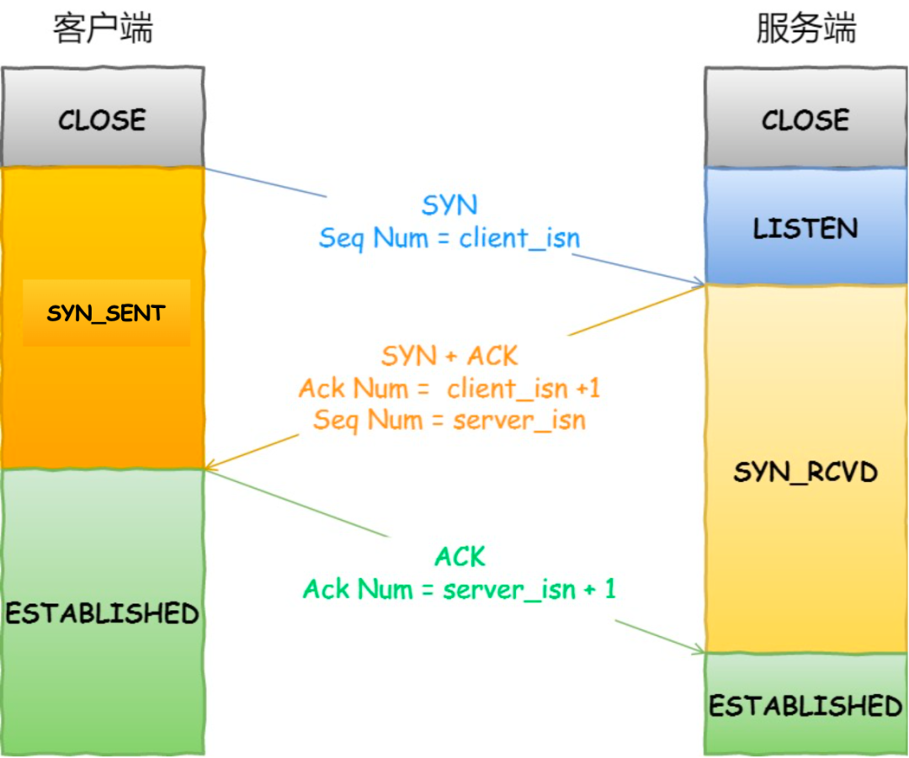

  - 一开始，客户端和服务端都处于 `CLOSE` 状态。先是服务端主动监听某个端口，处于 `LISTEN` 状态

    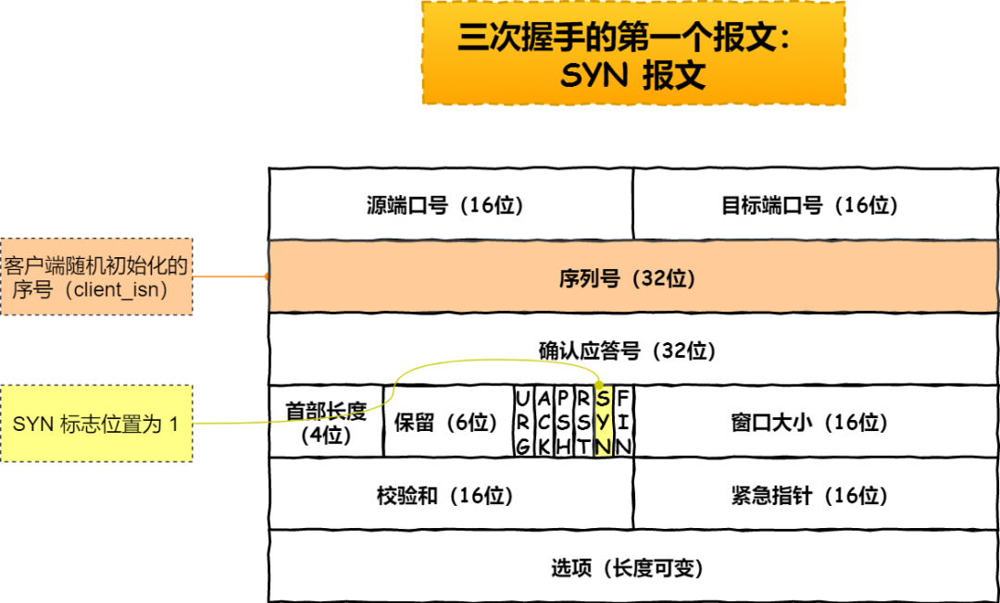

  - 客户端会随机初始化序号（`client_isn`），将此序号置于 TCP 首部的「序号」字段中，同时把 `SYN` 标志位置为 `1`，表示 `SYN` 报文。接着把第一个 SYN 报文发送给服务端，表示向服务端发起连接，该报文不包含应用层数据，之后客户端处于 `SYN-SENT` 状态。

    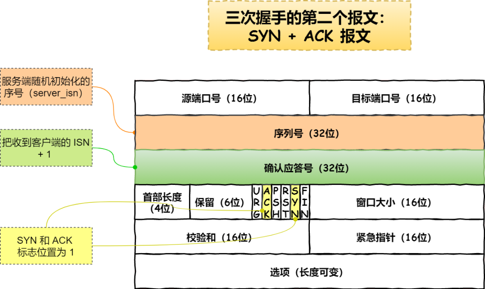

  - 服务端收到客户端的 `SYN` 报文后，首先服务端也随机初始化自己的序号（`server_isn`)，将此序号填入 TCP 首部的「序号」字段中，其次把 TCP 首部的「确认应答号」字段填入 `client_isn + 1`, 接着把 `SYN` 和 `ACK` 标志位置为 `1`。最后把该报文发给客户端，该报文也不包含应用层数据，之后服务端处于 `SYN-RCVD` 状态。

    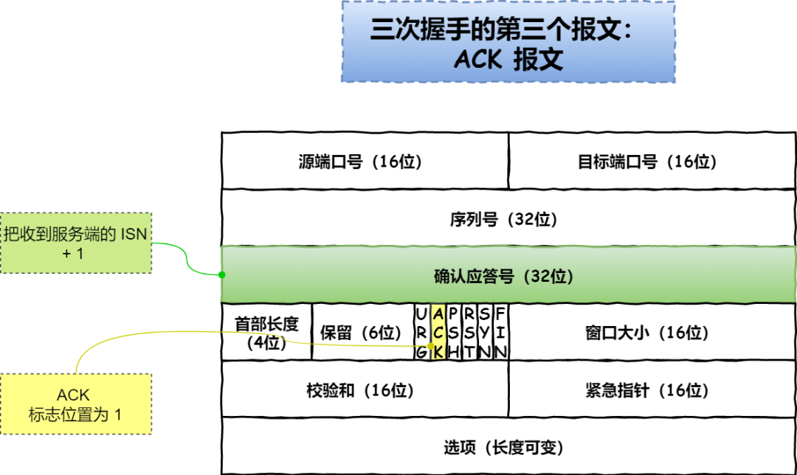

  - 客户端收到服务端报文后，还要向服务端回应最后一个应答报文，首先该应答报文 TCP 首部 `ACK` 标志位置为 `1` ，其次「确认应答号」字段填入 `server_isn + 1` ，最后把报文发送给服务端，这次报文可以携带客户到服务端的数据，之后客户端处于 `ESTABLISHED` 状态。

  - 服务端收到客户端的应答报文后，也进入 `ESTABLISHED` 状态。

  **第三次握手是可以携带数据的，前两次握手是不可以携带数据的**

  一旦完成三次握手，双方都处于 `ESTABLISHED` 状态，此时连接就已建立完成，客户端和服务端就可以相互发送数据了。

- 四次挥手？

  - 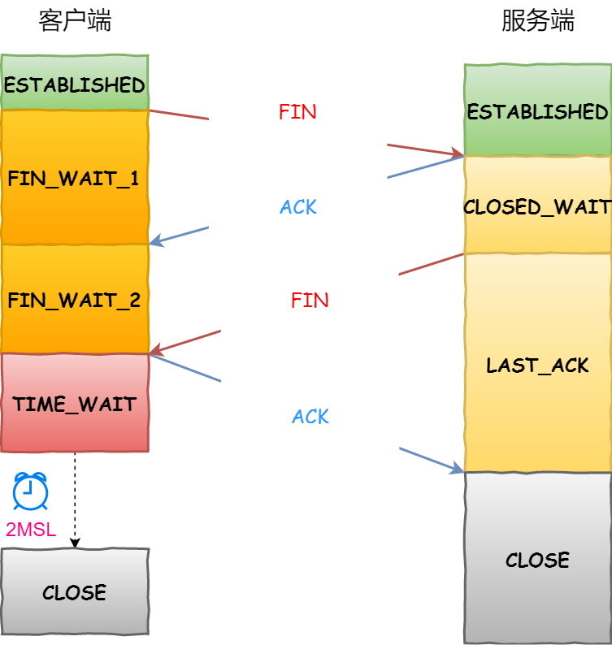
  - 客户端打算关闭连接，此时会发送一个 TCP 首部 `FIN` 标志位被置为 `1` 的报文，也即 `FIN` 报文，之后客户端进入 `FIN_WAIT_1` 状态。
  - 服务端收到该报文后，就向客户端发送 `ACK` 应答报文，接着服务端进入 `CLOSE_WAIT` 状态。
  - 客户端收到服务端的 `ACK` 应答报文后，之后进入 `FIN_WAIT_2` 状态。
  - 等待服务端处理完数据后，也向客户端发送 `FIN` 报文，之后服务端进入 `LAST_ACK` 状态。
  - 客户端收到服务端的 `FIN` 报文后，回一个 `ACK` 应答报文，之后进入 `TIME_WAIT` 状态
  - 服务端收到了 `ACK` 应答报文后，就进入了 `CLOSE` 状态，至此服务端已经完成连接的关闭。
  - 客户端在经过 `2MSL` 一段时间后，自动进入 `CLOSE` 状态，至此客户端也完成连接的关闭。

- 为什么三次？

  > 一句话总结，三次握手才能保证双方具有接收和发送的能力

  - **三次握手才可以阻止重复历史连接的初始化(主要原因)**

    - RFC 793 指出的 TCP 连接使用三次握手的**首要原因**：

      *The principle reason for the three-way handshake is to prevent old duplicate connection initiations from causing confusion.(**首要原因是为了防止旧的重复连接初始化造成混乱。**)*

    - 考虑一个场景，客户端先发送了 SYN（seq = 90）报文，然后客户端宕机了，而且这个 SYN 报文还被网络阻塞了，服务端并没有收到，接着客户端重启后，又重新向服务端建立连接，发送了 SYN（seq = 100）报文（*注意！不是重传 SYN，重传的 SYN 的序列号是一样的*）。

    - 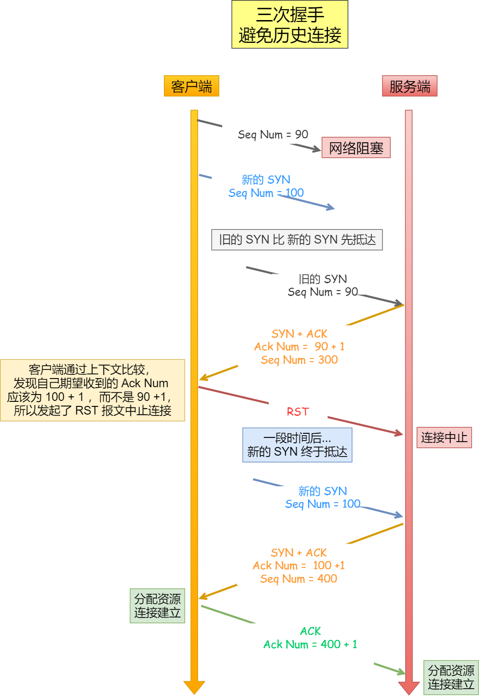

    - 客户端连续发送多次 SYN（都是同一个四元组）建立连接的报文，在**网络拥堵**情况下：

      - 一个「旧 SYN 报文」比「最新的 SYN」 报文早到达了服务端，那么此时服务端就会回一个 `SYN + ACK` 报文给客户端，此报文中的确认号是 91（90+1）。
      - 客户端收到后，发现自己期望收到的确认号应该是 100 + 1，而不是 90 + 1，于是就会回 RST 报文。
      - 服务端收到 RST 报文后，就会释放连接。
      - 后续最新的 SYN 抵达了服务端后，客户端与服务端就可以正常的完成三次握手了。

    - 上述中的「旧 SYN 报文」称为历史连接，TCP 使用三次握手建立连接的**最主要原因就是防止「历史连接」初始化了连接**。

  - **三次握手才可以同步双方的初始序列号**

    - TCP 协议的通信双方， 都必须维护一个「序列号」， 序列号是可靠传输的一个关键因素，它的作用：

      - 接收方可以去除重复的数据；
      - 接收方可以根据数据包的序列号按序接收；
      - 可以标识发送出去的数据包中， 哪些是已经被对方收到的（通过 ACK 报文中的序列号知道）；

    - 当客户端发送携带「初始序列号」的 `SYN` 报文的时候，需要服务端回一个 `ACK` 应答报文，表示客户端的 SYN 报文已被服务端成功接收，那当服务端发送「初始序列号」给客户端的时候，依然也要得到客户端的应答回应，**这样一来一回，才能确保双方的初始序列号能被可靠的同步。**

      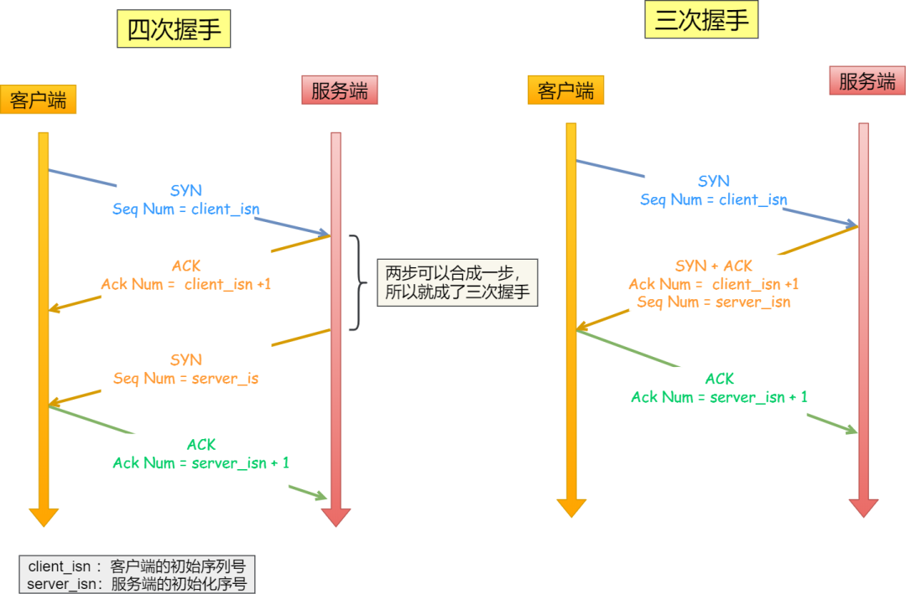

    - 四次握手其实也能够可靠的同步双方的初始化序号，但由于**第二步和第三步可以优化成一步**，所以就成了「三次握手」。

      而两次握手只保证了一方的初始序列号能被对方成功接收，没办法保证双方的初始序列号都能被确认接收。

  - **三次握手才可以避免资源浪费**

    - 如果只有「两次握手」，当客户端发生的 `SYN` 报文在网络中阻塞，客户端没有接收到 `ACK` 报文，就会重新发送 `SYN` ，**由于没有第三次握手，服务端不清楚客户端是否收到了自己回复的 `ACK` 报文，所以服务端每收到一个 `SYN` 就只能先主动建立一个连接**，这会造成什么情况呢？

      如果客户端发送的 `SYN` 报文在网络中阻塞了，重复发送多次 `SYN` 报文，那么服务端在收到请求后就会**建立多个冗余的无效链接，造成不必要的资源浪费。**

      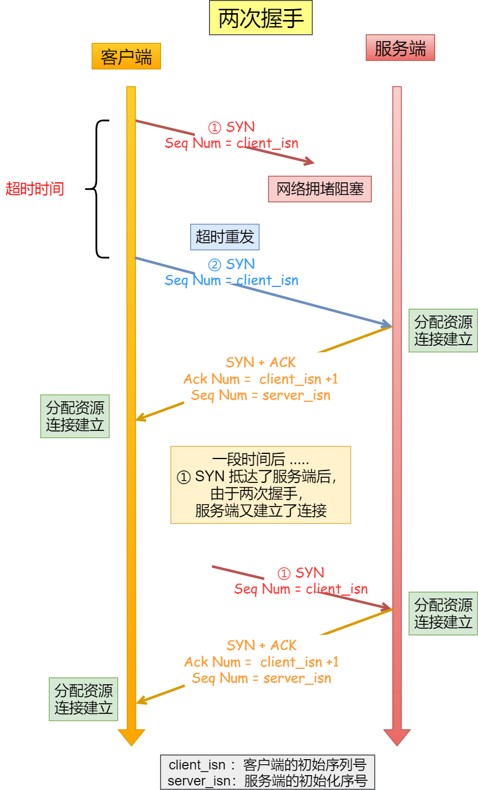

    - 即两次握手会造成消息滞留情况下，服务端重复接受无用的连接请求 `SYN` 报文，而造成重复分配资源。

  - TCP 建立连接时，通过三次握手**能防止历史连接的建立，能减少双方不必要的资源开销，能帮助双方同步初始化序列号**。序列号能够保证数据包不重复、不丢弃和按序传输。

- 为什么四次挥手?

  - 关闭连接时，客户端向服务端发送 `FIN` 时，仅仅表示客户端不再发送数据了但是还能接收数据。
  - 服务端收到客户端的 `FIN` 报文时，先回一个 `ACK` 应答报文，而服务端可能还有数据需要处理和发送，等服务端不再发送数据时，才发送 `FIN` 报文给客户端来表示同意现在关闭连接。

  从上面过程可知，服务端通常需要等待完成数据的发送和处理，所以服务端的 `ACK` 和 `FIN` 一般都会分开发送，因此是需要四次挥手。

TCP首部序号的主要作用(目的)？(可以结合滑动窗口)

#### &#10004;什么是2MSL

- `MSL` 是 Maximum Segment Lifetime，**报文最大生存时间**，它是任何报文在网络上存在的最长时间，超过这个时间报文将被丢弃。因为 TCP 报文基于是 IP 协议的，而 IP 头中有一个 `TTL` 字段，是 IP 数据报可以经过的最大路由数，每经过一个处理他的路由器此值就减 1，当此值为 0 则数据报将被丢弃，同时发送 ICMP 报文通知源主机。

什么是拥塞控制，TCP拥塞控制的目的，拥塞控制的四种算法，具体是怎么实现的，慢启动的窗口增长是否线性

- 什么是拥塞控制
  - 拥塞控制是通过控制发送方的数据发送速率来避免网络拥塞。当网络中的数据包数量过多时，就会导致网络拥塞，丢包率和延迟都会增加。TCP通过拥塞窗口大小来控制数据发送速率，当网络拥塞时，发送方会自动降低拥塞窗口大小，以降低数据发送速率，从而避免网络拥塞的问题。
- 目的
  - 拥塞控制是为了避免网络拥塞，保持网络的稳定性和可靠性。
- 四种算法
  - 慢启动
    - 慢启动的意思就是一点一点的提高发送数据包的数量
    - **当发送方每收到一个 ACK，拥塞窗口 cwnd 的大小就会加 1。**
    - 例子：
      - 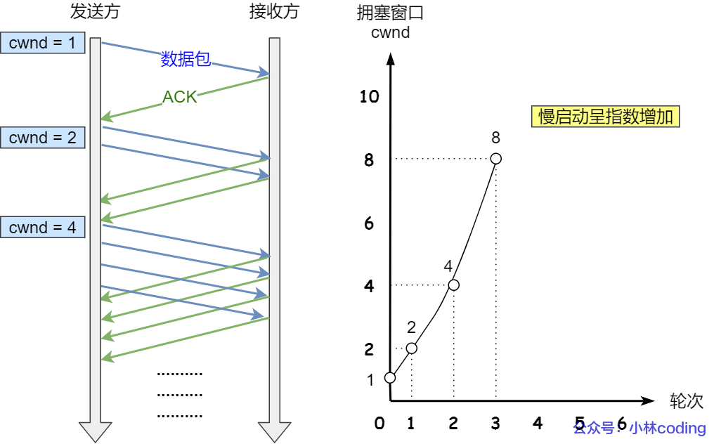
      - 连接建立完成后，一开始初始化 `cwnd = 1`，表示可以传一个 `MSS` 大小的数据。
      - 当收到一个 ACK 确认应答后，cwnd 增加 1，于是一次能够发送 2 个
      - 当收到 2 个的 ACK 确认应答后， cwnd 增加 2，于是就可以比之前多发2 个，所以这一次能够发送 4 个
      - 当这 4 个的 ACK 确认到来的时候，每个确认 cwnd 增加 1， 4 个确认 cwnd 增加 4，于是就可以比之前多发 4 个，所以这一次能够发送 8 个。
    - 可以看出慢启动算法，发包的个数是**指数性的增长**。
  - 拥塞避免算法

#### &#10004;TCP怎么保证可靠性，如果没有流量控制会出现什么问题，按序到达如何做到

- 保证可靠性？
  - TCP 是通过**序列号、确认应答、重发控制、连接管理以及窗口控制**等机制实现可靠性传输的
- 没有流量控制？
  - 发送端可能会一直发送大量数据，但对方处理不过来，那么就会导致触发重发机制，从而导致网络流量的无端的浪费。
- 如何保证按序？
  - TCP协议通过序列号和确认号来保证数据按序到达和可靠传输。具体来说，当发送端发送数据时，它会给每个数据块分配一个新的序列号。接收端接收到数据时，会检查序列号，如果收到的数据的序列号比上次收到的序列号小，则表示数据重复，丢弃数据；如果收到的数据的序列号比上次收到的序列号大，则表示接收到新数据，存储数据并返回一个确认号。

TCP为了实现可靠传输协议多了哪些开销

#### &#10004;TCP协议中超时重传能保证 数据 的可靠传输，但是丢包之后一定会有延迟，有没有什么办法来降低这个延迟？

- 快速重传（Fast Retransmit）：当TCP发送端收到连续的三个重复的 ACK 响应时，可以认为接收端已经收到了这些数据包并正在等待后续的数据包。因此，TCP发送端可以快速重传之前发送的数据包，而不是等待超时时间后再重新发送。这样可以避免等待超时时间所带来的延迟，并且能够更快地恢复丢失的数据包。

#### &#10004;TCP和UDP哪个协议有包长限制

- TCP 的数据大小如果大于 MSS 大小，则会在传输层进行分片，目标主机收到后，也同样在传输层组装 TCP 数据包，如果中途丢失了一个分片，只需要传输丢失的这个分片。
- UDP 的数据大小如果大于 MTU 大小，则会在 IP 层进行分片，目标主机收到后，在 IP 层组装完数据，接着再传给传输层。

IP数据分片有什么弊端

TCP连接两端一个突然断连，另一端如何感知

什么情况下会出现半开连接，如何解决


#### &#10004;TCP中的backlog队列说一下

- Linux内核中会维护两个队列：

  - 半连接队列（SYN 队列）：接收到一个 SYN 建立连接请求，处于 SYN_RCVD 状态；
  - 全连接队列（Accpet 队列）：已完成 TCP 三次握手过程，处于 ESTABLISHED 状态；

- 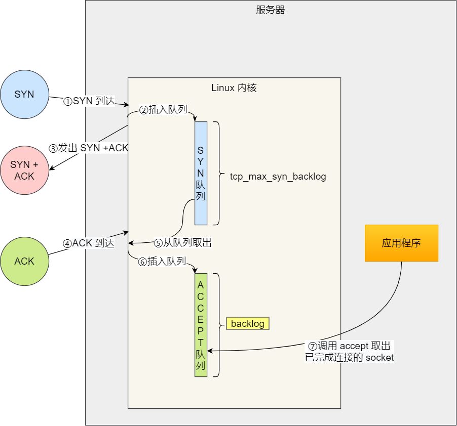

- ```c
  int listen (int socketfd, int backlog);
  ```

  - 参数一 socketfd 为 socketfd 文件描述符
  - 参数二 backlog，这参数在历史版本有一定的变化

- 在早期 Linux 内核 backlog 是 SYN 队列大小，也就是未完成的队列大小。在 Linux 内核 2.2 之后，backlog 变成 accept 队列，也就是已完成连接建立的队列长度，**所以现在通常认为 backlog 是 accept 队列。**

TCP连接建立后把网线拔了会怎样，客户端会发生什么，会收到断开的通知吗？

TCP通讯，服务端的程序挂掉了，客户端会怎样

tcp三次握手中第三次丢了，客户端这个时候发了一个http包，问服务端会回复吗，会的话回复什么内容

断开连接时，客户端FIN包丢失，服务端状态是什么？

#### &#10004;tcp第三次握手ack丢失会发生什么？

- 客户端收到服务端的 SYN-ACK 报文后，就会给服务端回一个 ACK 报文，也就是第三次握手，此时客户端状态进入到 `ESTABLISH` 状态。

  因为这个第三次握手的 ACK 是对第二次握手的 SYN 的确认报文，所以当第三次握手丢失了，如果服务端那一方迟迟收不到这个确认报文，就会触发超时重传机制，重传 SYN-ACK 报文，直到收到第三次握手，或者达到最大重传次数。

  注意，**ACK 报文是不会有重传的，当 ACK 丢失了，就由对方重传对应的报文**。

tcp第三次握手ack丢失但发出http请求其中的操作会让tcp误认为是第三次握手确认吗？为什么？


怎么监听一个tcp端口

TCP连接过程中，如果服务端send发送过程中，调用close关闭，客户端可以接收到吗？

TCP连接过程中，如果服务端send发送过程中，程序被异常终止了，客户端可以接收到吗？

TCP连接过程中，如果服务端send发送过程中，服务端宕机了，客户端可以接收到吗？

#### &#10004;TCP和UDP可以绑定相同的端口吗？多个TCP进程可以绑定同一个端口吗？什么情况下可以重新利用这个端口？

- TCP和UDP可以绑定相同的端口

  - 在数据链路层中，通过 MAC 地址来寻找局域网中的主机。在网际层中，通过 IP 地址来寻找网络中互连的主机或路由器。在传输层中，需要通过端口进行寻址，来识别同一计算机中同时通信的不同应用程序。

    所以，传输层的「端口号」的作用，是为了区分同一个主机上不同应用程序的数据包。

    传输层有两个传输协议分别是 TCP 和 UDP，在内核中是两个完全独立的软件模块。

    当主机收到数据包后，可以在 IP 包头的「协议号」字段知道该数据包是 TCP/UDP，所以可以根据这个信息确定送给哪个模块（TCP/UDP）处理，送给 TCP/UDP 模块的报文根据「端口号」确定送给哪个应用程序处理。

    

- 多个TCP绑定同一个端口？
  - **如果两个 TCP 服务进程同时绑定的 IP 地址和端口都相同，那么执行 bind() 时候就会出错，错误是“Address already in use”**。
  - 如果两个 TCP 服务进程绑定的 IP 地址不同，而端口相同的话，也是可以绑定成功的。
- 重新利用端口？
  - 

#### &#10004;TCP拥塞控制和流量控制的具体实现，有什么区别？

- 流量控制

  > ​	**TCP 提供一种机制可以让「发送方」根据「接收方」的实际接收能力控制发送的数据量，这就是所谓的流量控制。**

  - TCP使用滑动窗口协议来进行流量控制，接收方会告诉发送方可以接收的数据大小，即窗口大小。发送方只能发送不超过窗口大小的数据。发送方发送一个数据包后，会等待接收方确认收到该数据包的ACK（确认应答）信号，然后再发送下一个数据包。如果发送方发送的数据超过了窗口大小，接收方就会拒绝接收这些数据，并发送一个窗口关闭通知，发送方需要等待接收方重新打开窗口后才能继续发送数据。
  - 窗口大小的控制由接收方来实现。接收方会根据自己的处理能力和缓冲区大小来动态调整窗口大小。如果接收方处理能力较弱或者缓冲区已满，窗口大小就会减小；如果接收方处理能力较强或者缓冲区有空闲，窗口大小就会增大。

- 拥塞控制

  - .

- 区别？

  - 流量控制是为了确保数据发送方和接收方之间的平衡，避免接收方被淹没，而拥塞控制是为了避免网络拥塞，保持网络的稳定性和可靠性。

流量控制在哪个阶段执行

TCP协议中的接收缓冲区是如何实现的？

TCP连接数量如何确定

下载东西时会发现刚开始时网速很慢，然后逐渐加快，讲一下TCP连接底层对应的变化

对于服务器和客户端而言，支持的TCP连接数受到什么影响

TCP四次挥手状态转换中LAST_ACK状态存在的意义？

tcp四次挥手FIN包可以携带数据吗，为什么？

TCP滑动窗口解决了什么问题？请求和确认报文配合的机制，是等到确认报文返回了再发送下一个数据还是一直等延迟确认(分有无滑动窗口两种情况)

TCP长连接和短连接有什么区别？分别对应什么样的场景。

怎么看TCP数据有没有断包、连包、粘包

TCP Tahoe 和TCP Reno拥塞控制算法知道吗？

说说对差错控制这个概念的理解


TCP/IP有几层，每层作用，应用层常用协议？

TCP状态变迁图，TCP/IP接收发送缓冲区相关概念？

客户端如何告知服务端自己能收到的序列长度（包头有序列长度）
客户端会不会知道自己发出的ack丢失，如果第三次握手失败，客户端可以发送 数据 吗

&#10004;udp报文有序列号吗

- 在 UDP 头部中，主要的字段有源端口号、目标端口号、长度和校验和。这些字段用于确定数据报应该发送到哪个应用程序，以及如何检查数据报的完整性。然而，UDP 头部并没有序列号字段，这意味着 UDP 不能保证数据报的顺序或防止数据报的丢失

&#10004;UDP如何实现可靠传输？UDP的优点*2

- 基于 UDP 协议实现的可靠传输协议的已经有成熟方案了，那就是 **QUIC 协议**，已经应用在了 HTTP/3。
- 如何实现？主要是靠两部分：
  - Packet Header
    - Packet Header 细分这两种：
      - 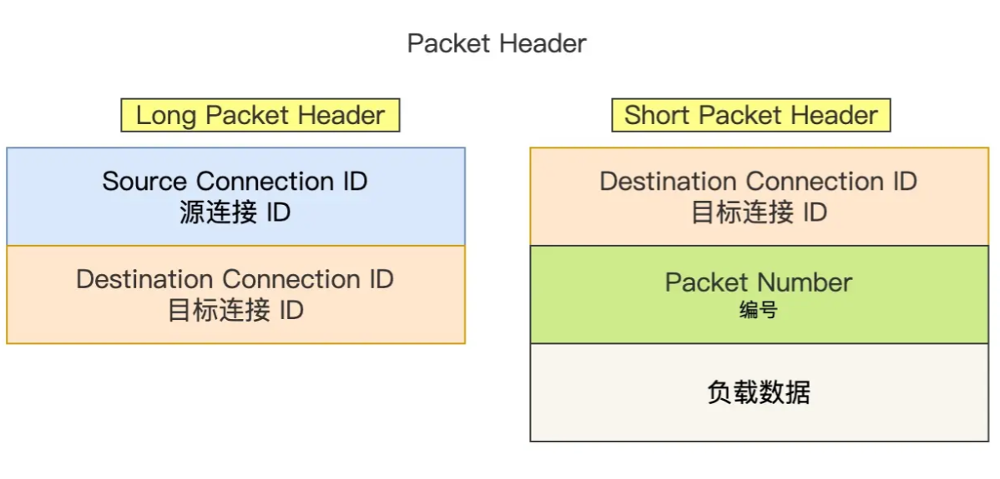
      - Long Packet Header 用于首次建立连接。
      - Short Packet Header 用于日常传输数据。

  - QUIC Frame Header
  - **QUIC 通过单向递增的 Packet Number，配合 Stream ID 与 Offset 字段信息，可以支持乱序确认而不影响数据包的正确组装**，摆脱了TCP 必须按顺序确认应答 ACK 的限制，解决了 TCP 因某个数据包重传而阻塞后续所有待发送数据包的问题。


&#10004;四元组标识TCP连接，那么对于QUIC而言，当四元组当中有一个东西变了需要重新建立连接吗？

- 基于 TCP 传输协议的 HTTP 协议，由于是通过四元组（源 IP、源端口、目的 IP、目的端口）确定一条 TCP 连接。

- 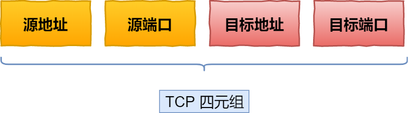

- 那么**当移动设备的网络从 4G 切换到 WIFI 时，意味着 IP 地址变化了，那么就必须要断开连接，然后重新建立 TCP 连接**。

  而建立连接的过程包含 TCP 三次握手和 TLS 四次握手的时延，以及 TCP 慢启动的减速过程，给用户的感觉就是网络突然卡顿了一下，因此连接的迁移成本是很高的。

  QUIC 协议没有用四元组的方式来“绑定”连接，而是通过**连接 ID**来标记通信的两个端点，客户端和服务器可以各自选择一组 ID 来标记自己，因此即使移动设备的网络变化后，导致 IP 地址变化了，只要仍保有上下文信息（比如连接 ID、TLS 密钥等），就可以“无缝”地复用原连接，消除重连的成本，没有丝毫卡顿感，达到了**连接迁移**的功能。

&#10004;UDP如何解决丢包的问题？

- UDP 本身并不直接处理丢包问题。可以参考QUIC。

#### &#10004;HTTP有keep-alive，TCP 也有 keep-alive，它们有什么区别吗？

> - HTTP 的 Keep-Alive，是由**应用层（用户态）** 实现的，称为 HTTP 长连接；
> - TCP 的 Keepalive，是由 **TCP 层（内核态）** 实现的，称为 TCP 保活机制；

- **HTTP Keep-Alive**

  在http早期，每个http请求都要求打开一个tpc socket连接，并且使用一次之后就断开这个tcp连接。使用keep-alive可以改善这种状态，即在一次TCP连接中可以持续发送多份数据而不会断开连接。通过使用keep-alive机制，可以减少tcp连接建立次数，也意味着可以减少TIME_WAIT状态连接，以此提高性能和提高httpd服务器的吞吐率(更少的tcp连接意味着更少的系统内核调用,socket的accept()和close()调用)。但是，keep-alive并不是免费的午餐,长时间的tcp连接容易导致系统资源无效占用。配置不当的keep-alive，有时比重复利用连接带来的损失还更大。所以，正确地设置keep-alive timeout时间非常重要。

- **TCP KEEPALIVE**

  链接建立之后，如果应用程序或者上层协议一直不发送数据，或者隔很长时间才发送一次数据，当链接很久没有数据报文传输时如何去确定对方还在线，到底是掉线了还是确实没有数据传输，链接还需不需要保持，这种情况在TCP协议设计中是需要考虑到的。TCP协议通过一种巧妙的方式去解决这个问题，当超过一段时间之后，TCP自动发送一个数据为空的报文给对方，如果对方回应了这个报文，说明对方还在线，链接可以继续保持，如果对方没有报文返回，并且重试了多次之后则认为链接丢失，没有必要保持链接。

- TCP的keepalive机制和HTTP的keep-alive机制是说的完全不同的两个东西，tcp的keepalive是在ESTABLISH状态的时候，双方如何检测连接的可用行。而http的keep-alive说的是如何避免进行重复的TCP三次握手和四次挥手的环节。

CDN核心的两个模块

负载均衡用了什么组件

CDN配置中心核心模块，能够做哪些事情

&#10004;close_wait状态多久出现，出现原因是什么

- CLOSE_WAIT 状态是「被动关闭方」才会有的状态，而且如果「被动关闭方」没有调用 close 函数关闭连接，那么就无法发出 FIN 报文，从而无法使得 CLOSE_WAIT 状态的连接转变为 LAST_ACK 状态。
- **当服务端出现大量 CLOSE_WAIT 状态的连接的时候，说明服务端的程序没有调用 close 函数关闭连接**
- 服务器内部业务处理占用了过多时间，都没能处理完业务

time_wait状态过多占用资源怎么办

close_wait、time_wait分别指什么

应用层除去HTTP之外还有什么 -> SMTP, FTP


TCP粘包、拆包问题，处理方式？

TIME_WAIT状态的详细分析，何时出现，何处出现，为何出现，是否有弊端，如何避免 ，有什么作用？

- 何时出现
  - 当客户端收到服务端的第三次挥手的 FIN 报文后，就会回 ACK 报文，也就是第四次挥手，此时客户端连接进入 `TIME_WAIT` 状态。

- 何处出现
  - 主动发起关闭连接的一方，才会有 `TIME-WAIT` 状态。
- 有什么作用
  - 防止历史连接中的数据，被后面相同四元组的连接错误的接收；
  - 保证「被动关闭连接」的一方，能被正确的关闭；
- 弊端
  - 第一是占用系统资源，比如文件描述符、内存资源、CPU 资源、线程资源等；
  - 第二是占用端口资源，端口资源也是有限的，一般可以开启的端口为 `32768～61000`，也可以通过 `net.ipv4.ip_local_port_range`参数指定范围。

结合七层模型讲一讲网址键入的全过程，讲一下七层模型分别完成什么功能？


网络层怎么转发数据包

arp地址解析用到了吗，路由器转发出去，这个mac地址是谁的，怎么得到

ARP是哪层的，说一下五层协议

网络分层介绍一下？

七层模型和四层模型的区别

ping的底层*3，发送的是什么包

ping网址时TTL是什么东西

linux  ping的整个过程，从系统调用到网卡到传输过程

traceroute的底层

tcp/udp区别*3对现实层面的影响，比如网络编程、接口、数据传输和读取


说一下应用层协议

三次握手与四次挥手，详细讲一讲客户端和服务端的所有可能状态

键入网址的全过程 -> 从应用层到协议栈再到网卡，通过交换机路由器的网络风暴到达服务器，加上html/css的DOM树解析与渲染


浏览器输入网址到响应的整个过程？dns协议一次返回多少个ip呢，其中的ip挂掉了怎么办？怎么实现用户后续登录不需要输入密码？用户量极大的情况下怎么优化服务器？分布式情况下某台主机宕机了怎么处理？


DDos、SYN、xss攻击

DDOS攻击是怎样的，服务器端第三次握手会持续到什么时候？

DNS是什么，存在什么安全问题，如何解决以及DNS污染

DNS过程

DNS协议的迭代和递归，缓存，负载均衡的实现方法


http1.0 1.1 2.0 3.0之间比较大的改变，各自有什么特定?*2

- 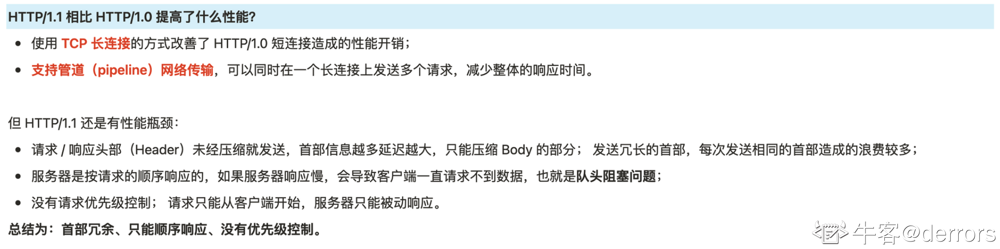
- 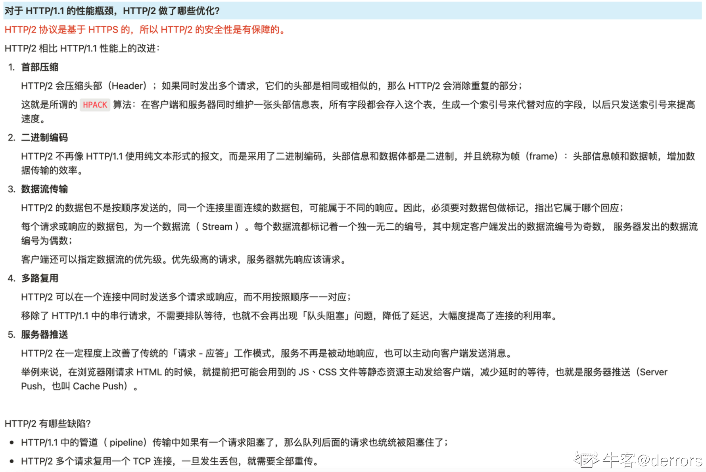
- 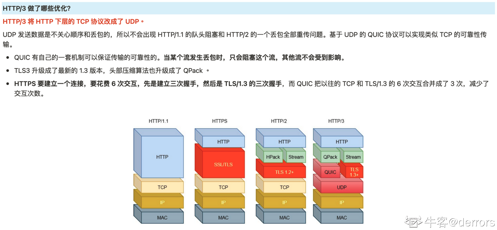


socket通信基本步骤*2

怎么监听socket

socket广播机制

socket在哪一层

socket中connect具体执行了什么

讲一下非阻塞socket，怎么设置，怎么读取？

socket的角度解释TCP的连接建立过程

socket编程中，什么情况下会出现缓冲区溢出，该怎么处理？

socket通信里面write的返回值

listen函数第二个函数backlog参数作用

listen底层用的什么队列

listen是阻塞的还是非阻塞的？

内网和外网的区别？


讲一下NAT

RSA加密算法说一下

为什么同时存在IP地址和MAC地址

从浏览器输入url后经历了哪些过程，涉及到哪些协议，这个流程中哪些地方可以被攻击，怎么防范

为什么访问不到google，怎么墙的？


什么是幂等？
幂等方法了解哪些？
除了Get方法之外还了解其他幂等方法吗？

一个TCP连接可以发送多少次HTTP请求?


cookie是干啥的

cookie如何设置

cookie有哪些参数

cookie状态的安全问题，如何避免中间人的攻击

IP包有大小限制吗

DHCP作用，网关、子网、子网掩码，为什么需要子网？

两个子网进行通信，A子网加入一台新设备，需要怎么配置地址参数，能和A通信不能和B通信是怎么回事

客户端多个线程发送请求，在读取响应结果时，怎么和每一个请求线程对应呢？

服务器端的socket关闭，客户端再写，会怎么样，会报错吗？用户怎么感知socket已经断开？

服务器端在传输过程中死机了，客户端有什么反应

如果客户端一直死机，连接什么时候终止？

如果客户端断开了，怎么通知epoll去摘除fd


网络带宽和哪些因素有关？

千兆网理论带宽多大？

Muduo网络库具体怎么实现的，说一下？

数字证书说一下

路由表记录了哪些信息(小林coding)

路由表中有一项的目标IP地址是default或者0.0.0.0，这是什么情况(默认网关)

双网卡电脑进行访问网络，有两个默认网关，如何处理(建立多路由表，针对不同的情况采取不同的策略)

局域网里面，同一网段，需要做路由吗？

es路由算法说一下？es分片，各个片上存储的一样吗？

linux如何将网络包发送出去(小林coding_选择网卡部分八股文+ARP协议，简单提到了路由表+MAC地址的作用)

浏览器输入baidu.com，TCP/IP协议栈中大概用到了哪些协议

Nginx配置负载均衡的几个策略和方法

延时和吞吐率的区别？

假如 A 和 B 进行数据传输，你认为会存在什么安全问题？(数据篡改、被监听、身份认证等问题。)——如何解决这些问题？( HTTPS 采取的相关措施。)——混合加密解释一下，具体怎么传输的？——数字证书是怎么验证的？

ip包重组的过程

怎么知道网络包要不要交付二层还是三层？

交换机怎么区分二层转发和三层转发？

vlan知道吗？

netlink听说过吗？

protobuf介绍，优点，什么时候用，有何好处

其他序列化方式


场景题：

思考这样一个场景，宿舍有一个路由器，寝室有你的电脑和你舍友的电脑，当你往你舍友电脑发包和往 百度 服务器发包底层的协议过程有什么不同。


在山区里信号很差用手机上网，没有彻底断开会发生什么，什么时候会发生重传


访问银行网址时，如何确保当前的这个网址是正规的而不是不法分子伪造的


双十一15分钟不付款就取消订单，怎么实现？（定时器）定时器加到哪里?(订单加到数据库时，添加定时器)


负载均衡，如果有几天服务器宕机了，定时器怎么办？（冗余备份）备份定时器的资源消耗有多大？


防止重复提交多个请求的方法


如何防止对网页的爬取（比如小说网的小说）


游戏中，比如和平精英中用到的是TCP还是UDP，应该如何设计与改进


一个服务器长时间运行但突然挂了，怎么排查错误？


一个局域网内，两台主机 假设路由器都是好的，两个问题如何检测主机A发送的ping包到达主机B以及主机B回复了主机A的ping包，但主机A没有收到，有什么问题会导致这种情况。


网络通畅的情况下客户端访问失败了怎么排查这个问题，从哪里开始排查

