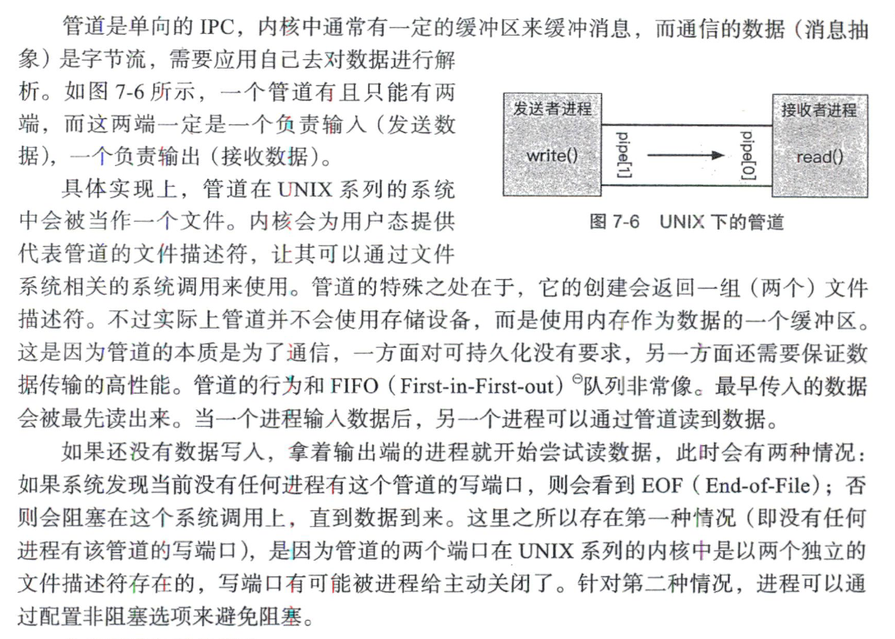

# OS Interview

进行函数调用，栈怎么动态分配，和CPU寄存器怎么联动。数据怎么同步到内存

为什么一个os可以运行多个进程，核心技术是？

介绍一下fork过程？——栈和堆会拷贝吗？——在复制之前做些什么 写时复制！！

进程fork的时候，虚拟地址空间的五大分区哪些不需要写时复制过去？

fork、vfork、clone的区别？

介绍一下僵尸进程、孤儿进程*2

- 一个终止了但还未被父进程回收的进程被称为僵尸进程(zombie)。

如何避免僵尸进程，僵尸进程怎么处理？

僵尸进程在进程列表中有什么特征，怎么清除

多进程程序如何设计wait解决僵尸进程

汇编层解释一下引用?

惊群效应介绍一下，如何避免？以及如何避免

中断的作用？

中断的类型有哪些？*2

讲讲软中断

中断与异常，多进程是如何工作的？

轮询和中断的区别

## IO多路复用

reactor模式和preactor模式有什么区别，有什么优缺点？

两个模式下调用read()有什么不一样？

讲讲reactor事件处理模式

阻塞、非阻塞、同步、异步之间的关系？

常见的IO复用模型*2，I/O是什么？

同步IO和异步IO介绍一下？

异步I/O与I/O多路复用有什么区别？

谈谈你对`I/O`多路复用的理解？

- 

select，poll为什么是内核去检测事件的

select的底层数据结构？

IO多路复用中的select系统调用和Go语言中的select有什么区别

poll和epoll介绍一下*2，为什么还需要epoll？

&#10004;epoll底层结构*2在内核中怎么实现，为什么是红黑树？为何epoll_wait复杂度为O(1)

- 底层结构？
  - epoll的底层数据结构是一个红黑树和一个双向链表。红黑树用来存储所有添加到epoll实例中的文件描述符，每个文件描述符对应一个epitem结构体，包含了文件描述符的信息和事件类型。双向链表用来存储就绪的文件描述符，每次内核检测到某个文件描述符状态发生变化时，就会将其对应的epitem结构体添加到链表中。用户程序调用epoll_wait()时，只需要从链表中取出就绪的文件描述符即可。

- 为什么使用红黑树？

  - 用来维护一个 epoll 实例中所有的 epitem。

  - 用户态调用 epoll_ctl()来操作 epoll 的监视文件时，需要增、删、改、查等动作有着比较高的效率。尤其是当 epoll 监视的文件数量达到百万级的时候，选用不同的数据结构带来的效率差异可能非常大。

  - | 数据结构  | 特点                                           |
    | :-------: | ---------------------------------------------- |
    |  红黑树   | 综合性能优秀，最差情况下时间复杂度是O(logn)    |
    |   AVL树   | 查询效率稍快于红黑树，插入、删除效率低于红黑树 |
    | HashTable | 需要选择适当的大小和hash函数，扩展性差         |

  - epoll 红黑树中的 epitem 是按什么顺序组织的？阅读代码可以发现是先比较 2 个文件指针的地址大小，如果相同再比较文件 fd 的大小。

    ```c
    /* Compare RB tree keys */
    static inline int ep_cmp_ffd(struct epoll_filefd *p1, struct epoll_filefd *p2)
    {
        return (p1->file > p2->file ? +1 : (p1->file < p2->file ? -1 : p1->fd - p2->fd));
    }
    ```

    

- 为何epoll_wait复杂度为O(1)？
  - epoll_wait()的时间复杂度是O(1)的原因是它不需要遍历所有的文件描述符，而只需要从就绪链表中取出已经就绪的文件描述符。就绪链表是epoll内部维护的一个双向链表，当某个文件描述符状态发生变化时，内核会将其添加到就绪链表中。epoll_wait()只需要检查就绪链表是否为空，如果不为空，就返回其中的文件描述符给用户程序。这样，epoll_wait()的时间复杂度和文件描述符的数量无关，而只和就绪文件描述符的数量有关³。

epoll 的使用流程？ 

- 区别从结构、功能、效率和可移植性方面进行了回答，使用流程主要是结合项目来回答一个客户端的连接请求→请求网页→得到响应这个过程中 epoll 是怎么操作的，具体问到了代码层面的 epoll 函数的使用。

&#10004;select、poll、epoll有什么区别，适用的场景*5

- 
- 适用场景？
  - 表面上看epoll的性能最好，但是在连接数少并且连接都十分活跃的情况下，select和poll的性能可能比epoll好，毕竟epoll的通知机制需要很多函数回调。
  - select低效是因为每次它都需要轮询。但低效也是相对的，视情况而定，也可通过良好的设计改善

&#10004;select、poll、epoll每次都需要遍历监听内容吗

- select和poll采用的都是轮询方式，即每次调用都要扫描整个注册文件描述符的集合，并将其中就绪的文件描述符返回给用户程序，因此它们检测就绪事件的算法的时间复杂度是O(n)，
- 而epoll则不同，它采用的是回调的方式。内核检测到就绪的文件描述符时，就触发回调函数，回调函数就将该文件描述符上对应的事件插入到内核就绪事件队列。内核最后在适当的实际将该就绪队列中的内容拷贝到用户空间。因此epoll无需轮询整个文件描述符集合来检测哪些事件已经就绪，其算法时间复杂度是O(1)

epoll底层是如何实现事件驱动的，select底层是如何实现事件驱动的?

&#10004;epoll_wait 函数中的 timeout 参数是什么作用？

- ```c
  #include<sys/epoll.h>
  int epoll_wait(int epfd,struct epoll_event *evlist,int maxevents,int timeout);
  ```

- 系统调用epoll_wait()返回epoll实例中处于就绪状态的文件描述符信息。

- 单个epoll_wait()调用能返回多个就绪态文件描述符信息

- 参数timeout用来确定epoll_wait()的阻塞行为：

  - timeout = -1，调用将一直阻塞，直到兴趣列表中的文件描述符上有事件发生，或者直到捕获到一个信号为止
  - timeout = 0，执行一次非阻塞式的检查，看兴趣列表中的文件描述符上产生了哪个事件
  - timeout > 0，调用将阻塞至多timeout毫秒，直到兴趣列表中的文件描述符上有事件发生，或者直到捕获到一个信号为止。

&#10004;调用 epoll_wait 时，如果客服端请求关闭连接，服务端会返回什么事件？

- 如果客户端请求关闭连接，服务端可以通过注册接收EPOLLRDHUP事件来检测远程对等方关闭连接¹。或者，当接收到EPOLLIN事件并尝试从关闭的套接字（非阻塞）读取时，如果errno == EAGAIN，则可以检测到它¹。

服务端如何区分客户端是请求关闭连接还是普通请求？

基于epoll主从反应堆怎么设计，有什么优势，换成select呢？

服务端如何发送，缓冲区有内容

&#10004;select在哪些场景下更具优势(联系CPU与磁盘刷新频率以及业务场景)

- 磁盘I/O密集型，即需要频繁读写磁盘文件的场景。因为select中可以监测文件描述符，而epoll仅适用于套接字描述符监测。在这种情况下，select比epoll更加有效，因为它可以监视所有类型的描述符，包括文件描述符。

- CPU密集型，即需要频繁计算的场景。因为epoll模型使用了回调机制，在有连接事件时才会进行处理，而select模型则需要遍历所有的文件描述符，这会导致CPU资源的浪费。如果应用程序的处理过程需要进行一些轻量级的计算，select可能比epoll更适合。

- 长连接场景，即需要长时间保持连接的场景。在这种情况下，select模型可以更好地管理连接。由于epoll模型对于每个连接都需要创建一个事件结构体，这可能会导致内存不足，从而影响性能。但是select模型并没有这个问题，它可以更好地处理海量的长连接。

&#10004;epoll水平触发、边缘触发讲一下，优缺点？*2([面试冲刺:38---epoll在LT和ET模式下的区别是什么？使用时有什么注意事项吗？ - 代码先锋网 (codeleading.com)](https://www.codeleading.com/article/13304366178/))

- 水平触发模式(LT)
  - LT模式是epoll的**默认的工作模式**，这种模式下epoll 相当于一个效率较高的poll。当往epoll内核事件表中注册一个文件描述符上的EPOLLET事件时，epoll将以ET模式来操作该文件描述符，ET模式是epoll的高效工作模式。对于采用LT工作模式的文件描述符，当 epoll_wait **检测到其上有事件发生并将此事件通知应用程序后，应用程序可以不立即处理该事件，这样，当应用程序下一次调用epoll_wait时，epoll_wait会再次向应用程序通告此事件，直到该事件被处理**
- 边沿触发模式(ET)
  - 对于采用ET工作模式的文件描述符，当epoll_wait检测到其上有事件发生并将此事件通知应用程序后，应用程序***\*必须立即处理该事件，因为后续的epoll_wait用将不再向应用程序通知这一事件\****，可见，ET模式在很大程度上降低了同一个epoll事件被重复触发的次数，因此效率要比LT模式高

水平触发相较于边缘触发多了哪几个系统调用

epoll是怎么回调的？poll的轮询是怎么轮询的？

epoll是怎么解决io效率问题的？

epoll如何新建一个句柄

基于IO多路复用（epoll），两个线程之间如何通信，

&#10004;epoll中ET模式和LT模式，这两种模式各自的应用场所*2为什么有了高效的ET还需要LT？

- 
- 例如，当应用程序需要处理的事件不是很频繁时，使用LT模式可以减少CPU的占用率，因为ET模式需要应用程序立即处理事件，如果事件处理不及时，可能会导致CPU占用率过高。此外，ET模式还需要应用程序维护一个状态变量，记录上一次处理的事件，增加了应用程序的复杂度。因此，在某些情况下，使用LT模式更加合适。

epoll如何判断接收到了数据？

&#10004;ET和LT模式下没读完缓冲区中的内容，各自会怎么办？

- 在ET模式下，如果应用程序没有读取完缓冲区中的内容，那么下一次epoll*wait()调用时，将不会再次通知应用程序。因此，应用程序必须一次性读取完所有数据，否则可能会导致数据丢失。如果应用程序没有读取完所有数据，那么下一次epoll*wait()调用时，将会认为该文件描述符没有数据可读，从而错过了部分数据。
- 在LT模式下，如果应用程序没有读取完缓冲区中的内容，那么下一次epoll*wait()调用时，仍然会返回EPOLLIN事件，通知应用程序该文件描述符上有数据可读。因此，应用程序可以分多次读取数据，直到读取完所有数据为止。如果应用程序没有读取完所有数据，那么下一次epoll*wait()调用时，仍然会返回EPOLLIN事件，直到所有数据都被读取完为止。
- 需要注意的是，无论是ET模式还是LT模式，应用程序都应该尽可能地读取完所有数据，以避免数据丢失。如果应用程序无法一次性读取完所有数据，可以使用循环读取的方式，直到读取完所有数据为止。

如何用LT处理可写事件

边缘触发正处理着新事件来了怎么办？

select、epoll在使用中，哪些部分在用户态，哪些部分在内核态

* [ ] 内核态和用户态有什么区别？为什么要区分

- 为了避免操作系统和关键数据被用户程序所破坏，为了区分不同的程序的不同权限，人们发明了`内核态`和`用户态`的概念。

- **用户态和内核态**是操作系统的两种运行级别，两者最大的区别就是**特权级**不同。**用户态拥有最低的特权级，进程所能访问的内存空间和对象受到限制；** **内核态拥有较高的特权级，** **能访问所有的内存空间和对象。**运行在用户态的程序不能直接访问操作系统内核数据结构和程序

* [x] 内核态和用户态转换是怎么样的。

- 从用户态切换到内核态：**系统调用、异常和外部中断**。
  - 系统调用是操作系统的**最小功能单位**，是操作系统提供的**用户接口**，系统调用本身是一种**软中断**
  - 异常也叫作**内中断**，是**由错误引起**的，如文件损坏、缺页故障等。
  - 外部中断是通过两根信号线来通知**处理器外设**的状态变化，属于**硬中断**。

* [x] 内核与用户空间之间消息传递方式？

- 系统调用，提供特定的用户空间与内核空间的信息传递。
- 信号，内核空间出现一些异常时候会发送信号给进程，如SIGSEGV、SIGPIPE等。 

- /proc，proc可以读取内核空间的配置信息和运行状态并且设置部分属性的值。 

- 文件，可以通过指定文件的读写操作来实现通信。 

- netlink，类似socket通信方式，可以读写大量的数据，实现稍微复杂。

- ioctl，可以实现数据量比较少时候的通信

## 进程管理

列出常见的信号，及其怎么处理


### &#10004;介绍下信号量

信号量是操作系统中的一种同步机制，用于协调并发进程或线程的访问。它是一个计数器，可以用来控制多个进程/线程的访问，以确保它们在某些资源上不会同时发生冲突。信号量通常由一个整数值和一组操作组成，可以用于实现进程间的互斥、同步和通信等功能。

信号量的操作包括两种基本操作：P操作和V操作。P操作用于申请资源，即将信号量的值减1；V操作用于释放资源，即将信号量的值加1。当信号量的值为0时，表示资源已经被占用，需要等待其他进程或线程释放资源。

### &#10004;进程死锁的必要条件

- 互斥：资源不能被共享，一个资源每次只能被一个进程使用
- 不可剥夺：进程已获得的资源，在未使用完之前，不能强行剥夺
- 请求与保持：一个进程因请求资源而阻塞时，对已获得的资源保持不放
- 循环等待：若干进程之间形成一种头尾相接的循环性资源等待关系

### &#10004;什么是死锁，怎么产生的，如何避免死锁以及解决办法*2

- 死锁是指两个（多个）线程相互等待对方数据的过程，死锁的产生会导致程序卡死，不解锁程序将永远无法进行下去。
- 怎么产生？
  - 进程顺序不当	
  - PV操作使用不妥
  - 同类资源分配不均
  - 对某些资源的使用未加限制

- 解决办法;

  - 预防

    - 采用某种策略，**限制并发进程对资源的请求**，从而使得死锁的必要条件在系统执行的任何时间上都不满足。
    - **静态分配策略**可以破坏死锁产生的第三个条件（请求与保持）。所谓静态分配策略，就是指一个进程必须在执行前就申请到它所需要的全部资源，并且知道它所要的资源都得到满足之后才开始执行。进程要么占有所有的资源然后开始执行，要么不占有资源，不会出现占有一些资源等待一些资源的情况。但是！！这种策略 **严重地降低了资源利用率**，因为在每个进程所占有的资源中，有些资源是在比较靠后的执行时间里采用的，甚至有些资源是在额外的情况下才是用的，这样就可能造成了一个进程占有了一些 **几乎不用的资源而使其他需要该资源的进程产生等待** 的情况。
    - 层次分配策略破坏了产生死锁的第四个条件(循环等待)。在层次分配策略下，所有的资源被分成了多个层次，一个进程得到某一次的一个资源后，它只能再申请较高一层的资源；当一个进程要释放某层的一个资源时，必须先释放所占用的较高层的资源，按这种策略，是不可能出现循环等待链的，因为那样的话，就出现了已经申请了较高层的资源，反而去申请了较低层的资源，不符合层次分配策略，

  - 避免

    - 系统在分配资源时，根据资源的使用情况**提前做出预测**，从而**避免死锁的发生**。
    - 死锁的避免，它的角度是允许系统中**同时存在四个必要条件** ，只要掌握并发进程中与每个进程有关的资源动态申请情况，做出 **明智和合理的选择** ，仍然可以避免死锁，因为四大条件仅仅是产生死锁的必要条件。
    - 将系统的状态分为 **安全状态** 和 **不安全状态** ，每当在未申请者分配资源前先测试系统状态，若把系统资源分配给申请者会产生死锁，则拒绝分配，否则接受申请，并为它分配资源。(如果操作系统能够保证所有的进程在有限的时间内得到需要的全部资源，则称系统处于安全状态，否则说系统是不安全的。)
    - 如何保证系统保持在安全状态呢？银行家算法！
    - 当一个进程申请使用资源的时候，**银行家算法** 通过先 **试探** 分配给该进程资源，然后通过 **安全性算法** 判断分配后系统是否处于安全状态，若不安全则试探分配作废，让该进程继续等待，若能够进入到安全的状态，则就 **真的分配资源给该进程**。
    - 死锁的避免(银行家算法)改善解决了 **资源使用率低的问题** ，但是它要不断地检测每个进程对各类资源的占用和申请情况，以及做 **安全性检查** ，需要花费较多的时间。

  - 检测

    - 系统设有**专门的机构**，当死锁发生时，该机构能够检测死锁的发生，并精确地确定与死锁有关的进程和资源。

  - 解除

    - 与检测相配套的一种措施，用于**将进程从死锁状态下解脱出来**。

    - **立即结束所有进程的执行，重新启动操作系统** ：这种方法简单，但以前所在的工作全部作废，损失很大。

      **撤销涉及死锁的所有进程，解除死锁后继续运行** ：这种方法能彻底打破**死锁的循环等待**条件，但将付出很大代价，例如有些进程可能已经计算了很长时间，由于被撤销而使产生的部分结果也被消除了，再重新执行时还要再次进行计算。

      **逐个撤销涉及死锁的进程，回收其资源直至死锁解除。**

      **抢占资源** ：从涉及死锁的一个或几个进程中抢占资源，把夺得的资源再分配给涉及死锁的进程直至死锁解除。

### &#10004;死锁与饥饿的区别

- 首先是两者的定义不同。死锁指的是两个或者多个进程在互相等待对方释放资源的情况下，都无法继续执行的一种状态；而饥饿是指某个进程或者线程由于无法获得所需的资源而无法继续执行的一种状态
- 其次是发生原因不同：死锁通常发生在多个进程共享有限资源的情况下，例如共享内存、文件、网络连接等；而饥饿通常发生在资源分配不合理、优先级不当、竞争激烈等情况下。
- 再者影响不同：死锁会导致多个进程都无法继续执行，系统无法正常运行；而饥饿只会影响某个进程或线程，不会影响整个系统的运行。
- 解决方法不同：解决死锁通常需要采用一些算法和策略；而解决饥饿通常需要采用一些调度算法和资源管理策略，例如优先级调度、公平调度等。
- 简单来说，死锁是资源互相占用导致彼此无法继续运行，而饥饿是由于资源争夺或者线程优先级问题导致某个线程无法被执行的情况。

### &#10004;讲一下银行家算法

- 当一个进程申请使用资源的时候，银行家算法通过先 **试探** 分配给该进程资源，然后通过安全性算法判断分配后的系统是否处于安全状态，若不安全则试探分配作废，让该进程继续等待。

### &#10004;linux系统的 各类同步机制

- POSIX信号量：可用于进程同步，也可用于线程同步。
- POSIX互斥锁 + 条件变量：只能用于线程同步。

### &#10004;i++是否是原子操作，并解释为什么?

- 不是原子操作。

  这个操作的过程是这样的：

  1. 把i的数值，从内存读入寄存器。（寄存器在CPU上）
  2. 寄存器将数值+1。
  3. 将寄存器的值写回内存

使用过哪些进程间通信机制，详细说明是怎么实现的*3最高效的方式

- 管道

  管道是两个进程间的一条通道，一端负责投递，一端负责接收。

  

- 消息队列

  - **消息队列是保存在内核中的消息链表**，在发送数据时，会分成一个一个独立的数据单元，也就是消息体（数据块），消息体是用户自定义的数据类型，消息的发送方和接收方要约定好消息体的数据类型，所以每个消息体都是固定大小的存储块，不像管道是无格式的字节流数据。如果进程从消息队列中读取了消息体，内核就会把这个消息体删除。

  - 消息队列生命周期随内核，如果没有释放消息队列或者没有关闭操作系统，消息队列会一直存在，而前面提到的匿名管道的生命周期，是随进程的创建而建立，随进程的结束而销毁。

    消息这种模型，两个进程之间的通信就像平时发邮件一样，你来一封，我回一封，可以频繁沟通了。

    但邮件的通信方式存在不足的地方有两点，**一是通信不及时，二是附件也有大小限制**，这同样也是消息队列通信不足的点。

  - **消息队列不适合比较大数据的传输**，因为在内核中每个消息体都有一个最大长度的限制，同时所有队列所包含的全部消息体的总长度也是有上限。在 Linux 内核中，会有两个宏定义 `MSGMAX` 和 `MSGMNB`，它们以字节为单位，分别定义了一条消息的最大长度和一个队列的最大长度。

    **消息队列通信过程中，存在用户态与内核态之间的数据拷贝开销**，因为进程写入数据到内核中的消息队列时，会发生从用户态拷贝数据到内核态的过程，同理另一进程读取内核中的消息数据时，会发生从内核态拷贝数据到用户态的过程

- ==**共享内存**==(最高效)

  - **共享内存的机制，就是拿出一块虚拟地址空间来，映射到相同的物理内存中**。这样这个进程写入的东西，另外一个进程马上就能看到了，都不需要拷贝来拷贝去，传来传去，大大提高了进程间通信的速度
  - 

- 信号量

  - 

- 信号

- 套接字

- 回答_2

  - 匿名管道顾名思义，它没有名字标识，匿名管道是特殊文件只存在于内存，没有存在于文件系统中，匿名管道是只能用于存在父子关系的进程间通信，匿名管道的生命周期随着进程创建而建立，随着进程终止而消失。

    命名管道突破了匿名管道只能在亲缘关系进程间的通信限制。

    消息队列克服了管道通信的数据是无格式的字节流的问题，消息队列实际上是保存在内核的「消息链表」，消息队列的消息体是可以用户自定义的数据类型，发送数据时，会被分成一个一个独立的消息体，当然接收数据时，也要与发送方发送的消息体的数据类型保持一致，这样才能保证读取的数据是正确的。消息队列通信的速度不是最及时的，毕竟每次数据的写入和读取都需要经过用户态与内核态之间的拷贝过程。

    共享内存可以解决消息队列通信中用户态与内核态之间数据拷贝过程带来的开销，它直接分配一个共享空间，每个进程都可以直接访问，就像访问进程自己的空间一样快捷方便，不需要陷入内核态或者系统调用，大大提高了通信的速度，享有最快的进程间通信方式之名。但是便捷高效的共享内存通信，带来新的问题，多进程竞争同个共享资源会造成数据的错乱。

    那么，就需要信号量来保护共享资源，以确保任何时刻只能有一个进程访问共享资源，这种方式就是互斥访问。信号量不仅可以实现访问的互斥性，还可以实现进程间的同步，信号量其实是一个计数器，表示的是资源个数，其值可以通过两个原子操作来控制，分别是 P 操作和 V 操作。

    与信号量名字很相似的叫信号，它俩名字虽然相似，但功能一点儿都不一样。信号是进程间通信机制中唯一的异步通信机制，信号可以在应用进程和内核之间直接交互，内核也可以利用信号来通知用户空间的进程发生了哪些系统事件，信号事件的来源主要有硬件来源（如键盘 Cltr+C ）和软件来源（如 kill 命令），一旦有信号发生，进程有三种方式响应信号 1. 执行默认操作、2. 捕捉信号、3. 忽略信号。有两个信号是应用进程无法捕捉和忽略的，即 SIGKILL 和 SEGSTOP，这是为了方便我们能在任何时候结束或停止某个进程。

channel为什么是线程安全的？

&#10004;线程间通信方式

- 全局变量 、消息队列

### &#10004;一个线程读缓存，一个线程写缓存，读完缓存需要删除缓存，有什么问题？

- 当读线程和写线程同时访问缓存时，可能会出现竞态条件，导致数据的不一致性和错误。例如，当写线程正在写入缓存时，读线程可能会读取到不完整或者错误的数据。
- 性能问题：当读线程和写线程同时访问缓存时，可能会出现性能问题。例如，当写线程频繁地写入缓存时，读线程可能需要等待较长时间才能读取到数据，导致程序的响应时间变慢。

共享内存为什么比消息队列快

进程A和进程B对于共享内存之间通过什么共同管理(信号量)

共享内存怎么创建？怎么实现的？

共享内存的使用有哪些需要注意的地方？

### &#10004;如果进程A将自己的一个指针通过共享内存共享给进程B，会发生什么？

- 二者的地址空间不同会造成访问越界或者段错误）

### &#10004;如果进程A将指向了共享内存中的一个指针，通过共享内存分享给进程B，B可以通过这个指针访问共享内存吗

- 不行，共享内存映射到每个进程中的地址空间都是不同的

### &#10004;多进程和多线程的区别？分别应用在什么场景*2

- 频繁修改：需要频繁创建和销毁的优先使用**多线程**
- 计算量：需要大量计算的优先使用**多线程** 因为需要消耗大量CPU资源且切换频繁，所以多线程好一点
- 相关性：任务间相关性比较强的用**多线程**，相关性比较弱的用多进程。因为线程之间的数据共享和同步比较简单。
- 多分布：可能要扩展到多机分布的用**多进程**，多核分布的用**多线程**。

c++进程内存空间分布*2

介绍下协程，说一下协程和进程的区别

为什么使用协程，协程相对于线程少了什么

主协程如何等待其他协程结束

什么是非对称协程，为什么不使用对称协程

代码中遇到进程阻塞，进程僵死，内存泄漏等情况怎么排查。

进程和线程-分别的概念 区别 适用范围 它们分别的通讯方式 不同通讯方式的区别优缺点*2

- 

进程和线程的区别 -> 深入Linux内核讲copy_process()*3

- 进程是资源分配和管理的基本单位，包括内存、文件、设备等资源；而线程是进程内的执行单元，共享进程的资源。

### &#10004;进程有哪些资源？

- CPU资源、内存资源、文件资源和句柄等

### &#10004;什么是进程上下文，什么时候会触发进程上下文切换

- 一个进程在执行时,CPU的所有寄存器中的值、进程的状态以及堆栈中的内容被称为该进程的上下文。

- 进程的上下文是进程运行时的寄存器状态，其能够保存和恢复一个进程在处理器上运行的状态。当操作系统需要切换到当前执行的进程时，就会使用上下文切换机制。该机制会将前一个进程的寄存器状态保存到PCB中，然后将下一个进程先前保存的状态写入寄存器，从而切换到该进程执行。
- 触发
  - 进程时间片耗尽；
  - 系统资源不足（如内存不足）；
  - 进程通过睡眠函数 sleep 把自己挂起来；
  - 当有优先级更高的进程运行时，为了去运行高优先级进程，当前进程会被挂起；
  - 发生硬中断，CPU 上的进程会被挂起，然后去执行内核中的中断服务进程。

讲讲进程线程生命周期，变量的生命周期如何对应？

线程阻塞到运行 需要等待什么 如何退出等待

wait sleep区别

A线程启动B线程 A如何停止B线程

### kill底层怎么实现的

- ```c
  #include <sys/types.h>
  #include <signal.h>
  int kill(pid_t pid, int sig);
  ```

- 其中，pid参数指定要发送信号的进程ID，sig参数指定要发送的信号类型。kill()系统调用会向指定进程发送指定信号，如果发送成功，则返回0，否则返回-1，并设置errno变量来指示错误类型。

- 在内核中，当收到kill()系统调用时，内核会根据pid参数查找指定进程的描述符，并向该进程发送指定信号。如果pid参数为0，则表示向当前进程所在的进程组发送信号。如果pid参数为-1，则表示向所有具有发送信号权限的进程发送信号。

### &#10004;父子进程共享哪些内容？socket共享吗？

- 文件描述符：当使用 fork() 系统调用创建子进程时，它会继承父进程所有打开的文件描述符的副本，包括标准输入、输出和错误。
- 内存：最初，子进程拥有父进程内存的精确副本。但是，随着子进程修改其内存，它变得独立于父进程。
- socket也共享

### &#10004;进程从创建开始到退出的流程状态

- 进程有五种状态：**创建、就绪、执行、阻塞、终止**。一个进程创建后，被放入队列处于就绪状态，等待操作系统调度执行，执行过程中可能切换到阻塞状态（并发），任务完成后，进程销毁终止。
  - **就绪状态**
    在**创建状态**完成之后，进程已经准备好，处于**就绪状态**，但是还未获得处理器资源，无法运行。
  - **运行状态**
    获取处理器资源，被系统调度，**当具有时间片**开始进入**运行状态**。如果进程的时间片用完了就进入**就绪状态**。
  - **阻塞状态**
    在**运行状态**期间，如果进行了阻塞的操作，如耗时的I/O操作，此时进程暂时无法操作就进入到了**阻塞状态**，在这些操作完成后就进入**就绪状态**。等待再次获取处理器资源，被系统调度，**当具有时间片**就进入**运行状态**。
  - **终止状态**
    进程结束或者被系统终止，进入**终止状态**


创建线程和进程各需要什么资源？

- 首先是创建线程
  - 


### &#10004;OS一个进程可以创建多少个线程？与什么有关？

- 有关因素

  - **进程的虚拟内存空间上限**，因为创建一个线程，操作系统需要为其分配一个栈空间，如果线程数量越多，所需的栈空间就要越大，那么虚拟内存就会占用的越多。

  - **系统参数限制**，虽然 Linux 并没有内核参数来控制单个进程创建的最大线程个数，但是有系统级别的参数来控制整个系统的最大线程个数。

为什么要区别进程和线程？有什么目的？

### &#10004;线程切换代价更小体现在什么方面。具体切换了哪些东西

- 进程切换与线程切换的一个最主要区别就在于进程切换涉及到虚拟地址空间的切换而线程切换则不会。因为每个进程都有自己的虚拟地址空间，而线程是共享所在进程的虚拟地址空间的，因此同一个进程中的线程进行线程切换时不涉及虚拟地址空间的转换。

> ​	线程的上下文主要指的是当前处理器中大部分寄存器的值。

- 具体包括：
  - 程序计数器(PC)，存储CPU当前所执行指令的地址
  - 通用寄存器，存储CPU当前正在处理的一些数据
  - 特殊寄存器，存储当前的一些硬件状态和配置，如页表地址等

### &#10004;线程间切换会出现死锁么

- 线程切换过程中，如果线程持有锁，那么在切换时，会将锁带到下一个线程中，如果下一个线程也需要这个锁，就会发生死锁。

### &#10004;线程具体共享了哪些资源

- 一个进程的所有信息对该进程的所有线程都是共享的，包括可执行程序的代码、程序的全局内存、堆内存、栈以及文件描述符

线程独占的资源？

线程可以访问进程的堆和栈吗？

线程之间可以相互访问堆和栈吗？

线程互斥的底层内核是怎么操作的，怎么设计一个结构体来进行线程互斥？

实现互斥，操作系统需要做什么

线程死循环会导致所在进程出现什么问题，有什么影响?（出现假死现象）一定会出现假死现象吗？CPU会飙升吗？

线程崩溃会导致进程崩溃吗？一定会导致进程崩溃吗？线程崩溃后使用什么方式通知进程？

线程体量小怎么理解，什么时候需要用到线程？

线程如何交互，不用锁和信号量如何实现互斥和同步？

两个线程访问同一个数据，应怎么设计数据

进程间共享内存吗？

线程池里的线程死了怎么办

线程池可能存在什么问题？使用时应注意什么？

线程池里面有什么参数，怎么回收线程池？

使用过线程池吗？有什么参数？怎么设置参数？为什么要这样设置？具体场景呢？

说一下内存池？

线程同步和互斥的概念

线程交互过程

线程的同步机制有哪些，进程呢？两者有什么区别？

线程同步的方式分别在什么情况下进行使用？

两个线程对同一个int进行++操作，有几种情况，保证正确性用什么机制(TCP/IP网络编程有答案)

进程空间说一下

进程的栈空间有上限吗？

进程的地址空间是什么样的

操作系统如何实现进程之间的内存隔离

linux系统列举给种异步机制

怎么实现守护进程

exit(),_exit()的区别

内核收包原理？


## 内存管理

linux是如何管理内存的？(暂略，问题太大)

- 

### &#10004;什么是内存碎片？

- 内存碎片指的是内存中已经被使用过但是无法被利用的碎片化空间。当进程使用内存时，系统会为其分配空间，但是当这个进程释放了内存，这些空间却可能变成了无法被利用的碎片。如果这个进程或其他进程需要申请一块大于碎片大小的内存空间，就会因内存不足而出现错误，这就是内存碎片的问题。

### &#10004;内存存储会开辟内存又释放内存，效率降低，怎么解决？

- 频繁地开辟和释放内存会导致内存碎片的产生，降低内存的利用率和分配效率。为了解决这个问题，可以使用内存池的技术。内存池是一种预先分配一定数量的固定大小的内存块的方式，当需要动态分配内存时，直接从内存池中取出一个空闲的内存块，当不需要时，将其归还给内存池。这样可以减少系统调用和碎片产生，提高性能。

### &#10004;malloc是怎么找到一个合适的区域的？

- (分配内存块除了暴露给程序员的起始地址，在前面还有个header，包含了块的大小以及是否已经allocated，遍历链表逐一对比就可以找到一块合适的了)

- 首先扫描空闲内存块列表，以求找到大于或等于要求的一块空闲内存(取决于具体的实现，扫描的策略会有所不同(first-fit/best-fito))
- 如果这一内存块的大小尺寸与要求相当，就把他直接返回给调用者
- 另外一种回答：
  - malloc函数通常使用一个内存管理器来管理内存，内存管理器会维护一个内存块链表，记录当前可用的内存块和已经分配的内存块。当调用malloc函数时，内存管理器会遍历内存块链表，查找一个合适的内存块来存储分配的内存。
  - 内存管理器通常会使用一些算法来选择合适的内存块，例如：
    1. 首次适配算法（First Fit）：从链表头开始遍历，找到第一个能够满足分配要求的内存块。
    2. 最佳适配算法（Best Fit）：遍历整个链表，找到能够满足分配要求且剩余空间最小的内存块。
    3. 最差适配算法（Worst Fit）：遍历整个链表，找到能够满足分配要求且剩余空间最大的内存块。
  - 不同的算法会对内存的分配和释放产生不同的影响，例如首次适配算法容易产生内存碎片，而最佳适配算法和最差适配算法则需要遍历整个链表，效率较低。因此，内存管理器通常会根据实际情况选择合适的算法来管理内存。

### &#10004;malloc申请的内存在虚存还是实存上

- malloc申请内存返回的是虚拟地址而不是物理地址，而且，返回的这个虚拟地址是没有map映射到物理内存中的，只有当程序(进程)用到访问了这个地址的时候，内核才响应“缺页异常”，才回去映射一块物理地址。

### &#10004;malloc里面填size 我free的时候是怎么知道释放多少的

- 当malloc()分配内存块时，会额外分配几个字节来存放记录这块内存大小的整数值，该整数位于内存块的起始处，而实际返回给调用者的内存地址恰好位于这一长度字节之后
- 

### &#10004;介绍一下虚拟内存，虚拟地址，虚拟内存有什么作用？

- 介绍下虚拟内存：
  - 为了更加有效的管理内存并且少出错，现代系统提供了一种对主存的抽象概念，就叫做虚拟内存。虚拟内存是硬件异常、硬件地址翻译、主存、磁盘文件和内核软件的完美交互，虚拟内存为每一个进程提供了一个大的、一致性的和私有的地址空间。(CSAPP)
  - **虚拟内存**是计算机系统内存管理的一种技术。它使得应用程序认为它拥有连续可用的内存（一个连续完整的地址空间），而实际上物理内存通常被分隔成多个内存碎片，还有部分暂时存储在外部磁盘存储器上，在需要时进行数据交换。虚拟内存与物理内存存在映射关系，通过页表寻址完成虚拟地址和物理地址的转换。(Wiki)
- 虚拟内存作用：
  - 将主存看成是一个存储在磁盘上地址空间的高速缓存，在主存中只保存活动区域，并根据需要在磁盘和主存之间来回传送数据，通过这种方式，它高效地使用了内存
  - 为每一个进程提供了一致的地址空间，从而简化了内存管理
  - 保护了每个进程的地址空间不被其他进程破坏(CSAPP)
- 虚拟地址
  - 在一个带虚拟内存的系统中，CPU从一个**有`N=pow(2,n)`个地址**的地址空间中生成虚拟地址，这个地址空间被称为虚拟地址空间。

虚拟内存是怎么实现的，页表的原理

- 实现原理
  - 现代操作系统广泛采用基于分页机制的虚拟内存设计与实现。
  - 分页机制首先将物理内存大小相等的页框，然后再将请求放入物理内存的数据也分割成同样的大小的页，最后再将所有页都映射到页框上，完成物理内存页框的使用。
  - 
  - 

物理页会直接建立映射吗？

为什么要用虚拟内存，说说对虚拟内存的理解？

- 为什么？(CSAPP)
  - 虚拟内存可以作为缓存的工具
  - 虚拟内存可以作为内存管理的工具
  - 虚拟内存可以作为内存保护的工具

TLB作用？

页表查不到怎么办？讲讲缺页中断

介绍惰性分配实现原理，惰性分配一定比直接分配效率高吗？

缺页中断是在进程切换的时候就会发生吗？

对于缺页中断这种情况，linux操作系统是如何减少页面的换入换出的呢，有哪些方式

缺页异常

缺页中断对于虚拟地址和物理地址的表象是什么？

说一下二级页表查询

- 

多级页表怎么做到减小空间占用

如果访问不存在的虚拟地址会如何？

两个指针对虚拟内存中同一地址进行写，另一个进程来读取，会不会出错？

为什么实际物理内存很小却能跑很多程序，运行时发现某个页面不在内存有什么机制

虚拟地址底层是如何实现的，为什么表现的连续而在物理内存上不连续

各个进程地址空间是如何保证独立不影响的

进程虚拟地址空间分布，动态映射区是干嘛的

举个例子说明在什么情况下内存会彻底丢掉无法找回

一直申请内存导致不够用会怎么办，OOM会选择哪些进程删除

malloc出来的内存一定在物理内存上分配了吗？

malloc申请一块内存，没做初始化，操作系统会给他分配物理空间吗？

介绍一下分页机制，缺页中断，虚拟内存和物理地址的关系

- 分页机制
  - 实现分页的基本方法

OS内存管理方式是什么，如何保证碎片都能有效利用*2


对于编程来说，malloc拿到的是物理内存还是虚拟内存是不是都没什么影响

8.	虚拟内存对于操作系统和对于写代码能帮到什么忙

9.	虚拟内存如何知道在磁盘的哪个位置，以及如何加载入内存

10.	操作系统怎么知道它需要执行上述操作


- malloc底层实现原理
- 分配内存时什么时候会调用brk？空闲链表的分配和维护是在用户态完成还是内核态完成？
- 讲讲程序中的bss段
- 讲讲程序加载运行的全过程


a进程创建了一个共享内存，怎么通知b进程该共享内存的位置

页式存储比段式存储好在哪里

页面置换算法

linux是几级页表

反应堆介绍下

文件描述符IO是如何决定阻塞或者非阻塞

在内核态和用户态切换的过程中，发生进程调度怎么办

在分配物理地址映射到页表时，发生进程切换怎么办？

进程线程调度算法

- 

Linux的调度算法CFS，怎么实现的(红黑树，vruntime)

OS有哪些锁？分别是介绍下

读写锁说一下，读写锁的应用场景

什么是悲观锁、乐观锁？怎么实现的？乐观锁底层是怎么验证是否有其他线程修改共享资源的？

说一下文件系统，比如说write系统调用

定时器是如何实现的，用了什么数据结构？写一个定时器

无锁队列是怎么实现的*2

锁机制，如果只显示上锁，怎样让锁自动释放

自旋锁与互斥锁的区别*2如何用原子操作实现互斥锁

如何实现自旋锁(原子操作，test and set指令)

互斥锁与读写锁的区别

锁在内核是怎样实现的？

锁在操作系统怎么实现的？（内核标志位，[硬件](https://www.nowcoder.com/jump/super-jump/word?word=硬件)指令保证原子性，比如`tsl`)

CAS操作是如何保证原子性的

锁的粒度，

多线程竞争一把锁，会不会出现一个线程永远抢不到锁的情况？该怎么解决？

什么情况下会多个线程同时访问共享资源还不需要加锁

如何正确访问临界区资源？

堆和栈的区别？什么情况下用栈？堆呢？

为什么栈内存的空间使用效率高于堆内存？

堆上的空闲空间是不连接的，那么旁边的内存会被谁占用？

2gb内存的OS，可以分配4gb的数组吗

1G操作系统能malloc2G吗？（malloc时是可以成功的，因为操作系统的lazy特性，申请可以成功，但是实际去用的时候才会出问题，可以跟多级页表中的涉及的用时创建相关概念进行理解）

如何设计生产者消费者

有了源码为什么要有补码

控制台按下ctrl+c的时候发生了什么?在一个进程收到信号退出的时候可能希望做一些数据写回保存的操作，如何实现？


线程安全函数、可重入函数、信号安全函数的区别

一个进程如何 handle 一个信号量（写错了，应该是信号），在什么时候做

RDMA 原理，如何实现零拷贝

32位操作系统`long`占多少位

CPU缓存机制介绍一下？

详细解释cache miss问题

设计程序确定是否cache miss

CPU多级缓存如何保持一致性

不同层次的存储器的优缺点

当键盘输入字符时，CPU怎么感知，怎么和输入设备交互

操作系统有什么作用，为什么要由操作系统

细讲一下mmap，原理？

对文件描述符的操作也是写时复制吗？

持久化是怎么做到的？

序列化与反序列化会有大小端存储的问题，怎么判断大端存储还是小端存储？

说一下LRU的思想，详细介绍一下

计算机系统中的缓存结构，高速缓存是怎么实现的？

如何理解linux中的一切皆文件

软链接和硬链接的区别

静态链接和动态链接的区别，优缺点，步骤

详细讲讲符号表和重定位

递归调用可能会导致什么问题？（线程内存爆掉）

操作系统中一个进程要删除正在被写入的文件，能不能删除成功？

动态分区分配算法(first fit、next fit、best fit、worst fit)

linux内存管理的slab算法知道吗

printf里面，如果格式化的参数个数（如%d）小于/大于参数个数，会怎么样，说到参数从右向左压栈的过程，如果大于的话，会输出什么值，合情推理一下，（貌似涉及到编译原理相关的知识了，但是我还没学）

简述lru算法，从底层数据结构与算法的角度阐释get和put操作

linux伙伴系统，优缺点

伙伴分配算法如何分配，如何优化

对于实时性的理解

实时系统调度

多进程，多线程的区别，好处和坏处，场景？锁和条件变量应用场景？

在什么情况下，单线程会比多线程程序有优势

从操作系统的角度讲一下读取文件的过程

描述一下CPU去内存取数据的步骤

系统调用的过程

&#10004;系统调用和函数调用的区别

- Kernel的代码总是有特殊的权限。当机器启动Kernel时，Kernel会有特殊的权限能直接访问各种各样的硬件，例如磁盘。而普通的用户程序是没有办法直接访问这些硬件的。所以，当你执行一个普通的函数调用时，你所调用的函数并没有对于硬件的特殊权限。然而，如果你触发系统调用到内核中，内核中的具体实现会具有这些特殊的权限，这样就能修改敏感的和被保护的硬件资源，比如访问硬件磁盘

&#10004;如何在不使用sizeof的情况下判断当前操作系统是32位还是64位？

- 核心思想是32位系统指针占用内存4字节，64位系统指针占用内存8字节

- ```c++
  int main(){
      int *arr[2];
      char* first=reinterpret_cast<char*>(arr);
      char* second=reinterpret_cast<char*>(arr+1);
  
      cout<<"first = "<<hex<<static_cast<void*>(first)<<endl;
      cout<<"second = "<<hex<<static_cast<void*>(second)<<endl;
  
      cout<<"second - first = "<<second-first<<endl;
  }
  ```


CPU的频率大概是多少，原子时钟周期

如何保障线程安全（加锁），加锁前需要考虑什么东西（大型项目中，要保证被上锁的临界区确实需要上锁）

一个多核的计算机，多个协程是在单核上运行还是多核上面？

- 网络线程和工作线程如何传递消息？

  分别通过信号量（条件变量）和管道进行通信。面试官顺便问了进程的其他的通信方式有哪些。

操作系统的一个进程要删除正在被写入的文件，能不能删除成功？

mesi协议了解吗？

操作系统是怎么将我 2G 的物理内存映射为 4G 的？(虚拟内存)——要是内存中没有需要访问的[数据](https://www.nowcoder.com/jump/super-jump/word?word=数据)呢？(可以通过缺页中断，使用某种页面置换[算法](https://www.nowcoder.com/jump/super-jump/word?word=算法)来从磁盘上换入内存。)——知道有哪些页面置换[算法](https://www.nowcoder.com/jump/super-jump/word?word=算法)，是怎么做的知道有哪些页面置换[算法](https://www.nowcoder.com/jump/super-jump/word?word=算法)，是怎么做的——那你来写个 LRU 吧，实现这样一个类(力扣)——假如要让把你写的 LRU 提供给别人用，那你需要怎么改？(泛型编程，模板)——来看看 get 函数，你看你这里写的在 map 中查询 key，不存在就返回了 -1，还可能怎么来处理？(不存在就返回迭代器end())——接下来我们看 push 函数部分，你觉得有什么问题？——看参数部分，如果说我保存[数据](https://www.nowcoder.com/jump/super-jump/word?word=数据)的结构体很大呢？(引用传递，加const)——还有什么问题呢？ .... 提示一下，你看你的函数中哪些地方会对[数据](https://www.nowcoder.com/jump/super-jump/word?word=数据)进行拷贝？(make_pair 和 push_back 函数会进行[数据](https://www.nowcoder.com/jump/super-jump/word?word=数据)的拷贝，push_back 可以改为 emplace_back 来避免拷贝，make_pair 那里使用 move 转为右值)——move 函数，和 forward 有什么区别

如果运行你的代码，依次会进行哪些处理？(会经过预处理、编译、汇编和链接过程。预处理会处理 #头的一些预编译代码；编译阶段进行词法分析和语法分析，生成汇编代码文件，汇编规程将回答代码翻译为机器码，最后将不同的代码文件进行链接生成可执行文件。)——词法分析有什么作用？语法分析有什么作用？(词法分析将文本代码翻译为一个个的单词，语法分析来分析一段代码的语义。)————在编译阶段会进行哪些处理？————继续下一个链接阶段，链接阶段有哪些关键字？

现在我们抛开你写的代码，假如一个 C++ 程序输出 Hello World ，你介绍一下它从运行到输出的过程？(介绍了从输入运行后，创建子进程，分配内存空间，设置 CPU 环境，等待调度，页面置换等过程。)


多线程和高并发场景需要考虑啥问题？    

- 往cup密集型和I/O密集型业务讲了业务需要区分，然后区别处理；      

- 面试官的意思是侧重多线程怎么同步，然后再具体问了多线程访问共享资源注意什么？      
  - 共享资源，怎么互斥，我回答加锁；

内核你是怎么理解的？

- 从OS从单程序到多道程序说为啥出现内核，然后再说了虚拟内存高地址是内核空间（内核程序也需要分配内存来存放指令和数据）
- 进程的控制和进程间通信需要借助内核。、


`linux`系统是靠什么来管理进程的？（`pcb`, 即代码实现中的`task_struct`) 

那进程怎么通过`task_struct`来找到虚拟内存的呢？（`task_struct`中有个`mm_struct`结构体就是专门来描述进程的地址空间的） 

内核线程和用户线程有什么区别？（这里回答偏了，说成了内核态线程和协程） 

系统启动的`1`号进程是什么？(`init`进程）那`2`号呢？（不知道，答案好像就是内核线程） 

内核栈和用户栈有什么区别？分别存的是什么？（用户栈是函数栈帧，内核栈没说清楚）


系统调用的是什么？系统调用函数的栈帧存在哪儿的？（用户栈） 

系统调用的中断现场保存在哪儿？（答案就是内核栈，但是答错了，说应该有`tcb`） 

内核线程和用户线程怎么区分的（`task_struct`中有`flag`，猜对了） 

内核`current`了解吗（真不知道，投降） 

进程怎么通过`task_struct`中的信息访址的？（`mm_struct`中有`PGD`指针，然后四级页表） 

四级页表里面分别是什么？页表条目只有地址吗？（还有一些标志位，比如标记为脏页） 

`TLB`命中和未命中会怎么样？

操作系统是怎么管理内存的呢？比如`malloc`是怎么申请的？（`brk`和`mmap`，除了暴露给程序员的可用空间的起始地址之外，还有个`header`来记录快大小和是否被分配） 

什么时候会发生`segmentation fault`, 数组越界一定会发生吗？（不一定，要访问到非法的地址才会，这里又扯了很久） 

`mmap`的单位是多少（`4KB`) 

知道哪些`allocator`?（`TCmalloc`） 

知道哪些磁盘调度[算法]()？


作为服务端，面对一个内存占用很大(50GB)的字典(key value)，如何在不影响主线程正常接受请求的情况下，以较低的复杂度进行更新字典与查找字典？并且要保证子线程能够很低的复杂度将修改的key-value传给主线程，  其中涉及到同步，互斥的相关问题；并且如何实现数据修改的一致性，即：如果是主线程查找某一key的过程中，这个key发生了修改，主线程能够得到最新的value，而不是一个老的value。（类似于 Redis 里面的渐进式 rehash 过程，楼主可以参考一下）


Linux三剑客介绍一下？

详细解释一下gcc的编译原理过程？

如何查看线程数？

内存占用高怎么排查

进程内存占用怎么排查

死锁怎么排查(pstack)，除了pstack用gdb怎么做

怎么查看锁的持有者

linux查看端口的命令

linux查看进程打开的文件

如何查看某个端口的运行状态？

linux查看进程相关信息？*2

说说linux文件系统*2

gdb命令

gdb怎么使用、断点、堆栈

linux data区分为哪几个部分

说一下Linux cgroups

top命令是如何实现的

如何查看一个端口被哪个进程占用，top命令如何获得进程列表

给一个文件有很多行，每一行都是ip地址。用Linux命令找出出现最多的三个ip地址

怎么查看进程内存占用，单元测试

Linux下一个线程占多大内存？

Linux中命令grep和awk了解吗？使用awk找出文件的第n行的命令怎么写？(`awk -F "," '{print$1}' data > out`)

perf使用情况？

用过什么调试程序的工具吗？（gdb，排查段错误）内存泄漏怎么排查？（用宏定义覆盖 new/delete 关键字，定位申请内存的代码位置；或者使用 mtrace 等工具检测）

/proc 文件了解吗？里面放的是什么内容？（系统运行的状态信息：CPU信息、负载信息、虚拟内存信息、设备信息等）

linux程序崩溃怎么定位问题？在某些情况下core文件的堆栈调用顺序会被溢出的内容覆盖，这时就没有办法使用backtrace命令查看调用堆栈了，这种情况下如何定位问题

linux打开一个超级大的日志文件，会带来资源开销吗，怎么解决？

linux中如何实现一个定时器，能够精确到微秒

linux查找一个字符串在文件中的第几行(grep -n "xxx" filename)

`gdb`用过吗，怎么调试core文件，查看变量类型的命令是什么

