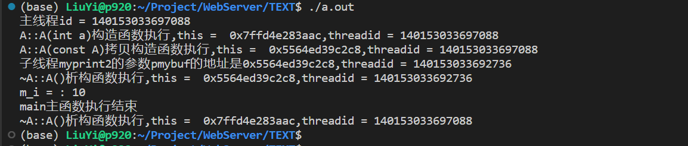

# C++新经典

## 一、C++基本语言

### 1.1  语言特性、工程特性与可移植性

略

### 1.2  命名空间简介与基本输入输出精解

#### 1.2.1  命名空间简介

在一个工程中，有两个cpp文件，两个cpp文件都有一个`my_prinf()`自定义函数，这就是同名实体(同名函数，同名变量，同名类的定义)。在编译时会报错。

为了解决上述问题，引入命名空间。

每个命名空间有自己的名字，不可以同名。

```c++
namespace   XXX{
    ...
}
```

命名空间的定义可以不连续，可以写在多个文件中。

那么如何访问某个命名空间的`my_printf()`函数？

```c++
XXX::my_printf();
XXX::mmy_printf();
//但这只能访问在同一个cpp文件下进行访问
//两个cpp文件都有XXX命名空间，包含了不同的函数，在运行时只能访问main()上方的那一个。
```

解决办法将这些命名空间放到头文件`.h`中

```cpp
namespace XXX{
	my_printf();
    mmy_printf();
}
在main()上方#include即可
```

#### 1.2.2  基本输入输出cin/cout

略

### 1.3  auto、头文件防卫、引用与常量

#### 1.3.1  局部变量及初始化

随时用到随时定义，跟C不同，不需要在开始定义。

```c++
int abc = 5;
//C++11写法：
int abc{5};
int a[]{11,12,23};
cout << a[2] << endl;//输出23

int abc = 3.5f;	//丢了0.5，被系统截断
int abc{3.5f};	//系统会报错
```


#### 1.3.2  auto

auto: 变量的自动类型推断

auto可以在声明变量的时候，根据变量初始值的类型自动为此变量选择匹配的类型。声明时要赋予初值。

auto自动类型推断发生在**编译期间**。不会造成程序效率降低。

#### 1.3.3  头文件防卫式声明

一个大型文件有很多头文件，比如

```c++
/*head1.h*/
int nnum = 5;
```

```c++
/*head2.h*/
int mmum = 6;
```

现在，把`head1.h`加到`head2.h`中

```c++
/*head2.h*/
#include "head1.h"
int mmum = 6;
```

这时执行`main()`，打印`nnum、mmum`会报错。相当于重定义`nnum`全局变量。


解决方案：

```c++
/*head1.h*/
#ifndef __HEAD1__H__
#define __HEAD1__H__
int nnum = 5;
#endif
```

```C++
/*head2.h*/
#ifndef __HEAD2__H__
#define __HEAD2__H__
#include "head1.h"
int mmum = 6;
#endif
```

#### 1.3.4  引用

为变量起了另一个名字，用符号&表示，别名和变量本身就看成是同一个变量

```c++
int val = 10;
int &reval = val;
reval = 3;	//val也为3
```

#### 1.3.5  常量

```c++
const int val = 7;/*命名常量*/
val = 15;		/*错误的*/
/*以下是修改常量*/
int &val2 = (int &)val;
val2 = 18;		/*此时的val=7*/
既然const了，就不要这么写！！！
```

c++引入新的关键字:  `constexpr`，也是一个常量的概念，编译的时候求值。

### 1.4  范围for、new内存动态分配与nullptr

#### 1.4.1  范围for语句

范围for语句：用于遍历一个序列

```c++
int v[]{12,13,14,16,18};
for(auto x:v){
    //数组v中每个元素依次放入x中并打印x值
    cout<<x<<endl;//输出12 13 14 16 18
}
for(auto x:{11,34,56,21,24,38}){
    cout<<x<<emdl;
}
```

#### 1.4.2  动态内存分配问题

C++中，一般把内存分为5个区域

- **栈**：一般函数内的局部变量都会放在这里，由编译器自动分配和回收
- **堆**：程序员`malloc/new`分配，用`free/delete`来释放。忘记释放后，系统会回收。
- 全局/静态存储区：放全局变量和静态变量`static`。程序结束时系统释放。
- 常量存储区
- 程序代码区


### 1.5  结构、权限修饰符与类简介

#### 1.5.1  结构

回顾：自定义的数据类型

```c++
struct student{
	int number;		//学号
    char name[100];	//学生名
};
int main(){
    student student1;		
    student1.number=100;
    strcpy_s(student1.name,sizeof(student1.name),"FF");
}
```


#### 1.5.2  权限修饰符

- `public`
  - 用这个修饰符修饰结构、类中的成员变量/成员函数，就可以被外界访问。
  - 一般需要能够被外界访问的东西就定义为`public`

#### 1.5.3  类简介

类也是用户自定义的数据类型

只在c++中才有这个概念

定义一个属于该类的对象，称为对象

类的定义代码一般会放在`.h`头文件中，头文件名可以跟类名相同，`XXX.h`

类的具体实现代码放在一个`.cpp`文件中

### 1.6  函数新特性、inline内联函数与const详解


### 1.7  string类型介绍

#### 1.7.1  前言

string一般处理可变长字符串

#### 1.7.2  string类型简介

string一般可看成类类型

#### 1.7.3  定义和初始化string对象

```c++
string s1;		//默认初始化为空串
string s2 = "FFF";		//将FFF字符串内容拷贝到s2代表的一段内存中。拷贝不包括末尾\0
string s3("FFF");		//与s2相同
string s4 = s2;			//将s2中的内容拷贝到s4所代表的内存中

int num = 6;
string s5(num,'a');		//输出aaaaaa
```

#### 1.7.4  string对象上的操作

```cpp
判断是否为空——empty()
返回字节或者字符数量——size()/length()
字符串的连接，返回连接后的结果——s1+s2
字符串对象赋值——s1=s2
返回一个字符串s中的内容指针。--s.c_str()
    string s1 = "abc";
	string s2 = "abC";
	const char *p = s1.c_str();
	char str[100];
	strcpy_s(str,sizeof(str),p);
	cout<<str<<endl;	//"abc"
范围for对string的使用：遍历一个序列中的每一个元素
    string s1 = "FFF";
	for(auto c : s1){
		cout << c << endl;
    }
```

### 1.8  vector类型

#### 1.8.1  vector类型简介

看成是动态数组或者集合，可以把若干对象放在里面

```c++
vector<int> vec;
```

#### 1.8.2 定义和初始化对象

```c++
vector<string> mystr;//创建一个string类型的空vector对象(容器)

元素拷贝的初始化方式
vector<string> mystr2(mystr);
vector<string> mystr3=mystr;

C++11_列表初始化方法
vector<string> mystr4 = {"aa","bb","cc"};

创建指定数量的元素
vector<int> vec2(15,200);//15个200

多种初始化方式
vector<int> i1{10};//表示一个元素，为10
vector<string> s2{10};//10个空串
vector<int> i2{10,1};//两个元素，10和1
```

#### 1.8.3  vector对象上的操作

```c++
判断是否为空--empty()
向vector中的末尾增加一个元素--push_back()
返回元素个数--size()
移除所有元素--clear()
```

### 1.9  迭代器精彩演绎，失效分析及弥补、实战

#### 1.9.1  迭代器简介

迭代器是一种遍历容器内元素的数据类型，这种数据类型类似指针。迭代器用来指向容器内的某个元素

#### 1.9.2  容器的迭代器类型

```c++
vector<int> vec = {100,200,300};
vector<int>::iterator iter;//定义迭代器
```


#### 1.9.3  迭代器`begin()`/`end()`操作，反向迭代器`rbegin()`/`rend()`操作

`begin()`/`end()`返回迭类型

```c++
vector<int> vec = {100,200,300};
vector<int>::iterator iter;//定义迭代器
iter = vec.begin();	//指向容器中第一个元素
iter = vec.end();	//指向末端元素的后面，即指向不存在的元素
for(vector<int>::iterator iter= vec.begin();iter != vec.end();iter++){
	cout << *iter << endl;
}
```


容器为空，begin()/end()返回相同的结果


从后往前遍历容器

```c++
rbegin();//指向反向迭代器的第一个元素
rend();	 //指向反向迭代器的最后元素的下一个位置
for(vector<int>::reverse_iterator riter = vec.rbegin();riter != vec.rend();riter++){
    cout << *riter <<endl;
}
```


#### 1.9.4  迭代器运算符

- *iter:  返回迭代器iter所指向元素的引用。
- ++iter、iter++:  迭代器指向容器中下一个元素
- --iter、iter--:  迭代器指向容器中的上一个元素
- iter1 == iter2:  判断两个迭代器指向的是否是同一个元素

#### 1.9.5  const_ iterator迭代器

迭代器指向的元素值不能改变，并不是迭代器本身不能改变

```cpp
vector<int>::const_iterator iter;
//C++11: cbegin(),cend()返回的是常量迭代器
vector<int> vec = {100,200,300};
for(auto iter = vec.cbegin();iter != vec.cend();iter++){
    cout << *iter << endl;
}
```

#### 1.9.6  迭代器失效

```c++
vector<int> vec = {1,2,3,4,5};
for(auto vec_item : vec){
    vec.push_back(666);//添加这一行就会引起混乱
	cout << vec_item <<endl;
}
范围for语句等价迭代器
for(auto beg = vec.begin(),end = vec.end();beg != end;beg++){
	vec.push_back(666);//添加这一行也会引起混乱or程序崩溃
    cout << *beg << endl;
}
```

在操作迭代器的过程中，千万不要改变容器的容量。

往容器中增加或删除元素，这些操作哦可能会使指向容器元素的指针、引用、迭代器部分失效。

```c++
vector<int> vec{1,2,3,4,5};
auto begin = vec.begin();
auto end = vec.end();
while(begin != end){
	cout << *begin << endl;
    //假设想往begin这个位置插入新址，可以用insert
    vec.insert(begin,80);//插入后迭代器失效
    break;//插入完毕就break出循环体
    begin++;
}


//以下是插入数据迭代器不失效
auto begein = vec.begin();
int in_count = 0;
while(begin !=vec.end()){
	//每次更新end,防止end失效
    begin = vec.insert(begin,in_count+80);
    in_count++;
    if(in_count>10){
        break;
    }
}
begin = vec.begin();
auto end = vec.end();
while(begin != end){
	cout << *begin << endl;
    begin++;
}
```

```c++
//释放部分内容  
vector<int> vec = {100,200,300};
vector<int>::iterator iter = vec.begin();
while(iter != vec.end()){
	iter = vec.erase(iter);//erase,溢出iter位置上的元素，返回下一个元素位置   
}
//vector释放
while(!vec.empty()){
    auto iter = vec.begin();
    vec.erase(iter);
}
```

#### 1.9.7  演示

```c++
struct conf{
	char itemname[40];
    char itemcontent[100];
};
char *getinfo(vector<conf *> &conflist,const char *pitem){
    for(auto pos = conflist.begin();pos != conflist.end();pos++){
        if(_stricmp((*pos)->itemname,pitem)==0){
            return (*pos)->itemcontent;
        }
    }
    return nullptr;
}
int main(){
	conf *pconf1 = new conf;
    strcpy_s(pconf1->itemname,sizeof(pconf1->itemname),"ServerName");
    strcpy_s(pconf1->itemcontent,sizeof(pconf1->itemcontent),"1区");
    
    conf *pconf2 = new conf;
    strcpy_s(pconf2->itemname,sizeof(pconf2->itemname),"ServerID");
    strcpy_s(pconf2->itemcontent,sizeof(pconf2->itemcontent),"100000");

    vector<conf *> conflist;
    conflist.push_back(pconf1);
    conflist.push_back(pconf2);
    
    char *p_tmp = getinfo(conflist,"ServerName");
    if(p_tmp != nullptr){
        cout << p_tmp << endl;
    }
    //现在释放内存
    std::vector<conf *>::iterator pos;
    for(pos = conflist.begin();pos != conflist.end();++pos){
        delete(*pos)
    }
    conflist.clear();
    return 0;
}
```

### 1.10  类型转换

#### 1.10.1  隐式类型转换

系统自动进行。

#### 1.10.2  显式类型转换(强制类型转换)

```c
int m = 5 % (int)3.2;//C语言风格的强制类型转换
```

通用格式

```c++
强制类型转换名<type>(express);
type:转换的目标类型
```

- **static_cast(静态转换)**

  - ```c++
    case1——相关类型转换
    double f = 3.1415f;
    int i = static_cast<int>(f);
    
    case2——子类转换成父类
    
    case3——void *与其他类型指针之间的转换
    //void*:  无类型指针，可以指向任何指针类型
    int i = 10;
    int *p = &i;
    void *q = static_cast<void *>(p);//int *转换为void  *
    int *qq = static_cast<int *>(q);
    ```

  - 一般不可用于指针类型之间的转换(int转double，double转int)

- **dynamic_cast**

  - 主要用于 运行时类型识别和检查。主要用来父类型和子类型之间转换用的(父类型指针指向子类型对象，然后用dynamic_cast把父类型指针往子指针类型转)

- **const_cast**

  - 去除指针或者引用的const属性 。

  - 编译时进行类型转换

  - ```c++
    const int i = 100;
    int ii = const_cast<int>(i);//错误的，i不是指针也不是引用
    const int *iii = &i;
    int *iii2 = const_cast<int *>(iii);
    ```

- **reinterpret_cast**

  - 处理无关类型的转换
  
  - 常用于以下两种转换：
    - 将一个整型(地址)转换为指针，一种类型指针转换为另一种类型指针，按照转换后的内容重新解释内存中的内容
    
    - 将一个指针类型转换为一个整型
    
    - ```c++
      int i = 10;
      int *pi = &i;
      void *pvoid = reinterpret_cast<int *>(pi);
      int *pi2 = reinterpret_cast<int *>(pvoid);
      ```


## 二、类

### 2.1  成员函数、对象复制与私有成员

#### 2.1.1  类基础

- 一个类就是一个用户自己定义的数据类型

- 一个类的构成:  成员变量、成员函数

- ```c++
  class student{
  public:
  	int number;
      char a[100];
  };
  int main{
      student someone;
      someone.number = 1000;
      student *psomeone = &someone;
      psomeone->number = 169;
  	return 0;
  }
  ```

- struct是成员默认为public的class

- class成员默认是private

#### 2.1.2  成员函数

```c++
class Time{
public:
    int Hour;
    int Minute;
    int Second;
    //成员函数
    void init_time(int thour,int tminute,int tsecond){
    	Hour = thour;
    	Minute = tminute;
    	Second = tsecond;
	}
};
int main(){
    Time mytime;
    mytime.init_time(11,4,5);
    cout << mytime.Hour << endl;
    cout << mytime.Minute << endl;
    cout << mytime.Second << endl;
    system("Pause");
    return 0;
}
```

#### 2.1.3  对象的拷贝

```c++
class Time{
public:
    int Hour;
    int Minute;
    int Second;
    //成员函数
    void init_time(int thour,int tminute,int tsecond){
    	Hour = thour;
    	Minute = tminute;
    	Second = tsecond;
	}
};
int main(){
    Time mytime;
    mytime.init_time(11,4,5);
    Time mytime2 = mytime;
    Time mytime3(mytime);
    Time mytime4{mytime};
    Time mytime5 = {mytime};
    cout << mytime.Hour << endl;
    cout << mytime.Minute << endl;
    cout << mytime.Second << endl;
    system("Pause");
    return 0;
}
```

默认情况下，这种类对象的拷贝，是每个成员变量逐个拷贝。如果在类Time中定义适当的“赋值运算符”，就能控制对象的这种拷贝行为。

### 2.2  构造函数详解、explicit与初始化列表

#### 2.2.1  构造函数

在类中，有一特殊的成员函数，其名字与类名相同，在创建类的对象的时候，这个特殊的成员函数就会被系统自动调用，这个成员函数就叫  **构造函数**。

<u>构造函数的目的就是初始化类对象的数据成员。</u>

- 构造函数没有返回值。

- 不可以手动调用构造函数
- 构造函数应该被声明为`public`

```C++
class Time{
public:
    int Hour;
    int Minute;
    int Second;

    Time();
    Time(int thour,int tminute,int tsecond);
};

Time::Time(int thour,int tminute,int tsecond){
    Hour = thour;
    Minute = tminute;
    Second = tsecond;
}

Time::Time(){
    Hour = 1;
    Minute = 2;
    Second = 3;
}

int main(){
    Time mytime = Time(11,4,5);
    Time mytime2(11,4,5);
    Time mytime3 = {1,4,5};
    Time mytime4{1,4,5};
    Time mytime5 = {1,4,5};
    
    //对象拷贝
    Time mytime2;
    //以下4个对象并没有调用构造函数(Time::Time())，调用的实际上是拷贝构造函数
    Time mytime22 = mytime2;
    Time mytime23(mytime2);
    Time mytime24{mytime2};
    Time mytime25 = {mytime2};
    system("Pause");
    return 0;
}
```

一个类中可以有多个构造函数，这样可以为类对象的创建提供多种初始化方法。

#### 2.2.2  函数默认参数

```c++
class Time{
public:
    int Hour;
    int Minute;
    int Second;

    Time();
    Time(int thour,int tminute,int tsecond = 12);	//即默认参数
};
```

- 默认值只能放在函数声明中，除非该函数没有函数声明

- 在具有多个参数的函数中指定默认值时，默认参数都必须出现在不默认参数的右边，一旦某个参数开始指定默认值，它右边所有参数都必须指定默认值

#### 2.2.3  隐式转换和explicit


#### 2.3.4  构造函数初始化列表

```c++
Time::Time(int thour,int tminute,int tsecond):Hour(thour),Minute(tminute),Second(tsecond){
    std::cout << " " << endl;
}
```


### 2.3  inline、const、mutable、this与static

#### 2.3.1  在类定义中实现成员函数inline

直接在类的定义中实现的成员函数，会被当做inline内联函数来处理。

#### 2.3.2  成员函数末尾的const

即常量成员函数。不会修改该对象里任何成员变量的值

```c++
class Time{
public:
    int Hour;
    int Minute;
    int Second;

    void add_hour(int thour) const;
};
void Time::add_hour(int thour) const{
}

int main(){
	const Time abc;
    Time bbb;
    //定义从const对象会有限制
    const成员函数，无论对象是否是const，都可以调用const成员函数
    非const成员函数只能被非const对象调用，不能被const对象调用
}
```

#### 2.3.3  **mutable**

mutable(容易改变)，突破const 

用mutable修饰一个成员变量，就表示这个成员变量永远处于可以被修改的状态，即使是在const结尾的成员函数中也可以修改。

#### 2.3.4 返回自身对象的引用，**this**

```c++
class Time{
public:
    int Hour;
    int Minute;
    int Second;

    Time();
    Time(int thour,int tminute,int tsecond);
    Time& addd_hour(int thour);
};

Time& Time::addd_hour(int thour){
    Hour += thour;//等价于this->Hour += thour;
    return *this;
}
//编译器做的
Time& Time::addd_hour(Time *const this,int thour){
    
}
int main(){
	Time my_time;//this
    my_time.addd_hour(3);
    return 0;
}
```

调用成员函数时，编译器负责把对象的地址(`my_time`)传递给这个成员函数中的一个隐藏`this`形参。

从系统角度看，任何对类成员的直接访问都被看作通过this做隐式调用的。

- this指针只能在成员函数中使用，全局函数和静态函数都不能使用this指针
- 在普通成员函数中，this是一个指向非const对象的const指针(自定义一个Time，this就是Time *const this)，表示this只能指向当前Time对象
- 在const成员函数中，this指针是指向一个const对象的const指针(自定义一个Time，this就是const Time *const this类型的指针)

#### 2.3.5  static成员

```c++
static int g_abc = 66;
void func(){
	static int abc = 5;
}
g_abc是全局静态变量，只能在本cpp文件使用
abc是局部静态变量
```

```c++
int Time::kkk = 15;

class Time{
public:
    int Hour;
    int Minute;
    int Second;
    
    static int kkk;//声明静态成员
    static void lll(int test);
    //以上两个static并没有分配内存，所以不能在这里初始化

    Time();
    Time(int thour,int tminute,int tsecond);
    Time& addd_hour(int thour);
};
int main(){
	Time mytime2;
    mytime2.Minute = 15;
    
    Time mytime3;
    mytime3.Minute = 30;
    
}
```

属于整个类的成员变量，这种成员变量就叫**static成员变量**。不属于某个对象，一旦在某个对象中修改了这个成员变量的值，在其他对象中可以直接看到修改的结果。


一般在某.cpp源文件的开头定义这个静态成员变量

### 2.4  类内初始化、默认构造函数、“=default;”和“=delete;”

#### 2.4.1  类相关非成员函数

略

#### 2.4.2  类内初始化

C++11中，可以为类内成员变量提供一个初始值，在创建对象的时候，这个初始值就可以用来初始化该成员变量。

#### 2.4.3  const成员变量的初始化

```c++
class Time{
public:
    int Hour;
    int Minute;
    int Second;

    Time();
    Time(int thour,int tminute,int tsecond);
    Time& addd_hour(int thour);
    const int test = 60;  
};
只能在构造函数的初始化列表里进行。也可以按照上面示例。 
```

#### 2.4.4  默认构造函数

没有参数的构造函数。


#### 2.4.5  =default;  =delete;

```C++
class Time{
public:
    int Hour;
    int Minute;
    int Second;

    Time();
    Time() = default;//编译器能够为=default;结尾的函数自动生成函数体
    //等价于Time(){};
    
    Time() = delete;//让程序员显式地禁用某个函数
    Time(int thour,int tminute,int tsecond);
    Time& addd_hour(int thour);
};
```


### 2.5  拷贝构造函数

默认情况下，类对象的拷贝是每个成员变量逐个拷贝

```C++
class Time{
public:
    int Hour;
    int Minute;
    int Second;
    
    Time();
    Time(int thour,int tminute,int tsecond);
    Time& addd_hour(int thour);
    
    Time(const Time& ttime);
};
int main(){
	Time mytime;//调用默认构造函数
    Time mytime2 = mytime;
    Time mytime3(mytime);
    Time mytime4{mytime};
    Time mytime5 = {mytime};
    Time mytime6;   //调用默认构造函数
    mytime6 = mytime5;
}
```

拷贝构造函数是一种**特殊的****构造函数**，函数的名称必须和类名称一致，它必须的一个参数是本类型的一个**引用变量。

- 拷贝构造函数一般不要声明成explicit
- 如果我们为类定义一个拷贝构造函数，编译器就会帮我们定义一个合成拷贝构造函数
- 如果是编译器给我们合成的拷贝构造函数，这个拷贝构造函数一般也是将参数`ttime`的成员逐个拷贝到正在创建的对象中
  - 如果成员的类型决定它如何拷贝
    - 成员变量是整型，就直接把值拷贝过来
    - 成员变量是类类型，就会调用这个类的拷贝构造函数来拷贝
- 如果自己定义了拷贝构造函数，那么就取代了系统合成的拷贝构造函数，这个时候就必须在自己的拷贝构造函数中给类成员进行赋值，以免出现类成员没有被赋值的情况

调用拷贝构造函数的情况：

- 将一个对象作为实参传递给一个非引用类型的形参
- 从一个函数中返回一个对象的时候
- ........


### 2.6  重载运算符、拷贝赋值运算符与析构函数

#### 2.6.1  重载运算符

```c++
Time mytime1;
Time mytime2;
if(mytime1 == mytime2){
	...
}
```

两个对象之间可以进行`==`比较。需要重载`==`运算符

```c++
Box operator==(const Box&);
```

#### 2.6.2  拷贝赋值运算符

```c++
Time mytime;
Time mytime2 = mytime;//调用拷贝构造函数

Time mytime3;//调用构造函数
mytime3 = mytime2;	//这是赋值，既没调用构造函数，也没调用拷贝构造函数，系统会调用一个拷贝赋值运算符
```

如果自己不重载赋值运算符，编译器也会生成一个。

编译器生成的赋值运算符比较粗糙。一般就是将非static成员赋值给赋值运算符左侧的对象的对应成员。

为了精确控制`Time`类的赋值操作，往往会自己重载赋值运算符。

```c++
Time& Time::operator=(const Time& ttime){
    //形参ttime是mytime2
    Hour = ttime.Hour;
    Minute = ttime.Minute;
    Second = ttime.Second;
    
    return *this;//mytime3
}
```

#### 2.6.3 析构函数

对象在销毁的时候会自动调用析构函数

如果自己不写析构函数，编译器会生成一个默认的析构函数。默认析构函数的函数体为空。

析构函数没有返回值，不接受任何参数，不能被重载。对于一个类，只有一个析构函数  

```c++
class Time{
public:
    int Hour;
    int Minute;
    int Second;
    
    Time();
    Time(int thour,int tminute,int tsecond);
    Time& addd_hour(int thour);
  	~Time();
    
    Time(const Time& ttime);
};
Time::~Time(){}
```


### 2.7  子类、调用顺序、访问等级与函数遮蔽

### 2.7.1  派生类

略

### 2.7.2  派生类对象定义时调用构造函数的顺序

```C++
class Human{
public:
    int m_age;
    char m_name[100];

    Human();
    explicit Human(int);
};

class Man : public Human{
public:
    Man();
};
int main()P{
	Man men;
}
```

当定义子类对象时，要调用父类和子类的构造函数。先执行父类的构造函数，再执行子类的构造函数

### 2.7.3  public, protected, private

三种访问权限

- public--可以被任意实体所访问
- protected--只允许本类或者子类的成员函数访问
- privated--只允许本类的成员函数访问

| 基类的访问权限 | 子类继承的方式 | 子类得到的访问权限 |
| -------------- | -------------- | ------------------ |
| public         | public         | public             |
| protected      | public         | protected          |
| private        | public         | 子类无权访问       |
|                |                |                    |
| public         | protected      | protected          |
| protected      | protected      | protected          |
| private        | protected      | 子类无权访问       |
|                |                |                    |
| public         | private        | private            |
| protected      | private        | private            |
| private        | private        | 子类无权访问       |

- 子类public继承父类不改变父类的访问权限
- protected继承将父类中的public成员变为子类的protected成员
- private继承使得父类所有成员在子类中的访问权限变为private
- 父类的private成员不受继承方式影响，子类永远无权访问

### 2.7.4  函数遮蔽

子类中有一个同名函数，那么父类中不管有几个同名函数，子类中都无法访问到

如果想调用父类中的同名函数？

- 在子类的成员函数中，使用"`父类::`"强制调用
- 使用`using`关键字，使父类的同名函数在子类中可见

### 2.8  父类指针、虚/纯虚函数、多态性与析构函数

#### 2.8.1  基类指针、派生类指针

```c++
class Human{
public:
    int m_age;
    char m_name[100];

    Human();
    explicit Human(int);
    void func(){};
};

class Man : public Human{
public:
    Man();
    void funcc(){};
};
int main(){
    Human *phuman = new Men;
    //父类指针可以new一个子类对象
    //反之不行
    phuman->func();
    phuman->funcc();//错误，父类指针，无法调用子类成员函数
}
```

既然父类指针没有办法调用子类的成员函数，那为什么还让父类指针new一个子类对象呢？

#### 2.8.2  虚函数

```c++
class Human{
public:
    int m_age;
    char m_name[100];

    Human();
    explicit Human(int);

     void eat(){
        cout<<"人类吃饭"<<endl;
    };
};

class Man : public Human{
public:
    Man();
    void eat(){
        cout<<"男人吃饭"<<endl;
    };
};

class Woman : public Human{
  	Woman();
    void eat(){
        cout<<"女人吃饭"<<endl;
    };  
};
int main(){
    Human *phuman = new Man;
    phuman->eat();
    //输出人类吃饭
    system("Pause");
    return 0;
}
```

有没有一种方法，仅定义一个对象指针，就能够调用父类以及子类的同名函数？

- 有，而且其类型必须是父类类型
- 其次，在父类中，函数声明之前要加`virtual`来声明成虚函数

一旦某个函数(在基类)被声明成虚函数，那么所有派生类中它都是虚函数

```c++
class Human{
public:
    int m_age;
    char m_name[100];

    Human();
    explicit Human(int);

    virtual void eat(){
        cout<<"人类吃饭"<<endl;
    };
};
class Man : public Human{
public:
    Man();
    void eat(){
        cout<<"男人吃饭"<<endl;
    };
};
class Woman : public Human{
public:
  	Woman();
    void eat(){
        cout<<"女人吃饭"<<endl;
    };  
};
int main(){
    Human *phuman = new Human;
    phuman->eat();	//调用Human类的eat函数
    delete phuman;
    Human *pphuman = new Man;
    pphuman->eat();//调用Man类的eat函数
    delete pphuman;
    Human *thuman = new Woman;
    thuman->eat();	//调用Woman类的eat函数
    delete thuman;
    system("Pause");
    return 0;
}
```


##### a.override

```c++
class Human{
public:
    int m_age;
    char m_name[100];

    Human();
    explicit Human(int);

    virtual void eat(){
        cout<<"人类吃饭"<<endl;
    };
};
class Man : public Human{
public:
    Man();
    void eat() override{
        cout<<"男人吃饭"<<endl;
    };
};
```

override就是用来说明派生类中的虚函数，覆盖了基类中的同名函数

只有虚函数才存在子类可以覆盖基类同名函数的问题

#####  b.final

虚函数专用，用在父类。如果在父类的虚函数中加了final，那么任何尝试覆盖该函数的操作都将引发错误

调用虚函数执行的是**动态绑定**。在程序运行时才知道调用了哪个子类的eat函数

#### 2.8.3  多态性

体现在具有继承关系的基类和子类之间。子类重写定义父类的成员函数eat()，同时父类把eat函数声明成了virtual虚函数。通过父类指针，只有到了程序运行时期，找到动态绑定到父类指针上的对象。然后系统内部查一个虚函数表，找到函数eat的入口地址，从而调用基类或者子类的eat函数，这就是运行时期的多态性。

#### 2.8.4  纯虚函数

在基类中声明的虚函数，它在基类中没有定义，但是要求任何派生类都要定义该虚函数自己的实现方法 。

一旦一个类中有纯虚函数了，那就不能生成这个类的对象，这个类就成了**抽象类**。

抽象类主要用于当做基类生成子类。子类中必须要实现基类中定义的纯虚函数。

```c++
class Human{
public:
    int m_age;
    char m_name[100];

    Human();
    explicit Human(int);

    virtual void eat() = 0;
	//纯虚函数
};
```

#### 2.8.5  虚析构函数

```c++
class Human{
public:
    int m_age;
    char m_name[100];
    Human();
    explicit Human(int);
    virtual void eat() = 0;
    ~Human();
};
class Man : public Human{
public:
    Man();
    void eat(){
        cout<<"男人吃饭"<<endl;
    };
    ~Man();
};
class Woman : public Human{
public:
  	Woman();
    void eat(){
        cout<<"女人吃饭"<<endl;
    };  
    ~Woman();
};
int main(){
	Man man;
    //1.调用父类构造函数
	//2.调用子类构造函数
    //3.调用子类析构函数
    //4.调用父类析构函数
    
    Man *pmen = new Man;
    //同上
    Human *phuamn = new Man;
    //没有调用子类的析构函数
}        
```

用基类指针new子类的对象，在delete时，系统不会调用派生类的析构函数，如何解决？

将基类析构函数写成虚函数

### 2.9  友元函数、友元类与友元成员函数

#### 2.9.1  友元函数

略

#### 2.9.2  友元类

友元关系不能被继承

友元关系是单向的

友元关系没有传递性

#### 2.9.3  友元成员函数

### 2.10  RTTI、dynamic_cast、typeid、type-info与虚函数表

#### 2.10.1  RTTI是什么

RTTI(Run Time Type Indentification):  运行时类型识别

通过运行时类型识别，程序能够使用基类的指针或者引用来检查这些指针或者引用所指的对象的实际派生列表。

这种功能是通过两个运算符实现

- dynamic_cast运算符———能够将基类的指针或引用安全地转换为派生类的指针或引用
- typeid运算符————返回指针或者引用所指对象的实际类型

只有虚函数的存在，这两个运算符才会使用指针或引用所绑定的对象的动态类型。

#### 2.10.2  dynamic_cast运算符

```c++
Human *phuman = new Man;
//转换成Woman类型就会失败
Man *pmen = dynamic_cast<Man *>(phuman);
if(pmen!=nullptr){
	cout << endl;
}
对于引用，如果用dynamic_cast转换失败，系统会抛出一个std::bad_cast异常
```

#### 2.10.3  typeid运算符

拿到对象类型信息。typeid返回一个常量对象的引用。这个常量对象是一个标准库类型type_info(类/类类型)

```c++
Human *phuman = new Man;
Human &q = *phuman;
cout<<typeid(*phuman).name()<<endl;//class Man
cout<<typeid(q).name()<<endl;		//class Man
```

typeid主要是为了比较两个指针是否指向同一类型的对象

比较对象时，看得是new出来的是哪个对象或者说该指针指向的是哪个对象，和定义该指针时定义的类型没有关系。

```c++
Human *phuman = new Man;
Man *phuman2 = new Man;
Human *phuman3 = phuman2;
if(typeid(*phuman)==typeid(*phuman2)){
    cout<<"122"<<endl;
}
if(typeid(*phuman2)==typeid(*phuman3)){
    cout<<"123"<<endl;
}
//输出
//122
//123
```

只有当基类有虚函数时，编译器才会对typeid()中的表达式求值。如果某个类型不含运虚函数，typeid()返回的是表达式的静态类型(定义时的类型)。

#### 2.10.4  type_info类

##### a.name  返回一个C风格字符串

```c++
Human *phuman = new Man;
const type_info& tp = typeid(*phuman);
cout<<tp.name()<<endl;
//输出
//Man
```

##### b.==, !=

#### 2.10.5  RTTI与虚函数表

 如果类中含有虚函数，编译器就会对该类产生一个虚函数表

虚函数表里有许多项，每一项都是一个指针，每个指针指向的是这个类里的各个虚函数的入口地址。

虚函数表项里，第一个表项很特殊，它指向的不是虚函数入口地址，它指向的是类所关联的`type_info`对象

```c++
Human *phuman = new Man;
const type_info& tp = typeid(*phuman);
```

phuman对象里有一个看不见的指针，这个指针指向的是：这个对象所在类Man里的虚函数

### 2.11  基类与派生类关系的详细再探讨

#### 2.11.1  派生类对象模型简述

一个子类对象包含两部分：

- 派生类自己定义的成员变量、成员函数
- 派生类所继承的基类中的成员函数、成员变量

基类指针可以new派生类对象，是因为派生类对象含有基类部分，可以把派生类对象当做基类对象用。这么做的话，有些需要基类引用的地方就可以用派生类对象的引用来代替。

#### 2.11.2  派生类构造函数

```c++
class A{
public:
    A(int i):m_val(i){};
    
private:
    int m_val;
};
class B : A{
public:
    B(int i,int j,int k):A(i),m_valb(k){};//通过子类的初始化列表给父类的构造函数传递参数

private:
    int m_valb;
};
```

#### 2.11.3  既当父类又当子类

略

#### 2.11.4  不想当基类的类

`class A final{};`  final写在类名后面，则有这个关键字的类就不能做基类了

#### 2.11.5  静态类型与动态类型

```c++
Human *phuman = new Man;//基类指针指向一个派生类对象
Human &q = *phuman;//基类引用绑定到派生类对象上
```

- 静态类型：变量声明时候的类型。静态类型编译的时候是已知的
- 动态类型：指针/引用所代表内存中的对象的类型。这里是`Man`类型

动态类型和静态类型这俩概念，只有基类/指针引用才存在静态类型动态类型不一致的情况

如果不会基类指针/引用，静态类型和动态类型永远都是一致的

#### 2.11.6  派生类向基类的隐式类型转换

```c++
Human *phuman = new Man();
Human &q = *phuman;
```

- 编译器隐式地执行了派生类到基类的转换
- 转换之所以成功，是因为每个派生类对象都包含一个基类对象部分，所以基类的引用或者指针可以绑到基类对象部分
- 并不存在从基类到派生类的自动类型转换

```c++
Man *pman = new Human;//错误的
```

派生类引用不能绑到基类对象上。

派生类指针不能指向基类地址。

#### 2.11.7  父类子类之间的拷贝与赋值

```c++
Man man;    //派生类对象
Human human(man);   //用派生类对象来定义并初始化基类对象，这会调用基类的拷贝构造函数 
```

```c++
Man man;
Human human;
human = man;	//调用赋值运算符
```

用派生类对象为一个基类对象初始化或者赋值时，只有该派生类对象的基类部分会被拷贝或者赋值，派生类部分会被抛弃。

### 2.12  左值、右值、左值引用、右值引用与move

#### 2.12.1  左值和右值

*左值 (lvalue, locator value)* 表示了一个占据内存中某个可识别的位置（也就是一个地址）的对象。

一个表达式不是 *左值* 就是 *右值* 。 那么，右值是一个 *不* 表示内存中某个可识别位置的对象的表达式。

用到左值的运算符:

- 赋值运算符=
- 取地址&
- string, vector下标[]都需要左值
- 一个运算符能否在字面值上进行操作，就能判断运算符是否用到左值

#### 2.12.2  引用分类

左值引用、const引用、右值引用

#### 2.12.3  左值引用

绑定到左值上。

指针有空指针，引用没有空引用。

```c++
int &c = 1;//错误。左值引用不能绑定到右值。
const int &c = 1;//const引用可以绑定到右值，以下是细节
{
    int temp = 1;//临时变量
    const int &c = temp;
}
```

#### 2.12.4  右值引用

`&&`希望用右值引用来绑定以下即将销毁或者是一些临时对象

```c++
int &&reval = 3;
reval = 5;
```

能绑定到左值上的引用，一般都不能绑定到右值。

右值引用的目的：

- 提高程序运行效率。把拷贝对象变成移动对象来提高程序运行效率

#### 2.12.5  std::move函数

把一个左值强制转换成一个右值

```c++
int i = 10;
int &&rri = i;//错误的
int &&ri = std::move(i);//正确的


string st = "FFF";
string def = std::move(st);
//string里的移动构造函数把st的内容转移到def中去。
//这俩行代码并没有节省成本，系统仍然重新开辟了内存
```

### 2.13  临时对象深入探讨、解析与提高性能手段

#### 2.13.1  临时对象的概念

临时对象是 在源码中**不可见**的，是**栈**上的、没有名字的对象。与函数内定义的临时对象有根本差别。

#### 2.13.2  产生临时对象的情况与解决

##### a.以传值的方式给函数传递参数

```c++
class Temp{
public:
    int val1;
    int val2;

    Temp();
    Temp(int v1 = 0,int v2 = 0);
    Temp(const Temp& t):val1(t.val1),val2(t.val2){
        cout<<"调用了拷贝构造函数"<<endl;
    }
    virtual ~Temp(){
        cout<<"调用了析构"<<endl;
    }
    int Add(Temp tes);
};

Temp::Temp(int v1,int v2):val1(v1),val2(v2){
    cout<<"调用了构造函数"<<endl;
    cout<<"val1="<<val1<<endl;
    cout<<"val2="<<val2<<endl;
}
int Temp::Add(Temp tes){
    int temp = tes.val1+tes.val2;
    tes.val1 = 1000;
    return temp;
}
int main(){
    Temp tm(10,20); //调用构造函数
    int sum = tm.Add(tm);   //调用拷贝构造函数
    cout << "Sum = "<< sum << endl;
    cout << "tm.val1 = " << tm.val1 << endl;
    system("Pause");
    return 0;
}
```


 为什么会调用拷贝构造函数？

- `tm.Add(tm)`将对象tm传递给Add，而Add函数用tes来接入

##### b.类型转换生成的临时对象/隐式类型转换以保证函数调用成功

```c++
class Temp{
public:
    int val1;
    int val2;

    Temp();
    Temp(int v1 = 0,int v2 = 0);
    Temp(const Temp& t):val1(t.val1),val2(t.val2){
        cout<<"调用了拷贝构造函数"<<endl;
    }
    
    //拷贝赋值运算符
   	Temp& operator=(const Temp &ttt){
        val1 = ttt.val1;
        val2 = ttt.val2;
        cout << "调用了拷贝赋值运算符" << endl;
        return *this;
    }
    virtual ~Temp(){
        cout<<"调用了析构"<<endl;
    }
    int Add(Temp tes);
};

Temp::Temp(int v1,int v2):val1(v1),val2(v2){
    cout<<"调用了构造函数"<<endl;
    cout<<"val1="<<val1<<endl;
    cout<<"val2="<<val2<<endl;
}
int Temp::Add(Temp tes){
    int temp = tes.val1+tes.val2;
    tes.val1 = 1000;
    return temp;
}
int main(){
    Temp tttm;
    tttm = 1000;//这里生成了一个真正的临时对象
    //用1000这个数字创建了一个类型为Temp的临时对象
    //调用拷贝赋值运算符把这个临时对象里边的各个成员值赋给了sum对象
    //销毁这个临时创建的Temp对象
    return 0;
}
```


优化一下

`Temp tttm = 1000;`把定义对象与给对象初值放在一行


##### c.函数返回对象的时候 

```c++
class Temp{
public:
    int val1;
    int val2;
    Temp();
    Temp(int v1 = 0,int v2 = 0);
    Temp(const Temp& t):val1(t.val1),val2(t.val2){
        cout<<"调用了拷贝构造函数"<<endl;
    }
    
    //拷贝赋值运算符
   	Temp& operator=(const Temp &ttt){
        val1 = ttt.val1;
        val2 = ttt.val2;
        cout << "调用了拷贝赋值运算符" << endl;
        return *this;
    }
    virtual ~Temp(){
        cout<<"调用了析构"<<endl;
    }
    int Add(Temp tes);
};
Temp _double(Temp & dk){
    Temp skt;
    skt.val1 = dk.val1*2;
    skt.val2 = dk.val2*2;
    return skt;
    
    //优化空间
    //函数体写成下面一行，可以节省一个拷贝构造函数和一个析构函数
    return Temp(dk.val1*2,dk.val2*2);
}
Temp::Temp(int v1,int v2):val1(v1),val2(v2){
    cout<<"调用了构造函数"<<endl;
    cout<<"val1="<<val1<<endl;
    cout<<"val2="<<val2<<endl;
}
int Temp::Add(Temp tes){
    int temp = tes.val1+tes.val2;
    tes.val1 = 1000;
    return temp;
}
int main(){
    Temp sktt(10,20);
    _double(sktt);//返回临时对象占用了一个拷贝构造函数和一个析构函数
    //输出如下图 
    
    //以下两种写法会少占用一个析构函数
    Temp tes3 = _double(sktt);
    Temp &&tes33 = _double(sktt);
    system("Pause");
    return 0;
}
```


### 2.14  对象移动、移动构造函数与移动赋值运算符

#### 2.14.1  对象移动

把动态内存内容的管理权限进行交接，从外部看，仿佛内存内容**从一个对象中移动到了另一个对象中**，没有拷贝出一份新的内存内容。

#### 2.14.2  移动构造函数和移动赋值运算符

拷贝构造函数：

`Time::Time(const Time &ttime){...}`

移动构造函数：

`Time::Time(const Time &&ttime){...}`

移动构造函数和移动赋值运算符应该完成的事情：

- 完成必要的内存移动，斩断原对象与内存的联系
- 确保移动后原对象处于一种“即便被销毁也没有什么问题”的一种状态

```c++
class B{
public:
    B():m_bm(100){
        cout<<"执行了构造函数"<<endl;
    }
    B(const B& tmp):m_bm(tmp.m_bm){
        cout<<"执行了拷贝构造函数"<<endl;
    }
    virtual ~B(){
        cout<<"执行了析构函数"<<endl;
    }

    int m_bm;
};
```


#### 2.14.3  移动构造函数示例

```C++
class B{
public:
    B():m_bm(100){
        cout<<"执行了B构造函数"<<endl;
    }
    B(const B& tmp):m_bm(tmp.m_bm){
        cout<<"执行了B拷贝构造函数"<<endl;
    }
    virtual ~B(){
        cout<<"执行了B析构函数"<<endl;
    }

    int m_bm;
};

class A{
public:
    A():m_pb(new B()){
        cout << "调用了A的构造函数" << endl;
    }

    A(const A&temp):m_pb(new B(*(temp.m_pb))){
        cout << "调用了A的拷贝构造函数" << endl;
    }

	A(A&& TTEMP):m_pb(TTEMP.m_pb){
        TTEMP.m_pb=nullptr;
        cout << "调用了A的移动构造函数" << endl; 
    } 
    virtual ~A(){
        delete m_pb;
        cout << "调用了A的析构函数" << endl;
    }

private:
    B *m_pb;
};
static A getA(){
    A a;
    return a;
}
int main(){
    A a = getA();
    return 0;
}
```


#### 2.14.4  移动赋值运算符示例

```c++
//拷贝符合运算符
A& operator=(const A&src){
    if(this == &src){
        return *this;
    }
    delete m_pb;
    m_pb = new B(*(src.m_pb));
    cout << "调用了类A的拷贝赋值运算符" << endl;
    return *this;
}
//移动赋值运算符
A &operator=(A && src){
	if(this == &src){
		return *this;
    }
    delete m_pb;
    m_pb = src.m_pb;
    cout << "调用了A的移动赋值运算符" << endl;
    return *this;
}
```


#### 2.14.5  合成的移动操作

- 如果一个类定义了自己的拷贝构造函数、拷贝赋值运算符或者析构函数，编译器就不会合成移动构造函数和移动赋值运算符。
- 如果类A没有提供移动构造函数和移动赋值运算符，那么调用类A中移动构造函数和移动赋值运算符的代码会去调用类A的拷贝构造函数和拷贝赋值运算符
- 只有一个类没定义任何自己版本的拷贝构造函数、拷贝赋值运算符、析构函数，且每个非静态成员都可以移动时，编译器才会为该类合成移动构造函数或者移动赋值运算符


### 2.15  继承的构造函数、多重继承、类型转换与虚继承

#### 2.15.1  继承的构造函数

如果基类含有多个构造函数，则多数情况下，派生类会继承所有构造函数，以下情况除外：

- 派生类中定义的构造函数与基类构造函数有相同的参数列表
- 默认、拷贝、移动构造函数不会被继承

#### 2.15.2  多重继承

##### a.多重继承概述

```c++
class Grand{
public:
    Grand(int i):m_val(i){}

    virtual ~Grand(){}

    void myinfo(){
        cout << m_val << endl;
    }
    int m_val;
};
class A:public Grand{
public:
    A(int i):Grand(i),m_Aval(i){

    }
    virtual ~A(){}
    void myinfo(){
        cout << m_Aval << endl; 
    }
    int m_Aval;
};
class B{
public:
    B(int i):m_Bval(i){

    }
    virtual ~B(){}
    void myinfo(){
        cout << m_Bval << endl; 
    }
    int m_Bval;
};
class C : public A, public B{
public:
    C(int i, int j, int k):A(i),B(j),m_Cval(k){

    }
    int m_Cval;
    virtual ~C(){
    }
    void myinfo(){
        cout << m_Cval << endl;
    }
};
int main(){
    C tst(10,20,30);
    tst.myinfo();
    //tst.myinfo()要增加作用域，告诉系统调用的是类A还是类B的成员函数
    tst.A::myinfo();
    system("Pause");
    return 0;
}
```


静态成员属于类，不属于对象。

##### b.派生类构造函数与析构函数

```c++
class Grand{
public:
    Grand(int i):m_val(i){
        cout << "Grand构造函数执行" << endl;
    }

    virtual ~Grand(){
        cout << "Grand析构函数执行" << endl;
    }

    void myinfo(){
        cout << m_val << endl;
    }
    int m_val;
};
class A:public Grand{
public:
    A(int i):Grand(i),m_Aval(i){
        cout << "类A构造函数执行" << endl;
    }
    virtual ~A(){
        cout << "类A析构函数执行" << endl;
    }
    void myinfo(){
        cout << m_Aval << endl; 
    }
    int m_Aval;
};
class B{
public:
    B(int i):m_Bval(i){
        cout << "类B构造函数执行" << endl;
    }
    virtual ~B(){
        cout << "类B析构函数执行" << endl;
    }
    void myinfo(){
        cout << m_Bval << endl; 
    }
    int m_Bval;
};
class C : public A, public B{
public:
    C(int i, int j, int k):A(i),B(j),m_Cval(k){
        cout << "类C构造函数执行" << endl;
    }
    int m_Cval;
    virtual ~C(){
        cout << "类C析构函数执行" << endl;
    }
    void myinfo(){
        cout << m_Cval << endl;
    }
};
int main(){  
    C tst(10,20,30);
    system("Pause");
    return 0;
}
```


- 构造一个派生类对象将同时构造并初始化所有的基类对象
- 派生类的构造函数初始化列表只初始化它的直接基类。每个类的构造函数都负责初始化它的直接基类，就会让所有类都得到初始化
- 派生类构造函数初始化列表将实参分别传递给每个基类；基类的构造顺序跟派生列表中基类的出现顺序保持一致。

##### c.从多个父类继承构造函数

如果一个类从它的基类中继承了系相同的构造函数，这个类必须为该构造函数定义自己的版本。

#### 2.15.3  类型转换

基类指针可以指向一个派生类对象，编译器帮助隐式执行这种派生类到基类的转换。转换成功的原因是因为每个派生类对象都包含一个基类对象子部分，所以基类的引用或指针可以绑定到基类对象这一部分。

#### 2.15.4  虚基类，虚继承

略

### 2.16  类型转换构造函数、运算符与类成员指针

#### 2.16.1  类型转换构造函数

将其他的数据类型转换成该类类型的对象。

- 只有一个参数，该函数又不是本类的const引用。该参数是待转换的数据类型。
- 在类型转换构造函数中，要指定转换的方法

```c++
class TestInt{
public:
    TestInt(int x = 0) : m_i(x){
        //类型转换构造函数，可以将一个int数字转换成类类型TestInt
        if(m_i < 0) m_i = 0;
        if(m_i > 100) m_i = 100;
    }
    int m_i;
};
int main(){
    TestInt int_1 = 11;	//隐式类型转换，将数字11转换成TestInt对象(调用了类型转换构造函数)
    //编译器用11这个数字通过调用TestInt类的类型构造函数来创建一个临时TestInt对象，并把这个对象构造到int_1这个预留空间里去
    TestInt int_2(22);	//调用了类型转换构造函数，但没有进行隐式类型转换
    system("Pause");
    return 0;
}
```

不想进行隐式类型转换可以添加explicit关键字

```c++
explicit TestInt(int x = 0):m_i(x){}
```

#### 2.16.2  类型转换运算符(类型转换函数)


#### 2.16.3  类型转换的二义性


#### 2.16.4 类成员函数指针

##### a.对于普通成员函数


##### b.对于虚函数


##### c.对于静态成员函数

#### 2.16.5  类成员变量指针

##### a.对于普通成员变量


##### b.对于静态成员变量


## 三、模板与泛型

### 3.1  模板概念与函数模板的定义、调用

#### 3.1.1  函数模板的定义

```c++
int ADD(int i1,int i2){
    int add = i1 + i2;
    return add;
}
double ADD(double i1,double i2){
    double add = i1 + i2;
    return add;
}
template<typename T>
T add(T a,T b){
    T _add = a + b;
    return _add;
}
```

#### 3.1.2  函数模板的使用

```c++
int he = add(3,1);
double hh = add(3.0,1.0);
```

#### 3.1.3  非类型模板参数

`template<typename T>`，T代表一个类型，是一个类型参数。

在模板参数列表里面还可以定义非类型参数。

非类型参数代表的是一个值。

```c++
template<int a,int b>
int add(){
    int _add = a + b;
    return _add;
}
int aaa = add<3,1>();//显式指定模板参数
cout << aaa << endl;
//输出 4

int a = 12;
int res = add<a,13>();//报错
//非类型模板参数值必须是在编译时就能确定
```


### 3.2  类模板概念与类模板的定义、使用

#### 3.2.1  类模板定义

```c++
template<typename T>
class myvector{
public:
    typedef T* myiterator;
    myvector(){}    //构造函数
    myvector& operator=(const myvector&){}//赋值运算符重载
    myiterator mybegin(){}
    myiterator myend(){}
};
int main(){
    myvector<int> tvec;
    myvector<double> tvec2;
    myvector<string> tvec3;
    system("Pause");
    return 0;
}
```

myvector指示类模板名，类模板是用来实例化类型的

`myvector<int>`才是类型名

#### 3.2.2  类模板的成员函数

```c++
template<typename T>
class myvector{
public:
    typedef T* myiterator;

    myvector();   //构造函数
    myvector& operator=(const myvector&){}//赋值运算符重载

    myiterator mybegin(){}
    myiterator myend(){}

    void myfunc();
};
template<typename T>
void myvector<T>::myfunc(){
    cout << " " << endl;
}
template<typename T>
myvector<T>::myvector(){
    cout << " " << endl;
}
template<typename T>
myvector<T>& myvector<T>::operator=(const myvector&){
    //返回的是一个实例化的myvector
    return *this
}
template<typename T>
typename myvector<T>::myiterator myvector<T>::mybegin(){
    cout << " " << endl;
}
int main(){
    myvector<int> tvec;
    myvector<double> tvec2;
    myvector<string> tvec3;
    system("Pause");
    return 0;
}
```

#### 3.2.3  模板名字的使用

略

#### 3.2.4  非类型模板参数

```c++
template<typename T,int size = 10>
class myarray{
public:
    void myfunc();
    T arr[size];
};
template<typename T,int size>
void myarray<T,size>::myfunc(){
    cout << size << endl;
}
myarray<int,100> temarr;
myarray<int> temarr2;
temarr.myfunc();
temarr2.myfunc();
//输出100 10
```


### 3.3  使用typename的场合、函数模板、默认模板参数

#### 3.3.1  typename的场合

- 在模板定义里面，表明其后的模板参数是类型参数
- 使用类的类型成员，用typename来标识是一个类型

#### 3.3.2  函数指针做其他函数的参数


#### 3.3.3  函数模板举例

#### 3.3.4  默认模板参数


### 3.4  成员函数模板，模板显式实例化与声明


### 3.5  using定义模板别名与显式指定模板参数


### 3.6  模板全特化与偏特化（局部特化）


### 3.7  可变参模板与模板模板参数


## 四、智能指针

### 4.1  直接内存管理(new/delete)、创建新工程与观察内存泄漏

```c++
int* point = new int;
+		point	0x01129840 {-842150451}	int *
//初值未定义
int* point = new int(100);
string *mystr = new string;
//空字符串，说明系统调用了string的默认构造函数
string *mystr = new string(5,'a');
```


### 4.2  new/delete探秘、智能指针总述与shared_ptr基础

#### 4.2.1  new/delete探秘

```c++
class A {
public:
    A() {
        cout << "执行A的构造函数" << endl;
    }
    ~A() {
        cout << "执行A的析构函数" << endl;
    }
};
int main()
{   
    A *a = new A();
    delete a;
    system("Pause");
    return 0;
}
```


```c++
class B{
};
int main()
{   
    B b;
    int length = sizeof(b);
    cout << "空类的大小为: " << length << endl;  
    system("Pause");
    return 0;
}
```


```c++
class A {
public:
    A() {
        cout << "执行A的构造函数" << endl;
    }
    ~A() {
        cout << "执行A的析构函数" << endl;
    }
};
```


#### 4.2.2  智能指针概述


#### 4.2.3  shared_ptr概述

shared_ptr是共享式指针，使用引用计数，每一个shared_ptr的复制都指向相同的对象（内存），只有最后一个指向该对象的shared_ptr指针不需要再指向该对象时，这个shared_ptr才会去析构所指向的对象（释放内存）。

### 4.3  shared_ptr常用操作、计数与自定义删除器等

#### 4.3.1  shared_ptr引用计数的增加和减少

每个shared_ptr都会记录有多少个其他shared_ptr指向相同的对象


```c++
auto p6 = std::make_shared<int>(100);	//目前p6所指的对象只有一个引用者
auto p7(p6);	//p7和p6指向相同的对象，此对象有两个引用者
```

每个shared_ptr都关联着一个引用计数，当在下述几种情况下，所有指向这个对象的shared_ptr引用计数都会增加1。

- 像上面的代码这样，用p6来初始化p7智能指针，就会导致所有指向该对象（内存）的shared_ptr引用计数全部增加1。

- 把智能指针当成实参往函数里传递。

  ```c++
  void myfunc(shared_ptr<int> ptmp){
      //传递引用作为形参进来，引用计数不会增加
      return;
  }
  myfunc(p7);//函数执行完毕后，指针的引用计数会恢复
  ```

- 作为函数的返回值

  ```c++
  shared_ptr<int> mmfunc(shared_ptr<int> ttptr){
      return ttptr;
  }
  auto p8 = mmfunc(p7);
  //有p8接收myfunc函数返回值，此时引用计数会+1
  ```

以上是引用计数的增加，接下来是引用计数的减少

- 给shared_ptr赋一个新值，让该shared_ptr指向一个新对象。

  ```c++
  p8 = make_shared<int>(200);引用计数为2
  p7 = make_shared<int>(200);p7指向新对象，计数-1
  p6 = make_shared<int>(200);同样计数-1
  ```

- 局部的shared_ptr离开其作用域。

  ```c++
  auto p6 = std::make_shared<int>(100);//计数为1
  auto p7(p6);//计数为2
  myfunc(p7);//进入myfunc计数为3，从myfunc返回时计数为2
  ```

- 当一个shared_ptr引用计数变为0，它会自动释放自己所管理的对象

  ```c++
  auto p9 = make_shared<int>(300);
  auto p10 = make_shared<int>(300);
  p9 = p10;//给p9赋值指向p10所指向的对象，对象引用计数为2，而原先p9指向的对象计数会变为0，会被自动释放
  ```

#### 4.3.2  shared_ptr指针常用操作

##### a. use_count成员函数

用于返回多少个智能指针指向某个对象。

```c++
shared_ptr<int> mmyp(new int(100));
int icount = mmyp.use_count();
cout << icount << endl;
shared_ptr<int> mmyp2(mmyp);
icount = mmyp.use_count();
cout << icount << endl;   
shared_ptr<int> mmyp3;
mmyp3 = mmyp2;
icount = mmyp.use_count();
cout << icount << endl;
icount = mmyp3.use_count();
cout << icount << endl;
```


##### b. unique成员函数

是否该智能指针独占某个指向的对象，也就是若只有一个智能指针指向某个对象，则unique返回true，否则返回false：

```c++
int main(){   
    shared_ptr<int> myp(new int(100));
    if(myp.unique()){
        cout << "myq unique ok" << endl;
    }
    shared_ptr<int> myq2(myp);
    if(myp.unique()){
        cout << "myq unique ook" << endl;
    }
    system("Pause");
    return 0;
}
```


##### c. reset成员函数

reset() 释放并销毁原生指针。如果参数为一个新指针，将管理这个新指针

- 当reset不带参数时

  - 若pi是若pi是唯一指向该对象的指针，则释放pi指向的对象，将pi置空

  - 若pi不是唯一指向该对象的指针，则不释放pi指向的对象，但指向该对象引用计数会减1，同时将pi置空。

  - ```c++
    int main(){   
        shared_ptr<int> pi(new int(100));
        pi.reset(); //释放pi所指向的对象，将pi置空
        if(pi == nullptr){
            cout << "pi is null" << endl;
        }
    
        shared_ptr<int> pi2(new int(200));
        auto pi3(pi2);  //pi2引用计数为2
        pi.reset();     //pi被置空，pi2引用计数变为1
        system("Pause");
        return 0;
    }
    ```

- 当reset带参数（一般是一个new出来的指针）时。

  - 若pi是唯一指向该对象的指针，则释放pi指向的对象，让pi指向新内存。

  - 若pi不是唯一指向该对象的指针，则不释放pi指向对象，但指向该对象的引用计数会减1，同时让pi指向新内存。

  - ```c++
    int main(){   
        shared_ptr<int> pi(new int(100));
        pi.reset(new int(1));
        //释放内容为100的原内存，指向内容为1的新内存
    
        shared_ptr<int> ppi(new int(200));
        auto ppi2(ppi);
        ppi.reset(new int(5));
        if(ppi.unique()){
            cout << "ppi unique ok" << endl;
        }
        if(ppi2.unique()){
            cout << "ppi2 unique ok" << endl;
        }
        system("Pause");
        return 0;
    }
    ```

    

- 空指针也可以通过reset来重新初始化

  - ```c++
    shared_ptr<int> p;//p是空指针
    p.reset(new int(11));
    //释放p指向的对象，让p指向新内存。
    ```

##### d. *解引用

获得p指向的对象。

```c++
int main(){   
    shared_ptr<int> pother(new int(12345));
    char outbuf[1024];
    sprintf_s(outbuf,sizeof(outbuf),"%d",*pother);
    system("Pause");
    return 0;
}
```

##### e. get成员函数

获取其保存的原生指针，尽量不要使用。

若智能指针释放了所指向的对象，则返回的这个指针所指向的对象也就变得无效了。

考虑到有些函数的参数需要的是一个内置指针（裸指针），所以需要通过get取得这个内置指针并传递给这样的函数。

##### f. swap成员函数

用于交换两个智能指针所指向的对象。

##### g. =nullptr；

- 将所指向对象的引用计数减1，若引用计数变为0，则释放智能指针所指向的对象。

- 将智能指针置空。

- ```c++
  shared_ptr<string> pother(new string("FFF"));
  pother = nullptr;
  ```

##### h. 智能指针名字作为判断条件

```c++
int main(){   
    shared_ptr<string> pother(new string("FFF"));
    if(pother){
        //若pother指向一个对象，则条件成立
        cout << "pother" << endl;
    }
    system("Pause");
    return 0;
}
```

##### i. 指定删除器和数组问题

暂略

### 4.4  weak_ptr简介、weak_ptr常用操作与尺寸问题

#### 4.4.1  weak_ptr简介

`weak_ptr` 比较特殊，它主要是为了配合`shared_ptr`而存在的。就像它的名字一样，它本身是一个弱指针，因为它本身是不能直接调用原生指针的方法的。如果想要使用原生指针的方法，需要将其先转换为一个`shared_ptr`。

由于`shared_ptr`是通过引用计数来管理原生指针的，那么最大的问题就是循环引用（比如 a 对象持有 b 对象，b 对象持有 a 对象），这样必然会导致内存泄露。而`weak_ptr`不会增加引用计数，因此将循环引用的一方修改为弱引用，可以避免内存泄露。

```c++
auto pi - make_shared<int>(100);
weak_ptr<int>piw(pi);
```

不能使用weak_ptr来直接访问对象的，必须要使用一个叫作lock的成员函数，lock的功能就是检查weak_ptr所指向的对象是否还存在，如果存在，lock能够返回一个指向共享对象的shared_ptr（当然原shared_ptr引用计数会+1），如果不存在，则返回一个空的shared_ptr。

```c++
int main(){   
    auto pi = make_shared<int>(100);
    weak_ptr<int> piw(pi);
    weak_ptr<int> piw2;
    piw2 = piw;
    //pi选择是一个强引用两个弱引用
    auto pi2= piw.lock();//强引用计数+1，现在2个强引用2个弱引用
    if(pi2 != nullptr){
        cout << "所指对象存在" << endl;
    }
    system("Pause");
    return 0;
}
```

#### 4.4.2  weak_ptr常用操作

##### a. use_count成员函数

use_count() 返回原生指针的引用计数

```c++
int main(){   
    auto pi = make_shared<int>(100);
    auto pi2(pi);
    weak_ptr<int> piw(pi);
    int isc = piw.use_count();
    cout << "数量为： " << isc << endl; 
    system("Pause");
    return 0;
}
```


##### b. expired成员函数

expired() 判断所指向的原生指针是否被释放，如果被释放了返回 true，否则返回 false

##### c. reset成员函数

将该弱引用指针设置为空，不影响指向该对象的强引用数量，但指向该对象的弱引用数量会减1。

##### d. lock成员函数

lock() 返回 shared_ptr，如果原生指针没有被释放，则返回一个非空的 shared_ptr，否则返回一个空的 shared_ptr

```c++
int main(){   
    auto p1 = make_shared<int>(100);
    weak_ptr<int> pw(p1);
    if(!pw.expired()){
        auto p2 =  pw.lock();
        //返回的p2是一个shared_ptr，p1现在是2个强引用1个弱引用
        if(p2 != nullptr){
            cout << "所指对象存在" << endl;
        }
        //离开这个范围，p1强引用为1弱引用为1
    }
    else{
        cout << " pw已过期" << endl;
    }
    system("Pause");
    return 0;
}
```


#### 4.4.3  尺寸问题

weak_ptr尺寸（就是大小或者sizeof）和shared_ptr对象尺寸一样大。

weak_ptr的尺寸是裸指针的2倍。

```c++
int main(){   
    shared_ptr<int> p1(new int(100));
    weak_ptr<int> pw(p1);
    int len = sizeof(p1);
    int lenm = sizeof(pw);
    cout << "p1: " << len << endl;
    cout << "pw: " << lenm << endl;
    system("Pause");
    return 0;
}
```


8字节中包含了两个裸指针


- 第一个裸指针指向的是该智能指针所指向的对象。
- 第二个裸指针指向一个很大的数据结构（控制块）。这个控制块里面有：
  - 所指对象的引用计数。
  - 所指对象的弱引用计数。
  - 其他数据，如自定义的删除器的指针（如果指定了自定义删除器）等

### 4.5  shared_ptr使用场景、陷阱、性能分析与使用建议

#### 4.5.1  std::shared_ptr使用场景

`shared_ptr`一般在需要多个执行同一个对象的指针使用。可以简单的理解：这个对象需要被多个 Class 同时使用的时候。

#### 4.5.2  std::shared_ptr使用陷阱分析

##### a. 慎用裸指针

使用智能指针托管的对象，尽量不要在再使用原生指针。

把一个普通裸指针绑到了一个shared_ptr上，那内存管理的责任就交给了这个shared_ptr，这时就不应该再使用裸指针（内置指针）访问shared_ptr指向的内存了。

```c++

void proc(shared_ptr<int> ptr){
    return;
}
int main(){   
    int* p = new int(100);
    proc(shared_ptr<int>(p));
    *p = 45;//结果不可预料，p指向的内存已经被释放了
    system("Pause");
    return 0;
}
```

裸指针虽然可以初始化shared_ptr，不要用裸指针初始化多个shared_ptr。

##### b. 慎用get返回的指针

- get返回的指针不能delete，否则会产生异常。
- 也不能将其他智能指针绑到get返回的指针上。

##### c.用enable_shared_from_this返回this

```c++
class CT{
public:
    shared_ptr<CT> getself(){
        return shared_ptr<CT>(this);
    }
};
int main(){   
    shared_ptr<CT> pct1(new CT);
    //shared_ptr<CT> pct2 = pct;
    shared_ptr<CT> pct2 = pct-1>getself();
    //上一行会出现问题
    //两行代码是用同一个指针构造了两个智能指针pct1和pct2
    system("Pause");
    return 0;
}
```

怎样能够让pct1和pct2产生关联关系

```C++
class CT:public std::enable_shared_from_this<CT>{
public:
    shared_ptr<CT> getself(){
        return shared_from_this();
    }
};
int main(){
    shared_ptr<CT> pct1(new CT);
    shared_ptr<CT> pct2 = pct-1>getself();
    int count = pct.use_count();
    cout << "引用计数为： " << count << endl;
    return 0;
}
```


shared_from_this的工作原理：

- enable_shared_from_this是一个类模板，它的类型模板参数就是继承它的子类的类名。该类模板中有一个弱指针weak_ptr，这个弱指针能够观测this，调用shared_from_this方法的时候，这个方法内部实际是调用了这个weak_ptr的lock方法，lock方法会让shared_ptr指针计数+1，同时返回这个shared_ptr。

##### d. 避免循环引用

暂略

#### 4.5.3  性能说明

##### a. 尺寸问题

shared_ptr的尺寸是裸指针的2倍

复制会使shared_ptr的强引用计数递增，而移动并不会使shared_ptr的强引用计数递增。

### 4.6  unique_ptr简介与常用操作

#### 4.6.1  unique_ptr简介

对于同一块内存只能有一个持有者，而unique_ptr和auto_ptr唯一区别就是unique_ptr不允许赋值操作，也就是不能放在等号的右边（函数的参数和返回值例外），这一定程度避免了一些误操作导致指针所有权转移，然而，unique_str依然有提供所有权转移的方法move，调用move后，原unique_ptr就会失效，再用其访问裸指针也会发生和auto_ptr相似的crash，所以，即使使用了unique_ptr，也要慎重使用move方法，防止指针所有权被转移。

```c++
unique_ptr<int> up(new int(5));
//auto up2 = up; // 编译错误
auto up2 = move(up);
cout << *up << endl; //crash，up已经失效，无法访问其裸指针
```

- `unique_ptr`不能被复制到另外一个`unique_ptr`

- `unique_ptr`所持有的对象只能通过转移语义将所有权转移到另外一个`unique_ptr`

```c++
std::unique_ptr<A> a1(new A());
std::unique_ptr<A> a2 = a1;//编译报错，不允许复制
std::unique_ptr<A> a3 = std::move(a1);//可以转移所有权，所有权转义后a1不再拥有任何指针
```

c++14提供`make_unique`函数

```c++
int main(){   
    unique_ptr<int>p1 = std::make_unique<int>(100);
    auto p2 = std::make_unique<int>(200);//可用auto
    system("Pause");
    return 0;
}
```

#### 4.6.2  unique_ptr常用操作

##### a. unique_ptr不支持的操作

unique_ptr不允许复制、赋值等动作，是一个只能移动不能复制的类型

##### b. 移动语义

可以通过std::move来将一个unique_ptr转移到其他的unique_ptr

```c++
int main(){   
    unique_ptr<string> ps1(new string("FFF"));
    unique_ptr<string> ps2 = std::move(ps1);
    system("Pause");
    return 0;
}
```

转移后ps1空了，ps2指向原先ps1所指

##### c. release成员函数

放弃对指针的控制权（切断了智能指针和其所指向的对象之间的联系），返回指针（裸指针），将智能指针置空。返回的这个裸指针可以手工delete释放，也可以用来初始化另外一个智能指针，或者给另外一个智能指针赋值。

```c++
int main(){   
    unique_ptr<string> ps1(new string("FFF"));
    unique_ptr<string> ps2(ps1.release());
    if(ps1 == nullptr){
        cout << "ps1被置空" << endl;
    }
    system("Pause");
    return 0;
}
```


##### d. reset成员函数

当reset不带参数时，释放智能指针指向的对象，并将智能指针置空。当reset带参数时，释放智能指针原来所指向的内存，让该智能指针指向新内存。

```c++
int main(){   
    unique_ptr<string> ps1(new string("FFF"));
    ps1.reset();    //当reset()不带参数时，释放ps1指向的对象，并将ps1置空
    if(ps1 == nullptr){
        cout << "ps1被置空" << endl;
    }
    system("Pause");
    return 0;
}
```


```c++
int main(){   
    unique_ptr<string> ps1(new string("FFF"));
    unique_ptr<string> ps2(new string("WWW"));
    //reset(...)中带参数时。释放ps2原先指向的内存，并让ps2指向新的内存
    ps2.reset(ps1.release());//reset释放原来ps2指向的对象内存，让ps2指向新的ps1所指向的内存，同时ps1被置空
    ps2.reset(new string("HHH"));//reset参数可以是一个裸指针，reset释放原来ps2指向的对象内存，让ps2指向新new出来的string
    system("Pause");
    return 0;
}
```

##### e. =nullptr

释放智能指针所指向的对象，并将智能指针置空。

```c++
unique_ptr<string> ps1(new string("FFF"));
ps1 = nullptr;
```

##### f. 指向一个数组

暂略

##### g. get成员函数

get() 获取其保存的原生指针，尽量不要使用。若智能指针释放了所指向的对象，则返回的对象也就变得无效了

##### h. *解引用

获得p指向的对象。

##### i. swap成员函数

用于交换两个智能指针所指向的对象

##### j. 智能指针名字作为判断条件

```c++
int main(){   
    std::unique_ptr<string> ps1(new string("FFF"));
    //若ps1指向一个对象，则为true
    if(ps1){
        cout << "ps1指向了一个对象" << endl;
    }
    system("Pause");
    return 0;
}
```

##### k. 转换成shared_ptr类型

如果unique_ptr为右值，就可以将其赋给shared_ptr。模板shared_ptr包含一个显式构造函数，可用于将右值unique_ptr转换为shared_ptr，shared_ptr将接管原来归unique_ptr所拥有的对象。

```c++
auto myfunc(){
    return unique_ptr<string>(new string("FFF"));
}
int main(){   
    shared_ptr<string> pss1 = myfunc();
    system("Pause");
    return 0;
}
```

### 4.7  返回unique_ptr、删除器与尺寸问题

#### 4.7.1  返回unique_ptr

暂略

#### 4.7.2  删除器

暂略

#### 4.7.3  尺寸问题

unique_ptr的尺寸与裸指针一样。如果增加了删除器，那unique_ptr的尺寸可能不变化，也可能有所变化。

- 如果删除器是lambda表达式这种匿名对象，unique_ptr的尺寸就没变化。
- 如果删除器是一个函数，unique_ptr的尺寸就会发生变化。

## 五、并发与多线程


### 5.1  基本概念与实现

#### 5.1.1  并发、进程、线程的基本概念和综述

略

### 5.2  线程启动、结束于创建线程

```c++
void myprint(){
    cout << "线程开始执行" << endl;

    cout << "线程执行结束" << endl;
}
int main(){
    std::thread mytobj(myprint);
    mytobj.join();
    cout << "main主函数执行结束" << endl;
    return 0;
}
```


其他创建线程的写法

```c++
class TA{
public:
    void operator()(){
        cout << "TA::operator()开始执行" << endl;
        cout << "TA::operator()执行结束" << endl;
    }
};
int main(){
    TA ta;
    std::thread mytobj(ta);
    mytobj.join();
    cout << "main主函数执行结束" << endl;
    return 0;
}
```


```c++
class TA{
public:
    TA(int &i):m_i(i){}
    void operator()(){
        //隐患，m_i可能没有有效值
        cout << "mi1的值为：" << m_i << endl;
        cout << "mi2的值为：" << m_i << endl;
        cout << "mi3的值为：" << m_i << endl;
        cout << "mi4的值为：" << m_i << endl;
        cout << "mi5的值为：" << m_i << endl;
        cout << "mi6的值为：" << m_i << endl;        
    }
    int& m_i;
};
int main(){
    int myi = 6;
    TA ta(myi);
    std::thread mytobj(ta);
    mytobj.detach();
    cout << "main主函数执行结束" << endl;
    return 0;
}
```


类TA中，成员变量m_i是一个引用，绑定的是main主函数中的myi变量。

当主线程执行结束，很可能子线程在后台在继续运行，但是主线程结束时，myi会被销毁，子线程仍旧使用已经销毁的myi，产生不可预料的后果。

类TA中的成员变量m_i绑定的是main主函数中的myi。


一旦在main主函数中detach，那么主线程执行结束后，main主函数中的ta对象会被销毁，那么，子线程中看起来正在使用这个ta对象，如果被主线程销毁，是否会出现问题呢？

- 其实，ta对象是会被复制到子线程中。所以，虽然执行完主线程后，ta对象被销毁，但复制到子线程中的对象依旧存在。

```c++
class TA{
public:
    TA(int &i):m_i(i){
        printf("TA()构造函数执行，m_i = %d, this = %p\n",m_i,this);
    }
    ~TA(){
        printf("TA()析构函数执行，m_i = %d, this = %p\n",m_i,this);
    }
    TA(const TA& ta):m_i(ta.m_i){
        printf("TA()拷贝构造函数执行，m_i = %d, this = %p\n",m_i,this);
    }
    void operator()(){
        //隐患，m_i可能没有有效值
        cout << "mi1的值为：" << m_i << endl;
        cout << "mi2的值为：" << m_i << endl;
        cout << "mi3的值为：" << m_i << endl;
        cout << "mi4的值为：" << m_i << endl;
        cout << "mi5的值为：" << m_i << endl;
        cout << "mi6的值为：" << m_i << endl;        
    }
    int& m_i;
};
int main(){
    int myi = 6;
    TA ta(myi);
    std::thread mytobj(ta);
    mytobj.detach();
    cout << "main主函数执行结束" << endl;
    return 0;
}
```


TA类的拷贝构造函数执行了一次，这说明ta对象被复制到线程（程序员创建的子线程）中去了。

主线程执行完毕后，此时子线程并没有执行完毕，所以从主线程中可以看到，只执行了一次TA析构函数，就是针对ta对象的析构，而另外一个用拷贝构造函数复制到线程中去的对象，因为主线程的退出导致子线程已经跑到后台去了，所以子线程中用到的对象的析构函数的输出结果并不会显示到屏幕上（主线程的退出导致屏幕上无法看到子线程的后续输出结果）。

main主函数中不用detach，而用join


先释放复制到线程里面去的ta对象，因为main中的代码一直在join行等待子线程执行完毕，子线程执行完，当然会先把子线程的对象释放（析构），然后最后一行释放的才是主线程的ta对象。

### 5.3  线程传参详解、detach

#### 5.3.1  传递临时对象作为线程参数

```c++
void myprint(const int& i,char* pmybuf){
    cout << i << endl;
    cout << pmybuf << endl;
    return;
}
int main(){
    int mvar = 1;
    int& mvary = mvar;
    char pmybuf[ ] = "this is test";
    std::thread mytobj(myprint,mvar,pmybuf);
    mytobj.join();
    cout << "main主函数执行结束" << endl;
    return 0;
}
```


函数myprint中，形参i的地址和原来main主函数中mvar地址不同。

函数myprint中形参pmybuf指向的内存铁定是main中mybuf的内存，这段内存是主线程中分配的，所以，一旦主线程退出，子线程再使用这块内存肯定是不安全的。

另一个问题：`std::thread mytobj(myprint,mvar,pmybuf);`

这行代码的本意是希望系统帮助我们把mybuf隐式转换成string，这样就可以在线程中使用string，线程中就不会引用main中mybuf所指向的内存，那么，mybuf内存的销毁（回收）就跟线程没有什么关系。

问题是，mybuf是在什么时候转换成string？

如果main函数都执行完了，才把mybuf往string转，那绝对不行，因为那个时候mybuf都被系统回收了，使用回收的内存转成string类型对象，显然危险依旧存在。

`std::thread mytobj(myprint,mvar,string(pmybuf);`

上面这种生成临时string对象的解决方案是有效的。

为什么转成临时对象就没问题了呢？下面进行测试

```c++
class A{
public:
    A(int a):m_i(a){
        cout << "A::A(int a)构造函数执行" << this << endl;
    }
    A(const A& a){
        cout << "A::A(const a)拷贝构造函数执行" << this << endl;
    }
    ~A(){
        cout << "~A::A()析构函数执行" << this << endl;
    }
    int m_i;
};
void myprint(int i,const A& pmybuf){
    cout << &pmybuf << endl;
    return;
}
int main(){
    int mvar = 1;
    int mysecondpar = 12;
    std::thread mytobj(myprint,mvar,mysecondpar);
    mytobj.join();
    cout << "main主函数执行结束" << endl;
    return 0;
}
```


通过mysecondpar构造了一个A类对象，根据myprint里输出的结果——这个this指针值，说明myprint函数的第二个参数的对象确实是由mysecondpar构造出来的A对象。

替换成detach后的结果


`std::thread mytobj(myprint,mvar,A(mysecondpar));`


#### 5.3.2  临时对象作为线程参数-2

##### a. 线程id概念

线程id可以用C++标准库里的函数`std::this_thread::get_id`来获取

##### b. 临时对象构造时机抓捕

改造一下前面的类A，希望知道类A对象是在哪个线程里构造的。

```c++
class A{
public:
    A(int a):m_i(a){
        cout << "A::A(int a)构造函数执行,this =  " << this << ",threadid = " << std::this_thread::get_id()  << endl;
    }
    A(const A& a){
        cout << "A::A(const A)拷贝构造函数执行,this =  " << this << ",threadid = " << std::this_thread::get_id()  << endl;
    }
    ~A(){
        cout << "~A::A()析构函数执行,this =  " << this << ",threadid = " << std::this_thread::get_id()  << endl;
    }
    int m_i;
};
void myprint2(const A& pmybuf){
     cout << "子线程myprint2的参数pmybuf的地址是" << &pmybuf << ",threadid = " << std::this_thread::get_id()  << endl;
}
int main(){
    cout << "主线程id = " << std::this_thread::get_id() << endl;
    int mvar = 1;
    std::thread mytobj(myprint2,mvar);
    mytobj.join();
    cout << "main主函数执行结束" << endl;
    return 0;
}
```


通过mvar让系统通过类A的类型转换构造函数生成myprint2需要的pmybuf对象

pmybuf对象在构造的时候，threadid值为139912956225088，而139912956225088是所创建的线程（子线程）id，也就是这个对象居然是在子线程中构造的。

进一步调整main主函数中的代码

`std::thread mytobj(myprint2,A(mvar));`


**线程入口函数myprint2中需要的形参pmybuf是在主线程中就构造完毕的（而不是在子线程中才构造的）。**

这说明即便main主函数退出（主线程执行完毕）了，也没问题，这个myprint2入口函数中需要的形参已经被构造完毕，已经存在了。

<u>给线程入口函数传递类类型对象形参时，只要使用临时对象作为实参，就可以确保线程入口函数的形参在main主函数退出前就已经创建完毕，可以安全使用。</u>

如果把线程入口函数myprint2的形参修改为非引用：

`void myprint2(const A pmybuf)`


第二次执行拷贝构造函数的threadid还不是主线程的threadid，而是子线程的threadid，这就又回到刚才的问题：子线程可能会误用主线程中已经失效的内存。

#### 5.3.3  传递类对象与智能指针作为线程参数

```c++
class A{
public:
    A(int a):m_i(a){
        cout << "A::A(int a)构造函数执行,this =  " << this << ",threadid = " << std::this_thread::get_id()  << endl;
    }
    A(const A& a){
        cout << "A::A(const A)拷贝构造函数执行,this =  " << this << ",threadid = " << std::this_thread::get_id()  << endl;
    }
    ~A(){
        cout << "~A::A()析构函数执行,this =  " << this << ",threadid = " << std::this_thread::get_id()  << endl;
    }
    mutable int m_i;
};
void myprint2(const A& pmybuf){
     cout << "子线程myprint2的参数pmybuf的地址是" << &pmybuf << ",threadid = " << std::this_thread::get_id()  << endl;
}
int main(){
    cout << "主线程id = " << std::this_thread::get_id() << endl;
    A myobj(10);
    std::thread mytobj(myprint2,myobj);
    mytobj.join();
    cout << "m_i = : " << myobj.m_i << endl;
    cout << "main主函数执行结束" << endl;
    return 0;
}
```



myobj对象的m_i成员变量并没有被修改为199。

另外一点，线程入口函数myprint2的形参要求是一个const引用:

- **C++语言只会为const引用产生临时对象。**
  - 如果一个参数是以非const引用传入，**C++编译器就有理由认为程序员会在函数中修改这个对象的内容**，并且这个被修改的引用在函数返回后要发挥作用。
  - 如果把一个临时对象当作非const引用参数传进来，由于临时对象的特殊性，程序员并不能操作临时对象，而且临时对象随时可能被释放掉。

另一个问题随之而来，如果加了const修饰，那么修改pmybuf对象中的数据成员就变得非常不便，上面使用了mutable来修饰成员变量，但不可能每个成员变量都写成用mutable来修饰。

还有一个重要问题，myprint2函数的形参明明是一个引用，但是修改了这个pmybuf对象的成员变量，而后返回到main主函数中，调用者对象myobj（实参）的成员变量也并没有被修改。

这就需要用到`std::ref`。

为了数据安全，往线程入口函数传递类类型对象作为参数的时候，不管接收者（形参）是否用引用接收，都一概采用复制对象的方式来进行参数的传递。

如果真的有需求明确告诉编译器要传递一个能够影响原始参数（实参）的引用过去，就得使用std::ref。

```c++
class A{
public:
    A(int a):m_i(a){
        cout << "A::A(int a)构造函数执行,this =  " << this << ",threadid = " << std::this_thread::get_id()  << endl;
    }
    A(const A& a){
        cout << "A::A(const A)拷贝构造函数执行,this =  " << this << ",threadid = " << std::this_thread::get_id()  << endl;
    }
    ~A(){
        cout << "~A::A()析构函数执行,this =  " << this << ",threadid = " << std::this_thread::get_id()  << endl;
    }
    int m_i;
};
void myprint2(A& pmybuf){
    pmybuf.m_i = 199;
    cout << "子线程myprint2的参数pmybuf的地址是" << &pmybuf << ",threadid = " << std::this_thread::get_id()  << endl;
}
int main(){
    cout << "主线程id = " << std::this_thread::get_id() << endl;
    A myobj(10);
    std::thread mytobj(myprint2,std::ref(myobj));
    mytobj.join();
    cout << "m_i = : " << myobj.m_i << endl;
    cout << "main主函数执行结束" << endl;
    return 0;
}
```


此时，也就不涉及调用线程入口函数myprint2会产生临时对象的问题了（因为这回传递的参数真的是一个引用了而不会复制出一个临时的对象作为形参）。

myobj里的m_i值也已经变为199。

从结果可以看到，没有执行类A的拷贝构造函数，说明没有额外生成类A的复制对象。

对象pmybuf实际就是main中的myobj对象。

接下来将智能指针作为形参传递到线程入口函数

```c++
void myprint3(unique_ptr<int> pzn){
    return;
}
int main(){
    cout << "主线程id = " << std::this_thread::get_id() << endl;
    unique_ptr<int> myq(new int(100));
    std::thread mytobj(myprint3,std::move(myq));
    mytobj.join();
    cout << "main主函数执行结束" << endl;
    return 0;
}
```

上面代码相当于将myp转移到了线程入口函数myprint3的pzn形参中，当std::thread所在代码行执行完之后，myp指针就应该为空。

主线程中new出来的这块内存，虽然子线程中的形参指向这块内存，但若使用detach，那么主线程执行完毕后，这块内存估计应该会泄漏而导致被系统回收。

#### 5.3.4  用成员函数作为线程入口函数

```c++
class A{
public:
    A(int a):m_i(a){
        cout << "A::A(int a)构造函数执行,this =  " << this << ",threadid = " << std::this_thread::get_id()  << endl;
    }
    A(const A& a){
        cout << "A::A(const A)拷贝构造函数执行,this =  " << this << ",threadid = " << std::this_thread::get_id()  << endl;
    }
    ~A(){
        cout << "~A::A()析构函数执行,this =  " << this << ",threadid = " << std::this_thread::get_id()  << endl;
    }
    void thread_work(int num){
        cout << "子线程thread_work执行,this =  " << this << ",threadid = " << std::this_thread::get_id()  << endl;
    }
    int m_i;
};
int main(){
    cout << "主线程id = " << std::this_thread::get_id() << endl;
    A myobj(10);
    std::thread mytobj(&A::thread_work,myobj,15);
    mytobj.join();
    cout << "main主函数执行结束" << endl;
    return 0;
}
```


### 5.4  创建多个线程、数据共享问题分析与案例代码

#### 5.4.1  创建和等待多个线程

```c++
void myprint(int inum){
    cout << "myprint线程开始执行，线程id=" << inum << endl;
    cout << "myprint线程结束执行，线程id=" << inum << endl;
}
int main(){
    cout << "主线程id = " << std::this_thread::get_id() << endl;
    vector<thread> mythreads;
    for(int i = 0;i < 5;i++){
        mythreads.push_back(thread(myprint,i));
    }
    for(auto iter = mythreads.begin();iter != mythreads.end();++iter){
        iter->join();
    }
    cout << "main主函数执行结束" << endl;
    return 0;
}
```


- 多个线程之间的执行顺序是乱的。
- 主线程是等待所有子线程运行结束，最后主线程才结束。

#### 5.4.2  数据共享问题分析

##### a. 只读的数据

略

##### b. 有读有写

略

#### 5.4.3  共享数据的保护实战范例

略

### 5.5  互斥量的概念、用法、死锁演示与解决详解

#### 5.5.1  互斥量的基本概念

互斥量——`mutex`。

#### 5.5.2  互斥量的用法

##### a. lock与unlock

```c++
class A{
public:
    //把收到的消息入到队列的线程
    void inMsgRecvQueue(){
        for(int i = 0; i < 10;i++){
            cout << "inMsgRecvQueue()执行，插入一个元素" << i << endl;
            my_mutex.lock();
            msgRecvQueue.push_back(i);
            my_mutex.unlock();
        }
    }
    //把数据从消息队列取出的线程
    void outMsgRecvQueue(){
        int command = 0;
        for(int i = 0;i < 10;i++){
            bool result = outMsgLULProc(command);
            if(result == true){
                cout << "outMsgRecvQueue执行开始" << command << endl;
            }
            else{
                cout << "outMsgRecvQueue执行了，但队列为空" << i << endl; 
            }
        }
        cout << "end" << endl;
    }
    bool outMsgLULProc(int &command){
        my_mutex.lock();
        if(!msgRecvQueue.empty()){
            command = msgRecvQueue.front();
            msgRecvQueue.pop_front();
            my_mutex.unlock();
            return true;
        }
        my_mutex.unlock();
        return false;
    }

    std::list<int> msgRecvQueue;
    std::mutex my_mutex;
};
int main(){
    cout << "主线程id = " << std::this_thread::get_id() << endl;
    A myobja;
    std::thread myOutMsgObj(&A::outMsgRecvQueue,&myobja);
    std::thread myInMsgObj(&A::inMsgRecvQueue,&myobja);
    myInMsgObj.join();
    myOutMsgObj.join();
    cout << "main主函数执行结束" << endl;
    return 0;
}
```


##### b. std::lock_guard类模板

std::lock_guard类模板直接可以用来取代lock和unlock

```c++
bool outMsgLULProc(int &command){
        std::lock_guard<std::mutex> sbguard(my_mutex);
        if(!msgRecvQueue.empty()){
            command = msgRecvQueue.front();
            msgRecvQueue.pop_front();
            //my_mutex.unlock();
            return true;
        }
        //my_mutex.unlock();
        return false;
    }
```

`std::lock_guard<std::mutex>`类型对象不如单独使用mutex灵活，如果单独使用mutex，则可以随时通过调用mutex的unlock成员函数来解锁互斥量。

仅当sbguard超出作用域或者所在函数返回的时候才会因为`std::lock_guard<std::mutex>`析构函数的执行而去调用mutex的unlock成员函数。

#### 5.5.3  死锁

##### a. 死锁演示

```c++
class A{
public:
    //把收到的消息入到队列的线程
    void inMsgRecvQueue(){
        for(int i = 0; i < 10;i++){
            cout << "inMsgRecvQueue()执行，插入一个元素" << i << endl;
            my_mutex.lock();
            my_mutex2.lock();
            msgRecvQueue.push_back(i);
            my_mutex2.unlock();
            my_mutex.unlock();
        }
    }
    //把数据从消息队列取出的线程
    void outMsgRecvQueue(){
        int command = 0;
        for(int i = 0;i < 10;i++){
            bool result = outMsgLULProc(command);
            if(result == true){
                cout << "outMsgRecvQueue执行开始" << command << endl;
            }
            else{
                cout << "outMsgRecvQueue执行了，但队列为空" << i << endl; 
            }
        }
        cout << "end" << endl;
    }
    bool outMsgLULProc(int &command){
        my_mutex2.lock();
        my_mutex.lock();
        if(!msgRecvQueue.empty()){
            command = msgRecvQueue.front();
            msgRecvQueue.pop_front();
            my_mutex.unlock();
            my_mutex2.unlock();
            return true;
        }
        my_mutex.unlock();
        my_mutex2.unlock();
        return false;
    }
    std::list<int> msgRecvQueue;
    std::mutex my_mutex;
    std::mutex my_mutex2;
};
```

##### b. 死锁的一般解决方案

修改outMsgLULProc代码，把其中的lock语句行的顺序调整一下

使用std::lock_guard类模板也是可以的。

##### c. std::lock函数模板

std::lock函数模板能一次锁住两个或者两个以上的互斥量

##### d. std::lock_guard的std::adopt_lock参数

```c++
void inMsgRecvQueue(){
        for(int i = 0; i < 10;i++){
            cout << "inMsgRecvQueue()执行，插入一个元素" << i << endl;
            std::lock(my_mutex,my_mutex2);
            std::lock_guard<std::mutex> sbguard(my_mutex,std::adopt_lock);
            std::lock_guard<std::mutex> sbguard2(my_mutex2,std::adopt_lock);
            msgRecvQueue.push_back(i);
        }
    }
```

已经调用std::lock把这两个互斥量都lock上了，就不需要再通过std::lock_guard来lock一次了，所以这里给出了`std::lock_guard<std::mutex>`对象的第二个参数std::adopt_lock，std::adopt_lock其实是一个结构体对象，这里就是起一个标记作用，这个标记起的作用就是通知系统其中的互斥量已经被lock过了，不需要`std::lock_guard<std::mutex>`对象在构造函数中再次lock，只需要在析构函数中unlock这个互斥量就可以了。

### 5.6  unique_lock详解

#### 5.6.1  unique_lock取代lock_guard

#### 5.6.2  unique_lock的第二个参数

##### a. std::adopt_lock

##### b. std::try_to_lock 

系统会尝试用mutex的lock去锁定这个mutex，但如果没锁成功，也会立即返回，并不会阻塞在那里（使用std::try_to_lock的前提是程序员不能自己先去lock这个mutex，因为std::try_to_lock会尝试去lock，如果程序员先lock了一次，那这里就等于再次lock了，两次lock的结果就是程序卡死了）。

##### c. std::defer_lock

初始化这个mutex，但是这个选项表示并没有给这个mutex加锁，初始化了一个没有加锁的mutex。

#### 5.6.3  unique_lock的成员函数

##### a. lock

给互斥量加锁，如果无法加锁，会阻塞一直等待拿到锁。

##### b. unlock

针对加锁的互斥量，给该互斥量解锁，不可以针对没加锁的互斥量使用。

unique_lock能够自动解锁，但是也可以用该函数手工解锁。所以，该函数也体现了unique_lock比lock_guard灵活的地方——随时可以解锁。

##### c. try_lock

尝试给互斥量加锁，如果拿不到锁，则返回false；如果拿到了锁，则返回true。

##### d. release

返回它所管理的mutex对象指针，并释放所有权。也就是这个unique_lock和mutex不再有关系。

#### 5.6.4  unique_lock所有权的传递


### 5.7  单例设计模式共享数据分析、解决与call_once

#### 5.7.1  单例设计模式

整个项目有某个或者某些特殊的类，属于该类的对象，只能创建一个，无法创建多个。

- 私有化它的构造函数，以防止外界创建单例类的对象；

- 使用类的私有静态指针变量指向类的唯一实例；

- 使用一个公有的静态方法获取该实例。

```c++
class MyCAS{
    MyCAS(){
    }
    static MyCAS * m_instance;
public:
    static MyCAS* GetInstance(){
        if(m_instance == NULL){
            m_instance = new MyCAS();
            static CGarhuishou cl;
        }
        return m_instance;
    }
    class CGarhuishou{
    public:
        ~CGarhuishou(){
            if(MyCAS::m_instance){
                delete MyCAS::m_instance;
                MyCAS::m_instance = NULL;
            }
        }
    };
    void func(){
        cout << "测试" << endl;
    }
};
MyCAS* MyCAS::m_instance = NULL;
int main(){
    MyCAS* p_a = MyCAS::GetInstance();
    p_a->func();
    MyCAS::GetInstance()->func();
}
```


类的构造函数是用private修饰的，这样就不能创建基于该类的对象了。

单例类对象在程序运行结束时的释放原理。因为cl是一个静态成员变量，其生命周期会一直持续到整个程序的退出，当整个程序退出的时候，会调用cl所属类（CGarhuishou）的析构函数，在该析构函数中释放该单例类对象的内存。

#### 5.7.2  单例设计模式共享数据问题分析、解决

```c++
std::mutex resourse_mutex;
class MyCAS{
    MyCAS(){
    }
    static MyCAS * m_instance;
public:
    static MyCAS* GetInstance(){
        std::unique_lock<std::mutex> mymutex(resourse_mutex);
        if(m_instance == NULL){
            m_instance = new MyCAS();
            static CGarhuishou cl;
        }
        return m_instance;
    }
    class CGarhuishou{
    public:
        ~CGarhuishou(){
            if(MyCAS::m_instance){
                delete MyCAS::m_instance;
                MyCAS::m_instance = NULL;
            }
        }
    };
    void func(){
        cout << "测试" << endl;
    }
};
MyCAS* MyCAS::m_instance = NULL;
void  mythread(){
    cout << "线程开始执行" << endl;
    MyCAS* p_a = MyCAS::GetInstance();
    cout << "线程执行完毕" << endl;
}
int main(){
    MyCAS* p_a = MyCAS::GetInstance();
    p_a->func();
    MyCAS::GetInstance()->func();
}
```

只有通过（借助）GetInstance成员函数才能获取单例类MyCAS的对象从而能够调用到MyCAS中的成员函数。

在GetInstance成员函数中，就为了解决一个初始化该类对象时的互斥问题，居然在GetInstance中增加互斥量，导致所有调用该函数的调用者线程都被互斥一下，这非常影响性能。

除了初始化那个时刻，其他的时候完全不需要互斥。一旦初始化完毕，不管是否互斥调用GetInstance，这个if（m_instance==NULL）条件都不会成立，从而完全可以确保初始化完毕之后，`m_instance=newMyCAS();`代码行绝不会被再次执行。

改进代码

```c++
static MyCAS* GetInstance(){
	if(m_instance == NULL){
	std::unique_lock<std::mutex> mymutex(resourse_mutex);
    	if(m_instance == NULL){
    		m_instance = new MyCAS();
        	static CGarhuishou cl;
     	}
	}
    return m_instance;
}
```

- 如果条件if（m_instance!=NULL）成立，则肯定代表m_instance已经被new过了。
- 如果条件if（m_instance==NULL）成立，不代表m_instance一定没被new过。

#### 5.7.4  std::call_once

call_once的功能就是能够保证函数只被调用一次。

```c++
std::once_flag g_flag;
class MyCAS{
    MyCAS(){
    }
    static void CreatInstance(){
        m_instance = new MyCAS();
        static CGarhuishou cl;
    }
    static MyCAS * m_instance;
public:
    static MyCAS* GetInstance(){
        std::call_once(g_flag,CreatInstance);
        return m_instance;
    }
    class CGarhuishou{
    public:
        ~CGarhuishou(){
            if(MyCAS::m_instance){
                delete MyCAS::m_instance;
                MyCAS::m_instance = NULL;
            }
        }
    };
    void func(){
        cout << "测试" << endl;
    }
};
```


### 5.8  condition_variable、wait、notify_one与notify_all

#### 5.8.1  条件变量std::condition_variable、wait与notify_one

```c++
class A{
public:
    //把收到的消息入到队列的线程
    void inMsgRecvQueue(){
        for(int i = 0; i < 10;i++){
            cout << "inMsgRecvQueue()执行，插入一个元素" << i << endl;
            std::unique_lock<std::mutex> sbguard1(my_mutex);
            msgRecvQueue.push_back(i);
            
        }
        return;
    }
    //把数据从消息队列取出的线程
    void outMsgRecvQueue(){
        int command = 0;
        for(int i = 0;i < 10;i++){
            bool result = outMsgLULProc(command);
            if(result == true){
                cout << "outMsgRecvQueue执行开始" << command << endl;
            }
            else{
                cout << "outMsgRecvQueue执行了，但队列为空" << i << endl; 
            }
        }
        cout << "end" << endl;
    }
    bool outMsgLULProc(int &command){
        std::unique_lock<std::mutex> sbguard1(my_mutex);
        if(!msgRecvQueue.empty()){
            command = msgRecvQueue.front();
            msgRecvQueue.pop_front();
            return true;
        }
        return false;
    }
    std::list<int> msgRecvQueue;
    std::mutex my_mutex;
};
int main(){
    cout << "主线程id = " << std::this_thread::get_id() << endl;
    A myobja;
    std::thread myOutMsgObj(&A::outMsgRecvQueue,&myobja);
    std::thread myInMsgObj(&A::inMsgRecvQueue,&myobja);
    myInMsgObj.join();
    myOutMsgObj.join();
    cout << "主函数执行完毕" << endl;
}
```

outMsgLULProc函数。不停地尝试加锁，一旦加锁成功，代码就判断消息队列是否为空，如果不为空，就从队列中取出数据，然后处理数据、输出数据等都可以。但是这样不停地尝试加锁，锁住再去判断消息队列是否为空，这种代码实现方式虽然能正常工作，但可想而知，代码的效率肯定不会很高。

双检锁改进

```c++
bool outMsgLULProc(int &command){
        if(!msgRecvQueue.empty()){
            std::unique_lock<std::mutex> sbguard1(my_mutex);
            if(!msgRecvQueue.empty()){
                command = msgRecvQueue.front();
                msgRecvQueue.pop_front();
                return true;
            }
        }
        return false;
    }
```

效率有一定提升，继续改进。

如何避免不断地判断消息队列是否为空，而改为当消息队列不为空的时候做一个通知，相关代码段（其他线程的代码段）得到通知后再去取数据呢？

`std::condition_variable`，这是一个类，一个和条件相关的类，用于等待一个条件达成。这个类需要和互斥量配合工作，用的时候要生成这个类的对象。

改造outMsgRecvQueue成员函数。改造的目标就是希望outMsgRecvQueue只有在有数据的时候才去处理，没数据的时候保持一种等待状态。

```c++
void outMsgRecvQueue(){
    int command = 0;
    while(true){
        std::unique_lock<std::mutex> sbguard1(my_mutex);
        my_cond.wait(sbguard1,[this]{
            if(!msgRecvQueue.empty())
                return true;
            return false;
            });
    }
}
```

改造inMsgRecvQueue

```c++
void inMsgRecvQueue(){
	for(int i = 0; i < 10;i++){
    	cout << "inMsgRecvQueue()执行，插入一个元素" << i << endl;
        std::unique_lock<std::mutex> sbguard1(my_mutex);
        msgRecvQueue.push_back(i);
        my_cond.notify_one();      
    }
    return;
}
```

#### 5.8.2  notify_all

现在有两个outMsgRecvQueue线程

```c++
class A{
public:
    //把收到的消息入到队列的线程
    void inMsgRecvQueue(){
        for(int i = 0; i < 10;i++){
            cout << "inMsgRecvQueue()执行，插入一个元素" << i << endl;
            std::unique_lock<std::mutex> sbguard1(my_mutex);
            msgRecvQueue.push_back(i);
            my_cond.notify_one();        
        }
        return;
    }
    //把数据从消息队列取出的线程
    void outMsgRecvQueue(){
        int command = 0;
        while(true){
            std::unique_lock<std::mutex> sbguard1(my_mutex);
            my_cond.wait(sbguard1,[this]{
                if(!msgRecvQueue.empty())
                    return true;
                return false;
                });
        command = msgRecvQueue.front();
        msgRecvQueue.pop_front();
        sbguard1.unlock();
        cout << "outMsgRecvQueue()执行，取出一个元素" << command << "thread_id = " << std::this_thread::get_id() << endl;
        } 
    }
    bool outMsgLULProc(int &command){
        if(!msgRecvQueue.empty()){
            std::unique_lock<std::mutex> sbguard1(my_mutex);
            if(!msgRecvQueue.empty()){
                command = msgRecvQueue.front();
                msgRecvQueue.pop_front();
                return true;
            }
        }
        return false;
    }
    std::list<int> msgRecvQueue;
    std::mutex my_mutex;
    std::condition_variable my_cond;    //生成一个条件对象
};
int main(){
    cout << "主线程id = " << std::this_thread::get_id() << endl;
    A myobja;
    std::thread myOutMsgObj(&A::outMsgRecvQueue,&myobja);
    std::thread myOutMsgObj2(&A::outMsgRecvQueue,&myobja);
    std::thread myInMsgObj(&A::inMsgRecvQueue,&myobja);
    myInMsgObj.join();
    myOutMsgObj2.join();
    myOutMsgObj.join();
    cout << "主函数执行完毕" << endl;
    return 0;
}
```


notify_one唤醒哪个outMsgRecvQueue线程是不确定的。

notify_all用于通知所有处于wait状态的线程。

```c++
void inMsgRecvQueue(){
    for(int i = 0; i < 10;i++){
        cout << "inMsgRecvQueue()执行，插入一个元素" << i << endl;
        std::unique_lock<std::mutex> sbguard1(my_mutex);
        msgRecvQueue.push_back(i);
        my_cond.notify_all();        
    }
    return;
}
```

### 5.9  async、future、packaged_task与promise

#### 5.9.1  std::async和std::future创建后台任务并返回值

##### a. std::async和std::future的用法

有一个需求，希望线程返回一个结果。

std::async是一个函数模板，用来启动一个异步任务，启动起来这个异步任务后，它会返回一个std::future对象(std::future是一个类模板)。

所谓的启动一个异步任务，就是说std::async会自动创建一个新线程（有时不会创建新线程）并开始执行对应的线程入口函数。它返回一个std::future对象，这个对象里含有线程入口函数的返回结果。可以通过调用future对象的成员函数get来获取结果。

```c++
int mythread(){
    cout << "mythread() start" << "thread_id = " << std::this_thread::get_id() << endl;
    std::chrono::milliseconds dura(20000);
    std::this_thread::sleep_for(dura);
    cout << "mythread end" << "thread_id = " << std::this_thread::get_id() << endl;
    return 5;
}

int main(){
    cout << "main thread_id = " << std::this_thread::get_id() << endl;
    std::future<int> result = std::async(mythread);
    cout << "continue..." << endl;
    cout << result.get() << endl;
    cout << "main函数执行结束" << endl;
    return 0; 
}
```


async自动创建并开始运行mythread线程。当主线程执行到result.get这行时，卡在这里，等待mythread线程执行完毕（等待20s），当mythread线程执行完毕后，result.get会返回mythread线程入口函数所返回的结果（5），通过代码行`cout<<result.get()<<endl;`将结果5输出到屏幕，而后主线程执行完毕，进程结束运行。

如果用类的成员函数做线程入口函数

```c++
class A{
public:
    int mythread(int mypar){
        cout << mypar << endl;
        cout << "mythread() start" << "thread_id = " << std::this_thread::get_id() << endl;
        std::chrono::milliseconds dura(10000);
        std::this_thread::sleep_for(dura);
        cout << "mythread end" << "thread_id = " << std::this_thread::get_id() << endl;
        return 5;
    }
};
int main(){
    A a;
    int tmppar = 12;
    cout << "main thread_id = " << std::this_thread::get_id() << endl;
    std::future<int> result = std::async(&A::mythread,&a,tmppar);
    cout << "continue..." << endl;
    cout << result.get() << endl;
    cout << "main函数执行结束" << endl;
    return 0; 
}
```


##### b. std::async额外参数详解

可以给async提供一个额外的参数，这个额外参数的类型是std::launch类型

- `std::launch::deferred`
  - 该参数表示线程入口函数的执行被延迟到std::future的wait或者get函数调用时，如果wait或者get没有被调用，则干脆这个线程就不执行了。
  - `auto result = std::async(std::launch::deferred,&A::mythread,&a,tmppar);`
  - 线程并没有创建，如果main主函数中后续既没有调用wait也没有调用get，则什么事情也不会发生。
  - 如果后续调用wait或者get，则可以发现mythread线程入口函数被执行了，但同时也会发现，async调用在这里根本没创建新线程，而是在主线程中调用的mythread线程入口函数。
  - 
- `std::launch::async`
  - 该参数表示在调用async函数时就开始创建并执行线程（强制这个异步任务在新线程上执行）。这意味着系统必须要创建出新线程来执行。
  - `auto result = std::async(std::launch::async,&A::mythread,&a,tmppar);`

- `std::launch::deferred和std::launch::async`
  - `auto result = std::async(std::launch::async | std::launch::deferred,&A::mythread,&a,tmppar);`
  - 是否创建新线程，是不确定的

##### c. std::async和std::thread的区别

什么时候会创建出新线程来执行这个异步任务，什么时候不会创建出新线程来执行这个异步任务呢？

创建一个线程，一般都是使用`std::thread`方法。但是如果在一个进程中创建的线程太多导致系统资源紧张（或者是系统资源本来就很紧张的情况下），继续调用`std::thread`可能就会导致创建线程失败，程序也会随之运行崩溃。

而且，`std::thread`这种创建线程的方式，如果这个线程返回一个值，程序员想拿到手也并不容易。

```c++
int mythread(){
    return 1;
}
int main(){
    std::thread mytobj(mythread);
    mytobj.join();
}
```

`std::async`其实是叫创建异步任务，也就是说`std::async`可能创建线程，也可能不创建线程。同时，`std::async`还有一个独特的优点：这个异步任务返回的值程序员可以通过`std::future`对象在将来某个时刻（线程执行完）直接拿到手。

```c++
int mythread(){
    return 1;
}
int main(){
    std::future<int> result = std::async(mythread);//流程不会卡在这里
    cout << result.get() << endl;
}
```

由于系统资源的限制：

- 如果用std::thread创建的线程太多，则很可能创建失败，程序会报异常并且崩溃。
- 如果用std::async，一般就不会报异常崩溃，如果系统资源紧张导致无法创建新线程，std::async不加额外参数（或者额外参数是std::launch::async|std::launch::deferred）的调用就不会创建新线程而是后续谁调用了result.get来请求结果，那么这个异步任务就运行在执行这条get语句所在的线程上。

##### d. std::async不确定性问题的解决


#### 5.9.2  std::packaged_task

这是一个类模板，它的模板参数是各种可调用对象。通过packaged_task把各种可调用对象包装起来，方便将来作为线程入口函数来调用。

```c++
int mythread(int mypar){
        cout << mypar << endl;
        cout << "mythread() start " << "thread_id = " << std::this_thread::get_id() << endl;
        std::chrono::milliseconds dura(10000);
        std::this_thread::sleep_for(dura);
        cout << "mythread end" << "thread_id = " << std::this_thread::get_id() << endl;
        return 5;
    }
int main(){
    cout << "main thread_id = " << std::this_thread::get_id() << endl;
    std::packaged_task<int(int)> mypt(mythread);
    //把函数mythread通过packaged_task包装
    std::thread t1(std::ref(mypt),1);
    //线程开始执行，第二个参数作为线程入口函数的参数
    t1.join();
    std::future<int> result = mypt.get_future(); 
    cout << result.get() << endl;
    cout << "main函数执行结束" << endl;
    return 0; 
}
```


利用std::packaged_task包装一个lambda表达式

```c++
int main(){
    cout << "main thread_id = " << std::this_thread::get_id() << endl;
    std::packaged_task<int(int)>mypt([](int mypar){
        cout << mypar << endl;
        cout << "lambda mythread() start " << "thread_id = " << std::this_thread::get_id() << endl;
        std::chrono::milliseconds dura(10000);
        std::this_thread::sleep_for(dura);
        cout << "lambda mythread() end" << "thread_id = " << std::this_thread::get_id() << endl;
        return 15;
    });
    std::thread t1(std::ref(mypt),1);
    //线程开始执行，第二个参数作为线程入口函数的参数
    t1.join();
    std::future<int> result = mypt.get_future(); 
    cout << result.get() << endl;
    cout << "main函数执行结束" << endl;
    return 0; 
}
```


#### 5.9.3  std::promise

这是一个类模板。作用是：能够在某个线程中为其赋值，然后就可以在其他的线程中，把这个值取出来使用。

创建一个线程，进行一个复杂的运算，运算需要几秒钟，运算完毕需要知道运算结果，实现的方法有很多，前面讲解的get也能拿到。但这里介绍用promise来拿这个结果。

```c++
#include<iostream>
#include<thread>
#include<mutex>
#include<future>
using namespace std;

void mythread(std::promise<int>& ttmp,int calc){
    cout << "mythread() start" << " thread_id = " << std::this_thread::get_id() << endl;
    calc++;
    calc *= 10;
    std::chrono::milliseconds dura(5000);
    std::this_thread::sleep_for(dura);

    int result = calc;
    ttmp.set_value(result);
    cout << "mythread() end " << "thread_id = " << std::this_thread::get_id() << endl; 
}
int main(){
    cout << "main thread_id = " << std::this_thread::get_id() << endl;
    std::promise<int> myprom;
    std::thread t1(mythread,std::ref(myprom),180);
    t1.join();
    std::future<int> ful = myprom.get_future();
    auto result = ful.get();
    cout << "result = " << result << endl;
    cout << "main主函数执行结束" << endl;
    return 0;
}
```


通过promise保存一个值，在将来的某个时刻通过把一个future绑到这个promise上来得到这个绑定的值。

### 5.10  future其他成员函数、shared_future与atomic

#### 5.10.1  std::future的其他成员函数

```c++
#include<iostream>
#include<thread>
#include<mutex>
#include<future>
using namespace std;
int mythread(){
    cout << "mythread() start" << "thread_id = " << std::this_thread::get_id() << endl;
    std::chrono::milliseconds dura(20000);
    std::this_thread::sleep_for(dura);
    cout << "mythread end" << "thread_id = " << std::this_thread::get_id() << endl;
    return 5;
}

int main(){
    cout << "main thread_id = " << std::this_thread::get_id() << endl;
    std::future<int> result = std::async(mythread);
    cout << "continue..." << endl;
    //cout << result.get() << endl;
    //future_status看成是一个枚举类型
    std::future_status status = result.wait_for(std::chrono::seconds(1));
    //等待1秒，如果async的第一个参数用来std::lanuch::deferred，那么这里是不会做任何等待的，因为线程根本没启动
    
    if(status == std::future_status::timeout){
        //超时线程还没有执行完
        cout << "线程超时没有执行完成" << endl;
        cout << result.get() << endl;
    }
    else if(status == std::future_status::ready){
        //线程成功返回
        cout << "线程成功执行" << endl;
        cout << result.get() << endl;
    }
    else if(status == std::future_status::deferred){
        //如果async的第一个参数被设置为std::launch::deferred，则本条件成立
        cout << "线程被延迟执行" << endl;
        cout << result.get() << endl;
    }
    cout << "main函数执行结束" << endl;
    return 0; 
}
```

- 判断线程是否执行完毕。

- 判断线程是否被延迟执行（而且是通过主线程而非创建子线程来执行）。

#### 5.10.2  续谈std::async的不确定性问题

std::async不加额外参数（或者额外参数是std::launch::async|std::launch::deferred）的调用，会让系统自行决定是否创建新线程从而会产生无法预知的潜在问题。也谈到了问题的焦点在于如何确定异步任务到底有没有被推迟运行。

以下代码确定异步任务到底有没有被推迟运行

```c++
int mythread(){
    cout << "mythread() start" << "thread_id = " << std::this_thread::get_id() << endl;
    std::chrono::milliseconds dura(20000);
    std::this_thread::sleep_for(dura);
    cout << "mythread end" << "thread_id = " << std::this_thread::get_id() << endl;
    return 5;
}
int main(){
    cout << "main thread_id = " << std::this_thread::get_id() << endl;
    std::future<int> result = std::async(mythread);
    std::future_status status = result.wait_for(std::chrono::seconds(1));
    if(status == std::future_status::deferred){
        //如果async的第一个参数被设置为std::launch::deferred，则本条件成立
        cout << "线程被延迟执行" << endl;
        cout << result.get() << endl;
    }
    else{
        if(status == std::future_status::ready){
            //线程成功返回
            cout << "线程成功执行" << endl;
            cout << result.get() << endl;
        }
        else if(status == std::future_status::timeout){
            //超时线程还没有执行完
            cout << "线程超时没有执行完成" << endl;
            cout << result.get() << endl;
        }
    }
    cout << "main主函数执行结束" << endl;
    return 0;
}
```

需要异步执行（创建线程运行），那么就要毫不客气地使用`std::launch::async`作为std::async的第一个参数

#### 5.10.3  std::shared_future


### 5.11  Windows临界区与其他各种mutex互斥量


### 5.12  补充知识、线程池浅谈、数量谈与总结


## 六、内存高级话题

### 6.1  new、delete的进一步认识


### 6.2  new内存分配细节探秘与重载类内operator new、delete


### 6.3  内存池概念、代码实现和详细分析


### 6.4  嵌入式指针概念及范例、内存池改进版


### 6.5  重载全局new/delete、定位new及重载


## 七、STL标准模板库

### 7.1  STL总述、发展史、组成与数据结构谈


### 7.2  容器分类与array、vector容器精解


### 7.3  容器的说明和简单应用例续


### 7.4  分配器简介、使用与工作原理说


### 7.5  迭代器的概念和分类


### 7.6  算法简介、内部处理与使用范例


### 7.7  函数对象回顾、系统函数对象与范例


### 7.8  适配器概念、分类、范例与总结


## 八、高级话题与新标准

### 8.1  函数调用运算符与function类模板


### 8.2  万能引用


### 8.3  理解函数模板类型推断与查看类型推断结果


### 8.4  引用折叠、转发、完美转发与forward


### 8.5  理解auto类型推断与auto应用场合


### 8.6  详解decltype含义与decltype主要用途


### 8.7  可调用对象、std::function与std::bind


### 8.8  lambda表达式与for_each、find_if简介


### 8.9  lambda表达式捕获模式的陷阱分析和展示


### 8.10  可变参数函数、initializer_list与省略号形参


### 8.11  萃取技术概念与范例等


