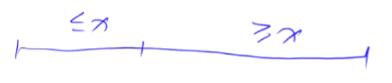

# AcWing  算法基础

## 第一章  基础算法

### 1.  排序

#### 1.1  快速排序

主要思想：分治


对这一串数据进行排序：

- a. 确定分界点

  - 直接取左边界```q[l]```
  - 直接取中间点```q[(l+r)/2]```
  - 直接取右边界```q[r]```
  - 或者随意取一个点

- b. 调整区间。把整个区间，根据分界点```x```的值划分为两部分，使第一个区间的数都小于等于```x```。第二个区间所有的数都大于等于x。

  

- c. 递归处理左右两端。

重难点是第二部调整区间。

比价优美而简洁的做法：==双指针法==(不需要额外开辟一段空间)！


