# 第三章 列表

## A 循位置访问

### A-1 循秩访问

可模仿向量的循秩访问方式，通过重载下标操作符"[]"来实现。具体代码如下：

```c++
template <typename T>		//重载下标操作符，以通过秩直接访问列表节点(效率低，需慎用)
T& List<T>::operator[] ( Rank r ) const {
    ListNodePosi(T) p = first();
    while( 0 < r--)
        p = p->succ;
    return p->data;
}
```


## B 接口与实现

### B-1 从静态到动态

1.根据是否修改数据结构，所有数据可分为两类：

(1)静态：仅读取，数据结构的内容及组成**一般**不变 :get、search

(2)动态：需写入，数据结构的局部或整体将改变:insert、remove

2.与操作方式相对应，数据元素的存储与组织方式也分为两种

(1).静态：数据空间整体创建或销毁

​				 数据元素的物理存储次序与其逻辑次序严一致

​				 可支持高效的静态操作

​				 Eg:Vector,元素的物理地址与其逻辑次序线性对应

(2).动态:	为各数据元素动态地分配和回收物理空间

​				逻辑上相邻的元素记录彼此的物理地址，在逻辑上形成一个整体	

### B-2 从向量到列表

1.列表(List)是采用动态存储策略的典型结构

​	其中的元素成为节点(node)，各节点通过指针或引用彼此连接，在逻辑上构成一个线性序列

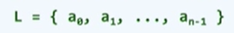

2. 相邻节点彼此互称前驱或后驱，前驱或后驱存在则必然唯一。没有前驱或后驱的唯一节点称作**首**或**末**节点

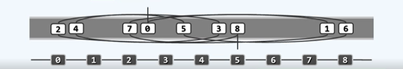

### B-3 从秩到位置

1.既然同属线性序列，列表固然也可以通过秩来定位节点：从头/尾端出发，沿后继/前驱引用......然而，此时的循秩访问成本过高，已不合时宜

```c++
//List::operator[](Rank r)    
```

因此，应改为**循位置访问**的方式。即，应转为利用节点之间的相互作用，找到特定的节点

### B-4 实现

1.作为列表的基本元素，列表节点首先要独立地“封装”实现。

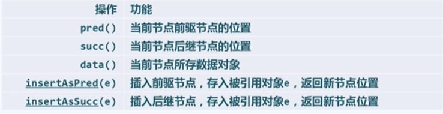

```c++
#define Posi(T) ListNode<T>* //列表节点位置
template <typename T>
struct ListNode 			 //列表节点模板类(以双向链表形式实现)
{
    T data；					 //数值
    Posi(T) pred;			  //前驱
    Posi(T) succ;			  //后继
    ListNode() {}			  //针对header和trailer的构造 
    ListNode(T e,  Posi(T) p = NULL, Posi(T) S = NULL)
        : data(e), pred(p), succ(s) {}	//默认构造器
	Posi(T) insertAsPred(T const& e);   //前插入
    Posi(T) insertAsSucc(T const& e);   //后插入
};
```

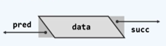

!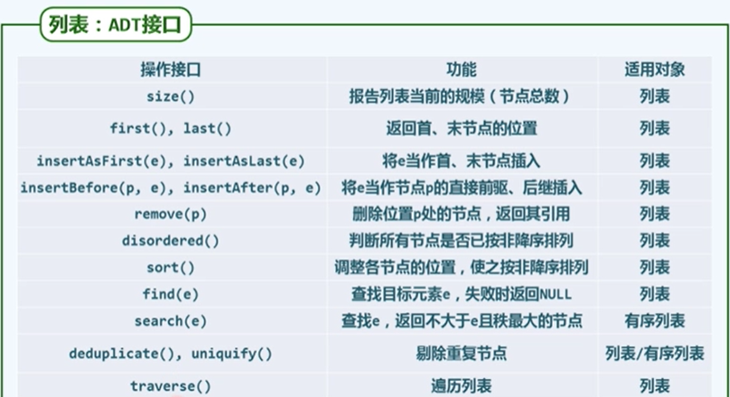

2.列表:List模板类(具体实现)

```c++
#include "listNode.h"//引入列表节点类
template <typename T> class List
{
	//列表模板类
    private：int _size;
    		 Posi(T) header;//头哨兵
    		 Posi(T) trailer;//尾哨兵
	protected:/*...内部函数*/
    public: /*构造函数、析构函数、只读接口、可写接口、遍历接口*/
};
```

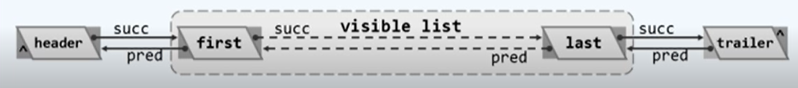

first:首元素							  last:末元素

header:头元素						trailer:尾元素

//等效地，可以把头首末位节点的秩分别理解为-1、0、n-1、n

实例如下

```C++
template <typename T> void List<T>::int()
{
    //初始化，创建对象对象时统一调用
    header = new ListNode<T>;
    trailer = new ListNode<T>;
    header->succ = trailer;
    header->pred = NULL;
    trailer->succ = NULL;
    trailer->pred = header;
    _size = 0;
}
```

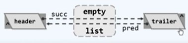

## C  无序列表

### 03C1  插入与构造

1.插入

```c++
template <typename Y> Posi(T) List<T>::insertBefore(Posi(T) P,T const& e)
{
    _size++;
    return p->insertAsPred(e);
}
template <typename T>
Posi(T) ListNode<T>::insertAsPred(T const& e)
{
	Posi(T) x = new ListNode(e,pred,this);
    pred->succ = x;
    pred = x;
    return x;
}
```

### 03C2  删除与析构

1.删除

```c++
template <typename T>//删除合法位置p处节点，返回其数值
T List<T>::remove(Posi(T) p)
{
    T e = p->data;//备份待删除节点数值
    p->pred->succ = p->succ;
    p->succ->pred = p->pred;
    delete p;
    _size--;
    return e;//返回备份数值
}
```

2.析构

如何销毁一个列表？

A：先将对外可见的节点一一删除

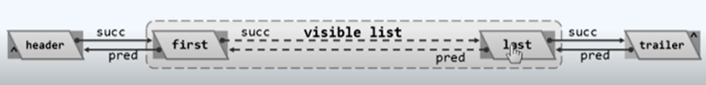

B：再将头尾哨兵节点释放

```c++
template <typename T>
List<T>::~List()
{
    clear();
    delete header;
    delete trailer;
}
//clear()具体实现
template <typename T>
int List<T>::clear()
{
    int oldsize = _size;
    while(_size>0)
        remove(header->succ);//也即当前的首元素
    return oldsize;
}
```

### 03C3-1  查找

1.查找：在节点p（也可能是trailer）的n个前驱中，找到等于e的最后者

```c++
template <typename T>
Posi(T) List<T>::find(T const & e,int n,Posi(T) P) const
//在当前这个列表中，以p这个节点为基准
//在它的n个真前驱中，查找可能存在的数值为e的某个节点
{
    while(n-- > 0)//从右向左。逐个将p的前驱与e对比
        if(e==(p = p->pred)->data) return p；
    return NULL;//若超出左边界，意味着查找失败
}
```

### 03C3-2  去重(即唯一化)

1.将列表分为三部分

* 前缀部分(以保证不包含任何重复的节点)

* 目标节点P

* 非空后缀部分

```C++
template <typename T>
int List<T>::deduplicate()
{	//删除无序列表中的重复节点
    if(_size<2) return 0;	//平凡列表自然无重复
    int oldsize = _size;	//记录原规模
    Posi(T) p = first();	
    Rank r = 1;				//p从首节点开始
    while(trailer != (p = p->succ))	//依次直到末节点
    {
        Posi(T) q = find(p->data, r, p);
        //在p的r个真前驱中，查找与之雷同者
        q ? remove(q) : r++;
	}
    return oldsize - _size;	//返回被删除元素总数
}
```

## D  有序列表

### 03D1-1  唯一化-构思

1.

### 03D1-2  唯一化-实现

1.唯一化代码实现

```c++
template <typename T>
int List<T>::uniquify()
{	//成批剔除重复元素
    if(_size < 2) return 0;//平凡列表自然无重复
    int oldsize = _size;
    ListNodePosi(T) p = first();	//p为各区段起点，q为其后继
    ListNodePosi(T) q;
    while(trailer != (q = p->succ))	//反复考察紧邻的节点对(p,q)
    	if(p->data != q->data) p = q;	//若为互异，则转向下一区段
    	else remove(q);
    return oldsize - _size;
}
```

### 03D2  查找

1.代码实现

```c++
template <typename T>
Posi(T) List<T>::search(T const & e, int n, Posi(T) p) const
{
	while(0 <= n--)
        if( ( (p = p->pred) -> data ) <= e) break;
    return p;
}
```

## E  选择排序

### 03E1-1  构思

1.把一揽子苹果拿出来进行排序，先拿最大的，再拿次大的，以此类推，最后拿最小的

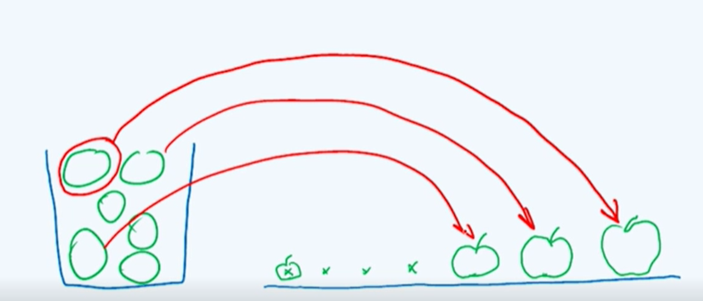

这其中最关键的一步就是”**select**“选择

### 03E1-2  实例

排序

### 03E1-3  实现

```c++
//对列表中起始于位置p的连续n个元素做选择排序 
template <typename T>
void List<T>::selectionSort(Posi(T) p,int n)
{
    Posi(T) head = p->pred;Posi(T) tail = p;	//待排序空间(head，tail)
    for(int i = 0;i < n;i++) tail = tail->succ;	//head/tail可能是头/尾哨兵
    while(1 < n)	//反复从(非平凡的)待排序区间找出最大者，并移至有序区间前端
    {
        Posi(T) max = selectMax ( head->succ, n);//找出最大者
        insertB( tail, remove( max ) );			 //将其移至无序期间末尾(作为有序区间的首元素)	
        tail = tail->pred;
        n--;
    }
}

//selectMax接口用于在无序列表中定位最大节点
template <typename T>
ListNodePosi(T) List<T>::select( ListNodePosi(T) p, int n)
{
    ListNodEPosi(T) max = p;		//最大者暂定为首节点p
    for(ListNodePosi(T) cur = p; n > 1; n--)	//从首节点p出发，将后续节点逐一与max比较
        if( !lt( ( cur = cur->succ )->data, max->data ) )
            max = cur;
    return max;
}
```

选择排序亦由n步迭代组成，故其运行时间取决于各步迭代中查找及插入操作的效率

insertB()和remove()均只需O(1)时间。selectMax()每次必须遍历整个无序前缀，耗时应线性正比于前缀长度，全程累计耗时O(n^2)

以上这种算法也称之为**画家算法**，画家在画油画时，涂了多种颜色，最终颜色取决于最后涂的颜色

## F  插入排序

### 03F1-1  经验

比如说打牌，抽完牌，插入到你手中排好序的牌

先定位，将更小的移动义腾出空位，然后将新牌插入到空位置

### 03F1-2  构思

在这整个过程中，将序列始终看成两部分，**Sorted和Unsorted**

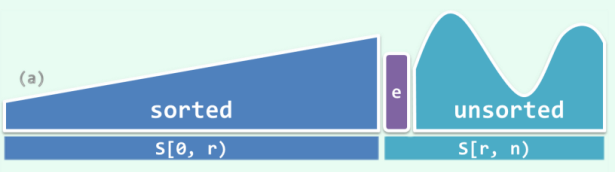

初始状态为0时，空序列自然有序，接下来是迭代过程，每一次迭代，注意力应该在秩为r的元素e，相当于发牌过程中新得到的一张牌，要做的就是要把新获得的牌插入到已有的牌(即**Sorted**)中去，并使得sorted部分继续整体有序

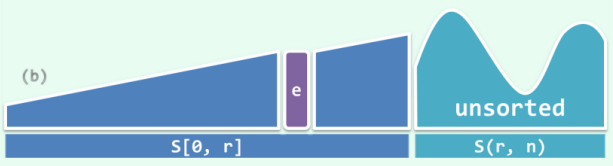

****

如上图，我们可以在sorted部分中找到一个合适的位置，并将这个前缀中适当的一个后缀向后移动一个单元，腾出一个空缺，将e纳入其中，

这个算法的不变性就是：随着r的递增，L[0, r）始终有序，直到r = n，L即整体有序

### 03F1-3  对比

* 左右部分颠倒

* 在选择排序中，将整个序列分为有序的后缀部分和无序的前缀部分，并且始终保持一个不变性，即无序的前缀部分中的所有元素都不能超过后缀有序部分的最小值。反观插入排序，你不能因为手牌最大的是K，就舍弃掉大小王，插入排序没有类似的限定

### 03F1-4  实例

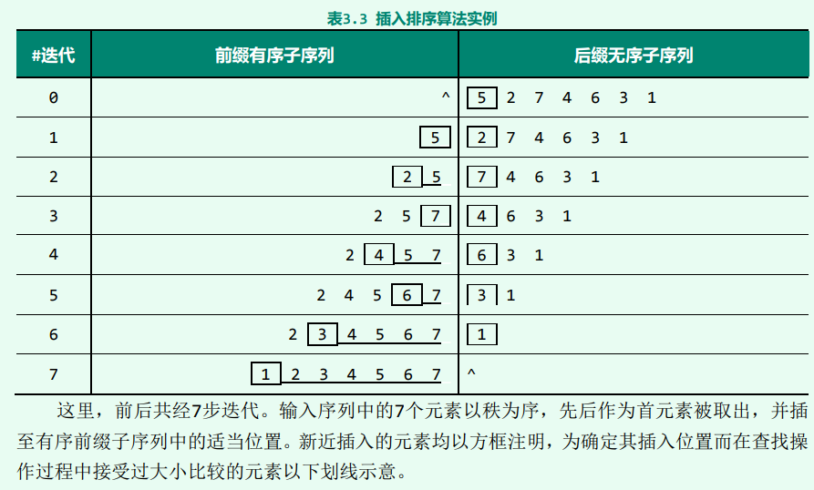

### 03F1-5  实现

```C++
template <typename T>
void List<T>::insertionSort( ListNodePosi(T) p,int n )
{	//对列表中起始于位置p的连续n个元素做插入排序
    for( int r = 0; r < n; r++)	//逐一引入各节点，由Sr得到S(r+1)
    {
        insertA( search ( p->data, r, p ), p->data );	//查找 + 插入
        p = p->succ; remove( p->pred );					//转向下一节点
    }
}
//r：有序前缀长度
//不变的是p这个节点，它是有序前缀和无序后缀的分界点，是无序后缀的首节点
//更为恰当的比喻：p是接下来抓到需要插入的那张牌
//p->:新抓到的牌
```

### 03F1-6  性能分析


上图是最好的情况：1次比较，0次交换 O(n)

最坏的情况：


O(n^2)

若改用向量Vector操作，即便只需要logn次比较，但要把新抓到的牌插入进去，还是需要把整体向量向后移动

### 03F1-7  平均性能

最好的情况下需要O(n)，最坏的情况下需要O(n^2),那么平均性能如何？

假定：各元素的取值遵守均匀、独立分布

于是：平均要做多少次元素比较?

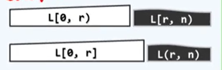

最后进入到L[0, r]的那个元素是不确定的，就像老师迟到，问同学是谁最后一个到课堂，谁都有可能

而且最后进入的元素，它插入在不同位置所对应的成本也是不同的

结论:O(n^2)

03F1-8  逆序对

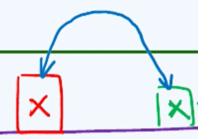

上述构成一个逆序对，为了方便，将每一个inversion都计入到后边

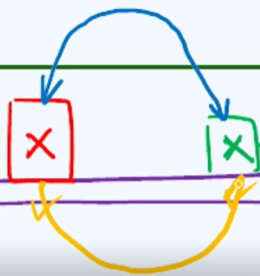

因此我们只需要统计每一个元素所对应的inversion有多少个，那么久得到了整个序列所蕴含的逆序对的数目。所以对于任何一个节点p，以此来定义它所对的逆序对的数目记作i(p)

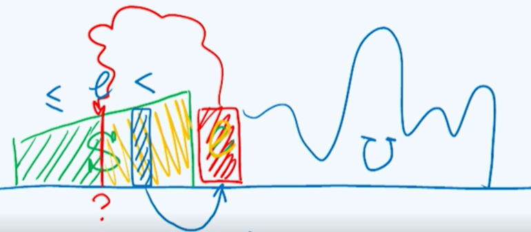

上图待插入元素与前缀S中分界点e后面的元素构成逆序对，所以i(p)就是p所对应的查找长度

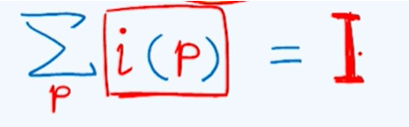

I实际上也就对应插入排序算法在一次又一次定位搜索过程中比较次数的累计总和，这也是插入排序算法所消耗时间的最主要部分，当然还有另外一部分就是对插入操作所花费的时间，每个元素是1，总共就是n，所以插入排序总共需要O(I+n)

# 第四章  栈与队列

## A  栈ADT及实现

### 04A1-1  栈

栈**Stack**依然是由一组元素组成的线性序列，在任何时候只能够访问栈中的一个特定元素，即最末端的元素

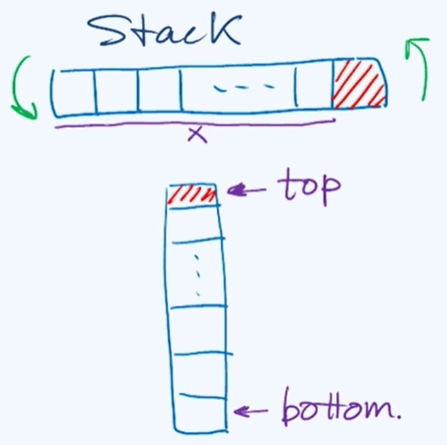

### 04A1-2  实例 

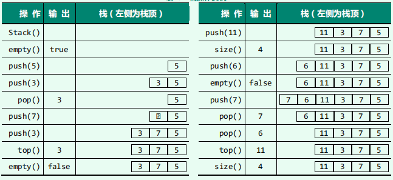

### 04A1-3  实现

栈既然属于序列的特例，故可直接基于向量或列表派生

```c++
template <typename T> 
class Stack: public Vector<T>
{
    void push(T const & e)	//入栈
    {
        insert(size(), e);	
    }
    T pop()					//出栈
    {
        return remove(size() - 1);
    }
    T & top()				//取顶
    {
    	return (*this)[size() - 1]; 
    }
}
```

## B  进制转换

### 04B1-1  应用

典型应用场合：

* 逆序输出(conversion)。输出次序与处理过程颠倒；递归深度和输出长度不易预知

* 递归嵌套(stack permutation + parenthesis)。具有自相似性的问题可递归描述，但分之位置和嵌套深度不固定

* 延迟缓冲(evaluation)。线性扫描算法模式中，在预读足够长之后，方能确定可处理的前缀

* 栈式计算(RPN)。基于栈结构的特定计算模式

### 04B1-2  算法

短除法 

### 04B1-3  实现

```c++
void convert( Stack<char> & S, _int64 n, int base )
{`	//将某个输入整数n转化为以base为进制的表示，所有的数值都被存入S栈中
    static char digit[] = //新进制下的数位符号，可视base取值范围的扩充
    { '0','1','2','3','4','5','6','7','8','9','A','B','C','D','E','F' };
    while(n > 0)
    {	//由低到高，逐一计算出新进制下的各数位
        S.push( digit[n % base] );	//余数(对应的数位)入栈
        n /= base;					//n更新为其对base的除商
    }
}
main()
{
    Stack<char> S;
    convert(S, n, base);
    while( !S.empty() ) printf("%c"， S.pop() );//逆序输出
}
```

## C  括号匹配

### 04C1-1  实例

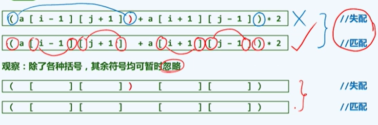

### 04C1-2  尝试

### 04C1-3  构思

颠倒以上思路：消去一对紧邻的左右括号，不影响全局的匹配判断

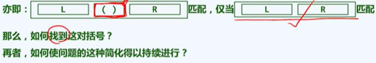

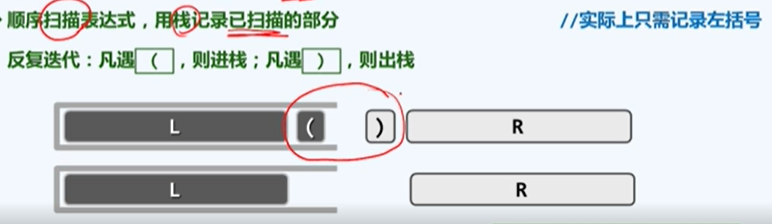

### 04C1-4  实现

```C++
bool paren(const char exp[], int lo, int hi)
{
    Stack<char> S;	//使用栈记录已发现但尚未匹配的左括号
    for(int i = lo; i < hi; i++)	//注意检查当前字符
        if( '(' == exp[i] ) S.push( exp[i]);	//遇左括号：则进栈
    	else if ( !S.empty() ) S.pop();			//遇右括号：若占非空，则弹出左括号
    	else rerurn false;						//否则（遇右括号时栈已空，必不匹配）
    return S.empty();	//最终，栈空当且仅当匹配
}
```

### 04C1-5  反思

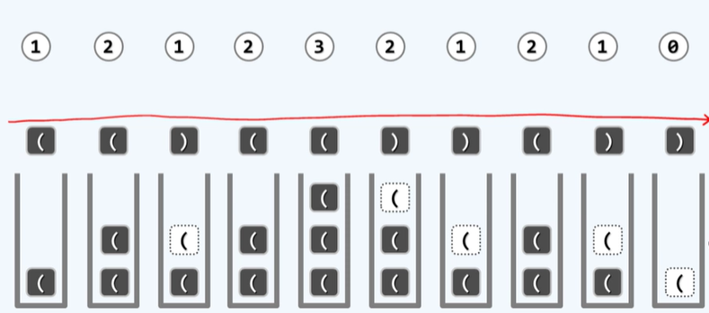

假设一开始是一个待判别的表达式，借助栈结构来逐个地检查各个字符，首先是第一个字符，是一个" ( "，根据上述代码(也许？)直接入栈，同样接下来的" ( "也是如此，直到我们第一次碰到" ) "，按照程序的另一个分支，弹出当前的栈顶接下来，" ( "继续入栈，连续两个" ) ",同样当前栈顶出栈，依次往后，最后栈清空。

反思：使用一个计数器也能达到效果，遇到" ( "计数器加一，遇到" ) "计数器就减一。为什么还要使用栈结构呢？

### 04C1-6  拓展

因为以上思路及算法，可便捷地推广至多种括号并存的情况

## D  栈混洗

### 04D1-4  混洗

所谓栈混洗就是按照某种规则，对栈中的元素进行重新的排序

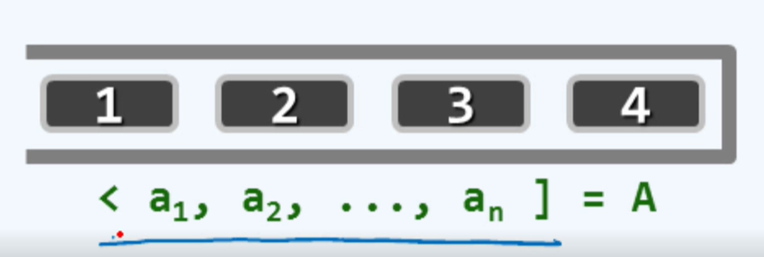

初始情况下，所有元素都存在栈A中，" < "代表栈的顶，" ] "代表栈的底

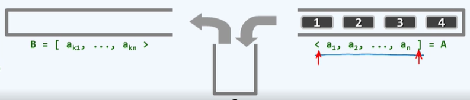

在整个混洗过程中只允许两种操作，第一种就是右箭头来表示的，将A中的栈顶弹出并随即压入中转栈S中；另一种操作就是左箭头，需要将S栈顶弹出，并随即转入栈B中

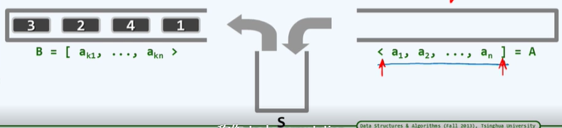

显然同一序列，可能有多种栈混洗

### 04D1-2  计数

对于长度为n的序列，可能得到栈混洗总共有多少种？   SP(n) = ？

假定输入栈A中有n个元素而且它们自顶向下

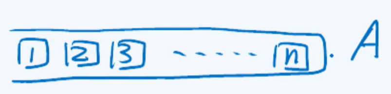

显然 1 首先被弹出，那么问题是，1 是何时被转入到最终的栈B中呢

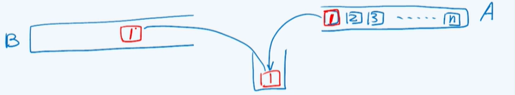

1 既然作为第一个元素被推入S中，那么当它被弹出并进而推入栈B之后，栈S应该成为一个空栈，此时栈B中如果包括刚推入的1号元素，累计共有k个元素，栈A中应该还留有最靠后的n-k个元素。由此可见，此时栈B中最靠底的k-1个元素和栈A的n-k个元素，它们的栈混洗实际上是相互独立的。因此对于1号元素 作为第k个元素被推入B中的情况，累计而言，对应的栈混洗总数就应该是这两个相互独立的子序列所对应的栈混洗总数的乘积

即：SP(k-1)*SP(n-k)

而对于1号元素来说，k所有的可能取值所对应的混洗数的总和就应该恰好是我们最初要计算的栈混洗总数

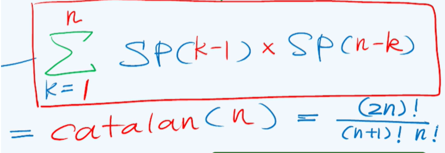

Catalan数是n=1时的平凡情况

### 04D1-3  甄别

对于输入序列的任何一个排列，如何判断它是否是一个合法的栈混洗

简单情况：<1,2,3],n = 3

栈混洗共 6！/4！/3！ = 5种

全排列共 3！= 6种

显然有一种情况并非是栈混洗即 [3,1,2>

观察：任意三个元素能否按某相对次序出现于混洗中，与其它元素无关

对于任意1≤i<j<k≤n，[...，k，...，i，...，j，...>必非栈混洗，也就是说，对于任何三个互异的整数i、j、k，如果在某个序列中出现了k、i、j，那它就不是栈混洗，称之为禁形

那么如果不存在"3,1,2"模式的序列，就一定是栈混洗吗？

### 04D1-4  算法

充要性:一个排列permutation如果确实是一个栈混洗的话，其充要条件就是不包含"3,1,2"这种模式

这样就可以得到一个O(n^3)z的甄别算法，但这种时间复杂度的算法是不能接受的

换一种思路，如果[p1,p2,p3,...,pn>是<1,2,3,4,...,n]的栈混洗，当且仅当对于任意i<j不含[...,j+1,...,i...,j,...>,这样就能得到一个O(n^2)的甄别算法，但同样难以接受这种时间复杂度的算法

接下来就介绍O(n)算法：直接借助栈A、B和S，模拟混洗过程。每次S.pop()之前，检测S是否已空；或需弹出的元素在S中，却并非顶元素。（这种可以说是一种贪心算法）

## E  中缀表达式求值

### 04E1-1  把玩

逆序缓冲：线性扫描算法模式中，在预读足够长之后，方能确定可处理的前缀1

给定语法正确的算术表达式S，计算与之对应的数值

### 04E1-2  构思

各种表达式所蕴含的算法都大同小异。

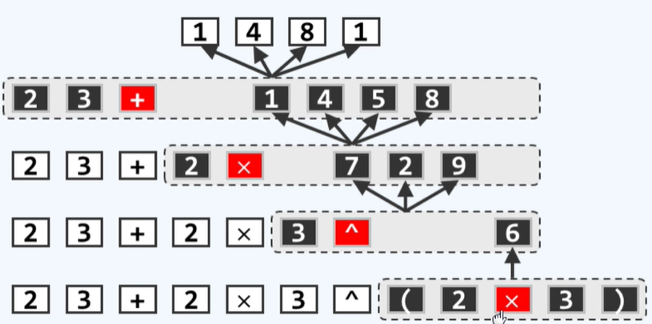

### 04E1-3  实例

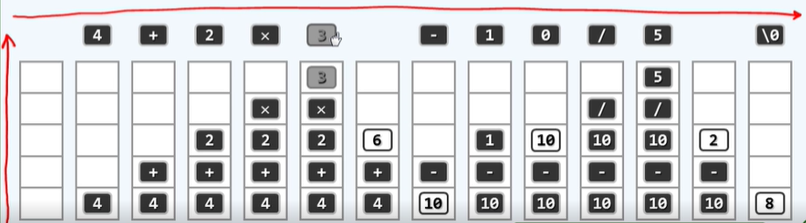

求值算法 = 栈 + 线性扫描

首先，若是运算数就将其存入栈中，如果是运算符，在尚未判定它已经拥有足够高的优先权可以立即计算之前，也先将其暂时存入栈中，直到遇见乘号，同样也不能判定现在已经足够计算，接下来遇到 - 号，新遇到的运算符优先级更低，所以乘号就到了可以计算的时候，后续类似相同

### 04E2-1  算法框架

```c++
//主算法
float evaluate( char* S, char* & RPN ){
    //中缀表达式求值
    Stack<float> open;	//运算数栈
    Stack<char> optr;	//运算符栈
    optr.push('\0');	//尾哨兵'\0'也作为头哨兵首先入栈
    while( ！optr.empty() ){
        //逐个处理各字符，直至运算符栈空
        if( isdigit( *s ) )		//若当前字符为操作数
            readNumber(S,opnd);	//读入(可能多位的)操作数
        else	//若当前字符为运算符，则视其与栈顶运算符之间优先级的高低
            switch( orderBetween(optr.top(), *S) )
            { /*分别处理*/ }
    }
    return opnd.pop();
}
```

### 04E2-2  算法细节

```c++
switch( orderBetween( optr.top(), *S ) ){
    case '<':				//栈顶运算符优先级更低
        optr.push( *S );	//计算推迟，当前运算符进栈
        S++;
        break;
    case '=':				//优先级相同(当前运算符为右括号，或尾部哨兵'\0')
        optr.pop();
        S++;
        break;				//脱括号并接收下一个字符
    case '>':{				//栈顶运算符优先级更高，实施相应的计算，结果入栈
        char op = optr.pop();	//栈顶运算符出栈，执行相应的计算
        if( '!' == op )
            opnd.push( calcu( op, opnd.pop() ) );	//一元运算符
        else{
            float p0pnd2 = opnd.pop(),p0pnd1 = opnd.pop();	//二元运算符
            opnd.push( calcu( p0pnd1, op, p0pnd2 ) );		//实施计算，结果入栈
        }
        break;
    }
        
}
```

### 04E3  实例A

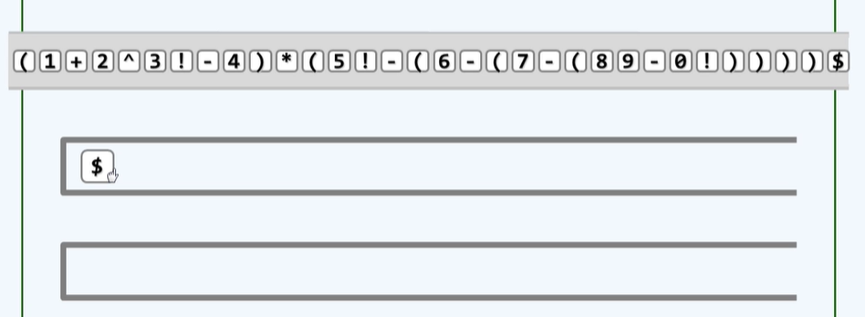

首先将注意力集中在左括号，作为一个操作符，它需要与操作符栈当前栈顶 \0 进行比较，查阅优先级表会发现，是一个 < 号，按照算法的流程，应该将优先级更高（左括号）的操作符推入操作符栈中暂时缓存起来

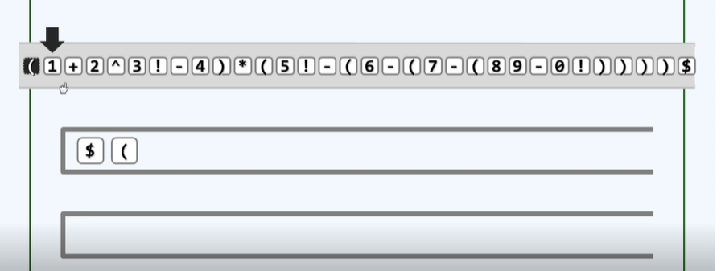

接下来把注意力转移到下一个字符，是一个操作数，将其推入操作数栈中，继续将注意力转移到下一个操作符 + ，同样它要与当前操作符栈栈顶比较优先级，依然得到  < 号，将 + 推入操作符栈中

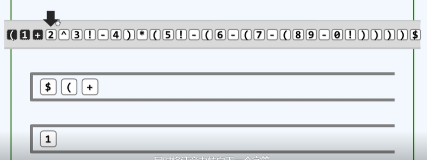

继续下一个字符是操作数，将其推入操作数栈栈。继续下一个字符是一个运算符 ^ ,将其与运算符栈栈顶相比较依然是 < ,继续将其推入栈中。继续下一个字符依然是操作数，同样推入操作数栈中

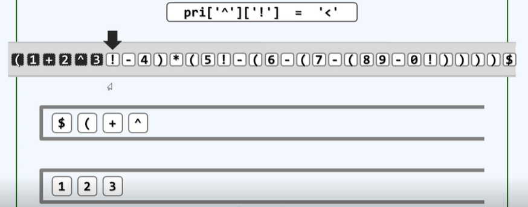

下一个运算符是 ！阶乘，查表得优先级更高，还是将其推入栈中。而下一个运算符是 - 号，这次优先级是 > 号，这意味着此前缓存在栈顶的运算符已经到了可以执行的时机，

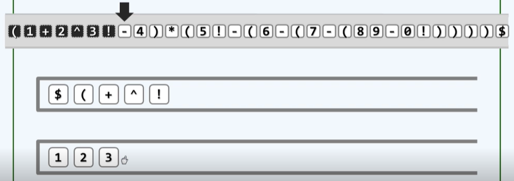

此时阶乘号将被弹出，3也被弹出，两者的计算结果6，也将重新回到栈中

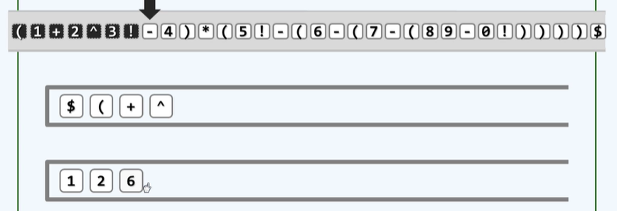

要注意，此时的注意力仍然集中在未处理完的 - 号，其依然要与操作符栈栈顶运算符（^）进行对比,依然是 > 号，此时^ 号也等到了可以执行的时机，从操作数中索取两个运算数并且执行乘方运算，即(^运算符出栈，2和6也会出栈)，之后运算结果重新纳入操作数栈中

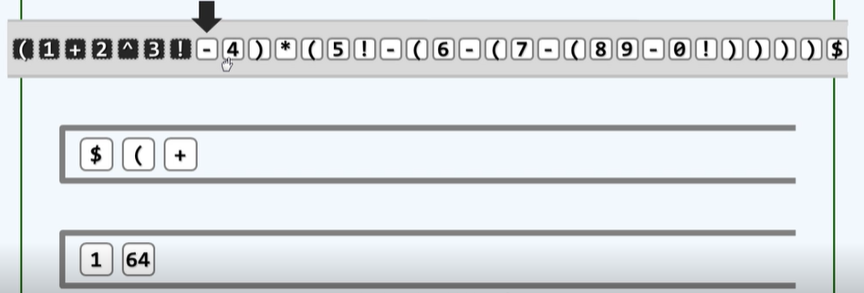

这时注意力仍然在 - 号运算符，它继续与运算符栈新栈顶进行比较，同样是 > 号运算符，+ 号运算符、1和64出栈进行加法运算

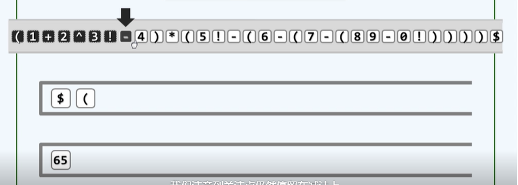

减号运算符继续与 ( 进行对比，得到优先级 < ,减号运算符入栈。注意力继续往下，是一个运算数，推入运算数栈中

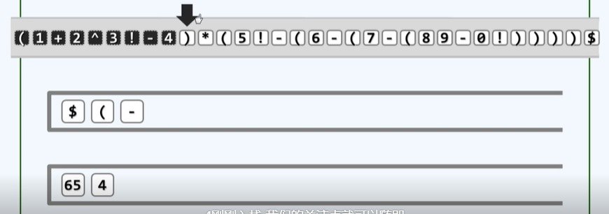

减号运算符、65和4出栈进行运算

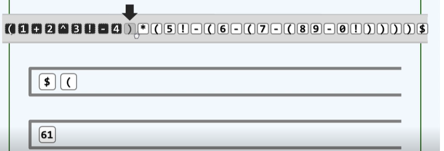

注意力继续转移至 ) 运算符，将其与运算符栈栈顶进行优先级比较，是一个 = 的关系，将栈顶的运算符弹出，接着跳过当前字符，转向下一个字符，这么做相当于这对()不存在。之后的运算操作相似

## F  逆波兰表达式

### 04F1-1  简化

逆波兰表达式(Reverse Polish Notation),在由运算符和操作数组成的表达式中不使用括号，即可表示带优先级的运算关系

### 04F1-2  体验

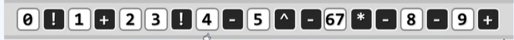

工具：一个辅助栈

逻辑：一种就是白色表示的操作数，另一种就是黑色表示的操作符

操作数采用随即插入，而操作符不需要麻烦的求判断它们的运算次序，而是简明的采用数理操作数类似是策略，即凡是遇到一个操作符，无论是谁随即执行相应的运算，那么需要的操作数呢？需要几个操作数就在这个操作数暂存的栈中从顶部取出几个，运算结果重新返回栈中

### 04F2-1  手工

### 04F2-2  算法

```c++
float evaluate( char* S, char* & RPN ){
    //RPN转换
    /*...............................................................*/
    while( !optr.empty() ){	//逐个处理各字符，直至运算符栈空
        if( isdigit(*S) )	//若当前字符为操作数，则直接将其接入RPN
        	{
            	readNumber( S, opnd );
            	append( RPN, opnd.top() );
            }
        else				//若当前字符为运算符
            switch( orderBetween( optr.top(), *S ) ){
            /*......................................*/
                case '>':{
                    char op = optr.pop();
                    append( RPN, op );
                    /*..............................*/
                }
            }
    }
}
```

## G  队列ADT及实现

### 04G1-1  接口

- 队列(queue)也是受限的序列
  - 只能在队尾插入(查询)：enqueue() + rear()
  - 只能在队头删除(删除)：dequeue() + front()

### 04G1-2  实例

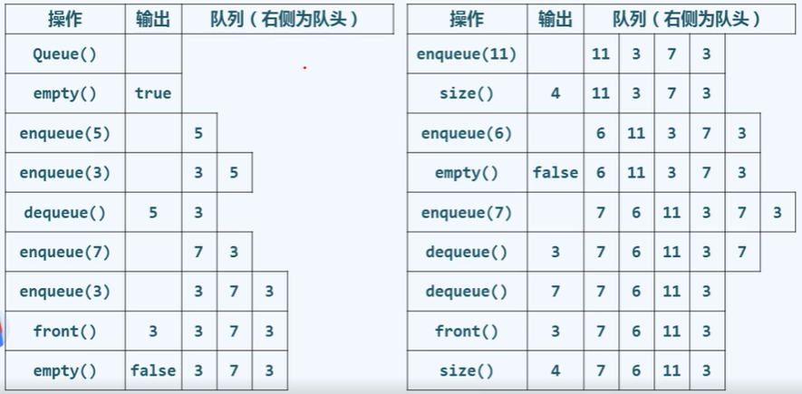

### 04G1-3  实现

```c++
//模板类
//队列既然属于序列的特例，故亦可直接基于向量或列表派生
template <typename T> 
class Queue: public List<T>{						//由列表派生的队列模板类
public:		
	void enqueue( T const & e ){ insertAslast(e); }	//入队
    T dequeue() { return remove( first() ); }		//出队
    T & front() { return first()->data; }			//队首
}
```

