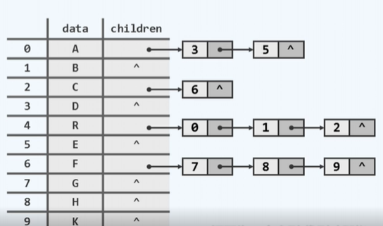
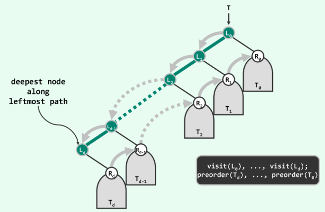

# 第五章  二叉树

## A  树

### 05A-1  动机

- 之前介绍的列表、栈和队列不够用

|        | Vector                       | List                                       |
| ------ | ---------------------------- | ------------------------------------------ |
| Search | 效率很高，可以做到logn的效率 | 效率很低，最坏情况和平均情况下，是线性时间 |
| insert | 效率差劲，需要线性时间       | O(1)                                       |
| move   | 效率差劲，需要线性时间       | O(1)                                       |

如表所示，Vector和List无法兼顾静态操作和动态操作同时高效性

树，不是线性结构，但又带有一定的线性特征，可称之为半线性结构

### 05A-2  应用

层次系统的表示！

### 05A-3  有根数

树也有一组顶点(vertex)以及联接与与其间的若干条边(edge)。在计算机科学中，往往会在此基础上，再指定某一特定顶点，并称之为(根)。

### 05A-4  有序树


r~i~称作r的孩子(child)，r~i~之间互称兄弟(sibling)

r为其父亲(parent)，d = degree(r)为r的(出)度(degree)

**任何一棵树中所含的边数应该恰好等于其中所有顶点的度数之和，同时也等于顶点总数-1**

若指定T~i~作为T的第i棵子树，r~i~作为r的第i个孩子，则称T为有序树( ordered tree )

### 05A-5  路径+环路

V中的k+1个节点，通过E中的k条边以此相联，称为一条路径( path )


π = {(v~0~, v~1~), (v~1~, v~2~), ...... , (v~k-1~, v~k~)}

路径长度： |π| = 构成它的边的数目 = k

特殊形式

- 环路( cycle/loop ): v~k~ = v~0~

### 05A-6  连通+无环

- 节点之间均有路径，称为连通图 ( connected )

- 不含环路，称作无环图( acyclic )

**二者与树有什么关系呢？**

- 树就是在无环和连通之间取得平衡的一种特定的图
- 因为无环，所以边数不会太大；又因为是连通的，所有边数又不能太少

在一棵树中，任一节点v与根之间存在唯一路径：path(v,r) = path(v)。即每个点拥有了一个唯一的指标，也就是这条路径的长度

### 05A-7  深度+路径

不致歧义时，路径、节点和子树可相互指代

- path(v) ~ v ~subtree(v)


v的深度：depth(v) = |path(v)|

path(v)上节点，均为v的祖先( ancestor )，v是它们的后代，其中除自身之外，是真祖先/后代

而半线性：在任一深度，v的祖先/后代若存在，则必然/未必唯一

根节点是所有节点的公共祖先，深度为0

没有后代的节点称为叶节点(叶子)，在树中叶子节点是必然存在的

所有叶子深度中的最大者称为树的高度： height(v) = height( subtree(v) )

任何一棵子树的高度 = 就是它的根节点的高度 

空树的高度取作-1

## B  树的表示

### 05B-1  表示法


### 05B-2  父亲

观察到一点：除根以外，任一节点有且仅有一个父节点

空间性能：O(n)

时间性能不太行。比如找到某个节点的孩子最坏情况下需要遍历整棵树

### 05B-3  孩子

不妨对于任何一个节点，将它的孩子都汇聚起来构成一个更小的数据集



不同的是，这种方法还需要为每一个节点准备一个children的引用，引用所指向的就是，由它的所有的孩子构成的一个小的数据集

例如R节点，按照表格的记录是 0,1,2，三个数字代表的就是R节点的孩子在整个序列中的秩

缺点：要想找到父亲不得不遍历整个线性序列，并且逐一翻看它所对应的孩子记录，最坏情况下需要找到最后一个节点的最后一个孩子。

### 05B-4  父亲 + 孩子


对于同一个节点，不仅要保留它的parent域，同时还要保留它的children域。这样如果要查找父亲，就在parent这一列进行查找，只需O(1)的时间，查找children同理，如果是长子就可以在O(1)的时间里返回，其它孩子也不过是需要遍历它所对应的这个孩子列表。

进一步推敲依然有一些不足，可以发现每一个节点的children引用所指向的那个数据集在规模上可能相差极其悬殊。要知道，每个小的数据集的长度等于这个节点所对应的出度，而这些出度的总和无非就是整体的边数。

### 05B-5长子 + 兄弟

每个节点均设两个引用

- 纵：firstChild()
- 横：nextSibling()


实例：

只关心它的长子，对于R而言，长子为A，不在保留通往所有孩子的引用，而只保留从R到长子的一个引用( firstChild() )，而R节点的其他孩子即B和C,会一次通过nextSibling()引用，由A指向B，再由B的nextSibling()指针指向C。

每个节点都只需要记录两个引用就够了。每个节点所占用的空间依然是常数。

## C  有根有序树 = 二叉树

### 05C-1  二叉树

- 节点度数不超过2的树称作二叉树( binary tree )
- 同一节点的孩子和子树，均以左、右区分
  - lChild( ) ~ lSubtree( )
  - rChild( ) ~ rSubtree( )

* 深度为k的节点，至多2^k^个
* 含n个节点，高度为h的二叉树中： h < n < 2^h+1^

### 05C-2  真二叉树

上述二叉树仅对每个节点的出度做了一个上限的约定( ≤2 )。即三种情况，某些节点没有出度，某些节点出度为1，某些节点出度为2，这种一般性的二叉树在很多操作中会引来一些麻烦，比如算法的实现和理解。解决办法就是将这种一般性的二叉树变为一颗真二叉树

真二叉树：每个节点的出度都是偶数即 0 或 2 。


将每个节点添加上足够多个孩子节点

假象！！！并非真的引入！！

### 05C-3  描述多叉树

二叉树是多叉树的特例，但在有根且有序时，其描述能力却足以覆盖后者（拿一个特例来描述所有情况）

如何通过二叉树来描述多叉树?

只需要将每一个节点所对应的一个局部( firstChild() 和 nextSibling() )，做一个45°角的旋转


将这种表示方法施加到长子兄弟表示法中的任何一个局部即可

## D 二叉树实现

### 05D-1  BinNode类

- 二叉树基本组成单位是二叉树节点( Binary Nodes 简称 BinNode)
- 每一个BinNode的逻辑组成可以用如图表示
  - 首先是data域，整个BinNode节点的核心要素
  - 引用域。分别指向左右孩子和父亲
  - 作为树中的特定元素，还需要记录一些重要的指标
    - 比如说height高度
    - 红黑树中的颜色表示等等


每个节点都是通过引用去指向其它的节点。笼统地称每个节点所占据的空间为一个位置


### 05D-2  BinNode接口

```c++
template <typename T> 
BinNodePosi(T) BinNode<T>::insertAsLC(T const & e)
{
    return lChild = new BinNode( e, this );
}
template  <typename T>
BinNodePosi(T) BinNode<T>::insertAsRC(T const & e)
{
    return rChild = new BinNode( e, this );
}
```

对传入的参数e进行封装使之成为一个新的节点，并且将它作为当前节点的左孩子接入所属的这棵树中。作为入口条件我们可以假设当前节点的左孩子是空的，然后通过BinNode构造方法创建一个新的BinNode节点，此节点的data域就是e，而父节点就是this


也就是说，生成了一个新的BinNode节点，同时将它的parent引用指向我们当前的节点，但这操作只是进行了一半，只进行了自下而上方向的连接，还需要完成自上而下的连接。即令当前这个节点的左孩子引用能够正确地指向新创建的这个节点。

要知道新创建的这个节点本身返回的就是一个位置，直接用新生成的链接赋予当前节点的lChild引用

```c++
template <typename T>
int BinNode<T>::size()
{
    //后代总数，亦即以其根的子树的规模
    int s = 1;		//计入本身
    if(lChild)
        s += lChild->size();	//递归计入左子树规模
    if(rChild)
        s += rChild->size();	//递归计入右子树规模
    return s;
}
```

运行时间，无论是左孩子接入还是右孩子接入，都可以在常数时间内完成。而size接口必须遍历所有的节点，O(n = | size |)

### 05D-3  BinTree类

BinTree模板类

```c++
template <typename T>
class BinTree{
protected:
    int _size;					//规模
    BinNodePosi(T) _root;		//根节点
    virtual int updateHeight( BinNodePosi(T) x );	//更新节点x的高度
    void updateHeightAbove( BinNodePosi(T) x );		//更新x及祖先的高度
public：
    int size() const { return _size; }				//规模
    bool empty() const { return !_root; }			//判空
    BinNodePosi(T) root const { return _root; }		//树根
    /*...子树接入、删除和分离接口...*/
    /*........遍历接口...........*/
}
```

### 05D-4  高度更新

对于任何一个节点x，它的高度就是在以它为根的子树中，


从它通往那个最深的叶节点的路径长度


但要考虑几种特殊情况

- 只有单个节点的情况。只有单个节点的树的高度取作0
- 还有根本就不存在任何节点的树，即空树，之前约定空树的高度为-1

那么如何对上述情况进行统一呢？

**采取宏定义的封装方法**

```c++
#define stature(p) ( (p) ? (p)->height : -1 )
```

通过重新命名一个新的等价意义上的高度。

一个节点的高度之所以会发生变化，是由于它的左孩子或者右孩子的高度发生变化。

节点x的高度应该等于左孩子和右孩子的更大者高度再+1。

```c++
template <typename T>			//更新节点x高度，具体规则因树不同而异
int BinTree<T>::updateHeight( BinNodePosi(T) X )
{
    return x->height = 1 + max( stature( x->lChild ), stature( x->rChild ) );
}
//此处采用常规二叉树规则，O(1)

template <typename T>			//更新v及其历代祖先的祖先
void BinTree<T>::updateHeightAbove( BinNodePosi(T) x )
{
    while(x)	//可优化：一旦高度未变，即可停止
    {
        updateHeight(x);
        x = x->parent;
}O( n = depth(x) )
```

 如果x的父节点存在，那么父节点很有可能因为x的高度发生变化而高度变化，继续往上，如果有祖父节点乃至曾祖父节点，这些节点的高度都有可能发生变化。因此如果要对全树做整体的高度更新，往往需要从某一个节点x出发，逐层向上追溯它的历代祖先，直到最终抵达根节点

### 05D-5  节点插入


在一棵已有的二叉树中，将某个新生成的节点作为树中某一个原本没有右孩子节点的右孩子，接入进去

```c++
template <typename T> 
BinNodePosi(T) BinTree<T>::insertAsRC( BinNodePosi(T) x, T const & e )
{
    _size++;
    x->insertAsRC(e);	//x祖先的高度可能增加，其余节点必然不变
    updateHeightAbove(x);
    return x->rChild;
}
```

首先将目标e封装为一个新的节点，这个节点在创建的时候就会以x节点作为它的父亲，即完成自下而上的链接，再通过一次赋值将新生成的节点的位置，交给节点x此前为空的右孩子引用，从而使得这个引用能够正确地指向新生成并封装好的这个节点。

在这样的拓扑连接完成以后，x节点的高度可能因为新插入的孩子而发生变化

## E  先序遍历

### 05E1-1 转化策略

二叉树的相关算法，也往往需要对其中的元素按照某种次序，来逐一访问

**按照某种事先约定的原则，在二叉树的所有节点之间，定义某种明确的线性次序。即接下来要介绍的遍历。**

### 05E1-2  遍历规则

###  

- 遍历：按照某种次序访问树中各节点，每个节点被访问恰好一次

  **T = V ∪ L ∪ R**

  任何一个局部的子树，无非可以分成树根V，左子树L，右子树R

- 几种遍历算法

  |      先序      |      中序       |      后序       |     层次(广度)     |
  | :------------: | :-------------: | :-------------: | :----------------: |
  | **V** \| L \|R | L \| **V** \| R | L \| R \| **V** | 自上而下，先左后右 |

  区别就在于，局部的根节点是按什么次序来访问的


### 05E1-3  递归实现

```c++
template <typename T, typename VST>
void traverse( BinNodePosi(T) x, VST & visit ){
    if( !x )
        return;
    visit( x->data );
    traverse( x->lChild, visit );
    traverse( x->rchild, visit );
}
//T(n) = O(1) + T(a) + T(n-a-1) = O(n)
```

### 05E1-4  迭代实现( 1 )

首先补充一下递归和迭代的区别

- 迭代：《明日边缘》
- 递归：《盗梦空间》

**不断回到同一个场景并优化解决** || **不断下潜至底层并解决**

递归是自己调用自己，每次旨在缩小问题规模。迭代是自己执行很多次，每次旨在更接近目标

```c++
template <typename T, typename VST>
void travPre_I1( BinNodePosi(T) x, VST & visit ){
    Stack <BinNodePosi(T)> S;		//辅助栈
    if(x)
        S.push(x);					//根节点入栈
    while( !S.empty() ){			//在栈变空之前反复循环
        x = S.pop();
        visit( x->data );			//弹出并访问当前节点
        if( HasRChild( *x ) )
            S.push( x->rChild );	//右孩子先入后出
        if( HasLChild( *x ) )
            S.push( x->lChild );	//左孩子后入先出
    }
}
```

首先取一个栈S，用以存放树节点的位置，即它们的引用。

### 05E1-5  实例


在任何局部都是先访问根，再遍历左子树，再遍历右孩子，最终才能完成任何一个局部的整体遍历

先引入一个空栈，要做初始化首先要将根节点即a纳入其中，进入while循环，每一次做的动作都是弹出当前的栈顶并且访问这个节点（黑色表示已经访问的节点）。之后去检查被访问的根节点是否拥有右孩子，有就入栈（c入栈），再检查是否拥有左孩子，有就令它紧接着入栈（b入栈）。进入下一步迭代，弹出当前的栈顶节点b，左顾右盼发现节点b没有孩子所以就不会实施任何入栈操作，所以进入下一步迭代。接下来依然弹出栈顶节点c，**虽然c弹出后栈是空的，但这并非判断循环退出的时机**，实际上应该判断刚被访问的c节点是否有左右孩子，只要有就按照先右后左的次序，令它们依次入栈。进入下一次迭代发现这个栈并非是空的，同样会取出栈顶d，并随即访问这个新弹出的节点d，依然右顾左盼，发现有一个右孩子，将这个右孩子入栈。再继续迭代，栈顶节点e会被弹出并且接受访问，e没有孩子，没有任何左右孩子......

但这种方法不太很难推广到中序和后序遍历

### 05E2-1  新思路


先序遍历将首先访问全树的树根 i ，接下来访问它的左子树的树根 d ， 继续访问d的左子树 c ，之后访问c的左子树 a ，因为a 没有左子树，所以将控制权交给右子树 b ， b 没有孩子，所以进行回溯。d、c、a都被访问完了，但不同的是，d还有一个未访问的右孩子 h ， 所以控制权交给 h，.......

### 05E2-2  新构思

左侧链：将起始于树根的总是沿着左侧孩子的分支不断下行的一条链



任何一个二叉树都可以抽象地表示为一个沿左侧链不断下行，同时其他的部分分别归入于左侧链上沿途各个节点的右子树形式。

总结：

- 首先是自顶向下依次访问左侧链上的沿途节点
- 再倒过来自底而上地依次遍历，各个层次上的每一棵右子树

### 05E2-3  迭代实现( 2 )

```c++
template <typename T, typename VST>			//分摊O(1)
static void visitAlongLeftBranch(
    BinNodePosi(T) x,
    VST & visit,
    Stack <BinNodePosi(T)> & S)
{
    while(x)
    {
        visit( x->data );			//访问当前节点
        S.push( x->rChild );		//右孩子(右子树)入栈(将来逆序出栈)
        x = x->lChild;				//沿左侧链下行
    }
}
//只有右孩子、NULL可能入栈
```

**主算法**

```c++
template <typename T, typename VST>
void travPre_I2( BinNodePosi(T) x, VST & visit ){
    Stack <BinNodePosi(T)> S;
    while(true){	//以(右)子树为单位，逐批访问节点
        visitAlongLeftBranch( x, visit, s );
        //访问子树x的左侧链，右子树入栈缓冲
        if( S.empty() )	//栈空即弹出
            break;
        x = S.pop();	//弹出下一子树的根	
    }
}
```

05E2-4  实例


首先调用visitAlongLeftBranch的例程访问始自于a的这样一个左侧链，此时只包括a和b两个节点，这段程序运行的同时还会将a分右孩子c以及节点b看不见的右孩子推入栈中。正如图所示，访问a时把c节点推入栈中，访问b时会把空节点推入栈中。因此在主程序的接下来步骤中首先会弹出空节点并试图以这个空节点为起点去调用一次visitAlongLeftBranch的例程，因为当前x节点为空，所以不会发生任何实质的动作，检测到为空会立即返回。接下来会弹出栈顶节点c，并试图以c为起点调用visitAlongLeftBranch的例程，依次访问当前左侧链上的c以及d。同样在访问c和d的同时还会将c的右孩子f和d的右孩子e依次推入栈中，接着e被弹出并且将会以e为起点针对e所对应的子树调用一次visitAlongLeftBranch的例程，实际上会将一个空节点推入栈中以及出栈。继续迭代......

## F  中序遍历

### 05F1-1  递归

```c++
template <typename T, typename VST>
void traverse(BinNodePosi(T) x, VST & visit)
{
    if( !x )
        return;
    traverse( x->lChild, visit );
    visit( x->data );
    traverse( x->rChild, visit );
}
```

### 05F1-2  观察


第一个要访问的节点就是a，为什么呢？

回到中序遍历的基本策略，即左中右次序，在任何局部，比如说整个全树的根节点i。根节点i的左子树，即子树d在被完全遍历之前，i是不会首先接受访问的。当算法扫描到子树i的时候它会将控制权转交给它的左孩子d。当算法扫描到d时，也会将控制权转交给它的左孩子c。扫描到c时也会将控制权转交给它的左孩子a。a也会试图将控制权交给它的左孩子，然而a节点没有左孩子，这就==等效于左孩子以及左后代已经完全被访问完了==，换而言之，此时这个局部子树的树根节点a到了该被访问的时候了。

从根节点开始，一直沿着左侧分支逐层向下，直到末端不能再向下的那个节点

### 05F2-1  思路


将一棵二叉树抽象的规范为如图形式。整棵树可以分解为一条起自根节点的左侧链以及左侧链上各节点所对应的右孩子和右子树

### 05F2-2  构想

左侧链上的每一个节点都对应于一个阶段，而每个阶段的情节都是雷同的：访问左侧链的节点，然后遍历它所对应的右子树.......

### 05F2-3  实现

```c++
//部分子函数
template <typename T>
static void goAlongLeftBranch(BinNodePosi(T) x, Stack <BinNodePosi(T)> & S)
{
    while(x)
    {
        S.push(x);
        x = x->lChild;	//反复地入栈，沿左分支深入
    }
}
//主算法
template <typename T, typename V>
void travIn_I1(BinNodePosi(T) x, V& visit)
{
    Stack <BinNodePosi(T)> S;
    while(true)
    {
        goAlongLeftBranch( x, S );			//从当前节点出发，逐批入栈
        if( S.empty() )
            break;						   //直至所有节点处理完毕	
        x = S.pop();					   //x的子树为空或者已遍历
        visit( x->data );				    //立即访问		   
        x = x->rChild;						//再转向其右孩子
    }
}
```

### 05F2-4  实例


首先引入一个栈，初始为空。当然算法的入口在根节点b，但是根节点b不会立即接受访问而是会沿着左侧链不断下行直到末端节点a，在这个过程中遇到的b和a被依次推入栈中。当前栈顶a被弹出，轮到它接受访问，然后试图将控制权交给a的右孩子，然而a的右孩子是空的，但仍然会调用一次goAlongLeftBranch例程，这会立即返回没有任何实质性的动作。继续弹出新的栈顶b，节点b随即接受访问，此后将控制权交给节点b的右孩子f。f接过控制权会试图将控制权交给它的左孩子以及左孩子的左孩子......，直到末端节点，这一过程会将历代节点依次推入栈中。继续弹出栈顶c，随即接受访问，对于c，调用一次goAlongLeftBranch的例程，不会发生任何实质性的操作后，继续弹出d，对其访问，控制权交给e。同样e也会调用一次goAlongLeftBranch，不发生任何实质性操作后，e入栈。继续下一轮迭代开始，e出栈接受访问，试图将控制权转交给右孩子，过门。继续处理栈顶f弹出并访问f，将控制权转交给f的右孩子g，调用goAlongLeftBranch例程，g入栈。最后一次迭代g没什么孩子，栈为空，遍历结束。

### 05F-3  分摊分析

递归版本可以简明实现O(n)时间的复杂度

再看迭代版本。总体上看是一个循环套着一个循环。外循环总共需要执行O(n)步，因为它要对每个节点都至少访问一次。而内循环就是沿着左侧分支不断下行的过程，最坏情况下也可能是O(n)

但结论是：迭代版本的运行时间任然是O(n)。

## G  后序遍历

### 05G1  递归实现

```C++
template <typename T, typename VST> 
void traverse( BinNodePosi<T> x, VST & visit)
{
    if(!x)
        return;
    traverse( x->lc, visit );
    traverse( x->rc, visit );
    visit( x->data );
}
```

### 05G2  迭代算法

```C++
template <typename T>
static void gotoLeftmostLeaf( Stack <BinNodePosi<T>> & S )
{
    while( BinNodePosi<T> x = S.top() )	//自上而下反复检查栈顶节点
        if( HasLChild( * x ) ) 			//尽可能向左，在此之前若有右孩子
        {
            if( HasRChild( * x) )
                S.push( x->rc);			//优先入栈
            S.push( x->lc );			//然后转向左孩子
        }else							//迫不得已
            S.push( x->rc );			//才转向右孩子
    S.pop();
}
```

### 05G3  分析

分摊！

### 05G4  表达式树

## H  层次遍历

### 05H-1  次序

自顶向下，自左向右，逐一地访问树中的每一个节点

### 05H-2  实现

```c++
template <typename T, typename VST>
void BinNode<T>::travLevel( VST & visit)	//二叉树层次遍历
{
    Queue<BinNodePosi(T)> Q;				//引入辅助队列
    Q.enqueue( this );						//根节点入队
    while( !Q.empty() )						//在队列再次变空之前，反复迭代
    {
        BinNodePosi(T) x = Q.dequeue();		  //取出队首节点，并随即访问之
        visit( x->data );
        if( HasLChild(*x) ) Q.enqueue( x->lChild );	//左孩子入队
        if( HasRchild(*x) ) Q.enqueue( x->rChild );	//右孩子入栈
    }
}
```

### 05H-3  实例


# 第六章 图

## A.  概述

### 06A-1  邻接+关联

图，可定义为$G=(V,E)$。集合$V$中的元素称作顶点(```vertex```)；集合$E$中的元素分别对应与$V$中的某一对定点$(u,v)$，表示它们之间存在某种关系，亦称作边(```egde```)。


### 06A-2  无向+有向

略

### 06A-3  路径/环路

所谓路径就是由一系列的顶点按照一次邻接的关系构成的一个序列

## B.  邻接矩阵

### 06B1-1  接口


### 06B1-2  邻接矩阵+关联矩阵

所谓邻接矩阵，就是用以描述顶点之间相互邻接关系的一种形式。

如果图中有n个顶点，那么这个矩阵就是```n*n```的


### 06B2-1  顶点和边


## C.  广度优先搜索

### 06C1-1  化繁为简


