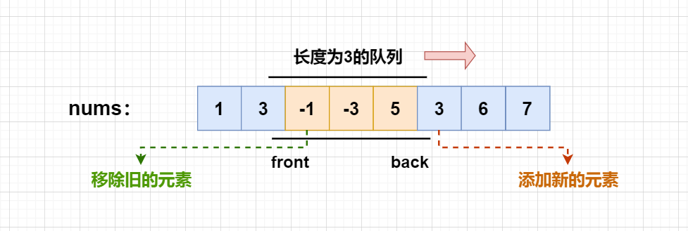
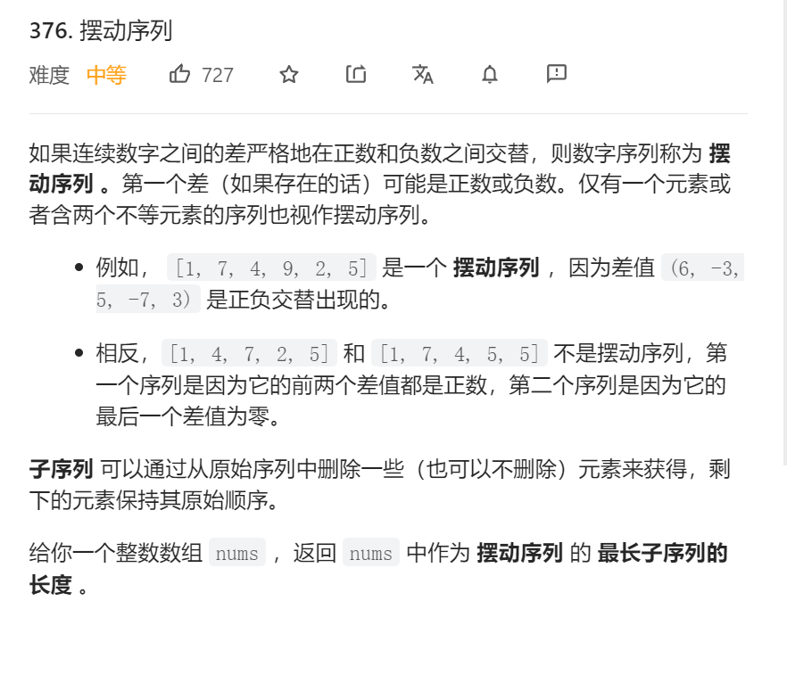

# LeetCode

## 1—50

### 1-10

### 11-20

#### 20、有效的括号(数组/哈希表)

```c++
class Solution{
public:
    bool isValid(string s){
		stack<char> st;
        for(int i=0;i<s.size();i++){
            if(s[i]=='(') st.push(')');
            else if(s[i]=='[') st.push(']');
            else if(s[i]=='{') st.push('}');
            else if(st.empty()||st.top()!=s[i]){
                return false;
            }
            else{
				st.pop();
            }
        }
        return st.pop();
    }
};
```


### 21-30

### 31-40

### 41-50

## 51-100

### 51-60


#### 56、合并区间(数组)

- 按照左端点排序
- 分情况讨论
  - 有交集，更新当前区间的右端点，左端点不变
  - 无交集，则保存当前区间

```c++
class Solution {
public:
    vector<vector<int>> merge(vector<vector<int>>& intervals) {
        vector<vector<int>> res;
        if(intervals.size()==0) return res;

        sort(intervals.begin(),intervals.end());
        int l = intervals[0][0],r = intervals[0][1];
        for(int i=1;i<intervals.size();i++){
            if(intervals[i][0]>r){
                res.push_back({l,r});
                l = intervals[i][0];
                r = intervals[i][1];
            }
            else{
                r = max(r,intervals[i][1]);
            }
        }
        res.push_back({l,r});
        return res;
    }
};
```


### 61-70

### 71-80

#### 73  矩阵置0(数组)

```c++
class Solution {
public:
    void setZeroes(vector<vector<int>>& matrix) {
        int m = matrix.size();
        int n = matrix[0].size();
        int flag_col0 = false, flag_row0 = false;
        for (int i = 0; i < m; i++) {
            if (!matrix[i][0]) {
                flag_col0 = true;
            }
        }
        for (int j = 0; j < n; j++) {
            if (!matrix[0][j]) {
                flag_row0 = true;
            }
        }
        for (int i = 1; i < m; i++) {
            for (int j = 1; j < n; j++) {
                if (!matrix[i][j]) {
                    matrix[i][0] = matrix[0][j] = 0;
                }
            }
        }
        for (int i = 1; i < m; i++) {
            for (int j = 1; j < n; j++) {
                if (!matrix[i][0] || !matrix[0][j]) {
                    matrix[i][j] = 0;
                }
            }
        }
        if (flag_col0) {
            for (int i = 0; i < m; i++) {
                matrix[i][0] = 0;
            }
        }
        if (flag_row0) {
            for (int j = 0; j < n; j++) {
                matrix[0][j] = 0;
            }
        }
    }
};

```

#### 75  颜色分类(三指针/暴力)

```c++
class Solution {
public:
    void sortColors(vector<int>& nums) {
        int i = 0;
        int j = 0;
        int k = nums.size() - 1;
        while (j <= k) {
            if (nums[j] == 1)
                j++;
            else if (nums[j] == 0) {
                swap(nums[i], nums[j]);
                i++;
                j++;
            } else {
                swap(nums[j], nums[k]);
                k--; 
                // don't decrease j, because we may need to swap with i after swap j, k
                // for example, if nums[k] == 0
            }
        }
    }
};
class Solution {
//暴力修改
public:
    void sortColors(vector<int>& nums) {
        int num_0=0;
        int num_1=0;
        for(int i=0;i<nums.size();i++){
            if(nums[i]==0){
                num_0++;
            }
            else if(nums[i]==1){
                num_1++;
            }
        }

        for(int i=0;i<nums.size();i++){
            if(i<num_0){
                nums[i]=0;
            }
            else if(i<num_0+num_1){
                nums[i]=1;
            }
            else{
                nums[i]=2;
            }
        }
    }
};
```


### 81-90

### 91-100

## 101-150

### 101-110

103  二叉树的锯齿形层遍历

```c++
class Solution {
public:
    vector<vector<int>> zigzagLevelOrder(TreeNode* root) {
        vector<vector<int>> res;
        if (!root) return res;
        bool flag = true; // true是从左至右，false是从右至左
        queue<TreeNode*> q; // 队列实现BFS按层遍历
        q.push(root);
        while (q.size()) {
            deque<int> dq; // 定义一个双端队列，存储当前层的值，用双端队列是方便按层存值调换方向
            int n = q.size(); // 获取当前值的个数，用来一次遍历完该层
            for (int i = 0; i < n; i++) {
                auto node = q.front(); // 取节点 
                q.pop(); // 出队
                if (flag) dq.push_back(node->val); //从左往右，读取队列的值，并插入双向队列
                else dq.push_front(node->val); // 从右往左，读取队列的值，并插入双向队列
                if (node->left) q.push(node->left); // 从左到右将节点存入队列
                if (node->right) q.push(node->right); // 从右到左将节点存入队列
            }
            res.push_back(vector<int>{dq.begin(), dq.end()}); //存入res中，勿忘格式转换
            flag = !flag; //标志位转换
        }
        return res;
    }
};
//以上是使用双端队列来调换方向，以下是不用双端队列的方法
class Solution {
public:
    vector<vector<int>> zigzagLevelOrder(TreeNode* root) {
        if(!root) return {};
        vector<vector<int>> result;
        queue<TreeNode*> que;
        que.push(root);
        int leval = 0;
        while(!que.empty()){
            int n = que.size();
            vector<int> tmp(n,0);
            for(int i = 0;i < n;i++){
                TreeNode* node = que.front();
                que.pop();
                tmp[leval % 2 == 0 ? i : n - 1 - i] = node ->val;
                if(node->left) que.push(node->left);
                if(node->right) que.push(node->right);
            }
            result.push_back(tmp);
            leval++;
        }
        return result;
    }
};
```


### 111-120

### 121-130

### 131-140

### 141-150

## 151-200

### 151-160

### 161-170

### 171-180

### 181-190

### 191-200

## 201-250

### 201-210

### 211-220

### 221-230

### 231-240

#### 239.  滑动窗口(Hard)


给定一个数组$nums$和滑动窗口的大小$k$

窗口向右滑动的过程相当于向队尾添加新的元素，同时把队首元素删除



队列没有必要维护窗口中所有的元素，在队列中只保留那些可能成为窗口中最大元素，删除那些不可能成为窗口中的最大元素。

如果新进来的元素大于滑动窗口的末尾元素，那么末尾元素就必不可能成为最大元素。因为新进来的元素一定会比先前进入窗口的小的数字要晚离开窗口，因此就将滑动窗口中比其小的元素弹出队列，所以队列中的元素会维持从队头到队尾单调递减

```c++
方法一：
class Solution {
public:
	vector<int> maxSlidingWindow(vector<int>& nums, int k) {
        deque<int> q;       //维护一个双端队列
        vector<int> res;
        for(int i = 0;i<nums.size();i++){
            if(q.size() && (i-k+1)>q.front()) q.pop_front();    //判断队头是否在滑动窗口内
            while(q.size() && nums[i]>=nums[q.back()]) q.pop_back();//维护单调递减队列
            q.push_back(i); //将当前元素插入队尾        
            if(i>=k-1) res.push_back(nums[q.front()]);  //滑动窗口的元素达到了k个，才可以将其答案加入答案数组
        }
        return res;
    }
};
int main(){
    vector<int> nums={1,3,-1,-3,5,3,6,7};
    vector<int> res=maxSlidingWindow(nums,3);
    for(int i = 0;i<res.size();i++){
        cout<<res.at(i)<<" ";
    }
    system("Pause");
    return 0;
}
```

```c++
方法二：
class MyQueue { //单调队列（从大到小）
    public:
        deque<int> que; // 使用deque来实现单调队列
        // 每次弹出的时候，比较当前要弹出的数值是否等于队列出口元素的数值，如果相等则弹出。
        // 同时pop之前判断队列当前是否为空。
        void pop(int value) {
            if (!que.empty() && value == que.front()) {
                que.pop_front();
            }
        }
        // 如果push的数值大于入口元素的数值，那么就将队列后端的数值弹出，直到push的数值小于等于队列入口元素的数值为止。
        // 这样就保持了队列里的数值是单调从大到小的了。
        void push(int value) {
            while (!que.empty() && value > que.back()) {
                que.pop_back();
            }
            que.push_back(value);

        }
        // 查询当前队列里的最大值 直接返回队列前端也就是front就可以了。
        int front() {
            return que.front();
        }
};
vector<int> maxSlidingWindow(vector<int>& nums, int k) {
        MyQueue que;
        vector<int> result;
        for (int i = 0; i < k; i++) { // 先将前k的元素放进队列
            que.push(nums[i]);
        }
        result.push_back(que.front()); // result 记录前k的元素的最大值
        for (int i = k; i < nums.size(); i++) {
            que.pop(nums[i - k]); // 滑动窗口移除最前面元素
            que.push(nums[i]); // 滑动窗口前加入最后面的元素
            result.push_back(que.front()); // 记录对应的最大值
        }
        return result;
    }
int main(){
    vector<int> nums={1,3,-1,-3,5,3,6,7}
    vector<int> res=maxSlidingWindow(nums,3);
    for(int i = 0;i<res.size();i++){
        cout<<res.at(i)<<" ";
    }
    system("Pause");
    return 0;
}
```


### 241-250

## 251-300

### 251-260

### 261-270

### 271-280

### 281-290

### 291-300

#### 376  摆动序列(贪心/dp)



```c++
class Solution{
public:
    int wiggleMaxLength(vector<int>& nums){
		if(nums.size()<=1) return nums.size();
        int cur=0;
        int pre=0;
        int ans=1;
        for(int i=0;i<nums.size()-1;i++){
			cur=nums[i+1]-nums[i];
            if((cur>0&&pre<=0)||(cur<0&&pre>=0)){
				ans++;
                pre=cur;
            }
        }
        return ans;
    }
};
```

