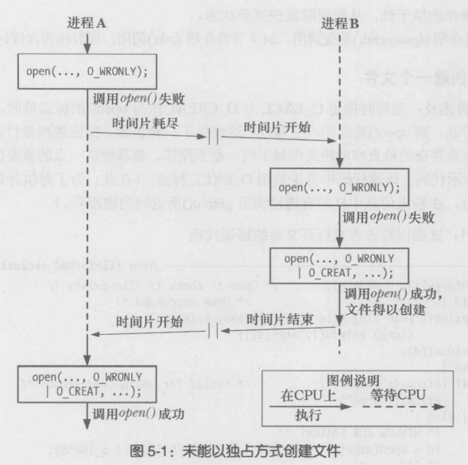
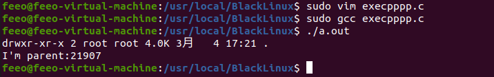

# Linux系统编程

## 一、命令基础

### 1. shell

shell：命令解释器，根据输入的命令执行相应命令


#### 1.1查看shell家族


#### 1.2命令和路径补齐

按下Tab键

#### 1.3历史记录

history


#### 1.4主键盘快捷键

| 功能      | 快捷键    | 助记             |
| --------- | --------- | ---------------- |
| 上        | Ctrl+p    | previous         |
| 下        | Ctrl+n    | next             |
| 左        | Ctrl+b    | backward         |
| 右        | Ctrl+f    | forward          |
| Del       | Ctrl+d    | delete光标后     |
| Home      | Ctrl+a    | the first letter |
| End       | Ctrl+e    | end              |
| Backspace | Backspace | delete光标前     |

### 2. 目录和文件

#### 2.1 类Unix系统目录结构


pwd：查看当前目录

cd ..：回到上一级目录

其中，bin存放可执行文件，boot存放开机应用程序，dev存放设备信息


etc存放用户相关配置信息，home用户目录，lib库路径

## 二、基本概念

### 2.1  OS的核心——内核

管理和分配计算机资源(CPU、RAM和设备)的核心层软件

职责：

- 进程调度
- 内存管理。Linux采用了虚拟内存管理机制，具有以下优势
  - 进程与进程之间、进程与内核之间彼此隔离
  - 只需将进程的一部分保存在内存中

## 三、  文件I/O

### 3.1  概述

所有执行I/O操作的系统调用都以文件描述符，一个非负整数，来指代打开的文件。大多数文件I/O只需用到5个函数：open、read、write、lseek、close。涉及在多个进程间共享资源，==原子操作==的概念十分重要，后续将通过文件I/O以及open函数的参数来进行探讨。

### 3.2  文件描述符

对于内核而言，所有打开的文件都是通过文件描述符引用，文件描述符是一个非负整数。

当打开一个现有文件或创建一个新文件时，内核向进程返回一个文件描述符。当读、写一个文件时，使用open或creat返回的文件描述符标识该文件，并将其作为参数传送给read或write

### 3.3  open函数

open( )调用既能打开一个已存在的文件，又能创建并打开一个新文件。

```c
#include <sys/stat.h>
#include <fcntl.h>
int open(const char *pathname,int flags);
int open(const char *pathname,int flags,mode_t mode);
Return file descriptor on success,or -1 on error
```

要打开的文件有参数```pathname```来标识，若```pathname```是一符号链接，会将其进行解引用。

参数flags为位掩码，用于指定文件的访问模式，常见的模式如下：

| 访问模式 |        描述        |
| :------: | :----------------: |
| O_RDONLY | 以只读模式打开文件 |
| O_WRONLY | 以只写方式打开文件 |
|  O_RDWR  | 以读写方式打开文件 |

open实例：


如果打开一个不存在的文件？

```c
fd=open("textio.cpp",O_RDONLY | O_CREAT,0644);
//当flags中含有O_CREAT这个参数时，必须有第三个参数，这个参数用来表明创建的文件的权限
```

文件权限后续会详述。之后就会了解到，==新建文件的访问权限不仅仅依赖于参数mode，而且受到进程的umask值和可能存在的父目录的 默认方法控制列表==。

#### 3.3.1  open( )调用中的flags参数


```c
//关于O_TRUNC
fd = open("textio.txt",O_RDONLY | O_CREAT | O_TRUNC,0644);
如果textio.txt文件存在，就以只读方式打开并将其截断成0；如果文件不存在就创建文件，并将文件的权限指定为0644
```

#### 3.3.2  open( )函数的错误

- EACCES：文件权限不允许调用进程以flags参数指定的方式打开文件。无法访问文件，原因可能是有目录权限的控制、文件不存在并且也无法创建文件。
- EISDIR：所指定的文件属于目录，而调用者企图打开该文件进行写操作
- EMFILE：进程已打开的文件描述符数量达到了进程资源限制设定的上限
- ENFILE：文件打开的数量已经达到系统设定的上限
- ENOENT：要么文件不存在且未指定O_CREAT标准，要么指定了O_CREAT标志，但pathname参数所指定路径的目录之一不存在
- EROFS：所指定的文件属于只读文件系统，而调用者企图以写方式打开文件
- ETXTBSY：所指定的文件为可执行文件，且正在运行。系统不允许修改正在运行的程序

### 3.4  读取文件内容：read( )

```read( )```系统调用从文件描述符fd所指代的打开文件中读取数据。

```c
#include <unistd.h>
ssize_t read(int fd,void *buffer,size_t count);	//size_t属于无符号整数类型
fd:从指定位置读取数据(文件描述符)
buffer:将读取的数据放入缓冲区
count:表示缓冲区的大小
//ssize_t 有正负的返回值，用来存放(读取的)字节数或者-1(表示错误)
```

如果```read()```调用成功，将返回实际读取的字节数。遇到文件结束(EOF)，则返回0。出现错误则返回-1.

也很多种情况会出现实际读到的字节数少于要求读的字节数。比如管道、FIFO、socket或者终端。

补充：由于表示字节串终止的空字符需要一个字节的内容，所以缓冲区的大小至少需要要比预计读取的最大字符串长度多出一个字节

### 3.5  数据写入文件：write()

```write()```system call将数据写入一个已打开的文件中。

```c
#include <unistd.h>
ssize_t write(int fd, const void *buffer,size_t count);
buffer:要写入文件中数据的内存地址
count: 表示欲从buffer写入文件的数据字节数
fd:文件描述符，指代数据要写入的文件
const
```

```write()```函数调用成功调回**实际写入文件的字节数**，该返回值可能小于```count```参数值，称之为“部分写”。造成原因可能是：

- 磁盘已满
- 进程资源对文件大小的限制(后续讲解)

```c
//实例：通过read()、write()函数进行文件拷贝
#include<stdio.h>
#include<stdlib.h>
#include<string.h>
#include<fcntl.h>
#include<unistd.h>
#include<pthread.h>
int main(int argc ,char *argv[]){
    char buf[1024];
    int n=0;
    int fd1 = open(argv[1],O_RDONLY);
    int fd2 = open(argv[2],O_RDWR | O_CREAT | O_TRUNC,0644);

    while ((n = read(fd1,buf,1024))!=0){
        write(fd2,buf,n);
    }
    close(fd1);
    close(fd2);
    return 0;
}
代码保存为cp.c
```


与```open.c```一致。

题外话，系统编程一般都要检查错误返回

比如上述```cp.c```

```c
 char buf[1024];
    int n=0;
    int fd1 = open(argv[1],O_RDONLY);
	if(fd1 == -1){
		perror("open argv1 error");
        exit(1);
}
//一旦出错，直接结束运行，后续代码也没有必要执行。
```

## 四、深入探究文件I/O

### 4.1  原子操作和竞争条件

所有系统调用都是以原子操作方式执行的。内核保证了某系统调用中的所有步骤会作为独立操作而一次性加以执行，期间不会为其他进程或线程所打断。

原子性规避了竞争状态。竞争状态是这样一种情况：OS共享资源的两个进程，其结果取决于一个无法预期的顺序，即这些进程获得CPU使用权的先后相对顺序。

#### 4.1.1  以独占方式创建一个文件

之前曾提及，当同时指定O_EXCL与O_CREAT作为open()的标志位时，如果打开的文件已然成在，则open()将返回一个错误。这就提供了一种机制，保证进程是打开文件的创建者。对文件是否存在的检查和创建文件属于同一原子操作。




## 六、进程

### 6.1  进程和程序 

进程是一个可执行程序的实例。程序是包含了一系列信息的文件，这些信息描述了如何在运行时创建一个进程。

可以用一个程序创建许多进程，许多进程运行的可以是同一程序。

自此，将进程的定义改写为：**==进程是由内核定义的抽象的实体，并为该实体分配用以执行程序的系统资源。==**从内核角度来看，进程由用户内存空间和一系列内核数据结构组成，其中用户空间包含了程序代码及代码所使用的的变量，而内核数据结构则用于维护进程状态信息。

### 6.2  进程号和父进程号

每个进程都有一个==进程号(PID)==，进程号是一个正数，用以唯一标识系统中的某个进程。

对于各种system call而言，进程号有时可以作为传入参数，有时可以作为返回值。

当需要创建一个对某进程而言唯一的标识符时，进程号就会派上用场。常见的例子是将进程号作为与进程相关文件名的一部分。

```c
#include <unistd.h>
pid_t getpid(void);
getpid()返回值的数据类型是 pid_t，该类型是整数类型，专用于存储进程号。
```

大部分程序与运行该程序的进场号之间没有固定关系。

Linux内核限制进程号≤32767，新进程创建时，内核会按顺序将下一个可用的进程号分配给其用。

一旦进程号达到32767，会将进程号计数器<u>重置为300</u>，因为低数值的进程号为系统进程和守护进程长期占有，在此范围内搜索尚未使用的进程号只会浪费时间。

每个进程都有一个创建自己的父进程

```c
pid_t getppid(void);
```

实际上每个进场进程的父进程号属性反映了系统上所有进程间的树状关系。每个进程的父进程又有自己的父进程，以此类推回溯到==1号进程——init进程==。使用```pstree(1)```命令可以查看这一家族树。

子进程的父进程终止，子进程就会变成“孤儿”。init进程随即收养该进程，，子进程后续对```getppid()```的调用将返回进程号1.

### 6.3  进程内存布局

每个进程所分配的内存由很多部分组成，通常称之为 段。本书中的段是对UNIX系统中进程虚拟内存的逻辑划分。

- 文本段包含了进程运行的程序机器语言指令。具有只读性。因为多个进程可同时运行同一程序，又可将文本段设置为可共享，这样一份程序代码的拷贝可以映射到所有这些进程调度虚拟地址空间中。
- 初始化数据段包含了显式初始化的全局变量和静态变量。
- 未初始化数据段包含了未进行显式初始化的全局变量和静态变量。与经过初始化的全局变量和静态变量分开存放是因为没有必要为未经初始化的变量分配存储空间。
- 栈是一个动态增长和收缩的段。由栈帧组成。系统会为每个当前调用的函数分配一个栈帧。栈帧存储了函数的局部变量、实参和返回值。
- 堆是可在运行时为变量动态进行内存分配的一块区域。堆顶端称作```program break```。


### 6.4  虚拟内存管理


虚拟内存管理技利用了大多数程序的典型特征，即采用访问局部性，以求高效使用CPU和RAM。

- 空间局部性：是指程序倾向于访问在最近访问过的内存地址附近的内存
- 时间局限性：是指程序倾向于在不久的将来再次访问最近刚访问过的内存地址。

虚拟内存的规划之一是将每个程序使用的内存切割成小型的、固定大小的“页”单元。相应地将RAM划分成一系列与虚存页尺寸相同的页帧。

任一时刻，每个程序仅有部分页需要驻留在物理内存帧中。这些页构成了驻留集。

为支持这一方式，kernel需要为每个进场维护一张==页表(page table)==，页表描述了每页在进程虚拟地址空间中的位置。页表中的每个条目要么指出一个虚拟页面在RAM中的所在位置，要么表明其当前驻留在磁盘上。

并非所有的地址范围都需要页表条目。大段的虚拟地址空间并未投入使用，也就没有必要为其维护相应的页表数目，如果进程试图访问的地址并没有页表条目与之对应，进程将会收到一个```SIGSEGV```信号。

由于内核能够为进程分配和释放页(页表条目)，所以进程的有效虚拟地址范围在其生命周期可能发生变化，这可能发生在以下情况：

- 由于栈向下增长超出之前曾到达的位置；
- 在堆中分配或释放内存时，通过调用```brk()```、```sbrk()``` 或```malloc```函数族，来提升```program break```的位置。
- 当调用```shmat()```连接```System V```共享内存区时，或者调用```shmdt()```脱离共享内存区时
- 当调用```mmap()```创建内存映射时，或者调用```munmap()```解除内存映射时

虚拟内存管理使进程的虚拟地址空间与RRAM物理地址隔离开，这有许多优点：

- 进程之间，进程与内核之间相互隔离，使得一个进程不能读取或者修改另一进程或内核的内存，原因是，每个进程的页表条目指向RAM中截然不同的物理页面集合。
- 适当情况下，两个或者多个进程能够共享内存。这是由于内核使不同进程的页表条目指向相同的RAM页。
- 便于实现内存保护机制。多个进程共享RAM页面时，允许每个进程对内存采取不同的保护措施。例如一个进程以只读方式访问某页，另一个进程以读写的方式访问同一页面。
- 程序员和编译器、链接器之类的工具无需关注程序在RAM中物理布局。
- 程序的加载和运行都很快。
- 由于每个进程使用的RAM减少了，RAM中同时可以容纳的进程数量也就多了。

### 6.5  栈和栈帧

要区别用户栈和内核栈区。内核栈是每个进程保留在内核内存中的内存区域，在执行系统调用的过程中供内部函数调用使用。

每个用户栈栈包括了如下信息：

- 函数实参和局部变量。这些变量是在调用函数是自动创建的，因此在C中称之为自动变量。函数返回时这些变量将会被自动销毁，这是因为栈帧会被释放。

- 函数调用的链接信息。每个函数都会用到一些CPU寄存器，比如PC(指向下一条将要执行的机器语言指令)。每当函数调用另一函数时，会在被调用函数的栈帧中保存这些寄存器的副本，以便函数返回时能为函数调用者将寄存器会恢复原状

  

### 6.6  命令行参数(argc，argv)

### 6.7  环境列表

## 七、进程控制

### 7.1  创建新进程：fork()

```c
#include<unistd.h>
pid_t fork(void);
```

完成对其调用后将存在两个进程，且每个进程都会从```fork()```的返回处继续执行。这两个进程将执行相同的程序文本段，但却各自拥有不同的栈段、数据段以及堆段拷贝。子进程的栈、数据段以及栈段开始时是对父进程内存对应各部分的复制。执行```fork()```之后，每个进程均可修改各自的栈数据、以及堆段中的变量，而不影响另一进程。

程序代码则可通过```fork()```的返回值来区分父、子进程。父进程中，fork()将返回新创建子进程的进程ID。而```fork()```子进程返回0。除此以外，子进程可调用```getpid()```获取自身的ID，调用```getppid()```

获取父进程ID。如果无法创建子进程，```fork()```将会返回-1。失败的原因：

- 进程数量超出了系统针对此真实用户在进程数量所施加的限制。
- 触及允许该系统创建的最大进程数这一系统级上限

调用```fork()```后，系统将率先“垂青”于2哪个进程是无法确定的，这种不确定性会导致所谓的竞争条件的错误。

```c
#include<stdio.h>
#include<stdlib.h>
#include<string.h>
#include<unistd.h>
#include<pthread.h>
int main(int argc,char *argv[]){
    printf("before fork-1-\n");
    printf("before fork-2-\n");
    printf("before fork-3-\n");
    printf("before fork-4-\n");
     pid_t pid = fork();
     if(pid == -1){
         perror("fork error");
         exit(-1);
     }
     else if(pid == 0){
         printf("---child is created\n");
     }
     else if(pid > 0){
         printf("---parent process:my child is %d\n",pid);
     }
     printf("==============end of file\n");
     return 0;
}
```


```c
//循环创建n个进程
#include<stdio.h>
#include<stdlib.h>
#include<string.h>
#include<unistd.h>
#include<pthread.h>
int main(int argc,char *argv[]){
    int i;
    pid_t pid;
    for(int i = 0;i<5;i++){
        if(fork()==0)
        break;
    }
    if (i == 5){
        sleep(5);
        printf("I'm parent\n");
    }
    else{
        sleep(i);
        printf("I'm %dth child\n",i+1);
    }
    return 0;
}
```


#### 7.1.1  父、子进程间的文件共享

 子进程和父进程继续执行```fork()```调用后的指令。子进程是父进程的副本。子进程可以获得父进程数据空间、堆、和栈的副本，这是子进程所拥有的的副本。父子进程之间并不共享这些存储空间。父子进程共享正文段。

由于```fork()```之后经常跟着exec，所以很多实现并不执行一个父进程数据段、栈和堆的完全复制。作为替代，使用了==写时复制(Copy-On-Write,COW)==技术。这些区域由父子进程共享，并且内核将它们的访问权限改为只读。

```c
#include<stdio.h>
#include<stdlib.h>
#include<string.h>
#include<unistd.h>
#include<pthread.h>
int var = 100;      //全局变量
int main(int argc,char *argv[]){
    pid_t pid = fork();
    if(pid == -1){
        perror("fork error");
        exit(1);
    }
    else if(pid > 0){
        var = 288;
        printf("parent,var = %d\n",var);
        printf("I'm parent pid = %d,getppid = %d\n",getpid(),getppid());
    }
    else if(pid == 0){
        var = 200;//假设将此句注释掉，child,var 将输出100
        printf("I am child pid = %d,ppid = %d\n",getpid(),getppid());
        printf("child,var = %d\n",var);
    }
    return 0;
}
```


父子进程之间的不同：进程ID、返回值、各自的父进程、进程创建时间、闹钟(定时器)、未决信号集

父子进程的共享：==文件描述符==、==mmap映射区==

### 7.2  exec函数族

当进程调用一种exec函数时，该进程执行的程序完全替换为新程序，而新程序则从其main函数开始执行。通过该调用，进程能以全新程序来替换当前运行的程序。

fork创建子进程后执行的是和父进程相同的程序，子进程往往要调用exec函数以执行另一个程序。

调用exec并不创建新进程，所以调用exec前后该进程的ID并未改变

#### 7.2.1  执行新程序：execve()

系统调用execve()可以将新程序加载到某一进程的内存空间。这一过程将会丢弃旧有程序，进程的栈、数据以及堆段会被新程序的相应部件所替换。

通常将调用这些函数加载一个新程序的过程称作exec操作。

```c
#include <unistd.h>
int execve(const char *pathname,char *const argv[],char *const envq[]);
```

```pathname```包含准备载入当前进程空间的新程序的路径名，既可以是绝对路径也可以是相当于调用进程当前工作目录的相对路径

```argv```指定了传递给新进程的命令行参数。由字符串指针组成的列表，以```NULL```结束。```argv[0]```的值则对应于命令名

```envp```指定了新程序的环境列表。

#### 7.2.2  exec()库函数

```c
#include <unistd.h>
int execle(const char *pathname,const char *arg,...,(char *) NULL,char *const envp[]);
int execlp(const char *filename,const char *arg,...,(char *) NULL);
int execvp(const char *filename,char *const argv[]);
int execv(const char *pathname,char *const argv[]);
int execl(const char *pathname,const char *arg,...,(char *) NULL);
```

```c
#include<stdio.h>
#include<stdlib.h>
#include<string.h>
#include<unistd.h>
#include<pthread.h>
int main(int argc,char *argv[]){
    pid_t pid = fork();
    if(pid == -1){
        perror("fork error");
        exit(1);
    }
    else if(pid == 0){
        execlp("ls","ls","-l","-d","-h",NULL);
        perror("exec error");
        exit(1);
    }
    else if(pid>0){
        sleep(1);
        printf("I'm parent:%d\n",getpid());
    }
    return 0;
}
```



### 7.3  回收子进程

#### 7.3.1  孤儿进程

父进程领先于子进程结束，子进程就会成为孤儿进程。子进程的父进程成为init进程，称为init进程领养孤儿进程

#### 7.3.2  僵尸进程

当一个进程由于某种原因终止时，内核并不是立即把它从系统中清除，进程被保持在一种已终止的状态中，直到被它的父进程回收。当父进程回收已终止的子进程时，内核将子进程的退出状态传递给父进程，然后抛弃已终止的进程，此时开始，该进程就不存在了。

子进程终止，父进程尚未回收。子进程残留资源(PCB)存放于内核中，变成僵尸进程。

如果一个父进程终止了，内核会安排```init```进程成为它的孤儿进程的养父。```init```进程的```PID```为1，是在系统启动时由内核创建的，它不会终止，它是所有进程的祖先。

#### 7.3.3  wait函数

父进程需要知道其某个子进程何时改变了状态——子进程终止或因收到信号而终止。对于许多需要创建子进程的应用来说，父进程能够监测子进程的终止时间和过程是很有必要的。

系统调用```wait()```等待调用进程的任一子进程终止，同时在status所指向的缓冲区中返回该子进程的终止状态

```c
#include <sys/wait.h>
pid_t wait(int *status);
//功能：
//阻塞等待子进程退出
//回收子进程残留资源
//获取子进程结束状态(退出原因)
```

系统调用```wait()```执行如下动作：

- 如果调用进程并无之前未被等待的子进程终止，调用将一直阻塞，直至某个子进程终止。如果调用时已有子进程终止，则```wait()```立即返回
- status非空，那么关于子进程如何终止的信息则会通过status指向的整型变量返回。、
- kernel将会为父进程下所有子进程的运行总量追加进程CPU时间以及资源使用数据
- 将终止子进程的ID作为wait()的结果返回

出错时，```wait()```返回-1。可能的错误原因之一是调用进程并无之前未被等待子进程，此时会将errno置位ECHILD

```C
#include<stdio.h>
#include<stdlib.h>
#include<string.h>
#include<unistd.h>
#include<pthread.h>
#include<sys/wait.h>
int main(int argc,char *argv[]){
    pid_t pid,wpid;
    int status;
    pid = fork();
    if(pid == 0){
        printf("---child,my parent=%d,going to sleep 10s\n",getppid());
        sleep(10);
        printf("-----------child die----------------\n");
    }
    else if(pid > 0){
        wpid  = wait(&status);
        if(wpid == -1){
            perror("wait error");
            exit(1);
        }
        printf("---------parent wait finish\n");
    }
    else{
        perror("fork");
        return 1;
    }
    return 0;
}
```


相关宏的应用

- ```c
  #include<stdio.h>
  #include<stdlib.h>
  #include<string.h>
  #include<unistd.h>
  #include<pthread.h>
  #include<sys/wait.h>
  int main(int argc,char *argv[]){
      pid_t pid,wpid;
      int status;
      pid = fork();
      if(pid == 0){
          printf("---child,my parent=%d,going to sleep 10s\n",getppid());
          sleep(10);
          printf("-----------child die----------------\n");
          return 73;
      }
      else if(pid > 0){
          wpid  = wait(&status);  //如果子进程未终止，父进程阻塞在这个函数上
          if(wpid == -1){
              perror("wait error");
              exit(1);
          }
          if(WIFEXITED(status)){
              //为真，说明子进程正常终止
              printf("child exit with %d\n",WEXITSTATUS(status));
          }
          printf("---------parent wait finish\n");
      }
      else{
          perror("fork");
          return 1;
      }
      return 0;
  }
  ```

  

- ```c
  #include<stdio.h>
  #include<stdlib.h>
  #include<string.h>
  #include<unistd.h>
  #include<pthread.h>
  #include<sys/wait.h>
  int main(int argc,char *argv[]){
      pid_t pid,wpid;
      int status;
      pid = fork();
      if(pid == 0){
          printf("---child,my parent=%d,going to sleep 10s\n",getppid());
          sleep(10);
          printf("-----------child die----------------\n");
          return 73;
      }
      else if(pid > 0){
          //wpid = wait(NULL);  不关心子进程结束原因
          wpid = wait(&status);  //如果子进程未终止，父进程阻塞在这个函数上
          if(wpid == -1){
              perror("wait error");
              exit(1);
          }
          if(WIFEXITED(status)){
              //为真，说明子进程正常终止
              printf("child exit with %d\n",WEXITSTATUS(status));
          }
          if(WIFEXITED(status)){
              //为真，说明子进程是被信号终止
              printf("child kill with signal\n",WTERMSIG(status));
          }
          printf("---------parent wait finish\n");
      }
      else{
          perror("fork");
          return 1;
      }
      return 0;
  }
  ```

#### 7.3.4  waitpid()函数

系统调用```wait()```存在诸多限制，而设计```waitpid()```则意在突破这些限制：

- 如果父进程已经创建了多个子进程，使用```wait()```将无法等待某个特定子进程的完成，只能按顺序等待下一个子进程的终止。
- 如果没有子进程退出，```wait()```总是保持阻塞。有时候会希望执行非阻塞的等待，是否有子进程退出，立判可知
- 使用```wait()```只能发现那些已终止的子进程。对于子进程因某个信号而停止，或是已经停止子进程收到SIGCONT信号后恢复执行的情况就无能为力了。

```c
#include<sys/wait.h>
pid_t waitpid(pid_t pid,int *status,int options);
```

参数pid用来表示需要等待的具体子进程，意义如下：

- 如果```pid>0```，表示等待进程ID为pid的子进程
- 如果```pid=0```，则等待与调用进程(父进程)同一个进程组的所有子进程
- ```pid<-1```，等待进程组标识符与pid绝对值相等的所有子进程
- ```pid=-1```，则会等待任意子进程，```wait```的调用与```waitpid```等价


## 八、进程间通信

Linux环境下，进程地址空间相互独立，每个进程各自有不同的用户地址空间，任何一个进程的全局变量在另一个进程中都看不到，所以进程与进程不能相互访问，要交换数据必须通过内核，在内核中开辟一块缓冲区，进程1把数据从用户空间拷贝到内核缓冲区，进程2再从内核缓冲区把数据读走，内核提供的这种机制称为进程间通信(IPC，InterProcess Communication) 。


### 8.1  管道

给定两个运行不同程序的进程，在```shell```中如何让一个进程的输出作为另一个进程的输入?管道可以用来在相关进程之间传递数据。```FIFO```是管道概念的一个变体，两者之间的一个重要差别在于```FIFO```可以用于任意进程间的通信。

#### 8.1.1  概述

统计一个目录中文件的数目


可以将管道看成一组铅管，它允许数据从一个进程流向另一个进程。两个进程都连接到了管道上，这样写入进程ls就将其标准输出(文件描述符为1)连接到了管道的写入端，读取进程(wc)就将其标准输入(文件描述符为0)连接到管道的读取端。两个进程都不知道管道的存在，它们只是从标准文件描述符中读取数据和写入数据。shell必须要完成相关的工作。

另一个实例：==C/S模型==

同时查看一些C/S程序设计问题：IPC通道需要量、迭代服务器与并发服务器、字节流与消息接口


客户从标准输入读进一个路径名，并把它写入一个IPC管道。服务器从该IPC通道读出这个路径名，并尝试打开其文件来读。如果服务器能打开该文件，它就能读出其中的内容，并写入IPC通道，以作为对客户的响应，否则它就响应一个错误消息。客户随后从该IPC通道读出响应，并把它写到标准输出。如果服务器无法读该文件，那么客户读出的响应将是一个出错消息

#### 8.1.2  管道的特质：

- 作用于有血缘关系的进程之间，调用pipe系统函数即可创建一个管道
- 其本质是一个伪文件(实为内核缓冲区)
- 由两个文件描述符引用，一个表示读端，一个表示写端
- 规定数据从管道的写端流入管道，从读端流出

管道的原理就是：管道实为内核使用环形队列机制，借助内核缓冲区实现

局限性：

- 管道中数据不可反复读取。一旦读走，管道将不再存在
- 采用半双工通信方式，数据只能在单方向上流动
- 数据不能自己写、自己读
- 只能在有公共祖先的进程间使用管道

#### 8.1.3  管道的使用

```c
#include <unistd.h>
int pipe(int fileds[2]);
```

成功调用```pipe()```会在数组fileds中返回两个打开的文件描述符，一个表示管道的读取端(```fd[0]```)，另一个表示管道的写入端(```fd[1]```)。

```c
#include <stdio.h>
#include <stdlib.h>
#include <string.h>
#include <unistd.h>
#include <error.h>
#include <pthread.h>
void sys_err(const char *str){
    perror(str);
    exit(1);
}
int main(int argc,char *argv[]){
    int ret;
    int fd[2];
    pid_t pid;
    char *str = "hello pipe\n";
    char buf[1024];
    ret = pipe(fd);
    if(ret == -1) sys_err("pipe error");
    pip = fork();
    if(pid>0){
        close(fd[0]);   //关闭读端
        write(fd[1],str,strlen(str));
        sleep(1);
        close(fd[1]);
    }
    else if(pid == 0){
        close(fd[1]);	//子进程关闭写端
        ret = read(fd[0],buf,sizeof(buf));
        write(STDOUT_FILENO,buf,ret);
        close(fd[0]);
    }
    return 0;
}
```


使用管道需注意以下4种情况：

- 如果所有指向管道写端的文件描述符都关闭了，但仍然有进程从管道的读端读数据，那么管道中剩余的数据都被读取后，再次read会返回0，就像读到文件末尾一样
- 如果有指向管道写端的文件描述符没关闭，而持有管道写端的进程也没有向管道中写数据，这时有进程从管道读取数据，那么管道中剩余的数据都被读取后，再次read会阻塞，直到管道中有数据可读了才读取数据并返回。
-  如果所有指向管道读端的文件描述符都关闭了，但仍然有进程向管道的写端write，那么该进程会受到信号```SIGPIPE```，通常会导致进程异常终止。后续可以对```SIGPIPE```信号实施捕捉，不终止进程。
- 如果有指向管道读端的文件描述符没有关闭，而持有管道读端的进程也没有从管道中读取数据，这时有现车向管道写端写数据，那么在管道被写满时再次write会阻塞，直到管道中有空位置了才会写入数据并返回

### 8.2  系统`IPC`

#### 8.2.1  消息队列

#### 8.2.2  信号量

#### 8.2.3  信号

#### 8.2.4  共享内存

### 8.3  套接字`socket`

## 九、信号

### 9.1  概念和概述

**<u>信号是事件发生时对进程的通知机制。</u>**也可称为软件中断。

每个信号都有一个名字，它们都以SIG字符开头。都被定义为正整数常量(信号编号)。

产生信号？

- 硬件引发异常
- 用户键入了能够产生信号的终段特殊字符
- 发生了软件事件

### 9.2  相关

Linux内核的进程控制块PCB是一个结构体，task struct，除了包含进程id，状态、工作目录、用户id，组id，文件描述符，还包含了信号相关的消息，主要指阻塞信号集和未决信号集·

- 阻塞信号集(信号屏蔽字)：将某些信号加入集合，对它们设置屏蔽，当屏蔽x信号后，再收到该信号，该信号的处理将推后(解除屏蔽后)

- 未决信号集：
  - 信号产生，未决信号集中描述该信号的位立刻翻转为1，表信号处于未决状态，当信号被处理对应位翻转为0。这一时刻往往非转短暂
  
  - 信号产生后由于某些原因(主要是阻塞)不能抵达，这类信号的集合称之为未决信号集。在屏蔽解除前，信号一直处于未决状态。
  
    
  
    比如说Ctrl-c(终止信号集)位于2号，一旦产生这个信号，2号信号的未决信号集里面对应位变为1
  
    
  
    1就代表着还没被处理，内核会马上进行处理，处理完之后，再把1翻转为0，信号处理完毕。
  
    
  
    如果将这个信号屏蔽了呢？
  
    
  
    1就代表着信号不能抵达，一直处于未决态。直到信号屏蔽字被修改，信号的屏蔽状态才能解除

### 9.3  信号四要素和常规函数一览

- 信号四要素
  - 编号、名称、事件、默认处理动作


### 9.4  信号集

多个信号可使用一个称之为信号集的数据结构来表示，其系统数据类型为`sigset_t`

```c++
#include<signal.h>
int sigemptyset(sigset_t *set);	//初始化由set指向的信号集，清除其中所有信号
int sigfillset(sigset_t *set);	//初始化由set指向的信号集，使其包括所有信号
int sigaddset(sigset_t *set,int signo);	//将一个信号添加到已有的信号集中
int sigdelset(sigset_t *set,int signo);	//从信号集中删除一个信号
int sigismember(const sigset_t *set,int signo);	//判断一个信号是否在集合中，若真返回1，若假返回0  
int sigprocmask(int how,const sigset_t *set,sigset_t *oldset);
```


信号集操作函数使用原理


## N、线程

### N.1  概述

线程是允许应用程序并发执行多个任务的一种机制。如下图所示，一个进程可以包括多个线程。同一程序中的所有线程均会独立执行相同程序，且共享同一份全局内存区域，包括;

- 初始化数据段
- 未初始化数据段
- 堆内存段


N+1、线程间通信方式

1.临界区

2.互斥量

3.信号量

4.条件变量

5.读写锁
