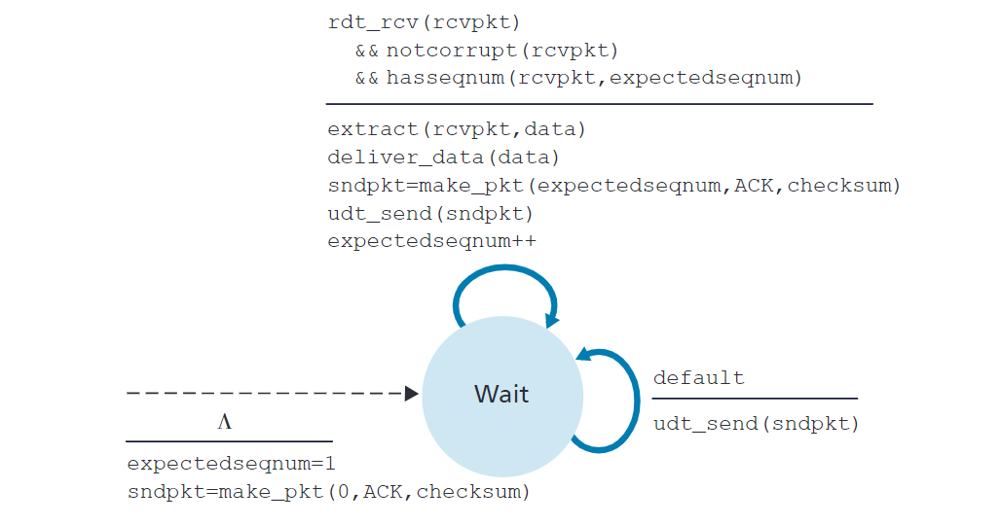

# NetWorking

## 第 1 章 计算机网络和因特网

### 1.1 什么是因特网

#### 1.1.1  具体构成描述

设备称为主机或端系统。端系统通过==通信链路==和==分组交换机==连接到一起。

分组：

- 当一台端系统要向另一台端系统发送数据时，发送端系统将数据分段，并为每段加上首部字节，由此形成的信息包用计算机网络术语来说称为==分组==。


## 第 2 章  应用层

### 2.1  应用层协议原理

#### 2.1.1  网络应用程序体系结构

- 客户——服务器体系结构
  - 客户相互之间不直接通信
  - 服务器具有固定的、周知的地址，并且该服务器总是打开的，客户总是通过向服务器的IP地址发送分组来与其联系
- P2P体系结构
  - 应用程序之间在间断连接的主机对之间使用直接通信，这些主机对被称为对等方。
  - 这些对等方为用户控制的桌面机和膝上机所有
  - 最引人入胜的特性之一是它们的自扩展性。在一个P2P文件共享应用中，尽管每个对等方都由于请求工作产生工作负载，但每个对等方通过向其他对等方分发文件页为系统增加服务能力。
  - 由于高度非集中式结构，面临安全性、性能和可靠性等挑战

#### 2.1.2  进程通信

运行在多个端系统上的程序是如何通信的？

进行通信的实际上进程而不是程序。一个进程可以被认为是运行在端系统的一个程序。

当多个进程运行在相同的端系统上时，它们使用进程间通信机制相互通信。现在只关注运行在不同端系统上的进程间的通信，而不是同一台主机。

在两个不同端系统上的进程，通过跨越计算机网络交换**报文(message)**而相互通信。发送进程生成并向网络中发送报文；接受进程这些报文并可能通过回送报文进行响应。

- 客户和服务器进程
  - 在一对进程之间的通信会话场景中，发起通信(即在该会话开始时发起与其他进程的联系)的进程被标识为**客户(client)**，在会话开始时等待联系的进程是**服务器(server)**。

- 进程与计算机网络之间的接口
  - 进程通过套接字(socket)的软件接口向网络发送报文和从网络接受报文。
  - 进程可类比一座房子，而它的套接字可以类比于它的门。
- 进程寻址
  - 一台主机上运行的进程为了向在另一台主机运行的进程发送分组，接收进程需要有一个地址。需要定义两种信息：
    - 主机的地址
    - 在目的主机中指定接收进程的标识符
  - 主机由其**IP地址(IP address)**标识。IP地址是一个32比特的量且它能够唯一的标识该主机。
  - 发送进程还必须指定运行在接收主机上的接收进程(接收套接字)。目的地**端口号(port number)**用于这个目的。

#### 2.1.3  可供应用程序使用的运输服务

一个运输层协议能够为调用它的应用程序提供什么样的服务？

- 可靠数据传输

- 吞吐量
- 定时
- 安全性

#### 2.1.4  因特网提供的运输服务

由因特网提供的运输服务类型

- TCP服务
  - 包括面向连接服务和可靠数据传输服务
  
  - 当某个应用程序调用TCP作为其运输协议时，该应用程序就能获得来自TCP的这两种服务
  
  - 
  
  - 面向连接的服务
    - 在应用层数据报文开始流动之前，TCP让客户与服务器互相交互运输层控制信息。这个所谓的握手过程提醒客户与服务器，让它们为大量分组的到来做好准备。
    - 在握手阶段后，一个**TCP连接**就在两个进程的套接字之间建立了。
    - 这条连接是全双工的，即连接双方的进程可以在此连接上同时进行报文收发。
    - 当应用程序结束报文发送时，必须拆除该连接
    
  - 可靠的数据传输服务
  
  - TCP协议还具有拥塞控制机制，能为因特网带来整体好处。当发送方和接收方之间的网络出现拥塞时，TCP的拥塞控制机制会抑制发送进程(C/S)。TCP拥塞控制也会试图限制每个TCP连接，使它们达到公平共享网络宽带的目的
  
  - ```C
    ---------------------------------TCP安全------------------------------------
    TCP和UDP都没有提供任何加密机制
    因特网研制的TCP加强版——安全套接字层(Secure Sockets Layer, SSL)。
    用SSL加强后的TCP不仅能够做传统TCP所能做的一切，而且提供了关键的进程到进程的安全性服务。
    这种强化是在应用层上实现的。后续做详解......
    ```
  
- UDP服务

  - 不提供不必要服务的轻量级运输协议，仅提供最小服务。
  - UDP是无连接的，在两个进程通信前没有握手过程。
  - UDP协议提供一种不可靠数据传送服务，当进程将一个报文发送进UDP套接字时，UDP协议并不保证将该报文到达接收进程。
  - 不仅如此，到达接收进程的报文也可能是乱序到达的
  - UDP没有拥塞控制机制。UDP的发送端可以用它选定的任何速率向其下层(网络层)注入数据。


#### 2.1.5  应用层协议

上文提到通过把报文发送进套接字实现网络进程间的相互通信。问题是如何构造这些报文？

应用层协议定义了运行在不同端系统上的应用程序进程如何相互传递报文。

应用层协议定义：

- 交换的报文类型，例如请求报文和响应报文
- 各种报文类型的语法，如报文中的各个字段及这些字段是如何描述的
- 字段的语义，即这些字段中的信息的含义
- 确定一个进程何时以及如何发送报文，对报文响应的规则


### 2.2  Web和HTTP

#### 2.2.1  HTTP概况

Web的应用层协议时超文本传输协议(HyperText Transfer Protocol, HTTP)，它是Web的核心。

HTTP由两个程序实现：一个**客户程序**和一个**服务器程序**。两个程序运行在不同的端系统中，通过交换HTTP报文进行会话。HTTP定义了这些报文的结构以及客户和服务器进行报文交换的方式。

Web页面是由对象组成的。一个对象只是一个文件(HTML文件、JPEG图形、一个Java小程序或者一个视频片段)，且它们可通过一个URL地址寻址。

每个URL地址由两部分组成：**存放对象的服务器主机名**、**对象的路径名**

```c++
http://www.someSchool.edu/someDepartment/picture.gif
```

其中www.someSchool.edu就是主机名，/someDepartment/picture.gif就是路径名。


基本思想：当用户请求一个Web页面(点击一个超链接)时，浏览器向服务器发出对该页面中所包含对象的HTTP请求报文，服务器接收到请求并用包含这些对象的HTTP响应报文进行响应。

HTTP使用TCP作为它的支撑运输协议。

- HTTP客户首先发起一个与服务器的TCP连接。一旦连接建立，该浏览器和服务器进程就可以通过套接字接口访问TCP。
- 客户端的套接字接口是客户进程与TCP连接之间的门，在服务器端的套接字接口则是服务器进程与TCP连接之间的门。
- 客户向它的套接字接口发送HTTP请求报文并从它的套接字接口发送HTTP响应报文。一旦客户向它的套接字接口发送了一个请求报文，该报文就脱离了客户控制并进入TCP控制。

服务器向客户发送被请求的文件，而不存储任何关于该客户的状态信息。所以HTTP是一个**无状态协议(Stateless Protocol)**。Web使用了C/S应用程序体系结构。Web服务器总是打开的，具有一个固定的IP地址，且它服务于可能来自数百万计的不同浏览器的请求。

#### 2.2.2  非持续连接和持续连接

- 采用非持续连接的HTTP
  - 在非持续连接情况下，从服务器向客户传送一个Web页面的步骤。假设该页面含有一个HTML基本文件和10个JPEG图片，这11个对象位于同一台服务器上，假设该HTML文件的URL为：http://www.someSchol.edu/someDepartment/home.index。会发生以下情况：
    - HTTP客户进程在端口号80发起一个到服务器www.someSchool.edu的TCP连接，该端口号是HTTP的默认端口。在客户与服务器上分别有一个套接字与该连接相关联。
    - HTTP客户经它的套接字向该服务器发送一个HTTP请求。请求报文包含了路径名/someDepartment/home.index
    - HTTP服务器进程经它的套接字接受该请求报文，从其存储器中检索出对象`www.someSchol.edu/someDepartment/home.index`，在一个HTP响应报文中封装对象，并通过其套接字向客户发送响应报文。
    - HTTP服务器进程通知TCP断开该连接(实际上直到TCP确认客户已经完整地收到响应报文为止，它才会实际中断连接)
    - HTTP客户接收响应报文，TCP连接关闭。该报文指出封装的对象是一个HTML文件，客户从响应中提取该文件，检查该HTML文件，得到对10个JPEG图形的引用
  - 上例说明了非持续连接的使用，其中每个TCP连接在服务器发送一个对象后关闭，即该连接不为其他的对象而持续下来。
  - 每个TCP连接至传输一个请求报文和响应报文
  - 本例中，当用户请求该Web页面时，要产生11个TCP连接
  - 
    - 估算一下从客户HTML基本文件起到该客户收到整个文件止所花费的时间，给出往返时间(Round-Trip Time, RTT)的定义，现考虑用户点击超链接时会发生什么;
      - 会引起浏览器在它和Web服务器之间发起一个TCP连接
      - 这会涉及一次“三次握手”过程
        - 客户向服务器发送一个小TCP报文段
        - 服务器用一个小TCP报文段做出确认和响应
        - 客户向服务器返回确认
      - 三次握手中前两个部分所耗费的时间占用了一个RTT。
      - 完成了三次握手的前两个部分后，客户结合三次握手的第三部分(确认)向该TCP连接发送一个HTTP请求报文。一旦该请求报文到达服务器，服务器就在该TCP连接上发送HTML文件、该HTTP请求/响应用去了一个RTT。
      - 粗略地讲，总的响应时间就是两个RTT加上服务器传输HTML文件的时间
- 采用持续连续的HTTP
  - 非持续连续有一些缺点;
    - 必须为每一个请求的对象建立和维护一个全新的连接。对于每个这样的连接，在客户和服务器中都要分配TCP的缓冲区和保持TCP变量
    - 每一个对象经受两倍RTT的交付延时
  - 在采用`HTTP1.1`持续连接的情况下，服务器在发送响应后保持该TCP连接打开。在相同的客户与服务器之间，后续的请求和响应报文能够通过相同的连接进行传送。

#### 2.2.3  HTTP报文格式

HTTP规范包含了对HTTP报文格式的定义。HTTP报文有两种：请求报文和响应报文

- 请求报文

  - ```c++
    GET /somedir/page.html HTTP/1.1
    Host: www.someschool.edu
    Connection: close
    User-agent: Mozilla/5.0
    Accept-language:fr
    ```

  - HTTP请求报文的第一行叫做请求行，其后继的行叫做首部行。

  - 请求行有三个字段：**方法字段**、**URL字段**和**HTTP版本字段**

    - 方法字段可以取以下值：GET、POST、HEAD、PUT、DELETE。绝大部分的HTTP请求报文使用GET方法。当浏览器请求一个对象时，使用GET方法，在URL字段带有请求对象的标识。上例中，该浏览器正在请求对象/somedir/page.html。

  - 首部行指明了对象所在的主机。该首部行是必要的，尽管在该主机中已经有一条TCP连接存在了。但该首部行提供的信息是Web代理高速缓存所要求的。

  - 通过Connection: close首部行，该浏览器告诉服务器不要麻烦地使用持续连接，它要求服务器在发送完被请求的对象后就关闭这条连接。

  - User-agent: Mozilla/5.0  首部行用来指明用户代理，即向服务器发送请求的浏览器的类型

  - Accept-language:fr首部行表示用户想得到该对象的法语版本

  - 

​	

- HTTP响应报文

  - ```c++
    HTTP/1.1 200 OK
    Connection: close
    Data: True, 18 Aug 2015 15:44:04 GMT
    Server: Apache/2.2.3 (CentOS)
    Last-Modified: True, 18 Aug 2015 15:11:03 GMT
    Content-Length: 6821
    Content-Type: text/html
    (data data data data data ...)
    ```

  - 响应报文有三个部分：一个初识状态行，6个首部行，实体。实体部分是报文的主要部分，即它包含了所请求的对象本身。

  - 状态行有三个字段：协议版本字段、状态码和响应状态信息

  - 首部行：

    - Connection: close告诉客户，发送完报文后将关闭该TCP连接
    - Data: 首部行指示服务器产生并发送该响应报文的日期和时间，这个时间是服务器从它的文件系统中检索到该对象，将该对象插入响应报文，并发送该响应报文的时间。
    - Server: 首部行指示该报文是由一台Apache Web服务器产生
    - Last-Modified: 首部行指示了对象创建或者最后修改的日期和时间
    - Content-Length: 首部行指示了被发送对象中的字节数
    - Content-Type: 首部行指示了实体体中的对象是HTML文本
    
  - 
  
  - 一些常见的状态码：
  
    - `200 OK`  请求成功，信息在返回的响应报文中
    - `301 Moved Permanently`   请求的对象已经被永久转移了，新的URL定义在响应报文的Location: 首部行中。客户软件将自动获取新的URL
    - `400 Bad Request`  该请求不能被服务器理解
    - `404 Not Found`  被请求的文档不在服务器上
    - `505 HTTP Version Not Supported`  服务器不支持请求报文使用的HTTP协议版本

#### 2.2.4  用户与服务器的交互：cookie

一个Web站点通常希望能够识别用户，可能是希望服务器能够限制用户的访问，或者是希望把内容与用户身份联系起来。

如下图所示，`cookie`技术有4个组件：

- 在HTTP响应报文中有一个`cookie`首部行
- 在HTTP请求报文中有一个`cookie`首部行
- 在客户端系统中保留有一个`cookie`文件，并由用户的浏览器进行管理
- 位于Web站点的一个后端数据库


以下是一个实例：

刘某总是从家中PC使用IE上网，他首次与Amazon.com联系。假定过去他访问过eBay站点。当请求报文到达Amazon Web服务器时，该Web站点将产生一个唯一识别码，并以此为索引在它的后端数据库中产生一个表项。

接下来Amazon Web服务器用一个包含`Set-cookie`: 首部的HTTP响应报文对刘某的浏览器进行响应，其中`Set-cookie`首部的HTTP响应报文对刘某的浏览器进行响应。其中`Set-cookie: `首部含有该识别码。例如该首部行可能是:  `Set-cookie: 1678`

当刘某的浏览器收到了该HTTP响应报文时 ，它会看到该`Set-cookie: `首部。该浏览器在它管理的特定`cookie`文件中添加一行，该行包括服务器的主机名和在`Set-cookie: `首部行中的识别码。

该cookie文件中已经有了用于eBay的表项，因为刘某在过去访问过该站点。

当刘某继续浏览Amazon网站时，每请求一个Web页面，其浏览器就会查询该cookie文件并抽取他对这个网站的识别码，并放到HTTP请求报文中包括识别码的cookie首部行中，特别是发往该Amazon服务器的每个请求报文都包括以下首部行:`Cookie 1678`


cookie可以标识一个用户。用户首次访问一个站点时，可能需要提供一个用户标识(可能是名字)。在后续会话中，浏览器向服务器传递一个cookie首部，从而向该服务器标识了用户。因此cookie可以在无状态的HTTP之上建立一个用户会话层。

#### 2.2.5  Web缓存

**Web缓存器(Web cache)**也叫**代理服务器(proxy server)**，它是能够代表初始Web服务器来满足HTTP请求的网络实体。

Web服务器有自己的磁盘存储空间，并在存储空间中保存最近请求过的对象的副本。


如上图所示，可以配置用户的浏览器，使得用户的所有HTTP请求首先指向Web缓存器。一旦浏览器被配置，每个对某对象的浏览器请求首先被定向到该Web缓存器。

实例如下(浏览器正在请求对象http://www.someschool.edu/mm.gif)：

- 浏览器创建一个到Web缓存器的TCP连接，并向Web缓存器中的对象发送一个HTTP请求。
- Web缓存器进行检查，看看本地是否存储了该对象副本。如果有，Web缓存器就向客户浏览器用HTTP响应报文返回该对象。
- 如果Web缓存器中没有该对象，它就打开一个与该对象的初始服务器(www.someschool.edu)的TCP连接。Web缓存器则在这个缓存器到服务器的TCP连接上发送一个对该对象的HTTP请求。在收到该请求后，初始服务器，向该Web缓存器发送具有该对象的HTTP响应。
- 当Web缓存器接收到该对象时，它在本地存储空间一份副本，并向客户的浏览器用HTTP响应报文发送该副本。

在因特网上部署Web缓存器有两个原因：

- 首先，Web缓存器可以大大减少对客户请求的响应时间，特别是当客户与初始服务器之间的瓶颈带宽远低于客户与Web缓存器之间的瓶颈带宽时更是如此。
- Web缓存器能够大大减少一个机构的接入链路到因特网的通信量。通过减少通信量，该机构就不必急于增加带宽，因此可以降低费用
- Web缓存能从整体上大大减低因特网上的Web流量，从而改善所有应用的性能

现深入理解缓存器带来的好处：


上图有两个网络：机构(内部)网络、公共因特网的一部分。

机构网络是一个高速的局域网，它的一台路由器与因特网上的一台路由器通过一条15Mbps的链路连接。这些初始服务器与因特网相连但位于全世界各地。

假设对象的平均长度为1Mb，从机构内的浏览器对这些初始服务器的平均访问速率为每秒15个请求。

假设HTTP请求报文小到可以忽略，因而不会在网络中以及接入链路上产生什么信息量。

总的响应时间，即从浏览器请求一个对象到接收到该对象为止的时间，是局域网延时、接入时延(即两台路由器之间的时延)和因特网时延之和。

现粗略估算时延：

- 局域网上的流量强度是`(15个请求/s) × (1Mb/请求) / (100Mbps) = 0.15 `
- 接入链路上的流量强度`(15个请求/s) × (1Mb/请求) / (15Mbps) = 1`

局域网上强度为0.15的通信量通常导致数十毫秒的时延，因此可以忽略局域网时延。然而流量强度接近1，链路上的时延会变得非常大且无限长。

解决办法：在机构网络中安装一个Web缓存器。方案如下图：


实践中的命中率(由一个缓存器所满足的请求的比率)通常在0.2 ~ 0.7之间。假设该机构的缓存命中率为0.4。因为客户和缓存连接在一个相同的高速局域网上，这样40%的请求将几乎立即会由缓存器得到响应，时延约在10ms以内。然而剩下的60%仍然要由初始服务器满足。这种方案响应时延略大于1.2秒，效果明显。

通过使用**内容分发网络(Content Distribution NetWork, CDN)**，Web缓存器在因特网中发挥着越来越重要的作用。

#### 2.2.6  条件GET方法

尽管高速缓存能减少用户感受到的响应时间，但也引入了一个新问题，即存放在缓存器中的对象副本可能是陈旧的。换句话说，保存在服务器中的对象自副本缓存在客户上以后可能已经被改变了。

HTTP协议有一种机制，允许缓存器证实它的对象是最新的。这种机制就是**条件GET(conditional GET)方法**。

如果：

- 请求报文使用GET方法
- 并且请求报文中包含一个`If-Modified-Since: `首部行。那么这个HTTP请求报文就是一个条件GET请求报文。

实例：

一个代理缓存器代表一个请求浏览器，向某Web服务器发送一个请求报文：

```c++
GET /fruit/kiwi.gif HTTP/1.1
Host: www.exotiquecuisine.com
```

响应报文：

```c++
HTTP/1.1 200 OK
Date: Sat 3 Oct 2015 15:39:29
Server: Apache/1.3.0 (Unix)
Last-Modified: Wed, 9 Sep 2015 09:23:24
Content-Type: image/gif

(data data data data ...)
```

该缓存器在将对象转发到请求的浏览器的同时，也在本地缓存了该对象。重要的是，缓存器在存储该对象时也存储了最后修改日期。一个星期后，另一个用户经过该缓存器请求同一个对象，该对象仍在这个缓存器中。由于在过去的一个星期中位于Web服务器上的该对象可能已经被修改了，该缓存器通过发送一个条件GET执行最新检查。该缓存器可能发生：

```c++
GET /fruit/kiwi.gif HTTP/1.1
Host: www.exotiquecuisine.com
If-modified-since: Wed, 9 Sep 2015 09:23:24
```

该条件GET报文告诉服务器，仅当自指定日期之后该对象被修改后，才发送该对象。假设该对象自上述时间后没有被修改过。接下来第四步，Web服务器向该缓存器发送一个响应报文：

```c++
HTTP/1.1 304 Not Modified
Date: Sat, 10 Oct 2015 15:39:29
Server: Apache/1.3.0 (Unix)
(empty entity body)
```

作为对该条件GET方法的响应，该Web服务器仍发送一个响应报文，但没有在该响应报文中包所请求的对象。包含对象只会浪费带宽，并增加用户感受到的响应时间。

状态行中为`304 Not Modified`，告诉缓存器可以使用该对象，能向请求的浏览器转发它(该代理缓存器)缓存的该对象副本。

### 2.3  因特网中的电子邮件

电子邮件是一种异步通信媒介，即当人们方便时就可以收发邮件，不必与他人的计划进行协调。

下图为因特网电子邮件系统的总体情况：


有3个主要组成部分：==用户代理==、==邮件服务器==、==简单邮件传输协议==

- 用户代理
  - 允许用户阅读、回复、转发、保存和撰写报文、
  - $A \rightarrow B$: 当A完成邮件撰写时，他的邮件代理向其邮件服务器发送邮件，此时邮件放在邮件服务器的外出报文队列中。当B要阅读报文时，他的用户代理在其邮件服务器的邮箱中取得该报文
- 邮件服务器
  - 每个接收方(B)在其中的某个邮件服务器上有一个邮箱。B的邮箱管理和维护着发送给他的报文。

 邮件先略过


### 2.4  DNS: 因特网的目录服务

因特网上的主机的一种标识方法是用它的主机名(hostname)，如`www.facebook.com, gaia.cs.umass.edu`等等，这些名字便于被记忆也乐于被人们接受。然而，主机名几乎没有提供关于主机在因特网中位置的信息，所以，主机也可以可以使用所谓**==IP地址==**进行标识。

一个IP地址由4个字节组成，有着严格的层次结构。

#### 2.4.1  DNS提供的服务

上述可知，人们喜欢便于记忆的主机名标识方式，而路由器则喜欢定长的、有着层次结构的IP地址。为了折中，需要一种能进行主机名到IP地址切换的目录服务，这就是**域名系统(Domain Name System,  DNS)**的主要任务。

DNS是：

- 一个由分层的DNS服务器实现的分布式数据库
- 一个使得主机能够查询分布式数据库的应用层协议。

DNS服务器是运行在BIND软件的UNIX机器。DNS协议运行在UDP之上。

```java
--------------------------------------实践原则-----------------------------------
```

与HTTP、FTP、SMTP协议一样，DNS协议是应用层协议。

- 使用C/S模式运行在通信的端系统之间
- 在通信的端系统之间通过下面的端到端运输协议来传送DNS报文

实例：一个浏览器请求URL `www.someschool.edu/index.html`页面时会发生什么现象：

- 同一台用户主机上运行着DNS应用客户端
- 浏览器从上述URL中抽取主机名，并将这台主机名传给DNS应用的客户端
- DNS客户向DNS服务器发送一个包含主机名的请求
- DNS客户最终会收到一份回答报文，其中包含对应于该主机名的IP地址
- 一旦浏览器接收到来自DNS的该IP地址，它能够向位于该IP地址80端口的HTTP服务器进程发起一个TCP连接

除了进行主机名到IP地址的转换，DNS还提供了以下服务;

- 主机别名
- 邮件服务器别名
- 负载分配
  - DNS也用于在冗余的服务器之间进行负载分配。繁忙的站点被冗余分布在多台服务器上，每台服务器均运行在不同的端系统上，每个都有着不同的IP地址。
  - 一个IP地址集合因此与同一个规范主机名相联系。
  - DNS数据库中存储着这些IP地址集合。当客户对映射到某地址集合的名字发出一个DNS请求时，该服务器用IP地址的整个集合进行响应，但在每个回答中循环这些地址次序。因为客户通常总是向IP地址排在最前面的服务器发送HTTP请求报文。所以DNS就在所有这些冗余的Web服务器之间循环分配了负载。

#### 2.4.2  DNS工作机理概述

某些应用程序需要将主机名转换为IP地址。这些应用程序将调用DNS的客户端，并指明需要被转换的主机名。用户主机上的DNS接收到后，向网络中发送一个DNS查询报文。所有的DNS请求和回答报文使用UDP数据报经端口53发送，经过时延后，用户主机上的DNS收到一个DNS回答报文。这个映射结果被传递到调用DNS的应用程序。

DNS是一个在因特网上实现分布式数据库的精彩范例。

- 分布式、层次数据库
  - 为了处理扩展性问题，DNS使用了大量的DNS服务器，它们以层次方式阻止，分布在全世界范围内。没有一台服务器在因特网上拥有所有主机的映射。大致有3类服务器：**根DNS服务器**、**顶级域(Top-Level Domain, TLD)DNS服务器**、**权威DNS服务器**
  - 
  - 根DNS服务器
    - 有400多个根服务器遍及全世界。提供TLD服务器的IP地址。
  - 顶级域服务器
    - 对于每个顶级域(比如`com、org、net、edu和gov`)和所有国家的顶级域(uk、fr、ca)，都有TLD服务器
  - 权威DNS服务器
    - 在因特网上具有公共可访问主机的每个组织都必须提供公共可访问的DNS记录，这些记录将这些主机的名字映射为IP地址

实例：主机`cse.nyu.edu`想知道主机`gaia.cs.umass.edu`的IP地址。同时假设纽约大学的`cse.nyu.edu`主机的本地DNS服务器为`dns.nyu.edu`，`gaia.cs.umass.edu`的权威DNS服务器是`dns.umass.edu`。


- 首先，主机cse向它的本地DNS服务器dns.nyu.edu发送一个DNS查询报文。该查询报文包含被转换的主机名gaia。
- 本地DNS服务器将该报文转发到根DNS服务器
- 该根DNS服务器注意到其edu的前缀并向本地返回负责edu的TLD的IP地址列表。
- 该本地DNS服务器再次向这些TLD服务器之一发送查询报文。
- 该TLD服务器注意到umass.edu前缀，并用权威DNS服务器的IP地址进行响应，该权威DNS服务器是负责dns.umass.edu
- 最后，本地DNS服务器直接向dns.umass.edu重发查询报文，dns.umass.edu用gaia.cs.umass.edu的IP地址进行响应

以上过程，为了获得一台主机名的映射，共发送了8份DNS报文，查询和回答各4份。

上例利用了递归查询和迭代查询。从cse.nyu.edu到dns.nyu.edu发出的查询是递归查询，因为该查询以自己的名义请求dns.nyu.edu。后继的3个查询是迭代查询。


- DNS缓存(DNS caching)
  - 在一个请求链中，当某DNS服务器接收一个DNS回答(例如，包含某主机名到IP地址的映射)时，它能将映射缓存在本地存储器中。

#### 2.4.3  DNS记录和报文

共同实现DNS分布式数据库的所有DNS服务器存储了资源记录(Resource Record, RR)，RR提供了主机名到IP地址的映射。每个DNS回答报文包含了一条或多条RR。

资源记录是一个包含了下列字段的4元组：

```python
(Name, Value, Type, TTL)
//TTL是该记录的生存时间，决定了该资源应当从缓存中删除的时间
```


- DNS报文
  - 只有DNS查询和回答报文
  - 
  - 前12个字节是首部区域，其中有几个字段。
    - 第一个字段(标识符)是一个16比特的数，用于标识该查询。这个标识符会被复制到对查询的回答报文中，以便让客户用它来匹配发送的请求和接收到的回答。


### 2.5  P2P文件分发


### 2.6 视频流和内容分发网


### 2.7  套接字编程：生成网络应用

#### 2.7.1  UDP套接字编程

运行在不同机器上的进程彼此通过向套接字发送报文来进行通信。每个进程好比一个房子，该进程的套接字好比是一扇门。应用程序位于房子中门的一侧；运输层位于改、该门朝外的一侧。应用程序开发者在套接字的应用层一侧可以控制所有东西


#### 2.7.2  TCP套接字编程

C/S能够互相发送数据之前，它们要先握手和创建一个TCP连接。当创建该TCP连接时，将其与客户套接字地址和服务器套接字地址关联起来。使用创建的TCP连接，当一侧要向另一侧发送数据时，它只需经过其套接字将数据丢进TCP连接。这与UDP不同，UDP服务器将在分组丢进套接字之前必须附上一个目的地地址。


## 第 3 章  运输层

运输层位于应用层和网络层之间，该层为运行在不同主机上的应用程序提供直接的通信服务。

### 3.1  概述和运输层服务

运输层协议为在不同主机上的应用进程之间提供了逻辑通信功能。

从应用进程来看，通过逻辑通信，运行不同进程的主机好像直接相连一样。实际上不是这样。这通过很多路由器以及多种类型的链路相连，应用进程使用逻辑层提供的逻辑通信功能彼此发送报文，而无须考虑承载这些报文的物理基础设施的细节。


如上图所示，运输层协议是在端系统中实现的，而不是在路由器中实现的。

#### 3.1.1  运输层与网络层的关系

网络层提供了主机之间的逻辑通信，而运输层为运行在不同主机上的进程之间提供了逻辑通信。下例来分析这种差异。

两个家庭，一个美国东海岸，一个美国西海岸，每家12个孩子，这些孩子每个星期都需要互相写信，每封信都用单独的信封通过传统的邮政服务传送，因此，每个家庭每个星期向另一家发送144封信。

每个家庭有一个孩子负责收发邮件，西海岸Ann，东海岸家庭是Bill。每个星期Ann去她的所有兄弟姐妹那里收集信件，并将这些信件交到邮政车上。当信件到达西海岸家庭时，Ann页=也负责将信件分别发到她的兄弟姐妹手上，东海岸家庭的Bill也负责类似工作。

在整个例子中，邮政服务为两个家庭提供逻辑通信，将信件从一家送往另一家，而不是从一个人另一个人。

另一方面，Ann和Bill为兄弟姐妹之间提供了逻辑通信，从兄弟姐妹角度来看，Ann和Bill就是邮件服务

```c++
应用层报文 = 信封上的字符
进程 = 兄弟姐妹
主机(端系统) = 家庭
运输层协议 = Ann和Bill
网络层协议 = 邮政服务
```

运输层协议只工作在端系统中，在端系统中，运输层协议将来自应用进程的报文移动到网络边缘(网络层)

#### 3.1.2  因特网运输层概述

简化术语，将TCP和UDP的分组统称为报文段，将数据报名称保留给网络层分组。

先简单介绍下因特网中的网络层。网络层协议中有一个名字叫IP，即网际协议。IP为主机之间提供了逻辑通信。IP的服务模型是尽力而为交付模型。

IP尽它最大的努力在通信的主机之间交付报文段，但它并不做任何确保，特别的，他不确保报文段的交付，不保证报文段的按序交付，不保证报文段中数据的完整性。由于这些原因，IP称为不可靠服务。

除此之外，每台主机至少有一个网络层地址，即所谓的IP地址，每台主机有一个IP地址。

UDP和TCP最基本的责任是，将两个端系统之间IP的交付服务扩展为运行在端系统上的两个进程之间的交付服务。将主机间交付拓展到进程间交付被称为==运输层的多路复用==与==多路分解==。UDP和TCP还可以通过在其报文段首部中包括差错检查字段而提供完整性检查。UDP所能提供的仅有的两种服务：

- 进程到进程的数据交付
- 进程到进程的差错检查

上述两种服务也是最低限度的运输层服务。

TCP为应用程序提供了几种附加服务。首先它提供==**可靠数据传输**==。还提供拥塞控制，防止任何一条TCP连接用过多流量来淹没通信主机之间的链路和交换设备

### 3.2  多路复用与多路分解

运输层的多路复用与多路分解，也就是将由网络层提供的主机到主机交付服务延伸到为运行在主机上的应用程序提供进程到进程的交付服务。

实例：计算机中有4个应用进程在运行，2个Telent、1个FTP进程、1个HTTP进程。当计算机运输层从底层的网络层接收数据时，它需要将所接收的数据定向到这4个进程中的一个，现在探讨如何完成的？


一个进程有一个或多个套接字，它相当于从网络向进程传递数据和从进程向网络传递数据。因此，接收主机中的运输层并没有直接将数据交付给进程，而是将数据交给了一个中间的socket。由于在任一时刻，在接收主机上可能有不止一个套接字，所以每个套接字都有一个唯一的标识符。

现考虑接收主机怎样将一个到达的运输层报文段定向到何时的套接字。

每个运输层报文段中具有几个字段。在接收端，运输层检查这些字段，标识出接收套接字，进而将报文定向到该套接字。将运输层报文中的数据交付到正确的套接字的工作称作**==多路分解(demultiplexing)==**。在源主机从不同套接字中收集数据块，并为每个数据块封装上首部信息从而生成报文段，然后将报文段传递到网络层，这些工作叫**==多路复用(multiplexing)==**。

实际运作：

运输层多路复用的要求：

- 套接字有唯一标识符
- 每个报文段有特殊字段来指示该报文段所要交付到的套接字
- 
- 如上图所示，这些特殊字段是源端口号字段和目的端口号字段

所以运输层是这样实现分解服务的：

在主机上的每个套接字能够分配一个端口号，当报文段到达主机时，运输层检查报文段中的目的端口号，并将其定向到相应的套接字。然后报文段中的数据通过套接字进入其所连接的进程。

- **无连接的多路复用与多路分解**

  - ```python
    clientSocket = socket(AF_INEF,SOCK_DGRAM)
    *创建了一个UDP套接字
    clientSocket.bind((' ',19157))
    *通过套接字bind()为这个UDP套接字关联一个特定的端口号
    ```

  - 运输层自动的为该套接字分配一个端口号

    - 现假定主机A一个进程具有UDP端口19157，它要发送一个应用程序数据块给位于主机B的另一个进程，该进程具有UDP端口46428。主机A中的运输层创建一个运输层报文段，其中包括应用程序数据、源端口号(19157)、目的端口号(46428)和其他两个值
    - 然后运输层将得到的报文段传递到网络层。网络层将该报文段封装到一个IP数据报中，并尽力而为地将报文段交付给接收主机。
    - 该报文段到达B，接收机运输层检查该报文段的目的端口号(46428)，并将该报文段交付给端口号46428所标识的套接字。

  - 源端口号的用途？

    - 
    - 从A到B的报文段中，源端口号用作"返回地址"的一部分，当B需要回发一个报文段给A时，B到A的报文段中的目的端口号便从A到B的报文段中的源端口号中取值。

- **面向连接的多路复用与多路分解**

  - TCP套接字是由一个四元组(源IP地址，源端口号，目的IP地址，目的端口号)来标识的。

  - 

    - TCP服务器应用程序有一个“欢迎套接字”，它在12000号端口上等待来自TCP客户的连接建立请求

    - TCP客户使用下面的代码创建一个套接字并发送一个连接建立请求报文段：

      ```python
      clientSocket = socket(AF_INEF,SOCK_STREAM)
      clientSocket.connect = ((serverName,12000))
      ```

    - 一条连接建立请求只不过是一个目的端口号12000，TCP首部的特定“连接建立位”置位的TCP报文段。这个报文段也包含一个由客户选择的源端口号。

    - 当运行服务器进程的计算机的主机操作系统接收到具有目的端口12000的连接请求报文段后，它就定位服务器进程，该进程在端口号12000等待接受连接。该服务器进程则创建一个新的套接字：

      ```python
      connectionSocket,addr = serverSocket.ACCEPT()
      ```

    - 该服务器的运输层还注意到连接请求报文段的4个值

- Web服务器与TCP

连接套接字与进程之间并非总是有着一一对应的关系，In fact，当今的高性能Web服务器通常只使用一个进程，但是为每个新的客户连接创建一个具有新连接套接字的新线程。

### 3.3  无连接运输：UDP

UDP只是做了运输协议能够做的最少工作。除了复用/分解功能及少量的差错检测外，它几乎没有对IP增加别的东西。

UDP从应用程序得到数据，附加上用于多路复用/分解服务的源、目的端口号字段，以及两个其他的字段，然后将形成的报文段交给网络层。网络层将该运输层报文段封装到一个IP数据报中，然后尽力而为地尝试将该报文段交付给接收主机。

使用UDP时，在发送报文段之前，发送方和接收方的运输层实体之间没有握手。正因如此，UDP被称为是无连接的。

TCP提供了可靠数据传输服务，而UDP不提供，那么TCP是否总是首选的呢？答案是否定的，原因基于以下：

- 关于发送什么数据以及何时发送的应用层控制更为精细。
  - 采用UDP时，只需要应用进程将数据传递给UDP，UDP就会将此数据打包进UDP报文段并立即将其传递给网络层。另一方面，TCP有一个拥塞控制机制，以便当源、目的主机间的一条或多条链路变得极度拥塞来遏制运输层TCP发送方。
- 无须建立连接
- 无连接状态
  - TCP需要在端系统中维护连接状态。包括接收和发送缓存、拥塞控制参数以及序号与确认号的参数
- 分组首部开销小
  - UDP仅有8字节的首部开销


#### 3.3.1  UDP报文段结构


UDP首部只有4个字段，每个字段有2个字节。长度字段指示了在UDP报文段中的字节数。

#### 3.3.2  UDP检验和

UDP检验和提供了差错检测功能。检测和确定当UDP报文段从源到目的地移动时，其中的比特是否发生了改变

UDP为什么提供了检验和，其原因是不能保证源和目的之间的所有链路都提供了差错检测。

### 3.4  可靠数据传输原理

下图是可靠数据传输的框架


为上层实体提供的服务抽象是：数据可以通过一条可靠的信道进行传输。借助于可靠信道，传输数据比特就不会受到损坏或丢失，而且所有数据都是按照其发送顺序进行交付。这恰好就是TCP调用它的因特网应用所提供的的服务模型。

实现这种服务抽象是**可靠数据传输协议**的责任。

现考虑当底层信道能够损坏比特或丢失整个分组时，需要什么样的协议。假设是分组将以发送的次序进行交付，某些分组可能会丢失。如上图所示，通过调用`rdt_send()`函数，上层可以调用数据传输协议的发送方。它把要发送的数据交付给位于接收方的较高层。在接收端，当分组从信道的接收端到达时，将调用`rdt_rcv()`。当rdt协议想要向较高层交付数据时，将调用`deliver_data()`来完成。

#### 3.4.1  构造可靠数据传输协议

- 经完全可靠信道的可靠数据传输：rdt1.0
  - 现假设底层信道是完全可靠的。成称该协议为`rdt1.0`
  - 
  - 上图显示了`rdt1.0`发送方和接收方有限状态机(Finite-State Machine，FSM)的定义
  - a图中的FSM定义了发送方的操作，b图定义了接收方的操作
  - rdt的发送端只通过`rdt_send(data)`事件接受来自较高层的数据，产生一个包含该数据的分组(由`make_pkt(data)`动作)，并将分组发送到信道中。
  
- 经具有比特差错信道的可靠数据传输：rdt2.0
  - 基于重传机制的可靠数据传输协议称为==自动重传请求(Automatic Repeat reQuest，ARQ)协议==
  
  - ARQ协议还需要另外三种协议功能来处理存在比特差错的情况：
    - **差错检测**
      - 需要一种机制以使接收方检测到何时出了比特差错。
      - 要求有额外的比特从发送方发送到接收方
  
    - **接收方反馈**
      - `rdt2.0`协议将从接收方向发送方回送ACK和NAK分组
  
    - **重传**
      - 接收方收到有差错的分组时，发送方将重传该协议。
  
  - 
  
    
  
    - 上图中的数据传输协议采用了差错检测、肯定确认与否定确认
    - rdt2.0的发送端有两个状态。
      - 最左边发送端协议正等待来自上层传下来的数据。当`rdt_send(data)`事件出现时，发送方将产生一个包含待发送数据的分组，带有检验和，然后经由`udt_send(sndpkt)`操作发送该分组。
      - 最右边状态中，发送方协议等待来自接收方的ACK或NAK分组。如果收到一个ACK分组，则分组正确接收，协议返回到等待上层的数据的状态。如果收到一个NAK分组，该协议重传上一个分组并等待接收方为响应重传分组而回送的ACK或NAK。
      - 当发送方处于等待ACK或者NAK的状态时，它不能从上层获得更多的数据
      - `rdt2.0`协议又被称为停等(stop-and-wait)协议
    - rdt2.0接收方的FSM仍然只有单一状态。当分组到达时，接收方要么回答一个ACK，要么回答一个NAK，这取决于收到的分组是否受损。
    
  - 针对ACK或者NAK分组受损，发送方无法知道接收方是否正确这一问题，解决方法是**在数据分组添加一新数据，让发送方对其数据分组编号**，即将发送数据分组的序号放在该字段。
  
    - ​	
    - 
      - 协议rdt2.1使用了从接收方到发送方的肯定确认和否定确认。当.
    - 
  
- 经具有比特差错的丢包信道的可靠数据传输：rdt3.0

  - 现假定比特受损外，底层信道还会丢包。协议现在必须处理两个问题：怎样检测丢包以及发生丢包后该做些什么


#### 3.4.2  流水线可靠数据传输协议

rdt3.0并非令所有人满意，问题的核心在于它是一个停等协议。性能低！

解决方法：不以停等方式运行，允许发送方一次发送多个分组而无须等待确认。下图是两种比较：


流水线技术对可靠数据传输协议带来以下影响：

- 必须增加序号范围，因为每个输送的分组必须有一个唯一的序号，而且也许有多个在输送中的未确认报文。
- 协议的发送方和接收方两端也许不得不缓存多个分组。发送方最低限度应当能缓冲那些已发送但没有却的分组。
- 所需序号范围和对缓冲的要求取决于数据传输协议如何处理丢失、损坏及延时过大的分组。解决流水线的差错恢复有两种基本方法：==回退N步(Go-Back-N,GBN)==和==选择重传(Selective Repeat,SR)==

#### 3.4.3  回退$N$步

在GBN协议中，允许发送方发送多个分组而不需要等待确认，但它也受限于在流水线中未确认的分组数不能超过某个最大允许数N。


上图显示了发送方看到的GBN协议的序号范围。将基序号(base)定义为最早未确认分组的序号，将下一个序号(nextseqnum)定义为最小的未使用序号(即下一个待发分组的序号)，可将序号范围划分为4段。

如上图所示，那些已被发送但还未被确认的分组的许可序号可以看成是一个在序号范围内长度为N的窗口。GBN协议也被称为**滑动窗口协议(sliding-window protocol)**。

为什么先要限制这些已被发送，未被确认的分组的数目为N？流量控制是一个原因，TCP拥塞控制是另一个原因。

下面是基于ACK，无NAK的GBN协议的发送方的扩展FSM描述




GBN发送方必须响应三种类型的事件:

- 上层的调用。
  - 上层调用rdt_send()，发送方必须坚持发送窗口是否已满，是否有N个已发送但未被确认的分组。如果窗口未满，则产生一个分组并将其发送，并相应地更新变量。if窗口已满，发送方将数据返回给上层，隐式地指示上层该窗口已满。实际中，发送方更可能缓存这些数据，或者使用同步机制允许上层在仅当窗口不满时调用rdt_send()。
- 收到一个ACK。
  - 在GBN协议中，对序号为n的分组的确认采取累积确认的方式，表明接收方已正确收到序号为n的分组以及之前的分组。
- 超时事件

#### 3.4.4  选择重传

选择重传协议通过让发送方仅重传那些它怀疑在接收方出错的分组而避免了不必要的重传。

这种个别的、按需的重传要求接收方逐个地确认正确接收的分组，再次用窗口长度N来限制流水线中未完成、未被确认的分组数。

下图显示了SR发送方看到的序号空间。


SR接收方将确认一个正确接收的分组而不管其是否按序。失序的分组将被缓存直到所有失序分组皆被收到为止，这时才可以将一批分组按序交付给上层。

SR发送方的事件与动作：

- 从上层收到数据
  - 当上层接收到数据后，SR发送方检查下一个可用于该分组的序号。如果序号位于发送方的窗口内，则将数据打包并发送。否则就像在GBN咿呀NG，要么将数据缓存，要么将返回给上层以便后续传输。
- 超时
  - 定时器再次被用来防止丢失分组。然而每个分组都必须拥有其自己的定时器，因为超时发生后只能发送一个分组。
- 收到ACK
  - 如果收到ACK，该分组序号在窗口内，则SR发送方将那个被确认的分组标记为已接收。如果该分组的序号等于`send_base`，则窗口基序号向前移动到具有最小序号的未确认分组处。如果窗口移动了并且有序号落在窗口内的未发送分组，则发送这些分组。

SR接收方的事件与动作：

- 暂略过...


### 3.5  面向连接的运输：TCP

TCP是因特网运输层的面向连接的可靠的运输协议。

#### 3.5.1  TCP连接

TCP被称为是**面向连接**的，是因为在一个应用进程可以开始向另一个应用进程发送数据之前，这两个进程必须先相互“握手”，它们必须相互发送某些预备报文段，以建立确保数据传输的参数。

作为TCP连接建立的一部分，连接的双方都将初始化与TCP连接相关的许多TCP状态变量。

这种连接是一种逻辑连接，其共同状态仅保留在两个通信端的TCP程序中。中间路由器对TCP连接完全视而不见，它们看到的是数据报，而不是你连接。TCP协议只在端系统运行，而不在中间的网络元素中运行，所以中间的网络元素不会维持TCP连接状态。

TCP连接提供的是**全双工服务(full-duplex service)**：如果一台主机上的进程A与另一台主机上的进程B存在一条TCP连接，那么应用层数据就可以在进程B流向进程A的同时，也从进程A流向进程B。

TCP连接是点对点的，在单个发送方与单个接收方之间的连接。

现研究TCP连接是怎样建立的。

假设某台主机上的一个进程想与另一台主机上的一个进程建立一条连接。发起连接的这个进程称为客户进程，另一个进程称为服务器进程。该客户应用进程首先要通知客户运输层，它想与服务器上的一个进程建立一条连接。通过下例程序实现。

```python
clientSocket.connect((serverName,serverPort))
*serverName是服务器的名字，serverPort标识服务器上的进程*
```

**三次握手(three-way handshake):**

- 客户首先发送一个特殊的TCP报文段，服务器用另一个特殊的TCP报文段来响应。
- 客户再用第三个特殊报文段作为响应。


客户进程通过套接字传递数据流。数据一旦通过该门，它就由客户中运行的TCP控制了。TCP将这些数据引导到该连接的**发送缓存(send buffer)**里，发送缓存是发起三次握手期间设置的缓存之一。接下来TCP就会是不是从发送缓存里取出一块数据，并将数据传递到数据层。

TCP可从缓存中取出并放入报文段中的数据数量受限于**最大报文段长度(Maximum Segment Size, MSS)**。

TCP为每块客户数据配上一个TCP首部，从而形成多个TCP报文段(TCP segment)。这些报文段被下传到网络层，网络层将其分别封装在网络层IP数据段中。

然后这些IP数据报被发送到网络中。当TCP在另一端接收到一个报文段后，该报文段的数据就被放入该TCP连接的接收缓存中。

#### 3.5.2  TCP报文段结构

TCP报文段由首部字段和一个数据字段组成。数据字段包含一块应用数据。


首部包括源端口号和目的端口号，用于多路复用/分解来自或送到上层应用的数据。TCP首部也包括**检验和字段(checksum field)**。TCP报文段首部还包括以下：

- 32比特的**序号字段(sequence number field)**和32比特的**确认号字段(acknowledge number field)**。实现可靠数据传输服务。
- 16比特的**接收窗口字段(receive window field)**，用于流量控制，指示接收方愿意接受的字节数量。
- 4比特的**首部长度字段(header length field)**，指示了以32比特为单位的TCP首部长度。
- 可选与变长的**选项字段(options field)**，用于发送方与接收方协商最大报文段长度(MSS)时，或在高速网络环境下用作调节因子时使用。
- 6比特的**标志字段(flag field)**。
  - **ACK比特**用于确认字段中的值是有效的。
  - **RST、SYN和FIN比特**用于连接建立和拆除。
  - **PSH比特**被置位时，指示接收方应立即将数据交给上层。
  - **UGR比特**用来指示报文段里存在着被发送端的上层实体置为“紧急”的数据
  - 在明确拥塞通告中使用了**CWR和ECE比特**。

##### a.  序号和确认号

TCP报文段首部中两个最重要的字段是序号字段和确认号字段。

TCP把数据看成一个无结构、有序的字节流。从TCP对序号的使用上可以看出，因为序号是建立在传送的字节流之上，而不是建立在传送的报文段的序列上。

举例，主机A的某应用进程想通过一条TCP连接向主机B的一个进程发送一个数据流。A中的TCP将隐式地对数据流中的每一个字节编号。假定数据流由一个包含字节的文件组成，其MSS为1000字节，数据流的首字节编号是0。该TCP将为数据流构建500个报文段。第一个报文段为分配序号为0，第二个为1000，.....每个序号被填入到相应TCP报文段首部的序号字段。


一个报文段的序号因此是该报文段首字节的字节流编号。

现考虑确认号。TCP是全双工的。从主机B到达的每个报文段都有一个序号用于从B流向A的数据。主机A填充进报文段的确认号是主机A期望从主机B收到的下一字节的序号。

主机A已经收到一个来自主机B的包含字节0~535的报文段，以及另一个包含字节900-1000的报文段，由于某种原因主机A没有收到536-899的报文段。A为了重新构建B的数据流，仍在等待字节536以及后面的字节。因此，A到B的下一个报文段将在确认号字段中包含536。因为TCP只确认该流中至第一个丢失字节为止的字节，所以TCP被称为提供**累计确认(cumulative acknowledge)**。

另一个问题，A在收到第二个报文段(536-899)之前收到第三个报文段(900-1000)，因此第三个报文段失序到达。两个选择：**接收方立即丢弃失序报文段**、**接收方保留失序的字节，并等待缺少的字节以填补该间隔。**

##### b.  Telnet：序号和确认号的一个学习案例

暂时跳过

#### 3.5.3  往返时间的估计与超时

TCP通过超时/重传机制来处理报文段的丢失问题。

最明显的问题是超时间隔长度的设置，超时间隔必须大于该连接的往返时间(RTT)。

##### a.  估计往返时间

TCP是如何估计发送方与接收方之间往返时间的？

`Answer:  `报文段的样板RTT就是从从某报文段被发出(交给IP)到对该报文段的确认被收到之间的时间量。大多数TCP的实现仅在某个时刻做一次SampleRTT测量，非每个发送的报文段测量一个SampleRTT。

由于路由器的拥塞以及端系统负载的变化，SampleRTT的值会随之波动。为了估计一个典型的RTT，要采取某种对SampleRTT取平均的方法。TCP维持一个EstimatedRTT，一旦获得一个新的SampleRTT时，TCP通过下列公式来更新EstimatedRTT
$$
EstimatedRTT=(1-\alpha)\cdot EstimatedRTT+\alpha \cdot SampleRTT
$$
除了估算RTT之外，测量RTT的变化也是有价值的。RTT偏差：`DevRTT`。

##### b.  设置和管理重传超时间隔

超时间隔应该大于等于EstimatedRTT，否则将造成不必要的重传。但是超时间隔也不能比EstimatedRTT大太多，否则当报文段丢失时，TCP不能很快的重传该报文段，导致数据传输时延大。可以将超时间隔设为Estimated加上一定余量。此处DevRTT值派上用场了。
$$
TimeoutInterval=EstimatedRTT+4\cdot DevRTT
$$

#### 3.5.4  可靠数据传输

因特网的网络层服务(IP服务)是不可靠的。IP不保证数据报的交付。不保证数据报的按序交付，也不保证数据报中数据的完整性。

TCP在IP不可靠的尽力而为服务之上创建了一种可靠数据传输服务。TCP的可靠数据传输服务确保一个进程从其接收缓存中读出的数据流是无损坏、无间隙、非冗余和按序的数据流。

下例程序给出了一个TCP发送方高度简化的描述

```python
/*假设发送方不受TCP流量和拥塞控制的限制，来自上层数据的长度小于MSS，且数据传送只在一个方向进行。*/
NextSeqNum=InitialSeqNumber
SendBase=InitialSeqNumber
loop(forver){
	switch(event)
    	event:data received from application above
    		create TCP segment with sequence number NextSeqNum
    		/*生成具有序号NextSeqNum的TCP报文段*/
    		if(timer currently not running)
    			start timer
    		pass segment to IP	/*向IP传递报文段*/
    		
}
```

TCP发送方有3个与发送和重传有关的主要事件：**从上层应用程序接收数据**、**定时器超时**和**收到ACK**。

一旦第一个事件发生，TCP从应用程序接收数据，将数据封装在一个报文段中，并把该报文段交给IP，每一个报文段都包含一个序号。这个序号是该报文段第一个数据字节的字节流编号。

还要注意到该定时器还没有为某些其他报文段运行，则当报文段被传给IP时，TCP就启动该定时器，定时器的过期间隔是TimeoutInterval

第二个事件就是超时。TCP通过重传引起超时的报文段来响应超时事件。然后TCP重启定时器。

发送方必须处理的第三个事件，到达一个来自接收方的确认报文段。事件发生时，TCP将ACK的值y与它的变量SendBase进行比较。TCP状态变量SendBase是最早未被确认的字节的序号。

##### a.  一些有趣的情况


第一种情况，A向B发送一个报文段。假设报文段的序号是92，包含8字节数据。发出该报文段之后，A等待一个来自主机B确认号为100的报文段。虽然B收到了，但从B发往A的确认报文丢失了。然后超时事件就会发生，A会重传相同的报文段。当然，当B收到该重传的报文段时，它就会通过序号发现该报文段包含了早已收到的数据，因此B中的TCP将会丢弃该重传的报文段中的这些字节。


第二种情况中，A连续发回了两个报文段。第一个报文段序号是92，包含8字节数据；第二个报文段序号是100，包含20字节数据。假设两个报文段都完好无损地到达主机B，并且主机B为每一个报文段发送一个确认。第一个确认报文确认号是100，第二个确认报文的确认号是120.现在假设在超时之前这两个报文段都没有到达主机A，当超时事件发生时，主机A重传序号为92的第一个报文段，并重启定时器。

只要第二个报文段的ACK在新的超时发生以前到达，则第二个报文将不会被重传。


第3种情况，假设主机A与第二种情况完全一样，发送两个报文段。第一个报文段的确认报文在网络丢失，但在超时事件发生之前主机A收到一个确认号为120的确认报文。主机A知道主机B已经收到了序号为119及之前的所有字节，所以主机A不会重传这两个报文段中的任何一个。

##### b.  超时间隔加倍

每当超时事件发生时，TCP重传具有最小序号的还未被确认的报文段。只是每次TCP重传时都会将下一次的超时间隔设置为先前值的两倍。

每当定时器在另两个事件(收到上层应用的数据和收到ACK)中的任意一个启动时，TimeoutInterval由最近的EstimatedRTT与DevRTT值推算得到。

##### c.  快速重传

超时触发重传存在的问题之一是*超时周期可能相对较长*。当一个报文段丢失时，这种长超时周期迫使发送方延迟重传丢失的分组，因而增加了端到端时延。幸运的是，发送方通常可在超时事件发生之前通过任意所谓的冗余ACK来较好的检测到丢包情况。**冗余ACK**就是再次确认某个报文段的ACK，而发送方已经收到对该报文段的确认。

下表是TCP接收方的ACK生成策略。

| 事件                                                         | TCP接收方动作                                                |
| ------------------------------------------------------------ | ------------------------------------------------------------ |
| 具有所期望序号的按序报文段到达。所有在期望序号及以内的数据都已经被确认 | 延迟的ACK。对另一个按序报文段的到达最多等待500ms。如果下一个按序报文段在这个时间间隔内没有到达，则发送一个ACK |
| 具有所期望序号的按序报文段到达。另一个按序报文段等待ACK传输  | 立即发送单个累积ACK，以确认两个按序报文段                    |
| 比期望序号大的失序报文段到达。检测出间隔                     | 立即发送冗余ACK，指示下一个期待字节的序号                    |
| 能部分或完全接收数据间隔的报文段到达                         | 倘若该报文段起始于间隔的低端，立即发送ACK                    |

当TCP接收方收到这样一个报文段(其序号大于下一个所期望的、按序的报文段)，它检测到了数据流中的一个间隔，这就是说有报文段丢失。这个间隔可能是由于在网络中报文段丢失或重新排序造成的。因为TCP不使用否定确认，所以接收方不能向发送方发挥一个显式的否定确认。相反，它只是对已经接收到的最后一个按序字节数据进行重复确认(产生一个冗余的ACK)。

因为发送方经常一个接一个发送大量的报文段，如果一个报文段丢失，就很可能引起一个接一个的冗余ACK。如果TCP发送方接收到对相同数据的3个冗余ACK，这就说明这个已被确认过3次的报文段之后的报文段已经丢失。

一旦收到3个冗余ACK，TCP就执行**快速重传**，即在该报文段的定时器过期之前重传丢失的报文段。


##### d.  是回退N步还是选择重传

`Question:  `TCP是一个GBN协议还是一个SR协议？

TCP确认是累积式的，正确接收但失序的报文段是不会被接收方逐个确认的。

TCP发送方仅需要维持以发送过但未被确认的字节的最小序号(SendBase)和下一个要发送的字节的序号(NextSeqNum)。这看起来像GBN协议，但这两个协议还是有显著区别的。

例子：发送方发送一组报文段1,2,3...N，并且所有的报文段都按序无差错地到达接收方时会发生的情况。假设分组n<N的确认报文丢失，但其余N-1个确认报文在分别超时以前到达发送端。这种情况下，GBN不仅会重传分组n，还会重传所有后继分组n+1，n+2，...，N。另一方面，TCP最多重传报文段n，如果报文段n+1的确认报文在报文段n超时之前到达，TCP都不会重传报文段n。

对TCP提出的修改是所谓的**选择确认(selective acknowledge)**，它允许TCP接收方有选择的确认失序报文段，而不是累积地确认最后一个正确接收的有序报文段。

#### 3.5.5  流量控制

一条TCP连接的每一侧主机都为该连接设置了接收缓存。当该TCP连接收到正确、按序的字节后，它就将数据放入到接收缓存。

TCP为它的应用程序提供了**流量控制服务(flow-control service)**以消除发送方使接收方缓存溢出的可能性(应用程序读取数据较慢，而发送方发送得太多)。

流量控制是一个速度匹配服务，发送方都是发送速率与接收方应用程序的读取速率相匹配。

==注意和拥塞控制两者的区别！！！！！！！！！==

TCP通过让发送方维护一个称为**接收窗口(receive window)**的变量来控制流量控制。接收窗口用于给发送方一个指示——该接收方还有多少可用的缓存空间。因为TCP是全双工通信，在连接两端的发送方都各自维护一个接收窗口。

假设A通过一条TCP连接向B发送一个大文件。主机B为该连接分配了一个接受缓存，并用RcvBuffer来表示其大小。主机B上的应用程序不时地从该缓存中读取数据。现定义以下变量：

- LastByteRead:  主机B上的应用程序从缓存读出的数据流的最后一个字节的编号
- LastByteRcvd:  从网络中到达的并且已放入主机B接收缓存中的数据流的最后一个字节的编号

TCP不允许已分配的缓存溢出，所以
$$
LastByteRcvd-LastByteRead≤RcvBuffer
$$
接收窗口用rwnd表示：
$$
rwnd=RevBuffer-[LastByteRcvd-LastByteRead]
$$


连接是如何使用变量rwnd来提供流量控制服务的呢？主机B通过把当前的rwnd值放入它发给主机A的报文段接收窗口字段中，通知主机A它在该连接的缓存中还有多少可用空间。

主机A轮流跟踪两个变量，LastByteSent和LastByteAcked，两者之差就是主机A发送到连接中但未被确认的数据量。通过将未确认的数据量控制rwnd以内，就可以保证主机A不会使主机B的接收缓存溢出。

这种方案还存在一个技术问题。假设B的接收缓存已经存满，使得rmnd=0。在将rmnd=0通知给主机A之后，还要假设B没有任何数据要发送给A。因为主机B将缓存情况，TCP并不向主机A发送带有rwnd新值的新报文段。

事实上，TCP仅当在它有数据或有确认要发送时才会发送报文段给主机A。这样，主机A不可能知道B的接收缓存已经有了新的空间。A被阻塞不能再发送数据。

为了解决问题，TCP规范要求：当主机B的接收窗口为0时，主机A继续发送只有一个字节数据的报文段，这些报文段会被接收方确认，最终缓存将开始清空，并且确认报文将包含一个非0的rmnd值。

#### 3.5.6  TCP连接管理

一条TCP连接是如何建立的。

假设一台主机(客户)上的一个进程想与另一台主机(服务器)上的一个进程建立一条连接。客户应用进程首先通知客户TCP，它想建立一个与服务器上某个进程之间的连接。客户中的TCP就会用以下方式与服务器中的TCP建立一条TCP连接：

- Step_1:  客户端的TCP首先向服务器端的TCP发送一个特殊的TCP报文段。。该报文段不包含应用层数据。但是在报文段的首部中的一个标志位(SYN比特)置为1。因此，这个特殊报文段被称为SYN报文段。另外，客户还会随机选择一个初始序号，并将此序号放置于该起始的TCP SYN报文段的序号字段中。该报文段会被封装在一个IP数据报中，并发送给服务器。

- Step_2:  一旦包含TCP SYN报文段的IP数据报到达服务器主机，服务器会从该数据报中提取出TCP SYN报文段，为该连接分配TCP缓存和变量，并向客户TCP发送允许连接的报文段(在完成三次握手的第三步之前分配这些缓存和变量，使得TCP易于受到SYN洪泛的拒绝服务服务)。这个允许连接的报文段不包含应用层数据。但报文段的首部包含3个重要信息。

  - SYN比特被置为1.
  - TCP报文段首部的确认号字段被设置为`client_isn+1`
  - 服务器选择自己的初始序号(`server_isn`)，并将其放置到TCP报文段首部的序号字段中。

  该允许连接的报文段被称为**SYNACK报文段(SYNACK segment)**。

- Step_3:  在收到SYNACK报文段之后，客户也要给该主机连接分配缓存和变量。最后一个报文段对服务器的允许连接进行了确认(客户将server_isn+1)放置到TCP报文段首部的确认字段来完成此项工作。建立已经连接，所以该SYN比特被置为0。该三次握手的第三个阶段可以在报文段负载中携带客户到服务器的数据。


参与一条TCP连接的两个进程中的任何一个都能终止该连接。当连接结束后，主机中的“资源”(缓存和变量)将被释放。


假设某客户打算关闭连接。客户应用进程发出一个关闭连接命令。这会引起客户TCP向服务器进程发送一个特殊的TCP报文段(让其首部中的一个标志位——FIN比特被设置为1)。服务器接收到该报文段后，就向发送方回送一个确认报文段。然后服务器发送它自己的终止报文段，其FIN比特被置为1。最后，该客户对服务器的终止报文段进行确认。此时，在两台主机上用于该连接的所有资源都被释放了。


以下是客户TCP和服务器TCP会经历的典型TCP状态

- 客户TCP
  - 
  - 客户TCP开始时处于**CLOSED**(关闭)状态。客户的应用程序发起一个新的TCP连接。这引起客户中的TCP向服务器中的TCP发送一个SYN报文段。
  - 在发送给SYN报文段后，客户TCP进入了**SYN_SENT**状态。
  - 客户处于SYN_SENT状态时，等待来自服务器TCP的对客户所发报文段进行确认且SYN比特被置为1的一个报文段。
  - 收到这样一个报文段之后，客户TCP就进入**ESTABLISHED**状态。
  - 假设客户应用程序决定要关闭该连接这引起客户TCP发送一个带有FIN比特被置为1的TCP报文段，并进入**FIN_WAIT_1**状态。当处于FIN_WAIT_1状态时，客户TCP等待一个来自服务器的带有确认的TCP报文段。
  - 当它接收到该报文段时，客户TCP进入**FIN_WAIT_2**状态。
  - 当处在FIN_WAIT_2状态时，它等待来自服务器的另一个FIN比特被置为1的另一个报文段。
  - 当收到该报文段后，客户TCP对服务器的报文段进行确认，并进入**TIME_WAIT**状态。
  - 假定ACK丢失，TIME_WAIT状态使TCP客户存储最后的确认报文。
  - 经过等待后，连接就正式关闭，客户端所有资源将被释放。

提一嘴SYN洪泛攻击。攻击者发送大量的TCP SYN报文段，而不完成第三次握手的步骤。随着这种SYN报文段纷至沓来，服务器不断为这些半开连接分配资源(但从未使用)，导致服务器的连接被消耗殆尽。

现通过**==SYN cookie==**来防御。

详细过程暂略过...


- 服务器TCP
  - 


### 3.6  拥塞控制原理

实践中，丢包一般是网络变得拥塞时路由器缓存溢出导致的。为了处理网络拥塞原因，需要一些机制在面临网络拥塞时遏制发送方。

网络拥塞为什么是一件badthing？网络拥塞是如何在上层应用得到的服务性能中显露出来？

#### 3.6.1  拥塞原因与代价

- Case_1:  两个发送方和一台具有无穷大缓存的路由器
  - 
  - 最简单的情况，两台主机(A和B)都有一条连接，且这两条连接共享源与目的地之间的单跳路由。
  - 假设A中的应用程序以$\lambda_{in}$字节/秒的平均速率将数据发送到连接中。


### 3.8  TCP连接的建立和终止_总结-UNP

#### 3.8.1  三次握手

建立一个TCP连接时会发生下述情形：

- 服务器必须准备好接收外来的连接。通常通过调用`socket`、`bing`和`listen`这三个函数来完成。称之为**被动打开**。
- 客户端通过``connect`发起主动打开。这导致客户TCP发送一个SYN分节，它告诉服务器客户将在(待建立的)连接中发送的数据的初始化序列号。通常SYN不携带数据，其所在IP数据报只含有一个IP首部、一个TCP首部及可能有的TCP选项
- 服务器必须确认(ACK)客户的SYN，同时自己也得发送一个SYN分节。它含有服务器将在同一连接中发送数据的初始序列号。服务器在单个分节中发送SYN和对客户SYN的ACK(确认)。
- 客户必须确认服务器的SYN


客户的初始序列号为J，服务器的初始序列号为K。ACK中的确认号是发送这个ACK的一端所期待的下一个序列号。

因为SYN占据1字节的序列号空间，所以每一个SYN的ACK中的确认号就是该SYN的初始序列号+1。

#### 3.8.2  TCP选项

每一个SYN可以包含多个TCP选项，下面是常用的TCP选项。

- MSS选项。发送SYN的TCP一端使用MSS通告对端它的最大分节大小，即它在本连接的每个TCP分节中愿意接受的最大数据量。发送端使用接收端的MSS值作为所发送分节的最大大小。
- 窗口规模选项。TCP连接任何一端能够通告对端的最大窗口大小是65535。
- 时间戳选项。可以防止由失而复得的分组可能造成的数据破坏。

#### 3.8.3  TCP连接终止

TCP终止一个连接需要4个分节

- 某个应用进程首先调用`close`，称该段执行主动关闭。该端的TCP发送一个`FIN`分节，表示数据发送完毕。
- 接收到这个FIN的对端执行被动关闭。这个FIN由TCP确认。它的接收也作为一个文件结束符传递给接收端应用进程，FIN的接收意味着接收端应用进程在相应连接上再无额外数据可接收。
- 一段时间后，接收到这个文件结束符的应用进程将调用close关闭它的套接字。这导致它的TCP也发送一个FIN。
- 接收这个最终FIN的原发送端TCP确认这个FIN。


# TCP/IP网络编程

## Part1  开始网络编程

### 一、理解网络编程和套接字

#### 1.1  理解网络编程和套接字

网络编程就是编写程序使两台连网的计算机相互交换数据。

套接字是网络数据传输的软件设备。

```c
#include <sys/socket.h>
int socket(int domain,int type,int protocol);
//成功时返回文件描述符，失败时返回-1
int bind(int sockfd,struct sockaddr *myaddr,socklen_t addrlen);
//成功时返回0，失败时返回-1
int listen(int sockfd,int backlog);
//成功时返回0，失败时返回-1
int accept(int sockfd,struct sockaddr *addr,socklen_t *addrlen);
//成功时返回文件描述符，失败时返回-1
```

`socket`函数生成套接字。

`bind`函数给套接字分配地址(IP地址和端口号)

总之，网络编程中接受连接请求的套接字创建过程如下：

- 调用`socket`函数创建套接字
- 调用`bind`函数分配IP地址和端口号
- 调用`listen`函数转为可接受请求状态
- 调用`accept`函数受理连接请求

#### 1.2  基于Linux的文件操作

##### a.  底层文件访问和文件描述符

此处的文件描述符是系统统一分配给文件或套接字的整数。

文件和套接字一般经过创建过程才会被分配文件描述符。

```c
#include <sys/types.h>
#include <sys/stat.h>
#include <fcntl.h>
#include <unistd.h>
//打开文件
//第一个参数是打开的目标文件夹及路径信息
//第二个参数是文件打开模式
int open(const char *path,int flag);

//关闭文件
int close(int fd);

//将数据写入文件
//size_t是通过typedef声明的unsigned int类型
//ssize_t是typedef声明的signed int类型
//第一个参数fd是显式数据传输对象的文件描述符
//第二个参数buf是保存传输数据的缓冲地址值
//第三个参nbytes是要传输数据的字节数
ssize_t write(int fd,const void *buf,size_t nbytes);

//读取文件中的数据
//第一个参数fd是显式数据接收对象的文件描述符
//第二个参数buf是要保存接收数据的缓冲地址值
//第三个参数nbytes是接收数据的最大字节数
ssize_t read(int fd,void *buf,size_t nbypes);
```

#### 1.3  基于Windows平台的实现

略

#### 1.4基于Windows的套接字相关函数及实例

略

### 二、套接字类型与协议设置

#### 2.1  套接字协议及其数据传输特性

协议是对话中使用的通信规则。即计算机对话必备通信规则。

- 创建套接字

  - ```c
    #include <sys/socket.h>
    int socket(int domain,int type,int protocol);
    //成功时返回文件描述符，失败时返回-1
    domain		是套接字中使用的协议族信息
    type		是套接字数据传输类型信息
    protocol	是计算机通信中使用的协议信息
    ```

- 协议族

  - | 名称      | 协议族               |
    | --------- | -------------------- |
    | PF_INET   | IPv4互联网协议族     |
    | PF_INET6  | IPv6互联网协议族     |
    | PF_LOCAL  | 本地通信的UNIX协议族 |
    | PF_PACKET | 底层套接字的协议族   |
    | PF_IPX    | IPX Novell协议族     |

  - 套接字中实际采用的最终协议信息是通过第个三参数传递的。在指定的协议族访问内通过第一个参数决定第三个参数。

- 套接字类型

  - socket函数第一个PF_INET协议族中也存在多种数据传输方式。
  - 决定了协议族并不能同时决定数据传输方式。
  - 套接字类型1：==面向连接的套接字(SOCK_STREAM)==
    - 传输过程中数据不会消失
    - 按序传输数据
    - 传输的数据不存在数据边界
    - 可靠的、按序传递的、基于字节的面向连接的数据传输方式的套接字
  - 套接字类型2：==面向消息的套接字(SOCK_DGRAM)==
    - 强调快速传输而非传输顺序
    - 传输的数据可能丢失也可能损毁
    - 传输的数据有数据边界
    - 限制每次传输的数据大小
    - 不可靠的、不按序传递的、以数据的高速传输为目的的套接字

- 协议的最终选择

  - socket函数的第三个参数，该参数决定最终采用的协议

  - 基于同一协议族中存在多个数据传输方式相同的协议这一问题，数据传输方式相同，但协议不同，此时需要提供第三个参数具体指定协议信息。

  - TCP套接字

    - ```c
      int tcp_socket=socket(PF_INET,SOCK_STREAM,IPPROTO_TCP);
      ```

  - UDP套接字

    - ```c
      int udp_socket=socket(PF_INET,SOCK_STREAM,IPPROTO_UDP);
      ```

#### 2.2  Windows平台下的实现及验证

略

### 三、地址族与数据序列

#### 3.1  分配给套接字的IP地址与端口号

- 网络地址
  - IP地址分为两类。
    - IPv4(Internet Protocol version 4)    4字节地址族
      - 
      - 分为网络地址和主机地址，且分为A、B、C、D、E(已被预约，一般不使用)等类型
    - IPv6(Internet Protocol version 6)    16字节地址族

- 网络地址分类与主机地址边界
  - 只需要IP地址的第一个字节即可判断网络地址占用的字节数，因为是根据IP地址的边界区分网络地址
    - A类地址的首字节范围：0-127
    - B类地址的首字节范围：128-191
    - C类地址的首字节范围：192-223
- 用于区分套接字的端口号
  - IP用于区分计算机，只要有IP地址就可以向目标主机传输数据，但仅凭这些无法传输给最终的应用程序。
  - 端口号就是在同一操作系统内为区分不同套接字而设置的，因此无法将1个端口号分配给不同套接字。
  - 端口号由16位构成，可分配的端口号范围是0-65535。0-1023是知名端口，一般分配给特定应用程序
  - 数据传输目标地址同时包含IP地址和端口号，数据才会被传送到最终的应用程序。

#### 3.2  地址信息的表示

应用程序中使用的IP地址和端口号以结构体的形式给出了定义。

- 表示IPv4地址的结构体

  - ```c
    
    struct sockadder_in{
    	sa_family_t sin_family;		//地址族
        uint16_t sin_port;			//16位TCP/UDP端口号
        struct in_addr sin_addr;	//32位IP地址
        char sin_zero[8];			//不使用
    };
    上述结构体提到的另一个结构体in_addr定义如下，用来存放32位IP地址
    struct in_addr{
      	In_addr_t s_addr;			//32位IPv4地址  
    };
    ```

- 结构体sockaddr_in的成员分析

  - 成员sin_family

    - 每种协议族适用的地址族均不同。IPv4适用4字节地址族，IPv6适用16字节地址族

    - | 地址族   | 含义                             |
      | -------- | -------------------------------- |
      | AF_INET  | IPv4网络协议中使用的地址族       |
      | AF_INET6 | IPv6网络协议中使用的地址族       |
      | AF_LOCAL | 本地通信中采用的UNIX协议的地址族 |

  - 成员sin_port

    - 保存16位端口号，以网络字节序保存

  - 成员sin_addr

    - 保存32位IP地址信息，且以网络字节序保存

  - 成员sin_zero

    - 无特殊含义

#### 3.3  网络字节序与地址变换

- 字节序与网络字节序

  - CPU向内保存数据有两种方式，CPU解析数据的方式也分两种
    - 大端序：高位字节存放到低位地址
      - 0x20开始的地址中保存4字节int类型数0x12345678
      - 
    - 小端序：高位字节存放到高位地址
      - 

  - 网络字节序：在通过网络传输数据时约定统一方式，统一为大端序。

- 字节序转换

  - 转换字节序的函数
    - htons() ntohs()  htonl()  ntohl()
    - h代表主机(host)的字节
    - n代表网络(network)字节
    - s代表short
    - l代表long
    - htons代表：把short类型数据从主机字节序转化为网络字节序

#### 3.4  网络地址的初始化与分配.

- 将字符串信息转换为网络字节序的整数型

  - sockaddr_in中保存地址信息的成员为32位整数型

  - ```c
    #include <arpa/inet.h>
    in_addr_t inet_addr(const char * string);
    成功时返回32位大端序整数型值，失败时返回INADDR_NONE
    向函数传递类似211.214.107.99的点分十进制格式的字符串，会将其转换为32位整数型数据并返回
    ```

  - 实际中，更多的是利用以下函数。该函数利用了in_addr结构体

  - ```c
    int inet_aton(const char * string,struct in_addr * addr);
    string:  含有需转换的IP地址信息的字符串地址
    addr:    将保存转换结果的in_addr结构体变量的地址值
    ```

- 网络地址初始化

  - ```c
    struct sockaddr_in addr;
    char * serv_ip = "211.217.168.13";	//声明IP地址字符串
    char * serv_port = "9190";			//声明端口号字符串
    memset(&addr,0,sizeof(addr));		//结构体变量addr的所有成员初始化为0
    add.sin_family = AF_INET;			//指定地址族
    add.sin_addr.s_addr = inet.addr(serv_ip);			//基于字符串的IP地址初始化
    add.sin_port = htons(atoi(serv_port));				//基于字符串的端口号初始化
    ```

- 客户端地址信息初始化

  - 服务端的准备工作通过bind函数完成，而客户端通过connect函数完成。因此函数调用前需要准备的地址值类型也不同
  - 服务端声明sockaddr_in结构体变量，将其初始化为赋予服务端IP和套接字的端口号，然后调用bind函数
  - 而客户端声明sockaddr_in结构体，并初始化要与之连接的服务器套接字的IP和端口号，然后调用connect函数

- INADDR_ANY

  - 利用常熟INADDR_ANY分配服务器端的IP地址，采用这种方式，可以自动获取运行服务器端的计算机IP地址，不必亲自输入。

- 向套接字分配网络地址

  - 把初始化的地址信息分配给套接字

  - ```c
    int bind(int sockfd,struct sockaddr * myaddr,socklen_t addrlen);
    成功时返回0，失败返回-1
    ```

  - sockfd    要分配地址信息的套接字文件描述符

  - myaddr   存有地址信息的结构体变量地址值

  - addrlen   第二个结构体变量的长度

  - 服务器端常见套接字初始化过程

    - ```c
      int serv_sock;
      struct sockaddr_in serv_addr;
      char * serv_port = "9190";
      
      //创建服务器端套接字(监听套接字)
      serv_sock = socket(PF_INET,SOCK_STREAM,0);
      
      //地址信息初始化
      memset(&serv_sock,0,sizeof(serv_addr));
      serv_addr.sin_family = AF_INET;
      serv_addr.sin_addr.s.addr = htonl(INADDR_ANY);
      serv_addr.sin_port = htons(atoi(serv_port));
      
      //分配地址信息
      bind(serv_sock,(struct sockaddr *) &serv_addr,sizeof(serv_addr));
      ```

#### 3.5  基于Windows的实现

略

### 四、基于TCP的服务器端/客户端(1)

#### 4.1 理解TCP和UDP

略

#### 4.2  实现基于TCP的服务器端/客户端

- TCP服务器端的默认函数调用顺序


利用`socket`函数创建套接字，声明并初始化地址信息结构体变量，调用`bind`函数向套接字分配地址。

- 进入等待连接请求状态

  - 接下来调用`listen`函数，进入等待连接请求状态。只有调用了listen函数，客户端才能客户端才能进入可发出连接请求的状态(调用connect函数)

  - ```c
    int listen(int sock,int backlog);
    成功时返回0，失败时返回-1
    sock是希望进入等待连接请求状态的套接字文件描述符，传递的描述符套接字套接字参数成为服务器端套接字(监听套接字)。
    backlog是连接请求等待队列(Queue)的长度，if=5，则队列长度=5，表示最多使5个连接请求进入队列。
    ```

- 受理客户端连接请求

  - 调用listen函数后，若有新的连接请求，则应按序受理。受理请求意味着进入可接受数据的状态。

  - ```c
    int accept(int sock, struct sockaddr *addr, socklen_t *addrlen);
    成功时返回创建的套接字文件描述符，失败时返回-1。
    sock是服务器套接字的文件描述符
    addr是保存发起连接请求的客户端地址信息的变量地址值，调用函数后向传递来的地址变量参数填充客户端地址信息。
    addrlen是第二个参数addr结构体的长度。函数调用完成后，该变量即被填入客户端地址长度。
    ```

  - accept函数受理连接请求等待队列中待处理的客户端连接请求。函数调用成功时，accept函数将产生用于数据I/O的套接字，并返回其文件描述符。

  - 套接字是自动创建的，并自动与发起连接请求的客户端建立连接。

- TCP客户端的默认函数调用顺序

  - 

  - 请求连接，是创建客户端套接字后向服务端发起的连接请求。服务器端调用listen函数后创建连接请求等待队列，之后客户端即可请求连接。

    - ```c
      int connect(int sock,struct sockaddr * servaddr,socklen_t addrlen);
      成功时返回0，失败时返回-1
      sock是客户端套接字描述符
      servaddr是保存目标服务器端地址信息的变量地址值
      addrlen是以字节为单位已传递给第二个结构体参数servaddr的地址变量长度。
      ```

  - 客户端调用connect函数后，发生以下情况之一才会返回(完成函数调用)

    - 服务器接收连接请求
    - 发生断网等异常情况而中断连接请求

- 基于TCP的服务器端/客户端函数调用关系

  - 
  - 服务器创建套接字后连续调用bind、listen函数进入等待状态，客户端通过调用connect函数发起连接请求。值得注意的是，客户端只能等到服务器端调用listen函数后才能调用connect函数。同时要清楚，客户端调用connect函数前，服务器端有可能率先调用accept函数。此时服务器端在调用accept函数时进入阻塞(blocking)状态，直到客户端调用connect函数为止。

#### 4.3  实现迭代服务器端/客户端

编写回声(echo)服务器端/客户端。服务器端将客户端传输的字符串数据原封不动地传回客户端

- 实现迭代服务器端
  - 之前的服务器端处理完1个客户端连接请求即退出。连接请求队列实际没有太大意义。但这并非想要的。设置好等待队列的大小后，就应该向所有客户端提供服务。如果想继续受理后续的客户端连接请求，最简单的办法就是插入循环语句反复调用accept函数。
  - 
  - 上图得知，调用accept函数后，紧接着调用I/O相关的write、read函数，然后调用close函数。此处只是针对accept函数调用时创建的套接字。
  - 调用close函数意味着结束了针对某一客户端的服务，此时如果还想服务于其他服务端，就要重新调用accept函数。
  - 以目前的学习进度，同一时刻只能服务于一个客户端。学习完进程和线程后就可以编写同时服务多个客户端的服务器端了
- 迭代回声服务器端/客户端
  - 程序的基本运行方式
    - 服务器端在同一时刻只与一个客户端相连，并提供回声服务。
    - 服务器端依次向5个客户端提供服务并退出
    - 客户端接收用户输入的字符串并发送到服务器端
    - 服务器端将接收的字符串数据传回客户端，即“回声”。
    - 服务器端与客户端之间的字符串回声一直执行到客户端输入Q为止
- 回声客户端存在的问题
  - TCP不存在数据边界
  - 多次调用write函数传递的字符串有可能一次性传递到服务器端。此时客户端有可能从服务器端收到多个字符串。
  - 服务器端希望通过调用一次write函数传输数据，但如果数据太大，OS有可能把数据分成多个数据包发送到客户端。此过程中，客户端有可能在尚未收到全部数据包时就调用read函数。

#### 4.4  基于Windows的实现

略

### 五、基于TCP的服务器端/客户端(2)

#### 5.1  回声客户端的完美实现

- 回声服务器端没问题，只有回声客户端有问题？
  - 回声客户端传输的是字符串，而且是通过调用write函数一次性发送的。之后还调用一次read函数，期待着接收自己传输的字符串。这就是问题所在。
- 回声客户端问题解决办法
  - 提前确定接收数据的大小，若之前传输了20字节长的字符串，则在接收时循环调用read函数读取20个字节即可。
- 如果问题不在于回声客户端：定义应用层协议
  - 更多情况下。回声客户端不太可能提前知道接收的数据长度。这就需要应用层协议的定义
  - 比如之前的收到Q就立即终止连接
  - 服务器端/客户端实现过程中逐步定义的规则集合就是应用层协议。

#### 5.2  TCP原理

略

#### 5.3  基于Windows的实现

略

### 六、基于UDP的服务器端/客户端

#### 6.1  理解UDP

流控制是区分UDP和TCP的最重要的标志

#### 6.2  实现基于UDP的服务器端/客户端

- UDP中的服务器端和客户端没有连接

  - 不必调用TCP连接过程中调用的listen函数和accept函数

- UDP服务器端和客户端均只需1个套接字

  - 只需1个UDP套接字就能和多台主机通信

- 基于UDP的数据I/O函数

  - UDP套接字不会保持连接状态，因此每次传输数据都要添加目标地址信息。就相当于寄信前在信件中填写地址

  - ```c
    ssize_t sendto(int sock,void *buff,size_t nbytes,int flags,struct sockaddr *to,socklen_t addrlen);
    成功时返回传输的字节数，失败时返回-1
    'sock'是用于传输的UDP套接字文件描述符
    'buff'是保存待传输数据的缓存地址值
    'nbytes'是待传输的数据长度，以字节为单位
    'flags'可选参数，没有就传递0
    'to'存有目标地址信息的sockaddr结构体变量的地址值
    'addrlen'传递给参数to的地址值结构体变量长度
    
    ssize_t recvfrom(int sock,void *buff,size_t nbytes,int flags,struct sockaddr *from,socklen_t *addrlen);
    'sock'用于接收数据的UDP套接字文件描述符
    'buff'保存接收数据的缓存地址值
    'nbytes'可接收的最大字节数，故无法超过参数buff所指的缓存大小
    'flags'可选参数，没有就0
    'from'存有发送端地址信息的sockaddr结构体变量的地址值
    'addrlen'保存参数from的结构体变量长度的变量地址值    
    ```

- UDP客户端套接字的地址分配

  - 调用sendto函数传输数据前应该完成对套接字的地址分配工作，因此调用bind函数，bind函数不区分TCP和UDP。
  - 调用sendto函数时自动分配IP和端口号

#### 6.3  UDP的数据传输特性和调用connect函数

- 存在数据边界的UDP套接字
  - 输入函数的调用次数应与输出函数的调用次数完全一致，这样才能保证接收全部已发送数据。
- 已连接(connected)UDP套接字与未连接(unconnected)UDP套接字
  - 通过sendto函数传输数据的过程大致可分为以下3份阶段
    - 向UDP套接字注册目标IP和端口号
    - 传输数据
    - 删除UDP套接字中注册的目标地址信息


### 七、优雅地断开套接字连接

#### 7.1  基于TCP的半关闭

- 针对优雅断开的shutdown函数

  - ```c
    int shundown(int sock,int howto);
    'sock'是需要断开的套接字文件描述符
    'howto'传递断开方式信息
    ```

  - SHUT_RD:  断开输入流

  - SHUT_WR:  断开输出流

  - SHUT_RDWR:  同时断开I/O流


### 八、域名及网络地址

#### 8.1  域名系统

DNS是对IP地址和域名进行相互转换的系统，其核心是DNS服务器

- 什么是域名
  - 略
- DNS服务器
  - 将域名转化为实际地址。
  - 层次化管理的分布式数据库系统

#### 8.2  IP地址和域名之间的转换


### 九、套接字的多种可选项

#### 9.1  套接字可选项和I/O缓冲大小

- 套接字多种可选项

  - 之前编写程序都是创建好套接字后(未经特别操作)直接使用的，此时通过默认的套接字特性进行数据通信。
  - 
  - 

- getsockopt & setsockopt

  - 可以对上表的所有可选项进行读取和设置

  - ```c
    int setsockopt(int sock,int level,int optname,const void *optval,socklen_t optlen);
    'sock'用于更改可选项的套接字文件描述符
    'level'要更改的可选项协议层
    'optname'要更改的可选项名
    'optval'保存要更改的选项信息的缓冲地址值
    'optlen'向第四个参数optval传递的可选项信息的字节数
    
    int getsockopt(int sock,int level,int optname,void *optval,socklen_t *optlen);
    'sock'用于查看选项套接字文件描述符
    'level'要查看的可选项协议层
    'optname'要查看的可选项名
    'optval'保存查看结果的缓冲地址值
    'optlen'向第四个参数optval传递的缓冲大小
    ```

- SO_SNDBUF & SO_RCVBUF

  - SO_RCVBUF是输入缓冲大小相关可选项。
  - SO_SNDBUF是输出缓冲大小相关可选项。

#### 9.2  SO_REUSEADDR

- 发生地址分配错误
  - 通常是由客户端先请求断开连接，所以不会发生特别的事。但如果在服务器端和客户端已建立连接的情况下，向服务器端控制台输入CTRL+C，强制关闭服务器端，那么服务器端重新运行时将产生问题。用同一端口号重新运行服务器端，将输出bind() error消息，并且无法再次运行。
- Time_wait状态
  - 
  - 套接字经过四次握手过程后并非立即消除，而是经过一段时间的**Time_wait**状态。只有先断开连接的主机才经过Time_wait状态。因此若服务器端先断开连接，则无法立即重新运行。套接字处于Time_wait过程时，相应端口是正在使用的状态，bind函数调用过程中当然会发生错误。
  - 其实套接字都会有Time_wait过程，只是无需考虑客户端的Time_wait状态。因为客户端每次运行程序时都会动态分配端口号。
  - 为什么会有Time_wait状态？
    - 主机A向B传输ACK信息(SEQ 5001、ACK 7502)后立即消除套接字。但最后这条ACK消息在传递途中丢失，未能传递给B。这时会what happen？
    - 主机B会认为自己发送的FIN消息(SEQ 7501 ACK、 5001)未能抵达A，继而试图重传。但是，此时主机A已经是完全终止的状态，因此主机B永远也无法收到从主机A最后传来的ACK消息。
    - 假设A的套接字处在Time_wait状态，则会向主机B重传最后的ACK消息处于Time_wait状态，主机B也可以正常终止。
- 地址再分配
  - Time_wait看似重要，但不一定讨人喜欢。在系统发生故障而紧急停止时，需要尽快重启服务器端以提供服务，但因为Time_wait状态而必须等待几分钟。
  - 
  - 如上图所示，主机A的四次握手过程中，如果最后的数据丢失，则主机B会认为主机A未收到自己发送的FIN消息，因此重传，这时收到FIN消息的A会重启Time_wait计时器。
  - 解决方案就是在套接字选项的可选项中更改SO_REUSEADDR的状态。适当调整改参数，可将Time_wait状态下的套接字端口号重新分配给新的套接字。SO_REUSEADDR的默认值为0，这就意味着无法分配Time_wait下的套接字端口号，将其改为1即可。

#### 9.3  TCP_NODELAY

- Nagle算法
  - 为防止因数据包过多而发生网络过载情况
  - 暂时略过


### 十、多进程服务器端

#### 10.1  进程概念及应用

按照之前所学，可以构建按序向第一个客户端到第一百个客户端提供服务的服务器端，当然，第一个客户端不会抱怨，第100个就有点绷不住了。

- 并发服务器端的实现方法

  - 多进程服务器：通过创建多个进程提供服务
  - 多路复用服务器：通过捆绑并统一管理I/O对象提供服务
  - 多进程服务器：通过生成与客户端等量的线程提供服务

- 理解进程(Process)

  - 进程：占用内存空间的正在运行的程序

  - 进程ID(PID)：略(`ps au`)

  - 通过调用fork函数创建进程

    - ```c
      #include <unistd.h>
      pid_t fork(void);
      成功时返回进程ID，失败返回-1
      ```

    - fork函数将创建调用的进程副本。两个进程都将执行fork函数调用后的语句(确切地说是在fork函数返回后)

    - 父进程：fork函数返回子进程ID

    - 子进程：fork函数返回0

#### 10.2  进程和僵尸进程

- 僵尸进程
  - 进程完成工作后应被销毁，但有时这些进程将变成僵尸进程，占用系统中的重要资源
  
- 产生僵尸进程的原因
  - 略
  
- 销毁僵尸进程1：利用wait函数

  - 为了销毁子进程，父进程应该主动请求获取子进程的返回值。办法就是调用以下函数

  - ```c
    #include <sys/wait.h>
    pid_t wait(int * statloc);
    成功时返回终止的子进程ID，失败时返回-1
    ```

  - 调用此函数时如果已经有子进程终止，那么子进程终止时传递的返回值将保存到该函数的参数所指内存空间。

  - 但函数参数指向的单元中还包括其他信息，因此需要通过下列宏进行分离

    - WIFEXITED 子进程正常终止时返回TRUE
    - WEXITSTATUS 返回子进程的正常值

  - 即，向wait函数传递变量status的地址时，调用wait函数后应编写如下代码

    - ```c
      if(WIFEXITED(status)){
      	//是正常停止吗？
          puts("Normal termination!");
          printf("Child pass num: %d",WEXITSTATUS(status));
      }
      ```

  - 调用wait函数时，如果没有已终止的子进程，那么程序将阻塞直到有子进程终止，需慎用！

- 销毁僵尸进程2：使用waitpid函数

  - 


#### 10.3  信号处理


### 十一、进程间通信


### 十二、I/O复用

#### 12.1  基于I/O复用的服务器端

- 多进程服务器端的缺点和解决方法
  - 创建进程时需要付出极大代价，需要大量的运算和内存空间
  - 由于每个进程都具有独立的内存空间，所以相互间的数据交换也采用相对复杂的方法(IPC属于相对复杂的通信方法)。
- 复用技术在服务器端的应用
  - 服务器端引入复用技术可以减少所需进程数
  - 
  - 以上是多进程服务器端模型，以下是I/O复用服务器端模型
  - 

#### 12.2  理解select函数并实现服务器端

运用`select`函数是最具代表性的实现复用服务器端方法。

- `select`函数的功能和调用顺序

  - 使用`select`函数时可以将多个文件描述符集中到一起统一监视。项目如下：
    - 是否存在套接字接收数据
    - 无需阻塞传输数据的套接字有哪些
    - 哪些套接字发生了异常
  - `select`函数的调用方法和顺序
    - 

- 设置文件描述符

  - 利用`select`函数可以同时监视多个文件描述符。此时首先将要监视的文件描述符集中到一起。集中时也要按照监视项(接收、传输、异常)进行区分。
  - 使用`fd_set`数组变量执行此项操作，该数组是存有0和1的位数组。
    - 
    - 最左端的为表示文件描述符0，如果该位设置为1，则表示该文件描述符是监视对象
    - 在`fd_set`变量中注册或更改值的操作都由下列宏来完成。
      - 

- 设置检查(监视)范围及超时

  - ```c
    #include <sys/select.h>
    #include <sys/time.h>
    
    int select(int maxfd,fd_set * readset,fd_set *writeset,fd_set * exceptset,const struct timeval *timeout);
    成功时返回大于0的值，失败时返回-1
    'maxfd'	   监视对象文件描述符数量
    'readset'  将所有关注“是否存在待读取数据”的文件描述符注册到fd_set型变量，并传递其地址值
    'writeset' 将所有关注“是否可传输无阻塞数据”的文件描述符注册到fd_set型变量，并传递其地址值
    'exceptset'将所有关注“是否发生异常”的文件描述符注册到fd_set型变量，并传递其地址值
    'timeout'  调用select函数后，为防止陷入无限阻塞的状态，传递超时信息
    返回值		 发生错误时返回-1，超时返回时返回0.返回大于0的值，该值是发生事件的文件描述符
    ```

  - 调用select函数前，需要决定下面2件事：

    - 文件描述符的监视范围是？

      - 这与select函数的第一个参数有关。select函数要求通过第一个参数传递监视对象文件描述符的数量。因此，需要得到注册在fd_set变量中的文件描述符数。

    - 如何设定select函数的超时时间？

      - 与最后一个参数有关。timeval结构体定义如下：

      - ```c
        struct timeval{
        	long tv_sec;
            long tv_usec;
        };
        ```

      - 本来`select`函数只有在监视的文件描述符发生变化时才返回。如果未发生变化就会进入阻塞状态。指定超时时间就是为了防止这种情况的发生。
  
- 调用select函数后查看结果

### 十三、多种I/O函数

#### 13.1  send & recv函数


## Part2  基于Linux的编程

### 十五、套接字和标准I/O

#### 15.1  标准I/O函数的优点

- 两个优点
  - 标准I/O函数具有良好的移植性
  - 标准I/O函数可以利用缓冲提高性能


### 十六、关于I/O流分离的其他内容


### 十七、优于select的epoll

#### 17.1  epoll理解及应用

- 基于select的I/O复用技术速度慢的原因

  - 调用select函数后常见的针对所有描述符的循环语句
  - 每次调用select函数时都需要向该函数传递监视对象信息
    - 传递监视对象有以下含义：
      - 每次调用select函数时向操作系统传递监视对象信息
    - 应用程序向OS传递数据将对程序造成很大负担，而且无法通过优化代码解决。
    - 为什么要把监视对象信息传递给OS？
      - 有些函数不需要OS帮助就能完成功能，而有些必须借助于OS。select函数与文件描述符有关，是监视套接字变化的函数。而套接字是由OS管理的，所以select函数绝对需要OS才能完成功能。
    - 这一缺点通过如下方式解决：
      - **仅向OS传递1次监视对象，监视范围或内容发生变化时只通知发生变化的事项**

- 实现`epoll`时必要的函数和结构体

  - `epoll`的优点：

    - 无需编写以监视状态变化为目的的针对所有文件描述符的循环语句
    - 调用对应于`select`函数的`epoll_wait`函数时无需每次传递监视对象信息

  - 实现`epoll`函数：

    - `epoll_create`：创建保存epoll文件描述符的空间
    - `epoll_crl`：向空间保存并注销文件描述符
    - `epoll_wait`：与select函数类似，等待你文件描述符发生变化

  - 为了添加和删除监视对象文件描述符，select方式中需要`FD_SET`，`FD_CLR函数`。但在epoll方式中，通过`epoll_ctl`函数请求OS完成。

  - select方式中为了保存监视对象文件描述符，直接声明了fd_set变量。但epoll方式下由OS负责保存监视对象文件描述符，因此需要向OS请求创建文件描述符的空间，此时使用的函数就是`epoll_create`。

  - select方式通过select函数等待文件描述符的变化，而epoll调用epoll_wait函数。

  - select方式中通过fd_set变量查看监视对象的状态变化(事件发生与否)，而epoll方式中通过epoll_event将发生变化的文件描述符单独集中到一起。

    - ```c
      struct epoll_event{
      	__uint32_t events;
          epoll_data_t data;
      }
      	typedef union epoll_data{
      		void * ptr;
              int fd;
              __uint32_t u32;
              __uint64_t u64;
          }epoll_data_t;
      ```

    -  声明足够大的epoll_event结构体数组后，传递给epoll_wait函数时，**发生变化的文件描述符信息**将被填入该数组。

- epoll_create

  - ```c
    #include <sys/epoll.h>
    int epoll_create(int size);
    成功时返回epoll文件描述符，失败时返回-1
    'size'成功时返回epoll文件描述符，失败时返回-1
    ```

  - 调用`epoll_create`时创建的文件描述符保存空间称为epoll例程。

  - Linux 2.6.8之后的内核将完全忽略传入epoll_create函数的size参数，因为内核会根据情况调整epoll例程的大小。

  - epoll_create函数创建的资源与套接字相同，也由OS管理，也会返回文件描述符。该函数返回的文件描述符主要用于区分epoll例程，需要终止时，与其他文件描述符相同，也需要调用close函数。

- epoll_ctl

  - 生成epoll_ctl例程后，应在其内部注册监视对象文件描述符，此时使用epoll_ctl函数
  
    - ```c
      #include <sys/epoll.h>
      int epoll_ctl(int epfd,int op,int fd,struct epoll_event *event);
      成功时返回0，失败时返回-1
      'epfd'  用于注册监视对象的epoll例程的文件描述符
      'op'	用于指定监视对象的添加、删除或更改操作
      'fd'	需要注册的监视对象文件描述符
      'event'	监视对象的事件类型
      ```
  
  - `epoll_ctl(A,EPOLL_CTL_ADD,B,C);`
    - epoll例程A注册文件描述符B，主要目的是监视参数C中的事件
  
  - `epoll_ctl(A,EPOLL_CTL_DEL,B,NULL);`
  
    - 从epoll例程A删除文件描述符B
  
  - epoll_ctl函数的第四个参数，其类型是epoll_event结构体指针。epoll_event结构体用于保存发生事件的文件描述符集合。
  
  - ```c
    struct epoll_event event;
    .........................
    event.events=EPOLLIN;			//发生需要读取数据的情况(事件时)
    event.data.fd=sockfd;
    epoll_ctl(epfd,EPOLL_CTL_ADD,sockfd,&event);
    ```
  
  - 上述代码将sockfd注册到epoll例程epfd中，并在需要读取数据的情况下产生相应事件。
  
  - 下面是epoll_event成员event中可以保存的常量及所指的事件类型
  
    - 
  
- epoll_wait

  - ```c
    #include <sys/epoll.h>
    int epoll_wait(int epfd,struct epoll_event *events,int maxevents,int timeout);
    成功时返回发生事件的文件描述符，失败时返回-1
    'epfd'			表示事件发生监视范围的epoll例程的文件描述符
    'events'		保存发生事件的文件描述符集合的结构体地址值
    'maxevents'		第二个参数中可以保存的最大事件数
    'timeout'		以1/1000秒为单位的等待时间，传递-1时，一直等待直到发生事件
    ```

  - ```c
    int epoll_cnt;
    struct epoll_event *ep_events;
    -----------------------------
    ep_events=malloc(sizeof(struct epoll_event)*EPOLL_SIZE);
    -----------------------------
    event_cnt=epoll_wait(epfd,ep_events,EPOLL_SIZE,-1);
    ```

  - 调用函数后，返回发生事件的文件描述符，同时在第二个参数指向的缓冲中保存发生事件的文件描述符集合。因此，无需像select那样插入针对所有文件描述符的循环。


#### 17.2  条件出发和边缘触发

- **条件触发(ET)**和**边缘触发(ET)**的区别在于发生事件的时间点
  - 条件触发方式中，只要输入缓冲有数据就会一直通知该事件
  - 边缘触发中输入缓冲收到数据时仅注册1次该事件。
- 掌握条件触发的事件特性
- 边缘触发的服务器端实现中必知的两点


### 十八、多线程服务器端的实现

#### 18.1  理解线程的概念

- 引入线程的背景
  - 创建进程(复制)的工作本身会给OS带来相当沉重的负担。而且每个进程有独立的内存空间，所以进程间通信的实现难度也会随之提高。
  - 每秒少则数十次，多则数千次的‘上下文切换’(Context Switching)是创建进程时最大的开销。
  - 轻量级进程——线程：
    - 线程的创建的上下文切换比进程的创建和上下文切换更快
    - 线程间交换数据时无需特殊技术
- 线程和进程的差异
  - 每个进程的内存空间都由保存全局变量的“数据区”，向malloc等函数的动态分配提供空间的堆、函数运行时使用的栈构成
  - 
  - 以获得多个代码执行流为主要目的，则不应该像上图完全分离内存结构，而只需分离栈区域。通过这种方式可以获得如下优势：
    - 上下文切换时不需要切换数据区和堆
    - 可以利用数据区和堆交换数据
  - 
  - 进程：在OS构成单独执行流的单位
  - 线程：在进程构成单独执行流的单位

#### 18.2  线程创建及运行

- 线程的创建和执行流程

  - ```c
    #include <pthread.h>
    int pthread_create(
        pthread_t *restrict thread,const pthread_attr_t * restrict attr,
        void *(* start_routine)(void *),void *restrict arg);
    成功时返回0，失败-1
    'thread'		保存新创建线程ID的变量地址值。		
    'attr'			用于传递线程属性的参数，传递NULL时，创建默认属性的线程
    'start_routine'	相当于线程main函数的、在单独执行流、中执行的函数地址值
    'arg'			通过第三个参数传递调用函数时包含传递参数信息的变量地址值
    
    int pthread_join(pthread_t thread,void ** status);
    成功时返回0，失败时返回其他值
    'thread' 		该参数值ID的线程终止后才会从该函数返回
    'status'		保存线程的main函数返回值的指针变量地址值
    简而言之，调用该函数的进程(线程)将进入等待状态，直到第一个参数为ID的线程终止为止，而且可以得到线程的main函数返回值。
    ```
    
  
- 可在临界区内调用的函数

  - 根据临界区是否引起问题，函数可分为以下2类
    - 线程安全函数
    - 非线程安全函数。被同时调用时会引发问题

  - 


#### 18.3  线程存在的问题和临界区

- 多个线程访问同一变量是问题
  - 例子：2个线程正在同时访问全局变量num
    - 此时的访问是指值的更改。任何内存空间——只要被同时访问都可能发生问题
  - 
  - 上图两个线程准备将变量num的值+1。线程1将变量num的值增加到100后，线程2再访问num时，变量num将按照预想保存101。下图是线程1将变量num完全增加的情形
  - 
  - 上图中值的增加需要CPU运算完成。变量num的值不会自动增加。线程1首先读该变量的值并将其传递到CPU，获得+1之后的结果100，最后再把结构写回变量num，这样num中就保存100。下面是线程2的执行过程
  - 
  - 变量中将保存101。但这是最理想的情况。线程1完全增加num值之前，线程2完全有可能通过切换得到CPU资源。下面从头再来。下图是线程1读取变量num的值并完成+1运输时的情况，只是+1后的情况还没来得及写入变量num。
  - 
  - 接下来将100保存到num中，但执行该操作前，执行流程跳转到了线程2。幸运的是，线程2完成了+1运算并将+1的结果返回到了num。如下图
  - 
  - 从上图得知，变量num的值尚未被线程1加到100，因此线程2读到的num是99，结果线程2将num值改为100。还剩下线程1将运算后的值写入变量num的操作，如下图
  - 
  - 很可惜，线程1将自己的运算结果100再次写入变量num，结果num变为100。虽然线程1和2都做了1次+1运算，但结果是意想不到的。因此，线程访问变量num时应该阻止其他线程访问，直到线程1完成运算。这就是==**同步(synchronization)**==。
- 临界区位置
  - 函数内同时运行多个线程引起问题的多条语句构成的代码块。


#### 18.4  线程同步

- 同步的两面性
  - 线程同步用于解决线程访问顺序引发的问题，需要同步的情况可以从如下方面考虑
    - 同时访问同一内存空间时发生的情况
    - 需要指定访问同一内存空间的线程执行顺序的情况
  
- 互斥量(Mutual Exclusion)
  - 表示不允许多个线程同时访问。
  
  - 互斥量是一把优秀的锁
    - ```c
      #include<pthread.h>
      int pthread_mutex_init(pthread_mutex_t * mutex,const pthread_mutexattr_t * attr);
      int pthread_mutex_destroy(pthread_mutex_t * mutex);
      'mutex'创建互斥量时传递保存互斥量的变量地址值，销毁时传递需要销毁的互斥量地址值
      'attr'传递即将创建的互斥量属性，没有特别需要指定的属性时传递NULL
      ```
    
    - 从上面函数声明可以看出，为了创建相当于锁系统的互斥量，需要声明`pthread_mutex_t`型变量：`pthread_mutex_t mutex;`
    
    - 该变量的地址传递进`pthread_mutex_init`函数，用来保存OS创建的互斥量
    
    - ```c
      #include<pthread.h>
      int pthread_mutex_lock(pthread_mutex_t * mutex);
      int pthread_mutex_unlock(pthread_mutex_t * mutex);
      ```
    
    - 上述两个函数时互斥量锁住或释放临界区使用的函数
    
    - 进入临界区前调用的函数是`pthread_mutex_lock`。调用该函数时，发现有其他线程进入该临界区，则`pthread_mutex_lock`函数不会返回。，直到里面的线程调用`pthread_mutex_unlock`函数退出临界区为止。
    
    - 其他线程让出临界区之前，当前线程一直处于阻塞状态。
    
    - ```c
      pthread_mutex_lock(&mutex);
      //临界区开始
      //...
      //临界区结束
      pthread_mutex_unlock(&mutex);
      ```
    
    - 线程退出临界区时，如果忘记调用`pthread_mutex_unlock`函数，那么其他为了进入临界区而调用`pthread_mutex_lock`函数的线程就无法摆脱阻塞状态，这种情况称为==**死锁(Dead-lock)**==。
  
- 信号量

## Part3  基于Windows的编程


## Part4  结束网络编程


