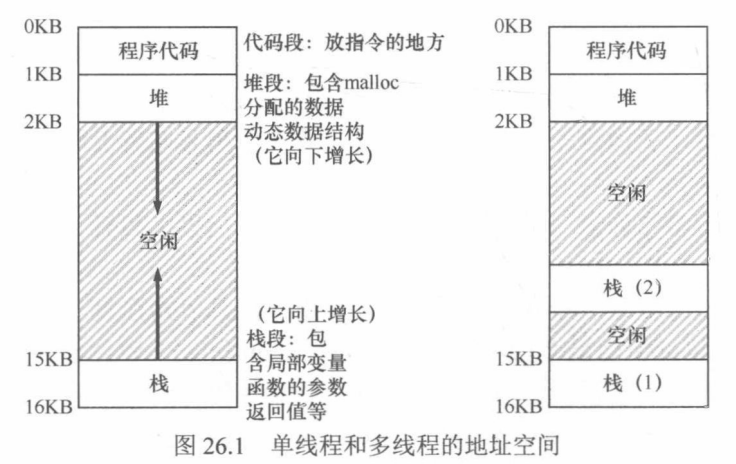
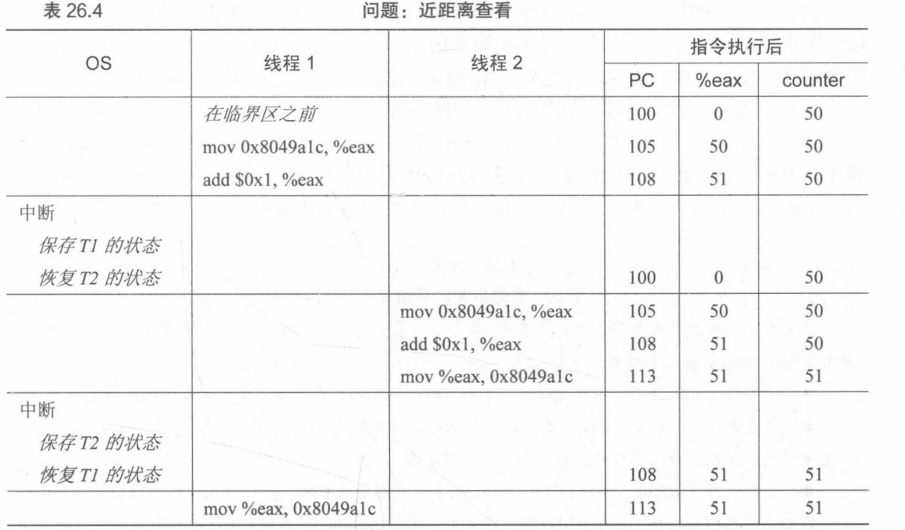
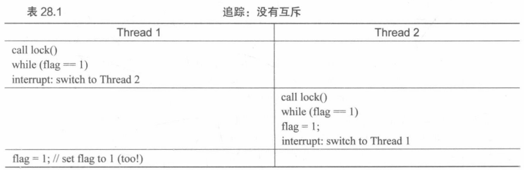

# 第 19 章  并发：介绍

为单个运行进程提供的新抽象：线程

对于进程，需要将状态保存到==进程控制块(Process Control Block,PCB)==。

对于线程，需要一个或多个==线程控制块(Thread Control Block,TCB)==，来保存每个线程的状态

线程与进程的区别：

- 线程之间的上下文切换，地址空间保持不变(即不需要切换当前使用的页表)。

- 栈：

  - 简单的传统进程地址空间模型(单进程)中，只有一个栈，通常位于地址空间的底部。

  - 在多线程的进制中，每个线程独立运行，每个线程有一个栈。如下图所示，一个进程有两个线程

     如上图所示，两个栈跨越了进程的地址空间。因此，所有位于栈上的变量、参数、返回值和其他放在栈上的东西，将被放置在有时被称之为线程本地(thread-local)存储的地方，即相关线程的栈。

## 19.1  实例：线程创建

运行一个程序，它创建两个线程，每个线程做一些独立的工作，此例中，打印A或B。

```c
#include <stdio.h>
#include <assert.h>
#include <pthread.h>
void *mythread(void *arg){
	printf("%s\n",(char *) arg);
    return NULL;
}
int main(int argc, char *argv[]){
    pthread_t p1,p2;
 	int rc;
    printf("main:begin\n");
    rc = pthread_create(&p1,NULL,mythread,"A"); assert(rc == 0);
    rc = pthread_create(&p2,NULL,mythread,"B"); assert(rc == 0);
    //join waits for the threads to finish
    rc = pthread_join(p1,NULL);assert(rc == 0);
    rc = pthread_join(p2,NULL);assert(rc == 0);
    printf("main:end\n");
    return 0;
}
```

主程序创建了两个线程，分别执行函数mythread()，但是传入不同的参数。一旦线程创建，可能会立即执行，也可能会处于就绪状态等待执行。

|                           主程序                           |     线程1     |        线程2        |
| :--------------------------------------------------------: | :-----------: | :-----------------: |
| 开始运行、打印 main:begin、创建线程1、创建线程2、等待线程1 |               |                     |
|                                                            | 运行、打印"A" |                     |
|                         等待线程2                          |               |                     |
|                                                            |               | 运行、打印"B"、返回 |
|                       打印"main:end"                       |               |                     |

这种排序不是唯一情况。

线程创建有点像进行函数调用。但是，并不是首先执行函数然后返回给调用者，而是我被调用的例程创建一个新的线程，它可以独立于调用者运行，可能在从创建者返回之前运行，但也许会晚得多。

有了并发，情况会糟糕更多！

## 19.2  为什么更糟糕：共享数据

下面展示线程在访问共享数据时如何相互作用。

```c
#include <stdio.h>
#include <pthread.h>
#include "mythreads.h"

static volatile int counter = 0;

void * mythread(void *arg){
    printf("%s:begin\n",(char *) arg);
    int i;
    for(i=0;i<le7;i++){
        counter = counter + 1;
    }
    printf("%s:done\n",(char *) arg);
    return NULL;
}
int main(int argc,char *argv[])
{
    pthread_t p1,p2;
    printf("main:begin(counter = %d)\n",counter);
    Pthread_create(&p1,NULL,mythread,'A');
    Pthread_create(&p2,NULL,mythread,'B');

    Pthread_join(p1,NULL);
    Pthread_join(p2,NULL);
    printf("main:done with both (counter = %d)\n",counter);
    return 0;
}
```

上述代码每次运行都会产生错误，而且得到不同的结果。

## 19.3  核心问题：不可控的调度

首先必须了解编译器为更新计数器生成的代码序列

```
mov 0x8049a1c, %eax
add $0x1, %eax
mov %eax, 0x8049a1c
```

变量counter位于地址0x8049a1c。先用x86的mov指令，从内存地址取出值，放入eax。然后给eax寄存器的值+1，最后eax的值存回内存中相同的地址。

设想线程1进入这个代码区域，并且增加一个计数器。它将counter的值(假设它这时是50)加载到它的寄存器eax中。因此线程1的eac=50。寄存器加1，因此eax=51。现在一件不幸的事情发生了：时钟发生中断。因此，OS将正在运行的进程(PC，寄存器，包括eax等)的状态保存到进程的TCB中。

更糟糕的情况发生了：线程2被选中运行，并进入同一段代码。获取计数器的值并将其放入其eax中[***Attention***：运行时每个进程都有自己的专用寄存器，上下文切换代码将寄存器虚拟化，保存并恢复它们的值]。此时counter的值仍为50。经过接下来的两条指令后，全局变量counter现在的值是51.

最后再一次发生上下文切换。线程1恢复运行。线程1准备执行最后一条mov指令，counter的值再次被设置为51。


简单来说，增加counter的代码被执行两次，初始值为50，那么正确结果应该是52！！！而不是51

追踪一下详细的执行。



临界区是访问共享变量的代码片段，一定不能由多个线程同时执行。

我们真正想要的代码就是==互斥(mutual exclusion)==，这个属性保证了如果一个线程早临界区执行，其他线程将被阻止进入临界区。

## 19.4  原子性愿望

硬件提供一些有用的指令，可以在这些指令上构建一个通用的集合，即所谓的同步原语。

一些并发术语：

- 临界区：访问共享资源的一段代码，资源通常是一个变量或数据结构
- 竞态条件：出现在多个执行线程大致同时进入临界区时，它们都试图更新共享的数据结构，导致了令人惊讶的结果。
- 不确定性：程序由一个或多个竞态条件组成，程序的输出由运行而异。
- 为避免相关问题，线程应该使用某种互斥原语。

## 19.5  还有一个问题：等待另一个线程

除了访问共享变量这种交互以外，还有一种常见的交互，即一个线程在继续之前必须等待另一个线程完成某些操作。

# 第 20 章  插叙：线程API


# 第 21 章  锁

## 21.1  锁的基本思想

锁是一个变量，因此需要声明一个某种类型的锁变量才能使用。这个锁变量保存了锁在某一时刻的状态。它要么可用的表示没有线程持有锁，要么是被占用的表示有一个线程持有锁。

```lock()```和```unlock()```函数的语义很简单，调用lock()尝试获取锁，如果没有其他线程持有锁，该线程就会获得锁，进入临界区，这个线程有时被称为锁的持有者。如果另一个线程对相同的锁变量调用lock()，因为锁被另一线程持有，因此该调用不会返回。

锁的持有者一旦调用unlock()，锁就变成可用了。

## 21.2  Pthread锁

POSIX库将锁称为互斥量(mutex)，因为它被用来提供线程之间的互斥。当一个线程在临界区，它能够阻止其他线程进入直到本线程离开临界区。

## 21.3  实现一个锁

略

## 21.4  评价锁

标准：

- 是否能完成它的基本任务。即提供互斥。能够阻止多个线程进入临界区？？？
- 公平性！当锁可用时是否每一个竞争线程有公平的机会抢到锁？是否会有竞争锁的线程会饿死(starve)，一直无法得到锁》
- 性能！！！使用锁之后会增加的时间开销。
  - 没有竞争的情况
  - 一个CPU上多个线程竞争
  - 多个CPU、多个线程竞争时的性能

## 21.5  控制中断

最早提供的互斥解决方案之一，就是在临界区关闭中断，为单处理器系统开发。

```c
void lock(){
	DisableInterrupts();
}
void unlock(){
	EnableInterrupts();
}
```

假设在一个单处理器系统上。通过在临界区之前关闭中断，可以保证临界区的代码不会被中断，从而原子地执行。结束之后，重新打开中断，程序正常运行。

优点就是简单，但是缺点很多。很多很多....

- 这种方法要求我们允许所用调用线程执行特权操作，就是要信任这种机制不会被滥用。显然这种方法一定会乱套！就像我们要信任每一个人？用户要必须信任任意一个程序！
  - 一个贪婪的程序可能在刚刚开始就调用lock()，从而独享moment？程序恶意调用lock()后，就一直死循环
  - 系统无法重新获得控制，只能重启！
- 不支持多CPU。多个线程运行在不同CPU上，每个线程都试图进入同一个临界区，关闭中断也没用，线程可以运行在其他CPU上，因此也能进入临界区
- 关闭中断导致中断丢失，可能会导致严重的系统问题
- 效率低

## 21.6  测试并设置指令(原子交换)

让硬件支持锁！

首先实现一个不依赖它的锁，用一个变量标记锁是否被持有。

```c
typedef struct lock_t{
	int flag;
}lock_t;
void init(lock_t *mutex){
	mutex->flag=0;
}
void lock(){
	while(mutex->flag == 1)
        ;
    mutex->flag = 1;
}
void unlock(lock_t *mutex){
	mutex->flag = 0;
}
```

当第一个线程正处于临界区时，如果另一个线程调用lock()，它会在while循环中自旋等待，直到第一个线程调用unlock()清空标志。然后等待的形参会退出while循环，设置标志，执行临界区代码。

然而以上代码有两个问题：正确性和性能。



通过不合时宜的中断，很容易构造出2个线程都将标志设置为1，都能进入临界区。

性能方面，线程在等待已经被持有的锁时，采用了自旋等待技术，不停的检查标志的值。自旋等待在等待其他线程释放锁的时候会浪费时间。

## 21.7  实现可用的自旋锁

测试并设置指令

```c
int TestAndSet(int *old_ptr,int new){
	int old=*old_ptr;
    *old_ptr=new;
    return old;
}
```

上述代码完成了以下事情：返回```old_ptr```指向的旧值，同时更新为```new```的新值。

首先假设一个线程在运行，调用```lock()```，没有其他线程持有锁，所以flag是0。当调用```TestAndSet(flag,1)```时，返回0，线程跳出while循环，获取锁，同时也会将原子的设置flag为1，标记锁已经被持有。线程离开临界区。调用unlock()将flag清理为0。

第二种场景是：当某一个线程持有锁时(flag为1)。本线程调用lock()，然后调用TestAndSet，这次返回1。只要另一个线程一直持有锁，TestAndSet()就会重复返回1，本线程会一直自旋，当flag被改为0，本线程会调用TestAndSet()，返回0并且原子地设置为1，从而获得锁，进入临界区。

综上，自旋锁的由来：一直自旋，利用CPU周期，直到锁可用。

在单处理器上，需要抢占式的调度器(不断通过时钟中断一个线程运行其他线程)。否则，自旋锁在单CPU上无法使用，因为一个自旋的线程永远不会放弃CPU。

```c++
-------------------------Tips-----------------------
假装自己是一个恶意调度程序，就会最不合时宜地中断线程，从而挫败它们在构建同步原语方面的微弱尝试。
```

## 21.8  评价自旋锁

- 正确性？
  - 可以的，自旋锁一次只允许一个线程进入临界区。
- 公平性？
  - ==自旋锁不提供任何公平性。==自旋的线程在竞争条件下可能会永远自旋。自旋锁没有公平性，可能会导致饿死。
- 性能？
  - 单CPU情况下，性能开销相当大。假设一个线程持有锁进入临界区

# 第 22 章  基于锁的并发数据结构

## 22.1  并发计数器

非并发的计数器

```c
typedef struct counter_t{
    int value;
}counter_t;
void init(counter_t *c){
    c->value = 0;
}
void increment(counter_t *c){
    c->value++;
}
void decrement(counter_t *c){
    c->value--;
}
int get(counter_t *c){
    return c->value;
}
```


# 第 23 章  条件变量

## 23.1  定义和程序

线程可以用条件变量。来等待一个 条件变成真。条件变量是一个显式队列。

当某些执行状态不满足时，线程可以把自己加入队列，等待条件。另外某个线程，当它改变了上述状态时，就可以唤醒一个或多个等待线程(通过在该条件上发信号)，让它们继续执行。

声明：

```c
pthread_cond_t c;	//声明c是一个条件变量，除此以外还需要适当的初始化
```

条件变量有两种相关操作：

- ```wait()```
  - 线程要睡眠的时候，调用wait()
- signal() 
  - 当线程想要唤醒等待在某个条件变量上的睡眠线程时，调用signal()

```c
//父进程等待子进程，使用条件变量
pthread_cond_wait(pthread_cond_t *c,pthread_mutex_t *m);
//wait调用有一个参数，它是互斥量。
//假定在wait()时，这个互斥量是已上锁状态。wait()的职责是释放锁，并让调用线程休眠。
//当线程被唤醒时(另外的线程发信号给它后)，它必须重新获取锁，再返回调用者。
//这是为了避免在线程陷入休眠时，产生一些竞争状态
pthread_cond_signal(pthread_cond_t *c);
int done = 0;
pthread_mutex_t m = PTHREAD_MUTEX_INITIALIZER;
pthread_cond_t c = PTHREAD_COND_INITIALIZER;
void thr_exit(){
    pthread_mutex_lock(&m);
    done = 1;
    pthread_cond_signal(&c);
    pthread_mutex_unlock(&m);
}
void *child(void *arg){
    printf("child\n");
    thr_exit();
    return NULL;
}
void thr_join(){
    pthread_mutex_lock(&m);
    while(done == 0)
    pthread_cond_wait(&c,&m);
    pthread_mutex_unlock(&m);
}
int main(int argc,char *argv[]){
    printf("parent:begin\n");
    pthread_t p;
    pthread_create(&p,NULL,child,NULL);
    thr_join();
    printf("parent:end\n");
    return 0;
}
```


