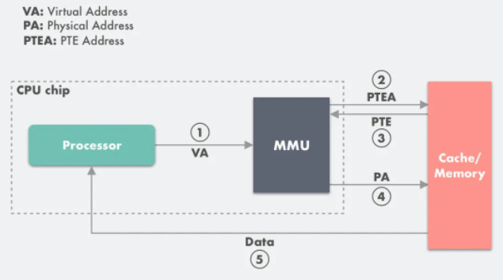

# 四、内存管理

虚拟内存的核心原理是：为每个程序设置一段“连续”的虚拟地址空间，把这个地址空间分割成多个 具有连续地址范围的页(Page)，并把这些页和物理内存做映射，在程序运行期间动态映射到物理内存。当程序引用到一段在物理内存的地址空间时，由硬件执行必要的映射；而当程序引用到一段不在物理内存中的地址空间时，由操作系统负责将缺失的部分装入物理内存并重新执行失败的指令。

## 4.1  分段与分页机制

### 4.1.1  分段机制

### 4.1.2  分页机制

分页机制的基本思想是将应用程序的虚拟地址空间划分成连续的、等长的虚拟页，同时物理内存也被划分为连续的、等长的物理页。

虚拟页与物理页的页长固定且相等，这就使得操作系统能够很方便地为每个应用程序构造页表，即**<u>虚拟页到物理页的映射关系</u>**。

该机制下的虚拟地址(例如0010 0000 0000 0100)由两部分组成：

- 标识着虚拟地址的虚拟页号(高4位)
- 标识着虚拟地址的页内偏移量(偏移量)

具体来说，MMU(内存管理单元)首先解析得到虚拟地址中的虚拟页号，并通过虚拟页号去该应用程序的页表(页表起始地址存放于页表基址寄存器中)中找到该条目，然后取出条目中存储的物理页号，最后用该物理页号对应的物理页起始地址加上虚拟地址中的页内偏移量得到最终的物理地址。


实例分析：当页面命中时，计算机各个硬件是如何交互的


- 处理器生成一个虚拟地址VA，通过地址总线发送到MMU
- MMU通过虚拟页号的得到页表项的值PTEA，通过内存总线从CPU高速缓存/主存读取这个页表项PTE
- CPU高速缓存或主存通过内存总线向MMU返回页表项PTE
- MMU先把页表项的物理页框号PPN复制到寄存器的高三位中，接着把12位的偏移量复制到寄存器的末12位构成15位物理地址，即可以把寄存器存储的物理内存地址PA发送到内存总线，访问高速缓存/主存、
- CPU高速缓存/主存返回物理地址对应的数据给处理器



在MMU进行地址转换时，如果页表项的有效位是0，则表示该页面并没有映射到真实的物理页框号PPN，则会引起一个缺页中断，CPU陷入操作系统内核，接着操作系统就会通过页面置换算法选择一个页面将其换出(swap)，以便为即将调入的新页面腾出位置。如果要换出的页面的页表项里的修改位已经被设置过，则这是一个脏页(Dirty Page)，需要写回磁盘更新页面在磁盘上的副本。

缺页中断的具体流程如下：

- 处理器生成一个虚拟地址VA，通过地址总线发送到MMU
- MMU通过虚拟页号的得到页表项的值PTEA，通过内存总线从CPU高速缓存/主存读取这个页表项PTE
- CPU高速缓存或主存通过内存总线向MMU返回页表项PTE
- 检查返回的页表项PTE如果其有效位是0，则MMU触发一次缺页中断异常，然后CPU转入到OS内核中的缺页中断处理器
- 缺页中断处理器程序检查所需的虚拟地址是否合法，确认合法后系统检查是否有空闲物理页框号可以映射给该缺失的虚拟页面，如果没有空闲页框，则执行页面置换算法寻找一个现有的虚拟页面淘汰，如果该页面比较被修改过，则写回磁盘，更新该页面在磁盘上的副本。
- 缺页中断处理程序从磁盘调入新的页面到内存，更新页表项PTE
- 缺页中断程序返回到原先的进程，重新执行引起缺页中断的指令，CPU将引起缺页中断的虚拟地址重新发生给MMU，此时虚拟地址已经有了映射的物理页框号PPN，因此会按照前面的流程走一遍，最后主存把请求的数据返回给处理器


分页机制下，应用程序虚拟地址空间中的任意虚拟页可以被映射到物理内存中的任意物理页上，因此操作系统也能实现物理内存资源的离散分配，可有效避免分段机制中外部碎片的问题。


## 4.2  基于分页的虚拟内存

页表是分页机制的关键部分，负责记录虚拟页到物理内的映射关系。

每次进行虚拟地址到物理地址的映射时，都需要读取页表，从数学角度来说，页表就是一个函数，入参是虚拟页号(Virtual Page Number,VPN)，输出是物理页框号(Physical Page Number，PPN，即物理地址的基址)。

如果OS按照上图所示，使用一张单级页表来记录映射关系，会出现什么问题？

对于64位的虚拟地址空间，假设页的大小为4KB，页表中的每一项大小为8字节，那么一张页表的大小为$2^{64}/4KB*8$字节，即33554432GB。

为解决上述问题，OS引入了多级结构的页表，用来满足虚拟内存在高效性方面的要求。

与单级页表相对应的，在使用多级页表(假设有k级)的树时候，一个虚拟地址中依然有虚拟页号和页内偏移量，其中虚拟页号将被划分为k个部分($虚拟页号_0...虚拟页号_i,0≤i<k$)。$虚拟页号_i$对应于该虚拟地址在第$i$级页表中的索引。当任意一级页表中的某一个条目为空时，该条目对应的下一级页表不需要存在，以此类推......

因此，多级页表的设计极大减少了页表占用的空间大小。即多级页表允许在整个页表结构中出现空洞，而单级页表则需要每一项都实际存在。又因为在实际使用中，应用程序在虚拟地址空间中的绝大部分是处于未分配状态的，所以多级页表可以部分创建，节约空间。

实际上更详细的流程如下：


如果一台计算机同时配备了虚拟内存技术和CPU高速缓存，那么MMU每次都会优先尝试到高速缓存中进行寻址，如果缓存命中则会直接返回，只有当缓存不命中之后才去主存寻址。

### 4.2.1  AArch架构下的4级页表

虚拟地址低48位参与地址翻译，页表级数为4级，虚拟页大小为4KB。

此设置下，物理内存被划分为连续的、4KB大小的物理页，一个虚拟页可以映射对应一个物理页。页的大小为4KB，所以虚拟地址的低12位($2^{12} = 4KB$)对应于页内偏移量。整个页表的起始地址(物理地址)存储在特殊的寄存器中，对于包括Linux在内的主流OS上的用户地址空间来说，这个页表地址寄存器是TTBR0_EL1。

第0级(顶级)页表拥有若干个离散是页表页，页表基址寄存器存储的就是该页的物理地址。其余每一级页表拥有若干个离散的页表页，每一个页表也占用物理内存中的一个物理页。每一个页表项占用8个字节，用于存储物理地址和访问权限，所以一个页表页包含512个页表项(4KB/8 = 512)。由于512项对应于9位，所以虚拟地址中对应于每一级页表的索引是9位。一个64位的虚拟地址在逻辑上被划分为如下几个部分：

- 63-48：全为0或全为1。通常OS的选择是，应用程序使用的虚拟地址的这些位都是0.同时也意味着应用程序的虚拟地址空间大小可以达到$2^{48}$个字节
- 47-39：这9位作为该虚拟地址在第0级页表中的索引值，对应于下图的$虚拟页号_0$
- 38-30：这9位作为该虚拟地址在第1级页表中的索引值，对应于下图的$虚拟页号_1$
- 29-21：这9位作为该虚拟地址在第2级页表中的索引值，对应于下图的$虚拟页号_2$

- 20-12：这9位作为该虚拟地址在第3级页表中的索引值，对应于下图的$虚拟页号_3$
- 11-0：  低12位代表页内偏移量


**如果页的大小为8KB，依然是4级页表，每一级页表的索引占用10位**

当MMU翻译一个虚拟地址时，首先根据页表基址寄存器中的物理地址找到第0级页表，然后将虚拟地址的$虚拟页号_0$作为页表项索引，读取第0级页表页中的相应页表项；该页表项中存储着下一级(第1级)页表页的物理地址，MMU按照类似的方式将虚拟地址的$虚拟页号_1$作为页表项索引，继续读取第1级页表页中的相应页表项；往下类推，MMU将在一个第3级页表页中的页表项里面找到该虚拟地址的对应的物理页号，再结合虚拟地址中的页内偏移量即可获得最终的物理地址。

### 4.2.2  加速地址翻译的重要硬件：TLB

多级页表结构能够显著缩小页表大小，但会导致地址翻译时长的增加。

多级页表结构使得MMU在翻译虚拟地址的过程中需要依次查找多个页表页中的页表项，一次地址翻译可能会导致多次物理内存访问，为了减少地址翻译的访问次数，MMU引入了**转址旁路缓存(Translation Lookaside Buffer,TLB)**部件加速地址翻译的过程。

具体来说，TLB缓存了虚拟页号到物理页号的映射关系。

可以把TLB简化成存储着键值对的哈希表，键是虚拟页号，值是物理页号。

通过TLB能够直接完成地址翻译的过程称为TLB命中，反之称之为TLB未命中。

一般来说，TLB采用分层的架构，分为L1和L2两层。其中L1又分为数据TLB和指令TLB，分别用于缓存数据和指令的地址翻译。


基于虚拟内存的分页基址，页表一般保存在内存中的一块固定的存储区，而MMU每次翻译虚拟地址的时候都需要从页表中匹配一个对应的PTE，导致进程通过MMU访问指定内存数据的时候比没有分页机制的系统多了一次内存访问，性能至少下降了一半。

TLB可以简单地理解为页表的高速缓存，保存了最高频被访问的页表项PTE。由于TLB一般是硬件实现的，因此速度很快。

MMU收到虚拟地址时一般会通过硬件TLB并行地在页表中匹配对应的PTE，若命中且该PTE的访问操作不违反保护位，则直接从TLB取出对应的物理页框号PPN返回，若不命中则会穿透到主存页表里查询，并且会在查询到最新页表项之后存入TLB，以备下次缓存命中，如果TLB当前的存储空间不足会替换掉现有的其中一个PTE。

TLB命中：

- CPU产生一个虚拟地址VA
- MMU从TLB中取出对应的PTE
- MMU将这个虚拟地址VA翻译成一个真实的物理地址PA，通过地址总线发送到高速缓存/主存中
- 高速缓存/主存将物理地址PA上的数据返回给CPU

TLB不命中：

- CPU产生一个虚拟地址
- 查询TLB异常，走正常的主存页表查询流程拿到PTE，然后把它放到TLB缓存，以备下次查询，如果TLB此时的存储空间不足，则整个操作会淘汰掉TLB中一个已存在的PTE
- MMU将这个VA翻译成一个PA，通过地址总线发送到高速缓存/主存
- 高速缓存/主存将物理地址上的数据返回给PA

```cpp
Question:	为什么硬件仅仅采用简单的TLB管理模式，就能够在大多数情况下获得较高的TLB命中率？
Answer:		局部性起了重要作用。
```

TLB刷新

如何保证TLB中内容与当前页表内容的一致性？例如，应用程序A和B使用了同样的虚拟地址VA，但是对应于不同的物理地址PA1和PA2。略....

### 4.2.3  换页与缺页异常

虚拟页被分配使用后，在页表中依然可能没有映射到物理页。

E1：电脑有4G物理内存，先打开一个PS占用2GB，后打开需要占用3GB内存的某3A，游戏打开过程比平常直接打开慢一些

E2：编写某应用程序，不知道在运行时实际会使用多少内存，于是程序向OS预先申请足够大的虚拟内存，但实际上大部分虚拟页最终都不会被用到。

虚拟内存中的**换页(Page Swapping)机制**就是为了透明地满足这样的场景所设计的。


基本思想：当物理内存容量不够用时，OS应该把若干物理页的内容写到类似于磁盘这种容量更大且更加便宜的存储设备中，然后就可以回收这些物理页并继续使用了。

例如OS希望从应用程序A那里回收物理页P(对应于应用程序A中的虚拟页V)时，OS需要将物理页P的内容写到磁盘上的一个位置，并且在应用程序A的页表中去除虚拟页V的映射，同时记录该物理页被换到磁盘上的对应位置。该过程称为物理页换出(swap out)，物理页P就可以被OS回收，并且分配给别的应用程序使用。此时虚拟页就处于已分配但未映射至物理内存的状态。

缺页异常(Page Fault)就与换页机制密不可分，也是换页机制能够工作的前提。当应用程序访问到已分配但未映射至物理内存的虚拟页时，就会触发缺页异常。此时CPU会运行OS预先设置的缺页异常处理函数，该函数会找到一个空闲页，将之前写到磁盘上的数据内容重新加载到该物理页中，并且在页表中填写虚拟地址到这一物理页的映射。该过程称为换入(swap in)。之后CPU回到发生缺页异常的地方继续运行。

利用换页机制，可以把物理内存放不下的数据临时放到磁盘上，等到需要的时候再放回到物理内存中，从而能够为应用程序提供物理内存容量的内存空间。

对于开头第二种情况，虚拟内存的按需分页机制(Demand Paging)就发挥作用。当应用程序申请分配内存时，OS可选择将新分配的虚拟页标记为已分配但未映射至物理内存状态，这样就不必为这个虚拟页分配对应的物理页。应用程序访问这个虚拟页的时候会出发缺页异常。此时OS才真正为这个虚拟页分配对应的物理页，并且在页表中填入对应的映射。

当一个虚拟页处于未分配状态或者已分配但未映射至物理内存状态的时候，应用程序访问该虚拟页都会触发缺页异常，OS是如何进行区分的？

- 


### 4.2.4  页替换策略

当需要分配物理页时，若空闲的物理页已用完或小于某个阈值，OS将根据页替换策略选择一个或一些物理页换出到磁盘以便让出空间。当已被换出的内存页再次被访问时，必须重新从磁盘换入到物理内存。这种策略对性能具有较大的影响。不同的页替换策略有其各自适应的应用场景。

- MIN策略/OPT策略
  - 在选择被换出的页时，优先选择未来不会再访问的页，或者在最长时间内不会再访问的页。
  - 这种策略在实际场景中很难实现。因为页访问的顺序取决于应用程序，而OS通常无法预知应用程序未来访问页的顺序

- FIFO策略
  - 优先选择最先换入的页进行换出。
  - OS维护一个队列用于记录换入内存的物理页号，每换入一个物理页就把页号加到队尾
  - 虽然开销低，但实际使用中表现不佳。
- Second Chance策略
  - OS维护一个队列用于记录换入内存的物理页号，此外还要为每一个物理页号维护一个访问标志位。
  - 如果访问的页号已经处在队列中，则置上其访问标志位。
  - ....
- LRU策略
  - 在选择被换出的页时，优先选择最久未被访问的页。
  - OS维护一个链表，按照内存页的访问顺序将内存页号插入链表中，最久未访问的内存页号在链表的首端，而最近访问的内存页号在链表的尾端
  - 在每次内存访问后，OS就把刚刚访问的内存页号调整到链表尾端，每次都选择换出链表首端的页
- MRU策略
- 时钟算法策略

4.2.5  工作集模型

## 4.3  虚拟内存功能


# 五、进程与线程

## 5.1  进程

### 5.1.1  进程的状态

- 新生状态：一个进程刚刚被创建出来，还未完成初始化，不能被调度使用
- 预备状态：进程可以被调度使用，但还未被调度器选择
- 运行状态：进程正在CPU上运行。一个进程执行一段时间后，调度器可以选择中断它的执行并重新将其放回调度队列，它就迁移至预备状态。进程运行结束，会迁移至终止状态。一个进程如果需要等待某些外部时间，它可以放弃CPU并迁移至阻塞状态
- 阻塞状态：进程需要等待外部事件，暂时无法被调度。当进程进程等待的外部事件完成后，它会迁移至预备状态
- 终止状态：进程已经完成了调度，且不会再被调度


### 5.1.2  进程的内存空间布局

- 用户栈
  - 栈保存了进程需要使用的各种临时数据。
- 代码库
  - 进程的执行有时需要依赖共享的代码库，这些代码库会被映射到用户栈下方的虚拟地址处，并被标记为只读
- 用户堆
  - 堆管理的是进程动态分配的内存。
- 数据与代码段
  - 原本都保存在进程需要执行的二进制文件中，在进程执行前，OS会将它们载入虚拟地址空间中。数据段主要保存的是全局变量的值，代码段保存的是进程执行所需的代码
- 内核
  - 处于进程地址空间最顶端的是内核内存。每个进程的虚拟地址空间都映射了相同的内核内存。当进程在用户态运行时，内核内存对其不可见；只有当进程进入内核态时，才能访问内核内存。与用户态相似，内核部分也有内核需要的代码和数据段，当进程由于中断或系统调用进入内核后，才使用内核的栈。


### 5.1.3  进程控制块和上下文切换

内核中，每个进程都通过一个数据结构来保存它的相关状态，如它的进程标识符(PID)、进程状态、虚拟内存状态、打开的文件等等。这个数据结构称为进程控制块(Process Control Block，PCB)。

进程的上下文(context)包括进程运行时的寄存器状态，其能够用于保存和恢复一个进程在处理器上运行的状态。当OS需要切换当前执行的进程时，就会使用上下文切换(context switch)机制。该机制会将前一个进程的寄存器状态保存到PCB中，然后将下一个进程先前保存的状态写入寄存器，从而切换到该进程执行。


当进程1由于中断或许系统调用进入内核之后，OS就可以进行上下文切换。首先，OS会将进程1的上下文(寄存器信息)保存在其对应的PCB中；之后，如果调度器选择进程2作为下一个执行的进程，OS会取出进程2对应的PCB中的上下文，将其中的寄存器值恢复到对应的寄存器中；最后，OS会回到用户态，继续进程2的执行。

## 5.2  案例分析：Linux的进程操作

### 5.2.1  进程的创建：fork

```c++
#include<sys/types.h>
#include<unistd.h>
pid_t fork(void);
```

返回值是当前进程的PID。


```c
#include<stdio.h>
#include<sys/types.h>
#include<sys/stat.h>
#include<unistd.h>
#include<fcntl.h>
char str[11];
int main(){
	str[10] = 0;
    int fd = open("test.txt",O_RDWR);
    if(fork() == 0){
        ssize_t cnt = read(fd,str,10);
        printf("Child process: %s\n",(char *)str);
    }
    else{
		ssize_t = cnt read(fd,str,10);
        printf("Parent process: %s\n",(char *)str);
    }
    return 0;
}
//输出
Parent process: abcdefghij
Child process: klmnopqrst
```

无论如何，都无法使父进程和子进程输出完全一样的字符串。问题在于“拷贝”的实现上。


上图是两个进程`fork`之后的状态图。每个进程在运行过程中都会维护一张已打开文件的文件描述符表。文件描述符会使用偏移量记录当时进程读到某一文件的某个位置。

`fork`过程中，fd表是PCB的一部分，子进程会获得与父进程一模一样的fd表，因此会指向相同的文件抽象，与父进程共用同一个偏移量。Linux在实现read操作时会对文件抽象枷锁，因此父子进程不可能读到完全一样的字符串。

### 5.2.2  进程的执行：exec

`fork`之后，为了实现子进程执行与父进程完全不同的任务这一目标，Linux提供了`exec`接口。

```c
#include<unistd.h>
int execve(const char* pathname,char* const argv[],char* const envp[]);
```

共三个参数。`pathname`是进程需要载入的可执行文件的路径。`agrv`进程执行所需的参数。`envp`是为进程定义的环境变量，一般以键值对字符串的形式(USERNAME = 小红)传入

OS至少需要完成以下步骤：

- 根据`pathname`指明的路径，将可执行文件的数据段和代码段载入当前进程的地址空间中
- 重新初始化堆和栈。OS可以进行地址空间随机化操作，改变堆和栈的起始地址，增强进程的安全性
- 将PC寄存器设置到可执行文件代码段定义的入口点，该入口点最终会调用`main()`函数

写时拷贝技术在进程中的应用

- 首先，一部分虚拟内存(共享代码库、代码段)是只读的，对这些进行拷贝是一种浪费。
- 其次，由于进程有时会在调用`fork`之后立即调用`exec`以载入新的可执行文件，重置地址空间，之前的内存拷贝完全失去意义。
- 利用写时拷贝技术对`fork`的实现进行优化
  - 对于只读的虚拟页，父进程和子进程能直接共享这些页，减少了拷贝的开销
  - 对于容易变化的虚拟页(堆和栈对应的页)，如果出现了写操作，就会出现写时拷贝，由OS负责处理

### 5.2.3  进程管理

- 进程间的关系与进程树

  - Linux中，进程都是通过`fork`创建的，OS会以`fork`作为线索记录进程之间的关系。

  - ```c
    struct task_struct{
    	//进程状态
        volatile long state;
        //虚拟内存状态
        struct mm_struct *mm;
        //进程标识符
        pid_t pid;
        //进程组标识符
        pid_t tgid;
        //进程间关系
        struct task_struct __rcu *parent;
        struct list_head children;
        //打开的文件
        struct files_struct *files;
        ...
    };
    ```

  - 每个进程的`task_struct`都会记录自己的父进程与子进程，进程之间因此构成了进程树结构

  - 假设某某打开终端，并登录，此时的进程树结构应该如图所示

  - 

  - 处于进程树根部的是`init`进程，它是OS创建的第一个进程，所有进程都是由它直接或间接创建出来的。`kthreadd`是第二个进程，所有右内核创建和管理的进程都是由它`fork`出来的。最后`init`进程会创建一个`login`进程来要求用户登录，验证通过后，会从`login`中`fork`出`bash`进程，即交互终端。

- 进程间监控：wait

  - Linux可以使用`wait`操作来对其子进程进行监控
  
  - ```c
    #include<sys/types.h>
    #include<sys/wait.h>
    pid_t waitpid(pid_t pid,int *wstatus,int options);
    ```
  
  - 第一个参数表示需要等待的子进程ID。第二个参数保存子进程的状态。第三个参数包含一些选项
  
  - ```c
    #include<sys/types.h>
    #include<sys/wait.h>
    #include<stdio.h>
    #include<stdlib.h>
    #include<unistd.h>
    int main(int argc, char *argv[]){
        int rc = fork();
        if(rc < 0){
            //fork失败
            fprintf(stderr,"Fork failed\n");
        }
        else if(rc == 0){
    		//子进程
            printf("Child process: exiting.\n");
        }
        else{
            //父进程
            int status = 0;
            if(waitpid(rc,&status,0) < 0){
                //waitpid失败
                fprintf(stderr，"Waitpid failed\n");
                exit(-1);
            }
            if(WIFEXITED(status)){
                printf("Parent process: my child has exited\n");
            }
            else{
                fprintf(stderr,"Parent process: waitpid returns for unknown reasons\n");
            }
        }
    }
    ```
  
  - `wait`操作不仅起到监控作用，还起到回收已经运行结束的子进程和释放资源的作用。如果父进程没有调用`wait`操作，或者还没来得及调用`wait`操作，就算子进程已经终止了，它所占用的资源也不会完全释放，将这种进程称之为**僵尸进程(zombie)**。
  
  - 内核会为僵尸进程保留其进程描述符和终止时的信息，以便父进程在调用`wait`时可以监控子进程的状态。
  
- 进程组和会话


## 5.3  线程

### 5.3.1  多线程的地址空间布局


两个重要特征：

- 分离的内核栈与用户栈
  - 内核栈中，每个线程也有与之对应的内核栈。当线程切换到内核栈执行时，它的栈指针就会切换到对应的内核栈。进程为每个线程准备了不同的栈，供它们存放临时数据。
- 共享的其他区域
  - 进程除栈以外的其他区域由该进程的所有线程共享，包括数据段、堆、代码段等等。
  - 当同一个进程的多个线程需要动态分配更多内存时，它们的内存分配都是在同一个堆上完成的。

### 5.3.2  用户态线程与内核态线程

操作系统会建立两类线程之间的关系，这种关系称为多线程模型。

- 多对一模型
  - 
    - 将多个用户态线程映射给单一的内核态线程。每次只有一个用户态线程可以进入内核，其他需要内核服务的用户态线程会被阻塞。
- 一对一模型
  - 
  - 为每个用户态线程映射单独的内核态线程
  - 缺点：创建内核态的开销会随着用户态线程数量的增加而不断增大。因此一对一模型的OS往往对用户态线程的总数量有限制。
- 多对多模型
  - 
  - 将N个用户态线程映射到M个内核态线程中，其中N>M。

### 5.3.3  线程控制块与线程本地存储

线程也有自己的**线程控制块(TCB)**，用于保存与自身相关的信息。在目前主流的一对一模型中，内核态线程和用户态线程会各自保存自己的TCB。

内核态的TCB结构会存储线程的运行状态、内存映射、标识符等信息。用户态TCB的结构主要由线程库决定。

用户态TCB可以认为是内核态的扩展，可以用来存储更多与用户态相关的信息，其中一项重要功能就是**线程本地存储(Thread Local Storage,TLS)**。

在多线程编程中，通过TLS实现“一个名字，多份拷贝(与线程数量相同)”的全局变量。当不同的线程在使用该变量时，从代码层次看访问的是同一个变量，但实际上访问的是该变量的不同拷贝，可以方便地实现线程内部的全局变量。


如上图，线程库会为每个线程创建结构完全相同的TLS，保存在内存的不同地址上。每个线程的TLS，count都处于相同的位置，每份count的拷贝相对于TLS起始位置的偏移量都相等。

### 5.3.4  线程的基本接口：以POSIX线程库为例

POSIX线程库一般称为`pthreads`。

- 线程创建

  - ```c
    #include <pthread.h>
    int pthread_create(
        pthread_t *thread,
        const pthread_attr_t *atrr,
        void *(*start_routine) (void *),
        void *arg);
    ```

  - `pthread_create`会在当前线程创建一个新线程，并运行第三个参数指定的函数。同时，接口的使用者可以使用第二个参数为线程指定一些属性，第四个参数为函数start_routine设定参数。

- 线程退出

  - ```c
    void pthread_exit(void *retval);
    ```

  - 

- 出让资源

  - ```c
    int pthread_yield(void);
    ```

  - 

- 合并操作

  - ```c
    int pthread_join(pthread_t thread,void **retval);
    ```

  - 

- 挂起与唤醒

  - ```c
    
    ```

  - 

## 5.4  案例分析：ChCore的线程上下文

在同一时间，在一个操作系统中需要“同时”运行许多从属于不同进程的线程。

单个CPU核心只有一个程序计数寄存器，在同一时间仅能够执行一个线程的代码。因此为了保证所有线程都能够看似同步地被执行，操作系统需要为线程设计上下文切换机制。

### 5.4.1  线程的上下文和TCB

为了实现不同线程间的切换，首先需要保存处理器运行一个线程时的所有状态信息，这些状态信息就是线程的上下文。在实际硬件中，线程的上下文主要指的是当前处理器中大部分寄存器的值，包括：

- 程序计数器(PC)，存储CPU当前所执行指令的地址
- 通用寄存器，存储CPU当前正在处理的一些数据
- 特殊寄存器，存储CPU当前的一些硬件状态和配置，如页表地址等

ChCore采取的是一对一的线程模型，因此操作系统会将线程的上下文保存在该线程对应的内核态的TCB里。

### 5.4.2  ChCore中上下文切换的实现

对线程进行上下文切换的核心操作都是在内核态完成的。整个过程主要包括三个部分：**进入内核态与上下文保存**、**页表与内核态的切换**，以及**上下文恢复与返回用户态**

- 进入内核态与上下文保存
  - 在ChCore中，线程的上下文切换通常是由时钟中断所触发的：ChCore的调度器会对时钟进行设置，当它到达定好的时间时，就会发出一个硬件中断。在中断触发后，CPU的硬件会自动执行一系列操作，保存好线程的上下文。
- 页表与内核态的切换
  - 进入内核态后在高特权级别下才能对页表进行切换。此环节由**switch_context**和**eret_to_thread**这两个函数共同完成。
    - `switch_context`: 负责切换页表和找到目标线程的内核栈。AArch64在地址翻译时会使用两个页表基地址TTBR0_EL1和TTBL1_EL1，分别对应进程虚拟地址空间的内核部分和应用部分。
    - 由于每个线程映射的内核部分都是相同的，因此ChCore不需要改变TTBR0_EL1中的值，只需要修改TTBR1_EL1修改为目标线程的应用空间页表基地址即可。switch_context还会找到目标线程的TCB的起始地址，并将该地址作为目标线程的内核栈项。
    - eret_to_thread通过简单的`mov`指令切换到目标线程的内核栈。
    - 所有的用户态线程在进入内核态之前都将线程的上下文保存了该线程的TCB中，因此当钱换到另一个线程的内核栈之后，处理器的内核栈顶为另一个线程的上下文。

- 上下文恢复与返回用户态
  - eret_to_thread已经切换到目标线程的内核栈，且栈顶上方就是目标线程的上下文。
  - 内核只需要使用`exception_enter`的反向操作`exception_exit`，将目标线程的上下文从内核栈的栈顶依次弹出，恢复到寄存器中，并返回用户态。继续目标线程的执行即可。

## 5.5  纤程


# 六、操作系统调度


# 七、进程间通信


# 八、同步原语

为了更充分地使用多核，应用程序需要将待处理的数据进行划分，能够在同一时间分配任务到多个核心上并行处理，利用更短的时间完成计算。然而，并行处理同一任务意味着对共享资源的并发访问。为了保证共享资源状态的正确性，需要正确地在这些子任务之间进行同步。


通过上图介绍同步的必要性。

假设有一个生产者和一个消费者。生产者与消费者共享一个大小为5的缓冲区用于交换数据。生产者不断地将生成的新数据放到缓冲区中。与此同时消费者从缓冲区拿取并消耗这些数据。为了维护操作的正确性。需要满足以下两个前提条件：

- 当缓冲区已满时，生产者应停止向缓冲区写入数据，避免数据被覆盖
- 当缓冲区为空时，应停止从缓冲区拿取数据，避免读取到无效数据。


## 8.1  互斥锁

### 8.1.1  临界区问题

程序的正确性依赖于特定执行顺序的情况被称为==**竞争冒险(race hazard)**==。

任一时刻只允许至多一个线程访问的方式被称为==**互斥访问(mutual exclusion)**==。

保证互斥访问共享资源的代码区域被称为**==临界区(critical section)==**。

下图是将使用临界区的程序抽象为一个循环。


执行临界区之前，线程必须申请并得到进入临界区的许可。退出临界区之前，线程也需要显式地标示临界区的结束。

对于临界区问题，任务临界区所需的执行事件是有限的，否则该临界区被永久阻塞后续所有线程的执行。

需设计一套满足以下条件的算法来保证程序的正确性：

- 互斥访问:在同一时刻，最多只有一个线程可以执行临界区
- 有限等待:当一个线程申请进入临界区之后，必须在有限的时间内获得许可并入临界区，不能无限等待
- 空闲让进:当没有线程在执行临界区代码时，必须在申请进入的线程中选择一个线程，允许其执行临界区代码，保证程序执行的进展。

### 8.1.2  硬件实现：关闭中断

单核环境中，虽然多个线程不能并行执行，但调度器可以调度线程在这个核心上交错执行，造成竞争冒险。此时可以通过关闭中断来解决临界区问题。

单核中关闭中断意味着当前执行的形参不能被其他线程抢占，因此若在进入临界区之前关闭中断，且在离开临界区时再开启中断，便能够避免当前执行临界区代码的线程被打断，保证任一时刻只有一个线程执行临界区。

关闭中断可以防止临界区的线程被抢占，避免多个线程同时执行临界区，满足互斥访问。

！！！！！！然而，在多核环境中，关闭中断的方法不再适用。即使同时关闭了所有核心的中断，也不能阻塞其他核心上正在运行的线程继续执行，如果多个同时运行的线程需要执行临界区，关闭中断还是会出现临界区问题。

### 8.1.3  软件实现：皮特森算法

该算法能够在两个线程同时执行时保证临界区的互斥性，因此可以被使用到多核CPU中。

下图是算法实现：


皮特森算法有两个重要变量。第一个是全局数组`flag`。它有两个bool成员`flag[0]`和`flag[1]`，分别代表线程0和线程1是否尝试进入临界区。第二个是全局变量turn。如果两个线程都申请进入临界区，那么turn将决定最终能进入临界区的线程编号(只能为0或1)。

程序开始前，`flag`数组中均被设置为false，表示两个线程都没有申请进入临界区。变量turn也无需初始化。

皮特森算法中，线程在进入临界区之前必须达成两个条件之一：

- `flag[1]==false`(线程1没有申请进入临界区)
- `turn==0`(线程1也申请进入临界区，但turn决定线程0可以进入临界区)

方能进入临界区，如果不满足上述两个条件，则需要循环等待，直到其中一个条件得到满足。

如上述代码，线程0在进入临界区之前，需要设置flag[0]为true，而在线程0检查是否可以进入临界区时，线程1只可能处于以下3种状态之一:

- 线程1在准备进入临界区(第二行代码)
- 线程1在临界区内部
- 线程1在执行其他代码

经典的皮特森只能应对两个线程的情况，皮特森是否要求访存操作严格按照程序顺序执行，不适用于现代CPU。

### 8.1.4  软硬件协同：使用原子操作实现互斥锁

- **==原子操作(atomic operation)==**：

不可被打断的一个或一系列操作。要么这一系列指令都执行完成，要么一系列指令一条都没有执行，不会出现执行到一半的状态。

保证互斥访问共享资源的代码区域被称为临界区(critical section)。

常见的原子操作包括**比较与置换(Compare-And-Swap，CAS)**、**拿取并累加(Fetch-And-Add，FAA)**等

```c
int CAS(int *addr,int expected,int new_value){
    int tmp = *addr;
    if(*addr==expected) *addr = new_value;
    return tmp;
}

int FAA(int *addr,int add_value){
    int tmp = *addr;
    *addr = tmp + add_value;
    return tmp;
}
```

CAS操作会比较地址addr上的值是否与期望值expected相等，如果相等则将地址addr上的值换为new_value。最后CAS会返回addr所存放的旧值。

FAA操作会读取addr上的旧值，将其加上add_value后重新存放会该地址，最终返回该地址上的旧值。

上述代码本身不具备原子性。

- **==互斥锁抽象==**

利用硬件保证的原子操作，可以实现**互斥锁**来解决临界问题。

一把锁在同一时刻只能被一个线程所拥有的。一旦一个线程获取了锁，其他的线程均不能同时拥有该锁，只能等待锁被释放。


