# 第 1 部分  虚拟化

## 第 1 章  抽象：进程

非正式定义：进程就是运行中的程序。

操作系统通过虚拟化（virtualizing）CPU来提供这样一种假象：**==通过让一个进程只运行一个时间片，然后切换到其他进程，操作系统提供了存在多个虚拟CPU的假象==。**即时分共享CPU技术，允许用户运行多个并发进程。潜在开销是性能损失，如果CPU共享，每个进程的运行就会慢一点。

要实现CPU虚拟化，操作系统需要一些低级机制以及高级智能。将低级机制称为机制(mechanism)。机制是一些低级方法或协议，实现所需功能。例如：上下文切换，它让OS停止运行一个程序，并开始在CPU上运行另一个程序。所有现代操作系统都采用了这种分时机制。

- 使用时分共享(空分共享)
  - 时分共享。通过允许资源有一个实体使用一小段时间，然后再由另一个资源使用一小段时间
  - 与之对应的是空分共享，资源在空间上被划分给希望使用它的人。例如，磁盘空间自然是一个空分共享资源，因为一旦将块分享给文件，在用户删除文件之前，不可能将它分配给其它文件。

在这些机制之上，有一些智能以策略(policy)的形式存在。策略是在操作系统内做出某种决定的算法。例如，给定一组程序在CPU上运行，OS应该运行哪个程序？OS中的调度策略(scheduling policy)会做出这样的决定：可能利用历史信息(例如哪个程序在最后一个程序运行得更多？)、工作负载知识以及性能指标来做出决定。

### 1.1  抽象：进程

==操作系统为正在运行的程序提供的抽象，就是所谓的进程(process)==。

首先，要理解进程的构成，就必须理解进程的<u>机器状态：程序正在运行时可以读取或更新的内容</u>

- 明显组成部分就是它的内存。指令存在内存中。正在运行的程序读取和写入的数据也存在内存中。所以进程可以访问的内存(地址空间：address space)是进程的一部分。
- 另一部分就是寄存器。许多指令明确地读取或更新寄存器。某些很特殊的寄存器构成了该机器状态的一部分。
  - 程序计数器(Program Counter，PC)告诉程序当前正在执行哪个指令。
  - 栈指针(stack pointer)和相关的帧指针(frame pointer)用于管理函数参数栈、局部变量和返回地址。
- 最后一部分，程序也经常访问持久存储设备。此类I/O信息可能包含当前打开的文件列表

### 1.2  进程API

- **创建(create)**：OS必须包含一些创建新进程的方法。利用shell调用OS来创建新进程，运行指定命令。
- **销毁(destroy)**：存在创建新进程的接口，对应的提供了一个强制销毁进程的接口。
- **等待(wait)**：等待进程停止运行有时是有用的。
- **其他控制(miscellaneous control)**：除了销毁或等待，还有其他控制。比如，大多数OS都会提供某种方法来暂停进程(停止运行一段时间)，然后恢复(继续运行)。
- **状态(status)**：通常有一些接口可以获得有关进程的状态信息。

### 1.3  进程创建：更多细节

程序如何转化为进程？ 具体来说，OS如何启动并运行一个程序？进程创建实际是如何运行的？

首先==第一件事是将代码和所有静态数据(比如初始化变量)load到内存中，load到进程的地址空间中。==程序最终以某种可执行格式驻留在磁盘上。因此，将程序和静态数据加载到内存中的过程，需要OS从磁盘中读取这些字节，并将它们放在内存中的某处。如图

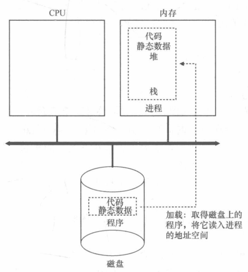

早起的OS，加载过程尽早完成，即在运行程序之前全部完成。然而现代OS惰性执行该程序，即仅在程序执行期间需要加载的代码或数据片段，才会加载。

将代码和静态数据加载到内存后，OS在运行此程序之前还需要执行其他一些操作。==必须为程序的运行时栈(run-time stack)分配一些内存。==C程序使用栈存放局部变量、函数参数和返回地址，OS分配这些内存并提供给进程。OS也可能会用参数初始化栈。具体来说，将参数填入main()函数，即argc和argv数组。

==OS也可能为程序的堆(heap)分配一些内存==。C中，<u>堆用于显式请求的动态分配数据</u>。程序通过调用malloc()来请求空间，并通过free()来明确地释放它。DS需要堆，起初会很小，但随着程序运行，通过malloc()库API请求更多内存，OS也可能会分配更多内存给进程。

OS还将执行一些其他初始化任务，特别是与I/O相关的任务。

将代码和静态数据加载到内存中，通过创建和初始化栈以及执行与I/O设置相关的其他工作，OS终于为程序执行搭好了舞台。

### 1.4  进程状态

谈谈进程在给定时间可能处于的不同状态(state)。进程可以处于以下3种状态之一：

- 运行(running)：进程正在处理器上运行，正在执行指令。
- 就绪(ready)：进程已准备好，但由于某种原因，OS选择不在此时运行。
- 阻塞(blocked)：一个进程执行了某种操作，直到发生其它事件时才会运行。常见例子：？当进程向磁盘发起I/O操作时，它会被阻塞，因此其它进程可以使用处理器 ？

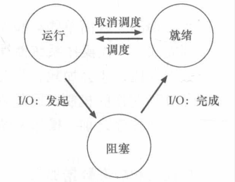

如上图，根据系统的载量，让进程在就绪状态与运行状态之前转换。从就绪到运行意味着该进程已经被调度。从运行到就绪意味着该进程已经取消调度。一旦进程被阻塞，比如发起I/O操作，OS将保持这种状态，直到发生某种事件。此时进程再次转入就绪状态(也可能立即运行)。

### 1.5  数据结构

OS是一个程序，有以下关键的数据结构跟踪各种相关信息。例子：为了跟踪每个进程的状态，操作系统可能会为所有就绪的进程保留某种进程列表，以及跟踪当前正在运行的进程的一些附加信息。OS还必须以某种方式跟踪被阻塞的进程，当I/O事件完成时，OS应确保唤醒正确的进程。

## 第 2 章  插叙：进程API

### 2.1  fork()系统调用

系统调用fork()用于创建新进程。

```C
#include <stdio.h>
#include <stdlib.h>
#include <unistd.h>
int main(int argc, char *argv[])
{
    printf("hello world(pid:%d)", (int) getpid());
    int rc = fork();
    if( rc < 0 )
    {
        fprintf(stderr, "fork failed\n");
        exit(1);
    }
    else if( rc == 0 )
    {
       printf("hello,I am child (pid:%d)\n",(int) getpid()); 
    }
    else
    {
        printf("hello,I am parent of %d (pid:%d)\n", rc,(int) getpid());
    }
    return 0;
}
```


## 第 3 章  机制：受限直接运行

为了虚拟化CPU，OS需要以某种方式让许多人物共享物理CPU，让它们看起来像是同时运行。基本思想是：运行一个进程一段时间，然后运行另一个进程，如此轮换，通过这种时分共享CPU来实现虚拟化。

然而这样的虚拟化机制存在以下挑战。第一个是性能，如何在不增加系统开销的情况下实现虚拟化？第二个是控制权：如何有效地运行进程，同时保留对CPU的控制。

### 3.1  基本技巧：受限直接执行

为了使程序尽可能快地运行，一种新技术——受限的直接执行(limited direct execution)。直接执行：只需直接在CPU上运行程序即可。因此，当OS希望启动程序运行时，它会在进程列表中为其创建一个进程条目，为其分配一些内存，将程序代码(从磁盘)road到内存中，找到入口点并跳转到那里，并开始运行用户的代码。下表是直接运行协议。

|                              OS                              |              程序               |
| :----------------------------------------------------------: | :-----------------------------: |
| 在进程列表上创建条目、为程序分配内存、将程序加载到内存中、根据argc/argv设置程序栈 |                                 |
|                 清除寄存器、执行call main()                  |                                 |
|                                                              | 执行main() 、从main中执行return |
|              释放进程的内存将进程从进程列表删除              |                                 |

这听起来很简单。但是！这产生了一些问题。第一个问题很简单：<u>如果只运行一个程序，OS如何确保程序不做任何我们不希望它做的事。</u>第二个问题：当我们运行一个进程时，OS如何让它停下来并切换到另一个进程，从而实现虚拟化CPU所需的时分共享。

### 3.2  问题1：受限制的操作

直接执行的优势很明显那就是快。程序直接在硬件上运行，执行速度与预期的一样快。但在CPU上会带来一个问题，那就是：如果进程希望执行某些受限操作(比如说向磁盘发出I/O请求或获得更多系统资源)该怎么办?

引入一种新的处理器模式，==用户模式(user mode)==。用户模式下，运行的代码会受到限制，应用程序不能完全访问硬件资源。与之对应的就是==内核模式(kernel mode)==，OS可以访问机器的全部资源，如发出I/O请求和执行所有类型的寿险指令

那么用户如何执行某种特权操作呢(如从磁盘读取)？幸运的是，几乎所有现代硬件都提供了用户程序执行系统调用的能力。==系统调用==，它允许内核小心地向用户程序暴露某些关键功能，例如访问文件系统、创建和销毁进程、与其他进程通信，以及分配更多内存。

要想执行系统调用，程序必须执行特殊的==陷阱(trap)指令==。该指令同时跳入内核并将特权级别提升至内核模式。一旦进入内核，系统就可以执行任何需要的特权操作(被允许的情况下)，从而为调用进程执行所需的工作。完成后，OS调用一个特殊的从==陷阱返回(return-from-trap)指令==。该指令返回到发起调用的用户程序中，同时将特权级别降低，回到用户模式。

执行陷阱时，硬件要小心，因为它必须确保存储足够的调用者寄存器，以便在OS发出从陷阱返回指令时能够正确返回。例如：在x86上，处理器会将程序计数器、标志和其他一些寄存器推送到每个进程的内核栈上。从返回陷阱将从栈弹出这些值，并恢复执行用户模式。

还有一个重要细节，陷阱如何知道在OS内运行哪些代码？显然，发起调用的过程不能指定要跳转到的地址，这样做让程序跳转到内核中的任意位置。这很糟糕！==内核通过在启动时设置陷阱表(trap table)来实现。==当机器启动时，它在特权(内核)模式下运行，因此可以根据需要自由配置机器硬件。

- 第一件事就是告诉硬件在发生某些异常事件时，应该运行哪些代码？OS通过某种特殊的指令，通知硬件这些陷阱处理程序的位置。一旦硬件被通知，它就会记住这些处理程序的位置，知道下一次重启程序，并且硬件知道在发生系统调用和其他异常事件时要做什么

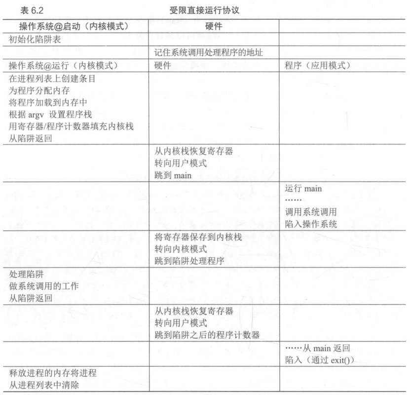

LED有两个阶段。第一个阶段(在系统引导时)，内核初始化陷阱表，并且CPU记住它的位置以供随后使用。内核通过特权指令来执行此操作。第二个阶段(运行进程时)，在使用从陷阱返回指令开始执行进程之前内核设置了一些内容。这会将CPU切换到用户模式并开始运行该进程。当进程希望发出系统调用时，它会重新陷入OS，然后再次通过陷阱返回，将控制权还给进程。该进程完成它的工作，并从main()返回，这通常会返回到一些存根代码，它将正确退出该程序。此时OS清理干净，任务完成。

### 3.3  问题2：在进程之间切换

不要想当然，OS决定停止一个进程并开始另一个进程？实际上，进程切换很棘手，特别是如果一个进程在CPU上运行，这就意味着OS没有运行，OS没有运行，它就做不了什么事情。所以问题就是：**如果操作系统没有在CPU上运行，那么OS显然没有办法采取运动。**也就是说：OS如何重新获得CPU的控制权，以便它可以在进程之间切换。

- 协作方式：等待系统调用

  ​       过去某些系统采用一种叫做==协作(cooperative)方式==。OS相信系统的进程会合理运行。运行时间过长的进程被假定会放弃CPU，以便OS可以决定运行其他任务。

  ​        一个友好的进程是如何放弃CPU的呢？大多数进程通过进行系统调用，将CPU的控制权转移给OS，例如打开文件并随后读取文件，或者向另一台机器发送消息或创建新进程。像这样的系统通常包括一个显式的yield系统调用，它什么也不做，只是将控制权交给OS，以便系统可以运行其他进程。

  ​        如果应用程序执行了某些非法行为，也会将控制权交给OS

  ​        在协作调度系统中，OS通过等待系统调用，或某种非法操作发生，从而重新获得CPU的控制权，这会被动方式未免有点不太理想。

- 非协作方式：操作系统进行控制

  ​       没有硬件的额外帮助，如果进程拒绝进行系统调用(也不出错)，从而将控制权交还给操作系统，那么OS就无法做任何事情。这就遇到了请求获得CPU控制权的问题。

  ​		那么如何在没有协作的情况下获得控制权呢？答案是==时钟中断(timer interrupt)==！时钟设备可以编程为几毫秒产生一次中断。产生中断时，当前正在运行的进程停止，OS中预先配置的中断处理程序(interrupt handler)会运行。此时，OS程序获得CPU的控制权，这就可以停止当前进程并启动另一个进程。

  ​	   硬件在发生中断时有一定的责任，在中断发生时要为正在运行的进程保存足够的状态，一遍随后从陷阱返回指令能够正确恢复正在运行的程序。

- 保存和恢复上下文

  ​       操作系统程序重新获得了控制权，无论是通过系统调用协作还是通过时钟中断强制执行，都必须决定：是继续运行当前正在运行的程序还是切换到另一个程序。这个决定是由调度程序做出的。

  ​       如果决定进程切换，OS就会执行一些底层代码，即所谓的上下文切换(context switch)。上下文切换在概念上很简单：OS要做的就是为当前正在执行的进程保存一些寄存器的值，并为即将执行的进程恢复一些寄存器的值。这样一来，OS就可以确保最后执行从陷阱返回指令时，不是返回到之前运行的进程，而是继续执行另一个进程。

  ​       为了保存当前正在运行的进程的上下文，OS会执行一些底层汇编代码，来保存通用寄存器、程序计数器，以及当前正在运行的进程的内核栈指针，然后恢复寄存器、程序寄存器，并切换内核栈供即将运行的进程使用。通过切换栈，内核在进入切换代码调用时，是一个进程(被中断的进程)的上下文，在返回时是另一进程(即将执行的进程)的上下文。

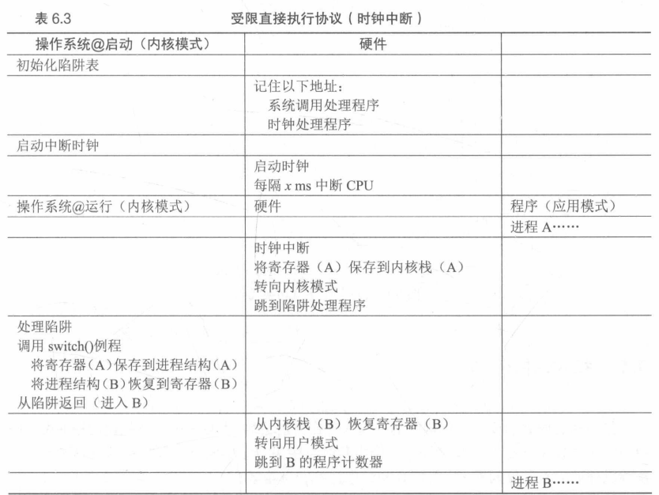

​		要注意的是在此协议中，有两种类型的寄存器保存/恢复。第一种是发生时钟中断的时候。在这种情况下，运行进程的用户寄存器有硬件隐式保存，使用该进程的内核栈。第二种情况是在OS决定从A切换到B。在这种情况下，内核寄存器被软件明确地保存，但这次被存储在存储在该进程结构的内存中。后一个操作让系统从好像刚刚由A陷入内核，变成好像刚刚由B陷入内核。

```x86
.globl switch
swtch:
	# Save old registers
	movl 4(%esp), %eap	#put old ptr into eax
	popl 0(%eax)	    #save the old IP
	movl %esp, 4(%eax)	#and stack
	movl %ebx, 8(&eax)	#and other registers
	movl %ecx, 12(%eax)
	movl %edx, 16(%eax)
	movl %esi, 20(%eax)
	movl %edi, 24(%eax)
	movl %ebp, 28(%eax)
	
	# Load new registers
	movl 4(%esp), %eax	#put new ptr into eax
	movl 28(%eax), %ebp	#restore other registers
	movl 24(%eax), %edi
	movl 20(%eax), %esi
	movl 16(%eax), %edx
	movl 12(%eax), %ecx
	movl 8(%eax), %ebx
	movl 4(%eax), %esp	#stack is switched here
	pushl 0(%eax)	    #return addr put in place
	ret				   #finally return into new ctxt
```

## 第 4 章  进程调度：介绍

先前介绍了运行进程的底层机制(如上下文切换)，接下来接受一些==调度策略(scheduling policy或称为discipline)==。关键问题是如何开发调度策略？如何开发一个考虑调度策略的基本框架?关键假设?重要指标？

### 4.1  工作负载假设

对OS中运行的进程做出如下假设：

- 每一个工作运行相同的时间
- 所有的工作同时到达
- 一旦开始，每个工作保持运行直到完成
- 所有的工作只是用CPU(不执行IO操作)
- 每个工作的运行时间是已知的

以上假设大多数是极其不现实的！比如说工作运行的时间是已知的。

### 4.2  调度指标

除了提出工作负载假设之外，还需要一个东西可以比较不同的调度策略：调度指标。指标么，就是用来衡量某些事物的。在进程调度中，一些指标是很有意义的。比如说周转时间(turnaround time)。任务的周转时间定义为任务完成时间-任务到达系统的时间。即：

​                                       T~周转时间~ = T~完成时间~ - T~到达时间~

假设所有任务都是同一时间到达，那么T~到达时间~ = 0。

值得注意的是，周转时间是一个性能指标(performance)指标，另一个重要的指标是公平(fairness)。两者往往是矛盾的

### 4.3  先进先出(FIFO)

往好了想，它很简单，而且易于实现，往坏了想......

比如3个工作A、B、C在大致相同的时间到达系统，假设A比B早一点点，B比C早一点，每个工作运行时间为10s，即A在10s完成，B在20s完成，C在30s完成，那么这些工作的平均周转时间是：(10+20+30)/3 = 20。大的来了！假设A完成工作要100s，B和C仍然各需要10s，这种情况下A先100s后才能轮到B和C，平均周转时间：(100+110+120)/3 = 110。

这种问题通常称为护航效用(convoy effect)，一些耗时较少的潜在资源消费者被排在重量级的资源消费者之后。

### 4.4  最短任务优先(SJF)

策略很明显：先运行最短的任务，然后是次短的任务，依次下去...按照这种策略(10+20+120)/3 = 50，平均周转时间大幅下降。这就找到了一个用SJF进行调度的好方法，但这种假设依然是不切实际的。放宽假设，假设工作可以随时到达，而不是同时到达。

同样是上一个例子，假设A在t = 0时到达，并且运行100s，B和C在t = 10s到达，那么平均周转时间：(100+(110-10)+(120-10))/3。还是不太行

### 4.5  最短完成时间优先(STCF)

为了解决上述问题，继续放宽假设条件。鉴于之前的时钟中断和上下文切换的讨论，当B和C到达时，调度程序当然可以做其他事情：它可以抢占(preempt)工作A并决定运行另一个工作，或许稍后继续工作A。SJF是一种非抢占式调度程序，因此存在上述问题，

介绍一种新的调度程序，向SJF添加抢占，称为最短作业优先调度程序。每当新工作进入系统时，它就会确定剩余工作和新工作中，谁的剩余时间最少，然后调度该工作。

### 4.6  新度量指标：响应时间

对于早期批处理系统，这些类型的上述调度算法有一定的意义。然而引入分时系统改变了这一切。新的度量标准诞生：响应时间！

响应时间定义为从任务到达系统到首次运行时间。正式的定义为：

​												T~响应时间~ = T~首次运行~ - T~到达时间~

然而STCF在响应时间上并不是很好。例如，如果3个工作同时到达，第三个任务必须等待前两个工作全部运行后才能运行。所以如何构建对响应时间敏感的调度程序。

### 4.7  轮转

介绍一种轮转调度(Round-Robin,RR)。基本思想：RR在一个时间片内运行一个工作，然后切换到运行队列中的下一个任务，而不是运行一个任务直到结束。它反复执行，直到所有任务完成。因此RR有时被称为时间切片。要注意的是时间片长度必须是时钟中断周期的倍数，时钟中断如果是每10ms中断一次，时间片长度可以是10ms，20ms或者10ms的任何其他倍数。

时间片不能太短。突然上下文切换的成本将影响整体性能。设计系统时需要权衡时间片的长度，使其足够长，以便摊销上下文切换成本而又不会使系统不及时响应。

- 摊销可以成本
  - 当系统某些操作有固定成本时，通常会使用摊销技术。通过减少成本的频度，也就是执行较少次数的操作，系统的总成本就会降低。例如时间片长度设置为10ms，并且上下文切换为1ms，那么浪费10%的时间用于上下文切换。想要摊销这个成本可以把时间片长度增加到100ms，这样不到1%的时间用于上下文切换，因此时间片带来的成本就被摊销了。

上下文切换的成本不仅仅来自于保存和恢复少量寄存器的OS操作。程序运行时它们在CPU高速缓存、TLB、分支预测器和其他片上硬件建立了大量的状态，切换到另一个工作会导致此状态被刷新，且与当前运行的作业相关的新状态被引入，这可能导致显著的性能成本。

## 第 5 章  调度：多级反馈队列

多级反馈队列(Multi-level Feedback Queue，MLFQ)，应用于兼容时分共享系统(CTSS)。它解决两方面问题。首先它要优化周转时间。其次，MLFQ希望给交互用户很好的交互体验。

### 5.1  MLFQ：基本规则

MLFQ中有许多独立的队列(queue)，每个队列有不同的优先级。任何时刻一个工作只能存在于一个队列中。MLFQ总是优先执行较高优先级的工作。每个队列中可能有多个任务，可能具有同样的优先级，在这种情况下就对这些工作采用轮换调度。

MLFQ调度策略的关键在于如何设置优先级。MLFQ没有为每个工作指定不变的优先情绪，而是根据观察到的行为调整它的优先级。例如，一个工作不断放弃CPU去等待键盘输入，这是交互型进程的可能性为，MLFQ因此会让它保持高优先级。相反一个工作长时间占用CPU，MLFQ会降低其优先级。

所以，MLFQ的两条基本原则：

- **规则1：如果A的优先级＞B的优先级，运行A(不运行B)**
- **规则2：如果A的优先级 = B的优先级，轮转运行A和B。**

只是一些队列的静态快照，需要理解的是工作的优先级如何随时间变化。

### 5.2  尝试1：如何改变优先级

- **规则3：工作进入系统时，放在最高优先级(最上层队列)**
- **规则4a：工作用完整个时间片后，降低其优先级(移入下一个队列)**
- **规则4b：如果工作在其时间片以内主动释放CPU，则优先级不变**

实例1：单个长工作

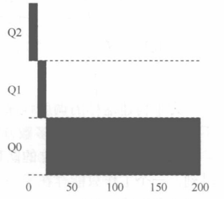

如图所示，工作首先进入最高优先级，执行10ms的时间片后，调度程序将工作的优先级减1进入Q1，在Q1运行一个时间片后，最终降低优先级进入系统的最低优先级Q0，然后一直留在那里

实例2：短工作

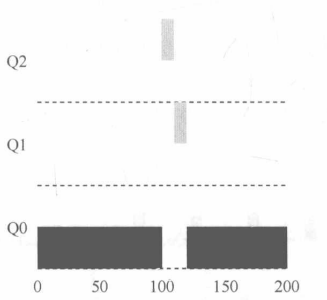

两个工作A(长时间运行的CPU密集型工作，黑色表示)和B(运行时间很短的交互型工作，灰色表示)。A在最低优先级队列执行。B在T = 100时到达并被加入最高优先级队列。由于它的运行时间很短，在被移入最低优先级队列之前就执行完毕了。然后A继续执行

这个算法的目标就是：因为不知道工作的长度，所以就在开始的时候假设其是短工作并赋予最高优先级。短工作很快就完成，否则就被慢慢移入低优先级队列，而这时该工作也被认为是长工作了。这种方式下MLFQ近似于SJF

实例3：如果有I/O？


假设交互型工作有大量I/O操作，它会在时间片用完之前放弃CPU。这种情况下，并不想处罚它，只是保持它的优先级不变。

如图所示，交互型工作B(灰色)每执行1ms便需要I/O操作，它与长时间运行的工作A(黑色)竞争CPU。MLFQ算法保存B在最高优先级，因为B总是让出CPU。

当前MLFQ的一些问题

- 首先会有饥饿(starvation)问题，如果系统有"太多"交互型工作，就会不断占用CPU，导致长工作无法得到CPU(长工作饿死了)，即便有很多交互型工作也还是希望长工作能有所进展
- 其次就是，聪明的用户会重写程序，愚弄调度程序。它指的是用一些卑鄙的手段欺骗调度程序，让它给你远超公平的资源。进程在时间片用完之前调用一个I/O操作(比如访问一个无关的文件)，从而主动释放CPU，如此便可以保持在高优先级，占用更多的CPU时间
- 一个程序可能在不同时间表现不同。一个计算密集度的进程可能在某段时间表现为一个交互型的进程

### 5.3  尝试2：提升优先级

避免饥饿问题一个简单的思路就是周期性地提升所有工作的优先级

- 规则5：经过一段时间S，就将系统中所有工作重新加入最高优先级队列

这个规则解决了2个问题：

- 首先就是进程不会饿死。在最高优先队列中，它会以轮转的方式，与其他高优先级分享CPU，从而最终获得执行
- 其次如果一个CPU密集型工作变成了交互型，当它优先级提升时，调度程序会正确对待它。

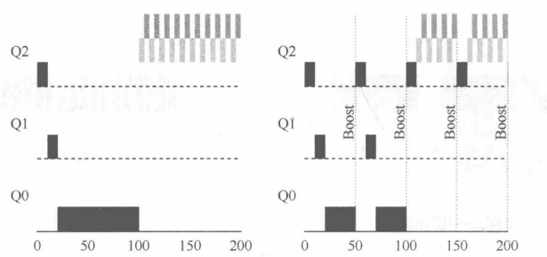

如图所示，一个长工作与两个交互型短工作竞争CPU时的行为。左图不采用优先级提升。可以看到左边没有优先级提升，长工作在两个短工作到达后饿死。而右图每50ms就有一次优先级提升，这至少能保证长工作会有一些进展。

S的设置就显得尤为重要。曾被称作"巫毒常量"。S设置得过高，长工作会饥饿，设置得过低，交互型工作又得不到合适的CPU时间比例。

### 5.4  尝试3：更好的计时方式

如何阻止调度程序被愚弄？解决方法，为MLFQ的每层队列提供更完善的CPU计时方式。调度程序应该记录一个进程在某一层中消耗的总时间，而不是在调度时重新计时。只要进程完成了自己的配额，就将它降到低一优先级的队列中去。重新规则4a和4b

- 规则4：一旦工作用完了其在某一层的时间配额(无论中间主动放弃了多少次CPU)，就降低其优先级

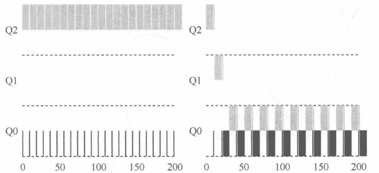

左图是不采用愚弄反制。显然，左图中的进程可以在个时间片结束前发起一次I/O操作，从而垄断CPU时间。有了反制之后，不论进程的I/O行为如何，都会慢慢降低优先级，因而无法获得超过公平的CPU时间比例。

### 5.5  MLFQ调优及其他问题

大问题就是如何配置一个调度程序？例如配置多少队列？每一层队列的时间片配置有多大？为了避免饥饿问题以及进程行为改变，应该多久提升一次进程的优先级。

## 第 6 章  调度：比例份额

比例份额调度程序有时称为公平份额调度程序。比例份额算法基于一个简单的想法：调度目标的最终目标是确保每个工作获得一定比例的CPU时间，而不是优化周转时间和响应时间。其有一个优秀的现代例子，名为彩票调度。基本思想是每隔一段时间，都会举行一次彩票抽奖，以确定接下来应该运行哪个程序。越是应该频繁运行的进程越是应该拥有更多地赢得彩票的机会

### 6.1  基本概念：彩票数表示份额

彩票数代表了进程占某个资源的份额。一个进程拥有的彩票数占总彩票数的百分比就是它的份额。

例如，两个进程A和B，A拥有75张彩票，B拥有25张。因此我们希望A占用75%的CPU时间，而B占用25%。

通过不断地定时地(每个时间片)抽取彩票，彩票调度从概率上获得这种份额比例。抽取彩票的过程很简单：调度程序知道总共的彩票数，调度程序从0~99之间抽取一个数，拥有这个数对应的彩票的进程中奖。假设A拥有0到74共75张彩票，B拥有75到99的25张，中奖的彩票就决定了运行A或B。调度程序加载中奖进程的状态并运行它。

### 6.2  彩票机制

彩票调度还提供了一些机制，以不同且有效的方式来调度彩票。一种是利用彩票货币的概念，这种方式允许拥有一组彩票的用户以它们喜欢的某种货币，将彩票分给自己的不同工种，之后OS再自动将这种货币兑换为正确的全局彩票。例如，用户A和用户B每人拥有100张彩票。用户A有两个工作，A以自己的货币给每个工作500张彩票(共1000张)。用户B只允许一个工作，给它10张彩票。OS将进行兑换，将A1和A2拥有的货币500张，兑换成全局货币50张。类似地兑换给B1的10张彩票兑换成100张，然后对全局彩票货币(共200张)举行抽奖来决定哪个工作运行。

另一个有用的机制是彩票转让。通过转让，一个进程可以临时将自己的彩票交给另一个进程。应用案例：客户端/服务端交互。客户端进程向服务端发送消息，请求其按自己的需求工作，为了加速服务端的执行，客户端可以将自己的彩票转让给服务端，从而尽可能加速服务端执行自己请求的速度。服务端执行结束后会将这部分彩票归还给客户端。

最后彩票通胀有时也很有用。利用通胀一个进程可以临时提升或降低自己拥有的彩票数量。

### 6.3  实现

只需要一个不错的随机数生成器来选择中奖彩票和一个记录系统中所有进程的数据结构(一个列表)，以及所有彩票的总数。

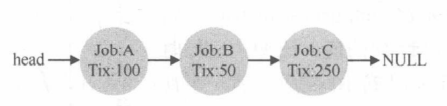

作出调度决策之前，首先要从彩票总数400中选择一个随机数(中奖号码)。假设选择了300.然后遍历链表，用一个简单的计数器帮助我们找到中奖者。

```C
int counter = 0;
int winner = getrandom(0, totaltickets);
node_t *current = head;
while(current)
{
    counter = counter + current->tickets;
    if(counter > winner)
        break;
    current = current->next;
}
```

代码从前往后遍历进程列表，将每张票的值加到counter上直到值超过winner。这时当前的列表元素所对应的进程就是中奖者。

### 6.4  一个例子

现简单研究一下两个相互互相竞争工作的完成时间。每个工作都有相同数目的100张彩票，以及相同的运行时间R(稍后会改变)。

这种情况下我们希望两个工作大约同时完成，但由于彩票调度算法的随机性，有时一个工作会先于另一个完成。为了量化这种区别，定义了一个简单的不公平指标U，其等于两个工作完成时刻相除得到U的值。目标是，完美的公平调度程序可以做到U = 1。

### 6.5  如何分配彩票

正如标题所示，这是一个棘手的问题，系统的运行严重依赖于彩票的分配。

### 6.6  为什么不是确定的

虽然随机方式可以使得调度程序的实现简单(且大致正确)，但偶尔不能产生正确的比例，尤其是在工作时间很短的情况下。由此得出一个==确定性的公平分配算法——步长调度==。

系统中每一个工作都有自己的步长，这个值与票数值成反比。上例中A、B、C三个工作的票数值分别是100、50、250，用大数10000除以票数得到步长，分别是100、200、40。称这些值为每个进程的步长。每次进程运行结束后会让它的计数器增加它的步长，记录它的总体进展。之后调度程序使用进程的步长及行程值来确定调度哪个进程。基本思路如下：当需要进行调度时，选择目前拥有最小行程值的进程，并且在运行之后将该进程的行程值增加一个步长。

## 第 7 章  多处理器调度(高级)

## 第 8 章  抽象：地址空间

### 8.1  早期系统

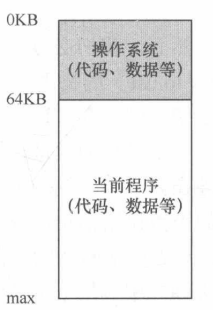

OS曾经是一组函数(实际上是一个库)，在内存中，然后有一个正在运行的程序(进程)，目前在物理内存中，并使用剩余的内存。

### 8.2  多道程序和时分共享

时分共享有一个问题就是：太慢了！特别是内存增长的时候，虽然保存和恢复寄存器级的状态信息相对较快，但将全部的内存信息保存到磁盘就太慢了

多个程序同时驻留在内存中，这使得保护成为重要问题。没有人希望一个进程可以读取其他进程的内存，更别说修改了。

### 8.3  地址空间

为了解决需求，OS需要提供一个易用的物理内存抽象，这个抽象叫做地址空间(address space)，是运行的程序看到的系统中的内存。

一个进程的地址空间包含运行的程序的所有内存状态，比如程序的代码必须在内存中，因此它们在地址空间里。当程序在运行时，利用stack来保存当前的函数调用信息，分配空间给局部变量。最后堆(heap)用于管理动态分配的、用户管理的内存，比如C++调用new获得内存。

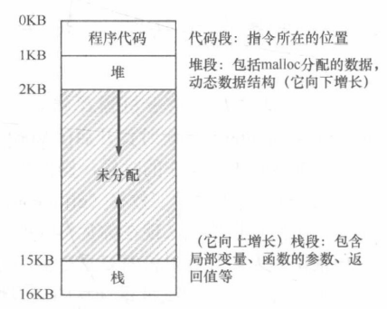

当我们描述地址空间时，所描述的是OS提供给运行程序的抽象。程序不在物理地址0~16KB空间中，而是加载在任意的物理地址。关键问题就是如何虚拟化内存？OS如何在单一的物理内存上为多个运行的进程构建一个私有的、可能很大的地址空间的抽象？

当OS这样做时，可以说OS在虚拟化内存，因为运行的程序认为它被加载到特定地址的内存中，并且具有很大的地址空间。然而现实却不是这样的。

隔离是建立可靠关系的关键原则。OS力求让进程彼此隔离，从而防止相互造成伤害。通过内存隔离，OS进一步确保运行程序不会影响底层OS的操作。

### 8.4  目标

虚拟内存系统的一个主要目标就是透明(transparency)，OS实现虚拟内存的方式应该让运行程序看不见，因此程序不应该感知到内存被虚拟化的试试，相反，程序的行为就好像它拥有自己的私有物理内存。

另一个目标就是效率(efficiency)。OS应该追求虚拟化尽可能高效，包括时间上(即不会使程序运行得更慢)和空间上(即不需要太多额外的内存来支持虚拟化)。

第三个目标是保护。OS应确保进程受到保护，不会受其他进程影响。当一个进程执行加载、存储或指令提取时，它不应该以任何方式访问或者影响其他进程或者OS本身的内存内容。

- 你看到的所有地址都不是真实的。只有OS通过精妙的虚拟化内存技术，知道这些指令和数据所在的物理内存的位置

- ```C
  #include <stdio.h>
  #include <stdlib.h>
  int main(int argc, char *argv[])
  {
      printf("location of code: %p\n", (void *) main);
      printf("location of heap: %p\n", (void *) malloc(l));
      int x = 3;
      printf("location of stack: %p\n", (void *) &x);
      return x;
  }
  ```

  

## 第 9 章  插叙：内存操作API

### 9.1  内存类型

运行一个C程序会分配两种类型的内存。第一种叫做栈内存，它的申请和释放操作是编译器隐式管理的，有时也被称为自动内存。对于长期内存的需求，就需要第二种类型的内存，即堆内存，其中所有的申请和释放操作都由程序员显式地完成。

```c
void func()
{
    int *x = (int *) malloc(sizeof(int));
}
```

首先编译器看到指针的声明，就知道为一个整型指针分配空间，随后当程序调用malloc()时，它会在堆上请求整数的空间，函数返回一个整数的地址，然后将其存储在栈中以供程序使用。

### 9.2  malloc()调用

## 第 10 章  机制：地址切换

在CPU虚拟化时，遵循的一般准则被称之为受限直接访问，这背后的想法很简单：让程序运行的大部分指令直接访问硬件，只在一些关键点(进程发起系统调用或发生时钟中断)由OS介入来确保"在正确的时间正确的地点，做正确的事"。为实现高效的虚拟化，OS应该尽量让程序自己运行，同时通过在关键点的及时介入来保存对硬件的控制。

同样虚拟内存时，如何高效、灵活地虚拟化内存？如何保持控制应用程序可访问的内存位置，从而确保应用程序的内存访问受到合理的限制？

答案是==基于硬件的地址转换，简称为地址切换(address translation)==。可以看成是受限直接访问这种一般方法的补充。利用地址转换，硬件对每次内存访问进行处理(即指令获取、数据获取或写入)，将指令中的虚拟地址转换为数据实际存储的物理地址。因此在每次内存引用时，硬件都会进行地址转换，将应用程序的内存引用重定位到内存中实际地址。

当然仅仅依靠硬件不足以实现虚拟内存，因为它只提供了底层机制来提高效率。OS必须在关键的位置介入，设置好硬件，以便完成正确的地址转换。因此它必须管理内存，记录被占用和空闲的内存位置，并明智而谨慎的介入，保存对内存使用的控制。

### 10.1  假设

先假设用户的地址空间必须连续地放在物理内存中，每个地址空间的大小完全一样

### 10.2  一个例子

为了更好的理解实现地址切换需要什么以及为什么需要，举个例子。设想一个进程的地址空间如图

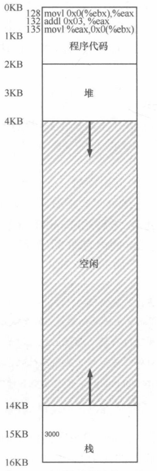

检测一小段代码：

```C
void func()
{
    int x;
    x = x + 3;
}
//转换为x86汇编
movl 0x0(%ebx), %eax	//假定x的地址已经存入寄存器ebx，通过movl指令将地址的值加载通用寄存器eax，					
addl $0x03, %eax		//对eax的值+3
movl %eax, 0x0(%ebx)	//将eax中的值写会到内存的同一位置
```

从上图可以看出，代码和数据都位于进程的地址空间。三条指令的执行，从进程的角度来看，发生了以下几次访问：

- 从地址128获取指令
- 执行指令(从地址15KB加载数据)
- 从地址132获取指令
- 执行指令(没有内存访问)
- 从地址135获取指令
- 执行指令(新值存入地址15KB)

从程序的角度来看，它的地址空间从0开始到16KB结束。它包含的所有内存引用都应该在这个范围内。然而对虚拟内存来说，OS希望将这个进程地址空间放在物理内存的其他位置，并不一定从地址0开始。问题来了！！！<u>怎么在内存中重定位这个进程，同时将该进程透明？怎么样提供一种虚拟地址空间从0开始的假象，而实际上地址空间位于另外某个物理地址？</u>

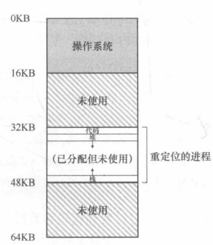

上图展示了例子，物理内存和单个重定位的进程，说明了这个进程的地址空间被放入物理内存后可能的样子。从图中可以看出，OS将第一块物理内存留给了自己，并将上述例子的进程地址空间重定位到从32KB开始的物理内存地址，剩下的两块内存空闲

### 10.3  动态(基于硬件)重定位

基于硬件的地址切换，第一次应用只是一个简单的思想，称之为基址加界限基址，又称为动态重定位。

每个CPU需要两个硬件寄存器：基址寄存器和界限寄存器。这俩寄存器能将地址空间放在物理内存的任何位置，同时又能确保进程只能访问自己的地址空间。

采用这种方式，在编写和编译程序时假设地址空间从0开始。但是当程序真正执行时，OS会决定其在物理内存中的实际加载地址，并将起始地址记录在基址寄存器中。正如上图所示，OS决定加载在物理地址32KB的进程，因此将基址寄存器设置为这个值。

而当进程运行时，该进程产生的所有内存引用，都会被处理器通过以下方式转换为物理地址:

physical address = virtual address + base

进程中使用的内存引用都是虚拟地址，硬件接下来将虚拟地址加上基址寄存器中的内容，得到物理地址，再发给内存系统。

例如：128：movl 0x0(%ebx)，%eax

- 程序计数器(PC)首先被设置为128，当硬件需要获取这条指令时，它先将这个值加上基址寄存器中的32KB，得到实际的物理地址32896.然后硬件从这个物理地址获取指令。
- 处理器开始执行指令。这时进程从虚拟地址15KB的加载，处理器同样将虚拟地址加上基址寄存器内容，得到最终的物理地址47KB，从而获得需要的数据。

将虚拟地址转换为物理地址，即地址转换技术。硬件取得进程认为它要访问的地址，将它转换成数据实际位于的物理地址。由于这种重定位是在运行时发生的，而且可以在进程开始运行后改变其地址空间，这种技术称为动态重定位。

开头提到还有一个寄存器，界限(限制)寄存器去哪了？界限寄存器提供了访问保护。在上面例子中界限寄存器被置为16KB。进程想要访问超过界限或者负数的虚拟地址，CPU将触发异常，进程最终可能被终止。CPU中负责地址转换的部分称为==内存管理技术MMU==。

- 转换实例

  - 设想进程拥有4KB大小地址空间，它被加载到从16KB的物理内存中。

    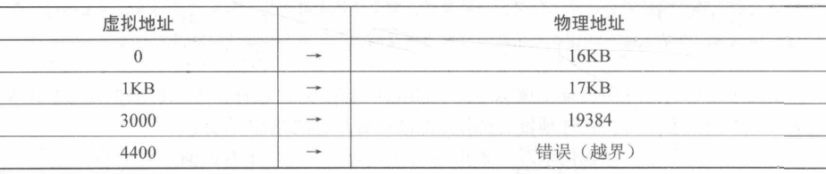

### 10.4  硬件支持：总结

首先需要两种CPU模式。OS在特权模式(内核模式)可以访问整个机器资源。应用程序在用户模式操作只能做有限的操作。只要一个位，也许保存在处理器状态字中，就能说明当前的CPU工作模式。

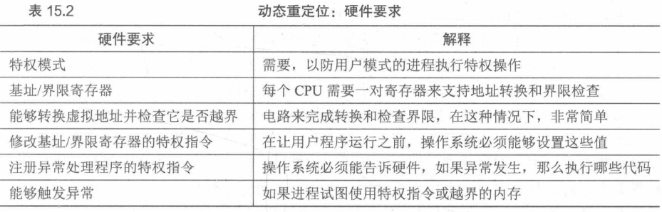

其次硬件还需要提供基址和界限寄存器。上节中提到

再就是硬件还需要提供一些特殊的指令，用于修改基址寄存器和界限寄存器，允许OS在切换进程时改变它们。指令是特权指令，只有在内核模式下，才能修改这些寄存器。

最后，在用户程序尝试非法访问内存(越界访问)时，CPU必须能够产生异常

### 10.5  操作系统的问题

为了支持动态重定位，硬件添加了新的功能，使得OS有了一些必须处理的新问题。硬件系统和操作系统管理结合在一起，实现了一个简单的虚拟内存

- 首先，在进程创建时，OS必须采取行动，为进程的地址空间找到内存空间。

- 第二，在进程终止时(正常退出或者因行为不端被强制终止)，OS也必须做一些工作，回收它的所有内存，给其他进程或者OS使用。在进程终止时，OS会将这些内存放回到空闲列表，并根据需要清除相关的数据结构

- 第三，在上下文切换时，OS也必须执行一些额外的操作。每个CPU毕竟只有一个基址寄存器和一个界限寄存器，但对于每个运行的程序，它们的值都不同，因为每个程序被加载到内存中不同的物理地址。所以在切换进程时，OS必须保存和恢复基础和界限寄存器。具体来说，当OS觉得终止当前的运行程序时，它必须将当前的基址和界限寄存器中的内容保存在内存中，放在某种每个进程都具有的进程中，如进程结构或者进程控制块。

  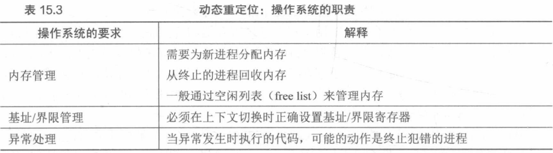

* 值得注意的是，当进程停止时(没有运行)，OS可以改变其物理内存的地址空间。如何实现？

  OS先让进程停止运行，然后将地址空间拷贝到新位置，最后更新保存的基址寄存器，指向新位置。当进程恢复运行时，它的基址寄存器会被恢复，它再次开始运行，显然它的指令和数据都在新的内存位置了。

* 第四，OS必须提供异常处理程序，或者一些调用的函数

### 10.6  小结

直接说缺点。效率低下！！！在某个例子中。重定位的进程使用了从32KB到48KB的物理内存，但该进程的堆和栈并不是很大。这就造成了内存空间上的大量的浪费。通常将这种浪费称之为内部碎片。为了避免这种浪费，下面介绍分段的概念

## 第 11 章  分段

目前为止，一直假设将所有进程的地址空间完整地加载到内存中，利用基址寄存器和界限寄存器，OS很容易将不同进程重定位到不同的物理区域。但是对于这些内存区域，栈与堆之间有一块空闲区域。

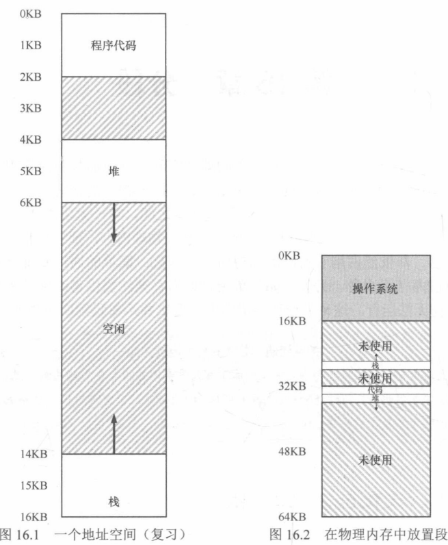

图16.1所示，如果将整段地址空间放入物理内存，那么堆与栈之间的空间并没有被进程利用，却依然占用了实际的物理内存。所以，上一章所介绍的通过基址与界限寄存器实现的虚拟内存会被浪费。除此以外，如果剩余物理内存无法提供连续区域来放置完整的地址空间，进程就无法运行。

### 11.1  分段：泛化的基址/界限

思路很简单，在MMU中引入不止一个基址和界限寄存器对，而是给地址空间内的每个逻辑段一对。一个段只是地址空间里的一个连续定长的区域，在典型的地址空间有三个逻辑不同的段：代码、堆、栈。分段的机制使得OS能够将不同的段放到不同的物理内存区域，这就避免了虚拟地址空间中的未使用部分占用部分物理内存。

如图16.2所示，通过给每个段一对基址和界限寄存器，可以将每个段独立地放入物理内存。64KB中的物理内存中放置了3个段(为OS留下16KB)。

显然，只有已用的内存才能在物理内存中分配空间。

需要MMU中的硬件结构来支持分解：需要一组3对基址和界限寄存器。

利用图16.1，举一个地址转换的例子。假设要引用虚拟地址100，MMU将基址值加上偏移量(100)得到实际的物理地址：100 + 32KB = 32868。然后它会检查该地址是否在界限内，发现在界限内就对物理地址32868的引用。

- 段错误：在支持分段的机器上发生了非法的内存访问。

虚拟地址4200(在堆中)。如果用虚拟地址加上堆的基址(34KB)，得到物理地址39016，这是不对的。首先应该先减去堆的偏移量，即该地址指的是这个段中的哪个字节。因为堆从虚拟地址4K(4096)开始，4200的偏移量实际上是4200-4096即104，用104加上基址寄存器的34KB即(物理地址)，得到实际的物理地址34920

### 11.2  引用哪个段

硬件在地址转换时使用段寄存器，它是如何知道段内的偏移量的？以及地址引用了哪个段？

一种常见方式就是显式防水，就是用虚拟地址的开头几位来标识不同的段。某些系统使用了这种技术。之前的例子中有3个段，因此需要两位来标识。

如果用14位虚拟地址的前两位来标识，就如图所示

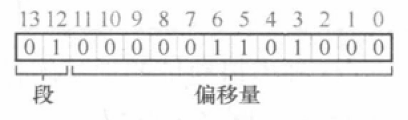

### 11.3  栈怎么办

在表16.1中，栈被重定位到物理地址28KB。但是它是反向增长。在物理内存这个它始于28KB，增长回到26KB，相应虚拟地址从16KB到14KB，地址切换肯定与有所不同。

要解决栈的问题，首先需要一点硬件支持。除了基址和界限外，硬件还需要段的增长方向。如下表所示，更新了硬件记录的视图。

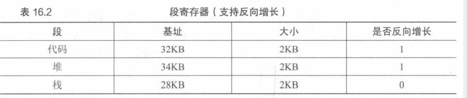

硬件理解段可以反向增长后，这种虚拟地址的地址切换必须有点不同，举一个例子。

假设要访问虚拟地址15KB，它应该映射到物理地址27KB。该虚拟地址的二进制形式是：11 1100 0000 0000(十六进制是0x3C00)。硬件利用前两位来指定段，但然后要处理偏移量3KB。为了得到正确的反向偏移，必须从3KB中减去最大的段地址：在此例中最大短地址可以是4KB，所以正确偏移量可以是-1KB，再加上基址28KB，即可得到物理地址27KB。用户可以进行界限检查，确保反向偏移量的绝对值小于段的大小。

### 11.4  支持共享

分段机制的不断发展，通过多一点的硬件支持，就可以实现新的效率提升。具体来说，要节省内存，有时候在地址空间之间==共享(share)某些内存段==是有用的。

为了支持共享需要一些额外的硬件支持，也就是保护位。基本为每个段增加了几个位，标识程序是否能够读写该段，或执行其中的代码。通过将代码段标记为只读，同样的代码可以被多个进程共享，而不用担心破坏隔离。虽然每个进程都认为自己独占这块内存，但OS秘密地共享了内存，进程不能修改这些内存，所以假象得以保持。

下表是硬件和OS记录的额外信息。可以看到，代码段的权限是可读和可执行，因此物理内存的一个段可以映射到多个虚拟地址空间

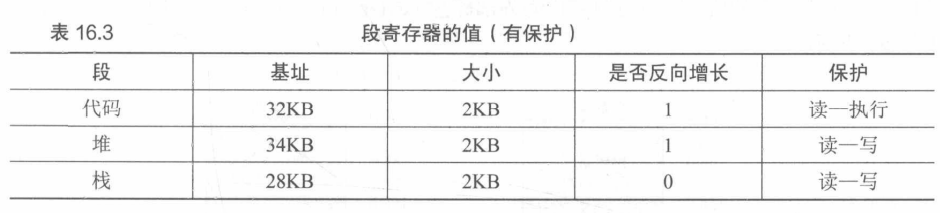

有了保护位，除了检查虚拟地址是否越界硬件还要检查特定访问是否允许。

### 11.5  细粒度和粗粒度的分段

针对只有很少的几个段的系统(即代码、栈、堆)，可以认为这种分段是粗粒度的，只是将地址空间分成较大的、粗粒度的块。早期系统允许将地址空间划分为大量较小的段，这被称为细粒度分段

支持许多段需要进一步硬件的支持，并在内存中保存某种段表。这种段表通常支持创建非常多的段。

### 11.6  操作系统支持

系统运行时，地址空间中的不同段被重定位到物理内存中。这种方法节省了大量的物理内存。具体说就是，堆和栈之间没有使用的区域就不需要再分配物理内存，能将更多地址空间放进物理内存。

但是分段也会带来许多问题。

- 第一。OS在上下文切换时应该注意什么？各个段寄存器中的内容必须保存和恢复。每个进程都有自己独立的虚拟空间，OS必须在进程运行前，确保这些寄存器被正确地赋值。

- 第二个问题。管理物理内存的空闲空间。新的地址空间被创建时，OS需要在物理内存中为它的段找到空间。之前假设所有的地址空间大小相同，物理内存可以认为是一些槽块，进程可以放进去。一般遇到的问题是，物理内存很快充满了许多空闲空间的小洞，因此很难分配给新的段，或者扩大已有的段，这被称为外部碎片

  - 内部碎片与外部碎片的比较。可以这么理解，内部碎片占着茅坑不拉屎，外部碎片就是虽然还有茅坑，但是胖子太胖了，挤不进去。

  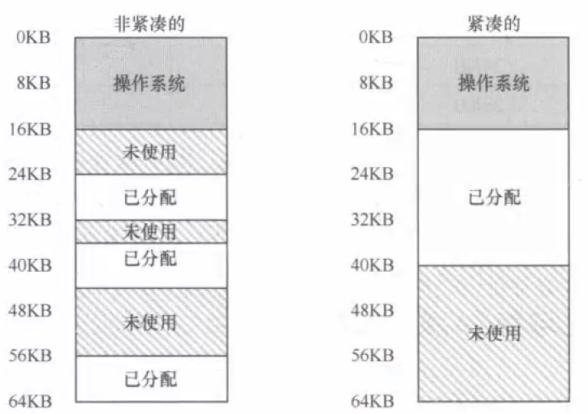

  上例中，一个进程需要分配一个20KB的段，当前只有24KB空闲空间，但并不连续，所以OS无法满足20KB的要求

  另一种方案就是紧凑物理内存，重新安排原有的段。例如，OS会先终止运行的程序，将它们的数据复制到连续的内存区域中去，改变它们的段寄存器中的值，指向新的物理地址，从而得到连续空闲空间。这样做，OS能让新的内存分配请求成功。缺点就是内存紧凑成本很高，拷贝段是内存密集型的，一般会占用大量的处理器时间

- 另一种简单的做法就是利用空闲列表管理算法，试图利用大的内存块用于分配。算法成百上千，但都无法完全消除外部碎片，只能试图减小。

## 第 12 章 空闲内存管理

先暂缓对虚拟内存的研究，本章来讨论所有内存管理系统的一个基本方面，**空闲空间的管理**。

需要管理的空间被划分为固定大小的单元就很容易，只需维护大小固定的单元列表，如果有需求就返回列表的第一项。

如果需要管理的空闲空间有大小不同的单元构成，管理就会很困难。这种情况出现在用户级的内存分配库(malloc( )和free( ))，或者OS用分段的方式实现虚拟内存。这两种情况下出现了外部碎片问题。本章问题就是如何管理空闲空间？什么策略可以让碎片最小化？

### 12.1  假设

```C
void* malloc(size tsize);
```

需要一个参数size，它是应用程序请求的字节数。函数返回一个指针(没有具体的类型，在C中是void类型)，指向这样大小的一块空间。对应的函数 void free(void *ptr)函数接受一个指针，释放对应的内存块。接口有个隐含含义，在释放空间时，用户不需要告知库这块空间的大小。因此在只传入一个指针的情况下，库必须能够搞清楚这块内存大小。怎么得知的暂且按下不表。

该库管理的空间由于历史原因被称为堆，在堆上管理空闲空间的数据结构称之为**空闲列表**。该结构包含了管理内存区域所有空闲块的引用。

进一步假设，因为主要关心的是外部碎片，当然分配程序也可能有内部碎片。如果分配程序给出的内存块超出请求的大小，在这种块中超出请求的空间(未使用)就被认为是内部碎片(浪费发生在已分配单元的内部)。但本章主要讨论外部碎片。

继续假设，内存一旦被分配给客户，就不可以重定位到其他位置。例如，一个程序调用malloc( )，并获得一个指向堆中一块空间的指针，这块区域就属于这个程序了，库不再可以移动，直到程序调用free( )函数将它归还。因此不可能进行紧凑空闲空间的操作从而减少碎片。但OS可以实现分段时，通过紧凑来减少碎片。

最后再假设，分配程序所管理的是连续的一块字节区域，某些情况下，分配程序可以要求这块区域增长。

### 12.2  底层机制

- 分割与合并

  - 空闲列表包含一组元素，记录了堆中的哪些空间还没有被分配。

    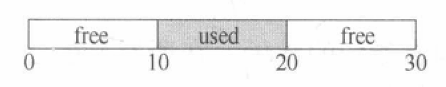

    这个堆对应的空闲列表会有两个元素，一个描述(0-9)，另一个描述(20-29)

    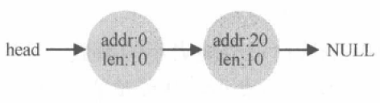

    可以看出任何大于10字节的分配请求都会失败(没有足够的连续空间可用)，申请小于10字节空间会发生什么？

    假设只申请1字节的内存。分配程序会执行**分割(splitting)动作**：找到一块可以满足要求的空闲空间，将其分割，第一块返回给用户，第二块留在空闲列表中。假设遇到申请0字节，分配程序选择第二块空闲空间，对malloc'( )的调用会返回20(1字节分配区域的地址)，空闲列表变为：

    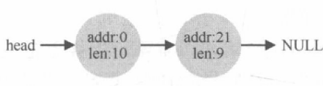

  - 分配程序还有另外一种机制，名为合并(coalescing)。

    对于一开始的小堆，如果应用程序调用free( )归还堆中间的空间，如果只是简单地将这块空闲空间加入空闲列表，可能会出现整个堆完全空闲但被分割成3个10字节的区域，这时如果要请求20字节的空间，会返回NULL

    为了避免这种现象，分配程序会在释放一块内存时合并可用空间。思路：归还一块空闲内存时，仔细查看要归还的内存块的地址以及邻近的空闲空间块。如果新归还的空间与一个原有空闲块相邻，就将它们合并为一个较大的空闲块，如图：

    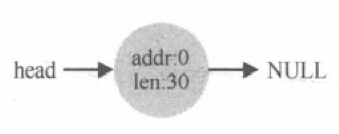

- 追踪已分配空间的大小

  - free( void *ptr )接口没有块大小的参数。要完成确定要释放空间大小这项任务，大多数分配程序都会在头块(header)保存一点额外的信息，它在内存中，通常就在返回的内存块之前。举个例子

    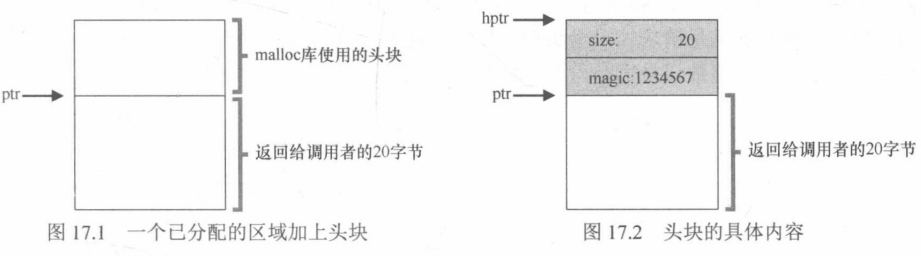

    检查一个20字节的已分配块，假定一个简单的头块包含了分配空间的大小和一个幻数(提供完整性检查)

    ```C
    typedef struct header_t
    {
        int size;
        int magic;
    }header_t
    ```

    用户调用free(ptr)时，库会通过简单的指针运算得到头块的位置：

    ```C
    void free(void *ptr)
    {
        header_t *hptr = (void *)ptr - sizeof(header_t);
    }
    ```

    获得头块的地址后，库很容易地确认幻数是否符合预期值，作为正常性检查(hptr->magic == 1234567)，并简单计算要释放的空间大小(==即头块的大小 + 区域长度==)。因此，如果用户请求N字节的内存，库不是寻找N字节大小的空闲块，而是寻找N加上头块大小的空闲块。

- 嵌入空闲列表

  - 目前为止，讨论的空闲列表只是概念上的，就是一个列表，描述了堆中的空闲内存快，如何在空闲内存内部建立一个这样的列表呢?

  - 空闲空间本身中建立空闲空间列表 ！！！(?)

  - 假设需要管理一个4096字节的内存块。为了将其作为空闲空间列表来管理，首先要初始化列表。开始时，列表中只有一个条目，记录了大小为4096的空间(减去头块的大小)，一个节点的描述

    ```c
    typedef struct node_t
    {
        int size;
        struct node_t *next;
    }node_t;
    ```

  - 接下来的代码初始化堆，并将空闲列表的第一个元素放在该空间中。堆构建在某块空闲空间上，这块空间通过系统 mmap( )调用

    ```C
    typedef struct node_t
    {
        int size;
        struct node_t *next;
    }node_t;
    node_t *head = mmap(NULL, 4096, PROT_READ|PROT_WRITE, 			     MAP_ANON|MAP_PRIVATE, -1, 0);
    head->size = 4096 - sizeof(node_t);
    head->next = NULL;
    ```

    这之后，列表的状态是它只有一个条目，记录大小为4088。

    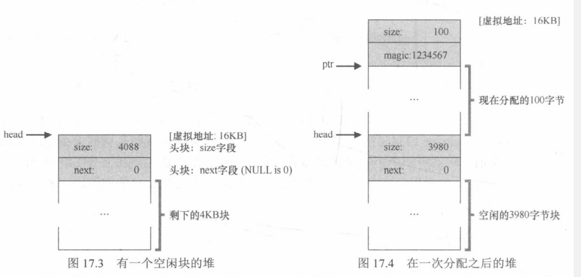

    head指针指向这块区域的起始地址，假设16KB，如图3所示。

  - 现在假设有一个100字节的内存请求，库首先要找到一个足够大小的块。因为只有一个大小4088字节的块，将其选中。然后这个块被分割为两块：一块足够满足请求(以及头块)，一块是剩余的空闲块。假设记录头块为8个字节(一个整数记录大小，一个整数记录幻数)，堆中空间如图17.4所示。
  
  - 至此，对于100字节的请求，库从原有的空闲块中分配了108字节，返回指向它的一个指针，并在其之前连续的8字节中记录头块信息，供未来的free( )函数使用。同时将列表中的空闲节点缩小为3980字节(4088-108)
  
  - 现在该堆有3个已分配区域，每个100(加上头块是108)
  
    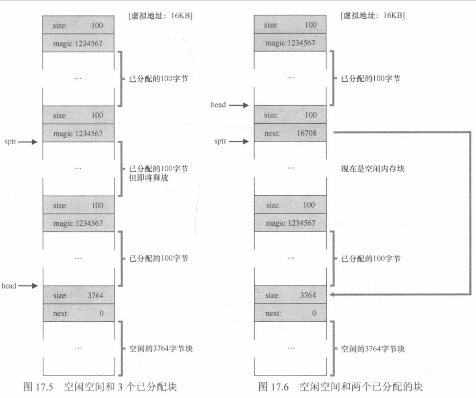
  
    可以见得，堆的前324字节已经分配，该空间有3个头块，以及3个100字节的用户使用空间。空闲列表还是只有一个节点(由head指向)，经过3次分配，现在只有3764字节，用户通过free( )归还一些内存会发生什么？
  
  - 此例中，调用free(16500)，归还了中间的一块已分配空间(内存块的起始地址16384+前一块的108+这一块的头块的8字节)，值在图中用sptr指向。库清除了要释放空间的大小，并将空闲块加回空闲列表。假设要插到空闲列表的头位置。现在空闲列表包括一个小空闲块(100字节有列表的头指向)和一个大空闲块(3764字节)，空闲空间块被分割成两段。如果另外两个已分配的块也被释放，空闲列表会非常破碎，所以需要合并相邻块，将堆重新变为一个整体。
  
- 让堆增长

  如果堆中的内存空间耗尽应该怎么办？最简单的办法就是返回失败。说是这么说，但是，一般传统的分配程序会从很小的堆开始，当空间耗尽时，再向OS申请更大的空间。通常，这意味着它们进行了某种系统调用，让堆增长。例如UNIX系统中sbrk调用，OS在执行sbrk系统调用时会找到空闲的物理内存页，将它们映射到请求进程的地址空间中去，并返回新的堆的末尾地址，有了更大的堆，请求就可以满足。

### 12.3  基本策略

理想的分配程序可以保证快速和碎片最小化。很遗憾，由于分配及释放的请求序列是任意的

#### 12.3.1  最优匹配

Best Fit：首先遍历整个空闲列表，找到和请求大小一样或更大的空闲块，然后返回候选者中最小的一块。只需一次遍历就能找到正确的块并返回。

代价就是要付出较高的性能代价

#### 12.3.2  最差匹配

Worst Fit：尝试找到最大的空闲块，分割并满足用户需求后，将剩余的块(很大)加入空闲列表。最差匹配尝试在空闲列表中保留较大的块而不是像最优匹配那样可能剩下很多难以利用的小块。但是最差匹配同样遍历整个空闲列表。更糟糕的是，它会导致过量的碎片同时还有高开销。

#### 12.3.3  首次匹配

First Fit：找到第一个足够大的块，将请求的空间返回给用户。同样，剩余的空闲空间留给后续请求。这种算法有速度优势，但有时会让空闲列表开头部分有很多小块。所以重点问题就是如何管理空闲列表的顺序。一种方式是基于地址排序。通过保持空闲块按内存地址有序，合并操作就会容易从而减少内存碎片

#### 12.3.4  下次匹配

不同于首次匹配每次都从列表的开始查找。Next Fit算法多维护一个指针，指向上一次查找结束的位置，其想法是将对空闲空间的查找操作扩散到整个列表中去，避免对列表开头频繁的分割。

### 12.4  其他方式

#### 12.4.1  分离空闲列表

#### 12.4.2  伙伴系统

## 第 13 章 分页：介绍

OS有两种方法来解决大多数空间管理问题。第一种就是将空间分割成不同长度的分片，就像虚拟内存管理中的分段。然而这种方法会让空间碎片化。第二种方法，将空间分割成固定长度的分片，在虚拟内存中奖这种思想称之为==分页==。分页不是将一个进程的地址空间分割成几个不同长度的逻辑段(即代码、堆、段)，而是分割成固定大小的单元，每个单元称为一页。相应地把物理内存看成是定长槽块的阵列，叫做页帧(page frame)。每个这样的页帧包含一个虚拟内存页。问题就是如何通过页实现虚拟内存。

### 13.1  一个简单例子

如图所示，展示了一个只有64字节大小地址空间，有4个16字节的也(虚拟页0、1、2、3)。物理内存，也有一组固定大小的槽块组成，此例中有8个页帧(由128字节物理内存)。可以看出，虚拟地址空间的页放在物理内存的不同位置。OS也自己用了一些物理内存。

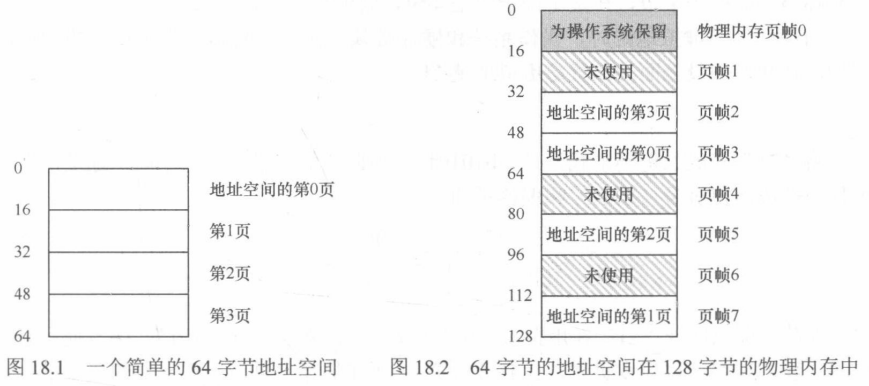

分页有许多优点，最大的改进就是灵活性：完善的分页方法，OS能够高效地提供地址空间的抽象，不管进程如何使用地址空间。另一个优点就是分页提供的空闲空间管理的简单性。例如：如果OS希望将64字节的小地址空间放到8页的物理地址空间，它只需要找到4个空闲页。

为了记录地址空间的每个虚拟页放在物理内存中的位置，OS通常要为每一个进程保存一个数据结构称为页表(page table)。页表的主要作用是为地址空间的每个虚拟页面保存地址转换，从而让我们知道每个页在物理内存中的位置。对于此例，页表有4个条目：(虚拟页0→物理帧3)、(VP1→PF7)、(VP2→PF5)、(VP3→PF2)

重要的是，此例中的页表是一个进程的数据结构。运行另一个进程，OS将不得不为它管理不同的页表，因为它的虚拟页显然映射到不同的物理页面。

现完成一个地址转换的例子。设想拥有这个小地址空间(64字节)的进程正在访问内存：

```mov  <virtual address>，%eax```

注意从地址<virtual address>到寄存器eax的数据显式加载

转换过程生成的虚拟地址，必须将其分为2个组件：虚拟页面号(virtual page number,VPN)和页内的偏移量(offfset)。此例中，因为进程的虚拟地址空间是64字节，所以虚拟地址总共需要6位，将其表示成：

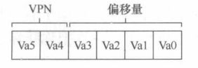

Va5是虚拟地址的最高位，Va0是最低位。因为页的大小为16字节，将其进一步划分虚拟地址。页面大小为16字节，位于64字节是地址空间，因此需要能够选择4个项，地址的前2位就是来完成这项任务的。所以有一个2位的虚拟页号，其余的位告诉我们，感兴趣该页的哪个字节。

进场生成虚拟地址时，OS和硬件必须协作，将其转换成有意义的物理地址。假设上面加载的是虚拟地址21，

```
movl 21，%eax
```

21的二进制即010101。分析虚拟地址21是如何分解成虚拟页号VPN和偏移量的？

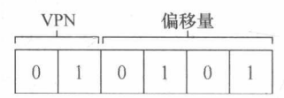

因此，虚拟地址21在虚拟页01的第五个自解除。通过虚拟页表，可以检索页表，找到虚拟页1所在的物理页面。在上面的页表中，物理帧号是7，因此用物理帧号PFN替换VPN来转化虚拟地址，然后将载入发送给物理内存。

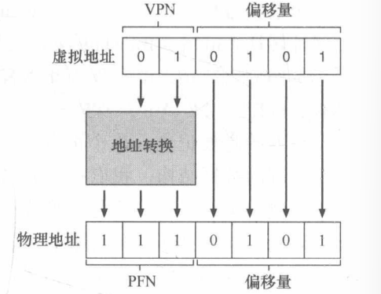

显然可见，偏移量保持不变，偏移量只是告诉我们页面中的哪个字节是我们感兴趣的。最终物理地址是1110101。

### 13.2  页表存在哪里

页表会变得非常大，是因为没有在MMU中利用特殊的片上硬件，来存储当前正在运行的进场的页表，而是将每个进场的页表保存在内存中。

### 13.3  列表中究竟有什么

页表是一种数据结构，用于将虚拟地址映射到物理地址。最简单的形式称为线性页表，就是一个数组。OS通过==虚拟页号VPN==检索该数组，并在该索引处查找==页表项(PTE)==，以便找到期望的==物理帧号PFN==。对于每个PTE，在其中有许多不同的位。

- 有效位(valid bit)
  - 通常用于指定特定地址转换是否有效。例如当一个程序开始时，它的代码和堆在其地址空间的一侧，栈在另一端。所有未使用的中间空间都被标记为无效。可以节省大量内存
- 保护位(protection bit)
  - 表明页是否可以读取、写入或执行
- 存在位(present bit)
  - 表示该页是在物理存储器还是在磁盘上。
- 脏位(dirty bit)
  - 表明页面被带入内存后是否被修改过。
- 参考位(reference bit)
  - 有时用于追踪页是否被访问，也用于确定哪些页很受欢迎应该保留在内存中
- 等等

### 13.4  分页：也很慢

上一节提到内存中的页表，它可能会太大，事实上它也会让速度变慢。例如

```
movl 21,%eax
```

只看对地址21的显式引用，而不关心指令获取。假定硬件为我们执行地址转换。要货期所需数据，系统必须将虚拟地址21转换为正确的物理地址117。因此，地址117获取数据之前，系统必须首先从进场的页表中提取适当的页表项，执行转换，然后从物理内存中加载数据。为此，硬件必须知道当前正在运行的进程页表的位置。先假设一个页表基址寄存器包含页表的起始位置的物理地址。为了找到想要的PTE，硬件将执行以下功能

```
VPN = (VitualAddress & VPN_MASK) >> SHIFT
PTEAddr = PageTableBaseRegister + (VPN * sizeof(PTE))
```

VPN_MASK被设置为0x30，它从完整的虚拟地址中挑选出VPN位；SHIFT设置位4(偏移的位数)，这样就可以将VPN位右移以形成正确的整数虚拟页码。例如使用虚拟地址21(010101)，掩码将此值转换为010000，移位将它变成01，然后使用该值作为页表基址寄存器指向的PTE数组的索引。

一旦知道了这个物理地址，硬件就可以从内存中获取PTE，提取PFN，并将它与来自虚拟地址的偏移量连接起来，形成所需的物理地址。具体来说，可以想象PFN被SHIFT左移，然后与偏移量进行或运算，以形成最终地址。

### 13.5  内存追踪

通过一个简单的内存访问实例，来演示使用分页时产生的所有内存访问。

假设一个64KB大小的虚拟地址空间，假定页面大小为1KB。现在需要知道页表的内容，以及它在物理内存中的位置。有一个线性的页表，它位于物理地址1K。至于其内容，只需要关心为这个例子映射的几个虚拟页面。首先，存在代码所在的虚拟页面。由于页大小为1KB，虚拟地址1024驻留在虚拟地址空间的第二页，假设虚拟页映射到物理帧4。接下来就是数组本身。它的大小是4000字节，假设其驻留在虚拟地址40000到44000。

当程序运行时，每个获取指令将产生两个内存引用，一个访问页表以查找指令所在的物理框架，另一个访问指令本身将其提取到CPU处理。另外，在mov指令的形式中，有一个显式的内存引用，这会增加另一个页表访问(将数组虚拟地址转换为正确的物理地址)，然后数组访问本身

​	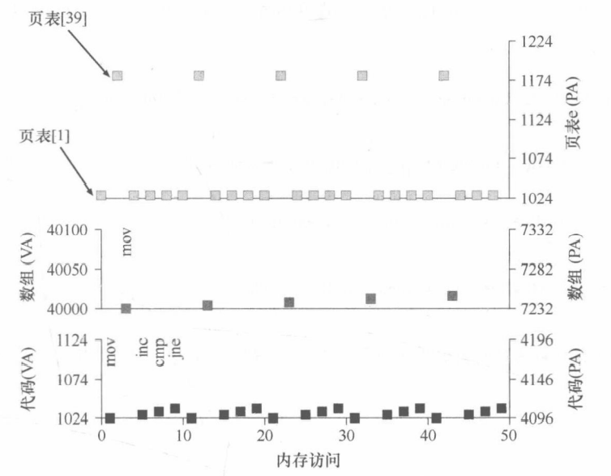																											

上图展示了前5次循环迭代的整个过程，最下面的图显示了y轴上的指令内存引用(黑色虚拟地址和右边的实际物理地址)。中间的图展示了深灰色的数组访问。最上方的图展示了浅灰色的页表访问

## 第 14 章  分页：快速地址转换(TLB)

使用分页来作为核心机制来实现虚拟内存，可能会带来较高的性能开销。原因是要使用分页，就要将内存地址空间切分成大量固定大小的单元页，并且需要记录这些单元的地址映射信息，这些映射信息一般存储在物理内存中，所以在转换虚拟地址时，分页逻辑上需要一次额外的内存访问。每次指令获取、显式加载或保存，都需要额外赌读一次内存以得到转换信息，这是非常慢的，所以问题就是：如何加速地址转换，避免额外的内存访问？OS应该如何支持？

想让某些东西变快，OS通常需要一些帮助，这种帮助常常来自OS的老朋友：硬件！要增加==地址转换旁路缓冲存储器(translation-lookaside buffer,TLB)==，它就是频繁发生的虚拟到物理地址转换的==硬件缓存(cache)==。对每次内存访问，硬件先检查TLB，看看其中是否有期望的转换映射，如果有就会完成转换，不用访问页表

### 14.1  TLB的基本算法

假定使用简单的线性页表和硬件管理的TLB。大体框架如下


大体流程：首先从虚拟地址中提取页号(VPN)，谈后检查TLB是否有该VPN的转换映射。如果有，那就TLB命中，TLB有该页的转换映射，接下来就从相关的TLB项中提取页帧号PFN，与原来的虚拟地址的偏移量组合形成期望的物理地址PA，并访问内存，假定保护检查没有失败。如果CPU没有在TLB中没有找到转换映射，会有一些操作。本例中，硬件访问页表来寻找转换映射，并用该转换映射更新TLB，假设该虚拟地址有效，而且有相关的访问权限。上述系列操作开销较大，主要是因为访问页表需要额外的内存引用。最后当TLB更新成功，系统会尝试重新该指令，这是TLB有了这个转换映射，内存引用很快就会得到处理。

### 14.2  实例：访问数组

一个简单的虚拟地址的追踪。假设有一个由10个4字节整型数组成的数组，起始虚地址是100,。进一步假定，有一个8位的小虚拟地址空间，页大小为16B，可以把虚拟地址划分为4位的VPN(有16个虚拟内存页)，4位的偏移量(每个页有16个字节)。布局如图所示

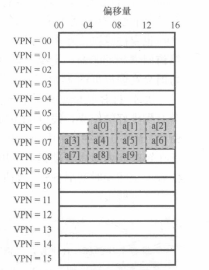

在系统的16个16字节的页上，数组第一项开始于(VPN = 06，OFFSET = 04)，只有三个4字节整型数放在该页。数组在下一页继续。考虑用一个简单的循环访问数组中的每一个元素

```C
int sum = 0;
for(i = 0; i < 10; i++){
    sum += a[i]; 
}
```

先假装循环产生的内存访问只是针对数组(忽略变量i和sum，以及数组本身)，当访问第一个数组元素时，CPU会看到载入虚拟地址100，硬件从中提取VPN，然后用它来检查TLB，寻找有效的转换映射，假设这是第一次访问该数组，结果是TLB未命中。接着访问a[1]，TLB命中，因为第二个元素在第一个元素在之后，两个元素在同一页，之前访问第一个元素时已经访问了这一页，所以TLB中缓存了该页的转换映射，因此命中成功。a[2]同意命中成功，但是a[3]会导致命中失败。系统再次查找页表，弄清楚这个虚拟地址在物理内存中的位置，并相应地更新TLB最后，访问a[7]会导致最后一次TLB未命中。系统会再次查找页表，弄清楚这个虚拟页在物理内存中的位置，并相应地更新TLB。

### 14.3  谁来处理TLB未命中

现代的体系结构，发声TLB未命中时，硬件系统会抛出一个异常，这会暂停当前的指令流，将特权模式提升至内核模式，跳转至陷阱处理程序。这段程序在运行时，会查找页表中的转换映射，然后用特别的”特权“指令更新TLB，并从陷阱返回。

值得注意的几个点：

- 首先，从陷阱返回指令稍不同于之前提到的服务于系统调用的从陷阱返回。在后一种情况下，从陷阱返回应该继续执行陷入OS之后的那条指令，就像从函数调用返回后，会继续执行此次调用之后的语句。在前一种情况下，在从TLB未命中的陷阱返回后，硬件必须从导致陷阱的指令继续执行。这次重试导致该指令继续执行，但这次会命中TLB。根据陷阱或异常的原因，系统在陷入内核时必须保存不同的程序计数器。
- 在运行TLB未命中处理代码时，OS需要避免引起TLB未命中的无限递归。

### 14.4  TLB的内容

一条TLB项内容可能像下面这样：

VPN | PFN | 其他位

VPN和PFN同时存在于TLB中，因为一条地址映射可能存在于任意位置。

### 14.5  上下文切换时对TLB的处理

TLB中包含的虚拟到物理的地址映射只对当前进程有效，对其他进程是没有意义的。所以在发生进程切换时，硬件或OS必须确保即将运行的进程不要误读之前进程的地址映射。

举个例子，当前进场P1正在运行，假设TLB缓存了对它有效的地址映射，此例中假设P1的10号虚拟页映射到100号物理帧。假设还有一个进场P2，OS不久后决定进行一次上下文切换，运行P2，假定P2的10号虚拟页映射到170号物理帧，如果两个进场的地址映射都在TLB中，内容如下：

| VPN  | PFN  | 有效位 | 保护位 |
| ---- | ---- | ------ | ------ |
| 10   | 100  | 1      | rwx    |
| -    | -    | 0      | -      |
| 10   | 170  | 1      | rwx    |
| -    | -    | 0      | -      |

显然，VPN10被转换成PFN100(P1)和PFN170(P2)，但硬件分不清哪个项属于哪个进程，所以要让TLB正确高效地支持跨多进程的虚拟化。问题就是进程切换时如何管理TLB的内容？发声进程间上下文切换，上一个进程在TLB中的地址映射对于即将运行的进程是没有意义的。对此，有一些可能的方案：在上下文切换时，简单地清空TLB，但这有一定的开销，每次进程运行，当它访问数据和代码页时，都会触发TLB未命中。为了减少开销，可以增加硬件支持，实现跨上下文切换的TLB共享。比如在TLB中添加一个地址空间标识符ASID，可以将其看成进程标识符。

### 14.6  TLB替换策略

### 14.7  实际系统的TLB表项

## 第15章  分页：较小的页

### 15.1  简单的解决方案：更大的页

### 15.2  混合方法：分页和分段

### 15.3  多级页表

### 15.4  反向页表

### 15.5  将页表交换到磁盘

## 第16章  超越物理内存：机制

### 16.1  交换空间

### 16.2  存在位

16.3  页错误

16.4  内存满了怎么办

16.5  页错误处理流程

16.6  交换何时真正发生

第17章  超越物理内存：策略

17.1  缓存管理

17.2  最优替换策略

17.3  简单策略：FIFO

17.4 另一简单策略：随机

17.5  利用历史数据：LRU

17.6   工作负载示例

17.7  实现基于历史信息的算法

17.8  近似LRU

17.9  考虑脏页

17.10  其他虚拟内存策略

17.11 抖动

第18章  VAX/VMS虚拟内存系统

18.1  背景

18.2  内存管理硬件

18.3  一个真实的地址空间

18.4  页替换

18.5  其他漂亮的虚拟内存技巧
